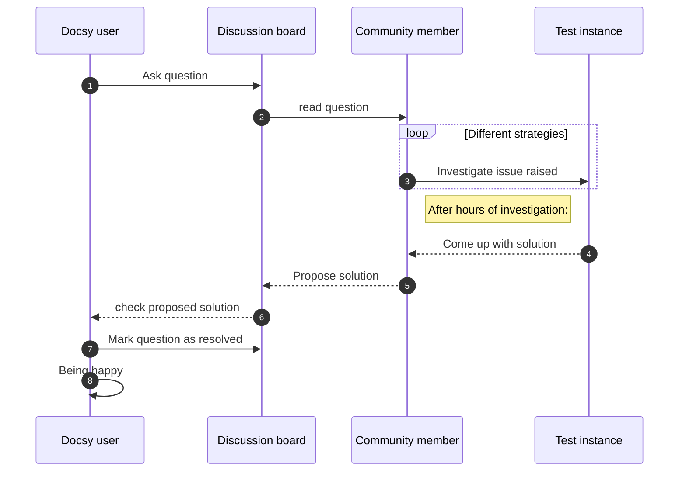

Docsy has built-in support for a number of diagram creation and typesetting
tools you can use to add rich content to your site, including \(\KaTeX\),
Mermaid, Diagrams.net, PlantUML, and MarkMap.

## LaTeX support with KaTeX

[\(\LaTeX\)](https://www.latex-project.org/) is a high-quality typesetting
system for the production of technical and scientific documentation. Due to its
excellent math typesetting capabilities, \(\TeX\) became the de facto standard
for the communication and publication of scientific documents, especially if
these documents contain a lot of mathematical formulae. Designed and mostly
written by Donald Knuth, the initial version was released in 1978. Dating back
that far, \(\LaTeX\) has `pdf` as its primary output target and is not
particularly well suited for producing HTML output for the Web. Fortunately,
with [\(\KaTeX\)](https://katex.org/) there exists a fast and easy-to-use
JavaScript library for \(\TeX\) math rendering on the web, which is embedded
into Hugo as of Hugo version v0.132.0.

With \(\KaTeX\) support [enabled](#activating-katex-support) in Docsy, you can
include complex mathematical formulae into your web page, either inline or
centred on its own line. Since Docsy theme exploits server side rendering of
formulae, the same output is produced, regardless of your browser or your
environment. Formulae can be shown either inline or in display mode:

### Inline formulae

The following code sample produces a text line with three inline formulae:

```tex
When \(a \ne 0\), there are two solutions to \(ax^2 + bx + c= 0\) and they are \(x = {-b \pm \sqrt{b^2-4ac} \over 2a}\).
```

When \(a \ne 0\), there are two solutions to \(ax^2 + bx + c= 0\) and they are
\(x = {-b \pm \sqrt{b^2-4ac} \over 2a}\).

### Formulae in display mode

The following code sample produces an introductory text line followed by a
formula numbered as `(1)` residing on its own line:

<!-- prettier-ignore-start -->
````markdown
The probability of getting \(k\) heads when flipping \(n\) coins is:
\[
\tag*{(1)} P(E) = {n \choose k} p^k (1-p)^{n-k}
\]
````
<!-- prettier-ignore-end -->

As an alternative to the standard syntax used above, formulae can also be
authored using a
[GLFM math block](https://docs.gitlab.com/user/markdown/#math-equations):

````markdown
The probability of getting \(k\) heads when flipping \(n\) coins is:

```math
\tag*{(1)} P(E) = {n \choose k} p^k (1-p)^{n-k}
```
````

Both standard syntax and `math` block render to the same formula:

The probability of getting \(k\) heads when flipping \(n\) coins is:

```math
\tag*{(1)}  P(E) = {n \choose k} p^k (1-p)^{n-k}
```

{} This
[wiki page](https://en.wikibooks.org/wiki/LaTeX/Mathematics) provides in-depth
information about typesetting mathematical formulae using the \(\LaTeX\)
typesetting system. {}

### Activating KaTeX support

As of Docsy version v0.12.0, the theme uses Hugo's embedded instance of the
KaTeX display engine to render mathematical markup to HTML at build time.\
To enable \(\LaTeX\) typesetting in Markdown, perform the three following steps
described below:

#### Create media types for KaTeX fonts

KaTeX brings its own font files for rendering mathematical formulae. In order to
enable the download of these font files locally during build time, two
additional
[media types](https://gohugo.io/configuration/media-types/#create-a-media-type)
have to be created by adding the lines below to your
`hugo.toml`/`hugo.yaml`/`hugo.json` configuration file:



{}

```toml
[mediaTypes]
  [mediaTypes.'font/woff']
    suffixes = ['woff']
  [mediaTypes.'font/woff2']
    suffixes = ['woff2']
```

{} {}

```yaml
mediaTypes:
  font/woff:
    suffixes: [woff]
  font/woff2:
    suffixes: [woff2]
```

{} {}

```json
{
  "mediaTypes": {
    "font/woff": {
      "suffixes": ["woff"]
    },
    "font/woff2": {
      "suffixes": ["woff2"]
    }
  }
}
```

{} 

#### Enable `passthrough` extension

First you have to enable and configure the goldmark `passthrough` extension
inside your `hugo.toml`/`hugo.yaml`/`hugo.json`. You can edit this definition to
meet your own needs. For details, see the official
[Hugo docs](https://gohugo.io/content-management/mathematics/#step-1).



{}

```toml
[markup]
  [markup.goldmark]
    [markup.goldmark.extensions]
      [markup.goldmark.extensions.passthrough]
        enable = true
        [markup.goldmark.extensions.passthrough.delimiters]
          block = [['\[', '\]'], ['$$', '$$']]
          inline = [['\(', '\)']]
```

{} {}

```yaml
markup:
  goldmark:
    extensions:
      passthrough:
        enable: true
        delimiters:
          block: [['\[', '\]'], ['$$', '$$']]
          inline: [['\(', '\)']]
```

{} {}

```json
{
  "markup": {
    "goldmark": {
      "extensions": {
        "passthrough": {
          "delimiters": {
            "block": [
              ["\\[", "\\]"],
              ["$$", "$$"]
            ],
            "inline": [["\\(", "\\)"]]
          },
          "enable": true
        }
      }
    }
  }
}
```

{} 

#### Add `passthrough` render hook

Docsy uses Hugo's `render-passthrough`
[hook](https://gohugo.io/render-hooks/passthrough/) when generating of math
equations at build-time. To enable this hook in your project, add a new local
hook file `layouts/_markup/render-passthrough.html` in your project site. The
content of this file has to be one single line only:



{{ partial "scripts/math.html" . }}

 <br>

With the `passthrough` extension enabled and the render hook in place, support
of \(\KaTeX\) is automatically enabled when you author a `math` code block on
your page or when you add a mathematical formulae to your page using one of the
passthrough delimiter pairs defined above.

{}

For very large sites, you might want to restrict the passthrough to selected
sections. Do so by placing the passthrough hook in the section's `_markup`
folder. For example:

- `layouts/docs/_markup/render-passthrough.html` - hook is active for all docs
  pages, but not for other sections such as the blog.
- [layouts/docs/content/diagrams-and-formulae/_markup/render-passthrough.html] -
  hook is active for this page of the user guide only, which is how we actually
  have it setup.

[layouts/docs/content/diagrams-and-formulae/_markup/render-passthrough.html]:
  https://github.com/google/docsy/blob/main/layouts/docs/content/diagrams-and-formulae/_markup/render-passthrough.html

{}

### Display of Chemical Equations and Physical Units

[mhchem](https://www.ctan.org/pkg/mhchem) is a \(\LaTeX\) package for
typesetting chemical molecular formulae and equations. Fortunately, \(\KaTeX\)
provides the `mhchem`
[extension](https://github.com/KaTeX/KaTeX/tree/main/contrib/mhchem) that makes
the `mhchem` package accessible when authoring content for the web. As of hugo
version v0.144.0, the `mhchem` extension is enabled in Hugo's embedded KaTeX
instance by default, therefore you can easily include chemical equations into
your page. An equation can be shown either inline or can reside on its own line.
The following code sample produces a text line including an inline chemical
equation:

```mhchem
*Precipitation of barium sulfate:* \(\ce{SO4^2- + Ba^2+ -> BaSO4 v}\)
```

_Precipitation of barium sulfate:_ \(\ce{SO4^2- + Ba^2+ -> BaSO4 v}\)

More complex equations can be displayed on their own line using the block
delimiters defined:

<!-- cSpell:ignore tetrahydroxozincate mchem -->
<!-- prettier-ignore-start -->
````markdown
\[
\tag*{(2)} \ce{Zn^2+  <=>[+ 2OH-][+ 2H+]  $\underset{\text{amphoteric hydroxide}}{\ce{Zn(OH)2 v}}$  <=>[+ 2OH-][+ 2H+]  $\underset{\text{tetrahydroxozincate}}{\ce{[Zn(OH)4]^2-}}$}
\]
````
<!-- prettier-ignore-end -->

Alternatively, you can use a code block adorned with `chem` in order to render
the equation:

````markdown
```chem
\tag*{(2)} \ce{Zn^2+  <=>[+ 2OH-][+ 2H+]  $\underset{\text{amphoteric hydroxide}}{\ce{Zn(OH)2 v}}$  <=>[+ 2OH-][+ 2H+]  $\underset{\text{tetrahydroxozincate}}{\ce{[Zn(OH)4]^2-}}$}
```
````

Both standard syntax and `chem` block renders to the same equation:

<!-- prettier-ignore-start -->
\[
\tag*{(2)} \ce{Zn^2+  <=>[+ 2OH-][+ 2H+]  $\underset{\text{amphoteric hydroxide}}{\ce{Zn(OH)2 v}}$  <=>[+ 2OH-][+ 2H+]  $\underset{\text{tetrahydroxozincate}}{\ce{[Zn(OH)4]^2-}}$}
\]
<!-- prettier-ignore-end -->

{} The
[manual](https://mhchem.github.io/MathJax-mhchem/) for mchem's input syntax
provides in-depth information about typesetting chemical formulae and physical
units using the `mhchem` tool. {}

Use of `mhchem` is not limited to the authoring of chemical equations. By using
the included `\pu` command, pretty looking physical units can be written with
ease, too. The following code sample produces two text lines with four numbers
plus their corresponding physical units:

Use of `mhchem` is not limited to the authoring of chemical equations, using the
included `\pu` command, pretty looking physical units can be written with ease,
too. The following code sample produces two text lines with four numbers plus
their corresponding physical units:

```mhchem
* Scientific number notation: \(\pu{1.2e3 kJ}\) or \(\pu{1.2E3 kJ}\) \\
* Divisions: \(\pu{123 kJ/mol}\) or \(\pu{123 kJ//mol}\)
```

- Scientific number notation: \(\pu{1.2e3 kJ}\) or \(\pu{1.2E3 kJ}\)
- Divisions: \(\pu{123 kJ/mol}\) or \(\pu{123 kJ//mol}\)

For a complete list of options when authoring physical units, have a look at the
[section](https://mhchem.github.io/MathJax-mhchem/#pu) on physical units in the
`mhchem` documentation.

## Diagrams with Mermaid

[Mermaid](https://mermaid-js.github.io) is a Javascript library for rendering
simple text definitions to useful diagrams in the browser. It can generate a
variety of different diagram types, including flowcharts, sequence diagrams,
class diagrams, state diagrams, ER diagrams, user journey diagrams, Gantt charts
and pie charts.

With Mermaid support enabled in Docsy, you can include the text definition of a
Mermaid diagram inside a code block, and it will automatically be rendered by
the browser as soon as the page loads.

The great advantage of this is anyone who can edit the page can now edit the
diagram - no more hunting for the original tools and version to make a new edit.

For example, the following defines a sequence diagram:

<!-- cSpell:ignore autonumber -->

````

````

which is automatically rendered to:


Support of Mermaid diagrams is automatically enabled as soon as you use a
`mermaid` code block on your page.

By default, Docsy pulls in the latest officially released version of Mermaid at
build time. If that doesn't fit your needs, you can specify the wanted mermaid
version inside your configuration file `hugo.toml`/`hugo.yaml`/`hugo.json`:

<!-- prettier-ignore-start -->



[params.mermaid]
version = "11.6.0"


params:
  mermaid:
    version: 11.6.0


{
  "params": {
    "mermaid": {
      "version": "11.6.0"
    }
  }
}


<!-- prettier-ignore-end -->

If needed, you can define custom settings for your diagrams, such as themes,
padding in your `hugo.toml`/`hugo.yaml`/`hugo.json`.

<!-- prettier-ignore-start -->



[params.mermaid]
theme = "neutral"

[params.mermaid.flowchart]
diagramPadding = 6


params:
  mermaid:
    theme: neutral
    flowchart:
      diagramPadding: 6


{
  "params": {
    "mermaid": {
      "theme": "neutral",
      "flowchart": {
        "diagramPadding": 6
      }
    }
  }
}


<!-- prettier-ignore-end -->

See the
[Mermaid documentation](https://mermaid-js.github.io/mermaid/#/Setup?id=mermaidapi-configuration-defaults)
for a list of defaults that can be overridden.

Settings can also be overridden on a per-diagram basis by making use of a
[frontmatter config](https://mermaid.js.org/config/theming.html#customizing-themes-with-themevariables)
block at the start of the diagram definition.

## UML Diagrams with PlantUML

[PlantUML](https://plantuml.com/en/) is an alternative to Mermaid that lets you
quickly create UML diagrams, including sequence diagrams, use case diagrams, and
state diagrams. Unlike Mermaid diagrams, which are entirely rendered in the
browser, PlantUML uses a PlantUML server to create diagrams. You can use the
provided default demo server (not recommended for production use), or run a
server yourself. PlantUML offers a wider range of image types than Mermaid, so
may be a better choice for some use cases.

Diagrams are defined using a simple and intuitive language.
([see PlantUML Language Reference Guide](https://plantuml.com/en/guide)).

The following example shows a use case diagram:

````
```plantuml
participant participant as Foo
actor       actor       as Foo1
boundary    boundary    as Foo2
control     control     as Foo3
entity      entity      as Foo4
database    database    as Foo5
collections collections as Foo6
queue       queue       as Foo7
Foo -> Foo1 : To actor
Foo -> Foo2 : To boundary
Foo -> Foo3 : To control
Foo -> Foo4 : To entity
Foo -> Foo5 : To database
Foo -> Foo6 : To collections
Foo -> Foo7: To queue
```
````

Automatically renders to:

```plantuml
participant participant as Foo
actor       actor       as Foo1
boundary    boundary    as Foo2
control     control     as Foo3
entity      entity      as Foo4
database    database    as Foo5
collections collections as Foo6
queue       queue       as Foo7
Foo -> Foo1 : To actor
Foo -> Foo2 : To boundary
Foo -> Foo3 : To control
Foo -> Foo4 : To entity
Foo -> Foo5 : To database
Foo -> Foo6 : To collections
Foo -> Foo7: To queue
```

To enable/disable PlantUML, update `hugo.toml`/`hugo.yaml`/`hugo.json`:

<!-- prettier-ignore-start -->



[params.plantuml]
enable = true


params:
  plantuml:
    enable: true


{
  "params": {
    "plantuml": {
      "enable": true
    }
  }
}


<!-- prettier-ignore-end -->

Other optional settings are:

<!-- prettier-ignore-start -->



[params.plantuml]
enable = true
theme = "default"

# Set url to plantuml server
# default is http://www.plantuml.com/plantuml/svg/
svg_image_url = "https://www.plantuml.com/plantuml/svg/"

# By default the plantuml implementation uses  tags to display UML diagrams.
# When svg is set to true, diagrams are displayed using <svg /> tags, maintaining functionality like links e.g.
# default = false
svg = true


params:
  plantuml:
    enable: true
    theme: default
    # Set url to plantuml server
    # default is http://www.plantuml.com/plantuml/svg/
    svg_image_url: 'https://www.plantuml.com/plantuml/svg/'
    # By default the plantuml implementation uses  tags to display UML diagrams.
    # When svg is set to true, diagrams are displayed using <svg /> tags, maintaining functionality like links e.g.
    # default = false
    svg: true


{
  "params": {
    "plantuml": {
      "enable": true,
      "theme": "default",
      "svg_image_url": "https://www.plantuml.com/plantuml/svg/",
      "svg": true
    }
  }
}


<!-- prettier-ignore-end -->

## MindMap support with MarkMap

[MarkMap](https://markmap.js.org/) is a Javascript library for rendering simple
text definitions to MindMap in the browser.

For example, the following defines a simple MindMap:

````
```markmap
# markmap

## Links

- <https://markmap.js.org/>
- [GitHub](https://github.com/gera2ld/markmap)

## Related

- [coc-markmap](https://github.com/gera2ld/coc-markmap)
- [gatsby-remark-markmap](https://github.com/gera2ld/gatsby-remark-markmap)

## Features

- links
- **inline** ~~text~~ *styles*
- multiline
  text
- `inline code`
-
    ```js
    console.log('code block');
    ```
- KaTeX - $x = {-b \pm \sqrt{b^2-4ac} \over 2a}$
```
````

Automatically renders to:

````markmap
# markmap

## Links

- <https://markmap.js.org/>
- [GitHub](https://github.com/gera2ld/markmap)

## Related

- [coc-markmap](https://github.com/gera2ld/coc-markmap)
- [gatsby-remark-markmap](https://github.com/gera2ld/gatsby-remark-markmap)

## Features

- links
- **inline** ~~text~~ *styles*
- multiline
  text
- `inline code`
-
    ```js
    console.log('code block');
    ```
- KaTeX - $x = {-b \pm \sqrt{b^2-4ac} \over 2a}$
````

To enable/disable MarkMap, update `hugo.toml`/`hugo.yaml`/`hugo.json`:

<!-- prettier-ignore-start -->



[params.markmap]
enable = true


params:
  markmap:
    enable: true


{
  "params": {
    "markmap": {
      "enable": true
    }
  }
}


<!-- prettier-ignore-end -->

## Diagrams with Diagrams.net

[Diagrams.net](https://diagrams.net/) (aka `draw.io`) provides a free and open
source diagram editor that can generate a wider range of diagrams than Mermaid
or PlantUML using a web or desktop editor.

SVG and PNG files exported with the tool contain the source code of the original
diagram by default, which allows the diagrams.net site to import those images
again for edit in the future. With `draw.io` enabled, Docsy will detect this and
automatically add an `Edit` button over any image that can be edited using the
online site.

Hover over the image below and click edit to instantly start working with it.
Clicking the `Save` button will cause the edited diagram to be exported using
the same filename and filetype, and downloaded to your browser.

{} If you're creating a new diagram, be sure to
`File -> Export` in either `svg` or `png` format (`svg` is usually the best
choice) and ensure the `Include a copy of my diagram` is selected so it can be
edited again later. {}

As the diagram data is transported via the browser, the diagrams.net server does
not need to access the content on your Docsy server directly at all.



To enable detection of diagrams, update `hugo.toml`/`hugo.yaml`/`hugo.json`:

<!-- prettier-ignore-start -->



[params.drawio]
enable = true


params:
  drawio:
    enable: true


{
  "params": {
    "drawio": {
      "enable": true
    }
  }
}


<!-- prettier-ignore-end -->

You can also
[deploy and use your own server](https://github.com/jgraph/docker-drawio/blob/master/README.md)
for editing diagrams, in which case update the configuration to point to that
server:

<!-- prettier-ignore-start -->



[params.drawio]
drawio_server = "https://app.mydrawioserver.example.com"


params:
  drawio:
    drawio_server: 'https://app.mydrawioserver.example.com'


{
  "params": {
    "drawio": {
      "drawio_server": "https://app.mydrawioserver.example.com"
    }
  }
}


<!-- prettier-ignore-end -->
