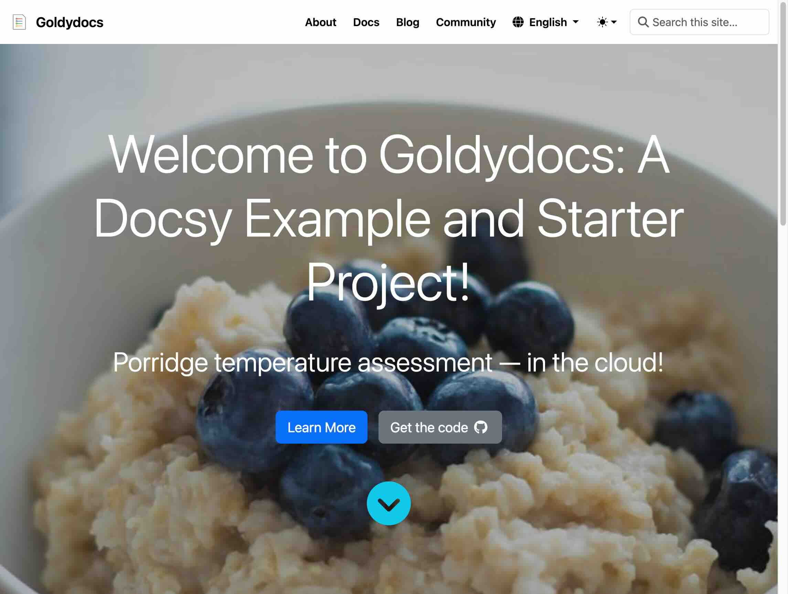

{}

<!-- prettier-ignore -->
{}
{.display-6}

{}

{}

One of the best ways to see what Docsy can do, and learn how to configure a site
with it, is to see some real projects. Of course, we use Docsy for this site.
For the site source, see [docsy.dev][docsy.dev-repo].

  

    

      
      

        
<a href="{}">Goldydocs</a>

        
The main Docsy example site starter template.

      

    

  

  

    

      
      

        
<a href="https://cncf-docsy-starter.netlify.app/">Docsy starter</a>

        
An opinionated starter including CI/CD setup.

      

    

  

## Starter templates

The Docsy project provides two site starter templates:

| Site                               | Repo                                      | Docsy            |
| ---------------------------------- | ----------------------------------------- | ---------------- |
| [Goldydocs][] - main Docsy example | <{}-example>       | v0.14.1 (latest) |
| [Docsy starter][]                  | <https://github.com/chalin/docsy-starter> | v0.14.1 (latest) |

In addition to these example starters, there are several live sites using the
theme. Consider adding your Docsy-based site to this page once you have a
production site up and running.

Thumbnails for the starter templates are shown above. Both use a hero image. For
an example of a cover that is a gradient of the primary theme color, see this
[test Homepage][].

[test Homepage]: /tests/blocks-cover/color-gradient/

## Docsy theme examples

Example sites that have low to no customization:

| Site                                                | Repo                                                         |
| --------------------------------------------------- | ------------------------------------------------------------ |
| [docsy.dev](/) (this site)                          | <{}/tree/main/docsy.dev>              |
| [AgileBase docs](https://docs.agilebase.co.uk/)     | https://github.com/okohll/abdocs                             |
| [Agones.dev](https://agones.dev/site/)              | https://github.com/googleforgames/agones/tree/main/site      |
| [Apache Parquet](https://parquet.apache.org/)       | https://parquet.apache.org                                   |
| [CloudWeGo.io](https://www.cloudwego.io/)           | https://github.com/cloudwego/cloudwego.github.io             |
| [etcd.io](https://etcd.io/)                         | https://github.com/etcd-io/website                           |
| [fission.io](https://fission.io/)                   | https://github.com/fission/fission.io                        |
| [fluxcd.io](https://fluxcd.io)                      | https://github.com/fluxcd/website                            |
| [Graphviz](https://graphviz.org)                    | https://gitlab.com/graphviz/graphviz.gitlab.io               |
| [gRPC](https://www.grpc.io/)                        | https://github.com/grpc/grpc.io                              |
| [JVMPerf.net](https://jvmperf.net/)                 | https://github.com/cchesser/java-perf-workshop               |
| [Kubeflow.org](https://www.kubeflow.org/)           | https://github.com/kubeflow/website                          |
| [Layer5 Docs](https://docs.layer5.io/)              | https://github.com/layer5io/docs                             |
| [Navidrome Music Server](https://www.navidrome.org) | https://github.com/navidrome/website                         |
| [OpenTelemetry.io](https://opentelemetry.io)        | https://github.com/open-telemetry/opentelemetry.io           |
| [protobuf.dev](https://protobuf.dev)                | https://github.com/protocolbuffers/protocolbuffers.github.io |
| [Selenium.dev](https://www.selenium.dev/)           | https://github.com/SeleniumHQ/seleniumhq.github.io           |
| [Stroom.io](https://gchq.github.io/stroom-docs)     | https://github.com/gchq/stroom-docs                          |
| [tekton.dev](https://tekton.dev/)                   | https://github.com/tektoncd                                  |
| [YMCA Website Services](https://ds-docs.y.org/)     | https://github.com/YCloudYUSA/yusaopeny_docs                 |

## Customized Docsy examples

Example sites that include a moderate to high amount of customization:

| Site                                                 | Repo                                           |
| ---------------------------------------------------- | ---------------------------------------------- |
| [Apache Airflow](https://airflow.apache.org/)        | https://github.com/apache/airflow-site/        |
| [Docsy Mostly Docs](https://mostlydocs.netlify.app/) | https://github.com/gwatts/mostlydocs/          |
| [Kubernetes](https://kubernetes.io)                  | https://github.com/kubernetes/website          |
| [XLT](https://xltdoc.xceptance.com/)                 | https://github.com/Xceptance/xlt-documentation |
| [Dapr](https://docs.dapr.io/)                        | https://github.com/dapr/docs                   |

[Docsy starter]: https://cncf-docsy-starter.netlify.app/
[docsy.dev-repo]: <{}/tree/main/docsy.dev>
[Goldydocs]: <{}>

{}
