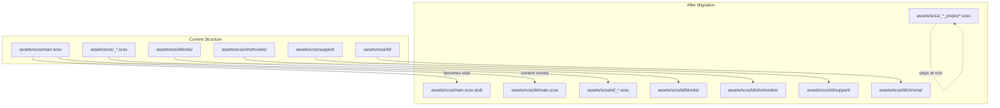

# Namespace Docsy SCSS Files Under `td/`

Issue: <https://github.com/google/docsy/issues/1654>

## Goal

Move Docsy's internal SCSS files to `assets/scss/td/` to leverage Hugo's file
resolution order, preventing projects from accidentally overriding theme SCSS
files.

## Tasks

- [x] Move SCSS files and directories to `assets/scss/td/`
- [x] Create stub `main.scss` that imports `td/main`
- [x] Update import paths in `td/main.scss` for vendor and project files
- [x] Update `_code-dark.scss` to use relative chroma imports
- [x] Update GitHub links in documentation
- [x] Add changelog entry for SCSS namespace change

## Files to Move

### Core SCSS files (move from `assets/scss/` to `assets/scss/td/`)

- `_alerts.scss`, `_blog.scss`, `_boxes.scss`, `_breadcrumb.scss`
- `_code.scss`, `_colors.scss`, `_content.scss`, `_drawio.scss`
- `_main-container.scss`, `_nav.scss`, `_navbar-mobile-scroll.scss`
- `_pageinfo.scss`, `_search.scss`, `_sidebar-toc.scss`, `_sidebar-tree.scss`
- `_swagger.scss`, `_table.scss`, `_taxonomy.scss`
- `_variables_forward.scss`, `_variables.scss`
- `section-index.scss`, `shortcodes.scss`

Note: `main.scss` content moves to `td/main.scss`, but a stub `main.scss`
remains at `assets/scss/` to include `td/main.scss`.

### Subdirectories (move to `assets/scss/td/`)

- `blocks/` (contains `_blocks.scss`, `_cover.scss`)
- `shortcodes/` (contains `cards-pane.scss`, `tabbed-pane.scss`)
- `support/` (contains `_bootstrap_vers_test.scss`, `_mixins.scss`, `_rtl.scss`,
  `_utilities.scss`)

### Files to KEEP at `assets/scss/` (for project customization)

These files are the documented API for project customization and must remain at
their current paths:

- `_styles_project.scss`
- `_variables_project.scss`
- `_variables_project_after_bs.scss`

### Files already in `td/` (no move needed)

- `_code-dark.scss`, `_color-adjustments-dark.scss`, `_gcs-search-dark.scss`
- `chroma/_dark.scss`, `chroma/_light.scss`

## Code Changes

### 1. Create stub `main.scss` at root

Replace `assets/scss/main.scss` with a stub that imports the namespaced version:

```scss
@import 'td/main';
```

This keeps the entry point at `scss/main.scss` (no change to `head-css.html`).

### 2. Update `@import` paths in `td/main.scss`

After moving to `td/`, update `assets/scss/td/main.scss` imports:

- Bootstrap vendor imports: `../../vendor/bootstrap/...` (up two levels from
  `td/`)
- Font Awesome vendor imports: `../../vendor/Font-Awesome/...`
- Project override files: `../variables_project`,
  `../variables_project_after_bs`, `../styles_project` (up one level to `scss/`)
- Internal files: no path changes needed (still relative within `td/`)

### 3. Update imports within other files

- `_nav.scss` line 73: `@import "_navbar-mobile-scroll"` - no change needed
  (relative)
- `_code-dark.scss` lines 3, 7: `@import 'td/chroma/...'` becomes
  `@import 'chroma/...'`
- `blocks/_blocks.scss`: `@import "cover"` - no change needed
- `shortcodes.scss`: imports remain relative

### 4. Update documentation

In `docsy.dev/content/en/docs/content/lookandfeel.md`:

- Line 462/481: Update `_nav.scss` GitHub link
- Line 44/53: Update `_variables.scss` GitHub link
- Lines 365-371: Chroma file paths already reference `td/chroma/` (correct)
- Lines 198-199, 354: `td/color-adjustments-dark` and `td/code-dark` imports
  remain the same (projects import from their `_styles_project.scss`)

## Migration Diagram



## Breaking Changes

This is a **breaking change** for any project that:

1. Imports Docsy SCSS files directly (other than the documented project files)
2. Overrides Docsy internal SCSS files by placing files at the same path

Projects using only the documented customization files
(`_variables_project.scss`, `_variables_project_after_bs.scss`,
`_styles_project.scss`) will not be affected.

## Changelog Entry

Add an entry to the changelog noting:

- SCSS files moved to `td/` namespace
- Update any direct imports from `scss/` to `scss/td/`
- Project customization files remain at `assets/scss/`
