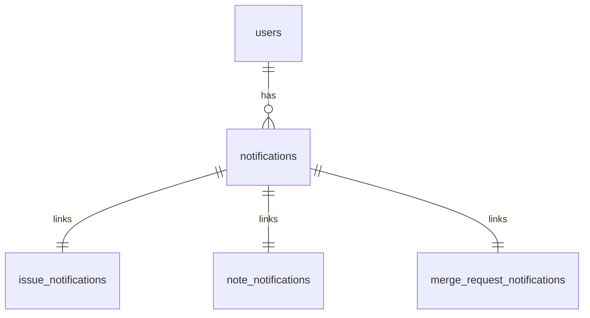

## Proposal of database structure

### 📄 Technical Proposal: Notification System Design

#### 🧠 Goal

Design a flexible and normalized database structure to manage **user notifications** about different types of resources (issues, notes, merge requests, epics), while avoiding:

- Single Table Inheritance (STI)
- Polymorphic Associations

### 🏗️ Database Design Overview

#### 1. `notifications` table (centralized)

Stores notifications per user.

```sql
CREATE TABLE notifications (
  id SERIAL,
  user_id BIGINT NOT NULL REFERENCES users(id),
  read BOOLEAN DEFAULT FALSE,
  created_at TIMESTAMP DEFAULT NOW(),
  updated_at TIMESTAMP DEFAULT NOW(),
  namespace_id BIGINT NOT NULL REFERENCES namespaces(id),
  snoozed_until TIMESTAMP,
  saved BOOLEAN DEFAULT FALSE,
  resolved_by_action SMALLINT,
  author_id BIGINT REFERENCES users(id),
  action SMALLINT,
  resource_type SMALLINT,
  PRIMARY KEY (id, user_id)
) PARTITION BY HASH (user_id);
```

This table should be partitioned using [hash-based strategy](https://docs.gitlab.com/development/database/partitioning/). We should use 32 partitions (which would give us enough headway to accommodate future growth of this table). `User_id` column should be used as partition key, since lookup by `user_id` is the most used usecase we should optimize for. 

#### 2. Resource Link Tables (one per resource)

Each notification links to exactly **one** resource via a dedicated table.

```sql
CREATE TABLE issue_notifications (
    notification_id BIGINT NOT NULL,
    resource_id BIGINT NOT NULL REFERENCES issues(id) ON DELETE CASCADE,
    namespace_id BIGINT NOT NULL REFERENCES namespaces(id) ON DELETE CASCADE,
    user_id BIGINT NOT NULL REFERENCES users(id) ON DELETE CASCADE,
    FOREIGN KEY (notification_id, user_id) REFERENCES notifications(id, user_id) ON DELETE CASCADE
);

CREATE TABLE note_notifications (
    notification_id BIGINT NOT NULL,
    resource_id BIGINT NOT NULL REFERENCES notes(id) ON DELETE CASCADE,
    namespace_id BIGINT NOT NULL REFERENCES namespaces(id) ON DELETE CASCADE,
    user_id BIGINT NOT NULL REFERENCES users(id) ON DELETE CASCADE,
    FOREIGN KEY (notification_id, user_id) REFERENCES notifications(id, user_id) ON DELETE CASCADE
);

CREATE TABLE merge_request_notifications (
    notification_id BIGINT NOT NULL,
    resource_id BIGINT NOT NULL REFERENCES merge_requests(id) ON DELETE CASCADE,
    namespace_id BIGINT NOT NULL REFERENCES namespaces(id) ON DELETE CASCADE,
    user_id BIGINT NOT NULL REFERENCES users(id) ON DELETE CASCADE,
    FOREIGN KEY (notification_id, user_id) REFERENCES notifications(id, user_id) ON DELETE CASCADE
);

CREATE TABLE ssh_keys_notification_links (
    notification_id BIGINT NOT NULL,
    resource_id BIGINT NOT NULL REFERENCES keys(id) ON DELETE CASCADE,
    namespace_id BIGINT NOT NULL REFERENCES namespaces(id) ON DELETE CASCADE,
    user_id BIGINT NOT NULL REFERENCES users(id) ON DELETE CASCADE,
    FOREIGN KEY (notification_id, user_id) REFERENCES notifications(id, user_id) ON DELETE CASCADE
)

CREATE TABLE commit_notifications (
    notification_id BIGINT NOT NULL,
    resource_id BIGINT NOT NULL,
    namespace_id BIGINT NOT NULL REFERENCES namespaces(id) ON DELETE CASCADE,
    user_id BIGINT NOT NULL REFERENCES users(id) ON DELETE CASCADE,
    FOREIGN KEY (notification_id, user_id) REFERENCES notifications(id, user_id) ON DELETE CASCADE
)
```

`Namespace_id` column should be that same as in the referenced `notifications` table, to be used as a sharding key. 
`Issue_notifications` table will serve all work_items types, including epics and OKRs. We will use `work_item_type` field in `issues` table to differentiate between types. 

Example queries with plans are listed in [this snippet](https://gitlab.com/-/snippets/4840572).

### 🔍 Entity Relationship Diagram



### ⚖️ Validation Strategy

#### ✅ Application-Level Validation (Rails)

```ruby
class Notification < ApplicationRecord
  belongs_to :user

  has_one :issue_notification
  has_one :note_notification
  has_one :merge_request_notification
  <etc>

  has_one :issue, through: :issue_notification
  has_one :note, through: :note_notification
  has_one :merge_request, through: :merge_request_notification
  has_one :epic, through: :issue_notification
  <etc>

  validate :only_one_resource_linked

  def only_one_resource_linked
    links = [
      issue_notification,
      note_notification,
      merge_request_notification
    ].compact

    errors.add(:base, "Only one resource can be linked to a notification") if links.size > 1
  end
end
```

### ⚙️ Notification Creation Service

Encapsulates logic for resource-safe creation:

```ruby
class NotificationCreator
  def self.create_for(resource:, user:)
    Notification.transaction do
      notification = Notification.create!(user: user)

      case resource
      when Issue
        IssueNotification.create!(notification: notification, resource: resource)
      when Note
        NoteNotification.create!(notification: notification, resource: resource)
      when MergeRequest
        MergeRequestNotification.create!(notification: notification, resource: resource)
      when Epic
        IssueNotification.create!(notification: notification, resource: resource) # it's because we would use work-item approach, where every epic has a row in issues table
      else
        raise ArgumentError, "Unsupported resource type"
      end

      notification
    end
  end
end
```

### 📦 Rails Model Summary

Each link table has a corresponding model, e.g.:

```ruby
class IssueNotification < ApplicationRecord
  belongs_to :notification
  belongs_to :resource
end
```

Repeat similarly for `NoteNotification`, `MergeRequestNotification`, and `NoteNotification` etc.

---

### 📊 Query Examples

#### Get all user notifications with resource type

```sql
SELECT n.id, n.resource_type, i.title, n.read, n.created_at
FROM notifications n
JOIN issue_notifications l ON l.notification_id = n.id
JOIN issues i ON i.id = l.resource_id
WHERE n.user_id = :user_id

UNION ALL

SELECT n.id, n.resource_type, no.content, n.read, n.created_at
FROM notifications n
JOIN note_notifications l ON l.notification_id = n.id
JOIN notes no ON no.id = l.resource_id
WHERE n.user_id = :user_id

UNION ALL

SELECT n.id, n.resource_type, mr.title, n.read, n.created_at
FROM notifications n
JOIN merge_request_notifications l ON l.notification_id = n.id
JOIN merge_requests mr ON mr.id = l.resource_id
WHERE n.user_id = :user_id

UNION ALL

SELECT n.id, n.resource_type, e.title, n.read, n.created_at
FROM notifications n
JOIN issue_notifications l ON l.notification_id = n.id
JOIN epics e ON e.issue_id = l.resource_id
WHERE n.user_id = :user_id

ORDER BY created_at DESC;
```

### Benefits of this design

- No STI or polymorphic associations
- Full referential integrity via FK constraints
- Clear separation of responsibilities
- Rails-friendly with explicit models
- Easier indexing and performance optimization
- Build-in partitioning, allowing us to store more rows than we store now

### Challenges of this design

- Joining multiple tables at once
- Need for the careful queries structure to avoid inefficient queries
