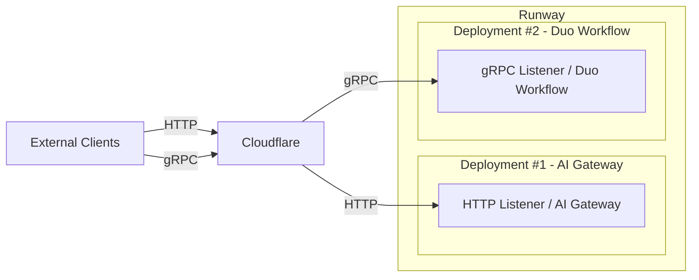
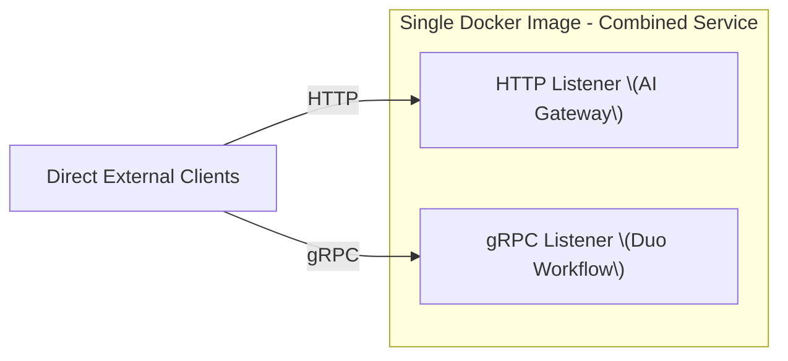

## Context

The AI Gateway is a Python-based service that handles LLM interactions over HTTP, primarily acting as a proxy (for authentication, routing, etc.). The Duo Workflow Service is another Python-based service that provides multi-step LLM orchestration (via LangGraph) over gRPC.

Historically, the Duo Workflow Service was developed separately (using gRPC) to allow rapid iteration without integrating into an existing codebase. However, this separation creates overhead in deployments (managing two services specifically for customers using self-hosted models), observability (duplicate logging/tracing), and maintenance (two sets of dependencies). As we want to mature Duo Workflow towards GA and migrate Chat to the Duo Workflow backend, merging Duo Workflow into the AI Gateway can reduce complexity and provide a unified service.

Three options were considered:

1. **Option 1**: Keep services separate.
2. **Option 2**: Combine them into one service with two listeners (gRPC & HTTP).
3. **Option 3**: Combine them into one service with a single listener (e.g., using WebSockets only).

## Decision

**We decided to combine Duo Workflow Service and AI Gateway into a single repository and Docker image using two listeners (Option 2). Separately we will also be adopting web sockets (Option 3 - see ADR-002)** One port will handle the existing HTTP-based AI Gateway traffic, and another port will handle the gRPC-based Duo Workflow traffic. A command-line flag or environment variable can toggle which transports (or both) are enabled at runtime. There will continue to be two services with separate runway deployments for people using SaaS models (.com our Cloud Connected). Self-hosted models customers have two options they can either run a single combined service or two services depending on their own scaling requirements.

Option 3 has been moved to a separate ADR record (ADR-002) as it can be discussed and delivered independently of merging the two services.

For customers using GitLab hosted models i.e. customers on Gitlab.com or Self-managed customers using GitLab hosted models:



For Self-managed customers using self-hosted models:



**Note**: We will need to update [the docs](https://docs.gitlab.com/install/install_ai_gateway/#set-up-docker-with-nginx-and-ssl) for AI Gateway to show customers how to manage certs for self-hosted deployments of AI Gateway.

Here is example nginx configuration:

```nginx
upstream aigw_grpc_backend  { server gitlab-ai-gateway:5052; }

server {
    listen 50052 ssl http2; # gRPC over TLS
    server_name _;

    ssl_certificate      /etc/nginx/ssl/server.crt;
    ssl_certificate_key  /etc/nginx/ssl/server.key;
    ssl_verify_client    off;
    ssl_protocols        TLSv1.2 TLSv1.3;
    ssl_ciphers          HIGH:!aNULL:!MD5;
    ssl_prefer_server_ciphers on;
    ssl_session_cache    shared:SSL:10m;
    ssl_session_timeout  10m;

    location / {
        grpc_pass grpcs://aigw_grpc_backend;
        grpc_read_timeout    300s;
        grpc_connect_timeout 75s;
        grpc_set_header X-Real-IP        $remote_addr;
        grpc_set_header X-Forwarded-For  $proxy_add_x_forwarded_for;
        grpc_set_header X-Forwarded-Host $host;
    }
}
```

## Consequences

- **Pros**  
  - Single Docker image for self-hosted deployments simplifies installation and updates.  
  - Unified codebase for logs, metrics, secrets management, etc.  
  - Minimizes rewriting the existing gRPC components, reducing initial refactoring effort compared to a full WebSocket migration (Option 3).
  - We can scale the two deployments in runway separately since they have different scaling characteristics. e.g. Duo Workflow is more memory intensive since we store a lot of data in workflow state.

- **Cons**  
  - Still requires gRPC support from customers’ network configurations. Some firewalls may block HTTP/2 traffic.  
  - The hosting platform (Runway) may need to manage two ports/protocols, which can add some complexity.
  - Maintaining both independent servers, even in a single codebase, may still mean there are duplicated efforts where we have differences between gRPC and HTTP
  - There is still an initial migration overhead when migrating the existing code-base
  - We need to decide how to handle reviewer/maintainership when merging two repositories as there is no 100% overlap and Duo Workflow uses different technologies than AI Gateway (LangGraph/gRPC)

Despite these downsides, Option 2 strikes the best balance between maintainability, complexity, and near-term development effort. 
