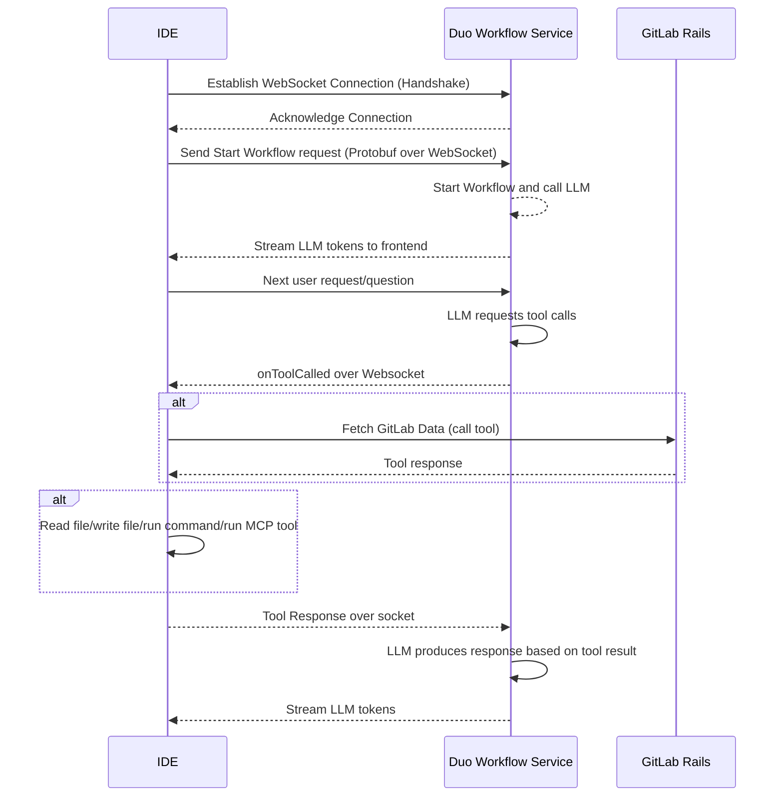
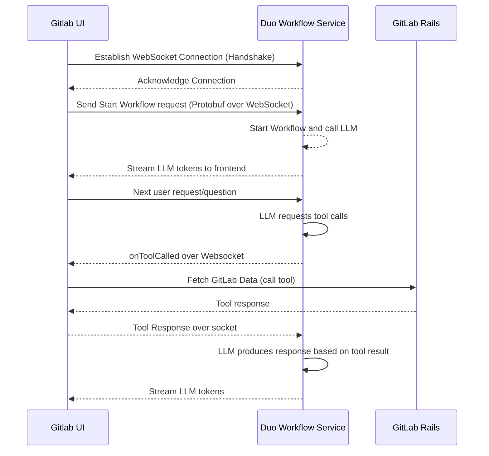

## Context

Initially, the Duo Workflow Service used gRPC over HTTP/2 for streaming. While gRPC provides efficient bi-directional streaming and code generation, it can pose challenges:

- We have first hand experience that enterprise customers are likely to have their security platform such as Netskope or Zscaler configured to block HTTP/2 traffic by default. This leads to added onboarding friction with Duo Workflow, as the security team has to be involved to allow connection.
- [Browsers cannot natively use gRPC](https://grpc.io/blog/state-of-grpc-web/#feature-sets) without a proxy layer (gRPC-Web or Envoy).  

Giving the ability for customers to use **WebSockets** (over HTTP/1.1) can address these issues and unify the transport across all components (client, server, LSP executor). It also enables direct browser-to-service streaming if needed, simplifying real-time feedback loops.

**IDE interactions**:

**GitLab UI interactions (non-remote execution)**:

## Decision

**We decided add Web Sockets as an alternative to gRPC** for Duo Workflow’s streaming and request/response interactions. Protobuf will be used for serialization over WebSockets where appropriate, preserving type safety.

Websockets have been tested at scale for AI workloads as shown by the following 2 adoptions:

1. [Open AI Realtime API](https://platform.openai.com/docs/guides/realtime#connect-with-websockets)
2. [Gemini Live API](https://ai.google.dev/gemini-api/docs/live)

## Consequences

- **Pros**
  - Single port over standard HTTP/1.1 with WebSocket upgrades is more likely to be firewall-friendly.  
  - Browsers can connect directly without needing a separate proxy or gRPC-Web implementation.  
  - Unified transport across front-end, back-end, and possibly the LSP executor logic.

- **Cons**
  - Requires refactoring the existing gRPC-based code, including streaming logic, interceptors, and error handling.  
  - gRPC’s built-in features (flow control, code generation) will need to be re-created or replaced with equivalent libraries in the WebSocket ecosystem.  
  - Performance differences vs. gRPC in high-load or binary-heavy streaming scenarios may require additional testing or optimization.  

The benefit of easier adoption, fewer networking roadblocks, and improved client compatibility outweighs the additional refactoring effort.
