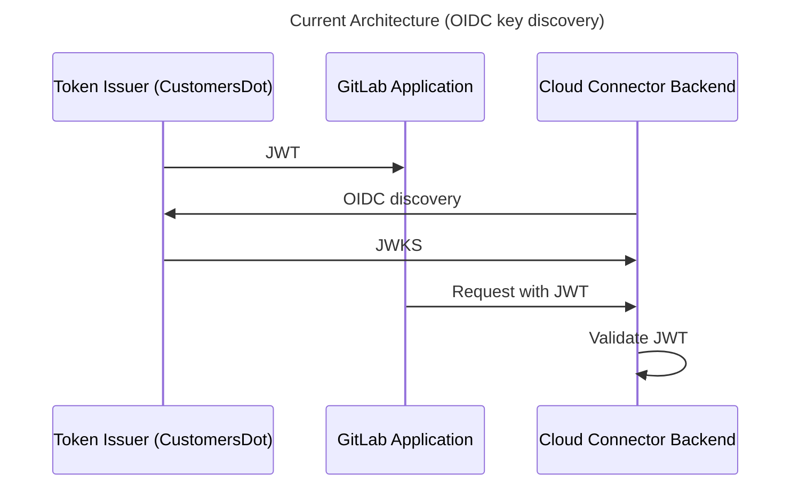
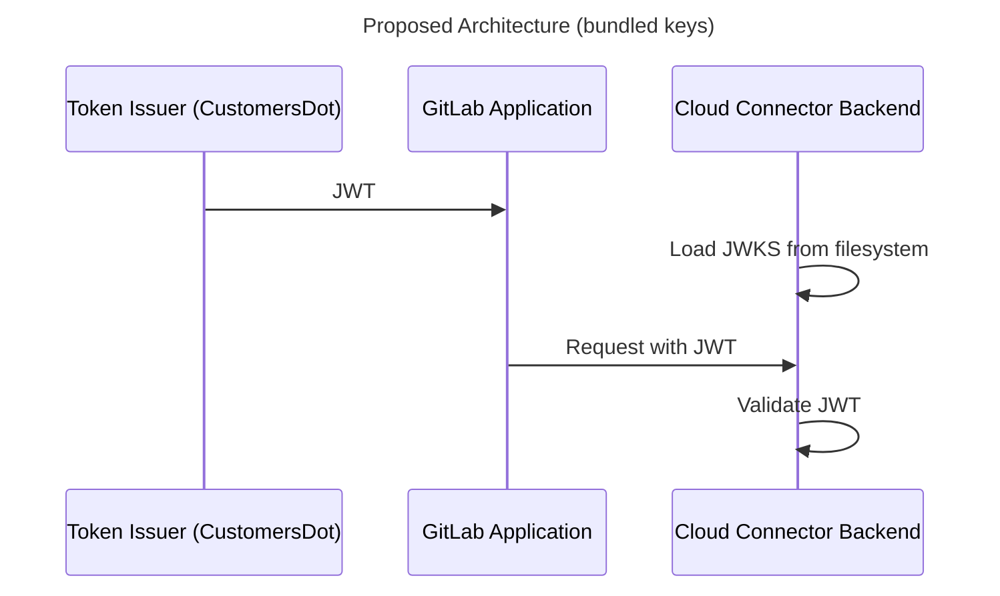

## Context

We are exploring approaches to move away from [OIDC discovery](https://openid.net/specs/openid-connect-discovery-1_0.html) for Cloud Connector token validation for the following reasons:

- OIDC discovery is prone to networking and caching problems. If the endpoint or system is degraded or caches are stale, Cloud Connector backends cannot validate any AI requests anymore. With an increasing number of Cloud Connector backends, this issue is multiplied. An example is [issue 480018](https://gitlab.com/gitlab-org/gitlab/-/issues/480018#note_2091862742) (internal for security reasons).
- OIDC adds complexity to solve a problem we don't have. It primarily solves the problem of 3rd parties that don't know or control each other to exchange identity and key information through a standardized web interface. This is not necessary for Cloud Connector, because all systems involved that dispense or authenticate tokens are built, operated and controlled by GitLab.
- OIDC discovery requires a callback to gitlab.com from all Cloud Connector backends. This means to support Cells, where customers can reside in different Cells, the application secret holding these keys must be managed either so as to be shared across all Cells, or sharded and the request routed accordingly for the backend to obtain the right key set. We can eliminate this problem entirely by simply not having gitlab.com publish these keys through OIDC endpoints and removing this callback. See [issue 451149](https://gitlab.com/gitlab-org/gitlab/-/issues/451149) for more information.

Our proposed alternative to OIDC discovery is to package the public keys used for token validation from our well-known token issuers with Cloud Connector backends directly instead of fetching them over the network, which currently requires 4 network calls to succeed whenever a server process expires its key cache.

This approach is demonstrated in [PoC MR for AI Gateway](https://gitlab.com/gitlab-org/modelops/applied-ml/code-suggestions/ai-assist/-/merge_requests/1327).

## Decision

We start with the incremental solution described above:

- Every Cloud Connector backend (currently: AI Gateway, Duo Workflow service; soon: GOB service, SAST service) will be packaged with public keys for both CustomersDot and gitlab.com, both for production and staging envs (4 keys total).
- Every Cloud Connector backend will load these keys from disk during application boot and hold them in process memory.
- We will start with the AI Gateway while continuing supporting OIDC discovery in parallel for other Cloud Connector backends (Duo Workflow service, GOB service, SAST service) and as a fallback during the transition.
- After confirming success with AI Gateway, we replace OIDC in every Cloud Connector backend and remove OIDC discovery for Cloud Connector authentication entirely.

## Consequences

The proposed solution increases the stability of the Cloud Connector authentication:

- It eliminates CustomersDot and gitlab.com as a single point of failure for authenticating Cloud Connector features (both AI and non-AI).
- It removes the added complexity of OIDC discovery in our workflow.
- It eliminates network calls to OIDC endpoints when key caches expire in Cloud Connector backends.

Trade-offs:

- We will have to update all Cloud Connector backend service code repositories and redeploy them whenever we rotate keys.
  - Now, the system would always converge on the latest state but we still need to take cache into account which caused us incidents in the past.
  - We control all the systems that needs to be updated/redeployed so we can automate the rotation process in the future.
  - The planned key rotation is a very infrequent process. We currently do this once a year. Rather than that, it should only be done in case of the key leak.  

### Diagram: Current Architecture (OIDC key discovery)

Below is the flow we currently support for Self-Managed GitLab instances.
For gitlab.com, it is similar (gitlab.com acts as a Token Issuer instead of CustomersDot).

### Diagram: Proposed Architecture (bundled keys)

Below is the updated flow we suggest for Self-Managed GitLab instances.
For gitlab.com, it will be a similar change.

As you can see, we no longer need key fetches between the Token Issuer and the Cloud Connector Backend.

### Key rotation changes

In case of key leaks or other security incidents, key rotation may be required.

With the described solution, the key rotation process will be different from what we use now.
For CustomersDot, the current key rotation process is described in [issue 10387](https://gitlab.com/gitlab-org/customers-gitlab-com/-/issues/10387).

Currently, it works like this:

- First, we create a new key and add it to the published key set in the token issuer. This means the token issuer now publishes two different keys. We do this by having two environment variables that usually point to the same key, but diverge during a rotation.
- After that, we wait for Cloud Connector backends to perform OIDC key fetches (i.e. wait for key caches to expire; for AI GW, it is 24 hours) or rotate instance (which resets caches). They now have both keys in memory. This ensures that we can continue to validate tokens that were issued before the rotation.
- After 72 hours (token lifetime) of introducing the new key, we can point both environment variables to the same (new) key value.

If we remove OIDC, we have to change this sequence:

- First, we will create a new key pair and add the public key to the expected key set in all Cloud Connector backend services. This prepares Cloud Connector backends to validate tokens signed with both the old and new key.
- We make sure that all Cloud Connector backends are redeployed and include the new public key.
- At this point, we can swap out private key in the token issuer.
- Finally, we can remove the old public key from all Cloud Connector backends.

We will document the key rotation process and link it to the Cloud Connector and related backends docsets.

### Next steps

The approach suggested in this ADR allows us to make incremental improvements toward next solutions.
For example, in [epic 14401](https://gitlab.com/groups/gitlab-org/-/epics/14401) we explore the concept of self-contained JWTs, which would further simplify key management by embedding public keys directly in the tokens sent by clients. Since this requires validating the entire certificate chain, the key from which leaf certificates are derived must be available in backend services. Making this parent key available to backends could use the same approach we suggest in this ADR.
