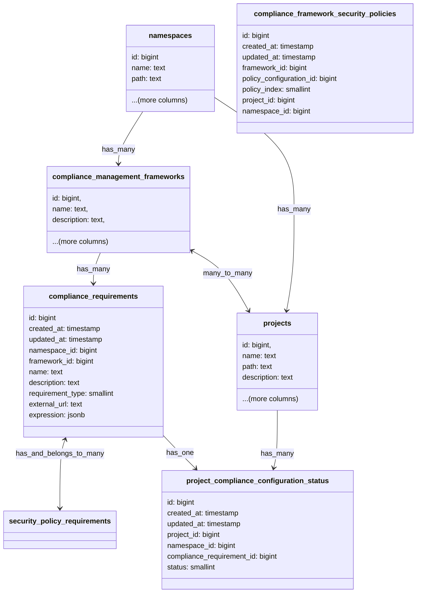

## Context

We want the ability to create custom requirements so that users don't need to rely only on the exhaustive list of
controls that GitLab supports or would support in the future. Users could also have external services that might impact
whether their projects are compliant to a standard or not.

## Approach

To allow users to create controls on their own as per their requirements we need to have the following types of
requirements:

1. [Internal requirements](#internal-requirements): Enable users to create logical expressions with all available project settings.
1. [External requirements](#external-requirements): Enable users to create requirements that rely on their external services like HTTP servers.

### Internal requirements

We would allow users to create logical expressions with all the available project settings. These expressions would
be the controls against which the projects would be evaluated. We would store these as a structured JSON in the
`compliance_requirements` table with 'internal' as the `requirement_type`.

As an example: Consider expression `'merge_method' = 'merge commit' AND ('project_name' LIKE "%-team" OR 'compliance_framework' != 'SOC2')`.
This expression will be saved in the database as JSON with the following structure:

```json
{
  "operator": "AND",
  "conditions": [
    {
      "field": "merge_method",
      "operator": "=",
      "value": "merge commit"
    },
    {
      "operator": "OR",
      "conditions": [
        {
          "field": "project_name",
          "operator": "LIKE",
          "value": "%-team"
        },
        {
          "field": "compliance_framework",
          "operator": "!=",
          "value": "SOC2"
        }
      ]
    }
  ]
}
```

We can also store simple expressions like `merge_method = 'merge commit'`, this would be stored in the database as the
following JSON:

```json
{
  "operator": "=",
  "field": "merge_method",
  "value": "merge commit"
}
```

We would create schema validators for validating the input and store these in the `expression` jsonb column of the
`compliance_requirements` database table.

We would have a UI on the frontend with dropdowns to choose the field, operator and values. This is created so that
the users don't have to write complex JSON expressions on their own.

The above JSON would be parsed using an evaluator and the expression would be evaluated to true or false. A basic
evaluator class would look like:

```ruby
module ComplianceManagement
  module ComplianceRequirement
    class QueryEvaluator
      def initialize(query, project)
        @query = query
        @project = project
      end

      def evaluate
        evaluate_node(@query)
      end

      private

      def evaluate_node(node)
        if node['operator']
          evaluate_operator_node(node)
        else
          evaluate_condition(node)
        end
      end

      def evaluate_operator_node(node)
        operator = node['operator'].upcase
        conditions = node['conditions']

        # Handle the case of a single condition
        if conditions.nil? || conditions.empty?
          return evaluate_condition(node)
        end

        results = conditions.map { |condition| evaluate_node(condition) }

        case operator
        when 'AND'
          results.all?
        when 'OR'
          results.any?
        else
          raise "Unknown operator: #{operator}"
        end
      end

      def evaluate_condition(condition)
        field_value = get_field_value(condition['field'])

        case condition['operator']
        when '='
          field_value == condition['value']
        when '!='
          field_value != condition['value']
        when 'LIKE'
          field_value.to_s.match?(like_to_regex(condition['value']))
        else
          raise "Unknown condition operator: #{condition['operator']}"
        end
      end

      def get_field_value(field)
        case field
        when 'merge_method'
          @project.merge_method.to_s
        when 'project_name'
          @project.name
        when 'compliance_framework'
          frameworks = @project.compliance_management_frameworks
          frameworks ? frameworks.map(&:name) : []
        else
          raise "Unknown field: #{field}"
        end
      end

      def like_to_regex(pattern)
        regex_pattern = Regexp.escape(pattern).gsub('%', '.*')
        Regexp.new("^#{regex_pattern}$", Regexp::IGNORECASE)
      end
    end
  end
end
```

We can then use the above evaluator on the stored JSON expression:

```ruby
simple_query = {
  "operator" => "=",
  "field" => "merge_method",
  "value" => "merge"
}

complex_query = {
  "operator" => "AND",
  "conditions" => [
    {
       "field" => "merge_method",
       "operator" => "=",
       "value" => "merge"
    },
    {
       "operator" => "OR",
       "conditions" => [
         {
           "field" => "project_name",
           "operator" => "LIKE",
           "value" => "%-team"
         },
         {
           "field" => "compliance_framework",
           "operator" => "!=",
           "value" => "SOC2"
         }
       ]
     }
  ]
}

evaluator = ComplianceManagement::ComplianceRequirement::QueryEvaluator.new(complex_query, project)
result = evaluator.evaluate # Returns true or false

evaluator = ComplianceManagement::ComplianceRequirement::QueryEvaluator.new(simple_query, project)
result = evaluator.evaluate # Returns true or false
```

We also [considered](https://gitlab.com/groups/gitlab-org/-/work_items/14939#note_2096055093) using GitLab Query
Language (GLQL), however, since it is not yet mature enough and for the sake of feature velocity we thought of moving
forward with the above approach and unify with GLQL later.

### External requirements

We would store the external HTTP/HTTPS URLs for the user's external services in the compliance_requirements table with
'external' as the `requirement_type`.

We would POST the latest project settings to these external services and expect a boolean status as the response.
We could also create a POST API that can be used to update the status of an external requirement, this would be a
similar to [setting the status of external status checks](https://docs.gitlab.com/ee/api/status_checks.html#set-status-of-an-external-status-check).

## Workflow



We would drop the existing table `compliance_checks` and update the existing table `compliance_requirements` with the
above schema. The `requirement_type` column can either have 'internal' or 'external' as the valid values.

The columns `expression` and `external_url` are mutually exclusive and depending upon the `requirement_type` one of
these columns would be non null. In an unforeseen circumstance where more than one of these columns are filled, we
would only honour the column associated with the given requirement type. For example: for a row, if `external_url` and
`expression` both have values but the value of `requirement_type` column is 'internal', we would ignore the value
stored in the `external_url` column and will consider this row as an internal requirement.

We would create a new table `project_compliance_configuration_status` to store the results of the requirements. Unlike
the current implementation we would only store results for the projects that have compliance requirements configured.

We would trigger and re-evaluate the results of all the requirements for a project if there is an update:

1. To a project setting
1. To a group setting that is cascaded to the project
1. To a project's association like compliance management frameworks, labels, topics, etc.
1. To the compliance requirement associated to that project

This means that we need a relationship between `compliance_requirements` and `project_compliance_configuration_status`
database tables.

Whenever there is a change in the status of a requirement we would create an audit event. This will help in capturing
the historical changes of that requirement for the given project and would also help in identifying the user and the
actions that led to the change in the status of the requirement.

We would query the rows in the `project_compliance_configuration_status` table for the given namespace and display the
results on the compliance dashboard.

## Constraints

1. We should limit the maximum number of compliance frameworks a project can have. In the beginning we can keep this limit as 20
and increase later on if needed.
1. We should limit the maximum number of compliance requirements a framework can have. In the beginning we can keep this limit as 50
and increase later on if needed.
1. We should limit the maximum number of fields an expression can have. In the beginning we can keep this limit as 5
and increase later on if needed.
1. We should create an allowlist of project settings and associations that could be used for creating expressions.
1. Without the above limitations it would be very easy for users to abuse our system leading to query timeouts
and poor user experience.

## Decision

We decided to store the internal compliance requirement expressions as `text` columns and remove the
`compliance_checks` table and only use `compliance_requirements` instead. This would help in reducing redundancy and
we could easily display the rows present in `project_compliance_configuration_status` table on the adherence dashboard.
