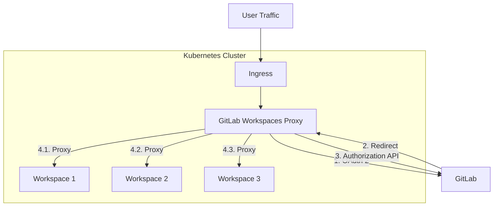
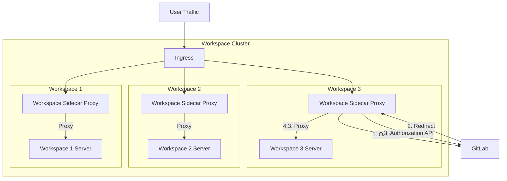

## Context

We have decided that all infrastructure required will be provided by the users and it will by integrated with GitLab
by adding an agent module in GitLab Agent for Kubernetes in [002: Provision compute and storage for a workspace](./002_provision_compute_and_storage.md).

We have decided to only allow the creator of the workspace to access it in
[003: Authorizing user to create and access a workspace](./003_authorizing_user_to_create_and_access_workspace.md).

We want a way to enforce these authorization rules in the user's infrastructure.

## Decision

We will create a new service which will be deployed in the user's Kubernetes cluster.
This service will be responsible for authenticating and authorizing all user traffic before
proxying it to the respective workspace.

All traffic incoming to the Kubernetes cluster on a given domain is forwarded to `gitlab-workspaces-proxy`, which then decides how to serve that traffic.

More details can be found [here](https://gitlab.com/groups/gitlab-org/-/epics/9940).

## Consequences

Users will be required to install another component in their Kubernetes cluster along with GitLab Agent for Kubernetes for setting up Workspaces.

## Alternatives

We considered using a sidecar proxy approach where the application proxying the traffic will be injected into each workspace and all traffic to the workspace will flow through this proxy. The proxy will only handle the traffic for a single workspace. The Ingress Controller in Kubernetes will forward to the appropriate proxy. The proxy can communicate with the workspace over the loopback interface (localhost) because they share a network namespace as they are in the same Kubernetes Pod.

We did not proceed with this because having a centralized approach made it easier to make changes/upgrades.

We also considered adding auth [annotations](https://kubernetes.io/docs/concepts/overview/working-with-objects/annotations/) on the [Kubernetes Ingress](https://kubernetes.io/docs/concepts/services-networking/ingress/) resource to allow [Ingress controllers](https://kubernetes.io/docs/concepts/services-networking/ingress-controllers/)(for example, `ingress-nginx`) to delegate authentication and authorization to a separate process. The challenge is that these annotations are not standardized. They are not part of the [Ingress specification](https://kubernetes.io/docs/concepts/services-networking/ingress/) and may not be supported across different Ingress controllers. We would need to document the process to set up our auth provider for each of the Ingress controllers. This is why we did not proceed with this approach.
