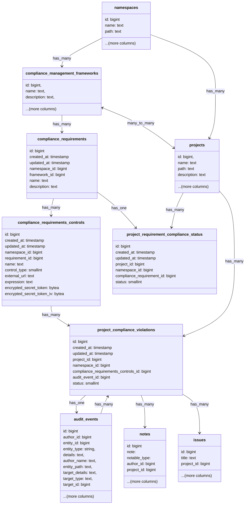

## Context

While the adherence report states the current state of a project against the configured framework and requirements/controls,
it does not show a history of the state. Most importantly it does not show when the project might not have been adhering
and when there was a violation of the requirement/control.

## Approach

The violation engine is similar to the configuration checks engine, whenever an audit event is created
the system will check that the event does not violate any configured compliance controls.

For example when a Merge Request is merged, we would create an audit event `merge_request_merged`, we would then run the
the violations engine and check for violations if any. For example: It will check if there is a control defined for the project
which states all Merge Requests requiring 2 approvers, if the Merge Request has less then 2 then a violation is created from the event.

All GitLab defined controls will have an audit event type configured as its trigger point. We will update the
audit event type yml file to include a new parameter that will indicate which control it is associated.
One audit event may have multiple controls associated with it, such as when an MR is merged.

Here is an example audit event type yml file with the new parameter

```yml
---
name: merge_request_merged
description: A merge request is merged
introduced_by_issue: https://gitlab.com/gitlab-org/gitlab/-/issues/442279
introduced_by_mr: https://gitlab.com/gitlab-org/gitlab/-/merge_requests/164846
feature_category: compliance_management
milestone: '17.5'
saved_to_database: true
streamed: true
scope: [Project]
compliance_requirement_controls: [minimum_approvals_required_2, merge_request_prevent_committers_approval, merge_request_prevent_author_approval]
```

There are also several controls like `vulnerabilities_slo_days_over_threshold`, `review_and_archive_stale_repos`, etc.
that cannot be directly linked to an audit event. For these controls, we would rely on `FrameworkEvaluationSchedulerWorker`.
When the worker evaluates these controls and if it finds the status of these controls as failing, we would then create
an audit event for the failed control which would then eventually create a violation record.

As per the [design](https://gitlab.com/gitlab-org/gitlab/-/issues/463865/designs/Future-details-fix-available.png)
violations have a few similarities with work items, like being able to add comments, states like "detected", "resolved".
We considered adding violations as a new work item type, however, upon discussing with the 'Plan:Product Planning' group
it was decided not to create a new work item type and rather create a separate database table for violations because of
the following reasons:

1. Since violations would be generated automatically by our system, this could potentially create a high volume of records
and storing them all as work items which is currently a single `issues` table doesn't seem feasible.
2. The `issues` table, which stores all work items, has grown to over 300 GB and faces the performance
[limitations typical of large database tables](https://docs.gitlab.com/development/database/large_tables_limitations/).
Due to its size, adding new indexes or columns is prohibited. All feature development must work within these constraints.
3. Violations only had a few similarities with work items and didn't require all the features like assigning users, adding milestones, labels, etc.

We would also have a data retention policy and not store the compliance violations indefinitely. The time for which we would
store a violation is not yet finalised but we won't be storing the violations indefinitely.

## Design Details


