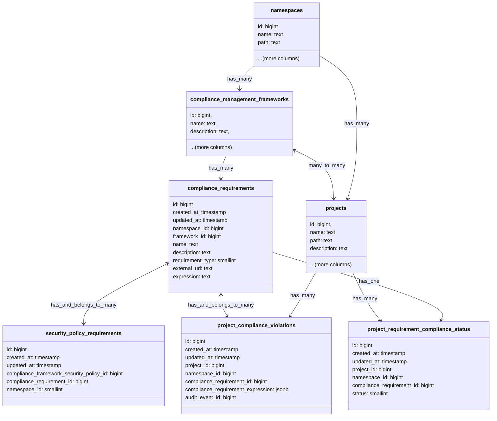

## Context

While the adherence report states the current state of a project against the configured framework and requirements/controls,
it does not show a history of the state. Most importantly it does not show when the project might not have been adhering
and when there was a violation of the requirement/control.

## Approach

The violation engine is similar to the configuration checks engine, at certain trigger points the system will audit that
the event does not violate any configured compliance controls.

For certain controls defined in GitLab there will be a event trigger point. When this event is triggered for a project the violation engine will check whether the project has a compliance framework configured with that requirement controls. If the project does have this configured then the event will be logged as a violation.

For example when a Merge Request is merged the system will trigger a potential violation event. The violations engine will check if there is a control defined for the project which states all Merge Requests requiring 2 approvers, if the Merge Request has less then 2 then a violation is created from the event.

All GitLab defined controls will have an audit event type configured as its trigger point. We will update the audit event type yml file to include a new parameter that will indicate which control it is associated. One audit event may have multiple controls associated with it, such as when an MR is merged.

Here is an example audit event type yml file with the new paramter

```yml
---
name: merge_request_merged
description: A merge request is merged
introduced_by_issue: https://gitlab.com/gitlab-org/gitlab/-/issues/442279
introduced_by_mr: https://gitlab.com/gitlab-org/gitlab/-/merge_requests/164846
feature_category: compliance_management
milestone: '17.5'
saved_to_database: true
streamed: true
scope: [Project]
compliance_requirement_controls: [merge_request_prevent_author_approval, merge_request_prevent_committers_approval, merge_request_prevent_author_approval]
```

## Design Details


