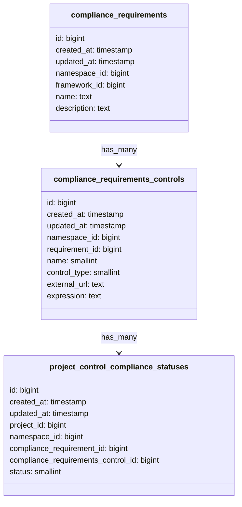

## Context

As [outlined previously](./003_custom_controls.md), we decided to store the control expression as a json within the
`compliance_requirements` table. In the previous ADR it was decided to allow logical operators such as AND, OR, etc.
and create complex nested expressions, however after our current customer and competitor research it was found that
we do not need to allow nested expressions and each control within a requirement should be ANDed. This means that a
compliance requirement fails if a control fails.

With the previous approach there was also a challenge to evaluate and store the status of individual controls
separately, however, on the dashboard the plan is to display the status of each control separately.

## Decision

Instead of storing the expression as json within the `compliance_requirements` table it was decided to create a
separate database table named `compliance_requirements_controls`. With the introduction of this new database table
we also had to update the existing `compliance_requirements` table a bit.



We would create schema validators for validating the `expression` column of the `compliance_requirements_controls`
table. This columns would contain simple expressions of the following form:

```json
{
  "operator": "=",
  "field": "minimum_approvals_required",
  "value": "2"
}
```

The `name` field is an enum and would store the enums corresponding to the controls we support, these controls are
defined [here](https://gitlab.com/gitlab-org/gitlab/-/blob/602bdfba04acfae05b293cd5cb8afc10283acb01/ee/app/validators/json_schemas/compliance_requirement_expression.json#L51-56).

The `control_type` column can either have 'internal' or 'external' as the valid values.

We would have a unique constraint for `compliance_requirements_controls` table with `requirement_id` and `name`.
This will ensure that a requirement cannot have more than one control of the same name. Example: A requirement cannot
have two rows for 'minimum_approvals_required' control.

`project_control_compliance_statuses` table would also have a unique constraint on
`compliance_requirements_control_id` and `project_id`. This will ensure that each row in this table will tell the
compliance status of a specific control for a project.

We would limit the maximum number of compliance controls a compliance requirement can have to 5, and increase later on
if needed.

The results would be stored in the `project_control_compliance_statuses` table, however, the status would be at a
control level per project instead of a requirement level per project.

The plan for [external requirements](./003_custom_controls.md#external-requirements) remains unchanged with the above
changes to internal requirements.

1. We should limit the maximum number of fields an expression can have. In the beginning we can keep this limit as 5
   and increase later on if needed.
1. We should create an allowlist of project settings and associations that could be used for creating expressions.
1. Without the above limitations it would be very easy for users to abuse our system leading to query timeouts
   and poor user experience.
