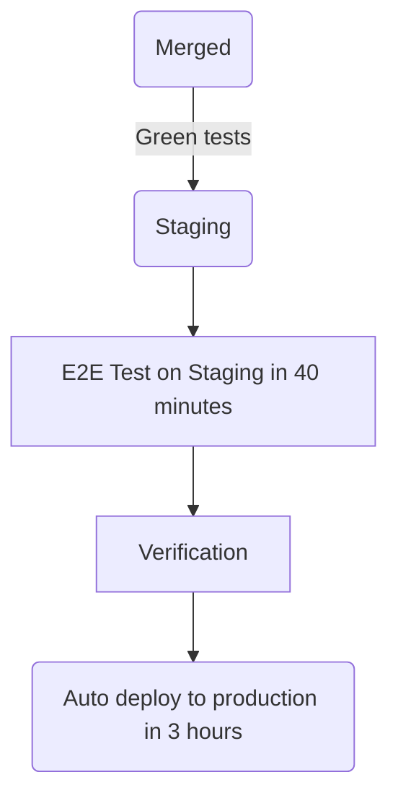

- [Direction](https://about.gitlab.com/direction/fulfillment/)
- [Groups](https://about.gitlab.com/direction/fulfillment/#groups)
- [Team](/handbook/engineering/development/fulfillment/#team-members)

## Vision

A [high performing team](/handbook/leadership/#strategies-to-build-high-performing-teams) who provides our customers with a world-class buyer experience through the products we build. Our team strives to build an experience that is delightful, performant, trustworthy, and reliable.

## Mission

Fulfillment focuses on improving our capabilities and metrics in the following areas:

- [Platform](/handbook/product/categories/#fulfillment-platform-group): [Team](/handbook/engineering/development/fulfillment/fulfillment-platform/#team-members)
- [Provision](/handbook/product/categories/#provision-group): [Team](/handbook/engineering/development/fulfillment/provision/#team-members)
- [Subscription Management](/handbook/product/categories/#subscription-management-group): [Features](https://about.gitlab.com/direction/fulfillment/subscription-management/#feature-overview-and-maturity)
- [Utilization](/handbook/engineering/development/fulfillment/utilization/): [Team](/handbook/engineering/development/fulfillment/utilization/#team-members)

## Direction

In addition to the [Fulfillment Product Direction](https://about.gitlab.com/direction/fulfillment/), the Fulfillment Development Sub-department strives to:

- Increase the reliability and availability of our Fulfillment infrastructure
- Make foundational technical improvements to the architecture and data models of the Fulfillment systems
- Improve the developer experience of Fulfillment engineers through better tooling and documentation

## Team members

See https://handbook.gitlab.com/handbook/product/categories/#fulfillment-section for a list of team members for the Fulfillment section and sub-groups.

## Stable counterparts

### Sales & Go-To-Market



### Finance & IT



### Support Engineering



### Office of the CEO



### Product Technical Program Management



## Project management process

- In accordance with our [GitLab values](/handbook/values/)
- Transparently: nearly everything is public, we record/livestream meetings whenever possible
- We get a chance to work on the things we want to work on
- Everyone can contribute; no silos

### SAFE

Working in [SAFE manner](/handbook/legal/safe-framework/) at GitLab is everyone's responsibility. We along with our stable counterparts in Sales and Billing contribute to an area of the product that potentially could encounter sensitive or financial information, and could have an effect on the business as a whole. Therefore, it's important for Fulfillment team members to ensure that the SAFE epics, issues, videos, MRs, and other artifacts we produce are kept confidential.

On occasion, it may be prudent to include language like the following to the description of public issues where potentially SAFE discussions are happening.

> This page may contain information related to upcoming products, features and functionality.
> It is important to note that the information presented is for informational purposes only,
> so please do not rely on the information for purchasing or planning purposes.  Just like with
> all projects, the items mentioned on the page are subject to change or delay, and the development,
> release, and timing of any products, features, or functionality remain at the sole discretion of
> GitLab Inc.

Similarly, not all information should be included in the public handbook. Instead, use the [private internal handbook](https://internal.gitlab.com/) for this SAFE information.

Please reference this documentation about [promising features in future versions](https://docs.gitlab.com/ee/development/documentation/styleguide/availability_details.html#promising-features-in-future-versions) for more information.

### Planning

We plan in monthly cycles in accordance with our [Product Development Timeline](/handbook/engineering/workflow/#product-development-timeline).
Release scope for an upcoming release should be finalized by the `1st`.

On or around the `26th`: Product meets with Engineering Managers for a preliminary issue review. Issues are tagged with a milestone and are estimated initially.

**Planning Issues**

- [Subscription Management](https://gitlab.com/gitlab-org/fulfillment/meta/-/issues/?label_name%5B%5D=Planning%20Issue&label_name%5B%5D=group%3A%3Asubscription%20management&sort=created_date&state=opened)
- [Fulfillment Platform](https://gitlab.com/gitlab-org/fulfillment/meta/-/issues/?label_name%5B%5D=Planning%20Issue&label_name%5B%5D=group%3A%3Afulfillment%20platform&sort=created_date&state=opened)
- [Provision](https://gitlab.com/gitlab-org/fulfillment/meta/-/issues/?label_name%5B%5D=Planning%20Issue&label_name%5B%5D=group%3A%3Aprovision&sort=milestone_due_desc&state=opened)
- [Utilization](https://gitlab.com/gitlab-org/fulfillment/meta/-/issues/?label_name%5B%5D=Category%3AUtilization&label_name%5B%5D=Planning%20Issue&scope=all&state=opened)

### Intake Request

To request work to be added to the [Fulfillment Roadmap](https://about.gitlab.com/direction/fulfillment/#roadmap), please open an issue by following [this link](https://gitlab.com/gitlab-org/fulfillment-meta/-/issues/new?issue&issuable_template=intake) and tag one of the Fulfillment Product Managers.

A Fulfillment Product Manager will be assigned to review the request and start evaluating the scope and impact. This may take some time depending on team capacity. Once evaluated, the PM will:

1. Create a new Epic, capturing relevant details from the intake issue.
1. Add this new Epic to the Fulfillment roadmap.
1. Update the intake issue description with a link to the new epic.
1. Close the intake issue.

We strictly adhere to this Intake Request process to ensure we capture the full details of a request before actioning on it. Once our Product Managers receive this request, we'll work with the requestor to ensure we have a full understanding of the problem and requirements. After this, we will [prioritize](/handbook/engineering/development/fulfillment/#prioritization) your request.

### Prioritization

We follow our [prioritization framework](/handbook/product/product-processes/#prioritization) including [cross-functional prioritization guidelines](/handbook/product/product-processes/cross-functional-prioritization/) to prioritize our backlog on a monthly basis. R&D teams use a variety of inputs and sensing mechanisms, including SLAs, OKRs, [L&R Support Priority Issues list for Fulfillment](/handbook/support/license-and-renewals/workflows/managing_product_issues/#supports-issue-list-for-fulfillment), technical debt, and more to set priorities.

We aim to maximize business value by balancing short-term, mid-term, and long-term investments across new initiatives and technical debt. At GitLab, we target an overall company allocation of 60% for new product development and 40% for technical debt and maintenance. However, this 60/40 split is flexible and may vary across different groups and sections over time.

In the Fulfillment section, we adopt the 60/40 ratio as a guideline to ensure a well-balanced approach to our OKR-focused work as well as making sure we prioritize enough Engineering initiatives to improve our reliability and efficiency. We remain adaptable in our planning and execution, avoiding a rigid adherence to these percentages. Instead, we prioritize work based on a comprehensive assessment of company needs, which is reflected in our OKRs. We leave it to each group to find the right balance in their OKRs. If an agreement can't be reached within the group, it should be escalated to the section-level to be decided.

For our monthly milestone planning at the group level, we optimize activities to align with our OKRs, remaining flexible and allowing deviations from the 60/40 split. We also make sure to complete within SLA any forced prioritization, as necessary, per our [prioritization framework](/handbook/product/product-processes/#prioritization-framework).

Every team uses the [monthly prioritization template](https://gitlab.com/gitlab-org/fulfillment-meta/-/blob/master/.gitlab/issue_templates/monthly-prioritization.md) for [cross-functional dashboard reviews](/handbook/engineering/development/#cross-functional-dashboard-reviews) every month.

### Fulfillment stage dashboards


  



  


### Subscription Management team dashboards


  



  



  



  


### Provision team dashboards


  



  



  



  


### Utilization team dashboards


  



  



  



  


### Fulfillment Platform team dashboards


  



  



  



  


### Estimation

Before work can begin on an issue, we should estimate it first after a preliminary investigation. This is normally done in the monthly planning meeting.

| Weight | Description (Engineering) |
| ------ | ------ |
| 1 | The simplest possible change. We are confident there will be no side effects. |
| 2 | A simple change (minimal code changes), where we understand all of the requirements. |
| 3 | A simple change, but the code footprint is bigger (e.g. lots of different files, or tests effected). The requirements are clear. |
| 5 | A more complex change that will impact multiple areas of the codebase, there may also be some refactoring involved. Requirements are understood but you feel there are likely to be some gaps along the way. |
| 8 | A complex change, that will involve much of the codebase or will require lots of input from others to determine the requirements. |
| 13| A significant change that may have dependencies (other teams or third-parties) and we likely still don't understand all of the requirements. It's unlikely we would commit to this in a milestone, and the preference would be to further clarify requirements and/or break in to smaller Issues. |

In planning and estimation, we value [velocity over predictability](/handbook/engineering/development/principles/#velocity-over-predictability). The main goal of our planning and estimation is to focus on the [MVC](/handbook/values/#minimal-valuable-change-mvc), uncover blind spots, and help us achieve a baseline level of predictability without over optimizing. In general departments at GitLab aim for [70% predictability] but in the Fulfillment sub-department we aim for 80% predictability since our work is typically cross-functional and we need to be in lockstep with other departments.

- If an issue has many unknowns where it's unclear if it's a 1 or a 5, we will be cautious and estimate high (5).
- If an issue has many unknowns, we can break it into two issues. The first issue is for research, also referred to as a [Spike](https://en.wikipedia.org/wiki/Spike_(software_development)), where we de-risk the unknowns and explore potential solutions. The second issue is for the implementation.
- If an initial estimate is incorrect and needs to be adjusted, we revise the estimate immediately and inform the Product Manager. The Product Manager and team will decide if a milestone commitment needs to be adjusted.

**Estimation Template**

The following is a guiding mental framework for engineers to consider when contributing to estimates on issues.

```markdown
### Refinement / Weighting

<!--
Ready for development means replying yes to the following questions:

- Is this issue sufficiently small enough? If not, break it into smaller issues
- Is it assigned to the correct domain (e.g. frontend, backend)? If not, break it into two issues for the respective domains
– Is the issue clear and easy to understand? If not, try asking further clarification questions and update the description once they are received

If more than 2 MRs are needed, consider adding a table like the following to the description (e.g. under `Implementation plan`).

| Description | MR |
|-|-|
|||

It will help track the status.
-->

- [ ] Ready for development
- [ ] Weight is assigned
- [ ] Number of MRs listed
- [ ] Needs testing considerations
- [ ] Needs documentation updates

**Reasoning:**

<!--
Add some initial thoughts on how you might break down this issue. A bulleted list is fine.

This will likely require the code changes similar to the following:

- replace the hex driver with a sonic screwdriver
- rewrite backups to magnetic tape
- send up semaphore flags to warn others

Links to previous examples. Discussions on prior art. Notice examples of the simplicity/complexity in the proposed designs.
-->
```

### Picking something to work on

Engineers can find and open [their team's planning issue to check their milestone board](https://gitlab.com/gitlab-org/fulfillment-meta/-/issues/?sort=priority_desc&state=opened&label_name%5B%5D=Planning%20Issue&first_page_size=100)
and begin working first on those with the `deliverable` label.

It's possible for engineers to pick any of the remaining issues for the milestone once the deliverables are done. If the engineer has no preference, they can choose the next available issue from the top.

### Workflow

We generally follow the [Product Development Flow](/handbook/product-development/product-development-flow/#workflow-summary) and use the workflow labels as defined there.

Generally speaking, issues are in one of two states:

- Discovery/refinement: we're still answering questions that prevent us from starting development,
- Implementation: an issue is waiting for an engineer to work on it, or is actively being built.

Basecamp thinks about these stages in relation to the [climb and descent of a hill](https://basecamp.com/hill-charts).

While individual groups are free to use as many stages in the [Product Development Flow](/handbook/product-development/product-development-flow/#workflow-summary) workflow as they find useful, we should be somewhat prescriptive on how issues transition from discovery/refinement to implementation.

### User Experience

We strive to provide excellent usability in all of our workflows, creating a balance between user and business needs. Product Designers work closely with Product Managers and Engineers.

#### How we work

- We follow the [Product Designer workflows](/handbook/product/ux/product-designer/) and [UX Researcher workflows](/handbook/product/ux/ux-research/) described in the [Product Design section](/handbook/product/ux/) of the handbook.
- We measure our progress using [UX Scorecards](/handbook/product/ux/ux-scorecards/) and [Category Maturity Scorecards](/handbook/product/ux/category-maturity/category-maturity-scorecards/).
- We prioritize the most important projects every quarter, and Fulfillment product designers [support projects instead of Groups](#product-designer-focus-areas).
- We use [[UX] issues](#ux-issue-management-and-weights) as the SSOT for designs. Implementation issues should link to the [UX] issue for the design details to maintain the SSOT.
- We use labels to track our issues:
  - `UX`, `devops::fulfillment`, `section::fulfillment` and `group::`.
  - `workflow::` labels to indicate where the issue is in the [product development flow](/handbook/product-development/product-development-flow/)
  - `UX Problem Validation` and `UX Solution Validation` for research efforts
  - `design weight::` for [UX issue weights](/handbook/product/ux/product-designer/#ux-issue-weights)

#### Product Designer focus areas

The Fulfillment team is Project focused, and many projects span Groups, leading to gaps in the user experience or frequent designer borrow requests. In order to avoid this, we will assign designers to project areas, and revisit quarterly during OKR planning.

- Priorities for the Fulfillment UX team are documented in a [prioritization issue](https://gitlab.com/gitlab-org/fulfillment/meta/-/issues/?label_name%5B%5D=Fulfillment%20UX%20Priorities).
  - Priorities should be reviewed by the team quarterly, or when a new priority project is identified.
- Anyone can propose projects identified for design focus in the issue. Product Managers should work with Product Designers and the Product Design Manager to rank the priorities. If multiple PMs are contributing to a project, one should be designated for UX planning.
  - If we had to make a priority call to have projects that will go forward without design support, list those decisions in the issue.
- Designers can still pick up issues outside their assigned projects. These should be crucial UX issues such as SUS Impacting issues or bugs. Issue weights can be used to discuss trade-offs when needed.
- Anyone can use the #s_fulfillment_ux Slack channel to ask for assistance.

Best practices

- To manage workload, designers should generally be assigned to no more than one large and 1 small/medium project at a time, or 3-4 small/medium projects (or the equivalent in issue weights).
- Designers should use their best judgement and collaborate with their teams to decide which meetings to attend. Designers aren't expected to attend team sync meetings for multiple teams at the same time.
- Product Designers should be assigned [UX MR reviews](/handbook/product/ux/product-designer/mr-reviews/) for the projects they're supporting.
  - If UX review is needed on an MR that is part of a project without an assigned designer, post the request in the #s_fulfillment_ux Slack channel. UX MR review requests in the Slack channel will be picked up based on bandwidth.

#### UX issue management and weights

We use separate [UX] issues for medium or large projects that will take more than one dev issue to implement (e.g., end-to-end flows, complicated logic, or multiple use cases / states that will be broken down by engineering into several implementation issues). UX issues should be prefixed with [UX].

If the work is small enough that implementation can happen in a single issue, then a separate [UX] issue is not needed, and the designer should assign themselves to the issue and use workflow labels to indicate that it's in the design phase.

- [UX] issues are the SSOT for design goals, design drafts, design conversation and critique, and the chosen design direction that will be implemented. Implementation issues should link to the designs in the [UX] issue as the SSOT.
- Product requirement discussions should continue to happen in the main Issue or Epic as much as possible.
- When the Product Designer wants to indicate that the design is ready for ~"workflow::planning breakdown", they should apply this label to their issue, notify the PM and EM, and close the issue.
- Issue weights should follow the [UX Department's definitions](/handbook/product/ux/product-designer/#ux-issue-weights) and are applied using the ~'design weight:" label.

### Approving and merging the work

We have approval rules enabled in CustomersDot, so every MR that targets `main` needs at least one approval (different from the author/committer).
The MRs must meet the following criteria:

- They need to have **at least two different reviewers**, including one from a maintainer. However, **for trivial MRs with no changes in logic one reviewer is sufficient** and you can skip the initial review for such changes (for example, minor dependency updates, test fixes, and plain reverts).
- They must receive at least one approval.
- A maintainer's review is required.

In addition to the approval rules, MRs may require additional reviews as suggested by the [Danger bot](https://docs.gitlab.com/ee/development/dangerbot.html):

1. Modifications to the DB require database reviewer and maintainer approval
1. Security-related issues (such as changes to authentication) require a [Security review](/handbook/security/product-security/application-security/appsec-reviews/#adding-features-to-the-queue)
1. Changes to the SFDC APIs require review by the [Sales team](/handbook/sales/field-operations/sales-systems/)
1. Changes to the Zuora APIs require review by the [EntApps team](/handbook/business-technology/enterprise-applications/)
1. Changes to the user experience require a [UX Review](/handbook/product/ux/product-designer/mr-reviews/).

### Weekly async issue updates

Every week, each engineer is expected to provide a quick async issue update by commenting on their assigned issues using the following template:

```markdown
<!---
Please be sure to update the workflow labels of your issue to one of the following (that best describes the status)"
- ~"workflow::In dev"
- ~"workflow::In review"
- ~"workflow::verification"
- ~"workflow::blocked"
-->
### Async issue update

1. Please provide a quick summary of the current status (one sentence)
    -
1. How confident are you that this will make it to the current milestone?
    - [ ] Not confident
    - [ ] Slightly confident
    - [ ] Very confident
1. Are there any opportunities to further break the issue or merge request into smaller pieces (if applicable)?
    - [ ] Yes
    - [ ] No
1. Were expectations met from a previous update? If not, please explain why.
    - [ ] Yes
    - [ ] No, ___
1. Are the related issues up to date? Please link any missing issues in the epic that could be linked to this issue
    - [ ] Yes
    - [ ] No

/health_status [on_track, needs_attention, at_risk]
```

We do this to encourage our team to be more async in collaboration and to allow the community and other team members to know the progress of issues that we are actively working on.

### Async projects update

This template is to be used for larger project progress status updates to be shared with leadership & cross-functional partners.

Leadership is interested in the following

1. Is the project progressing? --> Look at % completion week to week
2. Are there blockers that need to be cleared? --> Look at Risks & Blockers
3. When can we expect the next event? --> Look at Key dates

This template is a guideline and feel free to alter it to specific project needs. Before deviating from the template keep in mind that leadership looks at status updates across multiple projects. The more conformity there is between projects the easier it is for leadership to accurately understand status.

```markdown
## Status update as of XXXX-XX-XX

### Summary

1. **Key Resources**
  * **_TBD_ this section is optional**

2. **% Complete**: `X%`

3. **Status**: `On Track or Behind` (this is determined based on your how your % complete is trending to your key dates -- are you far enough along to hit your key dates?)

4. **Key Dates**:

 * Design complete - Milestone XX.X
 * Development complete - Milestone XX.X
 * Rolled out in production - XXXX-XX-XX

### Risks & Blockers

| Risks & Blockers | Mitigation Approach |
|------------------|---------------------|
| **_New!_** |  |

### Results/Challenges/Learnings

_List any type of deliverable, e.g. merged MRs, alignment on solution, copy/designs were completed._


1.

**FYI** TAG FOLKS

```

### Demos

Some work can take a few milestones to complete. Together with regular async issue updates, it is useful to set demos. Advantages are:

- shorten the feedback cycle
- increase visibility of the work
- improve communication of work and progress

Note that providing demos and recordings is already encouraged to ease the review process in MRs.

For this purpose, a YouTube playlist has been created: [Fulfillment Demos](https://www.youtube.com/playlist?list=PL05JrBw4t0KpOKxufy-slaR-6swIfkDLP) (some content is internal only). To upload your demos, you can follow [the process described here](/handbook/engineering/demos/). Once the video is created, link it to the [Fulfillment Demos](https://www.youtube.com/playlist?list=PL05JrBw4t0KpOKxufy-slaR-6swIfkDLP) playlist. Consider adding the following info in the description:

- A link to the Epic/Issue
- A link to the MR (if any)
- The name and link to profile of who uploaded it (optional)

Here's an [example](https://www.youtube.com/playlist?list=PL05JrBw4t0KpOKxufy-slaR-6swIfkDLP) (internal only)

### Quality

GitLab's Quality is everyone's responsibility.

#### End-to-end tests - how, when and why to write them

End-to-end tests (often referred to as e2e tests) cover full or partial flows that the end-user will go through. Detailed information on testing levels can be found [here](https://docs.gitlab.com/ee/development/testing_guide/testing_levels.html).

Some examples of these flows:

- Purchasing a SaaS subscription for a namespace on GitLab.com.
- Purchasing a new subscription for a self-managed GitLab instance.

Since these tests are not fast and more prone to being flaky, prioritization of what to cover with end-to-end tests and what to delegate to lower level tests must be considered.

Fulfillment tests reside both in the [GitLab Project](https://gitlab.com/gitlab-org/gitlab/-/tree/master/qa/qa/specs/features/ee/browser_ui/11_fulfillment) and the [CustomersDot Project](https://gitlab.com/gitlab-org/customers-gitlab-com/-/tree/main/qa), use the following guide to determine which project to use when writing the tests:

- Choose CustomersDot if the test will require opening and performing actions in the CustomersDot portal, otherwise GitLab will be the correct project.
- In the future, it is planned that CustomersDot will become just a backend service and UI end-to-end tests will reside only in GitLab.

#### GitLab

The GitLab end-to-end testing guide can be found [here](https://gitlab.com/gitlab-org/gitlab/-/blob/master/doc/development/testing_guide/end_to_end/beginners_guide.md)

Planned & automated Fulfillment test cases in the GitLab project can be found [here](https://gitlab.com/gitlab-org/gitlab/-/quality/test_cases?state=opened&sort=created_desc&page=1&label_name%5B%5D=devops%3A%3Afulfillment).

#### CustomersDot

The CustomersDot end-to-end beginners guide can be found [here](https://gitlab.com/gitlab-org/customers-gitlab-com/-/blob/main/qa/doc/beginners_guide.md).

Planned/automated test cases in the CustomersDot project can be found [here](https://gitlab.com/gitlab-org/customers-gitlab-com/-/quality/test_cases).

### Testing

The CustomersDot has different types of tests running:

1. Linting and [rubocop](https://github.com/rubocop/rubocop) jobs
1. Unit tests (specs, these could be of many types, such as controller specs)
1. Integration tests (specs, mocking external calls)
1. Frontend tests
1. E2E integration tests [via Watir](https://github.com/watir/watir)

We also have a flag `VCR` that mocks external calls to Zuora by default. We have a [daily pipeline](https://gitlab.com/gitlab-org/customers-gitlab-com/pipeline_schedules) that runs at 9AM UTC with the flag set so the API calls hit the Zuora sandbox and we are notified of any failure (due to potential API changes).

Any test failure is notified to #s_fulfillment_status including a link to the pipeline. Pipeline failures will prevent deployments to staging and production.

### Security

#### Access review

Fulfillment Engineering's Engineering Managers and Senior Leadership are responsible for the Fulfillment system (e.g., CustomersDot) access review on a quarterly basis. We use the following guidance to perform [access reviews](/handbook/security/security-assurance/security-compliance/access-reviews/), `access for systems will be reviewed based on the job roles and departments`. As such, reviewers use their best judgement when evaluating the list of team members who currently have access while evaluating their current roles and department associations.

The following list contains some of the standard departments and teams who should retain access:

**Read-only Access**

- Sales Team

**Write Access**

- AppSec Team
- Billing Team
- Fulfillment Sub-department (engineering, product, quality, and other counterparts)
- IT Helpdesk
- Support Team

When in doubt, err on the side of rejecting access as it can be easily restored through another [access request](/handbook/it/end-user-services/onboarding-access-requests/access-requests/).

### Deployment

#### Revenue impacting changes

Fulfillment is unique in Engineering because our changes can directly impact revenue. Changes which impact revenue or are otherwise high risk may require broader scrutiny including input from teams outside of Fulfillment. PM is the DRI on these decisions, taking input from stakeholders including Sales, Enterprise Applications, Marketing, Finance, and Customer Support.

We aspire to be as iterative as possible including even when a change potentially poses high risk.

Below are examples of changes that can be high risk because they can require coordination across many teams:

- Pricing changes
- Billing changes
- Launching a new paid feature
- Deprecating an existing paid feature
- Changes to terms of service and related contract changes
- Changes to the way the consumption of resources is calculated or displayed (e.g., user counts, compute minutes)

Below are changes that can often be low risk:

- Backend enhancements that are not yet used by the frontend
- Frontend and backend Enhancements that are behind a feature flag
- Frontend enhancements that are not behind a feature flag, but are labeled as "beta" or "experimental"

The following processes should be followed for high-risk changes:

- Update feature documentation of the new/updated behavior and share with relevant stakeholders
- Use confidential issues for these changes
- Release changes under a feature flag so this can be enabled on the release date
- Create a rollout issue for the release date and make sure all parties are informed about the process. [Example](https://gitlab.com/gitlab-org/gitlab/-/issues/299068)
- Consider enabling this to a subset of customers so changes can be tested iteratively
- Use the regular MR process even if the issue is confidential until confidential MRs are improved ([1](https://gitlab.com/groups/gitlab-org/-/epics/1175), [2](https://gitlab.com/groups/gitlab-org/-/epics/264))

#### CustomersDot

We use CD (Continuous Deployment) for [CustomersDot](https://gitlab.com/gitlab-org/customers-gitlab-com/) and an MR goes through the following stages once it gets merged into the `staging` branch:



If something goes wrong at the `Verification` stage, we could create an issue with the label `production::blocker`, which will prevent deployment to production. The issue cannot be confidential.

When a production blocker is in place and an MR with a fix is needed in order to remove it, the production deployment can be expedited for the MR.
The job to deploy to production needs to be unscheduled to skip the 3 hour delay and triggered manually to deploy right after removing the
`production::blocker` label or closing the issue.

For MRs with significant changes, we should consider using [feature flags](https://gitlab.com/gitlab-org/customers-gitlab-com/#feature-flags-unleash) or create an issue with the `production::blocker` label to pause deployment and allow for longer testing.

#### Feature freeze

The feature freeze for Fulfillment occurs at the same time as the rest of the company, normally around the Friday the milestone ends.

| App | Feature freeze (*) | Milestone ends |
| ---      |  ------  |----------|
| GitLab.com   | From the Friday the milestone ends to release day | Same as the freeze |
| Customers/Provision   | From the Friday the milestone ends to release day | Same as the freeze |

(*) feature freeze may vary according to the [auto-deploy document](https://gitlab.com/gitlab-org/release/docs/-/blob/master/general/deploy/auto-deploy.md).

Any issues not merged on the current milestone post feature freeze, will need to be moved to the next one (priority may also change for those).

#### Production Change Lock (PCL)

There are times when GitLab temporarily halts production changes during certain events such as major global holidays, and other times where GitLab Team Member availability is substantially reduced. More information about PCLs can be found in [this infrastructure handbook page](/handbook/engineering/infrastructure/change-management/#production-change-lock-pcl).

During these PCLs, most notably at the end of the year, PCLs are managed in CustomersDot by creating an issue [using the PCL template](https://gitlab.com/gitlab-org/customers-gitlab-com/-/tree/main/.gitlab/issue_templates/Pcl.md). This issue should include a checklist of instructions along with DRIs and target times for adding or removing the `production::blocker` label. Once the PCL has ended, the issue can be closed.

##### Zuora Blocked Period

Zuora follows a [release calendar](/handbook/business-technology/enterprise-applications/pmo/#release-calendar) with blocked periods where Change Requests may not be possible or require additional approvals.

### Incident management

On going [Fulfillment Platform](/handbook/engineering/development/fulfillment/fulfillment-platform/) work will provide greater observability to all of the Fulfillment systems. In the meantime, however, we have some tools like [CustomersDot health](https://customersdot.cloudwatch.net/) that post to [#s_fulfillment_status](https://gitlab.slack.com/archives/CL7SX4N86) in Slack. On occasion, there are reports of systemic critical trouble like a liveliness probe check failure, invalid SSL certificate, or other application errors. Look to the following sub-sections below for ways that you can contribute to error resolution.

See this handbook page for more information on [GitLab Monitoring](/handbook/engineering/monitoring/) and [Incident Management](/handbook/engineering/infrastructure/incident-management/).

#### Escalation process for incidents or outages

Temporarily, while [pagerslack](https://gitlab.com/jameslopez/pagerslack) or [pagerduty](/handbook/engineering/on-call/#pagerduty) is not adopted in Fulfillment, the following process is in place:

1. When an outage occurs, the [SRE on-call](/handbook/engineering/on-call/) is notified automatically. Incidents can also be [reported manually](/handbook/engineering/infrastructure/incident-management/#reporting-an-incident).
1. Simultaneously to an outage, `#s_fulfillment_status` on Slack is notified and [James Lopez](https://gitlab.com/jameslopez) and [Vitaly Slobodin](https://gitlab.com/vitallium) are paged on the phone
1. When required, the SRE on-call or incident reporter can ping `@fulfillment-engineering` on Slack to notify and get help from the team

#### Escalation process for urgent issues

In most cases an MR should follow the standard process of review, maintainer review, merge, and deployment as outlined above. When production is broken:

1. First determine whether the [Rapid Engineering Response](/handbook/engineering/workflow/#rapid-engineering-response) process should be followed. This will depend on availability and how critical the situation is.
1. The three hour wait between Staging and Production auto deploy can be bypassed with a manual deployment by a Maintainer.
1. When there are no project maintainers available ([CustomersDot](/handbook/engineering/projects/#customers-app)) an additional GitLab Team Member with Maintainer access can be asked to assist.

In these cases please ensure:

1. There is an issue describing the reasons for the escalation, as per the [Rapid Engineering Response](/handbook/engineering/workflow/#rapid-engineering-response). Consider '@'mentioning the relevant [Growth/Fulfillment teams](https://gitlab.com/gitlab-org/growth).
1. The change is announced on the [#s_fulfillment](https://gitlab.slack.com/archives/CMJ8JR0RH) channel.

#### Investigation

- You can visit our health-check instance [here](https://customersdot.cloudwatch.net/). You can find the login credentials in the [_Subscription portal_ vault in 1Password](https://gitlab.1password.com/vaults/27nafqigafgxfjpjkl2wvzs26y/allitems/jdeumqscahayoxvcfazbzdv22u). You will see services for both CustomersDot production and staging.
- Exceptions for CustomersDot are captured in [Sentry](https://sentry.gitlab.net/gitlab/customersgitlabcom/).
- You can query logs in [Kibana / Elasticsearch](https://log.gprd.gitlab.net/). Use this link to read more on using [kibana at GitLab](/handbook/support/workflows/kibana/))
- Grafana has some [triage dashboards](https://dashboards.gitlab.net/d/RZmbBr7mk/gitlab-triage?orgId=1&refresh=5m) that are generally applicable for GitLab, but do not contain specific observability metrics for Fulfillment systems until the InfraDev work is complete.
- Blackbox probes reporting production availability alerts are reported to [#production in Slack](https://app.slack.com/client/T02592416/C101F3796/)

#### Declaring incidents

[Raising an incident](/handbook/engineering/infrastructure/incident-management/#report-an-incident-via-slack) is always an option if you need immediate attention on a blocking problem.

Examples of blocking problems include:

- Expired certificate causing interrupted service with staging or test environments

Critical problems like a production outage should be raised quickly. You can check [#incident_management](https://gitlab.slack.com/archives/CB7P5CJS1) before raising an incident.

- CustomersDot outage
- Failed CustomersDot deploy

#### Grafana dashboards

These dashboards are designed to give an insight, to everyone working in a feature category, into how our code operates at GitLab.com scale.

- [Provision](https://dashboards.gitlab.net/d/stage-groups-provision/stage-groups-group-dashboard-fulfillment-provision)
- [Utilization](https://dashboards.gitlab.net/d/stage-groups-subscription/stage-groups-group-dashboard-fulfillment-utilization)

### Customer escalations

If there is a licensing issue (from support or sales) that requires escalation to product management or engineering, please create an issue via the process documented on the [support handbook page](/handbook/support/internal-support/#regarding-licensing-and-subscriptions) under `Assistance with License Issue`.  Please do this instead of escalating in Slack or other methods.

Fulfillment leaders in product management and engineering will subscribe to the `License Issue High ARR` label so they can be aware of them when they are created.  This can be done in via a [label search](https://gitlab.com/gitlab-com/support/internal-requests/-/labels?subscribed=&search=license%20issue%20high%20arr) and then clicking on 'subscribe' for the `License Issue High ARR' label.

### Retrospectives

#### Monthly retrospectives

After the `8th`, the Fulfillment team conducts an [asynchronous retrospective](/handbook/engineering/management/group-retrospectives/). You can find current and past retrospectives for Fulfillment in [https://gitlab.com/gl-retrospectives/fulfillment/issues/](https://gitlab.com/gl-retrospectives/fulfillment/issues/).

##### Retrospective Contributions

Everyone is encouraged to participate in asynchronous retrospective issues. This is a safe space for team member feedback. You are welcome, however, to bring your comments and concerns to the synchronous retrospective discussion or share them with your manager or other department leadership as well. We follow [this guidance](engineering/management/group-retrospectives/) to produce an efficient and safe retrospective.

Some things to keep in mind:

- Items shared do not have to be monumental successes or failures. Consider including even small items in the "what went well" and "what didn't go so well" sections of the retrospective issue.
- Use a team specific thread to share items that may be feel less relevant to the entire department.
- Pull from the "wins" or "challenges" team sync agenda items for inspiration.
- Find the limits of your computer, and keep the current retrospective issue open throughout the milestone.

##### Asynchronous Retrospective Synchronous Discussion

Approximately one week after the commentary period closes (on the 26th of the following month) for the async retrospective, we host a synchronous meeting to discuss next steps, action items, and improvements to our processes. This meeting can be facilitated by EMs and ICs alike. We attempt to be timezone inclusive by scheduling the meeting on a rotation between times that are APAC, AMER, and EMEA friendly. This meeting is recorded and shared for the benefit of everyone in Fulfillment.

#### Iteration retrospectives

There are several resources at GitLab for improving our iteration capability:

- [engineering iteration documentation](/handbook/engineering/workflow/iteration/)
- [product iteration documentation](/handbook/product/product-principles/#iteration)
- [self-guided iteration training issue](https://gitlab.com/gitlab-com/Product/-/issues/new?issuable_template=iteration-training)
- [iteration office hours](/handbook/ceo/#iteration-office-hours)
- [milestone retrospectives](/handbook/engineering/development/fulfillment/#retrospectives)
- [iteration retrospectives](#iteration-retrospectives)

Agile software development practices uses the phrase `Iteration Retrospective` to describe what we perform during our [Milestone Retrospective](/handbook/engineering/development/fulfillment/#retrospectives). While the Milestone Retrospective is essential in understanding how we can improve, it does have a broad focus across multiple teams. It's a safe space where everyone can contribute through reflection on what we can continue, what we can correct, and what we can improve.

An Iteration Retrospective, in the GitLab values sense that we're using here, is more focused on a specific example (or few examples) of a **successful or unsuccessful** iteration attempt. That is, an Issue, Epic, or merge request that we can examine deeply to understand what we can do differently in the future to be more iterative and efficient. These retrospectives will provide a growth opportunity to work on developing an iterative mindset - build it, then build it better.

Each group should perform their own Iteration Retrospective, but share as transparently as possible to help fellow teammates and other teams learn from your investigation.

**Frequency**

Iteration Retrospectives should be conducted quarterly.

**Preparation**

Engineering Manager(s) or Other team members should review current or previous milestones to find a good, challenging candidate issue for the Iteration Retrospective. Choose one (or two if related) from the suggestions, then create a retrospective issue.

Review [these rules](/handbook/engineering/management/group-retrospectives/) for an effective retrospective.

**Participation**

Everyone can and should contribute asynchronously to the discussion. Present your ideas on alternative methods or mechanisms to break down the problem stated in chosen issue for review. If the problem breakdown was fine, suggestions about process or other refinements are also welcome.

Don't belabor the point, participation should be timeboxed to 1 week. A 1 week due date quick action is available in the template below.

Consider handbook updates, process changes, and bubbling up information from your conclusions after this retrospective.

**Template (optional)**

```markdown
Iteration is one of six GitLab Values, but also really difficult. By focusing how we have iterated well in the past and how we have not will help us iterate faster. Please contribute the following [Iteration Retrospective](#link-to-handbook-page).

## Summary

<!--
Include a brief summary of the issue. Consider including key outcomes, significant changes, and impact.
-->

`Summary of the Issue`

## Details

<!--
Complete the following details when creating the issue.
-->

- Did the team meet the iteration goals? Why or why not?
- How many MRs were created to complete the Iteration?
- What were the Days to Merge for the MRs related to the this issue?
- Are there successes or opportunities for improvement with respect to collaboration with peers or stable counterparts?
- Could the original issue have been broken down into smaller components?
- Could the MR(s) have been broken down into smaller components?

## Tasks

**Read**

- [Iteration Value](/handbook/values/#iteration)
- [Engineering Iteration](/handbook/engineering/workflow/iteration/)
- [Why iteration helps increase the merge request rate](https://about.gitlab.com/blog/2020/05/06/observations-on-how-to-iterate-faster/)

**Watch**

- [Interview about iteration in engineering with Christopher and Sid](https://www.youtube.com/watch?v=tPTweQlBS54)
- [Iteration Office Hours with CEO](https://www.youtube.com/watch?v=liI2RKqh-KA)


**Contribute**

In the threads below consider the following:

- Why was it (un)successful? If successful, how did it meet the definition of an [MVC](/handbook/product/product-principles/#the-minimal-valuable-change-mvc)?
- How did the example not meet the definition of an [MVC](/handbook/product/product-principles/#the-minimal-valuable-change-mvc)? In what ways could you have iterated differently? List specific examples.
- Identify areas of improvement for the team that can be incorporated into our processes and workflows.

Follow [these rules](/handbook/engineering/management/group-retrospectives/) for an effective retrospective.

Check your name off the completed list when all tasks are complete.

**Completed**

<!--
When creating this issue replace the person placeholders with teamembers and select stable counterparts as you see fit.
-->

- [ ] Person
- [ ] Person
- [ ] Person
- [ ] Person

**Next Steps**

- [ ] Engineering Manager to update your team's handbook page with ideas and improvements you've incorporated to improve iteration.

## Thread Prompts

<!--
Use these prompts or similar to start conversation threads.
-->

1. What aspects of the Issue/Epic and resulting MR(s) were very good/bad examples of Iteration and why?
1. Does anyone have alternative ideas for how this work could have been broken down?
1. Is there anything that we can change in our processes or the way we work that could improve our iteration as a team?


/due in 1 week
/label ~"Iteration Retrospective"
```

### Project Cadence

This table lists recurring activities that are part of our Project Management Process. Having a well defined cadence makes it simple for our team to understand what activities are happening and when they happen. The listed activities closely follows our [company cadence](/handbook/company/cadence/). Use [this spreadsheet](https://docs.google.com/spreadsheets/d/16mPUmFe7g8VWC-b137mWiCcy6s3e_JbD6i4nE1igSOM/edit#gid=0) to edit this markdown table.

| Activity                                                                                                                                                         | Cadence      | Type  | Teams Involved                                                  |
|------------------------------------------------------------------------------------------------------------------------------------------------------------------|--------------|-------|-----------------------------------------------------------------|
| [GitLab.com Deployments](/handbook/engineering/releases/#gitlabcom-deployments)                                                          | Continuously | Async | Delivery Engineering                                            |
| [CustomersDot Deployments](https://gitlab.com/gitlab-org/customers-gitlab-com#deployments)                                                                       | Continuously | Async | Fulfillment Engineering                                         |
| [Issue Updates](/handbook/engineering/development/fulfillment/#weekly-async-issue-updates)                                               | Weekly       | Async | Fulfillment Section                                             |
| [Fulfillment Weekly Updates](https://gitlab.com/gitlab-org/fulfillment-meta/-/issues?sort=created_date&state=all&label_name[]=weekly+update)                     | Weekly       | Async | Fulfillment PMs, EMs, QEMs, UXMs                                |
| [Fulfillment Group Syncs](https://calendar.google.com/calendar/u/0/embed?src=gitlab.com_7199q584haas4tgeuk9qnd48nc@group.calendar.google.com&ctz=America/Bogota) | Weekly       | Sync  | Fulfillment Utilization, Provision, and InfraDev Groups |
| [Fulfillment PM Syncs](https://docs.google.com/document/d/1t1KHlpjIEEzG02Gqth6uttQ0Vc3-pFo7yScTgvHWgeQ/edit)                                                     | Weekly       | Sync  | Fulfillment PMs                                                 |
| [Fulfillment, Growth, AI Assisted EM Syncs](https://docs.google.com/document/d/1amVctQAmAVIXijxfyLxJNsdR2OqP6IXAK1sqD2pQMi4/edit)                                 | Weekly       | Sync  | Fulfillment, Growth, AI Assisted EMs                             |
| [Fulfillment PM / EM / QEM / UXM Syncs](https://docs.google.com/document/d/1UBfHiGK6BgJY76sFJ1qqlsRbtYhbBZETpaA4ftX_BBc/edit)                                    | Weekly       | Sync  | Fulfillment PMs, EMs, QEMs, UXMs                                |
| [OKR Check-Ins](https://about.gitlab.com/direction/fulfillment/#okrs)                                                                                            | Weekly       | Async | Fulfillment PMs, EMs, QEMs, UXMs                                |
| [Monthly Self-Managed Releases](/handbook/engineering/releases/#self-managed-releases)                                                   | Monthly      | Async | Delivery Engineering                                            |
| [Monthly Release Posts](/handbook/marketing/blog/release-posts/)                                                                         | Monthly      | Async | Product and Marketing Functions                                 |
| [Milestone Planning](/handbook/engineering/development/fulfillment/#planning)                                                            | Monthly      | Async | Fulfillment Utilization,, Provision, and InfraDev Groups |
| [Roadmap Planning](https://about.gitlab.com/direction/fulfillment/#roadmap)                                                                                      | Monthly      | Sync  | Fulfillment PMs, EMs, QEMs, UXMs                                |
| [Monthly Product Kickoffs](/handbook/product/product-processes/#kickoff-meetings)                                                        | Monthly      | Sync  | Product Function                                                |
| [Retrospective Issue](https://gitlab.com/gl-retrospectives/fulfillment/-/issues/)                                                                                | Monthly      | Async | Fulfillment Section                                             |
| [Retrospective Discussion](https://docs.google.com/document/d/1eL1QLtIGGxqYfaVQXIWhxAUvqTMw1OQLVQ68ZYib40g/edit)                                                 | Monthly      | Sync  | Fulfillment Section                                             |
| [Direction Review](https://about.gitlab.com/direction/fulfillment/)                                                                                              | Quarterly    | Async | Fulfillment PMs, Product Leadership                             |
| [OKR Planning](https://about.gitlab.com/direction/fulfillment/#okrs)                                                                                             | Quarterly    | Async | Fulfillment PMs, EMs, QEMs, UXMs, Staff Engineers               |
| [Board Meetings](/handbook/board-meetings/#board-meeting-schedule)                                                                       | Quarterly    | Async | Fulfillment PMs, E-Group, Board                                 |

## Working Groups and Cross-Functional Initiatives

This table lists recurring activities that are part of [working groups and cross-functional initiatives](/handbook/company/working-groups/). Use [this spreadsheet](https://docs.google.com/spreadsheets/d/16mPUmFe7g8VWC-b137mWiCcy6s3e_JbD6i4nE1igSOM/edit#gid=463091797) to edit this markdown table.

| Activity                                                                                                                           | Cadence       | Type | Teams Involved                                                              |
|------------------------------------------------------------------------------------------------------------------------------------|---------------|------|-----------------------------------------------------------------------------|
| [Purchasing Reliability Working Group](https://docs.google.com/document/d/1m6sozlyvEIEKcEIPF2_nujrYTOV3IPpx_jaPXD1hPpU/edit)       | Weekly        | Sync | Fulfillment Engineering, Infrastructure, IT, CEO, Office of the CEO                      |
| [GTM Product Usage Data Working Group](https://docs.google.com/document/d/1riUXq1GdavnSWJklrebBeZnzcAl6XATyLod9tR6-AlQ/edit)       | Weekly        | Sync | Fulfillment PMs, Analytics Instrumentation, Data, Customer Success, Sales        |
| [GitLab Order to Cash Technical Fusion Team](https://docs.google.com/document/d/17tJraRunjge5nI-qBEjWlhcKWYLXwGW4uhhu-Sf5464/edit) | Weekly        | Sync | Fulfillment PMs, Fulfillment Engineering, EntApps, Sales Systems            |
| [Data & Analytics Program for R&D Teams](https://docs.google.com/document/d/1CRIGdNATvRAuBsYnhpEfOJ6C64B7j8hPAI0g5C8EdlU/edit)     | Every 2 Weeks | Sync | Fulfillment PMs, Analytics Instrumentation, Growth, Data                         |
| [Cloud Licensing Executive Status Update](https://docs.google.com/document/d/1bjjD36uayT9Zd29qnmT20HJMYLRvF1XIS6YqCWEFJB4/edit)    | Every 2 Weeks | Sync | Cloud Licensing Program Manager, E-Group                                    |
| [Ramps / Orders Bi-Weekly](https://docs.google.com/document/d/17uClbaVWMJSFULYlw6-G5twWsF7FK0yO94g3fCANu08/edit)                   | Every 2 Weeks | Sync | Provision, EntApps, Channel Ops, Field Ops, Support, Finance, Legal |
| [Product ARR Drivers Sync](https://docs.google.com/document/d/1TxcJqOPWo4pP1S48OSMBnb4rysky8dRrRWJFflQkmlM/edit)                   | Monthly       | Sync | Customer Success, Sales, Product Leadership                                 |
| [Distributor E-Marketplace](https://docs.google.com/document/d/1uCMf9tYp5QlPwIrSkZdJ11HwpcbqsZayN8dk90pKGLI/edit)                  | Monthly       | Sync | Provision, EntApps, Channel Ops, Field Ops, Finance, Legal          |

## Diversity, Inclusion, and Belonging

See the [Fulfillment Section DIB page](/handbook/engineering/development/fulfillment/dib/) for more information about our DIB initiatives, including Fulfillment social events.

## Performance indicators

See the [Fulfillment Section Performance Indicators](https://internal.gitlab.com/handbook/company/performance-indicators/product/fulfillment-section/#regular-performance-indicators) as well as the
[Centralized Engineering Dashboards](/handbook/product/groups/product-analysis/engineering/dashboards/).

## Maintainer ratios

### CustomersDot

[Maintainer Ratio Dashboard](https://10az.online.tableau.com/t/gitlab/views/DraftEngineerMaintainerRatio/EngineerMaintainerRatio_1)

We attempt to have an ideal Engineer to Maintainer Ratio of 1:1 for both backend and frontend effort for our primary application, [CustomersDot](https://gitlab.com/gitlab-org/customers-gitlab-com). The active list of maintainers can be found on the [Engineering Projects page](/handbook/engineering/projects/#customers-app).

Some considerations that differ from other maintainer ratios:

1. Fulfillment maintainer ratios are Maintainers vs Reviewers
1. GitLab maintainer ratios are Maintainers vs Maintainers + Reviewers
1. GitLab maintainer ratios do not count full-stack engineers properly (Fulfillment one does)

## Knowledge sharing

- Generating test licenses, adding them to GitLab, and then finding and removing them from the GitLab database
  - [Document with notes](https://docs.google.com/document/d/1AvGz5MaU0nYt-q_dC8IjXxnWFHyAQhPb8QgPkzS3eZI/edit)
  - [Recording](https://drive.google.com/file/d/1cIkm2anBaN1ToPBjNYujJXGC4X4avnAj/view?usp=sharing)
- New Integration with Sentry
  - [Document with notes](https://docs.google.com/document/d/1rC1cOGCnVMBSHpc1BAgz10p62M1lACAB6Nk1bJnRcHc/edit#heading=h.y7egyzvjh7bg)
  - [Recording](https://drive.google.com/file/d/1mN4Q776SxhNON8UIm55YrXXqPQl2VaDR/view?usp=sharing)
- Intro to FE GraphQL at GitLab with Vue Apollo
  - [Slides](https://docs.google.com/presentation/d/1lOTisAIWn2u1pcZUgkXZkhCOr3kAVnoyNUyZ17T5GFI/edit#slide=id.g29a70c6c35_0_68)
  - [Recording](https://drive.google.com/file/d/1jgyb02XE3sznojdx3RjRFn8QAfF90YIf/view?usp=sharing)
- [CustomersDot Resource Video Library](https://gitlab.com/gitlab-org/customers-gitlab-com/-/blob/staging/doc/resource_videos.md)
- [Zuora University Select Topics](https://university.zuora.com/series/courses-by-topic#filter-by-9-keys_integrations)
- [Confidential Issue Git Pre-push Hook](https://gitlab.com/gitlab-org/gitlab/-/issues/332471) to prevent any accidental push to any non-GitLab Security remote whenever a developer works on a _confidential issue_. Reference: [How to customize Git Hooks](https://git-scm.com/book/en/v2/Customizing-Git-Git-Hooks).
- [Pair programming in Fulfillment](https://gitlab.com/gitlab-org/fulfillment/meta/-/tree/master/docs/pair_programming.md)
  - A great way to knowledge share between engineers in the section is by working together on a particular issue.  Learn more about the benefits and how to request a pairing session in the doc.

## Managers and direct reports

This table lists recurring activities between managers and their reports. Most of these activities are also listed on our [Leadership](/handbook/leadership/) and [People Group](/handbook/people-group/) pages. Use [this spreadsheet](https://docs.google.com/spreadsheets/d/16mPUmFe7g8VWC-b137mWiCcy6s3e_JbD6i4nE1igSOM/edit#gid=797662565) to edit this markdown table.

| Activity                                                                                                                        | Cadence   | Type | People Involved                                 |
|---------------------------------------------------------------------------------------------------------------------------------|-----------|------|-------------------------------------------------|
| [1-1 Meetings](/handbook/leadership/1-1/)                                                               | Weekly    | Sync | Manager, Report                                 |
| [Career Development Conversations](/handbook/people-group/learning-and-development/career-development/) | Quarterly | Sync | Manager, Report                                 |
| [Skip-Levels Meetings](/handbook/leadership/skip-levels/)                                               | Quarterly | Sync | Manager's Manager, Report                       |
| [Promotion Planning](/handbook/engineering/careers/#promotion)                               | Annually  | Sync | Manager, Report, Function Leadership, PeopleOps |
| [Talent Assessment](/handbook/people-group/talent-assessment/)                                          | Annually  | Sync | Manager, Report, Function Leadership, PeopleOps |
| [Annual Compensation Reviews](/handbook/total-rewards/compensation/compensation-review-cycle/)          | Annually  | Sync | Manager, Report, Function Leadership, PeopleOps |

## Google groups

Google groups can be used for easily sending calendar invites to members of the group.

| Group name |
| --- |
| [fulfillment-engineering](https://groups.google.com/a/gitlab.com/g/fulfillment-engineering/) |

## Communicating on Slack

### List of channels

| Channel Name | Purpose |
| -------------|---------|
| [s_fulfillment](https://app.slack.com/client/T02592416/CMJ8JR0RH) | Used for asking questions regarding the product, engineering, and Fulfillment processes. |
| [s_fulfillment_fyi](https://app.slack.com/client/T02592416/C042N0EET9N) | Used for announcements related to the Fulfillment sub-department. |
| [s_fulfillment_engineering](https://app.slack.com/client/T02592416/C029YFPUA6M) | Used by the Fulfillment sub-department engineering team for internal communication and resolving internal engineering-related queries. Requests for pair programming sessions from other Fulfillment engineers can be made here.  |
| [s_fulfillment_daily](https://app.slack.com/client/T02592416/C01BNLX4085) | Used to share daily standup updates. |
| [s_fulfillment_status](https://app.slack.com/client/T02592416/CL7SX4N86) | [CustomersDot](https://gitlab.com/gitlab-org/customers-gitlab-com/) health monitoring channel. |

### Guidelines to ask questions in s_fulfillment slack channel

1. The [s_fulfillment](https://app.slack.com/client/T02592416/CMJ8JR0RH) slack channel can be used to ask all product, engineering, and Fulfillment processes related questions.
1. When your question has been answered, please react with the ✅ (`:white_check_mark:`) Slack emoji to the original question so that team members know that it has been answered and they do not need to look at it any longer.
1. For urgent support issues, please follow the [STAR escalation](/handbook/support/internal-support/support-ticket-attention-requests/) strategy.
1. For [internal support requests](/handbook/support/internal-support/#internal-requests) regarding licensing, subscriptions, trials, grace period extensions, or any requests involving a customer, please fill out the [internal request form](https://support-super-form-gitlab-com-support-support-op-651f22e90ce6d7.gitlab.io/).
1. For general licensing and subscription questions, check out the [#support_licensing-subscription](https://app.slack.com/client/T02592416/C018C623KBJ) Slack channel.

## Common links

- [Product Vision](https://about.gitlab.com/direction/fulfillment/)
- [Fulfillment section](/handbook/product/categories/#fulfillment-section)
- [All open Fulfillment epics](https://gitlab.com/groups/gitlab-org/-/epics?scope=all&utf8=%E2%9C%93&state=opened&label_name[]=devops%3A%3Afulfillment)
- [Issue Tracker](https://gitlab.com/gitlab-org/fulfillment-meta/issues)
- [Slack channel #s_fulfillment](https://gitlab.slack.com/app_redirect?channel=s_fulfillment)
- [Daily standup Slack channel #s_fulfillment_daily](https://gitlab.slack.com/app_redirect?channel=s_fulfillment_daily)
- [Fulfillment announcements Slack channel #s_fulfillment_fyi](https://gitlab.slack.com/app_redirect?channel=s_fulfillment_fyi)
- [Team calendar](https://calendar.google.com/calendar/embed?src=gitlab.com_7199q584haas4tgeuk9qnd48nc%40group.calendar.google.com)
- [Fulfillment technical debt status (to be migrated to Tableau)](https://gitlab.com/gitlab-data/tableau/-/issues/685)
