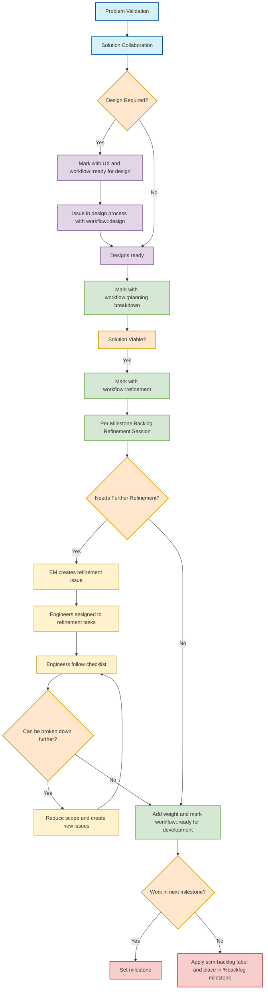

## Common Links

| **Category**            | **Handle** |
|-------------------------|-------------|
| **GitLab Team Handle**  | Not available |
| **Slack Channel**               | [`#g_create_source-code-review-fe`](https://gitlab.enterprise.slack.com/archives/CS5NHHBJ7) |
| **Slack Handle**               | Not available |
| **Team Boards**         | [`Current Milestone`](https://gitlab.com/groups/gitlab-org/-/boards/1149629) |
| **Issue Tracker**       | [`group::source code` + `frontend` in `gitlab-org/gitlab`](https://gitlab.com/groups/gitlab-org/-/issues/?sort=created_date&state=opened&label_name%5B%5D=frontend&label_name%5B%5D=group%3A%3Asource%20code&first_page_size=20) |
| **Sentry dashboard**       | [`Errors in the last 7 days`](https://new-sentry.gitlab.net/organizations/gitlab/dashboard/22/?project=4&statsPeriod=7d) |

## Team Vision

A central piece in GitLab users' experience, innovating and keeping the experience delightful for all product categories that fall under the [Source Code group](/handbook/product/categories/#source-code-group) of the [Create stage](/handbook/product/categories/#create-stage) of the [DevOps lifecycle](/handbook/product/categories/#devops-stages). For information on our product direction, visit the [Category Direction - Source Code Management](https://about.gitlab.com/direction/create/source_code_management/) page.

## Team Mission

Support all our counterparts with frontend engineering expertise, including implementation, tech debt management, and timely frontend insights in discovery phases.

## Commonly Monitored Issue Lists

* [Source Code + Frontend issues](https://gitlab.com/groups/gitlab-org/-/issues/?sort=created_date&state=opened&label_name%5B%5D=frontend&label_name%5B%5D=group%3A%3Asource%20code&first_page_size=20)
* [Milestone Planning Issues](https://gitlab.com/gitlab-org/create-stage/-/issues/?sort=created_date&state=opened&label_name%5B%5D=group::source%20code&first_page_size=20)
* [Triage reports](https://gitlab.com/gitlab-org/quality/triage-reports/-/issues/?sort=created_date&state=opened&label_name%5B%5D=type%3A%3Aignore&label_name%5B%5D=group%3A%3Asource%20code&first_page_size=20)
* [Feature flag reports](https://gitlab.com/gitlab-org/quality/triage-reports/-/issues/?sort=created_date&state=opened&label_name%5B%5D=triage%20report&label_name%5B%5D=feature%20flag&label_name%5B%5D=group%3A%3Asource%20code&first_page_size=20)
* [OKRs (confidential)](https://gitlab.com/gitlab-com/gitlab-OKRs/-/issues/?sort=created_date&state=opened&assignee_username%5B%5D=andr3&label_name%5B%5D=group%3A%3Asource%20code&first_page_size=20)

## Team Members

The following people are permanent members of the Create:Source Code FE Team:



## Stable Counterparts

The following members of other functional teams are our stable counterparts:



## Core Responsibilities

* Collaborate with Product and UX on ideation, refinement and scheduling of relevant work
* Provide Frontend support for feature development, bug fixes, under the [Source Code Management Product Category](https://about.gitlab.com/direction/create/source_code_management/)
* Address bug reports and regressions
* Identify and prepare maintenance work to improve developer experience
* Collaborate on efforts across the Frontend department

## Projects

### Active Project Table

| Start Date | Project  | Description | Tech Lead |
| ------ | ------ | ------ |  ------ |
| 2023-09 | [New Diffs](/handbook/engineering/architecture/design-documents/rapid_diffs/) ([Epic](https://gitlab.com/groups/gitlab-org/-/epics/11559)) | A project to deliver a reusable and performant way of rendering diffs across GitLab | — |
| 2024-10 | [Directory and File Page Improvements](https://gitlab.com/groups/gitlab-org/-/epics/12557) | A project to improve user experience of header area for directory and file pages | — |

### Archived Project Table

| Start Date | End Date |Project  | Description | Tech Lead |
| ------ | ------ | ------ |  ------ | ------ |
| 2023 | put on hold | [Blame info in Blob page](https://gitlab.com/groups/gitlab-org/-/epics/11471) | Improve usability of repository by rendering blame information in blob page | — |
| 2023 | 2024 | [Branch Rules - Edit](https://gitlab.com/groups/gitlab-org/-/epics/8075) | Allow editing the branch rule details in one place | — |
| 2022-09 | 2023-04 | Branch Rules - Overview | Place all settings pertaining to branch rules in one place - overview only | — |
|  2021      | 2022        | [Refactor Repository browser into 1 vue app](https://gitlab.com/groups/gitlab-org/-/epics/5531) | Render the blob page within the Repository frontend app for smoother experience | — |

## Engineering Onboarding

### Work

In general, we use the standard GitLab [engineering workflow](/handbook/engineering/workflow/). To get in touch
with the Create:Source Code FE team, it's best to create an issue in the relevant project
(typically [GitLab](https://gitlab.com/gitlab-org/gitlab)) and add the `~"group::source code"` and `~frontend` labels, along with any other
appropriate labels (`~devops::create`, `~section::dev`). Then, feel free to ping the relevant Product Manager and/or
Engineering Manager as listed above.

For more urgent items, feel free to use [#g_create_source_code](https://gitlab.slack.com/archives/g_create_source-code) or [#g_create_source_code_fe](https://gitlab.slack.com/archives/g_create_source-code-review-fe) on Slack.

[Take a look at the features we support per category here.](/handbook/product/categories/features/#source-code)

### Code Reviewing

To prevent the creation of knowledge silos and also receiving input from people outside of the team, we follow these principles:

* Not all Merge Requests need to go through the team
* However, Merge Requests that seem important for the team to be aware, let's ensure one of the reviews go through a team member

**MRs important to the team:** these are changes to logic in our apps or meaningful component changes. Sequential work in a larger epic is also beneficial to have oversight from peers within the team. But bottom line, use your best judgement.

{}

### Issue refinement

1. Once we have validated the problem, product, UX, and engineering will collaborate to propose a solution and decide on what's technically feasible. The proposed solution may be shared with users to validate it solves the problem.
    1. Issues that require design work are marked with `UX` and `workflow::ready for design`.
    1. Issues in the design process are marked with `workflow::design`.
    1. Once designs are ready and the proposed solution is viable then the label `workflow::planning breakdown` will be applied.
1. Once we have confirmed the proposed solution is viable, we will move to break it down as much as possible. When issues are ready for this stage, PM will mark issues with `workflow::refinement` label to signal next step.
1. We have 1 regularly scheduled "Per Milestone" backlong refinement session. During then, we review the issues in the backlog together. Each engineer also proposes issues they believe are valuable for the team to work on as deliverables candidates.
    1. If an issue needs further refinement, we'll distribute tasks labeled `workflow::refinement` among engineers.
    1. If an issue does not need further refinement, the label `workflow::ready for development` will be applied.
    1. If the team believes the issue should be worked on in the next milestone, the milestone will be set. Otherwise, the label `scm-backlog` will be applied and the issue will be placed in `%backlog` milestone.
1. EM will create a refinement issue ([example](https://gitlab.com/gitlab-com/create-stage/source-code-be/-/issues/249)) and distribute tasks labeled `workflow::refinement` among engineers.
1. Engineers or EM will follow the checklist for assigned issues, work with PM, UX, and other engineering counterparts where necessary to address questions and concerns.
1. If the planned implementation of the issue can be further broken down, the engineer/EM will work with the PM to reduce scope and create new issues until this is the case (either PM or engineer/EM can create new work items).
1. Once an issue is fully refined, engineers or EM will add an appropriate [weight](/handbook/engineering/development/dev/create/source-code/backend/#weight-categories) and label it as `workflow::ready for development`. These issues can then be added to the milestone.

#### Diagram



### Issue Refinement Checklist

For issues that need refinement, the Engineer/EM should add a comment using this template and complete all checklist items.

If you cannot finish any of these steps, ping EM/PM.

```plaintext
# Issue Refinement Checklist

## Problem verification
- [ ] Issue label is ~"workflow::refinement"
- [ ] Issue title clearly describes the feature or change
- [ ] Issue description defines requirements and expectations
- [ ] Required permissions and access levels defined
- [ ] Desktop design is defined (if needed)
- [ ] Mobile design is defined (if needed)

## Implementation plan

- [ ] A comment with an implementation plan is created
- [ ] Implementation plan includes accessibility specification (if needed)
- [ ] Implementation plan includes proposal for ~"analytics instrumentation" (if needed)
- [ ] A separate issue is opened for adding ~"analytics instrumentation" and linked to this issue (if needed)
- [ ] Implementation plan includes ~documentation changes (if needed)
- [ ] Implementation plan includes proposal for adding feature tests (if needed)
- [ ] Implementation plan includes feature tests (if needed)
- [ ] Issue is small and doesn't need to be broken down

## Final steps
- [ ] This issue has a weight
- [ ] There are no blockers
- [ ] Issue has ~"workflow::ready for development" label
```

### Bug Refinement Checklist

For bug reports that need refinement, the Engineer/EM should add a comment using this template and complete all checklist items.

```plaintext
# Bug Refinement Checklist

## Bug verification
- [ ] Issue label is ~"workflow::refinement"
- [ ] Issue label is ~"type::bug"
- [ ] Issue title clearly describes the bug
- [ ] Steps to reproduce are documented
- [ ] Issue is still reproducible
- [ ] Severity labels are defined
- [ ] Related logs or error messages are attached

## Technical analysis
- [ ] Root cause has been identified or hypothesized
- [ ] Affected components/services are identified
- [ ] Potential side effects of the fix are considered

## Implementation plan
- [ ] A comment with an implementation plan is created
- [ ] Fix scope is contained and doesn't require larger refactoring
- [ ] Test cases to verify the fix are defined

## Final steps
- [ ] This issue has a weight
- [ ] There are no blockers
- [ ] Issue has ~"workflow::ready for development" label
```

### Implementation plan

Add a comment to the issue under refinement using the provided template.

```plaintext
### Implementation Plan

**1. Approach**

<!-- Provide a high-level description of the implementation idea -->

**2. Dependencies**

- [ ] Requires ~backend
- [ ] Requires ~frontend
- [ ] Requires ~database
- [ ] Requires ~documentation
- [ ] Requires ~UX work
- [ ] External service dependencies identified
- [ ] Requires ~API changes

**3. Implementation Steps**

<!-- Provide step by step description of what needs to be done -->

- Task 1
- Task 2
- Task 3

**4. Edge Cases**

<!-- Does the implementation cover all scenarios (success, failure) -->

- Success scenarios:
  - Case 1
  - Case 2

- Error scenarios:
  - Case 1
  - Case 2

- Edge conditions:
  - Case 1
  - Case 2


@engineer_username please review this implementation plan.
<!--
Pick a peer engineer following this criteria:
1. is a subject matter expert.
2. might have some familiarity with the topic. or
3. ask on slack who'd be available to review this plan before the due date of the issue
-->
```

### Capacity planning

{}

#### Weights

{}

#### Example of Weights

w1: [Blame view - "authored" line leaking into next row](https://gitlab.com/gitlab-org/gitlab/-/issues/435124)

w2: [CSV rendering hangs viewer for large files](https://gitlab.com/gitlab-org/gitlab/-/issues/340779)

w3: [Edit Branch Rules: Update selector to support searching Deploy Keys](https://gitlab.com/gitlab-org/gitlab/-/issues/431769)

#### Source code context

When weighing issues that have to do with Blob view, make sure to take into account the duality of Blob. We use both HAML and Vue to render the Blob view. There is a high chance that you will implement your changes for both. Majority of file types uses Vue architecture. Though there are [some file types that need backend syntax highlighter](https://gitlab.com/gitlab-org/gitlab/-/blob/9fe882b3d1597a75a366755c8d894f2a52439d93/app/assets/javascripts/repository/constants.js#L91) and therefore are rendered with HAML. The same will happen, [when an error occurs](https://gitlab.com/gitlab-org/gitlab/-/blob/9fe882b3d1597a75a366755c8d894f2a52439d93/app/assets/javascripts/repository/components/blob_content_viewer.vue#L210).

This duality will be resolved with the [Link to package managers when viewing dependency files with highlight.js](https://gitlab.com/groups/gitlab-org/-/epics/7888).

#### Spike issues

{}

### Workflow labels

{}

### Async standup

The groups in the Source Code group conduct asynchronous standups in the [#g_create_source_code_standup](https://gitlab.slack.com/archives/g_create_standup) channel every Monday.

The goal is to support the members of these groups in connecting at a personal level, not to check in on people’s progress or replace any existing processes to communicate status or ask for help, and the questions are written with that in mind:

* What did you do outside of work since we last spoke?
* What are you planning to do today?
* Is anything blocking your progress or productivity?

For more background, see the [Async standup feedback issue](https://gitlab.com/gitlab-org/create-stage/issues/4) on the Create stage issue tracker.

### Retrospectives

We have 1 regularly scheduled "Per Milestone" retrospective, and can have ad-hoc "Per Feature" retrospectives more focused at analyzing a specific case, usually looking into the Iteration approach.

#### Per Milestone

{}

### Milestone Kickoff & Retrospective review

At the start of each milestone we have a synchronous **Kickoff** session where every IC take turns at presenting their plan for their Deliverables for the new milestone.

This happens at least 2 working days after all Deliverables are assigned, which happens on the first day of the milestone.

If any additional information is needed from design, a list of requests will be issued to the designer after the meeting.

During this call, we also do a quick **Retrospective review** going through the highlights of the discussions in the asynchronous issue mentioned above.

## Other related pages

### Issues

* April 2020: [Frontend: Iteration Retrospective (Source Code)](https://gitlab.com/gl-retrospectives/create-stage/source-code/-/issues/22)
