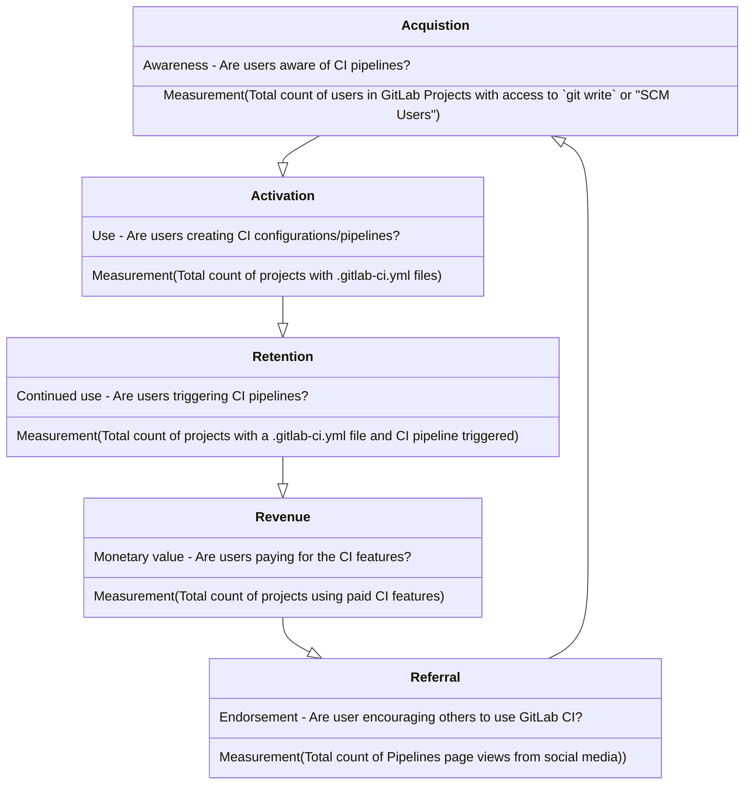

This team maps to [Verify](/handbook/product/categories/#verify-stage) DevOps stage and supports the Continuous Integration [use case](/handbook/marketing/brand-and-product-marketing/product-and-solution-marketing/usecase-gtm/ci/).

## Vision

For an understanding of what this team is going to be working on take a look at [the product vision](https://about.gitlab.com/direction/verify/). This team is responsible for delivering on the following directions:

- [Continuous Integration](https://about.gitlab.com/direction/verify/continuous_integration/)
- [Merge Trains](https://about.gitlab.com/direction/verify/merge_trains/)

## Mission

Make software development easier, faster, and more reliable by creating and supporting a Continuous Integration product that is performant, scalable, and lovable.

The Verify:Pipeline Execution Group is focused on supporting the functionality with respect to
[Continuous Integration](https://about.gitlab.com/solutions/continuous-integration/). A key focus for the PE group is delivering features that achieve the outcome we track in our performance indicator.

## Driving Factors

### Performance

- Improving perceived performance from a customer perspective. For example, responsive UIs, reduced time to results.
- Reducing processing time in Pipeline Execution owned code.
- Ensuring the reliably of results. For example, return results to web requests in a timely manner (overlaps with scalability).

### Scalability

- Supporting a lot of customers.
- Supporting a single customer with a large and/or complex set up.

### Developer Efficiency

- Reducing the complexity of the codebase.
- Dealing with the breadth of the code owned by the team.
- Reducing length of time it takes to get an MR through the review process.
- Ensuring efficiency related to Community Contributions;
  - Ensuring that issues are approachable by the community.
  - Improving efficiency in the review process for community contributions.

### Customer Experience

- Ensuring that customer issues are resolved in a timely manner.
- Addressing SUSImpacting issues in a timely manner.
- Ensuring reliable and accurate documentation is available.

## Performance Indicator

We measure the value we contribute by using Performance Indicators (PI), which we define and use to track progress.
The current [PI for the Pipeline Execution group](https://internal.gitlab.com/handbook/company/performance-indicators/product/#verify-ci-verify-runner-count-of-pipelines-triggered-by-unique-users) is the `number of unique users who trigger ci_pipelines`. For more details, please check out the [Product Team Performance Indicators](https://internal.gitlab.com/handbook/company/performance-indicators/product/#regular-performance-indicators). To view the latest Verify stage ci_pipeline data see our [Tableau Dashboard](https://10az.online.tableau.com/t/gitlab/views/VerifyPerformanceIndicatorDashboard/VerifyPerformanceIndicatorHub).

### Usage Funnel

Based on the AARRR framework (Acquisition, Activation, Retention, Revenue, Referral), this funnel represents the customer journey in using GitLab CI.  Each state in the funnel is defined with a metric to measure behavior. Product managers can focus on any of the various states in the funnel to prioritize features that drive a desired action.

### Core domain

| Domain | Issues |
| ------ | ------ |
| Pipeline processing: processes responsible for transitions of pipelines, stages and jobs. | [~pipeline processing](https://gitlab.com/gitlab-org/gitlab/-/issues/?sort=milestone_due_desc&state=opened&label_name%5B%5D=pipeline%20processing&label_name%5B%5D=group%3A%3Apipeline%20execution&first_page_size=20) |
| Rails-Runner communication: jobs queuing, API endpoints and their underlying functionalities related to operations performed by and for Runners. |  |

#### Continuous Integration domains

| Domain | Issues |
| ------ | ------ |
| Continuous Integration and Deployment Admin Area settings | [~CI/CD Settings](https://gitlab.com/gitlab-org/gitlab/-/issues/?sort=milestone_due_desc&state=opened&label_name%5B%5D=CI%2FCD%20Settings&label_name%5B%5D=group%3A%3Apipeline%20execution&first_page_size=20) |
| Repositories analytics for groups | [~CI reports](https://gitlab.com/gitlab-org/gitlab/-/issues/?sort=milestone_due_desc&state=opened&label_name%5B%5D=CI%20reports&label_name%5B%5D=group%3A%3Apipeline%20execution&first_page_size=20) |
| GitLab CI/CD artifacts reports types | [~CI reports](https://gitlab.com/gitlab-org/gitlab/-/issues/?sort=milestone_due_desc&state=opened&label_name%5B%5D=CI%20reports&label_name%5B%5D=group%3A%3Apipeline%20execution&first_page_size=20) |
| Unit test reports | [~testing::code testing](https://gitlab.com/gitlab-org/gitlab/-/issues/?sort=milestone_due_desc&state=opened&label_name%5B%5D=testing%3A%3Acode%20testing&label_name%5B%5D=group%3A%3Apipeline%20execution&first_page_size=20) |
| Test with GitLab CI/CD and generate reports in merge requests |  |
| Load Performance Testing | [~testing::load performance](https://gitlab.com/gitlab-org/gitlab/-/issues/?sort=milestone_due_desc&state=opened&label_name%5B%5D=testing%3A%3Aload%20performance&label_name%5B%5D=group%3A%3Apipeline%20execution&first_page_size=20) |
| Metrics Reports |   |
| Test coverage visualization | [~testing::coverage](https://gitlab.com/gitlab-org/gitlab/-/issues/?sort=milestone_due_desc&state=opened&label_name%5B%5D=testing%3A%3Acoverage&label_name%5B%5D=group%3A%3Apipeline%20execution&first_page_size=20) |
| Browser Performance Testing | [~testing::browser performance](https://gitlab.com/gitlab-org/gitlab/-/issues/?sort=milestone_due_desc&state=opened&label_name%5B%5D=testing%3A%3Abrowser%20performance&first_page_size=20) |
| Fail Fast Testing |   |
| Accessibility testing | [~testing::accessibility](https://gitlab.com/gitlab-org/gitlab/-/issues/?sort=milestone_due_desc&state=opened&label_name%5B%5D=testing%3A%3Aaccessibility&label_name%5B%5D=group%3A%3Apipeline%20execution&first_page_size=20) |
| Usability testing | [~testing::usability](https://gitlab.com/gitlab-org/gitlab/-/issues/?sort=milestone_due_desc&state=opened&label_name%5B%5D=testing%3A%3Ausability&label_name%5B%5D=group%3A%3Apipeline%20execution&first_page_size=20) |
| Review apps | [~testing::review apps](https://gitlab.com/gitlab-org/gitlab/-/issues/?sort=milestone_due_desc&state=opened&label_name%5B%5D=testing%3A%3Areview%20apps&label_name%5B%5D=group%3A%3Apipeline%20execution&first_page_size=20) |
| Visual review tool (deprecated) | [~testing::visual review tool](https://gitlab.com/gitlab-org/gitlab/-/issues/?label_name%5B%5D=testing%3A%3Avisual%20review%20tool) |
| Scheduled pipelines | [~pipeline schedules](https://gitlab.com/gitlab-org/gitlab/-/issues/?sort=milestone_due_desc&state=opened&label_name%5B%5D=pipeline%20schedules&label_name%5B%5D=group%3A%3Apipeline%20execution&first_page_size=20)  |
| Pipeline efficiency | [~ci::scaling](https://gitlab.com/gitlab-org/gitlab/-/issues/?sort=milestone_due_desc&state=opened&label_name%5B%5D=ci%3A%3Ascaling&label_name%5B%5D=group%3A%3Apipeline%20execution&first_page_size=20)  |
| Building images using Docker |   |
| External SCM and CI Integration |   |
| External pipeline validation |   |
| Rate limits on pipeline creation | [~Category:Continuous Integration + ~Eng-Inter-Dept::Rate Limits](https://gitlab.com/gitlab-org/gitlab/-/issues/?sort=milestone_due_desc&state=opened&label_name%5B%5D=Category%3AContinuous%20Integration&label_name%5B%5D=group%3A%3Apipeline%20execution&label_name%5B%5D=Eng-Inter-Dept%3A%3ARate%20Limits&first_page_size=20)  |
| Job logs |   |
| Job log artifacts |   |
| Merge Trains | [~Category:Merge Trains](https://gitlab.com/gitlab-org/gitlab/-/issues/?sort=milestone_due_desc&state=opened&label_name%5B%5D=group%3A%3Apipeline%20execution&label_name%5B%5D=Category%3AMerge%20Trains&first_page_size=20)  |

Not included in the Pipeline Execution group's domain:

- Secrets Management, see the [direction page](https://about.gitlab.com/direction/software_supply_chain_security/pipeline_security/secrets_management/)
- Pipeline Authoring, see the [direction page](https://about.gitlab.com/direction/verify/pipeline_composition/)
- Compliance in Pipelines, see the [direction page](https://about.gitlab.com/direction/software_supply_chain_security/compliance/compliance-management/)
- [Job artifacts: storage and management of artifacts is the gateway for many CI/CD features](https://about.gitlab.com/direction/verify/)

---

## Technical Roadmap

### FY25

These are our high-level engineering driven goals for the year. As with any of our goals, they are ambitious and subject to change.

#### Performance

##### Pipeline Speed

**Goals:**

- Understand what we can do to improve pipeline speed
- Prototype at least one big swing improvement

##### Fix Long Standing Pipeline Status Issues

**Goals:**

- Deep dive into existing pipeline status issues and code
  - Determine if there are and make systemic changes to address a number of the issues

#### Scalability

##### Sidekiq

**Goals:**

- Improve performance of our background workers to increase reliability and scalability

##### Support Improved Job Searching Capabilities

**Goals:**

- Improve our ability to support additional search and filtering capabilities for jobs

##### Reduce Operating costs

**Goals:**

- Contribute to data retention planning
- Identify potential cost savings from compressing job logs - [Spike](https://gitlab.com/gitlab-org/gitlab/-/issues/390114)
  - Depending on results, schedule work to implement compression

#### Developer Efficiency

##### Technical Debt Reduction

**Goals:**

- Reduce the overall technical debt existing within the codebase
- Avoid accumulating more long-term debt by scheduling follow-up issues promptly

##### Frontend Refactoring to Vue

**Goals:**

- Complete the refactoring of the pipeline subscriptions pages to Vue
- Identify any additional areas that should be refactored [Epic](https://gitlab.com/groups/gitlab-org/-/epics/12836)

##### Pipeline Rendering

**Goals:**

- Complete performance improvements for pipeline page rendering. This functionality is used frequently by developers and their productivity is impacted by poor performance.

##### Merge Trains

**Goals:**

- Get merge trains to a state where they are scalable enough to be used effectively by the GitLab project.

---

## Team Members



### Additional Team Responsibilities

These roles/responsibilities will be assigned to team members on a rotating basis to ensure we spread the load across
the full team, and no individual has undue hardship by being the only "go-to" person for any of these tasks.

#### Front-line Responder

This team member will have the following responsibilities for the milestone (in priority order) and will not have any assigned ~Deliverable items:

1. Respond to broken-master alerts for Pipeline Execution.
1. DRI for any incoming help requests from support.
    1. Existing help requests may be transferred to them at the discretion of the existing DRI.
    1. They are free to pull in others as needed to address the request, but remain the DRI for ensuring the requests are addressed.
1. First developer pulled into customer escalations unless there is an obvious reason to choose another team member.
1. [Optional] Organize and host a weekly swarm meeting to work on help requests with additional team members.
1. Respond to incoming questions in slack in `#pipeline-execution` and `#s-verify` (where related to Pipeline Execution).
    1. They can redirect to other team members as they deem necessary. The important part is to ensure we are responsive.
1. Investigate error budget overages.
1. Additional maintenance tasks (in suggested priority order):
    1. Address flaky tests as time permits.
    1. Work on long-standing maintenance issues as time permits.
        1. Example, we have a long list of very old feature flags that need to be addressed.
    1. Refinement of ~"type::maintenance" issues in ~"cicd::planning" as time permits.
    1. Any other ~"type::maintenance" issues in ~"cicd::active" as time permits.

For any of the above tasks, when an urgent issue arises outside of the team members working hours, other team members will need to be the first responders.
The milestone's Front-line Responder will be responsible for following up on such issues during their working hours.
They are not expected to be on-call 24/7 during the milestone.
At the end of the milestone, any issues that are still ongoing, may be transitioned to the incoming First Responder. If it makes sense for the original team member to continue being the DRI, this can also be done.

#### Community Coordinator

This team member will have the following responsibilities for the milestone in addition to their ~Deliverable task:

1. Do a first pass over any new community contributions as identified in the weekly [`Verify Pipeline teams: Community contributions report`](https://gitlab.com/gitlab-org/quality/triage-reports/-/issues/?sort=updated_desc&state=opened&label_name%5B%5D=Community%20contribution&label_name%5B%5D=devops%3A%3Averify&first_page_size=20) to ensure they seem like they are on the right track.

#### Rotation Schedule

**Program Paused**

| Milestone | Front-line Responder | Community Coordinator |
| --------- | -------------------- | --------------------- |

## Stable Counterparts

To find our stable counterparts, look at the Pipeline Execution [product category listing](/handbook/product/categories/#pipeline-execution-group).

## Technologies

Like most GitLab backend teams we spend a lot of time working in Rails on the main [GitLab CE app](https://gitlab.com/gitlab-org/gitlab-ce),
but we also do a lot of work in Go which is the language that [GitLab Runner](https://gitlab.com/gitlab-org/gitlab-runner)
is written in. Familiarity with Docker and Kubernetes is also useful on our team.

## Useful Links

- [Issue tracker: `~group::pipeline execution`](https://gitlab.com/groups/gitlab-org/-/issues?label_name%5B%5D=group%3A%3Apipeline+execution&scope=all)
- [Slack channel: `#g_pipeline-execution`](https://gitlab.slack.com/archives/CPCJ8CCCX)
- [GitLab unfiltered: Pipeline Execution group](https://www.youtube.com/playlist?list=PL05JrBw4t0KpsVi6PG4PvDaVM8lKmB6lV)
- [Grafana dashboard](https://dashboards.gitlab.net/d/stage-groups-pipeline_execution/stage-groups-group-dashboard-verify-pipeline-execution?orgId=1)
- [Tableau dashboard (to be migrated)](https://gitlab.com/gitlab-data/tableau/-/issues/208)
- [Next planning issue](https://gitlab.com/gitlab-org/ci-cd/pipeline-execution/-/issues/?sort=popularity&state=opened&label_name%5B%5D=Planning%20Issue&first_page_size=20)
- [Help Requests for pipeline execution](https://gitlab.com/gitlab-com/ops-sub-department/section-ops-request-for-help/-/issues/?state=opened&label_name%5B%5D=Help%20group%3A%3Apipeline%20execution)
- [Current milestome retro](https://gitlab.com/gl-retrospectives/verify-stage/pipeline-execution/-/issues?search=Pipeline+Execution+retrospective&sort=popularity&state=opened)
- [Needs weight board](https://gitlab.com/groups/gitlab-org/-/boards/4178322)
- [Current milestone board](https://gitlab.com/groups/gitlab-org/-/boards/1372896)

### Development Docs

For those new to the team, these links may be helpful in learning more about the product and technology.

- [CI/CD Development Documentation](https://docs.gitlab.com/ee/development/cicd/index.html)

### Engineering Overview

- [CI Backend Architectural Walkthrough - May 2020](https://www.youtube.com/watch?v=ew4BwohS5OY)
- [Frontend CI product / codebase overview - June 2020](https://www.youtube.com/watch?v=7CUd7aAUiWo)

## Dashboards


  



  



  



  


### Cross-functional prioritisation

The team uses the [`#g_pipeline_execution_quad`](https://gitlab.slack.com/archives/C03KK284L23) Slack channel to discuss cross-functional prioritisation in addition to any other topics that require the quad to collaborate on. Additionally, the quad also reviews the [dashboard](/handbook/engineering/development/ops/verify/pipeline-execution/#merged-merge-request-types) which shows the % of MRs that are [bugs](https://gitlab.com/groups/gitlab-org/-/boards/4439443?label_name[]=group%3A%3Apipeline%20execution&label_name[]=type%3A%3Abug) vs [maintenance](https://gitlab.com/groups/gitlab-org/-/boards/4439961?label_name[]=group%3A%3Apipeline%20execution&label_name[]=type%3A%3Amaintenance) vs [features](https://gitlab.com/groups/gitlab-org/-/boards/4440070?label_name[]=group%3A%3Apipeline%20execution&label_name[]=type%3A%3Afeature) to ensure the team's efforts are properly aligned to the prioritisation.

## How We Work

The [Pipeline Execution Workflow board](https://gitlab.com/groups/gitlab-org/-/boards/1372896) is the source of truth for current and upcoming work.

### Planning

Our planning timeline follows the [GitLab Product Development timeline](/handbook/engineering/workflow/#product-development-timeline).

For information about `Engineering Time` see [Engineering Initiatives](/handbook/engineering/#engineering-initiatives).

**PM** (with help from **EM** as needed) will curate the [list of `Candidate::x.x` + not `Engineering Time` list](https://gitlab.com/gitlab-org/gitlab/-/issues/?sort=updated_desc&state=opened&label_name%5B%5D=candidate%3A%3A17.x&label_name%5B%5D=group%3A%3Apipeline%20execution&not%5Blabel_name%5D%5B%5D=Engineering%20Time&first_page_size=20) to ensure there is a reasonable number of high priority issues to select from at any point. If there are no issues for the milestone you are looking for you may select from a future milestone.

**EM**  (with help from **PM** as needed) will maintain the [list of `Engineering Time` + `Candidate::x.x`](https://gitlab.com/gitlab-org/gitlab/-/issues/?sort=updated_desc&state=opened&label_name%5B%5D=candidate%3A%3A17.x&label_name%5B%5D=group%3A%3Apipeline%20execution&label_name%5B%5D=Engineering%20Time&first_page_size=20) issues to ensure there is a reasonable number of high priority issues to select from at any point. If there are no issues for the milestone you are looking for you may select from a future milestone.

By the Friday 2 weeks before the end of the current milestone each **Engineer** will:

- Ensure the milestone on your current issue reflects the milestone you believe it will be completed based on the latest knowledge
  - **Note:** Any issues you have in progress that will not be completed in the current milestone can be used in lieu of selecting a new issue as long as the criteria matches
    - If you are unsure if the issues you have in progress are still a priority check with the EM and PM to verify.
    - Update the ~Deliverable or ~Stretch label if there is one if necessary
- Select 1 [`Candidate::x.x` + not `Engineering Time` issue](https://gitlab.com/gitlab-org/gitlab/-/issues/?sort=updated_desc&state=opened&not%5Blabel_name%5D%5B%5D=Engineering%20Time&label_name%5B%5D=group%3A%3Apipeline%20execution&label_name%5B%5D=candidate%3A%3A17.x&first_page_size=20) that you will work on in the upcoming milestone. Start with ~priority::1 issues first followed by ~priority::2 and ~priority::3
  - Assign yourself
  - Assure there is a weight set
  - Set the milestone according to the milestone when you expect the work to complete
    - If it is not the upcoming milestone, break the issue into multiple issues, one of which can be completed in the upcoming milestone if at all possible.
      - Let the EM/PM know you have done this in an issue comment on the original issue so they can ensure the rest of the issues are planned for appropriately.
  - Add the `Deliverable` label.
- Select 1 [`flaky-test` issue](https://gitlab.com/gitlab-org/gitlab/-/issues/?sort=updated_desc&state=opened&label_name%5B%5D=group%3A%3Apipeline%20execution&label_name%5B%5D=failure%3A%3Aflaky-test&first_page_size=20) to fix.
  - Do a quick check to see if there are multiple issues that are clearly caused by the same issue, link these as related and/or assign to themselves.
  - Set the milestone appropriately to indicate when the test will be fixed.
    - If you are unsure of the timeline, you can delay setting the milestone until you are comfortable committing to a milestone.
- Select 1 item to weight and refine for [upcoming work](https://gitlab.com/groups/gitlab-org/-/boards/4178322)
  - Assign this item to yourself. You can unassign it once you have completed the refinement process.
    - You may want to add a comment indicating that you are assigning to yourself for refinement purposes only, so there is no confusion. This is entirely optional.
  - Do not set a milestone on the issue.
  - If refinement is going to take considerable effort, create a [refinement "~spike" issue](https://gitlab.com/gitlab-org/gitlab/-/issues/new?issuable_template=Pipeline%20Execution%20Refinement%20Spike) (see also [Spikes](#spikes) and [Steps for Refining and Weighting Issues](#steps-for-refining-and-weighting-issues))
    - Tag the **EM** in a comment on the spike to let them know you have created this spike.
    - Use this as your `Engineering Time` item for the milestone.
- Select 1 item to weight and refine for [community contribution](https://gitlab.com/groups/gitlab-org/-/boards/4178322)
  - Assign this item to yourself. You can unassign it once you have completed the refinement process.
    - You may want to add a comment indicating that you are assigning to yourself for refinement purposes only, so there is no confusion. This is entirely optional.
  - Do not set a milestone on the issue.
  - If refinement is going to take considerable effort, create a [refinement "~spike" issue](https://gitlab.com/gitlab-org/gitlab/-/issues/new?issuable_template=Pipeline%20Execution%20Refinement%20Spike) (see also [Spikes](#spikes) and [Steps for Refining and Weighting Issues](#steps-for-refining-and-weighting-issues))
    - Tag the **EM** in a comment on the spike to let them know you have created this spike.
    - Use this as your `Engineering Time` item for the milestone.
- Select 1 [`Engineering Time` + `Candidate::x.x` issue](https://gitlab.com/gitlab-org/gitlab/-/issues/?sort=updated_desc&state=opened&label_name%5B%5D=candidate%3A%3A17.x&label_name%5B%5D=group%3A%3Apipeline%20execution&label_name%5B%5D=Engineering%20Time&first_page_size=20) to fix.
- Assign yourself
  - Assure there is a weight set
  - Set the milestone according to the milestone when you expect the work to complete
    - If it is not the upcoming milestone, break the issue into multiple issues, one of which can be completed in the upcoming milestone if at all possible.
      - Let the EM/PM know you have done this in an issue comment on the original issue so they can ensure the rest of the issues are planned for appropriately.
  - add the `Deliverable` label or `Stretch` label.
- Add a comment to the milestone planning issue to indicate which issues that you have completed this planning work and the issues you have selected.

Throughout the milestone, if an **Engineer** completes their tasks and has extra capacity:

- checkout [What do I work on next](#what-do-i-work-on-next)

- By the Monday the week the milestone ends:
  - Planning issue is finalized and **PM** will tag manager, SET/QEM, Product Design, engineers, and EM for review and feedback.

- By the Friday the milestone ends:
  - **Engineers** should comment on the planning issue with any changes to their planned work.
  - **PM** completes monthly kick-off video featuring `~direction` and `Deliverable` issues

- By the Monday of release week:
  - The **EM** will ensure that labels are set correctly for any milestone issues

**Note:** The **EM** and **PM** may need to modify the team commitments and schedule work for the upcoming milestone as we focus on [Customer Results](/handbook/values/#results) over what we plan.

#### How Engineering Refines Issues

*side note: we prefer [using Refining over Grooming](/handbook/communication/top-misused-terms)*

Engineers are expected to allocate approximately 6 hours each milestone to refine and weight issues on the [`~needs weight` board](https://gitlab.com/groups/gitlab-org/-/boards/4178322).

The purpose of refining an issue is to ensure the problem statement is clear enough to provide a rough effort sizing estimate; the intention is not to provide **solution validation** during refinement. When refining issues, engineers should timebox the activity to no more than 2 hours per issue. If an issue is complex and will require more research, we should track that effort in a refinement "~spike" to ensure we account for it in milestone planning. The "~spike" should be linked as blocking the original issue and outline the outcomes expected and a timebox for the effort should be specified. The original issue should be labeled as "~workflow::blocked".

Engineering uses the [following handbook guidance for determining weights](#weighting-issues). If any issue needs any additional `~frontend ~backend ~Quality ~UX ~documentation` reviews, they are assigned to the respective individual(s).

##### Checklist for Refining Issues

1. Does the issue have a problem statement in the description?
1. Does the issue have the expected behaviour described well enough for anyone to understand?
1. Does the issue explicitly define who the stakeholders are (e.g. BE, FE, PM, UX and/or Tech Writer)?
1. Does the issue have a proposal in the description? *If so:*
    1. Does the proposal address the problem statement?
    1. Are there any unintended side effects of the implementation?
1. Does the issue have proper labeling matching the job to be done? (e.g. bug, feature, performance)

Any one on the team can contribute to answering the questions in this checklist, but the final decisions are up to the PM and EMs.

##### Steps for Refining and Weighting Issues

Engineers will:

1. Go through the checklist above for refining issues assigned to them.
1. Split a backend issue out from the main issue if backend work needs to be completed before frontend work can begin.
1. Add a [weight based on the definitions](#weighting-issues).
1. Update the `~workflow::` label to the appropriate status, e.g.
   - ~"workflow::design" if further design refinement is needed, and let the designer know.
   - ~"workflow::ready for development" when refinement is completed and a weight has been applied, signaling that it's ready for implementation and the issue can now be prioritized
   - ~"workflow::blocked" if more investigation and research is needed. Create a [refinement "~spike" issue](https://gitlab.com/gitlab-org/gitlab/-/issues/new?issuable_template=Pipeline%20Execution%20Refinement%20Spike) and ping the PM and EM.
1. Remove the "~needs weight" label if weighting was completed.
1. Unassign themselves from the issue when they are done refining and weighting the issue.

##### Timeboxing Issue Refinement

Because we should not be spending more than 2 hours per issue, we should re-evaluate if more time is needed or if a spike is required based on

1. If the issue is still reproducible on GitLab.com. If the cause is not obvious, a good first step is to ask the author for clarifications.
1. If Support engagement is present in the issue. We can tell if the issue is created by a GitLab team member or if it has the ~customer label.
1. If the issue is on GitLab.com or if it's on a self-managed instance. If this only affects self-managed instance, we can ask for request for help issue instead.
1. The scope and affect of the issue. If it's only affecting one customer or if it's present for multiple customers

A good general rule is to look at the P* levels. P1 issues should be refined as they'll be immediately worked on in the next milestone. P2 and P3 can spin off spike issues if more time is needed.

#### Weighting Issues

The team makes use of the [`~needs weight` board](https://gitlab.com/groups/gitlab-org/-/boards/4178322) that shows issues that need to be weighted for upcoming milestones. The criteria are denoted by having a `~needs weight` and `~cicd::planning` applied. Throughout the month, team members review the [`~needs weight` board](https://gitlab.com/groups/gitlab-org/-/boards/4178322) and assign issues to themselves. The priority order will be determined by column: `Verify::P1`, `Verify::P2`, `Verify::P3`, then 'Open'. If there is an issue with a higher urgency for weighting, a team member might be directly assigned to the issue for a prioritized review.

We add a `Weight` to issues as a way to estimate the effort needed to complete an issue. We factor in complexity and any additional coordination needed to work on an issue.  We weight issues based on complexity, following the fibonacci sequence:

| Weight | Description  |
| --- | --- | --- |
| 1: Trivial | The problem is very well understood, no extra investigation is required, the exact solution is already known and just needs to be implemented, no surprises are expected, and no coordination with other teams or people is required.  Examples are documentation updates, simple regressions, and other bugs that have already been investigated and discussed and can be fixed with a few lines of code, or technical debt that we know exactly how to address, but just haven't found time for yet. Around 1 MR to address |
| 2: Small | The problem is well understood and a solution is outlined, but a little bit of extra investigation will probably still be required to realize the solution. Few surprises are expected, if any, and no coordination with other teams or people is required.  Examples are simple features, like a new API endpoint to expose existing data or functionality, or regular bugs or performance issues where some investigation has already taken place. Less than 2 MRs to address |
| 3: Medium | Features that are well understood and relatively straightforward. A solution will be outlined, and some edge cases will be considered, but additional investigation may be required to confirm the approach. Some surprises are expected, and coordination with other team members may be necessary.  Bugs that are relatively well understood, but additional investigation may be required.  The expectation is that once the problem is verified and major edge cases have been identified, a solution should be relatively straightforward.  Examples are regular features, potentially with backend or frontend dependencies or performance issues. 3 or more MRs to address|
| 5: Large | Features that are well understood, but has more ambiguity and complexity. A solution will be outlined, and major edge cases will be considered, but additional investigation will likely be required to validate the approach. Surprises with specific edge cases are to be expected, and feedback from multiple engineers and/or teams may be required.  Bugs are complex and may be understood, and may not have an in depth solution defined during issue refinement. Additional investigation is likely necessary, and once the problem is identified, multiple iterations of a solution may be considered.  Examples are large features with backend and frontend dependencies, or performance issues that have a solution outlined but requires more in depth solution validation. Unknown amount of MRs to address, must be broken down.|

The maximum weighted value for an issue is a `5`, and may exceed one milestone to complete given additional dependencies and/or complexity. Consider how an issue weighted with a `5` can be broken down into smaller iterations and [do so](#splitting-issues).

A [feature flag roll-out issue](#release-plans) should be created while refining/weighting where anticipated. These are weight of `1`.

### Release Plans

To encourage more transparency and collaboration amongst the team and additionally align on the [Release Posts](/handbook/marketing/blog/release-posts/) we publish at the end of each milestone, we will be creating a separate issue to highlight a **Feature flag roll out plan** for each feature being released starting in 13.2, based on the [issue template for feature flag roll outs](https://gitlab.com/gitlab-org/gitlab/-/blob/master/.gitlab/issue_templates/Feature%20Flag%20Roll%20Out.md). The engineer who implements the feature will be responsible for creating this separate issue to highlight the details of when and how the feature flag will be toggled, and subsequently link this issue to their feature issue.  The product manager will tag this issue as a blocker to their release post, so that everyone is aligned on the release plan of the feature.

#### Prioritization of issues

The team makes use of `Verify::P*` labels to indicate priority order of issues. As part of milestone planning and review we may decide to change or remove the labels to reflect new priority for issues. Currently these labels are applied as follows.

| Priority Label | Reason for applying |
| ---- | ---- |
| `Verify::P1` | These are issues are the highest priority within their `priority::x` grouping. |
| `Verify::P2` | These are issues are the second highest priority within their `priority::x` grouping. |
| `Verify::P3` | These are issues are the third highest priority within their `priority::x` grouping. |

### Workflow

We use the [Pipeline Execution Workflow issue board](https://gitlab.com/groups/gitlab-org/-/boards/1372896) to track what we work on in the current milestone.

Development moves through workflow states in the following order:

1. `workflow::design` (if applicable)
1. `workflow::planning breakdown`
1. `workflow::ready for development`
1. `workflow::in dev`
1. `workflow::blocked` (as necessary)
1. `workflow::in review`
1. `workflow::verification`
1. `workflow::awaiting security release` (if applicable)
1. `workflow::feature-flagged` (if applicable)
1. `workflow::complete` `Closed`

`workflow::planning breakdown` is driven by Product, but is a collaborative effort between Product and Engineering. The steps for **planning breakdown** typically consists of:

- Product defining or clarifying the problem statement. Product  will collaborate on `problem validation` as needed.
- Engineering clarifying the issue description as stated. Then refining and weighting the issue. If there is not enough information to do so, the PM should be tagged on the issue and the workflow state should be set to `workflow::problem validation`.

At any point, if an issue becomes blocked, it would be in the `workflow::blocked` status. If there is a blocking issue, it needs to be added to the issue description or linked to the issue with a 'blocked by' relationship. If there is not a blocking issue, the reason for being blocked should be clearly communicated in a comment on the issue.

`workflow::ready for development` means that an issue has been sufficiently [refined and weighted by Engineering](#how-engineering-refines-issues). Issues in this state that are labeled `cicd::active` are ones that should be worked on in a milestone. When a developer starts working on an issue they should [set the milestone](#setting-the-milestone) to that of the one where the issue will most likely be completed, rather than the one where it is started.

`workflow::awaiting security release` is applied by an engineer after the security issue has passed verification and this label signals that it is ready for production but awaiting the next [monthly security release](https://gitlab.com/gitlab-com/gl-infra/readiness/-/tree/master/library/security-releases-development). When this label is applied, the issue's milestone should also be updated to the next milestone to align with when the next security release will happen.

`workflow::feature-flagged` is applied to an issue that is being enabled through a separate feature flag rollout issue. Once the feature is validated the status is moved to `workflow::complete` and the issue is closed.

`Closed` means that all code changes associated with the issue are fully enabled on gitlab.com. If it is being rolled out behind a feature flag, it means the feature flag is enabled for all users on gitlab.com.

More detail on the workflow is available on the [Product-Development Flow](/handbook/product-development/product-development-flow/) page.

### "What do I work on next?"

- check with your team members to see if they need help to complete their committed work. See [Working Right to Left to reduce WIP](#working-right-to-left-to-reduce-wip)
- check with the EM or PM to see if there are any customer support requests you can help with.
- consult the lists used in [planning](#planning) to find additional unclaimed items to work on.

#### What are the priorities for this milestone?

We use a series of labels to indicate the highest priority issues in the milestone.

1. The highest priorities for a given milestone would be issues labeled with `Verify::P1`, `Deliverable`, and `group::pipeline execution` to align with the Theme and Goals of the milestone.
1. Each milestone will start with 1 issue per engineer, which will be labeled as `Deliverable`, and `group::pipeline execution`. This should account for approximately 30% of the average total milestone weight.
1. Once all of the `Verify::P1` issues have been picked up and are in `workflow:in dev` or beyond, we have `Verify::P2` and `Verify::P3` to signal issues that are important and will likely become `Verify::P1` issues in later milestones.

Following the priorities, the lists used in [planning](#planning) will be curated, so that each team member can pull items from these lists as they choose according to capacity.

##### Setting the Milestone

When DRIs select issues, they will assign themselves to the issue and also add the milestone that they believe the issue will most likely be shipped, which may not be the current milestone. The DRI may work on issues which are in future milestones. If the milestone is set to a future milestone or not set, and you are sure it will be shipped in the current milestone, reset the milestone to the current one. This is also a good time to re-evaluate the weight and proposal, especially if the DRI picking up the issue was not the same individual who originally weighted and refined the issue. Aspirationally, we strive to iterate and want to break down the efforts to ship as much value in the milestone for our users as possible. This means if you see a more efficient way forward when you start working on a new issue, you are free to raise a comment and update the proposal to deliver more iterative value.

#### Working Right to Left to reduce WIP

Each member of the team can choose which issues to work on during a milestone by assigning the issue to themselves. When the milestone is well underway and we find ourselves looking for work, we default to working **right to left** on the **[issue board](https://gitlab.com/groups/gitlab-org/-/boards/1372896)** by pulling issues in the right-most column. If there is an issue that a team member can help with on the board, they should do so instead of starting new work. This includes conducting code review on issues that the team member may not be assigned to, if they feel that they can add value and help move the issue along to completion. Additionally, prior to picking up the next issue from the top of the `workflow::ready for development` column, team members should check the [`~needs weight` board](https://gitlab.com/groups/gitlab-org/-/boards/4178322) to ensure candidates for upcoming milestones have been weighted.

Specifically, this means our work is prioritized in the following order:

- Any verification on code that is in `workflow::verification` or `workflow::production`
- Conducting code reviews on issues that are `workflow::in review`
- Unblocking anyone in `workflow::blocked` or `workflow::in dev` if applicable
- Check the [`~needs weight` board](https://gitlab.com/groups/gitlab-org/-/boards/4178322) for any issues needing to be weighted in current milestone.
- Then, picking from the top of the `workflow::ready for development` column

The goal of this process is to reduce the amount of work in progress (WIP) at any given time. Reducing WIP forces us to "Start less, finish more", and it also reduces cycle time. Engineers should keep in mind that the DRI for a merge request is **the author(s)**, to reflect the importance of teamwork without diluting the notion that having a [DRI is encouraged by our values](/handbook/people-group/directly-responsible-individuals/#dris-and-our-values).

#### Splitting issues

If an issue has several components (e.g. ~frontend, ~backend, or ~documentation) it may be useful to split it up into separate implementation issues.
The original issue should hold all the discussion around the feature, with the implementation issues being used to track the work done. If implementation will take more than 1 milestone and/or none of the implementation will be done against the original issue, it should be promoted to an epic.
Doing this provides several benefits:

1. There's only one DRI per issue.
1. Workflow labels and health statuses are more relevant.
1. We can weight issues with more accuracy.
1. We can mark one implementation as a blocker for another.
1. It's easier to see what work can be picked up by each functional group.
1. We can schedule feature work across multiple milestones.

When moving an issue through `workflow::design` to `workflow::planning breakdown` and implementation, use one of these processes:

| Frontend? | Backend? | Action |
| --------- | -------- | ------ |
| Yes       | Yes      | Original issue is renamed to a `Frontend` implementation issue and a separate `Backend` implementation issue is created. |
| No        | Yes      | Original issue is renamed to a `Backend` implementation issue. |
| Yes       | No       | Original issue is renamed to a `Frontend` implementation issue. |

If an issue in `workflow::design` is too large in scope to be effectively implemented in one issue, or in case the issue is old and too cluttered with discussions, the issue can be broken down into smaller issues. The Product Designer will work together with the Engineers and the Product Manager during `workflow::design` to understand the possible iteration plan and break down the large design proposal into smaller parts whenever possible.

When new implementation issues are created, they should always be linked to the initial issue that contains the proposal and relevant discussions.

Please use implementation issues responsibly.
They make sense for larger issues, but can be cumbersome for smaller features.

#### Weekly Issue Progress Updates

In order to keep our stakeholders informed of work in progress, we provide updates to issues either by updating the issue's **health status** and/or adding an **async issue update**.

##### Issue Health Status

For issues in the current milestone, we use the [Issue Health Status feature](https://docs.gitlab.com/ee/user/project/issues/#health-status) to indicate probability that an issue will ship in the current milestone. This status is updated by the DRI ([directly responsible individual](/handbook/people-group/directly-responsible-individuals/)) as soon as they recognize the probability has changed. If there is no change to the status, a comment to indicate that it has been the status of the issue has been *assessed* would be helpful.

The following are definitions of the health status options:

- `On Track` - The issue has no current blockers, and is likely to be completed in the current milestone.
- `Needs Attention` - The issue is still likely to be completed in the current milestone, but there are setbacks or time constraints that could cause the issue to miss the release due dates.
- `At Risk` - The issue is highly **unlikely** to be completed in the current milestone, and will probably miss the release due dates.

Examples of how status updates are added:

1. If the health status changes from `On Track` to `Needs attention` or `At Risk`, we recommend that the DRI add a short comment stating the reason for the change in an [issue status update](#issue-status-updates).
1. If an issue continues to be `On Track`, the DRI could provide a comment to indicate solutions (whatever it may be) continue to be implemented, and it's still *on track* to be delivered in the same milestone.

##### Issue status updates

When the DRI is actively working on an issue  (workflow status is `workflow::in dev`, `~workflow::in review`, or `workflow::verification` in the current milestone), they will add a comment into the issue with a status update, detailing:

- the updated issue health status
- notes on what was done based on the updated issue health status (especially if not `On Track`)
- anything else the DRI feels is beneficial to reflect the progress

There are several benefits to this approach:

- Team members can better identify what they can do to help the issue move along the board
- Creates an opening for other team members to engage and collaborate if they have ideas
- Leaving a status update is a good prompt to ask questions and start a discussion
- The wider GitLab community can more easily follow along with product development
- A history of the roadblocks the issue encountered is readily available in case of retrospection
- Product and Engineering Managers are more easily able to keep informed of the progress of work

Expectations for DRIs when providing updates for work in progress:

- Status updates are provided once per week, barring special circumstances (e.g. PTO)
- Ideally updates are made at a logical part of a DRI's workflow to minimize disruption, and not necessarily at the same time/day each week
  - Generally when there is a logical time to leave an update, such as a *change in issue health status*, that is the best time to do so
  - Can be used to present some technical findings or information relevant to other stakeholders

##### Tracking Inactive Issues

As a general rule, any issues being actively worked on have one of the following workflow labels:

- `workflow::in dev`
- `workflow::in review`
- `workflow::verification`
- `workflow::complete` (upon **closing** the issue)

The Health Status of these issues should be updated to:

1. `Needs Attention` - on the `1st` of the month.
1. `At Risk` - on the `8th` of the month.

EMs are responsible for manually updating the Health Status of [any inactive issues in the milestone](https://gitlab.com/groups/gitlab-org/-/issues?label_name%5B%5D=group%3A%3Acontinuous%20integration&milestone_title=%23upcoming&amp;not%5Blabel_name%5D%5B%5D=workflow%3A%3Acanary&amp;not%5Blabel_name%5D%5B%5D=workflow%3A%3Ain+dev&amp;not%5Blabel_name%5D%5B%5D=workflow%3A%3Ain+review&amp;not%5Blabel_name%5D%5B%5D=workflow%3A%3Aproduction&amp;not%5Blabel_name%5D%5B%5D=workflow%3A%3Astaging&amp;not%5Blabel_name%5D%5B%5D=workflow%3A%3Averification&page=2&scope=all&state=opened) accordingly.

### Spikes

Spikes are time-boxed investigations typically performed in agile software development. We create Spike issues when there is uncertainty on how to proceed on a feature from a technical perspective before a feature is developed.

#### Guidelines

- Spikes are typically marked as deliverable to ensure clear ownership from engineers
- Spikes are typically time-boxed to a short duration, sometimes one week, never more than one milestone.
- We should try to schedule Spikes at the beginning of an iteration so that the investigation will conclude before the planning of the following iteration.
- Limit no more than 2 Spikes per milestone per group.
- Typically multiple team members collaborate on a spike. We want to ensure we get multiple different viewpoints as well as keep the research focused and efficient.
- Spikes should be assigned to at least one frontend and one backend engineer to ensure we consider the issue from both viewpoints.

#### Category Labels

The Pipeline Execution group supports the product marketing categories described below:

| Label                 | |  | | |
| ----------------------| -------| ----|------------| ---|
| `Category:Continuous Integration` | [Issues](https://gitlab.com/gitlab-org/gitlab/-/issues?scope=all&utf8=%E2%9C%93&state=opened&label_name[]=Category%3AContinuous%20Integration) | [MRs](https://gitlab.com/gitlab-org/gitlab/-/merge_requests?label_name%5B%5D=Category%3AContinuous%20Integration) | [Direction](https://about.gitlab.com/direction/verify/continuous_integration/) | [Documentation](https://docs.gitlab.com/ee/ci/) |
| `Category:Merge Trains` | [Issues](https://gitlab.com/gitlab-org/gitlab/-/issues?scope=all&utf8=%E2%9C%93&state=opened&label_name[]=Category%3AMerge%20Trains) | [MRs](https://gitlab.com/gitlab-org/gitlab/-/merge_requests?label_name%5B%5D=Category%3AMerge%20Trains) | [Direction](https://about.gitlab.com/direction/verify/merge_trains/) | [Documentation](https://docs.gitlab.com/ee/ci/pipelines/merge_trains.html) |

#### Feature Labels

| Label                 | |  | Description |
| ----------------------| -------| ----|------------|
| `api` | [Issues](https://gitlab.com/gitlab-org/gitlab/-/issues?label_name%5B%5D=api&label_name[]=group%3A%3Acontinuous%20integration) | [MRs](https://gitlab.com/gitlab-org/gitlab/-/merge_requests?label_name%5B%5D=api&label_name[]=group%3A%3Acontinuous%20integration) | Issues related to API endpoints for CI features. |
| `CI permissions` | [Issues](https://gitlab.com/gitlab-org/gitlab/-/issues?label_name%5B%5D=CI+permissions&label_name[]=group%3A%3Acontinuous%20integration) | [MRs](https://gitlab.com/gitlab-org/gitlab/-/merge_requests?label_name%5B%5D=CI+permissions&label_name[]=group%3A%3Acontinuous%20integration) | Issues related to `CI_JOB_TOKEN` and CI authentication |
| `Compute minutes` | [Issues](https://gitlab.com/gitlab-org/gitlab/-/issues?label_name%5B%5D=CI+minutes&label_name[]=group%3A%3Acontinuous%20integration) | [MRs](https://gitlab.com/gitlab-org/gitlab/-/merge_requests?label_name%5B%5D=CI+minutes&label_name[]=group%3A%3Acontinuous%20integration) | All issues and MRs related to how we count continuous integration minutes and calculate usage. Formely `~ci minutes` |
| `merge requests` | [Issues](https://gitlab.com/gitlab-org/gitlab/-/issues?label_name%5B%5D=merge+requests&label_name[]=group%3A%3Acontinuous%20integration) | [MRs](https://gitlab.com/gitlab-org/gitlab/-/merge_requests?label_name%5B%5D=merge+requests&label_name[]=group%3A%3Acontinuous%20integration) | Issues related to CI functionality within the Merge Request. |
| `notifications` | [Issues](https://gitlab.com/groups/gitlab-org/-/issues?label_name%5B%5D=notifications&label_name[]=group%3A%3Acontinuous%20integration) | [MRs](https://gitlab.com/groups/gitlab-org/-/merge_requests?label_name%5B%5D=notifications&label_name[]=group%3A%3Acontinuous%20integration) | Issues related to various forms of notifications related to CI features. |
| `pipeline analytics` | [Issues](https://gitlab.com/gitlab-org/gitlab/-/issues?label_name%5B%5D=pipeline+analytics&label_name[]=group%3A%3Acontinuous%20integration) | [MRs](https://gitlab.com/gitlab-org/gitlab/-/merge_requests?label_name%5B%5D=pipeline+analytics&label_name[]=group%3A%3Acontinuous%20integration) | Issues related to CI pipeline statistics and dashboards. |
| `pipeline processing` | [Issues](https://gitlab.com/gitlab-org/gitlab/-/issues?label_name%5B%5D=pipeline+processing&label_name[]=group%3A%3Acontinuous%20integration) | [MRs](https://gitlab.com/gitlab-org/gitlab/-/merge_requests?label_name%5B%5D=pipeline+processing&label_name[]=group%3A%3Acontinuous%20integration) | Issues related to the execution of pipeline jobs, including DAG, child pipelines, and matrix build jobs |

#### Other Notable Labels

| Label                 | |  | Description |
| ----------------------| -------| ----|------------|
| `CI/CD core platform` | [Issues](https://gitlab.com/gitlab-org/gitlab/-/issues?scope=all&utf8=%E2%9C%93&state=opened&label_name[]=CI%2FCD%20Core%20Platform) | [MRs](https://gitlab.com/gitlab-org/gitlab/-/merge_requests?label_name%5B%5D=CI%2FCD+Core+Platform) | Any issues and merge requests related to [CI/CD core domain](#core-domain), either as changes to be made or as observable side effects. |
| `onboarding` | [Issues](https://gitlab.com/groups/gitlab-org/-/issues?scope=all&utf8=%E2%9C%93&state=opened&label_name[]=group%3A%3Apipeline%20authoring&label_name[]=onboarding) | | Issues that are helpful for someone onboarding as a new team member. |
| `Good for 1st time contributors` | [Issues](https://gitlab.com/groups/gitlab-org/-/issues?scope=all&utf8=%E2%9C%93&state=opened&label_name[]=group%3A%3Apipeline%20authoring&label_name[]=Good%20for%201st%20time%20contributors) | | Issues that are good for first time community contributors, and could similarly be labeled for `onboarding` |
| `Seeking community contributions` | [Issues](https://gitlab.com/groups/gitlab-org/-/issues?sort=created_date&state=opened&label_name[]=group::pipeline+execution&label_name[]=Seeking+community+contributions) | | Issues we would like the wider community to contrbute and may also be labeled `Seeking community contributions` |

### Developing with Feature Flags

When building features that may have high impact the team uses established [GitLab guidelines](/handbook/product-development/product-development-flow/feature-flag-lifecycle/) for feature flags.

We also ensure we are collaborating with our teammates in customer support and customer success by [alerting them](https://docs.gitlab.com/ee/development/feature_flags/controls.html#communicate-the-change) to the rollout issue before a feature is enabled.

The feature flags introduced by the team still in the code can be found in [this table](https://10az.online.tableau.com/t/gitlab/views/Engineering-Featureflags/Engineering-FeatureFlags/6ecdfc19-ff4b-4a81-b7b6-25948fe8816f/c486cf97-81c5-4d83-9533-bf259ead2885).

You can also search all Feature Flags through Sam's great [tool here](https://samdbeckham.gitlab.io/feature-flags/#%5B%7B%22type%22:%22group%22,%22value%22:%7B%22data%22:%22group::pipeline%C2%A0execution%22,%22operator%22:%22=%22%7D%7D,%7B%22type%22:%22filtered-search-term%22,%22value%22:%7B%22data%22:%22%22%7D%7D%5D) (prefiltered for pipeline exeuction)

### Collaboration with UX and Engineering

To create a high-quality product that is functional and useful – Engineering, PM and Product Designer work closely together, combine methodologies, and often connect throughout the product development process. They use `workflow::design` to discuss possible complexities, challenges, and uncover blockers around the proposed solution.

Product Designers play a critical role in the product development of user-facing issues. They collaborate with the Engineering and the Product Manager to design the user experience for the features. Once the design solution is proposed, agreed and validated, the Engineering [DRI](/handbook/people-group/directly-responsible-individuals/) is assigned to implement that design and functionality during the milestone for which the issue is planned.

Following the [code review guidelines](https://docs.gitlab.com/ee/development/code_review.html#approval-guidelines) means that we should ensure all MRs with user facing changes are reviewed by a product designer. UX reviews should follow [the designer review guidelines](/handbook/product/ux/product-designer/mr-reviews/) as closely as possible to reduce the impact on velocity while maintaining quality.

#### Inclusive Development

Our process of planning and development relies heavily on overcommunication rather than any approval gates or automated notification mechanisms. We adhere to the proactive mindset and responsibility of everyone involved to make sure every step in the process is as transparent as it can be. For both planning and building this means direct, cross-functional, and other relevant stakeholders are included early into the process. This ensures everyone is able to contribute to the best of their capabilities, and at the right time in the process. This can include, but is not limited to, GitLab objects, Slack, meetings, and daily stand-ups.

Some practical examples of this are:

- When you open up or begin working on an epic, issue, or merge request, consider if all stakeholders are aware of this or should be updated. If unsure, error on the side of updating rather than keeping silent.
- When making significant progress make sure this is seen by the relevant stakeholders even if you don't require immediate feedback by mentioning them rather than relying on automated email notifications. Make their involvement explicit.

Note: For issues related to Merge Request experience, always keep [the Code Review group](/handbook/product/categories/#code-review-group) in the loop to avoid any technical or Deferred UX from occurring. Refer to the [collaboration on merge requests experience](/handbook/product/cross-stage-features/merge-requests/) page to learn more about the collaboration framework.

Note: A good practice when only wanting to inform rather than requesting a direct action from the mentioned stakeholders is to put `FYI` directly following the @mention handle.

#### UX Scorecards

A top priority for us is usability, and one way to effectively evaluate our [JTBDs](/handbook/engineering/development/ops/verify/pipeline-execution/jtbd/) is with periodic [UX Scorecards](/handbook/product/ux/ux-scorecards/). For technical tasks that require infrastructure support, such as a functional cluster or provisioned environment with a `.gitlab-ci.yml` file, the Product Designer and the Product Manager can work with the Engineering Manager and Quality stable counterparts to craft a project based on the scenarios to test for the JTBDs. Some guidelines for working together in this case:

- Be sure to schedule *at least* a full milestone in advance, so there is enough lead time for the stable counterparts
- Create an overall epic and add issues for task tracking for infrastructure creation
- Schedule a kick off or record a walkthrough of the scenarios for everyone to have a shared understanding of the JTBD that are being evaluated

We are also working on maintaining a library of precreated tasks for contribution from the engineering team in the [CI Sample Projects group](https://gitlab.com/ci-sample-projects). These will help avoid having too much overhead from UX Scorecards and Category Maturity Scorecards in the future.

#### Breaking down issues for iteration

We follow the steps below to achieve the best results in the shortest time:

1. After user research or customer feedback identifies a user need, and has generated some ideas to meet that need, the Product Designer drives the process of moving those ideas into design proposals involving the PM and the Engineering Team early and often. The [UX Definition of Done](https://docs.gitlab.com/development/contributing/merge_request_workflow/#definition-of-done) can be referenced to give counterparts better insight into which steps in the design workflow need to be completed before the MVC can move to the development phase.
1. Depending on our confidence in the proposed solution, we may take those prototypes through user testing to validate if they would solve the original problem.
1. Engineers, the Product Designer, EM and PM can compare and contrast multiple possible engineering approaches to decide which one to work on first based on the scope of the solutions and experience of the team.
1. When a solution is validated and the team has a clear understanding of the effort required, it is time to break the big solution down into smaller issues. This is usually done in the `workflow::planning breakdown` phase and the whole team (PM, Engineers, Product Designer, QA, and Technical Writer) is involved in the process. They work closely together to find the most technically feasible and smallest feature set to deliver value to early customers and provide feedback for future product development. Check out iteration strategies for help.

We aim to design broadly for an epic or full feature at least one milestone ahead of time and then break the big solution into smaller issues to pick up in the next milestones.
Suppose working one milestone ahead to design the big solution is not possible. In that case, Engineering and Product Designer will define the first most technically feasible and smallest feature set ([MVC](/handbook/values/#minimal-valuable-change-mvc)) to satisfy early customers that will be implemented in the same milestone.

#### Avoiding crunch times between UX, Product and Engineering

- Ideally, Product Management and Product Designers aim to work 3 months in advance of Engineering proposals to ensure the problem definition and solution has been adequately validated prior to building. See [Validation track](/handbook/product-development/product-development-flow/#validation-track) for more details. This allows us to come up with the bigger idea ahead of time, and work further with Engineering to break it down into smaller iterations. Ideally, this should be completed before the implementation milestone starts.
- the Product Designer, PM, and Engineering use the [Design phase](/handbook/product-development/product-development-flow/#validation-phase-3-design) in the Validation track to talk about complexities and discuss challenges and uncover blockers. Once we are all in agreement, we can move it to the [Solution Validation phase](/handbook/product-development/product-development-flow/#validation-phase-4-solution-validation).
- If it is taking more than a week to understand and investigate the technical feasibility for the design solution, update the workflow label to `~workflow::blocked` and change the assignee to engineering DRIs until the technical discussion is resolved. If the discussion is expected to go on longer, reducing the chances of the design solution being delivered in the intended milestone, consider creating [a spike issue](/handbook/engineering/development/ops/verify/pipeline-execution/#spikes) for the discussion that blocks the current issue.
- Engineers and Product Designers should stay in contact and frequently align throughout the [Build track](/handbook/product-development/product-development-flow/#build-track) to avoid unplanned changes.

### Collaborating with the Wider Community on Community Merge Requests

For more details on how to contribute to GitLab generally, please see our [documentation](https://docs.gitlab.com/ee/development/contributing/).

#### Aligning on feature development

The Engineering DRI works with the Product Designer throughout the `workflow:in dev` phase to uncover possible problems with the solution early enough that exhibit unexpected behaviour to what was originally agreed upon. If there are changes to be added that weren't agreed upon in the initial issue - a followup issue should be made and the Engineering DRI should work with the Product Manager to schedule that issue in a following milestone. This allows us to focus on [cleanup over signoff](/handbook/values/#cleanup-over-sign-off), iterate quickly on issues with [a low level of shame](/handbook/values/#low-level-of-shame-when-dogfooding), and still make sure we accomplish what we've agreed upon. We should be careful not to hold off on completing these followup issues so that we don't build up a significant amount of Deferred UX issues.

If we find that solutions are consistently not matching the agreed upon design, we will hold a retrospective with the DRI, designer, and product manager to discuss where the gaps in communication are so that we can improve. It may be necessary to begin requiring a UX approval for merge requests on certain issues to help the Engineering DRI meet the requirements.

### Collaborating with other Product Groups at GitLab

We strive to be as collaborative as possible in our work because the scope of our product area touches many other groups, including Create:Source Code and Verify:Runner. To enable collaboration we may work together with other internal stakeholders on a single MR to update or create a feature and documentation. https://gitlab.com/gitlab-org/gitlab/-/merge_requests/76253 is an example of how this can work very well.

### E2E Tests

Whenever possible, engineers should add all relevant tests alongside a new feature or a bug fix.
It is always required that engineers should add all relevant tests (unit, component, integration or E2E) alongside a new feature or a bug fix.
We recognize, however, that in the case of creating E2E tests this cannot be applied systematically for multiple reasons. This section
lists some ways we work to deliver tests in a painless and efficient way.

#### Plan ahead

We aim to define needed tests early with [Quad-planning](/handbook/engineering/development/ops/verify/pipeline-authoring/#quad-planning).
All the testing should be defined before the implementation starts and all parties should agree on:

- What type of test coverage is needed.
- Who is the DRI for which test.
- What is to be delivered.
- When it will be delivered.
  - If Feature flag is required consider [strategy for testing feature flags in end to end tests](https://gitlab.com/gitlab-org/quality/team-tasks/-/issues/782)

#### E2E tests are written in parallel

When writing a new feature, we might need to write new E2E specs. In Pipeline Execution, we prefer
to add E2E tests in separate MRs, the same way we prefer frontend and backend MRs to be separate.
During [Quad-planning](/handbook/engineering/development/ops/verify/pipeline-authoring/#quad-planning), it is essential
to determine whether that separate MR is required for the feature to ship or not. Given that we use feature flags for all
new features, it is quite easy to work in separate MRs and turn on the flag when the team feels the feature has enough coverage
for production use. A typical full stack feature can therefore involve multiple backend MRs, then frontend MRs, and finally
E2E test MRs.

#### Best person for the job

Writing tests is a team effort and should never be delegated to a single group. We are all responsible for quality.
That being said, we acknowledge that Software Engineers in Tests (SETs) have the most knowledge about writing E2E tests. A benefit
of splitting the E2E specs into a separate MR is that it can be assigned to someone other than the DRI of the
feature, which lets a more appropriate person write the spec. This can be the SET, backend or
frontend, depending on the circumstances.

Given the Ruby expertise required to write E2E tests, we should have SETs and backend engineers be the primary team members to
write them. Frontend engineer may volunteer to write them with the support of a SET if they feel
confident, but it is **not expected** of them.

Whenever possible, backend engineers should help write the E2E tests of a new feature or bug fix.
They should feel comfortable pinging the SET on their team as needed (to review the MR, for example).
This helps alleviate the SET's workload, so that they are not entirely responsible for E2E tests on their own.
However when they are not comfortable writing the required E2E tests, then the plan should be for
the SET to lead the effort. The rationale being that SETs have the most context and work daily with specs,
so they will be able to write them much faster. More importantly, they can write much **better** specs.
DRI engineers should proactively help the SET understand the required tests.

#### Accounting for capacity

In the instance where the SET has too many E2E tests to write, then they should check with
backend engineers of the team if they could lead the effort on some of them. Because testing
is part of the required work, we should account for E2E tests when assigning issues to a milestone.

#### Bug fixes that require additional test coverage

When we fix a bug, we ideally want to write a test that would catch and prevent this bug from happening again in the future.
However, if the spec we need to write (unit, integration, or E2E test), is part of a code change that needs to be merged as
soon as possible (e.g. requires a time sensitive resolution), it is preferable to merge the fix first,
and create an issue to write the spec afterwards, so that it is not blocking merging of the MR. This example should be considered the
exception, not the rule.

#### Creating follow-up issues for specs

When creating follow-up issues for tests, we have to ensure that they are not going to sit on a pile in the backlog.
Tests are essential and should be prioritized as such.
When creating a follow-up issue for required tests:

- Make sure to assign the issue to the following milestone and make room for it to be worked on.
- Add all the context necessary to test the feature in the description, for example: Where it is, how it works, how to configure it, etc.
- Assign a DRI immediately and cc the product manager so that they are aware of the issue and required work.

### Bugs

As a group, we strive to meet the [Severity Service Level Objective](/handbook/engineering/infrastructure/engineering-productivity/issue-triage/#severity-slos) of bugs. We regularly review all bugs and prioritize issues with a `~missed-SLO` label and those approaching SLO (Service Level Objective) through our weekly [Triage Report](/handbook/engineering/infrastructure/engineering-productivity/triage-operations/#group-level-bugs-features-and-deferred-ux). One of the group's goals is to reduce the median age of open S2 bugs which is being tracked by the Quality department as a [KPI](/handbook/engineering/infrastructure/performance-indicators/#s2-oba). To do this we will triage aged bugs each milestone closing what we can, reducing severity for bugs mis-labeled, asking for more details for issues that cannot be reproduced and prioritizing those that can be reproduced focusing on bugs in the identified [JTBD](/handbook/engineering/development/ops/verify/pipeline-execution/jtbd/).

### Features

When we build new features, in line with our Iteration value, we aim for an MVC that covers the core aspect of the feature.
Then we create issues with `~feature::enhancement` label to iterate on the remaining functionality. The more a new feature is used, the more missing functionality eventually can be perceived as bugs by the users.

We use `severity::1`, `severity::2`, `severity::3` and `severity::4` labels with `~feature::enhancement` to classify the impact of those issues to prevent them from becoming `~type::bug`.
We use the list below as a guideline to grade the impact.

| Label         | Definition           | Description |
|---------------|----------------------|-------------|
| `severity::1` | Blocking or Critical | The enhancement is critical to the core of the feature. The feature is currently incomplete or extra action is required. |
| `severity::2` | High                 | Some important aspects of the feature are missing but the feature delivers value. However the missing behavior can make the feature appear buggy. |
| `severity::3` | Medium               | The feature works ok but the enhancement is required under less common scenarios. |
| `severity::4` | Low                  | The feature works fine and the improvement aims to improve customer satisfaction. |

### Technical debt

We track our technical debt using the following [Pipeline Execution Technical Debt issue board](https://gitlab.com/groups/gitlab-org/-/boards/1438885), where we track issues in the planning phase.

This board has 2 main sections:

1. Issue readiness
    - In `workflow::planning breakdown` we find issues that are currently being refined.
    - In `workflow::ready for development` we find issues that clearly defined and a weight has been assigned.

1. Impact breakdown. We use `severity::1`, `severity::2`, `severity::3` and `severity::4` labels to classify the impact of the specific tech debt item.
   We use the list below as a guideline to grade the impact.
    - `severity::1` Blocking or Critical
      - blocking debt that prevents any further changes in the area
      - we stumble on the same complex code every single time and it causes serious slow down on development
      - the problem exists in a core part of our domain that represents a dependency for a large number of features
      - the problem is wide spread throughout several domains
      - the problem is related to a number of reported `severity::1` bugs
    - `severity::2` High
      - blocks many changes in the area or makes them difficult to work around it
      - the problem exists in an area that changes frequently, causing it or workarounds to spread easily
      - the problem is related to an important feature (e.g multi-project pipelines)
      - the problem is very common in a specific domain and leaks into other domains too
      - the problem is related to a number of reported `severity::2` bugs
    - `severity::3` Medium
      - the problem exists in a feature that has a supporting role in our domain
      - the problem exists in an area that does not change frequently
      - the problem is very common in a specific domain but limited to its domain boundaries
      - workarounds slow down development
      - the problem is related to a number of reported `severity::3` bugs
    - `severity::4` Low
      - the problem is very isolated and has low or no impact to development
      - the area affected does not change frequently
      - the problem is related to a number of reported `severity::4` bugs

1. Issue scheduling. The Engineering Manager(s) will review the [PE Technical Debt issue board](https://gitlab.com/groups/gitlab-org/-/boards/3567075?scope=all&label_name[]=group%3A%3Apipeline%20execution&label_name[]=technical%20debt&assignee_id=None) and recommend issues to schedule for upcoming milestones by adding them to the [planning issue](#planning) for a milestone or communicating with Product a need to schedule the issue in an upcoming milestone. The team strives to have 20% of a sprint's capacity filled with Tech Debt issues.

Note that multiple factors can exist at once. In that case use your judgment to either bump the impact score or lower it. For example:

- The problem exists in a feature that has a supporting role in our domain but it's related to a number of `severity::2` bugs.
  Then choose `severity::2`.
- The problem is related to an important feature but the workaround is acceptable as the code around it does not
  change frequently. Then choose `severity::3`.

### Risk Mapping

To better understand the risk environment and each risk's causes and consequences, the Pipeline Execution team uses the [Risk Map](/handbook/engineering/development/ops/verify/pipeline-execution/risk-map/) as our risk management tool to prioritise mitigation strategies and increase Quality.

### Retrospectives

{}

### Team Communication

{{% engineering/verify-team-communication slack-channel="g_pipeline-execution" slack-url="https://gitlab.slack.com/archives/CPCJ8CCCX" group-label="group:pipeline execution" group-issues-url="https://gitlab.com/groups/gitlab-org/-/issues?label_name%5B%5D=group%3A%3Apipeline+execution&scope=all', gitlab_subgroup: 'pipeline-execution-group" %}}

## Developer Onboarding

Refer to the [Developer Onboarding in Verify](/handbook/engineering/development/ops/verify/#developer-onboarding-in-verify) section.
