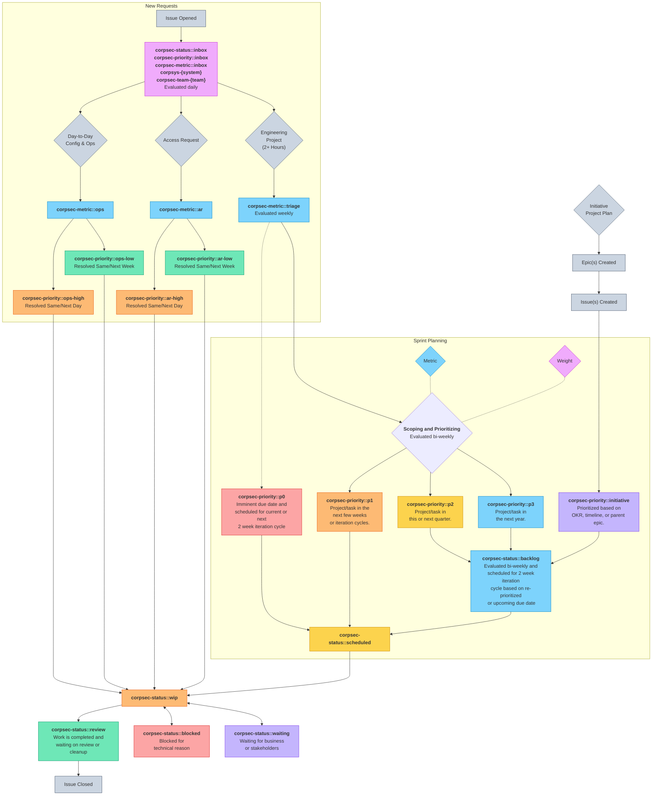

We have four approaches to how we work:

1. **[Support Helpdesk Services](/handbook/security/corporate/support)** - We provide 24x5 technical support and access requests for team members and temporary service providers (contractors). Please help us prioritize your access request with `corpsec-priority::ar-high` (same/next day) or `corpsec-priority::ar-low` (same/next week) label.

2. **Configuration Operations** - We handle day-to-day small configuration and change requests (less than an hour) for configuring the [SaaS systems](/handbook/security/corporate/systems) that CorpSec is responsible for. This also includes escalations from our helpdesk analysts. Please create an issue in our [issue tracker](#issue-tracker) with your request and add the `corpsec-priority::ops-high` (same/next day) or `corpsec-priority::ops-low` (same/next week) label. You can ask for preliminary guidance in [#it_help](https://gitlab.slack.com/archives/CK4EQH50E) and our on-call team members will respond and/or tag an appropriate engineer.

3. **[Engineering Iterations](#iteration-cadences)** - We have two week agile iteration sprint cycles for handling larger requests (more than an hour) that are queued up based on our team's capacity and competing priorities. This includes pre-planned implementation work related to other team's projects. When an issue is created, we will assign it a priority based on your due date requirements and add it to the backlog or schedule it during an upcoming iteration. Once an issue has been added to an iteration, you can expect it to be completed by the last day of the 2 week cycle unless communicated otherwise in the issue or in a discussion with the assigned engineer.

    > Please create issues **as far in advance as possible (3-6 weeks ideally, even as a draft)** so it gets in the queue, rather than last minute requests that cause team members to scramble in a crisis mode. We are trying to avoid situations when your team knows about it for several months and ask us at the last minute to turn something around in a day or two with a deadline that could have been communicated several weeks in advance.

4. **Engineering Initiatives** - Larger program managed strategic initiatives on our [roadmap](https://internal.gitlab.com/handbook/security/corporate/roadmap/) that are part of our long term [direction](https://internal.gitlab.com/handbook/security/corporate/direction/). We have objectives and key results (OKRs) that are aligned with the research, discovery, implementation, and migration to the new processes, services, systems. See our [epics](#epics) to see the current initiatives and progress.

## Epics

All epics for larger initiatives and OKRs are created in the [CorpSec group](https://gitlab.com/groups/gitlab-com/gl-security/corp/-/epics?state=opened&page=1&sort=start_date_desc).

You can also view our [gantt chart roadmap](https://gitlab.com/groups/gitlab-com/gl-security/corp/-/roadmap?state=opened&sort=START_DATE_ASC&layout=QUARTERS&timeframe_range_type=THREE_YEARS&progress=WEIGHT&show_progress=true&show_milestones=false&milestones_type=ALL&show_labels=true).

## Issue Tracker

All issues are created in the [CorpSec issue tracker](https://gitlab.com/gitlab-com/gl-security/corp/issue-tracker/-/issues) for work that we have to either spend significant time performing or perform configuration and provisioning work that we need an easy-to-discover audit trail for. We can also be tagged in other team's issue trackers for consultative questions and support.

## Workflow

### Iteration Cadences

We perform sprint planning on a weekly or bi-weekly basis (depending on system/team) and evaluate issues with the `corpsec-status::inbox` and `corpsec-status::backlog` label.

See the [Workflow](#workflow) to see the full flow of issues.

- [Cadence Schedule](https://gitlab.com/groups/gitlab-com/gl-security/corp/-/cadences)

### Due Dates

Due dates are the date set by the requester.

Iteration cycles are used by the CorpSec team internally.

Any expectations should be mentioned in the issue description or comments so the work is completed in an iteration cycle that ends before your due date.

## Issue Boards and Lists

### Helpdesk Analysts

- (List) [Access Requests](https://gitlab.com/gitlab-com/team-member-epics/access-requests/-/issues)
  - (List) [Baseline Entitlements to Provision](https://gitlab.com/gitlab-com/team-member-epics/access-requests/-/issues/?sort=created_date&state=opened&label_name%5B%5D=BaselineEntitlementAR&label_name%5B%5D=IT%20System%3A%3ABaseline%20Entitlement&first_page_size=100)
  - (List) [Team Member Access Requests](https://gitlab.com/gitlab-com/team-member-epics/access-requests/-/issues/?sort=created_date&state=opened&label_name%5B%5D=AR-Approval%3A%3AManager%20Approved&label_name%5B%5D=IT%3A%3Ato%20do&first_page_size=100)
  - (List) [Temporary Service Provider Access Requests](https://gitlab.com/gitlab-com/temporary-service-providers/lifecycle/-/issues/)

### Engineering

- (Report) [Management Status Report (Updated Daily)](https://gitlab.com/gitlab-com/gl-security/corp/issue-tracker/-/blob/main/status_report.md?ref_type=heads)
- Kanban Board
  - (Board) All Teams - [Current Iteration](https://gitlab.com/groups/gitlab-com/gl-security/corp/-/boards/7606111?iteration_id=Current&iteration_cadence_id=1053644) - [Iteration Sprint Issues (by Status)](https://gitlab.com/groups/gitlab-com/gl-security/corp/-/boards/7606111)
  - (Board) Code - [Current Iteration](https://gitlab.com/groups/gitlab-com/gl-security/corp/-/boards/7606111?label_name[]=corpsec-team-code&iteration_id=Current&iteration_cadence_id=1053644) - [All Open Issues](https://gitlab.com/groups/gitlab-com/gl-security/corp/-/boards/7606111?label_name[]=corpsec-team-code)
  - (Board) Device Trust - [Current Iteration](https://gitlab.com/groups/gitlab-com/gl-security/corp/-/boards/7606111?label_name[]=corpsec-team-device&iteration_id=Current&iteration_cadence_id=1053644) - [All Open Issues](https://gitlab.com/groups/gitlab-com/gl-security/corp/-/boards/7606111?label_name[]=corpsec-team-device)
  - (Board) Helpdesk - [All Open Issues](https://gitlab.com/groups/gitlab-com/gl-security/corp/-/boards/7606111?label_name[]=corpsec-team-helpdesk)
  - (Board) Identity - [Current Iteration](https://gitlab.com/groups/gitlab-com/gl-security/corp/-/boards/7606111?label_name[]=corpsec-team-identity&iteration_id=Current&iteration_cadence_id=1053644) - [All Open Issues](https://gitlab.com/groups/gitlab-com/gl-security/corp/-/boards/7606111?label_name[]=corpsec-team-identity)
  - (Board) Infrastructure - [Current Iteration](https://gitlab.com/groups/gitlab-com/gl-security/corp/-/boards/7606111?label_name[]=corpsec-team-infra&iteration_id=Current&iteration_cadence_id=1053644) - [All Open Issues](https://gitlab.com/groups/gitlab-com/gl-security/corp/-/boards/7606111?label_name[]=corpsec-team-infra)
  - (Board) SaaS - [Current Iteration](https://gitlab.com/groups/gitlab-com/gl-security/corp/-/boards/7606111?label_name[]=corpsec-team-saas&iteration_id=Current&iteration_cadence_id=1053644) - [All Open Issues](https://gitlab.com/groups/gitlab-com/gl-security/corp/-/boards/7606111?label_name[]=corpsec-team-saas)
- Issue Lists by Team
  - (List) [Small Day-to-Day Operations Requests](https://gitlab.com/gitlab-com/gl-security/corp/issue-tracker/-/issues/?sort=created_date&state=opened&or%5Blabel_name%5D%5B%5D=corpsec-metric%3A%3Aar&or%5Blabel_name%5D%5B%5D=corpsec-metric%3A%3Aops&first_page_size=20)
  - (List) [Larger Project Work (Device Trust, Identity, and SaaS Engineering)](https://gitlab.com/gitlab-com/gl-security/corp/issue-tracker/-/issues/?sort=created_date&state=opened&or%5Blabel_name%5D%5B%5D=corpsec-team-saas&or%5Blabel_name%5D%5B%5D=corpsec-team-identity&or%5Blabel_name%5D%5B%5D=corpsec-team-device&first_page_size=20)
  - (List) [Internal Issues for Code Platform Engineering](https://gitlab.com/gitlab-com/gl-security/corp/issue-tracker/-/issues/?sort=created_date&state=opened&label_name%5B%5D=corpsec-team-code&first_page_size=20) / [Open Source Issues](https://gitlab.com/groups/provisionesta/-/issues)
  - (List) [Issues for Device Trust Engineering](https://gitlab.com/gitlab-com/gl-security/corp/issue-tracker/-/issues/?sort=created_date&state=opened&label_name%5B%5D=corpsec-team-device&first_page_size=20)
  - (List) [Issues for Helpdesk Services](https://gitlab.com/gitlab-com/gl-security/corp/issue-tracker/-/issues/?sort=created_date&state=opened&label_name%5B%5D=corpsec-team-helpdesk&first_page_size=20)
  - (List) [Issues for Infrastructure Engineering](https://gitlab.com/gitlab-com/gl-security/corp/issue-tracker/-/issues/?sort=created_date&state=opened&label_name%5B%5D=corpsec-team-infra&first_page_size=20)
  - (List) [Issues for SaaS Engineering](https://gitlab.com/gitlab-com/gl-security/corp/issue-tracker/-/issues/?sort=created_date&state=opened&label_name%5B%5D=corpsec-team-saas&first_page_size=20)
- Issue Lists by Status
  - (List) [Inbox Requests (Reviewed Daily)](https://gitlab.com/gitlab-com/gl-security/corp/issue-tracker/-/issues/?sort=created_date&state=opened&label_name%5B%5D=corpsec-status%3A%3Ainbox&label_name%5B%5D=corpsec-metric%3A%3Ainbox&first_page_size=20)
  - (List) [Triage in Progress (reviewed bi-weekly)](https://gitlab.com/gitlab-com/gl-security/corp/issue-tracker/-/issues/?sort=created_date&state=opened&label_name%5B%5D=corpsec-metric%3A%3Atriage&first_page_size=20)
  - (List) [Backlog](https://gitlab.com/gitlab-com/gl-security/corp/issue-tracker/-/issues/?sort=created_date&state=opened&label_name%5B%5D=corpsec-status%3A%3Abacklog&first_page_size=20)
  - (List) [Scheduled](https://gitlab.com/gitlab-com/gl-security/corp/issue-tracker/-/issues/?sort=created_date&state=opened&label_name%5B%5D=corpsec-status%3A%3Ascheduled&first_page_size=20)
  - (List) [Work in Progress (WIP)](https://gitlab.com/gitlab-com/gl-security/corp/issue-tracker/-/issues/?sort=created_date&state=opened&label_name%5B%5D=corpsec-status%3A%3Awip&first_page_size=20)
  - (List) [Waiting for Business](https://gitlab.com/gitlab-com/gl-security/corp/issue-tracker/-/issues/?sort=created_date&state=opened&label_name%5B%5D=corpsec-status%3A%3Awaiting&first_page_size=20)
  - (List) [Technically Blocked](https://gitlab.com/gitlab-com/gl-security/corp/issue-tracker/-/issues/?sort=created_date&state=opened&label_name%5B%5D=corpsec-status%3A%3Ablocked&first_page_size=20)
  - (List) [Final Review](https://gitlab.com/gitlab-com/gl-security/corp/issue-tracker/-/issues/?sort=created_date&state=opened&label_name%5B%5D=corpsec-status%3A%3Areview&first_page_size=20)
- (List) See [CorpSec Systems](/handbook/security/corporate/systems) handbook page for links to issues for specific systems.

### Engineering Team Members

<table>
<thead>
<tr>
<th>Team Member</th>
<th>CorpSec Issues</th>
<th>Assigned ARs</th>
<th>Handbook MRs</th>
</tr>
</thead>
<tbody>
<tr>
<td><a href="https://gitlab.com/cshankgitlab">Clayton Shank</a></td>
<td><a target="_blank" href="https://gitlab.com/gitlab-com/gl-security/corp/issue-tracker/-/issues/?assignee_username%5B%5D=cshankgitlab">Issues</a> - <a target="_blank" href="https://gitlab.com/groups/gitlab-com/gl-security/corp/-/boards/7606111?assignee_username=cshankgitlab">Kanban</a> - <a target="_blank" href="https://gitlab.com/groups/gitlab-com/gl-security/corp/-/boards/7606111?assignee_username=cshankgitlab&iteration_id=Current&iteration_cadence_id=1053644">Current Iteration</a></td>
<td><a target="_blank" href="https://gitlab.com/gitlab-com/team-member-epics/access-requests/-/issues/?assignee_username%5B%5D=cshankgitlab">ARs</a></td>
<td><a target="_blank" href="https://gitlab.com/gitlab-com/content-sites/handbook/-/merge_requests?scope=all&state=all&author_username=cshankgitlab">Public</a> - <a target="_blank" href="https://gitlab.com/gitlab-com/content-sites/internal-handbook/-/merge_requests?scope=all&state=all&author_username=cshankgitlab">Internal</a></td>
</tr>
<tr>
<td><a href="https://gitlab.com/dzhu-gl">David Zhu</a></td>
<td><a target="_blank" href="https://gitlab.com/gitlab-com/gl-security/corp/issue-tracker/-/issues/?assignee_username%5B%5D=dzhu-gl">Issues</a> - <a target="_blank" href="https://gitlab.com/groups/gitlab-com/gl-security/corp/-/boards/7606111?assignee_username=dzhu-gl">Kanban</a> - <a target="_blank" href="https://gitlab.com/groups/gitlab-com/gl-security/corp/-/boards/7606111?assignee_username=dzhu-gl&iteration_id=Current&iteration_cadence_id=1053644">Current Iteration</a></td>
<td><a target="_blank" href="https://gitlab.com/gitlab-com/team-member-epics/access-requests/-/issues/?assignee_username%5B%5D=dzhu-gl">ARs</a></td>
<td><a target="_blank" href="https://gitlab.com/gitlab-com/content-sites/handbook/-/merge_requests?scope=all&state=all&author_username=dzhu-gl">Public</a> - <a target="_blank" href="https://gitlab.com/gitlab-com/content-sites/internal-handbook/-/merge_requests?scope=all&state=all&author_username=dzhu-gl">Internal</a></td>
</tr>
<tr>
<td><a href="https://gitlab.com/ericrubin">Eric Rubin</a></td>
<td><a target="_blank" href="https://gitlab.com/gitlab-com/gl-security/corp/issue-tracker/-/issues/?assignee_username%5B%5D=ericrubin">Issues</a> - <a target="_blank" href="https://gitlab.com/groups/gitlab-com/gl-security/corp/-/boards/7606111?assignee_username=ericrubin">Kanban</a> - <a target="_blank" href="https://gitlab.com/groups/gitlab-com/gl-security/corp/-/boards/7606111?assignee_username=ericrubin&iteration_id=Current&iteration_cadence_id=1053644">Current Iteration</a></td>
<td><a target="_blank" href="https://gitlab.com/gitlab-com/team-member-epics/access-requests/-/issues/?assignee_username%5B%5D=ericrubin">ARs</a></td>
<td><a target="_blank" href="https://gitlab.com/gitlab-com/content-sites/handbook/-/merge_requests?scope=all&state=all&author_username=ericrubin">Public</a> - <a target="_blank" href="https://gitlab.com/gitlab-com/content-sites/internal-handbook/-/merge_requests?scope=all&state=all&author_username=ericrubin">Internal</a></td>
</tr>
<tr>
<td><a href="https://gitlab.com/eriklentz">Erik Lentz</a></td>
<td><a target="_blank" href="https://gitlab.com/gitlab-com/gl-security/corp/issue-tracker/-/issues/?assignee_username%5B%5D=eriklentz">Issues</a> - <a target="_blank" href="https://gitlab.com/groups/gitlab-com/gl-security/corp/-/boards/7606111?assignee_username=eriklentz">Kanban</a> - <a target="_blank" href="https://gitlab.com/groups/gitlab-com/gl-security/corp/-/boards/7606111?assignee_username=eriklentz&iteration_id=Current&iteration_cadence_id=1053644">Current Iteration</a></td>
<td><a target="_blank" href="https://gitlab.com/gitlab-com/team-member-epics/access-requests/-/issues/?assignee_username%5B%5D=eriklentz">ARs</a></td>
<td><a target="_blank" href="https://gitlab.com/gitlab-com/content-sites/handbook/-/merge_requests?scope=all&state=all&author_username=eriklentz">Public</a> - <a target="_blank" href="https://gitlab.com/gitlab-com/content-sites/internal-handbook/-/merge_requests?scope=all&state=all&author_username=eriklentz">Internal</a></td>
</tr>
<tr>
<td><a href="https://gitlab.com/jacobdwaters">Jacob Waters</a></td>
<td><a target="_blank" href="https://gitlab.com/gitlab-com/gl-security/corp/issue-tracker/-/issues/?assignee_username%5B%5D=jacobdwaters">Issues</a> - <a target="_blank" href="https://gitlab.com/groups/gitlab-com/gl-security/corp/-/boards/7606111?assignee_username=jacobdwaters">Kanban</a> - <a target="_blank" href="https://gitlab.com/groups/gitlab-com/gl-security/corp/-/boards/7606111?assignee_username=jacobdwaters&iteration_id=Current&iteration_cadence_id=1053644">Current Iteration</a></td>
<td><a target="_blank" href="https://gitlab.com/gitlab-com/team-member-epics/access-requests/-/issues/?assignee_username%5B%5D=jacobdwaters">ARs</a></td>
<td><a target="_blank" href="https://gitlab.com/gitlab-com/content-sites/handbook/-/merge_requests?scope=all&state=all&author_username=jacobdwaters">Public</a> - <a target="_blank" href="https://gitlab.com/gitlab-com/content-sites/internal-handbook/-/merge_requests?scope=all&state=all&author_username=jacobdwaters">Internal</a></td>
</tr>
<tr>
<td><a href="https://gitlab.com/jeffersonmartin">Jeff Martin</a></td>
<td><a target="_blank" href="https://gitlab.com/gitlab-com/gl-security/corp/issue-tracker/-/issues/?assignee_username%5B%5D=jeffersonmartin">Issues</a> - <a target="_blank" href="https://gitlab.com/groups/gitlab-com/gl-security/corp/-/boards/7606111?assignee_username=jeffersonmartin">Kanban</a> - <a target="_blank" href="https://gitlab.com/groups/gitlab-com/gl-security/corp/-/boards/7606111?assignee_username=jeffersonmartin&iteration_id=Current&iteration_cadence_id=1053644">Current Iteration</a></td>
<td><a target="_blank" href="https://gitlab.com/gitlab-com/team-member-epics/access-requests/-/issues/?assignee_username%5B%5D=jeffersonmartin">ARs</a></td>
<td><a target="_blank" href="https://gitlab.com/gitlab-com/content-sites/handbook/-/merge_requests?scope=all&state=all&author_username=jeffersonmartin">Public</a> - <a target="_blank" href="https://gitlab.com/gitlab-com/content-sites/internal-handbook/-/merge_requests?scope=all&state=all&author_username=jeffersonmartin">Internal</a></td>
</tr>
<tr>
<td><a href="https://gitlab.com/jbisutti-gl">Justin Bisutti</a></td>
<td><a target="_blank" href="https://gitlab.com/gitlab-com/gl-security/corp/issue-tracker/-/issues/?assignee_username%5B%5D=jbisutti-gl">Issues</a> - <a target="_blank" href="https://gitlab.com/groups/gitlab-com/gl-security/corp/-/boards/7606111?assignee_username=jbisutti-gl">Kanban</a> - <a target="_blank" href="https://gitlab.com/groups/gitlab-com/gl-security/corp/-/boards/7606111?assignee_username=jbisutti-gl&iteration_id=Current&iteration_cadence_id=1053644">Current Iteration</a></td>
<td><a target="_blank" href="https://gitlab.com/gitlab-com/team-member-epics/access-requests/-/issues/?assignee_username%5B%5D=jbisutti-gl">ARs</a></td>
<td><a target="_blank" href="https://gitlab.com/gitlab-com/content-sites/handbook/-/merge_requests?scope=all&state=all&author_username=jbisutti-gl">Public</a> - <a target="_blank" href="https://gitlab.com/gitlab-com/content-sites/internal-handbook/-/merge_requests?scope=all&state=all&author_username=jbisutti-gl">Internal</a></td>
</tr>
<tr>
<td><a href="https://gitlab.com/kimwaters">Kim Waters</a></td>
<td><a target="_blank" href="https://gitlab.com/gitlab-com/gl-security/corp/issue-tracker/-/issues/?assignee_username%5B%5D=kimwaters">Issues</a> - <a target="_blank" href="https://gitlab.com/groups/gitlab-com/gl-security/corp/-/boards/7606111?assignee_username=kimwaters">Kanban</a> - <a target="_blank" href="https://gitlab.com/groups/gitlab-com/gl-security/corp/-/boards/7606111?assignee_username=kimwaters&iteration_id=Current&iteration_cadence_id=1053644">Current Iteration</a></td>
<td><a target="_blank" href="https://gitlab.com/gitlab-com/team-member-epics/access-requests/-/issues/?assignee_username%5B%5D=kimwaters">ARs</a></td>
<td><a target="_blank" href="https://gitlab.com/gitlab-com/content-sites/handbook/-/merge_requests?scope=all&state=all&author_username=kimwaters">Public</a> - <a target="_blank" href="https://gitlab.com/gitlab-com/content-sites/internal-handbook/-/merge_requests?scope=all&state=all&author_username=kimwaters">Internal</a></td>
</tr>
<tr>
<td><a href="https://gitlab.com/mloveless">Mark Loveless</a></td>
<td><a target="_blank" href="https://gitlab.com/gitlab-com/gl-security/corp/issue-tracker/-/issues/?assignee_username%5B%5D=mloveless">Issues</a> - <a target="_blank" href="https://gitlab.com/groups/gitlab-com/gl-security/corp/-/boards/7606111?assignee_username=mloveless">Kanban</a> - <a target="_blank" href="https://gitlab.com/groups/gitlab-com/gl-security/corp/-/boards/7606111?assignee_username=mloveless&iteration_id=Current&iteration_cadence_id=1053644">Current Iteration</a></td>
<td><a target="_blank" href="https://gitlab.com/gitlab-com/team-member-epics/access-requests/-/issues/?assignee_username%5B%5D=mloveless">ARs</a></td>
<td><a target="_blank" href="https://gitlab.com/gitlab-com/content-sites/handbook/-/merge_requests?scope=all&state=all&author_username=mloveless">Public</a> - <a target="_blank" href="https://gitlab.com/gitlab-com/content-sites/internal-handbook/-/merge_requests?scope=all&state=all&author_username=mloveless">Internal</a></td>
</tr>
<tr>
<td><a href="https://gitlab.com/malkobaisy">Mohammed Al Kobaisy</a></td>
<td><a target="_blank" href="https://gitlab.com/gitlab-com/gl-security/corp/issue-tracker/-/issues/?assignee_username%5B%5D=malkobaisy">Issues</a> - <a target="_blank" href="https://gitlab.com/groups/gitlab-com/gl-security/corp/-/boards/7606111?assignee_username=malkobaisy">Kanban</a> - <a target="_blank" href="https://gitlab.com/groups/gitlab-com/gl-security/corp/-/boards/7606111?assignee_username=malkobaisy&iteration_id=Current&iteration_cadence_id=1053644">Current Iteration</a></td>
<td><a target="_blank" href="https://gitlab.com/gitlab-com/team-member-epics/access-requests/-/issues/?assignee_username%5B%5D=malkobaisy">ARs</a></td>
<td><a target="_blank" href="https://gitlab.com/gitlab-com/content-sites/handbook/-/merge_requests?scope=all&state=all&author_username=malkobaisy">Public</a> - <a target="_blank" href="https://gitlab.com/gitlab-com/content-sites/internal-handbook/-/merge_requests?scope=all&state=all&author_username=malkobaisy">Internal</a></td>
</tr>
<tr>
<td><a href="https://gitlab.com/p_han">Peter Hansen</a></td>
<td><a target="_blank" href="https://gitlab.com/gitlab-com/gl-security/corp/issue-tracker/-/issues/?assignee_username%5B%5D=p_han">Issues</a> - <a target="_blank" href="https://gitlab.com/groups/gitlab-com/gl-security/corp/-/boards/7606111?assignee_username=p_han">Kanban</a> - <a target="_blank" href="https://gitlab.com/groups/gitlab-com/gl-security/corp/-/boards/7606111?assignee_username=p_han&iteration_id=Current&iteration_cadence_id=1053644">Current Iteration</a></td>
<td><a target="_blank" href="https://gitlab.com/gitlab-com/team-member-epics/access-requests/-/issues/?assignee_username%5B%5D=p_han">ARs</a></td>
<td><a target="_blank" href="https://gitlab.com/gitlab-com/content-sites/handbook/-/merge_requests?scope=all&state=all&author_username=p_han">Public</a> - <a target="_blank" href="https://gitlab.com/gitlab-com/content-sites/internal-handbook/-/merge_requests?scope=all&state=all&author_username=p_han">Internal</a></td>
</tr>
<tr>
<td><a href="https://gitlab.com/stevesagan">Steve Sagan</a></td>
<td><a target="_blank" href="https://gitlab.com/gitlab-com/gl-security/corp/issue-tracker/-/issues/?assignee_username%5B%5D=stevesagan">Issues</a> - <a target="_blank" href="https://gitlab.com/groups/gitlab-com/gl-security/corp/-/boards/7606111?assignee_username=stevesagan">Kanban</a> - <a target="_blank" href="https://gitlab.com/groups/gitlab-com/gl-security/corp/-/boards/7606111?assignee_username=stevesagan&iteration_id=Current&iteration_cadence_id=1053644">Current Iteration</a></td>
<td><a target="_blank" href="https://gitlab.com/gitlab-com/team-member-epics/access-requests/-/issues/?assignee_username%5B%5D=stevesagan">ARs</a></td>
<td><a target="_blank" href="https://gitlab.com/gitlab-com/content-sites/handbook/-/merge_requests?scope=all&state=all&author_username=stevesagan">Public</a> - <a target="_blank" href="https://gitlab.com/gitlab-com/content-sites/internal-handbook/-/merge_requests?scope=all&state=all&author_username=stevesagan">Internal</a></td>
</tr>
<tr>
<td><a href="https://gitlab.com/vlad">Vlad Stoianovici</a></td>
<td><a target="_blank" href="https://gitlab.com/gitlab-com/gl-security/corp/issue-tracker/-/issues/?assignee_username%5B%5D=vlad">Issues</a> - <a target="_blank" href="https://gitlab.com/groups/gitlab-com/gl-security/corp/-/boards/7606111?assignee_username=vlad">Kanban</a> - <a target="_blank" href="https://gitlab.com/groups/gitlab-com/gl-security/corp/-/boards/7606111?assignee_username=vlad&iteration_id=Current&iteration_cadence_id=1053644">Current Iteration</a></td>
<td><a target="_blank" href="https://gitlab.com/gitlab-com/team-member-epics/access-requests/-/issues/?assignee_username%5B%5D=vlad">ARs</a></td>
<td><a target="_blank" href="https://gitlab.com/gitlab-com/content-sites/handbook/-/merge_requests?scope=all&state=all&author_username=vlad">Public</a> - <a target="_blank" href="https://gitlab.com/gitlab-com/content-sites/internal-handbook/-/merge_requests?scope=all&state=all&author_username=vlad">Internal</a></td>
</tr>
<tr>
<td><a href="https://gitlab.com/zhardie1">Zack Hardie</a></td>
<td><a target="_blank" href="https://gitlab.com/gitlab-com/gl-security/corp/issue-tracker/-/issues/?assignee_username%5B%5D=zhardie1">Issues</a> - <a target="_blank" href="https://gitlab.com/groups/gitlab-com/gl-security/corp/-/boards/7606111?assignee_username=zhardie1">Kanban</a> - <a target="_blank" href="https://gitlab.com/groups/gitlab-com/gl-security/corp/-/boards/7606111?assignee_username=zhardie1&iteration_id=Current&iteration_cadence_id=1053644">Current Iteration</a></td>
<td><a target="_blank" href="https://gitlab.com/gitlab-com/team-member-epics/access-requests/-/issues/?assignee_username%5B%5D=zhardie1">ARs</a></td>
<td><a target="_blank" href="https://gitlab.com/gitlab-com/content-sites/handbook/-/merge_requests?scope=all&state=all&author_username=zhardie1">Public</a> - <a target="_blank" href="https://gitlab.com/gitlab-com/content-sites/internal-handbook/-/merge_requests?scope=all&state=all&author_username=zhardie1">Internal</a></td>
</tr>
</tbody>
</table>

### Time Tracking

When issues are prioritized and scheduled to be worked on, they can optionally have a time estimate added (in hours) using `/estimate {##}h`. This allows the engineer to be a manager of one and work on the issue however they see fit by the iteration end date.

As engineers work on issues, they can optionally add `/spent {1.5}h` to keep track of their progress. This is optional has two benefits:

1. It allows the engineer to validate whether the time estimate was accurate.
2. It surfaces to the management team how much work was put into the issue.

Any issue that an engineer adds a time spent to will automatically show up on management and team status reports with the title and time spent. Any issue without a time spent will show up on status reports with the count of issues worked on in a specific project. A best practice is that if it takes more than 30-60 minutes, you should consider adding time spent. If something is important that should appear on a status report, then even a 5 minutes of time spent can be added.

See [weight](#weight) as an alternative to time tracking.

### Weight

Some engineers do not like tracking their time and just see the list of issues to work on.

Instead of time tracking, you can add a weight to share how difficult it was to work on. Weights are also used during sprint planning.

1 weight is equal to roughly a half day of work (ex. a 3-4 hour focus block).

Any issue that an engineer adds a weight to will automatically show up on management and team status reports with the title and weight along with a time estimate if it was set. Any issue without a weight will show up on status reports with the count of issues worked on in a specific project. A best practice is that if it takes more than an hour or two, you should consider adding a weight.

## Labels

### Status Label

- [corpsec-status::inbox](https://gitlab.com/groups/gitlab-com/-/issues?label_name%5B%5D=corpsec-status%3A%3Ainbox) - This issue is new and has not been evaluated yet. **(default for new issues)**.
- [corpsec-status::wishlist](https://gitlab.com/groups/gitlab-com/-/issues?label_name%5B%5D=corpsec-status%3A%3Awishlist) - For any issues not being worked on in the next year or become dormant. Stale issues can be closed and can be reopened if priority changes.
- [corpsec-status::backlog](https://gitlab.com/groups/gitlab-com/-/issues?label_name%5B%5D=corpsec-status%3A%3Abacklog) - This issue is in our backlog to be completed within a year (see priority).
- [corpsec-status::waiting](https://gitlab.com/groups/gitlab-com/-/issues?label_name%5B%5D=corpsec-status%3A%3Awaiting) - This issue has started but is on hold waiting for a business reason or review. 
- [corpsec-status::blocked](https://gitlab.com/groups/gitlab-com/-/issues?label_name%5B%5D=corpsec-status%3A%3Ablocked) - This issue has started but is blocked for a technical reason that is not anticipated to be solved during this iteration.
- [corpsec-status::scheduled](https://gitlab.com/groups/gitlab-com/-/issues?label_name%5B%5D=corpsec-status%3A%3Ascheduled) - This issue has been scheduled to be worked on in an upcoming iteration milestone.
- [corpsec-status::wip](https://gitlab.com/groups/gitlab-com/-/issues?label_name%5B%5D=corpsec-status%3A%3Awip) - This issue is a work in progress. The team member will assign this status when they pick it up.
- [corpsec-status::review](https://gitlab.com/groups/gitlab-com/-/issues?label_name%5B%5D=corpsec-status%3A%3Areview) - The work is mostly complete and is waiting on final review or cleanup work.

### Priority Label

- [corpsec-priority::inbox](https://gitlab.com/groups/gitlab-com/-/issues?label_name%5B%5D=corpsec-priority%3A%3Ainbox) - Needs triage to determine **(default for new issues)**.
- **Business as Usual Day-to-Day Requests**
  - [corpsec-priority::ar-high](https://gitlab.com/groups/gitlab-com/-/issues?label_name%5B%5D=corpsec-priority%3A%3Aar-high) - High priority (same day) access request.
  - [corpsec-priority::ar-low](https://gitlab.com/groups/gitlab-com/-/issues?label_name%5B%5D=corpsec-priority%3A%3Aar-low) - Low priority (same week) access request.
  - [corpsec-priority::ops-high](https://gitlab.com/groups/gitlab-com/-/issues?label_name%5B%5D=corpsec-priority%3A%3Aops-high) - High priority (same/next day) day-to-day small requests.
  - [corpsec-priority::ops-low](https://gitlab.com/groups/gitlab-com/-/issues?label_name%5B%5D=corpsec-priority%3A%3Aops-low) - Low priority (same/next week) day-to-day small requests.
  - [corpsec-priority::research](https://gitlab.com/groups/gitlab-com/-/issues?label_name%5B%5D=corpsec-priority%3A%3Aresearch) - Non-priority research and discovery.
- **Engineering Requests**
  - [corpsec-priority::p0](https://gitlab.com/groups/gitlab-com/-/issues?label_name%5B%5D=corpsec-priority%3A%3Ap0) - Project fire drill (crisis, incident, urgent deadline). Also see `corpsec-priority::ops-high` for small requests.
  - [corpsec-priority::p1](https://gitlab.com/groups/gitlab-com/-/issues?label_name%5B%5D=corpsec-priority%3A%3Ap1) - Project/task in the next 0-2 weeks (if not current iteration, then beginning of next)
  - [corpsec-priority::p2](https://gitlab.com/groups/gitlab-com/-/issues?label_name%5B%5D=corpsec-priority%3A%3Ap2) - Project/task within the next quarter
  - [corpsec-priority::p3](https://gitlab.com/groups/gitlab-com/-/issues?label_name%5B%5D=corpsec-priority%3A%3Ap3) - Project/task beyond the next quarter
- **Planned Projects and Initiatives**
  - [corpsec-priority::initiative](https://gitlab.com/groups/gitlab-com/-/issues?label_name%5B%5D=corpsec-priority%3A%3Ainitiative) - Prioritized based on OKR timeline or parent epic.
  - [corpsec-priority::wishlist](https://gitlab.com/groups/gitlab-com/-/issues?label_name%5B%5D=corpsec-priority%3A%3Awishlist) - Large project on the uncommitted wishlist.

### Metric

To help reporting with what issues are related to since we share the same issue tracker and epics, you can add labels for categorizing the type of work.

- Business as Usual
  - [corpsec-metric::inbox](https://gitlab.com/groups/gitlab-com/-/issues?label_name%5B%5D=corpsec-metric::inbox) - New request to be evalauted
  - [corpsec-metric::triage](https://gitlab.com/groups/gitlab-com/-/issues?label_name%5B%5D=corpsec-metric::triage) - Engineering sprint planning triage
  - [corpsec-metric::ar](https://gitlab.com/groups/gitlab-com/-/issues?label_name%5B%5D=corpsec-metric::ar) - Access Requests
  - [corpsec-metric::ops](https://gitlab.com/groups/gitlab-com/-/issues?label_name%5B%5D=corpsec-metric::ops) - Small Day-to-Day Requests
- Engineering
  - [corpsec-metric::automation](https://gitlab.com/groups/gitlab-com/-/issues?label_name%5B%5D=corpsec-metric::automation) - Automation Engineering (CI/CD, code, no code, workflows)
  - [corpsec-metric::build](https://gitlab.com/groups/gitlab-com/-/issues?label_name%5B%5D=corpsec-metric::build) - Build and implementation engineering work.
  - [corpsec-metric::change](https://gitlab.com/groups/gitlab-com/-/issues?label_name%5B%5D=corpsec-metric::change) - Standardized Change Management
  - [corpsec-metric::config](https://gitlab.com/groups/gitlab-com/-/issues?label_name%5B%5D=corpsec-metric::config) - Non-standardized configuration management
  - [corpsec-metric::consult](https://gitlab.com/groups/gitlab-com/-/issues?label_name%5B%5D=corpsec-metric::consult) - Consultative Questions and Stakeholder Support
  - [corpsec-metric::crisis](https://gitlab.com/groups/gitlab-com/-/issues?label_name%5B%5D=corpsec-metric::crisis) - Unplanned initiatives that require urgent attention
  - [corpsec-metric::docs](https://gitlab.com/groups/gitlab-com/-/issues?label_name%5B%5D=corpsec-metric::docs) - Documentation, handbook pages, and runbooks
  - [corpsec-metric::initiative](https://gitlab.com/groups/gitlab-com/-/issues?label_name%5B%5D=corpsec-metric::initiative) - Planned initiatives or OKRs. Apply to epics and meta issues. Child issues use other metrics.
  - [corpsec-metric::research](https://gitlab.com/groups/gitlab-com/-/issues?label_name%5B%5D=corpsec-metric::research) - Research and discovery (for initiatives or side projects)
  - [corpsec-metric::testing](https://gitlab.com/groups/gitlab-com/-/issues?label_name%5B%5D=corpsec-metric::testing) - Testing work for initiatives
  - [corpsec-metric::announcement](https://gitlab.com/groups/gitlab-com/-/issues?label_name%5B%5D=corpsec-metric::announcement) - Tracking approvals for announcements

### Team Label

See the [functional org chart](/handbook/security/corporate/team/#functional-org-chart) to learn more about our teams and the services or systems that each team manages.

These labels are subscribed to be respective team members to get notifications for issues instead of needing to carbon copy (CC) or mention team members in issues, and are also used for any issues to identify which team is working on it. These labels are included in many issue templates. These labels can be added to any epic or issue anywhere in `gitlab.com/gitlab-com`. We do not use scoped labels since multiple teams may need to work on the same issue.

These are used for broad teams and not specific systems. Please check if a system label is appropriate to directly notify the system owners.

- [corpsec-team-code](https://gitlab.com/groups/gitlab-com/-/issues?label_name%5B%5D=corpsec-team-code) - Code Platform Engineering Team
- [corpsec-team-device](https://gitlab.com/groups/gitlab-com/-/issues?label_name%5B%5D=corpsec-team-device) - Device Trust Engineering Team
- [corpsec-team-helpdesk](https://gitlab.com/groups/gitlab-com/-/issues?label_name%5B%5D=corpsec-team-helpdesk) - Helpdesk Services Team
- [corpsec-team-identity](https://gitlab.com/groups/gitlab-com/-/issues?label_name%5B%5D=corpsec-team-identity) - Identity Engineering Team (most issues will use `corpsec-team-saas` instead)
- [corpsec-team-infra](https://gitlab.com/groups/gitlab-com/-/issues?label_name%5B%5D=corpsec-team-infra) - Infrastructure Team (AWS and GCP)
- [corpsec-team-logistics](https://gitlab.com/groups/gitlab-com/-/issues?label_name%5B%5D=corpsec-team-logistics) - Laptop and Logistics Services Team
- [corpsec-team-saas](https://gitlab.com/groups/gitlab-com/-/issues?label_name%5B%5D=corpsec-team-saas) - SaaS Applications Engineering Team. Most engineering issues have this label.

### System Label

These labels are subscribed to be respective team members to get notifications for issues instead of needing to carbon copy (CC) or mention team members in issues, and are also used for any issues to identify which system the issue relates to. These labels can be added to any epic or issue anywhere in `gitlab.com/gitlab-com`. We do not use scoped labels since multiple systems may be worked on in the same issue.

For broader needs, see the [team](#team-label) labels.

- [corpsys-1password](https://gitlab.com/groups/gitlab-com/-/issues?label_name%5B%5D=corpsys-1password)
- [corpsys-accessctl](https://gitlab.com/groups/gitlab-com/-/issues?label_name%5B%5D=corpsys-accessctl)
- [corpsys-aws-billing](https://gitlab.com/groups/gitlab-com/-/issues?label_name%5B%5D=corpsys-aws-billing)
- [corpsys-aws-marketplace](https://gitlab.com/groups/gitlab-com/-/issues?label_name%5B%5D=corpsys-aws-marketplace)
- [corpsys-aws-services](https://gitlab.com/groups/gitlab-com/-/issues?label_name%5B%5D=corpsys-aws-services)
- [corpsys-aws-sandbox](https://gitlab.com/groups/gitlab-com/-/issues?label_name%5B%5D=corpsys-aws-sandbox)
- [corpsys-aws-systems](https://gitlab.com/groups/gitlab-com/-/issues?label_name%5B%5D=corpsys-aws-systems)
- [corpsys-aws-dedicated-dev](https://gitlab.com/groups/gitlab-com/-/issues?label_name%5B%5D=corpsys-aws-dedicated-dev)
- [corpsys-aws-dedicated-prd](https://gitlab.com/groups/gitlab-com/-/issues?label_name%5B%5D=corpsys-aws-dedicated-prd)
- [corpsys-aws-dedicated-pubsec](https://gitlab.com/groups/gitlab-com/-/issues?label_name%5B%5D=corpsys-aws-dedicated-pubsec)
- [corpsys-azure](https://gitlab.com/groups/gitlab-com/-/issues?label_name%5B%5D=corpsys-azure)
- [corpsys-domains](https://gitlab.com/groups/gitlab-com/-/issues?label_name%5B%5D=corpsys-domains)
- [corpsys-dns](https://gitlab.com/groups/gitlab-com/-/issues?label_name%5B%5D=corpsys-dns)
- [corpsys-drivestrike](https://gitlab.com/groups/gitlab-com/-/issues?label_name%5B%5D=corpsys-drivestrike)
- [corpsys-gcp-billing](https://gitlab.com/groups/gitlab-com/-/issues?label_name%5B%5D=corpsys-gcp-billing)
- [corpsys-gcp-com](https://gitlab.com/groups/gitlab-com/-/issues?label_name%5B%5D=corpsys-gcp-com) - Google Cloud Platform (GCP) for gitlab.com organization
- [corpsys-gcp-marketplace](https://gitlab.com/groups/gitlab-com/-/issues?label_name%5B%5D=corpsys-gcp-marketplace) - Google Cloud Platform (GCP) Marketplace
- [corpsys-gcp-sandbox](https://gitlab.com/groups/gitlab-com/-/issues?label_name%5B%5D=corpsys-gcp-sandbox) - Google Cloud Platform (GCP) for gitlabsandbox.cloud organization
- [corpsys-gcp-systems](https://gitlab.com/groups/gitlab-com/-/issues?label_name%5B%5D=corpsys-gcp-systems) - Google Cloud Platform (GCP) for gitlab.systems organization
- [corpsys-gcp-cells-dev](https://gitlab.com/groups/gitlab-com/-/issues?label_name%5B%5D=corpsys-gcp-cells-dev) - Google Cloud Platform (GCP) for gitlab-cells.dev organization
- [corpsys-gcp-cells-prd](https://gitlab.com/groups/gitlab-com/-/issues?label_name%5B%5D=corpsys-gcp-cells-prd) - Google Cloud Platform (GCP) for gitlab-cells.com organization
- [corpsys-gcp-dedicated-dev](https://gitlab.com/groups/gitlab-com/-/issues?label_name%5B%5D=corpsys-gcp-dedicated-dev) - Google Cloud Platform (GCP) for gitlab-private.org organization
- [corpsys-gcp-dedicated-prd](https://gitlab.com/groups/gitlab-com/-/issues?label_name%5B%5D=corpsys-gcp-dedicated-prd) - Google Cloud Platform (GCP) for gitlab-dedicated.com organization
- [corpsys-gitlab-com](https://gitlab.com/groups/gitlab-com/-/issues?label_name%5B%5D=corpsys-gitlab-com) - gitlab.com
- [corpsys-gitlab-ops](https://gitlab.com/groups/gitlab-com/-/issues?label_name%5B%5D=corpsys-gitlb-ops) - ops.gitlab.net
- [corpsys-gitlab-dev](https://gitlab.com/groups/gitlab-com/-/issues?label_name%5B%5D=corpsys-gitlab-dev) - dev.gitlab.org
- [corpsys-gitlab-stg](https://gitlab.com/groups/gitlab-com/-/issues?label_name%5B%5D=corpsys-gitlab-stg) - staging.gitlab.com
- [corpsys-gitlab-cfg](https://gitlab.com/groups/gitlab-com/-/issues?label_name%5B%5D=corpsys-gitlab-cfg) - cfg.gitlab.systems
- [corpsys-google-app](https://gitlab.com/groups/gitlab-com/-/issues?label_name%5B%5D=corpsys-google-app) - Google Apps
- [corpsys-google-cal](https://gitlab.com/groups/gitlab-com/-/issues?label_name%5B%5D=corpsys-google-cal) - Google Calendar
- [corpsys-google-drive](https://gitlab.com/groups/gitlab-com/-/issues?label_name%5B%5D=corpsys-google-drive) - Google Drive
- [corpsys-google-group](https://gitlab.com/groups/gitlab-com/-/issues?label_name%5B%5D=corpsys-google-group) - Google Groups
- [corpsys-google-org](https://gitlab.com/groups/gitlab-com/-/issues?label_name%5B%5D=corpsys-google-org) - Google Workspace Organization Configuration
- [corpsys-handbook-int](https://gitlab.com/groups/gitlab-com/-/issues?label_name%5B%5D=handbook-int)
- [corpsys-handbook-pub](https://gitlab.com/groups/gitlab-com/-/issues?label_name%5B%5D=handbook-pub)
- [corpsys-handbook-sys](https://gitlab.com/groups/gitlab-com/-/issues?label_name%5B%5D=handbook-sys)
- [corpsys-jamf](https://gitlab.com/groups/gitlab-com/-/issues?label_name%5B%5D=corpsys-jamf)
- [corpsys-linux](https://gitlab.com/groups/gitlab-com/-/issues?label_name%5B%5D=corpsys-linux)
- [corpsys-lumos](https://gitlab.com/groups/gitlab-com/-/issues?label_name%5B%5D=corpsys-lumos)
- [corpsys-macos](https://gitlab.com/groups/gitlab-com/-/issues?label_name%5B%5D=corpsys-macos)
- [corpsys-nira](https://gitlab.com/groups/gitlab-com/-/issues?label_name%5B%5D=corpsys-nira)
- [corpsys-okta-app](https://gitlab.com/groups/gitlab-com/-/issues?label_name%5B%5D=corpsys-okta-app)
- [corpsys-okta-group](https://gitlab.com/groups/gitlab-com/-/issues?label_name%5B%5D=corpsys-okta-group)
- [corpsys-okta-org](https://gitlab.com/groups/gitlab-com/-/issues?label_name%5B%5D=corpsys-okta-org)
- [corpsys-okta-user](https://gitlab.com/groups/gitlab-com/-/issues?label_name%5B%5D=corpsys-okta-user)
- [corpsys-okta-workflow](https://gitlab.com/groups/gitlab-com/-/issues?label_name%5B%5D=corpsys-okta-workflow)
- [corpsys-sandbox-cloud](https://gitlab.com/groups/gitlab-com/-/issues?label_name%5B%5D=corpsys-sandbox-cloud)
- [corpsys-sentinelone](https://gitlab.com/groups/gitlab-com/-/issues?label_name%5B%5D=corpsys-sentinelone)
- [corpsys-slack](https://gitlab.com/groups/gitlab-com/-/issues?label_name%5B%5D=corpsys-slack)
- [corpsys-yubikey](https://gitlab.com/groups/gitlab-com/-/issues?label_name%5B%5D=corpsys-yubikey)
- [corpsys-zoom](https://gitlab.com/groups/gitlab-com/-/issues?label_name%5B%5D=corpsys-zoom)

### Approvals

- Business or Technical Owner
  - [corpsys-owner::not-ready](https://gitlab.com/groups/gitlab-com/-/issues?label_name%5B%5D=corpsys-owner::not-ready)
  - [corpsys-owner::waiting](https://gitlab.com/groups/gitlab-com/-/issues?label_name%5B%5D=corpsys-owner::waiting)
  - [corpsys-owner::approved](https://gitlab.com/groups/gitlab-com/-/issues?label_name%5B%5D=corpsys-owner::approved)
- Engineer Peer Review
  - [corpsec-peer::not-ready](https://gitlab.com/groups/gitlab-com/-/issues?label_name%5B%5D=corpsec-peer::not-ready)
  - [corpsec-peer::waiting](https://gitlab.com/groups/gitlab-com/-/issues?label_name%5B%5D=corpsec-peer::waiting)
  - [corpsec-peer::approved](https://gitlab.com/groups/gitlab-com/-/issues?label_name%5B%5D=corpsec-peer::approved)
- Post Implementation Review
  - [corpsec-post::not-ready](https://gitlab.com/groups/gitlab-com/-/issues?label_name%5B%5D=corpsec-post::not-ready)
  - [corpsec-post::waiting](https://gitlab.com/groups/gitlab-com/-/issues?label_name%5B%5D=corpsec-post::waiting)
  - [corpsec-post::approved](https://gitlab.com/groups/gitlab-com/-/issues?label_name%5B%5D=corpsec-post::approved)
- Management Approval
  - [corpsec-mgmt::not-ready](https://gitlab.com/groups/gitlab-com/-/issues?label_name%5B%5D=corpsec-mgmt::not-ready)
  - [corpsec-mgmt::waiting](https://gitlab.com/groups/gitlab-com/-/issues?label_name%5B%5D=corpsec-mgmt::waiting)
  - [corpsec-mgmt::approved](https://gitlab.com/groups/gitlab-com/-/issues?label_name%5B%5D=corpsec-mgmt::approved)

### Communication

- A change that requires communication due to user impact, new tool deployment or significant configuration change
  - [corpsec-communicate::yes](https://gitlab.com/groups/gitlab-com/-/issues?label_name%5B%5D=corpsec-communicate::yes)
  - [corpsec-communicate::no](https://gitlab.com/groups/gitlab-com/-/issues?label_name%5B%5D=corpsec-communicate::no)
