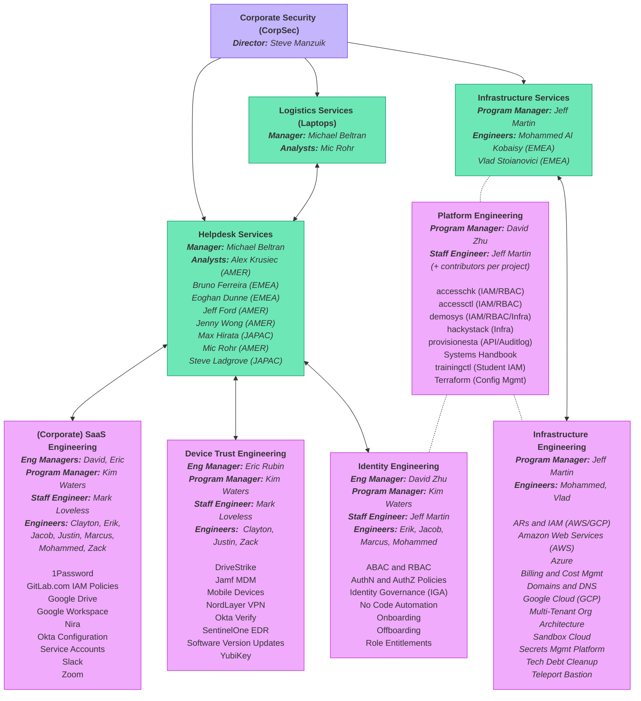
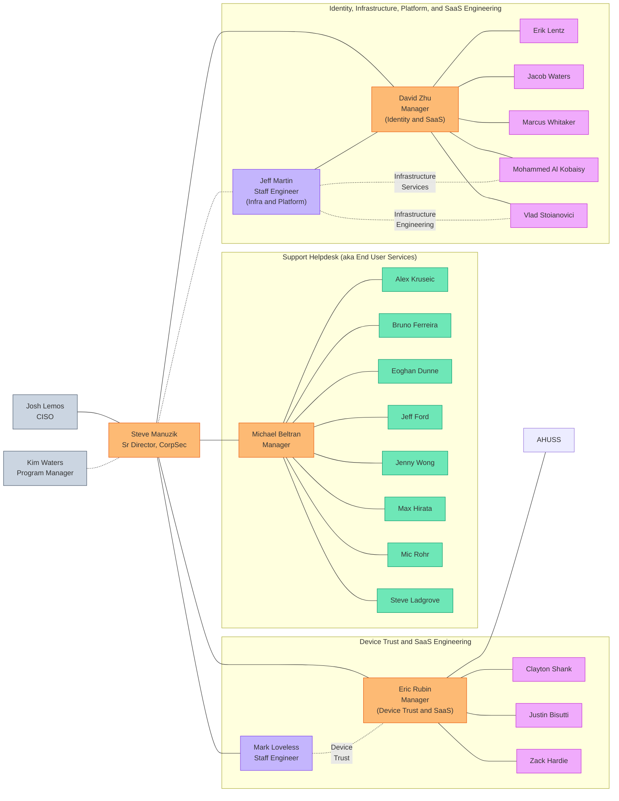

The Corporate Security department provides tech support [helpdesk services](/handbook/security/corporate/services/helpdesk) for team members and temporary service providers (aka contractors, vendors, etc.), and configuration management [engineering](/handbook/security/corporate/services/infrastructure/) for the company-wide systems that we manage.

## Team Directory

<table style="display: table;">
<thead>
<!-- Team Member -->
<tr>
<th>Team Member</th>
<th>Identity Roles</th>
<th>Group Tags</th>
</tr>
</thead>
<tbody>
<!-- Team Member -->
<tr>
<td>
<a href="/handbook/company/team/#akrusiec">

Alex Krusiec</a> 
<small>
<i class="fas fa-earth-americas" style="padding-right: 5px;"></i>AMER 
<i class="fas fa-address-card" style="padding-right: 5px;"></i><code>akrusiec</code> 
<i class="fa-brands fa-gitlab" style="padding-right: 5px;"></i><a target="_blank" href="https://gitlab.com/akrusiec">@akrusiec</a>
</small>
</td>
<td><small>
<i class="fas fa-address-card" style="padding-right: 5px;"></i><code>corpsec_svc_helpdesk</code>
</small></td>
<td><small>
<i class="fa-brands fa-gitlab" style="padding-right: 5px;"></i><a target="_blank" href="https://gitlab.com/groups/gitlab-com/gl-security/corp/helpdesk">@gitlab-com/gl-security/corp/helpdesk</a> 
</small></td>
</tr>
<!-- Team Member -->
<tr>
<td>
<a href="/handbook/company/team/#bferreira-ext">

Bruno Ferreira</a> 
<small>
<i class="fas fa-earth-europe" style="padding-right: 5px;"></i>EMEA 
<i class="fas fa-address-card" style="padding-right: 5px;"></i><code>bferreira</code> 
<i class="fa-brands fa-gitlab" style="padding-right: 5px;"></i><a target="_blank" href="https://gitlab.com/bruno.n.ferreira">@bruno.n.ferreira</a>
</small>
</td>
</td>
<td><small>
<i class="fas fa-address-card" style="padding-right: 5px;"></i><code>corpsec_svc_helpdesk</code>
</small></td>
<td><small>
<i class="fa-brands fa-gitlab" style="padding-right: 5px;"></i><a target="_blank" href="https://gitlab.com/groups/gitlab-com/gl-security/corp/helpdesk">@gitlab-com/gl-security/corp/helpdesk</a> 
</small></td>
</tr>
<!-- Team Member -->
<tr>
<td>
<a href="/handbook/company/team/#cshankgitlab">

Clayton Shank</a> 
<small>
<i class="fas fa-earth-americas" style="padding-right: 5px;"></i>AMER 
<i class="fas fa-address-card" style="padding-right: 5px;"></i><code>cshank</code> 
<i class="fa-brands fa-gitlab" style="padding-right: 5px;"></i><a target="_blank" href="https://gitlab.com/cshankgitlab">@cshankgitlab</a>
</small>
</td>
<td><small>
<i class="fas fa-address-card" style="padding-right: 5px;"></i><code>corpsec_eng_device_trust</code> 
<i class="fas fa-address-card" style="padding-right: 5px;"></i><code>corpsec_eng_saas</code>
</small></td>
<td><small>
<i class="fa-brands fa-gitlab" style="padding-right: 5px;"></i><a target="_blank" href="https://gitlab.com/groups/gitlab-com/gl-security/corp/device">@gitlab-com/gl-security/corp/device</a> 
<i class="fa-brands fa-gitlab" style="padding-right: 5px;"></i><a target="_blank" href="https://gitlab.com/groups/gitlab-com/gl-security/corp/saas">@gitlab-com/gl-security/corp/saas</a> 
</small></td>
</tr>
<!-- Team Member -->
<tr>
<td>
<a href="/handbook/company/team/#dzhu-gl">

David Zhu</a> 
<small>
<i class="fas fa-earth-americas" style="padding-right: 5px;"></i>AMER 
<i class="fas fa-address-card" style="padding-right: 5px;"></i><code>dzhu</code> 
<i class="fa-brands fa-gitlab" style="padding-right: 5px;"></i><a target="_blank" href="https://gitlab.com/dzhu-gl">@dzhu-gl</a>
</small>
</td>
<td><small>
<i class="fas fa-address-card" style="padding-right: 5px;"></i><code>corpsec_eng_identity</code> 
<i class="fas fa-address-card" style="padding-right: 5px;"></i><code>corpsec_eng_platform</code> 
<i class="fas fa-address-card" style="padding-right: 5px;"></i><code>corpsec_eng_saas</code> 
<i class="fas fa-address-card" style="padding-right: 5px;"></i><code>corpsec_mgr_eng</code>
</small></td>
<td><small>
<i class="fa-brands fa-gitlab" style="padding-right: 5px;"></i><a target="_blank" href="https://gitlab.com/groups/gitlab-com/gl-security/corp/identity">@gitlab-com/gl-security/corp/identity</a> 
<i class="fa-brands fa-gitlab" style="padding-right: 5px;"></i><a target="_blank" href="https://gitlab.com/groups/gitlab-com/gl-security/corp/managers">@gitlab-com/gl-security/corp/managers</a> 
<i class="fa-brands fa-gitlab" style="padding-right: 5px;"></i><a target="_blank" href="https://gitlab.com/groups/gitlab-com/gl-security/corp/code">@gitlab-com/gl-security/corp/code</a> 
<i class="fa-brands fa-gitlab" style="padding-right: 5px;"></i><a target="_blank" href="https://gitlab.com/groups/gitlab-com/gl-security/corp/saas">@gitlab-com/gl-security/corp/saas</a> 
</small></td>
</tr>
<!-- Team Member -->
<tr>
<td>
<a href="/handbook/company/team/#ericrubin">

Eric Rubin</a> 
<small>
<i class="fas fa-earth-americas" style="padding-right: 5px;"></i>AMER 
<i class="fas fa-address-card" style="padding-right: 5px;"></i><code>erubin</code> 
<i class="fa-brands fa-gitlab" style="padding-right: 5px;"></i><a target="_blank" href="https://gitlab.com/ericrubin">@ericrubin</a>
</small>
</td>
<td><small>
<i class="fas fa-address-card" style="padding-right: 5px;"></i><code>corpsec_eng_device_trust</code> 
<i class="fas fa-address-card" style="padding-right: 5px;"></i><code>corpsec_eng_saas</code> 
<i class="fas fa-address-card" style="padding-right: 5px;"></i><code>corpsec_mgr_eng</code>
</small></td>
<td><small>
<i class="fa-brands fa-gitlab" style="padding-right: 5px;"></i><a target="_blank" href="https://gitlab.com/groups/gitlab-com/gl-security/corp/device">@gitlab-com/gl-security/corp/device</a> 
<i class="fa-brands fa-gitlab" style="padding-right: 5px;"></i><a target="_blank" href="https://gitlab.com/groups/gitlab-com/gl-security/corp/managers">@gitlab-com/gl-security/corp/managers</a> 
<i class="fa-brands fa-gitlab" style="padding-right: 5px;"></i><a target="_blank" href="https://gitlab.com/groups/gitlab-com/gl-security/corp/saas">@gitlab-com/gl-security/corp/saas</a> 
</small></td>
</tr>
<!-- Team Member -->
<tr>
<td>
<a href="/handbook/company/team/#eriklentz">

Erik Lentz</a> 
<small>
<i class="fas fa-earth-americas" style="padding-right: 5px;"></i>AMER 
<i class="fas fa-address-card" style="padding-right: 5px;"></i><code>elentz</code> 
<i class="fa-brands fa-gitlab" style="padding-right: 5px;"></i><a target="_blank" href="https://gitlab.com/eriklentz">@eriklentz</a>
</small>
</td>
<td><small>
<i class="fas fa-address-card" style="padding-right: 5px;"></i><code>corpsec_eng_identity</code> 
<i class="fas fa-address-card" style="padding-right: 5px;"></i><code>corpsec_eng_saas</code>
</small></td>
<td><small>
<i class="fa-brands fa-gitlab" style="padding-right: 5px;"></i><a target="_blank" href="https://gitlab.com/groups/gitlab-com/gl-security/corp/identity">@gitlab-com/gl-security/corp/identity</a> 
<i class="fa-brands fa-gitlab" style="padding-right: 5px;"></i><a target="_blank" href="https://gitlab.com/groups/gitlab-com/gl-security/corp/saas">@gitlab-com/gl-security/corp/saas</a> 
</small></td>
</tr>
<!-- Team Member -->
<tr>
<td>
<a href="/handbook/company/team/#edunne-ext">

Eoghan Dunne</a> 
<small>
<i class="fas fa-earth-europe" style="padding-right: 5px;"></i>EMEA 
<i class="fas fa-address-card" style="padding-right: 5px;"></i><code>edunne</code> 
<i class="fa-brands fa-gitlab" style="padding-right: 5px;"></i><a target="_blank" href="https://gitlab.com/edunne-gl">@edunne-gl</a>
</small>
</td>
<td><small>
<i class="fas fa-address-card" style="padding-right: 5px;"></i><code>corpsec_svc_helpdesk</code>
</small></td>
<td><small>
<i class="fa-brands fa-gitlab" style="padding-right: 5px;"></i><a target="_blank" href="https://gitlab.com/groups/gitlab-com/gl-security/corp/helpdesk">@gitlab-com/gl-security/corp/helpdesk</a> 
</small></td>
</tr>
<!-- Team Member -->
<tr>
<td>
<a href="/handbook/company/team/#jacobdwaters">

Jacob Waters</a> 
<small>
<i class="fas fa-earth-americas" style="padding-right: 5px;"></i>AMER 
<i class="fas fa-address-card" style="padding-right: 5px;"></i><code>jwaters</code> 
<i class="fa-brands fa-gitlab" style="padding-right: 5px;"></i><a target="_blank" href="https://gitlab.com/jacobdwaters">@jacobdwaters</a>
</small>
</td>
<td><small>
<i class="fas fa-address-card" style="padding-right: 5px;"></i><code>corpsec_eng_identity</code> 
<i class="fas fa-address-card" style="padding-right: 5px;"></i><code>corpsec_eng_platform</code> 
<i class="fas fa-address-card" style="padding-right: 5px;"></i><code>corpsec_eng_saas</code>
</small></td>
<td><small>
<i class="fa-brands fa-gitlab" style="padding-right: 5px;"></i><a target="_blank" href="https://gitlab.com/groups/gitlab-com/gl-security/corp/identity">@gitlab-com/gl-security/corp/identity</a> 
<i class="fa-brands fa-gitlab" style="padding-right: 5px;"></i><a target="_blank" href="https://gitlab.com/groups/gitlab-com/gl-security/corp/code">@gitlab-com/gl-security/corp/code</a> 
<i class="fa-brands fa-gitlab" style="padding-right: 5px;"></i><a target="_blank" href="https://gitlab.com/groups/gitlab-com/gl-security/corp/saas">@gitlab-com/gl-security/corp/saas</a> 
</small></td>
</tr>
<!-- Team Member -->
<tr>
<td>
<a href="/handbook/company/team/#jeffford_">

Jeff Ford</a> 
<small>
<i class="fas fa-earth-americas" style="padding-right: 5px;"></i>AMER 
<i class="fas fa-address-card" style="padding-right: 5px;"></i><code>jford</code> 
<i class="fa-brands fa-gitlab" style="padding-right: 5px;"></i><a target="_blank" href="https://gitlab.com/jeffford_">@jeffford_</a>
</small>
</td>
<td><small>
<i class="fas fa-address-card" style="padding-right: 5px;"></i><code>corpsec_svc_helpdesk</code>
</small></td>
<td><small>
<i class="fa-brands fa-gitlab" style="padding-right: 5px;"></i><a target="_blank" href="https://gitlab.com/groups/gitlab-com/gl-security/corp/helpdesk">@gitlab-com/gl-security/corp/helpdesk</a> 
</small></td>
</tr>
<!-- Team Member -->
<tr>
<td>
<a href="/handbook/company/team/#jeffersonmartin">

Jeff Martin</a> 
<small>
<i class="fas fa-earth-americas" style="padding-right: 5px;"></i>AMER 
<i class="fas fa-address-card" style="padding-right: 5px;"></i><code>jmartin</code> 
<i class="fa-brands fa-gitlab" style="padding-right: 5px;"></i><a target="_blank" href="https://gitlab.com/jeffersonmartin">@jeffersonmartin</a>
</small>
</td>
<td><small>
<i class="fas fa-address-card" style="padding-right: 5px;"></i><code>corpsec_eng_identity</code> 
<i class="fas fa-address-card" style="padding-right: 5px;"></i><code>corpsec_eng_infra</code> 
<i class="fas fa-address-card" style="padding-right: 5px;"></i><code>corpsec_eng_platform</code> 
<i class="fas fa-address-card" style="padding-right: 5px;"></i><code>corpsec_mgr_program</code> 
<i class="fas fa-address-card" style="padding-right: 5px;"></i><code>corpsec_svc_infra</code>
</small></td>
<td><small>
<i class="fa-brands fa-gitlab" style="padding-right: 5px;"></i><a target="_blank" href="https://gitlab.com/groups/gitlab-com/gl-security/corp/identity">@gitlab-com/gl-security/corp/identity</a> 
<i class="fa-brands fa-gitlab" style="padding-right: 5px;"></i><a target="_blank" href="https://gitlab.com/groups/gitlab-com/gl-security/corp/infra">@gitlab-com/gl-security/corp/infra</a> 
<i class="fa-brands fa-gitlab" style="padding-right: 5px;"></i><a target="_blank" href="https://gitlab.com/groups/gitlab-com/gl-security/corp/code">@gitlab-com/gl-security/corp/code</a> 
</small></td>
</tr>
<!-- Team Member -->
<tr>
<td>
<a href="/handbook/company/team/#jwong6">

Jenny Wong</a> 
<small>
<i class="fas fa-earth-americas" style="padding-right: 5px;"></i>AMER 
<i class="fas fa-address-card" style="padding-right: 5px;"></i><code>jwong</code> 
<i class="fa-brands fa-gitlab" style="padding-right: 5px;"></i><a target="_blank" href="https://gitlab.com/jwong6">@jwong6</a>
</small>
</td>
<td><small>
<i class="fas fa-address-card" style="padding-right: 5px;"></i><code>corpsec_svc_helpdesk</code>
</small></td>
<td><small>
<i class="fa-brands fa-gitlab" style="padding-right: 5px;"></i><a target="_blank" href="https://gitlab.com/groups/gitlab-com/gl-security/corp/helpdesk">@gitlab-com/gl-security/corp/helpdesk</a> 
</small></td>
</tr>
<!-- Team Member -->
<tr>
<td>
<a href="/handbook/company/team/#jbisutti-gl">

Justin Bisutti</a> 
<small>
<i class="fas fa-earth-americas" style="padding-right: 5px;"></i>AMER 
<i class="fas fa-address-card" style="padding-right: 5px;"></i><code>jbisutti</code> 
<i class="fa-brands fa-gitlab" style="padding-right: 5px;"></i><a target="_blank" href="https://gitlab.com/jbisutti-gl">@jbisutti-gl</a>
</small>
</td>
<td><small>
<i class="fas fa-address-card" style="padding-right: 5px;"></i><code>corpsec_eng_device_trust</code> 
<i class="fas fa-address-card" style="padding-right: 5px;"></i><code>corpsec_eng_saas</code>
</small></td>
<td><small>
<i class="fa-brands fa-gitlab" style="padding-right: 5px;"></i><a target="_blank" href="https://gitlab.com/groups/gitlab-com/gl-security/corp/device">@gitlab-com/gl-security/corp/device</a> 
<i class="fa-brands fa-gitlab" style="padding-right: 5px;"></i><a target="_blank" href="https://gitlab.com/groups/gitlab-com/gl-security/corp/saas">@gitlab-com/gl-security/corp/saas</a> 
</small></td>
</tr>
<!-- Team Member -->
<tr>
<td>
<a href="/handbook/company/team/#kimwaters">

Kim Waters</a> 
<small>
<i class="fas fa-earth-americas" style="padding-right: 5px;"></i>AMER 
<i class="fas fa-address-card" style="padding-right: 5px;"></i><code>kwaters</code> 
<i class="fa-brands fa-gitlab" style="padding-right: 5px;"></i><a target="_blank" href="https://gitlab.com/kimwaters">@kimwaters</a>
</small>
</td>
<td><small>
<i class="fas fa-address-card" style="padding-right: 5px;"></i><code>corpsec_mgr_program</code>
</small></td>
<td>
N/A
</td>
</tr>
<!-- Team Member -->
<tr>
<td>
<a href="/handbook/company/team/#mwhitaker">

Marcus Whitaker</a> 
<small>
<i class="fas fa-earth-americas" style="padding-right: 5px;"></i>AMER 
<i class="fas fa-address-card" style="padding-right: 5px;"></i><code>mwhitaker</code> 
<i class="fa-brands fa-gitlab" style="padding-right: 5px;"></i><a target="_blank" href="https://gitlab.com/mwhitaker">@mwhitaker</a>
</small>
</td>
<td><small>
<i class="fas fa-address-card" style="padding-right: 5px;"></i><code>corpsec_eng_identity</code> 
<i class="fas fa-address-card" style="padding-right: 5px;"></i><code>corpsec_eng_saas</code>
</small></td>
<td><small>
<i class="fa-brands fa-gitlab" style="padding-right: 5px;"></i><a target="_blank" href="https://gitlab.com/groups/gitlab-com/gl-security/corp/identity">@gitlab-com/gl-security/corp/identity</a> 
<i class="fa-brands fa-gitlab" style="padding-right: 5px;"></i><a target="_blank" href="https://gitlab.com/groups/gitlab-com/gl-security/corp/saas">@gitlab-com/gl-security/corp/saas</a> 
</small></td>
</tr>
<!-- Team Member -->
<tr>
<td>
<a href="/handbook/company/team/#mloveless">

Mark Loveless</a> 
<small>
<i class="fas fa-earth-americas" style="padding-right: 5px;"></i>AMER 
<i class="fas fa-address-card" style="padding-right: 5px;"></i><code>mloveless</code> 
<i class="fa-brands fa-gitlab" style="padding-right: 5px;"></i><a target="_blank" href="https://gitlab.com/mloveless">@mloveless</a>
</small>
</td>
<td><small>
<i class="fas fa-address-card" style="padding-right: 5px;"></i><code>corpsec_eng_device</code> 
<i class="fas fa-address-card" style="padding-right: 5px;"></i><code>corpsec_eng_saas</code> 
<i class="fas fa-address-card" style="padding-right: 5px;"></i><code>corpsec_mgr_program</code>
</small></td>
<td><small>
<i class="fa-brands fa-gitlab" style="padding-right: 5px;"></i><a target="_blank" href="https://gitlab.com/groups/gitlab-com/gl-security/corp/device">@gitlab-com/gl-security/corp/device</a> 
<i class="fa-brands fa-gitlab" style="padding-right: 5px;"></i><a target="_blank" href="https://gitlab.com/groups/gitlab-com/gl-security/corp/saas">@gitlab-com/gl-security/corp/saas</a> 
</small></td>
</tr>
<!-- Team Member -->
<tr>
<td>
<a href="/handbook/company/team/#mhirata-gl">

Maximillian Hirata</a> 
<small>
<i class="fas fa-earth-asia" style="padding-right: 5px;"></i>JAPAC 
<i class="fas fa-address-card" style="padding-right: 5px;"></i><code>mhirata</code> 
<i class="fa-brands fa-gitlab" style="padding-right: 5px;"></i><a target="_blank" href="https://gitlab.com/mhirata-gl">@mhirata-gl</a>
</small>
</td>
<td><small>
<i class="fas fa-address-card" style="padding-right: 5px;"></i><code>corpsec_svc_helpdesk</code>
</small></td>
<td><small>
<i class="fa-brands fa-gitlab" style="padding-right: 5px;"></i><a target="_blank" href="https://gitlab.com/groups/gitlab-com/gl-security/corp/helpdesk">@gitlab-com/gl-security/corp/helpdesk</a> 
</small></td>
</tr>
<!-- Team Member -->
<tr>
<td>
<a href="/handbook/company/team/#mic_rohr">

Mic Rohr</a> 
<small>
<i class="fas fa-earth-americas" style="padding-right: 5px;"></i>AMER 
<i class="fas fa-address-card" style="padding-right: 5px;"></i><code>mrohr</code> 
<i class="fa-brands fa-gitlab" style="padding-right: 5px;"></i><a target="_blank" href="https://gitlab.com/mic_rohr">@mic_rohr</a>
</small>
</td>
<td><small>
<i class="fas fa-address-card" style="padding-right: 5px;"></i><code>corpsec_svc_helpdesk</code> 
<i class="fas fa-address-card" style="padding-right: 5px;"></i><code>corpsec_svc_logistics</code>
</small></td>
<td><small>
<i class="fa-brands fa-gitlab" style="padding-right: 5px;"></i><a target="_blank" href="https://gitlab.com/groups/gitlab-com/gl-security/corp/helpdesk">@gitlab-com/gl-security/corp/helpdesk</a> 
<i class="fa-brands fa-gitlab" style="padding-right: 5px;"></i><a target="_blank" href="https://gitlab.com/groups/gitlab-com/gl-security/corp/logistics">@gitlab-com/gl-security/corp/logistics</a> 
</small></td>
</tr>
<!-- Team Member -->
<tr>
<td>
<a href="/handbook/company/team/#mbeee">

Michael Beltran</a> 
<small>
<i class="fas fa-earth-americas" style="padding-right: 5px;"></i>AMER 
<i class="fas fa-address-card" style="padding-right: 5px;"></i><code>mbeltran</code> 
<i class="fa-brands fa-gitlab" style="padding-right: 5px;"></i><a target="_blank" href="https://gitlab.com/mbeee">@mbeee</a>
</small>
</td>
<td><small>
<i class="fas fa-address-card" style="padding-right: 5px;"></i><code>corpsec_mgr_svc</code> 
<i class="fas fa-address-card" style="padding-right: 5px;"></i><code>corpsec_svc_helpdesk</code> 
<i class="fas fa-address-card" style="padding-right: 5px;"></i><code>corpsec_svc_logistics</code>
</small></td>
<td><small>
<i class="fa-brands fa-gitlab" style="padding-right: 5px;"></i><a target="_blank" href="https://gitlab.com/groups/gitlab-com/gl-security/corp/helpdesk">@gitlab-com/gl-security/corp/helpdesk</a> 
<i class="fa-brands fa-gitlab" style="padding-right: 5px;"></i><a target="_blank" href="https://gitlab.com/groups/gitlab-com/gl-security/corp/logistics">@gitlab-com/gl-security/corp/logistics</a> 
<i class="fa-brands fa-gitlab" style="padding-right: 5px;"></i><a target="_blank" href="https://gitlab.com/groups/gitlab-com/gl-security/corp/managers">@gitlab-com/gl-security/corp/managers</a> 
</small></td>
</tr>
<!-- Team Member -->
<tr>
<td>
<a href="/handbook/company/team/#malkobaisy">

Mohammed Al Kobaisy</a> 
<small>
<i class="fas fa-earth-europe" style="padding-right: 5px;"></i>EMEA 
<i class="fas fa-address-card" style="padding-right: 5px;"></i><code>malkobaisy</code> 
<i class="fa-brands fa-gitlab" style="padding-right: 5px;"></i><a target="_blank" href="https://gitlab.com/malkobaisy">@malkobaisy</a>
</small>
</td>
<td><small>
<i class="fas fa-address-card" style="padding-right: 5px;"></i><code>corpsec_eng_identity</code> 
<i class="fas fa-address-card" style="padding-right: 5px;"></i><code>corpsec_eng_infra</code> 
<i class="fas fa-address-card" style="padding-right: 5px;"></i><code>corpsec_eng_platform</code> 
<i class="fas fa-address-card" style="padding-right: 5px;"></i><code>corpsec_eng_saas</code> 
<i class="fas fa-address-card" style="padding-right: 5px;"></i><code>corpsec_svc_infra</code>
</small></td>
<td><small>
<i class="fa-brands fa-gitlab" style="padding-right: 5px;"></i><a target="_blank" href="https://gitlab.com/groups/gitlab-com/gl-security/corp/identity">@gitlab-com/gl-security/corp/identity</a> 
<i class="fa-brands fa-gitlab" style="padding-right: 5px;"></i><a target="_blank" href="https://gitlab.com/groups/gitlab-com/gl-security/corp/infra">@gitlab-com/gl-security/corp/infra</a> 
<i class="fa-brands fa-gitlab" style="padding-right: 5px;"></i><a target="_blank" href="https://gitlab.com/groups/gitlab-com/gl-security/corp/code">@gitlab-com/gl-security/corp/code</a> 
<i class="fa-brands fa-gitlab" style="padding-right: 5px;"></i><a target="_blank" href="https://gitlab.com/groups/gitlab-com/gl-security/corp/saas">@gitlab-com/gl-security/corp/saas</a> 
</small></td>
</tr>
<!-- Team Member -->
<tr>
<td>
<a href="/handbook/company/team/#sladgrove">

Steve Ladgrove</a> 
<small>
<i class="fas fa-earth-asia" style="padding-right: 5px;"></i>JAPAC 
<i class="fas fa-address-card" style="padding-right: 5px;"></i><code>sladgrove</code> 
<i class="fa-brands fa-gitlab" style="padding-right: 5px;"></i><a target="_blank" href="https://gitlab.com/sladgrove">@sladgrove</a>
</small>
</td>
<td><small>
<i class="fas fa-address-card" style="padding-right: 5px;"></i><code>corpsec_svc_helpdesk</code>
</small></td>
<td><small>
<i class="fa-brands fa-gitlab" style="padding-right: 5px;"></i><a target="_blank" href="https://gitlab.com/groups/gitlab-com/gl-security/corp/helpdesk">@gitlab-com/gl-security/corp/helpdesk</a> 
</small></td>
</tr>
<!-- Team Member -->
<tr>
<td>
<a href="/handbook/company/team/#smanzuik">

Steve Manzuik</a> 
<small>
<i class="fas fa-earth-americas" style="padding-right: 5px;"></i>AMER 
<i class="fas fa-address-card" style="padding-right: 5px;"></i><code>smanzuik</code> 
<i class="fa-brands fa-gitlab" style="padding-right: 5px;"></i><a target="_blank" href="https://gitlab.com/smanzuik">@smanzuik</a>
</small>
</td>
<td><small>
<i class="fas fa-address-card" style="padding-right: 5px;"></i><code>corpsec_dir</code> 
<i class="fas fa-address-card" style="padding-right: 5px;"></i><code>corpsec_mgr_program</code> 
</small></td>
<td><small>
<i class="fa-brands fa-gitlab" style="padding-right: 5px;"></i><a target="_blank" href="https://gitlab.com/groups/gitlab-com/gl-security/corp/managers">@gitlab-com/gl-security/corp/managers</a> 
</small></td>
</tr>
<!-- Team Member -->
<tr>
<td>
<a href="/handbook/company/team/#vlad">

Vlad Stoianovici</a> 
<small>
<i class="fas fa-earth-europe" style="padding-right: 5px;"></i>EMEA 
<i class="fas fa-address-card" style="padding-right: 5px;"></i><code>vstoianovici</code> 
<i class="fa-brands fa-gitlab" style="padding-right: 5px;"></i><a target="_blank" href="https://gitlab.com/vlad">@vlad</a>
</small>
</td>
<td><small>
<i class="fas fa-address-card" style="padding-right: 5px;"></i><code>corpsec_eng_infra</code> 
<i class="fas fa-address-card" style="padding-right: 5px;"></i><code>corpsec_eng_platform</code> 
<i class="fas fa-address-card" style="padding-right: 5px;"></i><code>corpsec_svc_infra</code>
</small></td>
<td><small>
<i class="fa-brands fa-gitlab" style="padding-right: 5px;"></i><a target="_blank" href="https://gitlab.com/groups/gitlab-com/gl-security/corp/infra">@gitlab-com/gl-security/corp/infra</a> 
<i class="fa-brands fa-gitlab" style="padding-right: 5px;"></i><a target="_blank" href="https://gitlab.com/groups/gitlab-com/gl-security/corp/code">@gitlab-com/gl-security/corp/code</a> 
</small></td>
</tr>
<!-- Team Member -->
<tr>
<td>
<a href="/handbook/company/team/#zhardie1">

Zack Hardie</a> 
<small>
<i class="fas fa-earth-americas" style="padding-right: 5px;"></i>AMER 
<i class="fas fa-address-card" style="padding-right: 5px;"></i><code>zhardie</code> 
<i class="fa-brands fa-gitlab" style="padding-right: 5px;"></i><a target="_blank" href="https://gitlab.com/zhardie1">@zhardie1</a>
</small>
</td>
<td><small>
<i class="fas fa-address-card" style="padding-right: 5px;"></i><code>corpsec_eng_device_trust</code> 
<i class="fas fa-address-card" style="padding-right: 5px;"></i><code>corpsec_eng_saas</code>
</small></td>
<td><small>
<i class="fa-brands fa-gitlab" style="padding-right: 5px;"></i><a target="_blank" href="https://gitlab.com/groups/gitlab-com/gl-security/corp/device">@gitlab-com/gl-security/corp/device</a> 
<i class="fa-brands fa-gitlab" style="padding-right: 5px;"></i><a target="_blank" href="https://gitlab.com/groups/gitlab-com/gl-security/corp/saas">@gitlab-com/gl-security/corp/saas</a> 
</small></td>
</tr>
</tbody>
</table>

## Functional Org Chart

## Manager Org Chart

