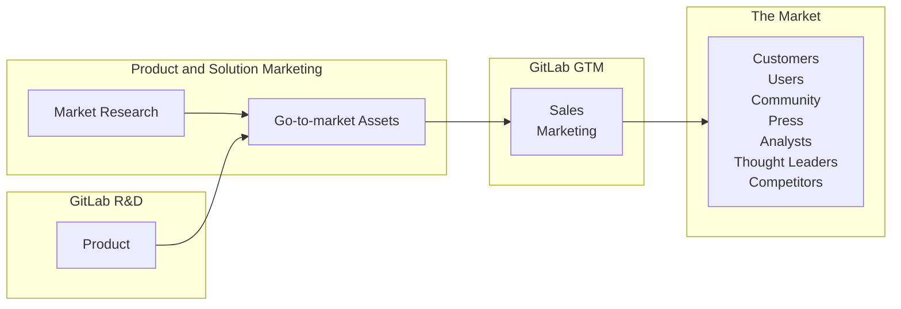

<link rel="stylesheet" type="text/css" href="/stylesheets/biztech.css" />

## <i class="fas fa-bullhorn"></i> Welcome to the GitLab Product and Solution Marketing Handbook

We create positioning and messaging to fuel demand and adoption of GitLab's solutions and products. We develop market and competitive intelligence in order to develop actionable insights on market trends, customer needs, and competitive insights that guide go-to-market and product strategy. We identify, recruit, and activate customer advocates to demonstrate momentum and trust in the market.

## What does Product and Solution Marketing do?

Our mission is to accelerate GitLab's path to market by developing insights, positioning, and messaging that communicate the value of our platform and solutions.

- We are core to GitLab's go-to-market process, operating at the intersection of product management, sales, customer success, and marketing.
- We help deliver a connected customer experience with every touchpoint reinforcing the brand, values, solutions, and vision of GitLab.
- We create programs and messaging to demonstrate momentum and trust in the market.

There are [10 key capabililities](https://docs.google.com/spreadsheets/d/1SqvXqr7T4A9JS25QLA3y7lbgktG5d-rSVnrV-hgLRdI/edit?usp=sharing) of team members. Sub-teams and individuals typically 'major' in certain areas and 'minor' in others. It's rare that one person would be expert in all 10.

- Target Market and Audience Definition
- Positioning, Messaging, Strategic Narrative, and Content Development
- Launch Planning & Execution
- Pricing and Packaging
- External Evangelism
- Customer Advocacy
- Business Management
- Sales Enablement
- Competitive Marketing
- Analyst Relations

## <i class="fas fa-star fa-fw color-orange font-awesome"></i>Go-to-market (GTM) Strategies

We develop and champion **go-to-market strategies** that take into account our sales goals, product strengths/limitations, and marketing vehicles. These strategies include recommendations on product and solution areas upon which to focus our marketing and sales efforts and provide supporting messaging, positioning, personas, key assets/content, demos, sales enablement, and more. We deliver our stories/messages to customers, analysts, press through collateral, events, customer meetings, etc., where we get first-hand feedback from the audience to iterate and improve our strategies. We champion the customer perspective for continuity of experience across the various customer touchpoints.

Each team within Product and Solution Marketing contributes uniquely and equally toward a comprehensive GTM strategy that includes:

- characteristics of accounts and personas to pursue with marketing and sales,
- routes to market (e.g. direct, channels),
- key messages,
- currated assets/content needed for the buyer's journey, (this team creates many key assets but assets may also come from SAs, evangelists, blogs, partners. This team currates compelling ones that pull the prospect along their journey.)
- key questions for sales to ask, competitive positioning, overcoming objections, other sales resources
- influencing the influencers (press and analysts), responding to analyst RFIs for magic quadrants (MQs) and waves.

[Solutions GTM Page](/handbook/marketing/brand-and-product-marketing/product-and-solution-marketing/usecase-gtm/) has links to all of this and more.

## <i class="fas fa-star fa-fw color-orange font-awesome"></i>Subject matter expertise

Product marketers are core to GitLab's go-to-market process, operating at the intersection of product management, sales, customer success, and marketing. Some examples of initiatives led by product marketing team include:

- They lead go to market across different channels working with many cross functional teams within marketing. E.g., Solutions based Go to Market of Automated Software Delivery or Security and Governance
- They lead product launches collaborating with cross functional teams across product, campaigns, sales, and marketing. E.g., GitLab Dedicated, GitLab Duo for AI-powered DevSecOps
- They lead pricing and packaging communications with cross functional teams across product, sales, PR, marketing, etc. E.g., End of availability of Starter / Bronze or Premium price increase
- They lead marketing launches E.g., GitLab 16 launch, Quarterly Launches
- They lead messaging and content for global events that GitLab participates or hosts E.g., GitLab Commit, DevSecOps World Tour, AWS / Gartner and other events GitLab participates in
- They lead messaging and content for sales enablement and accreditation E.g., DevSecOps messaging accreditation, AI messaging accreditation

### Requesting Product and Solution Marketing help

All Product and Solution Marketing work is aligned to the overall Marketing OKRs.The specific team OKR/KRs are tracked and managed as issues in the Product and Solution Marketing Project. If you need additional support from the team, the simple process below will enable us to support you.

1. [Open an PMM Support Request Issue](https://gitlab.com/gitlab-com/marketing/brand-product-marketing/product-marketing/-/issues/new). PLEASE fill in what you know.
1. Be sure to @mention a specific team member who you are requesting help from. If you don't @mention a team member, your request may not be processed. Ping `@doneal` or `@gl-pmm` if you don't know whom to tag.
1. If you need more immediate attention please send a message with a link to the issue you created in the `#product-marketing` slack channel. You can ping the PMM team with `@pmm-team`.

### Product Marketing Team

- @dsteer - VP of Brand and Product Marketing
- @mklaus - Sr. Director, Product Marketing
- @jhurwitz - Senior Manager, Product Marketing
- @anair - Product Marketing Manager
- @dhom - Product Marketing Manager
- @lalves - Principal Product Marketing Manager, AI
- @jkempton - Senior Product Marketing Manager, Competitive Intelligence
- @sladha - Principal Product Marketing Manager, Security
- @aholland - Senior Product Marketing Manager, Financial Services
- @lburrows - Senior Public Sector Product Marketing Manager
- @mdelaney - Senior Product Marketing Manager, Embedded Systems/Automotove/Aerospace

## <i class="fas fa-star fa-fw color-orange font-awesome"></i>Marketing and Sales Enablement

Through research and iteration, Product and Solution Marketing becomes the subject matter experts around key product capabilities and/or solutions. We provide the voice of the customer to help to connect the dots across the marketing functions (web, campaigns, digital ads, ABM, events) and sales stages (SDR nurture, SAEs/SAs pursuit/close, CSM expansion) by providing an outside-in perspective of our buyer's journey experience, along with that of their key influencers, from pain to purchase and from interest to sales. We strive to optimize the journey to efficiently achieve return on marketing and sales investment.

Product and Solution Marketing team members serve as subject matter experts and conduct in-house and partner sales trainings scheduled by the [Sales Training team](/handbook/sales/training/) and Partner Marketing. For info go to the [Sales Enablement page](/handbook/sales/training/sales-enablement-sessions/).

## Metrics

The Product and Solution Marketing organization is often considered the nexus that brings together research, customer and market insights. The Product and Solution Marketing organization collaborates and partners with other teams in marketing for certain execution elements, such as Digital Experience, Brand, and Integrated marketing.  Additional key collaborators are sales for using the revenue plays for effective iteration, and Product Management to help with customer engagement via our CAB as well as providing input into analyst outreach.

The organization is an influencer on the indicators below. We cannot drive the results on our own, only through collaboration, but we use these indicators to assess the impact of our actions.

**Leading indicators**

- Position and progression in key Gartner Magic Quadrants and Forrester Waves
- SEO of most critical terms
- Content creation and use
- Leads generated and SAOs

**Lagging indicators**

- ARR for Enterprise and Commercial
- First order new logos (is the message capturing new prospects?)
- Uptiering (are we arming sales with compelling offers?)
- Customer retention (are expectations set by marketing messages aligned with product experience?)
- Consistent outcomes from sales value plays (is the recipe a good one?)

## Collateral

All field and customer facing collateral generated by Product Marketing is hosted on

- [HighSpot](https://gitlab.highspot.com/) (for sales teams)
- [Pathfactory](https://gitlab.lookbookhq.com/) (for campaigns)
- [Solution Pages](https://about.gitlab.com/solutions/) (for web users)

### Acronyms

- **PMM**: Used to refer to **Product Marketing Management** (as a practice or the entire Core Product Marketing team) or specifically to a **Product Marketing Manager**. Examples:
  - Product Marketing Management: "Let's collaborate with PMM since they are customer and market SMEs"
  - Product Marketing Manager: "Parker is the PMM on my cross-functional team."
- **TMM**: Used to refer to **Technical Marketing Management** (as a practice or the entire Technical Marketing tream) or specifically to a **Technical Marketing Manager**. This team is now Developer Advocates and reports into Developer Relations.
- **PM**: [Product Mangement](/handbook/product/) or [Product Manager](/handbook/product/product-management/product-manager-role/). Don't use PM to refer to  Product Marketing, use PM exclusively for the Product team.
