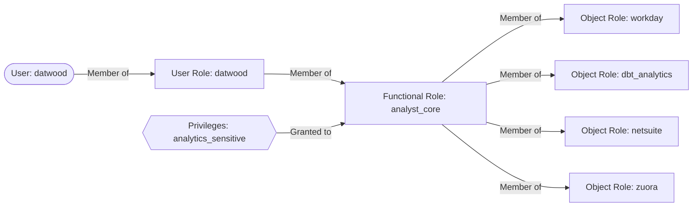
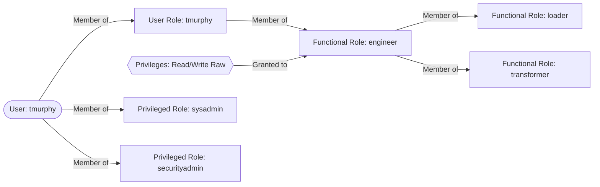
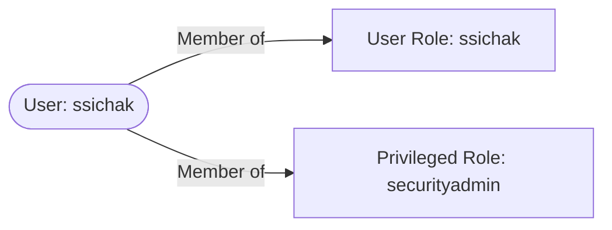
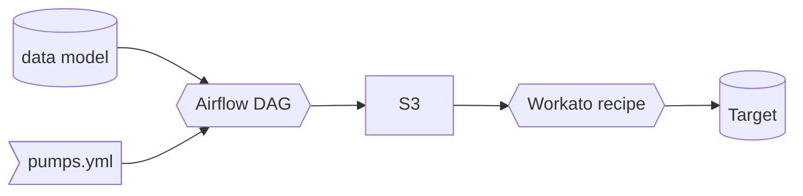

## Our Data Platform Vision

These ambitions are set to be a guiding vision for GitLab's data platform.

### Makes it Easier to Contribute

Contributing to GitLab's Data Platform is easy and using the platform is intuitive

* Documentation is complete and relevant for users and contributors
* All data transformations are implemented in dbt
* CI/CD is seamless, intuitive, automated for contributors and reviewers
* Data state is derivative from sources and transformations
* Data pipelines are idempotent

### Is Reliable

The data plaform along with the data it delivers is consitent in availability and accuracy

* All breaking changes are testable in Dev and/or Staging Environments
* Automated tests are implemented at every stage of the data delivery process
* Every component of the platform can and should be defined in code and version controlled

### Is Secure

The Data Platform doesn't put people at risk

* Data is only accisible to those authorized by documented approvals
* The GitLab data team will stick with the [Principle of Least Privilege](https://internal.gitlab.com/handbook/security/access-management-standard/#principle-of-least-privilege) regarding the authorization and authentication

### Is Maintainable

* The Data Platform component will be created with considering the good engineering practices for the [ease of maintainability](https://en.wikipedia.org/wiki/Maintainability). It means tracking of maintainability is intended to help reduce or reverse a system's tendency toward "code entropy" or degraded integrity

### Benefits a Larger Community

GitLab's Data Platform is relevant to a community larger than GitLab's and depends on a larger community of engineers.

* Relevant Platform code is open sourced
* Platform enhancements are contributed back into community projects
* We prefer generalizable specifications and standards over idiosyncratic custom development

## Purpose

The Data Platform is used for data analytics purposes. This document conceptually describes on high level the components which all together are defined as the Data Platform.

## Scope

This document is limited to describe the Data Platform conceptually. There are other resources that describe it in more detail (i.e. the [data pipelines](/handbook/enterprise-data/platform/pipelines/) and the [infrastructure](/handbook/enterprise-data/platform/infrastructure/)).

## Roles & Responsibilities

| Role | Responsibility |
| ---- | -------------- |
| GitLab Team Members | Responsible for taking notice of how the standard that forms the Data Platform |
| Data Platform Team Members | Responsible for implementing and executing data use cases based on this standard |
| Data Management Team | Responsible for approving significant changes and exceptions to this standard |

## Standards

## <i class="fas fa-map-marked-alt fa-fw -text-purple"></i>Quick Links

* [Data Infrastructure](/handbook/enterprise-data/platform/infrastructure/)
* [Data Pipelines](/handbook/enterprise-data/platform/pipelines/)
* [Data CI Jobs](/handbook/enterprise-data/platform/ci-jobs/)
* [dbt Guide](/handbook/enterprise-data/platform/dbt-guide/)
* [Enterprise Data Warehouse](/handbook/enterprise-data/platform/edw/)
* [Data Pump](/handbook/enterprise-data/platform/#data-pump)
* [Jupyter Guide](/handbook/enterprise-data/platform/jupyter-guide/)
* [Permifrost](/handbook/enterprise-data/platform/permifrost/)
* [Python Guide](/handbook/enterprise-data/platform/python-guide/)
* [Python/Tools package management and inventory](/handbook/enterprise-data/platform/python-tool-package-management/)
* [Snowflake](/handbook/enterprise-data/platform/snowflake/)
* [Snowplow](/handbook/enterprise-data/platform/snowplow/)
* [SQL Style Guide](/handbook/enterprise-data/platform/sql-style-guide/)
* [Meltano](https://internal.gitlab.com/handbook/enterprise-data/platform/Meltano-Gitlab/)
* [R/RStudio](/handbook/enterprise-data/platform/rstudio/)
* [Tableau](/handbook/enterprise-data/platform/tableau/)

## <i class="fas fa-cubes fa-fw -text-orange"></i>Our Data Stack


We use GitLab to operate and manage the analytics function.
Everything starts with an issue.
Changes are implemented via merge requests, including changes to our pipelines, extraction, loading, transformations, and parts of our analytics.

| Stage           |              Tools             |
| :-------------- | :---------------------------: |
| Extraction      | Stitch, Fivetran, Tableau Prep, and Custom Code |
| Loading         | Stitch, Fivetran, Tableau Prep, and Custom Code |
| Orchestration   | Airflow, Tableau Prep |
| Data Warehouse  | Snowflake Enterprise Edition |
| Transformations | dbt and Python scripts |
| Data Visualization | Tableau |
| Advanced Analytics | jupyter |

## <i class="fas fa-exchange-alt fa-fw -text-purple"></i>Extract and Load

We currently use [Stitch](https://www.stitchdata.com) and [Fivetran](https://www.fivetran.com/) for some of our data sources. These are off-the-shelf ELT tools that remove the responsibility of building, maintaining, or orchestrating the movement of data from some data sources into our Snowflake data warehouse. We run a full-refresh of all of our Stitch/Fivetran data sources at the same time that we rotate our security credentials (approx every 90 days). Prior to running a full refresh we will drop all of the tables.

Stitch and Fivetran handle the start of the data pipeline themselves. This means that Airflow does not play a role in the orchestration of the Stitch- and Fivetran schedules.

Other solutions we use to extract data are:

1. [Meltano](https://internal.gitlab.com/handbook/enterprise-data/platform/Meltano-Gitlab/)
1. Custom pipelines built in [Python](/handbook/enterprise-data/platform/python-guide/) and orchestrated via [Airflow](/handbook/enterprise-data/platform/infrastructure/#airflow)
1. Flows built in Tableau Prep and orchestracted by Tableau Cloud
1. Snowflake [data share](https://docs.snowflake.com/en/user-guide/data-sharing-intro)

For source ownership please see [the Tech Stack Applications data file.](https://gitlab.com/gitlab-com/www-gitlab-com/-/blob/master/data/tech_stack.yml)

### Data Sources

The following table indexes all of the RAW data sources we are loading into the data warehouse from external locations. We manage the development backlog and priorities in the [New Data Source/Pipeline Project Management](https://docs.google.com/spreadsheets/d/14uqsAIqRnyyL9Ta39QYwheXnf0k86yTTIKhrkY_1el8/edit#gid=0) sheet, with links to GitLab issues for up-to-date status and progress management. The [new data source handbook](/handbook/enterprise-data/how-we-work/new-data-source/) page describes how the Data Team handles any request for new data sources.

**The link in the pipeline column in the table below will bring you to the detailed page of the specific data pipeline if applicable.**

**Key**

* Pipeline: The technology we use to replicate data.
* RF (Replication Frequency): How often we load new and updated data.
* Raw Schema: The schema in the `RAW` database where data is stored.
* Prep Schema: The schema in the `PREP` database where [source models](/handbook/enterprise-data/platform/dbt-guide/#source-models) are materialized.
* Audience: The primary users of the data.
* SLO: Service Level Objective. Our SLO is the time between real-time and the data made available for consumption.
  * Technically, this means the time between when an entry is made in an upstream system and when the data is available in the Snowflake `PROD` layer (which includes transformations in dbt).
`x` indicates undefined or not run


<!-- Add or edit data sources in https://gitlab.com/gitlab-com/www-gitlab-com/-/tree/master/data -->

#### Source contacts

See the [source contact spreadsheet](https://docs.google.com/spreadsheets/d/1VKvqyn7wy6HqpWS9T3MdPnE6qbfH2kGPQDFg2qPcp6U/edit) for who to contact if there are any external errors.

#### Tier definition

| Aspect | Tier 1 | Tier 2  | Tier 3 |
|:-|:-|:-|:-|
| **Description**  | - Trusted Data solutions that are most important and business critical. <br><br> - Components needs to  be available and refreshed to ensure day-by-day operation | - Data solutions that are important and beneficial for gathering insights. <br><br> - Components should be available and refreshed to supporting day-by-day operation | - Data solutions that are important for Ad-Hoc, periodically or one-time analysis. <br><br> - Components could be unavailable or data not refreshed. |
|**Criteria**|- Any data, process, or related service that would result in a $100k or *higher* business impact if unavailable for 24 hours <br><br>-  Affecting more than 15 business users | - Any data, process, or related service that would result in  *less*  than $100k business impact if unavailable for 24 hours <br><br> - Affecting between 5 and 15 business users | - Any data, process or related service that would *not* result in a immediate business impact if unavailable for more than 5 working days <br><br> - Affecting less then 5 business users |
|**Impact due to outage**|Severe|Lenient|Negligible |

### Data Team Access to Data Sources

In order to integrate new data sources into the data warehouse, specific members of the Data team will need admin-level access to data sources, both in the UI and through the API.
We need this admin-level access through the API in order to pull all the data needed to build the appropriately analyses and through the UI to compare the results of prepared analyses to the UI.

Sensitive data sources can be limited to no less than 1 data engineer and 1 data analyst having access to build the require reporting.
In some cases, it may only be 2 data engineers.
We will likely request an additional account for the automated extraction process.

Sensitive data is locked down through the security paradigms listed below;

### Data Source Overviews

* [Customer Success Dashboards](https://drive.google.com/open?id=1FsgvELNmQ0ADEC1hFEKhWNA1OnH-INOJ)
* [Netsuite](https://www.youtube.com/watch?v=u2329sQrWDY)
  * [Netsuite and Campaign Data](https://drive.google.com/open?id=1KUMa8zICI9_jQDqdyN7mGSWSLdw97h5-)
* [Version (pings)](https://drive.google.com/file/d/1S8lNyMdC3oXfCdWhY69Lx-tUVdL9SPFe/view)
  * Note that up until October 2019, the data team referred to the entire **version** data source as "pings". However, usage ping is only one subset of the version data source which is why we now use "version" or "version app" to refer to the version.gitlab.com *data source* and "usage data" or "usage pings" or "pings" to refer to the [specific usage data feature](https://docs.gitlab.com/ee/administration/settings/usage_statistics.html) of the version data source. In the context of Data extraction, when it comes to `Service ping` data ingestion, specific details should be found in the [Service ping](https://internal.gitlab.com/handbook/enterprise-data/platform/pipelines/#service-ping) page or in the [Readme.md](https://gitlab.com/gitlab-data/analytics/-/blob/master/extract/saas_usage_ping/README.md) page for Service ping
* [Salesforce](https://youtu.be/KwG3ylzWWWo)
* [Zendesk](https://drive.google.com/open?id=1oExE1ZM5IkXcq1hJIPouxlXSiafhRRua)

### Snowplow Infrastructure

Refer to the [Snowplow Infrastructure page](/handbook/enterprise-data/platform/snowplow) for more information on our setup.

## <i class="fas fa-clock fa-fw -text-orange"></i>Orchestration

We use Airflow on Kubernetes for our orchestration. Our specific setup/implementation can be found [here](https://gitlab.com/gitlab-data/data-image). Also see the [Data Infrastructure](/handbook/enterprise-data/platform/infrastructure/) page for more information.

## <i class="fas fa-database fa-fw -text-purple"></i>Data Warehouse

We currently use [Snowflake](https://docs.snowflake.net/manuals/index.html) as our data warehouse. The Enterprise Data Warehouse (EDW) is the single source of truth for GitLab's corporate data, performance analytics, and enterprise-wide data such as Key Performance Indicators. The EDW supports GitLab's data-driven initiatives by providing all teams a common platform and framework for reporting, dashboarding, and analytics. With the exception of point-to-point application integrations all current and future data projects will be driven from the EDW. As a recipient of data from a variety of GitLab source systems, the EDW will also help inform and drive Data Quality best-practices, measures, and remediation to help ensure all decisions are made using the best data possible.

### Snowplow updating columns

#### Snowplow nullify geo columns

**Issue**: [**Snowflake documentation**](https://docs.snowflake.com/en/user-guide/data-load-snowpipe-ts#unable-to-reload-modified-data-modified-data-loaded-unintentionally)

In order not to extract geo data into Snowplow, the following columns were nullified:

* `geo_zipcode`
* `geo_latitude`
* `geo_longitude`
* `user_ipaddress`

This nullified is applied in Snowplow from `2023-02-01` and the files have the same structure, just column values are set to `NULL`. The Data Team updated old files and set mentioned columns to `NULL`, and also set columns to `NULL` in Snowflake. This is applicable to the `RAW`, `PREP` and `PROD` layers in Snowflake.

As desired to avoid a duplicate load of the updated files in the `S3` bucket as per [**Snowflake documentation**](https://docs.snowflake.com/en/user-guide/data-load-snowpipe-ts#unable-to-reload-modified-data-modified-data-loaded-unintentionally), the folder structure is modified from:

```bash
- gitlab-com-snowplow-events/
    output/ <---- all files are located here
        2019/01/01
        ...
        (present day)
```

to the new structure:

```bash
- gitlab-com-snowplow-events/
    output_nullified_columns/ <---- all files are nullified and updated
        2019/01/01
        ...
        2023/01/31
    output/ <---- new files will land here and will be loaded by Snowpipe
        2023/02/01
        ...
        (present day)
```

#### Snowplow nullify `page_url_path` columns

**Issue**: [s3: Pseudonymize page_url_path in Snowflake and s3 bucket](https://gitlab.com/gitlab-data/analytics/-/issues/22351)

In order to be compliant with data into Snowplow, the following columns were pseudo-anonymized:

* `page_url_path`

This pseudo-anonymization is applied for `Snowplow` data, for the period `2022-10-26` - `2024-12-01` and the files have the same structure, just column values are pseudonymized.
The Data Team updated old files and pseudo-anonymized  `page_url_path` column, and also pseudo-anonymized `page_url_path` column in Snowflake.
This is applicable to the `RAW`, `PREP` and `PROD` layers in Snowflake.

As desired to avoid a duplicate load of the updated files in the `S3` bucket as per [s3: Pseudonymize page_url_path in Snowflake and s3 bucket](https://gitlab.com/gitlab-data/analytics/-/issues/22351), the folder structure is modified from:

```bash
- gitlab-com-snowplow-events/
    output_nullified_columns/ <---- all files are nullified and updated (in the previous iteration)
        2022/10/26
        ...
        2023/
            02/
    output/
        2023/
            02/
            03/
```

to the new structure:

```bash
- gitlab-com-snowplow-events/
    output_nullified_columns/
        2019/01/01
        ...
        2022/10/25
    output_mask_page_url_path/ <---- all files are pseudonimized
        2022/10/26
        ...
        2023/12/01
    output/ <---- new files will land here and will be loaded by Snowpipe
        2023/12/02
        ...
        (present day)
```

> **Note:** All new loads in the `S3` bucket will go into the same folder as before `gitlab-com-snowplow-events/output`.

### Snowflake support portal access

To get access to snowflake support portal, please follow the below steps.

* When you are in your [Snowsight](https://docs.snowflake.com/en/user-guide/ui-snowsight) instance, open your account (bottom-left corner) and go to the Support option


* On the panel, you can see the already open cases


* In the top-right corner, to open a new case, press `+ Support Case` button
* Fill in the data to describe your issue and the Snowflake team will handle it


* For each update on your case, you will be informed by email

### Warehouse Access

To gain access to Snowflake:

* Create an issue in the [access requests project](https://gitlab.com/gitlab-com/team-member-epics/access-requests) documenting the level of access required.
* Do not request a shared account - each account must be tied to a user.
* We loosely follow the paradigm explained in [this blog post](https://www.getdbt.com/blog/how-we-configure-snowflake) around permissioning users.
* When asking to mirror an existing account, please note that access to restricted SAFE data will **not** be provisioned/mirrored (currently provided via `restricted_safe` role).
* Snowflake is part of the [Access Review Procedure](/handbook/security/security-assurance/security-compliance/access-reviews/) and manager will be asked on a quarterly basis to review the access their team members have in Snowflake. It is expected from the manager to understand the available roles(structure) in Snowflake if approving an AR or reviewing their team member access.
  * In the access review, only the first level of Snowflake roles are reported (the ones that are directly attached to the user). I.e. If a team member does have the `analyst_marketing` role, only the `analyst_marketing` is reported and all inherited roles in the `analyst_marketing` are not.
    * Roles could be distinguished between functional roles and object roles
      * See this list of functional roles in Snowflake and object roles.
      * Object roles are directly related to systems and gives Team Members access to **all** of the data we extract from those upstream source systems.
      * To know in all detail what a role entails check this YAML [file](https://gitlab.com/gitlab-data/analytics/-/blob/master/permissions/snowflake/roles.yml).
      * If unsure, during AR process or Access Review, please reach out to a Data Platform Team Member to understand in detail what a specific role entails.

#### Snowflake Analyst

Snowflake can be used to perform analyses on the data that is available by writing SQL-code. Anything created and any outcome of the analyses is considered as an [ad-hoc analyses](/handbook/enterprise-data/how-we-work/data-development/#data-development-at-gitlab). It is important to know that anything that is created (i.e. worksheets and dashboards) is not version controlled and not supported or managed by the Central Data Team. I.e. When a team member off-boards from GitLab, the worksheets and dashboards are not accessible anymore. In order to persist analyses, team members can build Tableau workbooks, store code snippets in a GitLab project, or commit code to the Data Team's [dbt project](https://gitlab.com/gitlab-data/analytics/-/tree/master/transform/snowflake-dbt).

In order to be granted access to Snowflake, an AR must be opened as [described](/handbook/enterprise-data/platform/#warehouse-access). A new user will be created with access to query the `PROD` database.
There are 2 levels of data access:

* General data --> Adding the Snowflake `snowflake_analyst` role to their account.
* SAFE data (you must be or will become a designated insider) --> Adding the Snowflake `snowflake_analyst_safe` to their account. See the [SAFE Guide](/handbook/enterprise-data/platform/safe-data/#snowflake) for the needed approvals.

All users will have access to `dev_xs` and `reporting` -(size M) warehouse. When creating the user, the `dev_xs` warehouse as default warehouse.

### Snowflake Permissions Paradigm

We use [Permifrost](https://gitlab.com/gitlab-data/permifrost/) to help manage permissions for Snowflake.
Our configuration file for our Snowflake instance is stored in [this roles.yml file](https://gitlab.com/gitlab-data/analytics/blob/master/permissions/snowflake/roles.yml).
Also available is our [handbook page on Permifrost](/handbook/enterprise-data/platform/permifrost/).

We follow this general strategy for role management:

* Every user has an associated user role
* Functional roles exist to represent common privilege sets (`analyst_finance`, `data_manager`, `product_manager`)
* Logical groups of data have their own object roles
* Object roles are assigned primarily to functional roles
* Higher privilege roles (`accountadmin`, `securityadmin`, `useradmin`, `sysadmin`) are assigned directly to users
* Service accounts have an identically named role
* Additional roles can be assigned either to the service account role or the service account itself, depending on usage and needs
* Individual privileges can be granted at the granularity of the table & view
* Warehouse usage can be granted to any role as needed, but granting to functional roles is recommended

#### User Roles

Every user will have their own user role that should match their user name.
Object level permissions (database, schemas, tables) in Snowflake can only be granted to roles.
Roles can be granted to users or to other roles.
We strive to have all privileges flow through the user role so that a user only has to use one role to interact with the database.
Exceptions are privileged roles such as `accountadmin`, `securityadmin`, `useradmin`, and `sysadmin`.
These roles grant higher access and should be intentionally selected when using.

#### Functional Roles

Functional roles represent a group of privileges and role grants that typically map to a job family.
The major exception is the analyst roles.
There are several variants of the analyst role which map to different areas of the organization.
These include `analyst_core`, `analyst_finance`, `analyst_people`, and more.
Analysts are assigned to relevant roles and are explicitly granted access to the schemas they need.

Functional roles can be created at any time.
It makes the most sense when there are multiple people who have very similar job families and permissions.

##### Functional Role Assignment

This list of functional roles gives a high level understanding of what the role entails. If missing or to know in all detail what a role entails check this YAML [file](https://gitlab.com/gitlab-data/analytics/-/blob/master/permissions/snowflake/roles.yml).

| Functional Role | Description | SAFE Data Y/N |
| --- | --- | --- |
| `data_team_analyst` | Access to all `PROD` data, sensitive marketing data, Data Platform metadata and some sources. | Yes |
| `analyst_core` | Access to all `PROD` data and meta data in the Data Platform | No |
| `analyst_engineering` | Access to all `PROD` data, meta data in the Data Platform and Engineering related data sources. | Yes |
| `analyst_growth` | Access to all `PROD` data, meta data in the Data Platform and various data sources. | Yes |
| `analyst_finance` |  Access to all `PROD` data, meta data in the Data Platform and finance related data sources. | Yes |
| `analyst_marketing` |  Access to all `PROD` data, meta data in the Data Platform and marketing related data sources. | Yes |
| `analyst_people` |  Access to all `PROD` data, meta data in the Data Platform and various related data sources, including sensitive people data. | Yes |
| `analyst_sales` |  Access to all `PROD` data, meta data in the Data Platform and various related data sources | Yes |
| `analyst_support` |  Access to `PROD` data, meta data in the Data Platform and `raw` / `prep` Zendesk data, including sensitive Zendesk data | No |
| `analytics_engineer_core` |  A combination of `analyst_core`, `data_team_analyst` role with some additions | Yes |
| `data_manager` | Extension access to Snowflake data  | Yes |
| `engineer` | Extension access to Snowflake data to perform data operation tasks in Snowflake | Yes |
| `snowflake_analyst` | Access to `PROD` data in Snowflake, EDM schema and workspaces | No |
| `snowflake_analyst_safe` | Access to `PROD` data in Snowflake, EDM schema and workspaces including SAFE data | Yes |
| `sensitive_pii_data_viewer` |  Access to all sensitive fields in person and contact data mastery models. | No |

#### Object Roles

Object roles are for managing access to a set of data.
Typically these represent all of the data for a given source.
The `zuora` object role is an example.
This role grants access to the raw Zuora data coming from Stitch, and also to the source models in the `prep.zuora` schema.
When a user needs access to Zuora data, granting the `zuora` role to that user's user role is the easiest solution.
If for some reason access to the object role doesn't make sense, individual privileges can be granted at the granularity of a table.

#### Masking Roles

Masking Roles manage how users interact with masked data. Masking is applied at the column level and which columns are masked is the decision of the source system owner. Masking is applied to a column in a `schema.yml` file within the dbt code base when a data object is created via dbt. As some users will need access to unmasked data the masking role allows for permissions to the unmasked data to be granted on a functional or object role level. For example if the masking role of `people_data_masking` is applied to the column `locality` then the functional role of `analyst_people` can be set as a member of the `people_data_masking` role to allow the analysts to see unmasked people data.

When a masking policy is created, it is created based on the masking roles and only one masking policy can be applied to a column.

#### Examples

This is an example role hierarchy for an Data Analyst, Core:



This is an example role hierarchy for an Data Engineer and Account Administrator:



This is an example role hierarchy for a Security Operations Engineer:



#### **Managing Roles for Snowflake**

Here are the proper steps for provisioning a new user and user role:

* Make sure we have an issue in the GitLab Data Team project linking the original request with the `Provisioning` label applied
* Login to Snowflake and switch to `securityadmin` role
  * All roles should be under `securityadmin` ownership
* Copy the [`user_provision.sql`](https://gitlab.com/gitlab-data/analytics/-/blob/master/permissions/snowflake/user_provision.sql) script and replace the email, firstname, and lastname values in the initial block
* If a password is needed, use [Password Generator](https://passwordsgenerator.net/) to create one
  * Send username and password credentials to user with [One Time Secret](https://onetimesecret.com/) or via Slack
* Document in Snowflake [roles.yml](https://gitlab.com/gitlab-data/analytics/-/blob/master/permissions/snowflake/roles.yml) permifrost config file (this file is automatically loaded every day at 12:00a.m. UTC)
   Add the user and user role you created
  * Assign the user role to new user
  * Assign any additional roles to user
* Ensure the user is assigned the application in Okta
* Ensure the user is assigned to the `okta-snowflake-users` [Google Group](https://groups.google.com/my-groups)

Here are the proper steps for deprovisioning existing user:

* Snowflake deprovision should be done via an offboarding issue or access request issue.
* Make sure we have an issue in the GitLab Data Team project linking the original source request with the `Deprovisioning` label applied.
* Login to Snowflake and switch to `securityadmin` role
  * All roles should be under `securityadmin` ownership.
* Copy the [`user_deprovision.sql`](https://gitlab.com/gitlab-data/analytics/-/blob/master/permissions/snowflake/user_deprovision.sql) script and replace the USER_NAME. The reason for not removing and leaving the user in snowflake and setting disabled = TRUE is to have a record of when the user lost access.
* Remove the user from `okta-snowflake-users` [Google Group](https://groups.google.com/my-groups)
* Remove the user records in Snowflake [roles.yml](https://gitlab.com/gitlab-data/analytics/-/blob/master/permissions/snowflake/roles.yml) permifrost config file (this file is automatically loaded every day at 12:00a.m. UTC)

For more information, watch this [recorded pairing session](https://youtu.be/-vpH0aSeO9c) (must be viewed as GitLab Unfiltered).

## Snowflake Provisioning Automation

In FY25-Q1, we are moving towards semi-automating the above `Managing Roles for Snowflake` process, [OKR epic](https://gitlab.com/groups/gitlab-data/-/epics/1128). This will enable **all GitLab Team Members** to create a Snowflake user themselves with minimal support by the Data Platform Team. This will speed up the provisioning process and shorten the time a GitLab Team member can get access to Snowflake.

All GitLab Team Members are encouraged to open a MR following this [runbook](https://gitlab.com/gitlab-data/runbooks/-/blob/main/snowflake_provisioning_automation/snowflake_provisioning_automation.md) if they need access to Snowflake.

High-level description of the process:

1. Open an Access Request and get the approvals in place
1. Open an MR
1. Run CI pipeline
1. Review from Data Platform Team codeowner.

The rest of the section is meant to describe the automated process in more detail.

The main processes that have been automated are:

1. create/remove users from Snowflake platform
1. update `roles.yml` which is used by Permifrost to update Snowflake role/user permissions

Both of these processes will be made accessible via CI jobs so that the user can potentially self-serve, requiring just MR review/approval from a data engineer.

Both CI jobs follow a common pattern, the end user simply has to add/remove users from within the [`snowflake_usernames.yml`](https://gitlab.com/gitlab-data/analytics/-/blob/master/permissions/snowflake/snowflake_usernames.yml) file, and the CI job will run based on the changes to the file.

### 1) Automate creating users/roles in Snowflake platform

Prior to running Permifrost, the users/roles need to be first created in Snowflake.

The `snowflake_provisioning_snowflake_users` CI job allows the user to create these users/roles in Snowflake.

See the [CI jobs page](/handbook/enterprise-data/platform/ci-jobs/#snowflake_provisioning_snowflake_users) for more information on the available arguments and default values.

### 2) Automating roles.yml

Once the users/roles have been created in Snowflake, `roles.yml` needs to be updated to reflect the desired permissions.

The `snowflake_provisioning_roles_yaml` CI job allows the end user to automatically update `roles.yml` with the desired permissions.

See the [CI jobs page](/handbook/enterprise-data/platform/ci-jobs/#snowflake_provisioning_roles_yaml) for more information on the available arguments and default values.

Furthermore, the next section provides additional details on optional **templated** arguments within `snowflake_provisioning_roles_yaml` CI job:

<details><summary>Optional Templated Arguments</summary>

#### Custom Templates

This is useful if you have many users that need a value different from the default. One option would be to run with the default values, and then manually update the MR, but depending on the number of users to update, a potentially better option is to pass in a custom values template.

The rest of the section will do two things:

1. Explain how templates work
1. For convenience, provide custom templates that represent common values currently used in `roles.yml`

To illustrate how templates work, let's start with an example. This is the default *roles template*:

```json
{
  "{{ username }}": {
    "member_of": [
      "snowflake_analyst"
    ],
    "warehouses": [
      "dev_xs"
    ]
  }
}
```

This is valid JSON, but note that it is **templated**. That is, `{{ username }}` is a Jinja template, and the template will be later rendered to an actual value within the script.

Now, an example of when we want to override the default value above. What happens if for the next batch of users, we want them to also have `dev_m` warehouse?

Within the CI job, we could pass in a custom template to override the default value like so:

```plain
ROLES_TEMPLATE: {"{{username}}": {"member_of": ["snowflake_analyst"],"warehouses": ["dev_xs", "dev_m"]}}
```

Currently, these are the available template-able values that will be rendered:

* `{{ username }}`
* `{{ prod_db }}`
* `{{ prep_db }}`
* `{{ prod_schemas }}`
* `{{ prep_schemas }}`
* `{{ prod_tables }}`
* `{{ prep_tables }}`

#### Common Custom Templates

This section is meant to provide custom templates (non-default values) that represent common-occurring values in `roles.yml` that can be copy/pasted for use.

* *Default* denotes that this is the template used if not explicitly overridden.
* *Common* denotes that while the template is not used by default, these values are still commonly used within roles.yml

##### Databases

* Default: None, no databases are added
* Common: CI job argument to create a personal prep/prod database for each user:

    ```sh
    DATABASES_TEMPLATE: [{"{{ prod_database }}": {"shared": false}}, {"{{ prep_database }}": {"shared": false}}]
    ```

##### Roles

* Default:

    ```sh
    ROLES_TEMPLATE: {"{{ username }}": {"member_of": ["snowflake_analyst"], "warehouses": ["dev_xs"]}}
    ```

* Common- CI job argument to create a role for a data engineer:

    ```sh
    ROLES_TEMPLATE: {"{{ username }}": {"member_of": ["engineer","restricted_safe"],"warehouses": ["dev_xs","dev_m","loading","reporting"],"owns": {"databases": ["{{ prep_database }}","{{ prod_database }}"],"schemas": ["{{ prep_schemas }}","{{ prod_schemas }}"],"tables": ["{{ prep_tables }}","{{ prod_tables }}"]},"privileges": {"databases": {"read": ["{{ prep_database }}","{{ prod_database }}"],"write": ["{{ prep_database }}","{{ prod_database }}"]},"schemas": {"read": ["{{ prep_schemas }}","{{ prod_schema }}"],"write": ["{{ prep_schemas }}","{{ prod_schema }}"]},"tables": {"read": ["{{ prep_tables }}","{{ prod_tables }}"],"write": ["{{ prep_tables }}","{{ prod_tables }}"]}}}}
    ```

##### Users

* Default:

    ```sh
    USERS_TEMPLATE: {"{{ username }}": {"can_login": true, "member_of": ["{{ username }}"]}}
    ```

* Common: N/A. There are no other templates that we currently use for users

</details>

#### Automating roles.yml: Project Access Token

The `snowflake_provisioning_roles_yaml` CI job runs `update_roles_yaml.py` which updates `roles.yml` file.

The changes to `roles.yml` within the CI job are **pushed back to the branch/MR**.

In order to push to the repo from within the CI pipeline, a [Project Access Token](https://docs.gitlab.com/ee/user/project/settings/project_access_tokens.html) (PAT) is needed, more info pushing to the remote repo in this [StackOverflow answer](https://stackoverflow.com/a/73394648).

The PAT is named `snowflake_provisioning_automation` and was created in the ['GitLab Data Team' project](https://gitlab.com/gitlab-data/analytics), using the analyticsapi@gitlab.com account.

The PAT value is saved within 1Pass, and also as a CI environment variable so that it can be used by the GitLab runner.

#### snowflake_users.yml - end of file issue

When adding a user to the `snowflake_users.yml` file, specifically when appending to the bottom of the file, it causes unexpected behavior if done using the GitLab Single File Editor, more info in [this issue](https://gitlab.com/gitlab-data/analytics/-/issues/20730#note_1919902289).

The workaround is that at the bottom of `snowflake_users.yml`, it has this comment:

```yml
#### do not insert users below this line ####
```

### Snowflake Deprovisioning Users

Inactive Snowflake users will be deprovisioned weekly via `snowflake_cleanup` DAG, implemented in [this issue](https://gitlab.com/gitlab-data/analytics/-/issues/20347).

All active Snowflake users/roles are declared within `roles.yml`. Therefore, if any users in Snowflake are missing within roles.yml, they are considered inactive and the process will drop them.

These users will be dropped by running the following [deprovision_user.sql](https://gitlab.com/gitlab-data/analytics/-/blob/master/orchestration/snowflake_provisioning_automation/provision_users/sql_templates/deprovision_user.sql?ref_type=heads) script.

This process is not exposed via CI job due to its sensitive nature and because it is less time sensitive. Therefore, a weekly 'cleanup' task via Airflow will be run instead.

#### Snowflake user/service account

The `permifrost_bot_user` is used to run both Snowflake provisioning and deprovisioning processes. This is for 2 reasons:

1. `permifrost_bot_user` already has the proper permissions to run provisioning/deprovisioning as the same perms are needed to run existing Permifrost jobs.
1. The `permifrost_bot_user` already runs existing Permifrost jobs using both Airflow and GitLab CI, so the applied NSP IP addresses will not be redundant when added for both provisioning (run via CI) /deprovisioning (run via Airflow).

#### Provisioning permissions to external tables to user roles

Provisioning USAGE permissions for external tables to user roles inside snowflake is not handled by permifrost in the moment. If you have to provision access for an external table to a user role, then it must be granted manually via GRANT command in snowflake[docs](https://docs.snowflake.com/en/sql-reference/sql/grant-privilege) using a `securityadmin` role. This implies that the user role already has access to the schema and the db in which the external table is located, if not add them to the [roles.yml](https://gitlab.com/gitlab-data/analytics/-/blob/master/permissions/snowflake/roles.yml).

#### Logging in and using the correct role

When you apply for a Snowflake account via an AR and get access provisioned it takes until 3.00AM UTC for the change to take effect. This is because we have a script running daily to provision the access in Snowflake. When you can login, you can do this via Okta. After you logged in via Okta, you need to select the right role that is attached to your account. This is by default the same as your account and it follows the convention of your email addres minus `@gitlab.com`.

When you don't select the right role in Snowflake, you only see the following Snowflake objects:


Selecting the right role can be done via the GUI.
When in Snowsight home screen, in the up left corner.


1. Click on the arrow near your name
2. Select Switch Role
3. Select your role

When in Snowsight in a worksheet, in the up right corner.


1. Click on `public`
2. Select your role

You can set this to your default by running the following:

`ALTER USER <YOUR_USER_NAME> SET DEFAULT_ROLE = '<YOUR_ROLE>'`

### Compute Resources

Compute resources in Snowflake are known as "warehouses".
To use our credit consumption effectively, we try to minimize the amount of warehouses. For development purposes (executing dbt jobs locally, running MR pipelines and querying in Snowflake) we use the `dev_x` warehouse. The names of the warehouse are appended with their size (`dev_xs` for extra small).

| warehouse            | purpose                                                                                         | max query (minutes) |
| -------------------- | ----------------------------------------------------------------------------------------------- | ------------------- |
| `admin`              | This is for permission bot and other admin tasks                                                | 10                  |
| `data_classification` | This is for running the data classification and labelling process in Snowflake                 | 60                  |
| `dev_xs/m/l/xl`      | This is used for development purposes, to be used when using the Snowflake UI and in CI-pipelines | 180               |
| `gainsight_xs`       | This is used for gainsight data pump                                                            | 30                  |
| `gitlab_postgres`    | This is for extraction jobs that pull from GitLab internal Postgres databases                   | 10                  |
| `grafana`            | This is exclusively for Grafana to use                                                          | 60                  |
| `loading`            | This is for our Extract and Load jobs and testing new Meltano loaders                           | 120                 |
| `reporting`          | This is for the BI tool for querying.                                                           | 30*                 |
| `transforming_xs`    | These are for production dbt jobs                                                               | 180                 |
| `transforming_s`     | These are for production dbt jobs                                                               | 180                 |
| `transforming_l`     | These are for production dbt jobs                                                               | 240                 |
| `transforming_xl`    | These are for production dbt jobs                                                               | 180                 |
| `transforming_2xl`   | For refreshing Snowplow models                                                                  | 120                 |
| `transforming_4xl`   | This is for the Airflow dag: `dbt_full_refresh`                                                 | 120                 |
| `usage_ping`         | This is used for the service_ping and service_ping_backfill load.                               | 120                 |

If you're running into query time limits please check your query for optimisation. A bad performing query in development will result in a bad performing query in production, having impact on a daily basis. Please **always** use the right (size) warehouse. Ground rules of using/selecting a warehouse:

* Warehouses are set as t-shirt sizes. Larger warehouses are more costly for GitLab
* Consider using a running warehouse
  * If you resume a paused warehouse, there is a initial start cost
  * Every warehouse suspends after a set period, but when idle (time between query result and the suspend time), we still consume snowflake credits
  * In general we don't spend more money if we run concurrent queries.

* The query timeout in Snowflake is set to 30 minutes for the `REPORTING` warehouse.

### Data Storage

We use three primary databases: `raw`, `prep`, and `prod`.
The `raw` database is where data is first loaded into Snowflake; the other databases are for data that is ready for analysis (or getting there).


All tables and views in `prep` and `prod` are controlled (created, updated) via dbt. [Every Quarter](/handbook/enterprise-data/data-governance/data-management/#quarterly-data-health-and-security-audit) the Data Platform Team runs a check for tables and views that are not related to a dbt model and will be removed.


The following list of schema are exceptions and not checked:

* `SNOWPLOW_%`
* `DOTCOM_USAGE_EVENTS_%`
* `INFORMATION_SCHEMA`
* `BONEYARD`
* `TDF`
* `CONTAINER_REGISTRY`
* `FULL_TABLE_CLONES`
* `QUALTRICS_MAILING_LIST`
* `NETSUITE_FIVETRAN`

There is a `snowflake` database, which contains information about the entire GitLab instance.
This includes all tables, views, queries, users, etc.

There is a `covid19` database, which is a shared database managed through the Snowflake Data Exchange.

There is a `testing_db` database, which is used for testing Permifrost.

There is a `bi_tool_eval` database, which is used for testing bi tooling. Users are able create own testing sets manually.

All databases not defined in our [`roles.yml`](https://gitlab.com/gitlab-data/analytics/-/blob/master/permissions/snowflake/roles.yml) Permifrost file are removed on a weekly basis.

| Database | Suitable to use in Tableau |
|:-:|:-:|
| raw | No |
| prep | No |
| prod | Yes |

Only the `prod` database should be used in Tableau as this data has been transformed and modeled for business use. Using `raw` and `prep` databases in Tableau could result in incorrect data and or broken queries/dashboards now or in the future. Important to keep in mind that data transformations are checked and tested only for the `prod` database results. This means if dashboards are directly connected to the raw or `prep` database it could break or report wrong data.

#### Raw

No dbt models exist for this data and so it may be the case that the data needs review or transformation in order to be useful or accurate. This review, documentation, and transformation all happens downstream in dbt for `PREP` and `PROD`. This database should not be used in Tableau.

* Raw may contain sensitive data, so permissions need to be carefully controlled
* RAW will contain data that isn't ready for business use.
* Data is stored in different schemas based on the source
* User access can be controlled by schema and tables

##### Snowflake Data Share

Snowflake data sharing enables sharing various Snowflake objects like databases, tables, secure views, and a couple more from one Snowflake account to another. Snowflake shares can be both Inbound and outbound. Inbound share, which is being used at Gitlab, is for accessing third-party data sources like ZoomInfo and Zuora Revenue; the mechanism followed here is direct share, where data providers share specific database objects to our Snowflake account.
Outbound sharing is when we want to share our data with a third party. This involves creating an outbound share of a snowflake object in their account and granting access to the snowflake object (table, view, database, etc.) that needs to be shared to an external account using either a web interface or SQL.

Snowflake Data Shares can be seen as an extension of the `raw` layer, but sharded (and) in different accounts. We don't see Snowflake Data Shares as a source from which data needs to be copied, but rather we connect directly to Snowflake Data Shares as we do to the `raw` layer (i.e., with dbt). This approach helps avoid creating extra processes and makes the pipeline more efficient.

#### Prep

This is the first layer of verification and transformation in the warehouse, but is not yet ready for general business use. This database should not be used in Tableau.

* [Source models](/handbook/enterprise-data/platform/dbt-guide/#source-models) are built in logical schemas corresponding to the data source (i.e. `sfdc`, `zuora`)
* PREPARATION - this is the default schema where dbt models are built
* SENSITIVE

#### Prod

This database and all schemas and tables in it are queryable by Tableau. This data has been transformed and modeled for business use.

With the exception of `public`, and `boneyard`, all schemas are controlled by dbt.
See the [dbt guide](/handbook/enterprise-data/platform/dbt-guide) for more information.

#### Folder Structure in Analytics Project

The table below shows a mapping of how models stored within folders in the [`models/`](https://gitlab.com/gitlab-data/analytics/-/tree/master/transform/snowflake-dbt/models) directory in the analytics project will be materialized in the data warehouse.

The source of truth for this is in the [`dbt_project.yml` configuration file](https://gitlab.com/gitlab-data/analytics/-/blob/master/transform/snowflake-dbt/dbt_project.yml).

| Folder in snowflake-dbt/models/ | db.schema | Details | Queryable in Tableau |
|-|-|-|:-:|
| common/ | prod.common | Top-level folder for facts and dimensions. Do not put models here. | Yes |
| common/bridge | prod.common | Sub-folder for creating many-to-many mappings between data that come from different sources. | Yes |
| common/dimensions_local | prod.common | Sub-folder with directories containing dimensions for each analysis area. | Yes |
| common/dimensions_shared | prod.common | Sub-folder with dimensions that relate to every analysis area. | Yes |
| common/facts_financial | prod.common | Sub-folder with facts for the financial analysis area. | Yes |
| common/facts_product_and_engineering | prod.common | Sub-folder with facts for the product and engineering analysis area. | Yes |
| common/facts_sales_and_marketing | prod.common | Sub-folder with facts for the sales and marketing analysis area. | Yes |
| common/sensitive/ | prep.sensitive | Facts/dims that contain sensitive data. | No |
| common_mapping/ | prod.common_mapping | Used for creating one-to-one mappings between data that come from different sources. | Yes |
| common_mart/ | prod.common_mart | Joined dims and facts that are relevant to all analysis areas. | Yes |
| common_mart_finance/ | prod.common_mart | Joined dims and facts that are relevant to finance.  | Yes |
| common_mart_marketing/ | prod.common_mart | Joined dims and facts that are relevant to marketing. | Yes |
| common_mart_product/ | prod.common_mart | Joined dims and facts that are relevant to product. | Yes |
| common_mart_sales/ | prod.common_mart | Joined dims and facts that are relevant to sales. | Yes |
| common_prep/ | prod.common_prep | Preparation tables for mapping, bridge, dims, and facts. | Yes |
| marts/ | varies | Contains mart-level data and data pumps that send data to third party sources. | Yes |
| legacy/ | prod.legacy | Contains models built in a non-dimensional manner | Yes |
| sources/ | prep.`source` | Contains source models. Schema is based on data source | No |
| workspaces/ | prod.workspace_`workspace` | Contains workspace models that aren't subject to SQL or dbt standards.  | Yes |
| common/restricted | prod.restricted_`domain`_common | Top-level folder for restricted facts and dimensions. Equivalent of the regular common schema, but for restricted data. | Yes |
| common_mapping/resticted | prod.restricted_`domain`_common_mapping | Contains restricted mapping, bridge, or look-up tables. Equivelement of regular common mapping schema, but for restricted data. | Yes |
| marts/restricted | prod.restricted_`domain`*common*`marts` | Yes |  |
| legacy/restricted | prod.restricted_`domain`_legacy | Contains restricted models built in a non-dimensional manner. Equivalent of the normal legacy schema, but for restricted data. | Yes |

#### Static

For data warehouse use cases that require us to store data for our users without updating it automatically with dbt we use the `STATIC` database. This also allows for analysts and other users to create their own data resources (tables, views, temporary tables). There is a sensitive schema for sensitive data within the static database. If your use case for static requires the use or storage of sensitive data please create an issue for the data engineers.

Scenario's we have been using the `STATIC` database:

A request comes in to upload a set of data into one of our data sources.
This set of data is going to be uploaded once and never updated again.

In this case we have created a new table in the STATIC database and loaded the data there via `BULK UPLOAD` / `COPY` command. Then this model has been exposed to the `PREP` layer. The final model reads from this table via a `UNION` statement.

This way we have the data in the `STATIC` database and even if we perform a full-refresh of the data source, we will be able to include this manually uploaded set of records.

Examples of this implementation can be found below:

* Qualtrics, [Link to the MR](https://gitlab.com/gitlab-data/analytics/-/merge_requests/7676)
* Clari, [Link to the MR](https://gitlab.com/gitlab-data/analytics/-/merge_requests/7655)

### Data Masking

We use data masking obfuscate private or sensitive information with our data warehouse.  Masking can be applied in a dynamic or static manner depending on the particular data needs.  Masking can be applied at the request of the data source system owner or at discretion of the Data Team.  As our current data masking methods are applied procedurally using dbt they can only be applied in the `PREP` and `PROD` database.  If masking is required in the `RAW` database alternant methods of masking should be investigated.

#### Static Masking

Static data masking is applied during the transformation of the data and the masked result is materialized into the table or view.  This will mask the data for all users regardless of role or access permission.  This is accomplished in the code with tools such as the `hash_sensitive_columns` [macro](https://gitlab.com/gitlab-data/analytics/-/blob/48e7ef194be084b13d8091d3c97ca2c4ca89cf6d/transform/snowflake-dbt/macros/sensitive/hash_sensitive_columns.sql) within dbt.

#### Dynamic Masking

Dynamic masking is currently applied on tables or views in the `prep` and `prod` layer at query run time based on assigned policies and user roles using the [Dynamic Data Masking](https://docs.snowflake.com/en/user-guide/security-column-ddm-use) capabilities of Snowflake. Dynamic masking allows for data to be unmasked for selected users wile masked for all other users. This is accomplished by creating masking policies that are then applied to the column at the time of table or view creation. Masking policies are maintained within the data warehouse source code repository. Please see the [dbt guide](/handbook/enterprise-data/platform/dbt-guide/#dynamic-masking) to setup dynamic masking.

Note: Dynamic masking is not applied on `raw` database yet.

### Timezones

All timestamp data in the warehouse should be stored in UTC. The [default timezone](https://docs.snowflake.net/manuals/sql-reference/parameters.html#timezone) for a Snowflake sessions is PT, but we have overridden this so that UTC is the default. This means that when `current_timestamp()` is queried, the result is returned in UTC.

[Stitch explicitly converts](https://www.stitchdata.com/docs/data-structure/snowflake-data-loading-behavior#%0A%0A%09%0A%09%09%09%09%09a-column-contains-timestamp-data%0A%0A%09%09%09%09%0A%0A%0A) timestamps to UTC. Fivetran does this as well (confirmed via support chat).

The only exception to this rule is the use of pacific time to create date_id in fact tables, which should always be created by the `get_date_pt_id` dbt macro and labeled with the `_pt_id` suffix.

### Snapshots

We use the term snapshots in multiple places throughout the data team handbook and the term can be confusing depending on the context. Snapshots as defined by the dictionary is "a record of the contents of a storage location or data file at a given time". We strive to use this definition whenever we use the word.

#### dbt

The most common usage is in reference to [dbt snapshots](https://docs.getdbt.com/docs/build/snapshots). When dbt snapshots is run, it takes the current state of the *source* data and updates the corresponding *snapshot* table, which is a table that contains the full history of the source table. It has `valid_to` and `valid_from` fields indicating the time period for which that particular snapshot is valid. See the [dbt snapshots](/handbook/enterprise-data/platform/dbt-guide/#snapshots) section in our dbt guide for more technical information.

The tables generated and maintained by dbt snapshots are the raw historical snapshot tables. We will build downstream models on top of these raw historical snapshots for further querying. The [snapshots folder](https://gitlab.com/gitlab-data/analytics/tree/master/transform/snowflake-dbt/snapshots) is where we store the dbt models. One common model we may build is one that generate a single entry (i.e. a single snapshot) for a given day; this is useful when there are multiple snapshots taken in a 24 hour period. We also will build models to return the most current snapshot from the raw historical table.

#### Other uses

Our Greenhouse data can be thought of as a snapshot. We get a daily database dump provided by Greenhouse that we load into Snowflake. If we start taking dbt snapshots of these tables then we would be creating historical snapshots of the Greenhouse data.

The extracts we do for some [yaml files](https://gitlab.com/gitlab-data/analytics/tree/master/extract/gitlab_data_yaml) can also be thought of as snapshots. This extraction works by taking the full file/table and storing it in its own, timestamped row in the warehouse. This means we have historical snapshots for these files/tables but these are not the same kind of snapshot as dbt. We'd have to do additional transformations to get the same `valid_to` and `valid_from` behavior.

#### Language

* Snapshot - The state of data at a specific point in time
* Take a snapshot - Run the job that takes the state of the data currently and stores it. Can be used in the dbt context. Not recommended to reference our yaml extract jobs - these would be "run the extract".
* Historical snapshots - A table that contains data for a given source table at multiple points in time. Most commonly used to reference dbt-generated snapshot tables. Can also be used to reference the yaml extract tables.
* Latest snapshot - The most current state of the data we have stored. For dbt snapshots these are the records that have null for the `valid_to`. For yaml extracts this correspond to the last time the extraction job was run. For Greenhouse raw, this represents the data as it is in the warehouse. Were we to start taking snapshots of the Greenhouse data the speaker would have to clarify if they mean the raw table or the latest record in the historical snapshots table.

### Backups

The scope of data backups at Data Platform level is to ensure data continuity and availability for reporting and analytics purposes. In case of an unforeseen circumstance happening with our data in Snowflake or with our Snowflake platform, the GitLab data team is able to recover and restore data to the desired state. In our backup policy we tried to find a balance between the risk of an unforeseen event and the impact of the mitigated solution.

Note: the (Snowflake) Data Platform doesn't act as a data archival solution for upstream source systems i.e. for compliance reasons. The Data Platform relies on data that was and is made available in upstream source systems.

#### Unforeseen circumstances

We've identified currently 2 types of unforeseen circumstances:

* Incorrect events happening inside the data platform.
* Unavailability of the Snowflake environment.

##### Incorrect events happening inside the data platform

This can be data manipulation action done by a GitLab Team member or by services with access to the data in Snowflake. Some examples are accidentally dropping/truncating a table or running incorrect logic in a transformation.

The vast majority of data in snowflake is copied or derived from copies of our [data sources](/handbook/enterprise-data/platform/#data-sources), which is all managed [idempotently](https://next.docs.getdbt.com/terms/idempotent) with **dbt** and so the most common procedure for data restoration or recovery is through recreating or refreshing objects using [dbt Full Refresh](https://internal.gitlab.com/handbook/enterprise-data/platform/infrastructure/#dbt-full-refresh). For data in the `RAW` database, which comes from our extraction [pipelines](/handbook/enterprise-data/platform/pipelines/) we follow the appropriate [Data refresh procedure](/handbook/enterprise-data/platform/infrastructure/#data-refresh).

However, there are some exceptions to this. Any data in snowflake which is not a result of idempotent processes or that cannot be refreshed in a practical amount of time should be backed up. For this we use Snowflake Time travel. Which includes:

1. Storage in permanent (not transient) tables.
1. [A data retention period](https://docs.snowflake.com/en/user-guide/data-time-travel#specifying-the-data-retention-period-for-an-object) of 30 days.

The data retention period is set via dbt This should be implemented in code via a dbt post-hook [example](https://gitlab.com/gitlab-data/analytics/-/blob/b898087672bfeb3e6329d76696de220fc4b9b2a9/transform/snowflake-dbt/dbt_project.yml#L658).

The following set of rules and guidelines applies to backing up data/using time travel:

* **It is the responsibility of the [CODEOWNER](https://gitlab.com/gitlab-data/analytics/-/blob/master/CODEOWNERS) to ensure that the backup processes has been correctly implemented for the data that their code builds or maintains.**
* Backups (via Time Travel)  need not be applied on dbt models by [default](https://docs.getdbt.com/reference/resource-configs/snowflake-configs#transient-tables) since these are idempotent **and** this would result in a huge increase of the storage costs in Snowflake.
* The retention period is set to 30 days.

At the moment the following snowflake objects are considered in scope for Time Travel recovery:

* `RAW.SNAPSHOTS.*`

Once a table is permanent with a retention period we are able to use [Time Travel (internal runbook)](https://gitlab.com/gitlab-data/runbooks/-/blob/main/data_restoration/time_travel.md) in the event we need to recover one of these tables.

##### Unavailability of the Snowflake environment

For the unlikely event that Snowflake becomes unavailable for an undetermined amount of time, we additionally backup the any business critical data, where Snowflake is the primary source, to Google Cloud Storage (GCS). We execute these backup jobs using dbt's [`run-operation`](https://docs.getdbt.com/docs/build/hooks-operations) capabilities. Currently, we backup all of our **snapshots** daily and retain them for a period of 60 days (per GCS retention policy). If a table should be added to this GCS backup procedure it should be added via the [backup manifest](https://gitlab.com/gitlab-data/analytics/-/blob/master/dags/general/backup_manifest.yaml).

## Snowflake Admin tasks

In order to keep Snowflake up and running, we perform administrative work.

## Create new Snowflake external stage for **GCS** storage bucket

In order for Snowflake to access the files in GCS bucket, the files must be copied into a Snowflake `external stage`.

To create the external stage, the new path to the bucket must be included (included means **appended** to the existing list of storage locations) in the `STORAGE_ALLOWED_LOCATIONS` attribute. If it is not appended, but **overwritten** to the existing attributes, all existing storage locations will be **erased** and stop many pipelines to run. Follow these instructions to append the new external stage:

The `GCS_INTEGRATION` is Snowflake storage integration for `gitlab-analysis` project in GCP. If the bucket is in different project, a new integration would need to be created.

1. use role `ACCOUNTADMIN`, if you don't have access to this role, you cannot proceed
1. get all *current* storage locations by running this:

    ```sql
    DESC INTEGRATION GCS_INTEGRATION;
    ```

1. From the output, copy the value  under `property_value` where property=`STORAGE_ALLOWED_LOCATIONS`. It will look something like: `gcs://postgres_pipeline/,gcs://snowflake_backups,..`.
1. Update the Storage Integration, instructions:
    * take the 'current_paths' that you just copied and combine it with the 'new_path' that you want to add.
        * Each path needs to be separated by a `,`
        * Each path needs to have it's own pair of  `''`, These need to be added manually
    * ALTER statement template:

        ```sql
        ALTER STORAGE INTEGRATION GCS_INTEGRATION
        SET STORAGE_ALLOWED_LOCATIONS = ('current_path1','current_path2','new_path');
        ```

    * ALTER statement example:

        ```sql
        ALTER STORAGE INTEGRATION GCS_INTEGRATION
        SET STORAGE_ALLOWED_LOCATIONS= ('gcs://postgres_pipeline/','gcs://snowflake_backups','gcs://snowflake_exports');
        ```

1. After you run the ALTER statement, the new stage can now be created, like so:

    ```sql
    CREATE STAGE "RAW"."PTO".pto_load
    STORAGE_INTEGRATION = GCS_INTEGRATION URL = 'bucket location';
    ```

## Create new Snowflake external stage for **AWS S3** storage bucket

This guide explains how to grant Snowflake access to a new S3 bucket using the existing Snowflake storage integration.

### Overview

The process involves:

1. Creating a new S3 bucket using terraform
1. Updating the IAM policy to allow Snowflake access to this bucket
1. Updating the Snowflake storage integration configuration

### Prerequisites

* Access to `config-mgmt` repo, specifically the `aws-gitlab-analysis` environment.
* Snowflake account access with `ACCOUNTADMIN` role

### Detailed Steps

<details><summary>Click to expand</summary>

#### 1. Create the S3 Bucket

1. In the repository: [gitlab-com/gl-infra/config-mgmt](https://ops.gitlab.net/gitlab-com/gl-infra/config-mgmt)
1. Create a new S3 bucket via Terraform in the `aws-gitlab-analysis` environment:

    ```terraform
    resource "aws_s3_bucket" "some_new_bucket" {
      bucket = "your-new-bucket-name"
      # Add other configuration as needed
    }
    ```

#### 2. Update the IAM Policy

1. In the same repo as the previous step, navigate to the policy file in GitLab:
   * File path: `environments/aws-gitlab-analysis/templates/iam_policy_snowflake_s3_integration.json`

1. Add the new bucket path under `Resource` array in the same pattern as of existing bucket.

    ```json
    {
      "Effect": "Allow",
      "Action": [
        "s3:GetObject",
        "s3:GetObjectVersion",
        "s3:PutObject",
        "s3:ListBucket"
      ],
      "Resource": [
        "arn:aws:s3:::your-new-bucket-name/*",
        "arn:aws:s3:::your-new-bucket-name"
      ]
    }
    ```

1. Just like any change in config-mgmt repo, get approvals, and then run `atlantis apply` to deploy the change

#### 3. Update the Snowflake Storage Integration

Add the new bucket to the allowed storage locations in Snowflake:

1. Use `ACCOUNTADMIN` role
1. Update the Snowflake storage integration, be sure you **append** the new bucket to the existing list of buckets:

    ```sql
    ALTER STORAGE INTEGRATION S3_DATA_PUMP
    SET STORAGE_ALLOWED_LOCATIONS = ('s3://existing-bucket-1/', 's3://existing-bucket-2/', 's3://your-new-bucket-name/');
    ```

1. Verify the integration settings:

    ```sql
    DESC INTEGRATION S3_DATA_PUMP;
    ```

Note: We are treating the `S3_DATA_PUMP` Snowflake storage integration as the generic one which is responsible for establishing connection to S3 in the main AWS project where Snowplow instance is running. If we have a new bucket in different project, such as in a customer provided one, we would need to create a new Snowflake integration for that AWS project, [Snowflake docs](https://docs.snowflake.com/en/user-guide/data-load-s3-config-storage-integration).

#### 4. Verification

To verify everything is working correctly:

1. In Snowflake, attempt to create an external stage using the new bucket
1. Test reading from and writing to the bucket using Snowflake queries

</details>

## <i class="fas fa-cogs fa-fw -text-orange"></i>Transformation

We use [dbt](https://www.getdbt.com/) for all of our transformations.
See our [dbt guide](/handbook/enterprise-data/platform/dbt-guide) for more details on why and how we use this tool.

## <i class="fas fa-check-double fa-fw -text-purple"></i>Trusted Data Framework

Data Customers expect Data Teams to provide data they can trust to make their important decisions. And Data Teams need to be confident in the quality of data they deliver. But this is a hard problem to solve: the Enterprise Data Platform is complex and involves multiple stages of data processing and transformation, with tens to hundreds of developers and end-users actively changing and querying data 24 hours a day. The Trusted Data Framework (TDF) supports these quality and trust needs by defining a standard  framework for data testing and monitoring across data processing stages, accessible by technical teams *and business teams*. Implemented as a stand-alone module separate from existing data processing technology, the TDF fulfills the need for an independent data monitoring solution.

* Enable everyone to contribute to trusted data, not just analysts and engineers
* Enable data validations from top to bottom and across all stages of data processing
* Validate data from source system data pipelines
* Validate data transforms into dimensional models
* Validate critical company data
* Deployable independently from central data processing technology

### Key Terms

* Assertion or Test Case - An [individual test](https://en.wikipedia.org/wiki/Test_case#:~:text=In%20software%20engineering%2C%20a%20test,verify%20compliance%20with%20a%20specific) and the smallest unit of a test that can be performed. In TDF the test case is expressed either as a SQL statement or via a YAML configuration within SQL-compilation tool, dbt.
* Data Schema - The tables, columns, views, and other structural elements that make up a data subject area, create using [SQL Data Definition Language](https://en.wikipedia.org/wiki/Data_definition_language#:~:text=In%20the%20context%20of%20SQL,tables%2C%20indexes%2C%20and%20users.) (DDL).
* Monitoring - [Tracking the results](https://www.edq.com/glossary/data-monitoring/#:~:text=Data%20monitoring%20is%20the%20process,using%20dashboards%2C%20alerts%20and%20reports.) of tests cases to help ensure data is ready for use.

### Trusted Data Components

The primary elements of the TDF include:

1. [A Virtuous Test Cycle](/handbook/enterprise-data/platform/#virtuous-test-cycle) that embeds quality as a normal part of daily data development, ranging from new data solutions to break-fix issue resolution.
1. [Test Cases Expressed As SQL and YAML](/handbook/enterprise-data/platform/#test-cases-expressed-as-sql-and-yaml) which can be developed by anyone.
1. The [Trusted Data Schema](/handbook/enterprise-data/platform/#trusted-data-schema) saves test results for monitoring and alerting, and long-term analysis towards the path of developing wisdom around business processes and data platform performance.
1. [Schema-to-Golden Record Coverage](/handbook/enterprise-data/platform/dbt-guide/#schema-to-golden-data-coverage) to provide broad coverage of the data warehouse domain, ranging from schema to critical "Golden" data.
1. The [Trusted Data Dashboard](/handbook/enterprise-data/platform/#trusted-data-dashboard), a *business-friendly* dashboard to visualize overall test coverage, successes, and failures.
1. The [Test Run](/handbook/enterprise-data/platform/#test-run) is when a Test Cases are executed.
1. [Row Count test](/handbook/enterprise-data/platform/#row-count-test) to reconsile the amount of rows between source system and Snowflake

#### Virtuous Test Cycle

The TDF embraces business users as *the most important participant* in establishing trusted data and uses a simple and accessible testing model. With SQL and YAML as a test agent, a broad group of people can contribute test cases. The test format is straightforward with simple PASS/FAIL results and just four test case types. Adoption grows quickly as TDF demonstrates value:

* Data Customers and Business Users learn the testing framework and create tests themselves
* Teams embrace testing as a valuable activity to include *at all times*, not as a last-minute activity
* The Data Team learns to add new tests as part of production-down retrospectives to more rapidly identify issues before they become large problems
* Teams develop operational rythms to continually develop new tests and expand test coverage

Over time, it is not uncommon to develop hundreds of tests cases which are run on a daily basis, continually validating data quality.

#### Test Cases Expressed As SQL and YAML

SQL is the universal language in databases and nearly everyone who works with data has some level of SQL competency. However, not everyone may be familiar with SQL and we don't want that to limit who can contribute. We use [dbt](/handbook/enterprise-data/platform/dbt-guide/) to support the TDF which enables the defining of tests via SQL *and* YAML.

#### Trusted Data Schema

With all tests being run via dbt, storing tests results is simple. We store the results of every test run in the data warehouse. Storing test results enables a variety of valuable features, including:

* data visualization and pattern analysis test results (total tests run by date, PASS/FAIL rate by subject area, and so on)
* measurement of test coverage over a data subject or schema (number of tests by area)
* measurement of system quality improvements over time (an increase in the PASS rate)
* development of an alerting system based on test result

These test results are parsed and are available for querying in Tableau.

The schema we store all test results is: `WORKSPACE_DATA`. <br>
Note: This schema only containts views.

#### Schema To Golden Record Coverage

The Data Warehouse environment can change quickly and the TDF supports predictability, stability, and quality with test coverage of the areas in the Data Warehouse that are most likely to change:

1. [Schema tests](/handbook/enterprise-data/platform/dbt-guide/#schema-tests) to validate the integrity of a schema
1. [Column Value tests](/handbook/enterprise-data/platform/dbt-guide/#column-value-tests) to determine if the data value in a column matches pre-defined thresholds or literals
1. [Rowcount tests](/handbook/enterprise-data/platform/dbt-guide/#rowcount-tests) to determine if the number of rows in a table over a pre-defined period of time match pre-defined thresholds or literals

The implementation details of these tests are documented in our [dbt guide](/handbook/enterprise-data/platform/dbt-guide/#schema-to-golden-data-coverage).

#### Trusted Data Dashboard

The data team is working on either a dashboard or the use of collections to organize trusted data dashboards as well as published Tableau Data Sources which as certified as trusted data.

#### Test Run

More to come.

#### Row Count Test

The row count tests reconciles the amount of rows between source database and target database by extracting data from source DB tables and load into Snowflake table and extract similar stats from Snowflake and perform comparison between source and target. Their is a challenge to have an exact match between source and target, because;

* There is timing difference.
* Data warehouse might keep history.
* Deletions takes place on source database.

Depending on the scenario, its advisable to check the row count not on the highest (table) level, but check the row counts on a lower granular level. This could be one or more fields with a logical distribution, but still on a aggregated level. An example could be an insert or update date in a table.

Based on the row counts from source and row counts on the target (Snowflake data warehouse), a reconciliation can take place to determine if all rows are loaded into the data warehouse.

##### Row Count Tests PGP

The framework is designed to handle execution of any kind of query to perform the test. As per the current architecture every query will create one Kubernetes pod, so grouping into one query reduces creation of the number of Kubernetes pods. For record count and data actual test between postgres DB and snowflake the approach followed  is grouping low volume source tables together and large volume source tables run as an individual task.

A new yaml file is created which is supposed to do all types of reconciliation (so its not incorporated in the existing yaml extraction manifest). Manifest file combines a group of low volume tables together and a large volume table as individual tasks. Row count test comparisons from Postgres and snowflake are stored in a snowflake table named "PROD"."WORKSPACE_DATA"."PGP_SNOWFLAKE_COUNTS".

## Data Pump



In order to make it easy for anyone to send data from Snowflake to other applications in the GitLab tech stack we have partnered with the Enterprise Applications Integration Engineering team to create this data integration framework, which we are calling Data Pump.

This is all orchestrated in the Data Pump [Airflow DAG](https://airflow.gitlabdata.com/tree?dag_id=data_pumps), which runs the pump, and is set to **run once daily at 05:00 UTC**.

### Adding a Data Pump

**Step 1:** Create a data model [using dbt](/handbook/enterprise-data/platform/dbt-guide/#using-dbt) in `/marts/pumps` (or `/marts/pumps_sensitive` if the model contains [RED or ORANGE Data](/handbook/security/standards/data-classification-standard/#data-classification-levels)), following our [SQL](/handbook/enterprise-data/platform/sql-style-guide/) and [dbt](/handbook/enterprise-data/platform/dbt-guide/#style-and-usage-guide) style and documentation standards. Create an MR using dbt model changes template. Once this is merged and appears in Snowflake in `PROD.PUMPS` or `PROD.PUMPS_SENSITIVE` you are ready for steps two and three.

**Step 2:** Add Model to [`pumps.yml`](https://gitlab.com/gitlab-data/analytics/-/blob/master/pump/pumps.yml) using the 'Pump Changes' MR template with the following attributes:

* model - the name of the model in dbt and snowflake
* timestamp_column - the name of the column that should be used to batch the data (or `null` if there is none and the table is small)
* sensitive - `True` if this model contains sensitive data and is in the pumps_sensitive directory and schema
* single - `True` if you want to create a single file in the target location. `False` if multiple files can be written
* stage - The name of the snowflake stage you'd like to use for the target location
* owner - your (or the business DRI's) GitLab handle

**Step 3:** Create an [issue in the platypus project](https://gitlab.com/gitlab-com/business-technology/enterprise-apps/integrations/platypus/-/issues/new) using the 'change' issue template so that the Integration team can map and integrate the data into the target application.

### Operational Data Pumps

| Model | Target system | RF | MNPI |
| ----- | ------------- | -- | ---- |
| pump_hash_marketing_contact | Marketo | 24h | No |
| pump_marketing_contact | Marketo | 24h | No |
| pump_marketing_premium_to_ultimate | Marketo | 24h | No |
| pump_subscription_product_usage | Salesforce | 24h | No |
| pump_product_usage_free_user_metrics_monthly | Salesforce | 24h | No |
| pump_daily_data_science_scores | Salesforce | 24h | Yes |
| pump_churn_forecasting_scores | Salesforce | 24h | Yes |

#### Data Science Data Pumps

The [Daily Data Science Scores Pump](https://gitlab.com/gitlab-data/analytics/-/blob/master/pump/pumps.yml?ref_type=heads#L20) and the [Pump Churn Forecasting Scores Pump](https://gitlab.com/gitlab-data/analytics/-/blob/master/pump/pumps.yml?ref_type=heads#L26) are two specific use-cases of the data pump, used to bring data science related data from Snowflake into S3, so that it can be picked up by Openprise and loaded into Salesforce.

The source model for the Daily Data Science Scores pump called [mart_crm_account_id](https://gitlab.com/gitlab-data/analytics/-/blob/master/transform/snowflake-dbt/models/marts/pumps/mart_crm_account_id.sql?ref_type=heads) contains a combination of [PtE](https://gitlab.com/gitlab-data/data-science-projects/propensity-to-expand) and [PtC](https://gitlab.com/gitlab-data/data-science-projects/propensity-to-contract-and-churn) scores, while the Churn Forecasting Scores pump source model [mart_crm_subscription_id](https://gitlab.com/gitlab-data/analytics/-/blob/master/transform/snowflake-dbt/models/marts/pumps/mart_crm_subscription_id.sql?ref_type=heads) contains scores strictly related to the [Churn Forecasting](https://gitlab.com/gitlab-data/data-science-projects/churn-forecasting) model.

#### Marketing Data Mart to Marketo

The [Email Data Mart](https://internal.gitlab.com/handbook/enterprise-data/data-governance/data-catalog/email-data-mart/) is designed to automatically power updates to Marketo to enable creation of structured and targeted communications.

#### Trusted Data Model to Gainsight

The [Data Model to Gainsight Pump](/handbook/customer-success/product-usage-data/using-product-usage-data-in-gainsight/) is designed to automatically power updates to Gainsight to enable creation of visualizations, action plans, and strategies for Customer Success to help our customers succeed in their use of GitLab.

#### Qualtrics Mailing List Data Pump / Qualtrics SheetLoad

The Qualtrics mailing list data pump process, also known in code as `Qualtrics SheetLoad`, enables emails to be uploaded to Qualtrics from the data warehouse without having to be downloaded onto a team member's machine first.  This process shares its name with SheetLoad because it looks through Google Sheets for files with names starting with `qualtrics_mailing_list`.  For each of the files it finds with an `id` column as the first column, it uploads that file to Snowflake.  The resulting table is then joined with the GitLab user table to retrieve email addresses.  The result is then uploaded to Qualtrics as a new mailing list.

During the process, the Google Sheet is updated to reflect the process' status.  The first column's name is set to `processing` when the process begins, and then is set to `processed` when the mailing list and contacts have been uploaded to Qualtrics.  Changing the column name informs the requester of the process' status, assists in debugging, and ensures that a mailing list is only created once for each spreadsheet.

The end user experience is described on the [UX Qualtrics page](/handbook/product/ux/ux-research/surveys/qualtrics/#distributing-your-survey-to-gitlabcom-users).

##### Debugging to Qualtrics Processes

Attempting to reprocess a spreadsheet should usually be the first course of action when a spreadsheet has an error and there is no apparent issue with the request file itself.  Reprocessing has been necessary in the past when new GitLab plan names have been added to the `gitlab_api_formatted_contacts` dbt model, as well as when the Airflow task hangs when processing a file.  This process should only be performed with coordination or under request from the owner of the spreadsheet, to ensure that they are not using any partial mailing list created by the process, as well as not making any additional changes to the spreadsheet.

To reprocess a Qualtrics Mailing List request file:
    1. Disable the Qualtrics Sheetload DAG in Airflow.
    2. Delete any mailing lists in Qualtrics that have been created from the erroring spreadsheet.  You should be able to log into Qualtrics using the `Qualtrics - API user` credentials and delete the mailing list.  The mailing list's name corresponds to the name of the spreadsheet file after `qualtrics_mailing_list.`, which should also be the same as the name of the tab in the spreadsheet file.
    3. Edit cell A1 of the erroring file to be `id`.
    4. Enable the Qualtrics Sheetload DAG in Airflow again and let it run, closely monitoring the Airflow task log.

## <i class="fas fa-toggle-on -text-purple"></i>Data Spigot

A Data Spigot is a concept/methodology to give external systems, access to Snowflake data in a controlled manner.  To give external systems access to Snowflake, the following controls are in place:

* A dedicated service account with a/an key-pair/OAuth authentication.
* A dedicated view (or views) only exposing the minimum required data. No Personally Identifiable Information (PII) may be disclosed.
* A dedicated role (or equivalent) with access to only the specified tables/views.
* A dedicated XS warehouse to limit and monitor costs.

The process for setting up a new Data Spigot is as follows:

1. Comply to the controls that are in place, as described above.
2. Add new Data Spigots to the table below:

### Current Data Spigots

| Connected system | Data scope | Database table/view | MNPI |
| ---------------- | ---------- | ------------------- | ---- |
| Grafana          | Snowplow loading times | `prod.legacy.snowplow_page_views_all_grafana_spigot` | No |
| Gainsight        |  | `prod.common_prep.prep_usage_ping_no_license_key` | No |
| Gainsight        |  | `prod.common_mart_product.mart_product_usage_wave_1_3_metrics_latest` | No |
| Gainsight        |  | `prod.common_mart_product.mart_product_usage_wave_1_3_metrics_monthly` | No |
| Gainsight        |  | `prod.common_mart_product.mart_product_usage_wave_1_3_metrics_monthly_diff` | No |
| Gainsight        |  | `prod.common_mart_product.mart_saas_product_usage_metrics_monthly` | No |
| Gainsight        |  | `prod.common_mart_product.mart_product_usage_paid_user_metrics_monthly` | No |
| Gainsight        |  | `prod.common_mart_product.mart_product_usage_free_user_metrics_monthly` | No |
| Gainsight        |  | `prod.restricted_safe_common_mart_sales.mart_arr` | Yes |
| Salesforce       |  | `mart_product_usage_paid_user_metrics_monthly`, `mart_product_usage_paid_user_metrics_monthly_report_view` | No |
| Zapier           | t.b.d. | `prod.workspace_customer_success.mart_product_usage_health_score` | No |

Sales Systems Use-Case: Using the Snowflake API

## <i class="fas fa-clone fa-fw -text-blue"></i> Data Deduplication

Data deduplication is essential for ensuring data quality and reducing storage and compute costs in Snowflake. The current GitLab.com pipeline is designed to execute a full data extract for specific tables where incremental extraction is not feasible, as well as for tables intended for Slowly Changing Dimensions (SCD) modeling. To check for any missing transactions in the source system, incremental extraction tables consistently overlap by 30 minutes.

Additionally, all data sourced from another application, CustomersDot, is extracted in full twice a day, as each extract plays a role in building the SCD downstream.

To address our need for reduced Service Level Objectives (SLO) and Service Level Agreements (SLA), we have shifted towards more frequent extracts for both CustomersDot and GitLab.com. This adjustment has resulted in an increase in duplicate records and higher storage requirements in Snowflake for tables associated with both full and incremental extracts. The growing number of duplicates has adversely affected the results of the dbt model and dbt tests on these data sources over time.

To decrease dbt runtime and enhance the efficiency of Snowflake's computing and storage, we developed a deduplication framework specifically targeting these data sources. This framework can be easily extended to other data sources in Snowflake where duplicate records may accumulate.

### Deduplication Framework

The deduplication framework consists of two main components:

1. **Airflow**: Airflow consists of 3 deduplication DAG's:
 i. Deduplication DAG for gitlab.com incremental extract `t_deduplication_gitlab_com_incremental`
 ii. Deduplication Staging DAG for gitlab.com scd (full) extract `t_deduplication_gitlab_db_scd`
 iii. Deduplication SCD DAG for CusotmerDot SCD extract.`t_gitlab_customers_db_dbt`
 Since we maintain the list of the tables, we extract data in the manifest file as part of gitab_data_extract pipeline. Airflow relies on the exact source of truth to get the list of the tables for which it has to run the deduplication logic.The DAG is scheduled to run weekly.

2. **Snowflake**: In Snowflake, the following activities are carried out:
 i. Backup tables are created using Snowflake `clone` command with timestamp suffixes in the `TAP_POSTGRES_BKP` schema inside of the RAW database.
 ii. A `temporary` table is created with a deduplicated dataset using a `GROUP BY` clause to eliminate duplicates while retaining the most recent records and managing special columns like `_uploaded_at` and `_task_instance`. The deduplication logic selects all unique rows from the table.
 iii. The temporary tables are swapped with the original tables, while maintaining current grants and permissions.
 iv. Temporary tables are dropped after a successful swap.
 v. Delete the backup table older than 7 days.

## <i class="fas fa-chart-bar fa-fw -text-orange"></i>Visualization

We use [Tableau](https://www.tableau.com/) as our Data Visualization and Business Intelligence tool. To request access, please follow submit an [access request](https://gitlab.com/gitlab-com/team-member-epics/access-requests/-/issues/new?issuable_template=New_Access_Request). Use the template [Tableau_Rquest](https://gitlab.com/gitlab-com/team-member-epics/access-requests/-/blob/master/.gitlab/issue_templates/Tableau_Request.md) for Tableau access requests.

### Meta Analyses for the Data Team

* Tableau Usage! 📈 - coming soon
* Tableau Account Optimization 💪 - coming soon
* Tableau Account Maintenance 🗑️ - coming soon
* dbt Event Logging - coming soon
* [Snowflake Spend ️❄](https://10az.online.tableau.com/t/gitlab/views/SnowflakeSpend/SnowflakeSpend)

## <i class="fas fa-user-lock fa-fw -text-purple"></i>Security

### Passwords

Per GitLab's password policy, we rotate service accounts that authenticate only via passwords every 90 days. A record of systems changed and where those passwords were updated is kept in [this Google Sheet](https://docs.google.com/spreadsheets/d/17T89cBIDLkMUa3rIw1GxS-QWFL7kjeLj2rCQGZLEpyA/edit?usp=sharing).

We also rotate Snowflake user passwords the first Sunday of every 3rd month of the year (January, April, July, October) via the [Snowflake Password Reset DAG](https://gitlab.com/gitlab-data/analytics/blob/master/dags/general/snowflake_password_reset.py).

### Software User Provisioning

The data team is responsible for provisioning users within the tools managed by the Data Team. This includes tools like Tableau, MonteCarlo, Fivetran, Stitch, and Snowflake.

For Snowflake, we have a robust process documented in the [Snowflake Permissions Paradigm](/handbook/enterprise-data/platform/#snowflake-permissions-paradigm) section of this page.

For other tools, add users via the UI and in the appropriate [Google Group](https://groups.google.com/my-groups) if one exists.

#### Stitch provisioning

A new user in Stitch should by default be added to the `General` role. This role gives sufficient access to Stitch to create new, change existing and troubleshoot running extractions. Stitch provisioning is a two-step process. First, the IT operations team adds the team member to the app.stitch Okta group by feeling the Access Request. The second step involves adding the user's email to the Stitch application.

## Google Data Studio

Much like Google Drive all GitLab team members have access to Google's [Data Studio](https://datastudio.google.com/) which can be used to build dashboards with data from Google Sheets or other Google data sources. Hence there is no access request needed to get access provisioned to Google Data Studio.
Google Data Studio is especially popular with Marketing with their use of Google Analytics. Though this resides outside of the platform described above, any data managed within Google's Data Studio must adhere to the same [Data Categorization and Management Policies](/handbook/security/standards/data-classification-standard/) as we do in the rest of our platform.

There are 3 types of objects available in Google Data Studio:

* Data Sources
  -* This is a connection to data sources. **Currently there is no connection available/supported towards our Snowflake data warehouse.**
* Reports
  * This is for creating reports based on any connected data set.
* Explorer
  * This is a tool to quickly explore data sets and find detailed insights.

The sharing and access process in Data Studio is comparable to sharing in Google Drive / Google Docs. Google Studio Objects can be shared with individuals in our GitLab organization account or with the Organization as a whole. There are no group or role level permissions available. Given the decentralized quality of managing dashboards and data sources in Data studio it is advised that business critical data and reporting be eventually migrated to Snowflake and Tableau. This is made easy with the use of [sheetload](https://internal.gitlab.com/handbook/enterprise-data/platform/pipelines/#sheetload) or FiveTran, which has a BigQuery connector.

A GitLab Team Member that creates any artifacts in Google Studio owns the owner permissions of that particular object. With the ownership the GitLab Team Member holds responsibility to keep data [SAFE](/handbook/legal/safe-framework/) within GitLab and outside the organization. Google Data Studio currently doesn't provide an admin interface that can take over the ownership. Upon off-boarding any ownership of existing objects should be carried over to ensure business continuity by the respective object owner. Note that [Red Data](/handbook/security/standards/data-classification-standard/#red) should never be stored or transmitted within Google Data Studio.

## Sales Analytics Notebooks

The [Sales Analytics](/handbook/sales/field-operations/sales-strategy/) have a couple (but expanding) list of regular update processes that will benefit from being able to be run automatically without human intervention.

Some of those are:

1. **X-Ray fitted curves calculation:** Quarterly process that create a table with fitted curves to historical coverage ratios. This data is used within the X-Ray dashboard.
2. **QTD Pre-Aggregated data for X-Ray and SAE Heatmap:** Daily process to precalculate data aggregations at different levels. This process is much easier to run in Python than with SQL and we will be able to upload the data directly into `Snowflake`.

For this, we have implemented a solution consisting of multiple Airflow dags, per schedule.

### The process, explained

As of right now (subject to further iterations and changes), the steps are the following:

1. A Sales Analyst works on a Python Notebook (example notebook) and makes it ready for production (making sure the cell execution results are cleared, no local variables/secrets are laying around etc.)
2. The Sales Analyst uploads the notebook and its respective query in the corresponding folder, depending on what schedule the notebook should run on. The available schedules (and therefore folders) under https://gitlab.com/gitlab-data/analytics/-/tree/master/sales_analytics_notebooks are:

    * daily - daily at 6AM
    * weekly - every Monday at 6AM
    * monthly - every 7th day of the month, at 6AM
    * quarterly - every 7th day of the quarter, at 6AM

This has been implemented by creating 4 main DAGs (one per schedule) consisting of as many tasks as there are notebooks for that schedule. New tasks are dynamically added to the DAG as notebooks are committed to the repository.

The code for the dags can be found in the [Sales Analytics Dags in the gitlab-data/analytics project](https://gitlab.com/gitlab-data/analytics/-/tree/master/dags/sales_analytics).

#### Example

Currently, under the `/daily/` notebooks we have [one sample notebook and its corresponding query](https://gitlab.com/gitlab-data/analytics/-/tree/master/sales_analytics_notebooks/daily).

This notebook runs daily and the scores produced during execution are loaded into `Snowflake` in the `RAW.SALES_ANALYTICS` schema.

For this data to be available on Tableau, `dbt` models will have to be written to expose them as views in the production database, under the `PROD.WORKSPACE_SALES` schema.

For that the Sales Analyst can either open an MR directly into the [gitlab-data/analytics](https://gitlab.com/gitlab-data/analytics) project, or create an issue on this project and a data platform engineer will implement the necessary dbt models.

In order to change the desired day of the week/time of these schedules, the Sales Analyst can open an issue on the [gitlab-data/analytics](https://gitlab.com/gitlab-data/analytics) project.

#### Failure notifications

* Dag failure alerts are sent from Airflow to the `#sales-analytics-pipelines`, so the Sales Analysts can monitor errors with the notebooks

* If the errors seem to be platform-related, the Sales Analyst can reach out to the data platform engineers either via Slack (via the `#data-engineering` channel), or by opening an issue on the [gitlab-data/analytics](https://gitlab.com/gitlab-data/analytics) project

### GSheets & Jupyter Notebooks

A couple of new functions have been added to the GitLabdata library ([Link to PyPi](https://pypi.org/project/gitlabdata/), [Link to the source code](https://gitlab.com/gitlab-data/gitlab-data-utils/-/tree/master)) to allow reading from and writing to GSheets files.

#### Reading from GSheets within Jupyter Notebooks

The function is called `read_from_gsheets`([link to function source code](https://gitlab.com/gitlab-data/gitlab-data-utils/-/blob/master/gitlabdata/orchestration_utils.py#L418)) and it accepts a `spreadsheet_id` and a `sheet_name` as parameters, it returns a `dataframe`.

> :warning: The specific sheet should be shared with the relevant `gCloud SERVICE ACCOUNT` user's email account (See System Set Up).

#### Writing to GSheets from Jupyter Notebooks

The function is called `write_to_gsheets`([link to function source code](https://gitlab.com/gitlab-data/gitlab-data-utils/-/blob/master/gitlabdata/orchestration_utils.py#L378)) and it accepts a `spreadsheet_id`, a `sheet_name` and a `dataframe` as parameters.

> :warning: The specific sheet should be shared with the relevant `gCloud SERVICE ACCOUNT` user's email account (See System Set Up).

#### System set up - Remote execution

For production use-cases, a service user has been provided and the credentials are stored in the `Data Team Secure Vault` under `GCP Service Account for Exporting to GSheets`.

> :warning: The specific sheet should be shared with the service account user's email (`data-team-sheets-sa@gitlab-analysis.iam.gserviceaccount.com`)  prior to calling this function, otherwise the account won't be able to write to or read from the sheet.

#### System set up - Local / Team development

For local development, you need to set the `GSHEETS_SERVICE_ACCOUNT_CREDENTIALS` environment variable with the value of your team's `gCloud SERVICE ACCOUNT` Credential (**The actual JSON content should be the value of this environment variable, not the path.**)

This can be done by running the following command in the terminal of your choice: `export GSHEETS_SERVICE_ACCOUNT_CREDENTIALS = 'JSON_CREDENTIAL_CONTENTS'`

To maintain our high standard in security and avoid any potential breaches, it is required that each team requests and manages their own `gCloud SERVICE ACCOUNT`.

The GCP team can support with the creation of the user / GCP project. [Here is an example of the issue to create the Service Account for the Revenue Strategy and Analytics team](https://gitlab.com/gitlab-com/team-member-epics/access-requests/-/issues/20769).

The `gCloud SERVICE ACCOUNT` requires  `Google Workspace Delegated Admin` permissions.

> :warning: The specific sheet should be shared with the `gCloud SERVICE ACCOUNT` user's email prior to calling this function, otherwise the account won't be able to write to or read from the sheet.

#### Remaining work

* Update the repository URL for the sales analytics notebooks ([link to issue](https://gitlab.com/gitlab-data/analytics/-/issues/14945))

## Sales Systems Use-Case: Using the Snowflake API

The [Sales Systems](/handbook/sales/field-operations/sales-systems/) team needs to run the same query several times per day against Snowflake and load that data into Salesforce.

The data team provided an API user so the Sales Analytics team can automate this process, instead of manually downloading the data and uploading it into Salesforce.
More detail on this use-case can be found in the original issue [#15456](https://gitlab.com/gitlab-data/analytics/-/issues/15456).

The data pulled from the database is encapsulated in a view that strictly exposes only the requested data and the sales systems team will be querying this view directly via the Snowflake API.
A new role was created specifically, called `SALES_SYSTEMS_SNOWFLAKE_API_ROLE` for this use-case on Snowflake and it has been configured to only have read access on the underlying view.

The Snowflake API user has been created following the steps in the official Snowflake documentation on [Using Key Pair Authentication](https://docs.snowflake.com/en/developer-guide/sql-api/authenticating#using-key-pair-authentication) and the credential is stored in our Data Team Secure vault and is to be shared with the Sales Systems team.

We created a runbook with a step-by-step guide on how to create the user and role for this purpose - [link to the Snowflake API User](https://gitlab.com/gitlab-data/runbooks/-/tree/main/snowflake_api_user) runbook.

## Exceptions

Exceptions to this standard will be tracked as per the Information Security Policy Exception Management Process.

## References

The platform [infrastructure](/handbook/enterprise-data/platform/infrastructure/)
