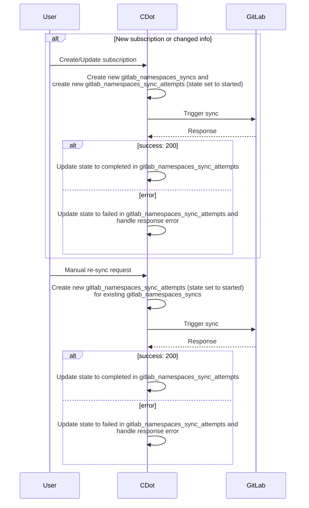
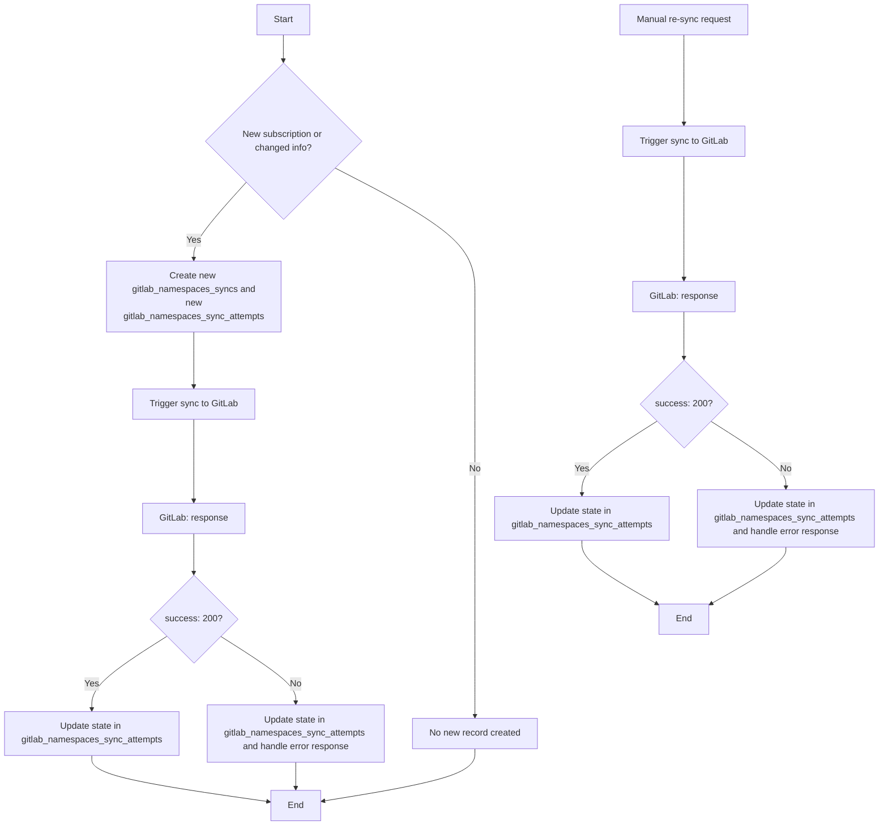
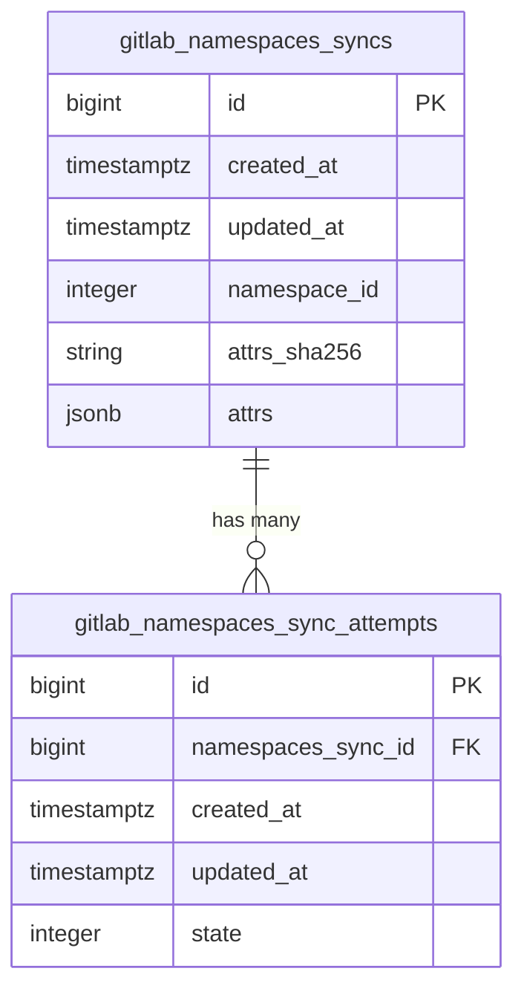
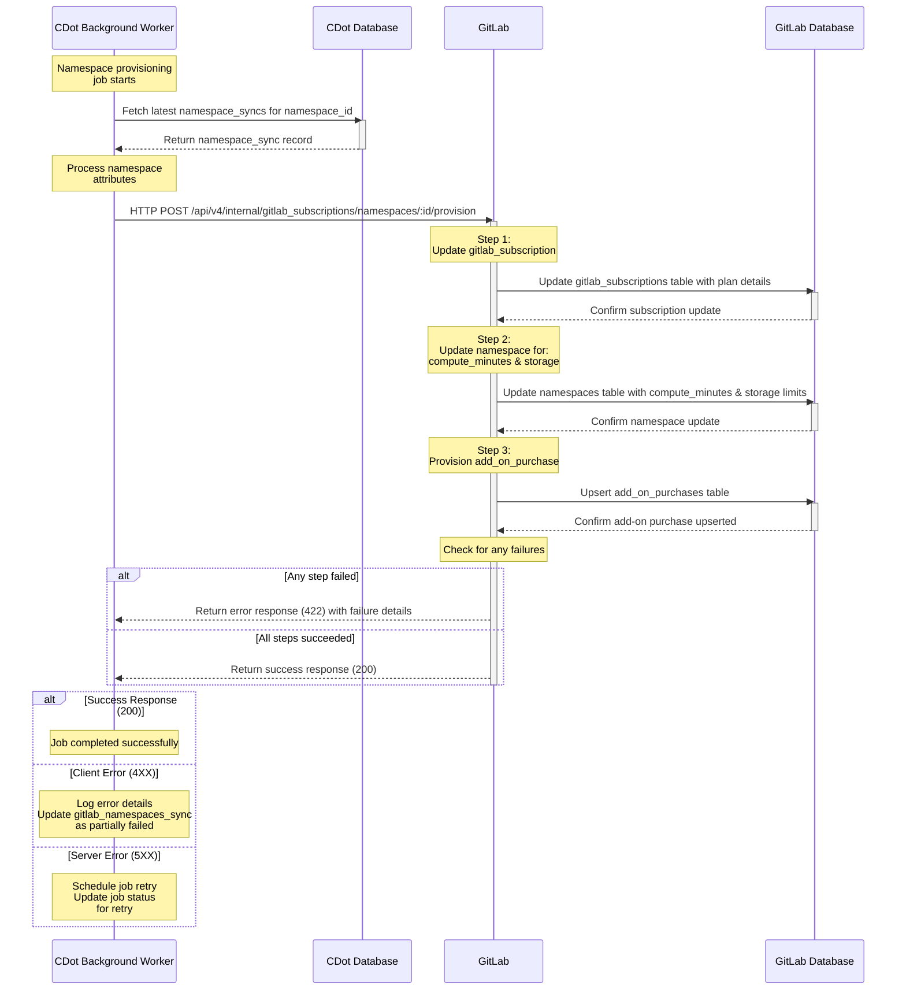



## Summary

As a part of aligning provisioning between Self-Managed/Dedicated and GitLab.com, we are restructuring the way provision for namespace works on GitLab.com.

## Motivation

The work for this will align the provisioning for GitLab.com closer to the way Self-Managed/Dedicated is provisioned.

For `GitLab.com`, we will record the params generated for the `Namespace` provisioning on a new `gitlab_namespaces_syncs` table, along with each attempt for a sync and the result status via a `gitlab_namespacess_sync_attempts` table. This is similar to the way we handle `Licenses` for `Self-Managed` and results in bringing both provisioning processes closer.

## Goals

The goal of this blueprint is to produce:

- an architectural design on how the namespace will be provisioned via the new process
- an iteration plan to achieve the chosen design

## Proposal

We want to create a new table `gitlab_namespace_syncs` that will hold the records for the generated `namespace` provision params. A `gitlab_namespaces_sync` record will have many `gitlab_namespaces_sync_attempts` that will log the status of `gitlab_namespaces_sync`. The states can be `[started, failed, skipped, completed]`.

Whenever a `gitlab_namespaces_sync` record is created, it will always have an associated `gitlab_namespaces_sync_attempt` record with `started` state. We will then make an **internal HTTP request** to `GitLab` to provision the namespace with the associated `params`. The `params` will have provision information for all the resources to be provisioned: `[base_product, compute_minutes, storage, add_on_purchases]`. See the [API Contract](#api-contract) for more information. During the provisioning to `GitLab`, provision to other resources is continued even if any of the resources provisioning fails. For instance, if the `Compute Minutes` resource provisioning fails, provisioning for the `Storage` and `AddOnPurchase` resources is continued.

Based on the response of the provision sync, we will update the state of the `gitlab_namespaces_sync_attempt` record. The status will be updated to `completed` for a `200 OK` response, and `failed` for any other.

Based on the failed response code we will perform further action:

- `5XX` : This is a `Server` error and the sync will be retried a few times
- `4XX` : This is a validation error and will be related to the params generation by the `Client`. We will log it and investigate on case by case basis.

## Iteration 1

For Iteration 1, following are the `Sequence Diagram`, `Flow Chart`, `Database Table` and `Internal API` we plan to implement on `CustomersDot` and `GitLab`.

### CustomersDot (CDot) Side

#### Sequence Diagram



#### Flow chart



#### Database



### GitLab.com side

#### Sequence diagram



#### API Contract

A new internal endpoint will be created on `GitLab` that will do full provision of the namespace.

`POST /api/v4/internal/gitlab_subscriptions/namespaces/:id/provision`

The endpoint will accept following JSON body structure:

```json
{
  "provision": {
    "base_product": {
      "plan_code": "string_value",
      "start_date": "2023-06-01",
      "end_date": "2024-05-31",
      "seats": 100,
      "max_seats_used": 90,
      "trial": false,
      "trial_starts_on": "2023-07-01",
      "trial_ends_on": "2024-07-01",
      "auto_renew": true
    },
    "compute_minutes": {
      "shared_runners_minutes_limit": 50000,
      "extra_shared_runners_minutes_limit": 10000,
      "packs": [
        {
          "purchase_xid": "purchase_1",
          "number_of_minutes": 5000,
          "expires_at": "2023-12-31"
        },
        {
          "purchase_xid": "purchase_2",
          "number_of_minutes": 5000,
          "expires_at": "2024-06-30"
        }
      ]
    },
    "storage": {
      "additional_purchased_storage_size": 1000,
      "additional_purchased_storage_ends_on": "2024-05-31"
    },
    "add_on_purchases": {
      "duo_pro": [
        {
          "quantity": 100,
          "started_on": "2023-06-01",
          "expires_on": "2024-05-31",
          "purchase_xid": "purchase_123",
          "trial": false
        }
      ],
      "duo_enterprise": [
        {
          "quantity": 100,
          "started_on": "2023-06-01",
          "expires_on": "2024-05-31",
          "purchase_xid": "purchase_123",
          "trial": false
        }
      ],
      "product_analytics": [
        {
          "quantity": 100,
          "started_on": "2023-06-01",
          "expires_on": "2024-05-31",
          "purchase_xid": "purchase_123",
          "trial": false
        }
      ]
    }
  }
}
```

##### Response

1. `200` : Successful Request
1. `400` : Bad Request
1. `401` : Unauthorized Request
1. `404` : Namespace not found
1. `422` : Unprocesssable Entity
1. `500`: Server Error
