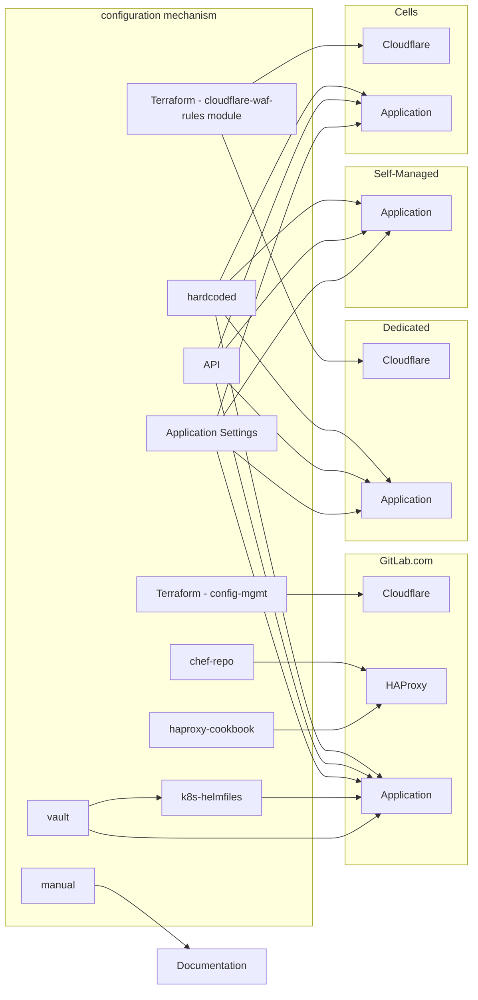
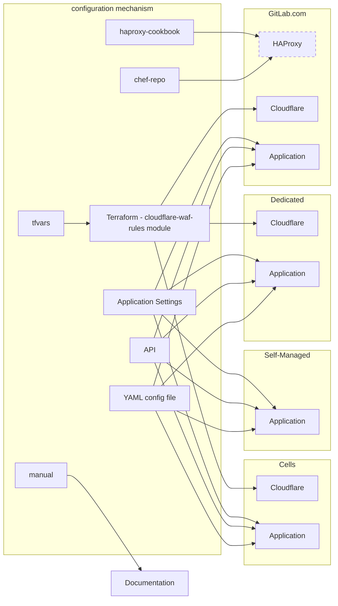
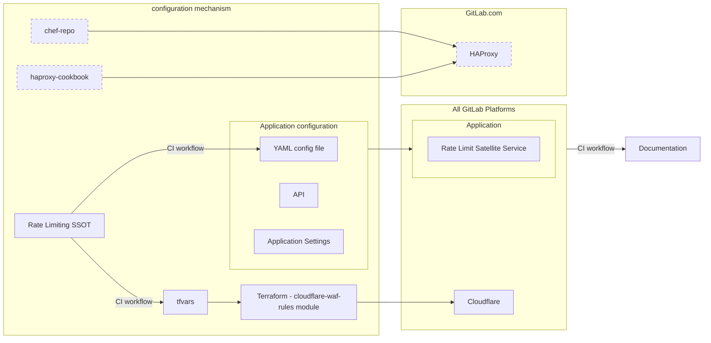

---
# This is the title of your design document. Keep it short, simple, and descriptive. A
# good title can help communicate what the design document is and should be considered
# as part of any review.
title: Simplifying Rate Limiting Configuration
status: ongoing
creation-date: "2024-09-24"
authors: [ "@sarahwalker", "@donnaalexandra" ]
coaches: [ "@andrewn" ]
dris: [ "@donnaalexandra", "@sabrams", "@swiskow" ]
owning-stage: "~devops::platforms"
participating-stages: []
# Hides this page in the left sidebar. Recommended so we don't pollute it.
toc_hide: true
---

<!-- Design Documents often contain forward-looking statements -->
<!-- value gitlab.FutureTense = NO -->

<!-- This renders the design document header on the detail page, so don't remove it-->


## Summary

As GitLab.com has evolved, we've introduced rate limits and throttling measures at many layers to enhance security and performance of our platform, ensuring availability and user satisfaction are at a desired level. These measures have often been reactionary, and we have not had a consistent strategy for defining and enforcing these limits.

This lack of consistency can lead to confusion for our users and loss of productivity for our engineers, as well as difficulty when we wish to define and implement new limits. This Design Document aims to introduce a transparent strategy for these limits; firstly in order to enable our engineers to introduce sensible policies to enforce our availability goals, and secondly allow us transparency to expose these to our users.

With the introduction of [Cells](../cells/), we are taking a proactive and iterative approach to simplifying how we define and manage our rate limits at all layers going forward.

This document is intended to define iterative steps that support the existing [Next Rate Limiting Architecture](../rate_limiting/) which focuses on Application limits, and builds on this to encompass edge network limits.

## Motivation

Presently the [Rate Limiting for GitLab.com](../../../infrastructure/rate-limiting/) is defined in several different places and in many different ways. This creates a number of challenges for our customers and team members alike.

Firstly, the spread of places rate limits exist can make it difficult to understand which limits have been applied to a request. This leads to confusion for our users and productivity loss for our support engineers and production engineering teams. Finding which limits have been applied can require investigation into several tools and codebase audits, since it is not always clear where a limit has been reached (for example in Cloudflare or the GitLab Application).

Secondly, it can be difficult to change or introduce new limits, and as such define policies for protecting our availability. As different limits are enforced in different places, there is no single way to change them for a namespace / project / user / customer.  This has led to inconsistencies when new services are deployed, further adding to the confusion of which limits are applied to a request, or can mean services are deployed without any rate limiting at all. Introducing throttling after a service or an API is deployed can come with risks, as it can cause unexpected interruptions to customers.

Finally, we have historically allowed rate limit bypasses for some marquee SaaS customers, which increases risk for our platform and those customers while being difficult to manage long-term. We would like to be able to set higher limits to allow us to protect our availability while also providing user satisfaction to those customers.

As GitLab.com transitions to a Cells architecture, we have a unique opportunity to create a single source of truth for our rate limits. In the longer term we will work towards a centralised location for rate limits to be configured with sensible defaults, that also allows for customisation for a namespace / project / user / customer as needed. This will also provide a benefit of easily documentable and discoverable rate limits that we can publish to our users.

### Current Rate Limiting Configuration Methods

This diagram is intended to illustrate the complexities in managing our rate limits today across each layer of our stack, and across each of our product offerings.

### Technical Roadmap

This initiative focuses on enabling us to improve the performance, stability, and scalability of GitLab through making rate limiting configuration easier to manage, and reducing the cognitive overhead of needing to investigate what rates limits are configured, and where (as illustrated above). This has been seen as a common pain point across Engineering and Support, therefore focusing on iterative improvements we can make to this configuration will put us in a more secure position.

Additionally, the proposed architecture encourages the development of a single, strategic cross-application method for consistent rate-limiting, over multiple siloed and piecemeal implementations, which only add to complexity and cognitive overhead for GitLab team members and customers.

### Goals

Simplify rate limiting across the GitLab ecosystem.

- Support the ability to configure rate limits in version control.
- Introduce a process for defining new rate limits.
- Introduce a set of "default" rate limits for new services, and enforce limits on deployment of new services in an automated way.
- Simplify tweaking of limits for production engineers (for instance during an incident).
- Create transparency for team members and our customers to understand where requests are being limited and why.

#### Goals for each phase

- **Phase 1:** Consolidate the infrastructure rate limit configuration for limits and allow-listing in one centralized place.
- **Phase 2:** Consolidate the application rate limit configuration in one centralized place.
- **Phase 3:** Provide a rate limiting interface to make managing configuration and publishing limits easier.

### Non-Goals

- To re-implement Cloudflare or Rack Attack or a throttling service - this is meant to be an interface for consolidating and defining limits, as an abstraction not a throttler.

## Proposal

Modify GitLab's existing rate limiting architecture to support passing in rate limiting configuration files, and once this is supported create an interface to simplify the configuration and management of these limits across environments.

### Phase 1: Simplify our edge network and bypass configuration

- **Phase 1.1: Manage IP-based rate limiting bypasses in one location**
  - Migrate [bypass header logic](https://gitlab.com/gitlab-cookbooks/gitlab-haproxy/-/blob/65f8adc65b62db74714bd53dd48a50f7d9cfede3/templates/default/frontends/https.erb#L49) out of HAProxy and into Cloudflare.
  - Cloudflare custom rules support [transform-rule](https://developers.cloudflare.com/rules/transform/) actions which should make this possible.
- **Phase 1.2: Support passing in a configuration file for Cloudflare rules**
  - Migrate [Cloudflare rules](https://ops.gitlab.net/gitlab-com/gl-infra/config-mgmt/-/blob/main/environments/gprd/cloudflare-rate-limits-waf-and-rules.tf) to use the [cloudflare-waf-rules](https://ops.gitlab.net/gitlab-com/gl-infra/terraform-modules/cloudflare/cloudflare-waf-rules/-/tree/main?ref_type=heads) Terraform module.
  - Use [terraform-vars](https://registry.terraform.io/providers/terraform-redhat/rhcs/latest/docs/guides/terraform-vars) to manage configuration of these rules.

### Phase 2: Simplify application level configuration

At this point, this proposal refers to the framework mentioned in the [Next Rate Limiting Architecture](../rate_limiting/#framework-to-define-and-enforce-limits) by introducing a mechanism to define limits in a structured way, making sure that our existing code-paths utilise that framework to enforce limits.

- **Support passing in a configuration file for RackAttack throttles**
  - Some are configurable, some are hard coded [[source](https://gitlab.com/gitlab-org/gitlab/blob/master/lib/gitlab/rack_attack.rb#L85)].
- **Support passing in a configuration file for ApplicationRateLimiter throttles**
  - Some are configurable through Application Settings UI, some through the API, some are hard coded [[source](https://gitlab.com/gitlab-org/gitlab/-/blob/master/lib/gitlab/application_rate_limiter.rb#L17)].
- **Support the ability to pass in configuration file for all application limits**
  - There are seven different types of application limits (if you count RackAttack and ApplicationRateLimiter separately), we eventually want to be able to configure these through the same configuration mechanism.
  - See [this note](https://gitlab.com/gitlab-com/gl-infra/scalability/-/issues/3775#note_2121412201) (confidential) for the full list of limiting implementations.
- **Support configuring limits across services outside the GitLab-rails application**
  - Some services are deployed with [Runway](https://docs.runway.gitlab.com/), and should support a standardized rate limiting configuration mechanism.
    - See the issue around rate limiting Runway services [here](https://gitlab.com/gitlab-com/gl-infra/platform/runway/team/-/issues/28).
  - Further research will need to be done to account for services deployed outside of Runway.

### Phase 3: Implement a Rate Limit Interface

Create a Rate Limiting interface for configuration of rate limits across all parts of GitLab.com and Cells. While this interface will not be responsible for enforcing limits (throttling will still take place in Cloudflare, or the application itself, for example), it will provide a consolidated catalogue of limits, as well as providing a mechanism to override any limits per Namespace. To provide this single source of truth, any new throttles that get added need to be reflected in the catalogue with their default values. If these default-limits are implemented in the application, this means that the value in the catalogue is what packages for self-managed will ship with.

The Rate Limiting Single Source of Truth (SSOT) should focus on configuring rate limiting rules and thresholds in an abstracted manner regardless of the mechanism that is used to apply these rules to the underlying systems. For example, this might look like a well-defined YAML file and schema, defining Rate Limiting from GitLab’s domain-specific-view (customers, organizations, cells, features, etc), rather than directly as transport semantics (eg, endpoints and HTTPS). This definition can then be transformed into Cloudflare, GitLab Application (or even as-yet-undetermined future technologies) as configuration through the use of CI workflows and supporting scripts.

In practice, what this might look like:

1. A new rule is merged into to the Rate Limit Source of Truth, producing a new version.
1. An automation raises a corresponding MR to update the rate limiting configuration in the respective repositories.
1. Upon merge the new limits are applied using configuration that will apply to Cloudflare or loaded into the GitLab Application.
1. A CI workflow run will parse and update the rate limit thresholds in our documentation.

**Note:** the specifics about this implementation are subject to change, as we progress through the first two phases and learn more.

## Pros and Cons

### Pros

- Consolidation of the definitions of our limits into one place. This will streamline creating or changing any rate limits.
- The catalog can be pumped into documentation and published. Changes here will be reflected in docs and streamline the documentation process, creating more transparency for users and keeping documentation up to date.
- We are not rewriting throttling functionality, and will keep our defense in depth model of rate limiting at different layers of the product.
- We can build this to enable customisation of rate limits per namespace / project / user / customer.
- This paves the way for making it easier for support to identify which limit a customer is hitting: because all limits are defined in a single place, we could let the application advertise an identifier of the rule that is causing the request to be limited.

### Cons

- Not all application rate limiting configuration is currently exposed through an API. We will need to work with product / backend engineers to implement the Application level changes.

## Considerations

### Is the scope of this the existing GitLab.com or Cells?

Both! Anything we create needs to support making management of rate limiting simple across the existing GitLab.com and the Cells architecture, as it's likely they will run in parallel for the duration of these improvements, and we don't want to limit ourselves to only making improvements for the future.

Improvements to support the configuration of using actors such as customers, organisations, and namespaces will be essential to ensure any improvements made to rate limiting configuration will work across Cells.

### Setting Cloudflare Rate Limits

GitLab.com, Cells, and Dedicated all utilise Cloudflare at the edge of our network. We can modify the configuration for GitLab.com to use the [Cloudflare WAF Rules Terraform module](https://gitlab.com/gitlab-com/gl-infra/terraform-modules/cloudflare/cloudflare-waf-rules). Since this was built to be extensible, we can leverage this to simplify our configuration, and provide a quick win and proof of concept for this concept.

### Setting Application Rate Limits

Rate Limit configuration within the application will be slightly more difficult. At present these limits are configured within the Rails app, some of which have an API but not all of them. Going forward, we should enforce that all limits are configured and managed in the same way, whether that be through an API, or configuration files. Implementing [the framework](../rate_limiting/#framework-to-define-and-enforce-limits) outlined in the Next Rate Limiting Architecture design document will help us set this direction.

### Publishing Rate Limits

One advantage of having all rate limits declared in YAML in a centralized source of truth for limits that are imposed on requests to GitLab.com. This YAML can be parsed then published to our documentation or handbook, allowing for greater transparency for our users. An added bonus is that any changes to the service would automatically update our documentation, and save manual updates needing to be published.

### Confidential Rate Limits

When implementing the rate limiting interface and surfacing rate limiting rules and thresholds in documentation, we need to introduce a mechanism to keep some of the configuration [SAFE](../../../../legal/safe-framework/), in cases such as bypasses and rules introduced to protect us from malicious actors. In these cases, the configuration can be considered confidential as some of the rules may contain customer IP addresses, or details pertaining to the nature of an attack we are protecting against.

### New Services

When new services are added to GitLab.com, sometimes they are created without rate limits, and it can be hard to add limits in after the fact without impact to users. Any new services created should also be added to our Rate Limit Interface. We would add this as a step to the Production Readiness check, and set suggested defaults for rate limits for new services.

### Runway

[Runway](https://docs.runway.gitlab.com/guides/onboarding/) enables engineers to streamline the deployment of projects outside of the main GitLab codebase. Anything that we create should take into account how we might integrate with Runway as part of ensuring these services automatically have rate limits configured when created.

### Self-Managed

Any of the improvements we make to the GitLab Application will need to work with Self-Managed instances, which if we make modifications to the Application limits to support configuration files, then self-managed customers should be able to benefit from these improvements.

### Dedicated

The Cells architecture is based on Dedicated tooling, and with improvements being made to utilise the Cloudflare WAF module, that lays the foundations for supporting improvements here too.

### Cloud Connector

[Cloud Connector](../../../infrastructure/rate-limiting/#cloud-connector) rate limits are configured in Cloudflare to throttle the consumption of non-horizontally scalable resources such as AI vendor limits. As part of Phase 1 to simplify our edge network configuration, we'll need to ensure Cloud Connector rate limits are included in these improvements.

## Alternative Solutions

During the proposal phase of this design document we have had a lot of excellent discussions, many of which may lead to scope creep were we to include them as part of the proposal, however are important to capture for posterity.

### HAProxy versus Cloudflare

Cloudflare is consistently used for GitLab.com, Dedicated, and Cells. Therefore, focusing on moving any existing configuration out of HAProxy and into Cloudflare will immediately be an improvement on our existing configuration.

Note: Some services, such as Pages and Registry still rely on HAProxy as they are not routed through Cloudflare.

### Building a rate limiting service using Cloudflare workers

The [HTTP Routing Service](../cells/http_routing_service/) was considered as a potential place to house this rate limiting implementation, as it was thought that it would be application-aware. However the HTTP Router (Cloudflare worker) doesn't provide any additional intelligence over what we already have with our existing Cloudflare setup, as it will be reading the headers and path to make a routing decision, so this will not gain us any benefit over the existing rate limit architecture.

### Rate Limits per Cell

An idea had been proposed around introducing rate limits on a per Cell basis, however, this is not a sustainable solution. For example, if we were to introduce a higher rate limit threshold for one cell based on a customer's need, then if that customer were moved to a different Cell at a later date, it's possible the rate limit configuration could be missed, or become outdated. Therefore tying rate limit configuration on a per Cell basis is not the direction we are proposing to go.

Instead, we should focus on rate limits on a per organization, project, or namespace level.

The [HTTP Router configuration for Cells](https://gitlab.com/groups/gitlab-org/-/epics/12775) means that the existing GitLab.com Cloudflare rules will automatically apply across all Cells.

#### Cell Reference Architecture

The reference architecture/ size of a Cell will likely be smaller than the existing GitLab.com platform, therefore we should probably consider introducing different maximum rate limits based on this reduced capacity.

### Organization IDs in URLs

A potential future improvement that is out of scope of this initial proposal would be to include organization IDs in URLs as query parameters. If we were to do this, then that would enable us to introduce organization based rate limits at the Cloudflare layer, rather than needing to implement these rules as Application rate limits.

### Breaking Authentication and Authorization out of the Application

One future forward thought was to break AuthN and AuthZ out of the GitLab application and into their own service. If we were to do this, we could implement a quota or rate-limit service as a bundled feature or supplementary service. If we were to do this, we could utilise a combination of our API Gateway (whether that is HAProxy or a more modern cloud-native gateway) and utilise the authentication service to enforce the most specific rate limits at the gateway level before they reach the rest of the GitLab application.
