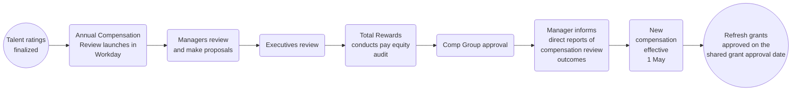

## Introduction

On this page, we explain how we carry out the Annual Compensation Review (ACR) cycle.

If you have any feedback or questions about Annual Compensation Review, please contact [HelpLab](/handbook/business-technology/enterprise-applications/guides/helplab-guide).

## Annual Compensation Review

The purpose of the Annual Compensation Review is to provide managers with the opportunity to reflect on team members' accomplishments, measure achievements against goals, and reward for demonstrated performance and growth potential.

Compensation decisions are based on:

1. Individual factors such as talent assessments outlining performance and growth potential in the role.
1. Internal assessment of our roles and compensation within teams and departments
1. Assessing external market changes in the [compensation calculator](/handbook/total-rewards/compensation/compensation-calculator/) inputs
1. Other factors includes company performance and available budget, local pay practices and regulations, and eligibility as outlined below

### Process overview

### Eligibility

Eligible team members for Annual Compensation Review have a hire date on or before:

- January 31st to be eligible to participate in the merit review program
- October 5th to be eligible to participate in the equity refresh program

Team members on leave will be eligible to receive an annual compensation and/or promotion increase during the GitLab-paid portion of their leave. If a team member is not receiving pay from GitLab, then they'll be eligible to receive the increase when they return to work.

Team members hired after the cutoff date will be reviewed to ensure their salary does not fall below the minimum of the compensation range. Team members may be below the compensation range due to updates to the range for the upcoming year that would include changes to benchmark, location factor, and/or exchange rate, if applicable. If this does occur, the team member will be adjusted to the minimum of the range during the Annual Compensation Review cycle.

Additionally, Team Members who receive a promotion as part of the Q1 FY26 Promotion Cycle (effective February 1st) will be eligible for the Annual Compensation Review process (including merit and equity).

Eligibility for review does not guarantee an increase will be awarded. Awards are recommended in alignment with team members’ contributions to the organization (as assessed during Talent Assessment) as is aligned to our pay-for-performance philosophy.

### Budget

Our annual cash compensation review budget for FY26 is funded at 3.5% of overall payroll. This budget is in line with the FY25 cycle.

#### Merit 

Merit budget will be allocated for all planning managers, which will consist of budget for performance increases as well as market adjustments, if applicable. Each division leader is responsible for making sure their group stays within budget.

If you are a manager with other managers reporting to you, you will see your overall budget including any budget that rolls up into you in the Organization Summary screen. The overall budget will also reflect when reviewing the planning grids for managers that report to you. When you edit your own planning grid, it will show you the budget for just your direct reports.

#### Equity

Equity refresh budget will be held at the Dir+ level. Managers below the Director level will not have an equity budget nor will they be able to plan for equity on the Stock tab in Workday. Managers should discuss recommendations for equity awards with their Directors to help inform recommendations as appropriate.

### Annual Compensation Review Timeline

*2025-03-10 - 2025-03-26:* Managers complete merit and equity recommendations

We recommend these general timelines for completion based on your level to enable department heads to review and finalize recommendations by the deadline.

- E-Group Skips and below (e.g. Managers, Sr. Managers, Directors, Senior Directors that report into E-Group direct reports): 2025-03-10 to 2025-03-13 EOD PT
- E-Group Directs (e.g. Senior Directors, VPs that report directly into E-Group leaders): 2025-03-14 to 2025-03-18 EOD PT
- E-group review/approval: 2025-03-20 to 2025-03-26 EOD PT

Additional due dates and touchpoints in the process after the manager review portion closes: 

*2025-03-26:* E-Group submits ACR pay recommendations for their respective departments

*2025-03-27 to 2025-03-28:* Total Reward conducts pay equity review

*2025-03-31 to 2025-04-01:* E-Group to review and action on pay equity review

*2025-04-02 to 2025-04-07 :* Total Rewards prepares for Comp Group (CEO/CFO/CPO) approval of all recommendations

*2025-04-09:* Comp Group approves all recommendations

*2025-04-17 - 2025-04-30:* Managers communicate talent assessment and compensation decisions to all impacted team members

*2025-05-01:* Workday visibility date (new comp visible to team members)

For information on the grant approval date and vesting schedule, please refer to the [RSU Grant Cadence & Vesting deck](https://docs.google.com/presentation/d/1a3iisaLdoMFdujTyh9K2gYB2eOTi1xC2Ul7ycj7HkSg/edit#slide=id.g26201d4deb6_0_1).

## Important Materials for Review

The following materials are recommended for managers to review ahead of planning:
        - [Workday Job Aid (internal only)](https://docs.google.com/document/d/1hGBHZHa_Lg7XVHTKX2eeqL88QONmF09Wxhz8w4hlVQE/edit?tab=t.0): Please utilize the job aid for instructions on how to access and use the planning tool in Workday.
        - [Information Guide for Managers (internal only)](https://docs.google.com/document/d/14zZYaDTpCKqjliKnEbfAJCE5ZZGYZsqXBXEgsTFEE8s/edit?tab=t.0): The information guide provides additional detail to what has been provided in the handbook.

## Annual Compensation Review Guidelines

Managers should consider both cash and equity when determining a competitive total compensation package for their team members. The below guidelines are recommendations on how to allocate cash and equity to team members based on their [Talent Assessment ratings](/handbook/people-group/talent-assessment/#the-performancegrowth-potential-matrix).

### Merit

Recommendations for cash compensation increases are based on performance factors in order to reinforce our pay-for-performance philosophy. The following recommendations are guidelines, not guardrails:

- Developing: 0% increase
- Performing: 2% to 5% increase
- Exceeding: 4% to 8% increase
- Too New To Rate: 0% to 4%

**Actual cash compensation increases may vary up or down from these percentages.** These guidelines are meant to help ensure company-wide consistency.

Actual increases may vary based on:

- [Market adjustments](/handbook/total-rewards/compensation/compensation-review-cycle/#market-adjustments) to ensure a team member is in range based on the refreshed FY26 compensation ranges
- Where a team member falls in their compensation range and whether they are already [competitively placed](/handbook/total-rewards/compensation/#competitive-rate) in their range for their role, level, and location
- Previous increases
- Internal equity
- Budget

When determining an increase, managers should holistically review the following factors:

- Promotions in the last fiscal year
- Transfers in the last fiscal year
- Recent hire who is already aligned to market/performance rates
- Compensation changes due to relocations
- How team members fall within their band after the proposed increase compared to their peers
- Mandatory or Statutory increases the team member received in the previous year

Additional justification is required in the following situations:

- Increases above guidelines (excluding market adjustments) should have a few sentences on why to assist higher level planners.
- If a manager would like to allocate an increase to a team member who is paid over the maximum of their range or whose 
increase will bring them above the maximum of the range, they will need to include a few sentences of justification on why.

Team members who aren’t receiving an increase or their increase is being delayed due to not performing at their current level should have that clearly communicated.

### Market Adjustments

The increase based on performance factor should be added to the team member’s market adjustment, if applicable, when recommending the final increase. The market adjustment is required to be allocated to all eligible team members without performance concerns.

Managers of team members receiving a market adjustment have received additional budget to fund their team’s market adjustment. The amount of the market adjustment will be specified in the Notes column of the Merit tab.

If there are any reasons as to why a team member should not receive the proposed increase to be aligned with market rates in our calculator, please work with your People Business Partner on appropriate next steps.

### Equity

The growth potential factor is used as the primary calibration tool for equity refresh grants. A meaningful grant can reinforce the long-term growth potential of a team member, as well as the value of shared ownership in the Company.

Planning for equity grants will be done at the Director level and above.

In calibrating the equity refresh, we recommend managers to take the following into account:

- [Growth Potential factor](/handbook/people-group/talent-assessment/#what-is-growth)
- Performance rating
- Key Talent
- Unvested Equity Holdings
- Equity Holdings Vesting in the next 12 months

When determining which team members to allocate an equity refresh grant, managers should avoid the “peanut-butter approach” and differentiate grant size based on team members’ performance and growth potential, zeroing in on team members with a high impact on the team and company’s results. Managers should ensure Key Talent is well positioned against their refresh range and target an overall participation rate of 70 - 75%.

The following equity refresh grant *guidelines* are recommended for those receiving a grant based on the team member’s growth potential rating:
     - Developing is not funded
     - Growing is targeted between the minimum and midpoint of the range
     - Exceeding is targeted between the midpoint and maximum of the range
     - Too New to Rate is targeted between the minimum and midpoint of the range
     - Key Talent is targeted between the maximum and 2x the maximum of the range

### Pay Equity Review

The Compensation team will conduct a pay equity review once at the conclusion of the Annual Compensation Review cycle to review any statistically relevant bias for underrepresented groups. This is done utilizing the pay equity platform, [Syndio](https://synd.io/). 

Results of the pay equity review will be reviewed by the E-group leader before being actioned.

## Communicating Annual Compensation Review

All planning for Annual Compensation Review will be finalized by March 4th in Workday. Visibility in Workday will be limited until May 1st in order to allow managers sufficient time to communicate. Managers will have access to the Total  Compensation statement on the team member's record once generated.

Managers should communicate increases to all team members by April 30th.

Further guidelines on communications can be found on the [Compensation Review Conversations handbook page](/handbook/leadership/compensation-review-conversations/).

### Total Compensation Statement

Each team member who receives a total compensation increase due to performance, market adjustment, or equity refresh grant during the Annual Compensation Review cycle will receive a Total Compensation Statement detailing their updates to total compensation. This statement will be available for managers to review in Workday no later than April 17th, and team members can access their total compensation statement beginning May 1st.

Specific information on the Total Compensation Statement will be shared closer to the launch of statements.
