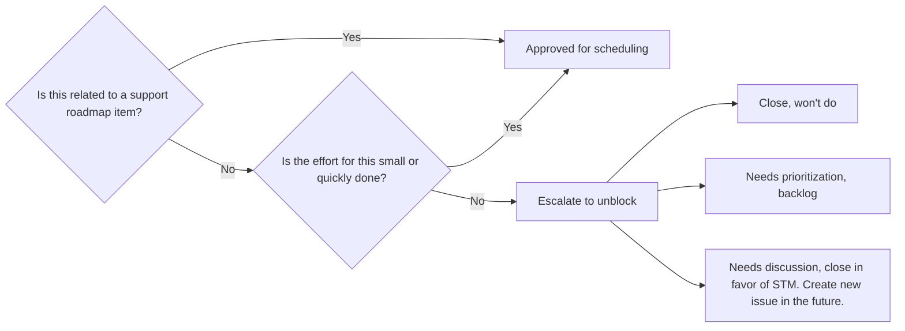
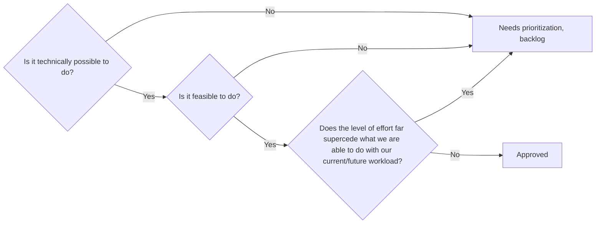

## Purpose

The purpose of Customer Support Operations is to enable GitLab to provide delightful customer experiences by:

- equipping the Customer Support team with knowledge, tools and data to optimize productivity and efficiently solve customer problems.
- equipping our customers and wider GitLab with the data, knowledge and insights to prevent customer problems before they occur.
- delivering delightful experiences to both our own internal and external customers.

*Our purpose statement is re-evaluated as needed, at minimum every 3 years*

## Meet the team

| Name | Role |
|------|------|
| [Steve Manzuik](https://gitlab.com/smanzuik) | Senior Director, Security |
| [Lyle Kozloff](https://gitlab.com/lyle) | Sr. Manager, Customer Support Operations |
| [Jason Colyer](https://gitlab.com/jcolyer) | Fullstack Engineer, Customer Support Operations |
| [Nabeel Bilgrami](https://gitlab.com/nabeel.bilgrami) | Customer Support Operations Specialist |
| [Alyssa Villa](https://gitlab.com/avilla4) | Customer Support Operations Specialist |
| [Dylan Tragjasi](https://gitlab.com/dtragjasi) | Customer Support Operations Specialist |
| [Sarah Cole](https://gitlab.com/Secole) | Customer Support Operations Specialist |
| [Rene Verschoor](https://gitlab.com/rverschoor) | Customer Support Operations Specialist |

## Working with us

- [Use this template if you want something new or modified](https://gitlab.com/gitlab-com/gl-security/corp/cust-support-ops/issue-tracker/-/issues/new?issuable_template=Feature)
- [Use this template to file a bug report](https://gitlab.com/gitlab-com/gl-security/corp/cust-support-ops/issue-tracker/-/issues/new?issuable_template=Bug)

Or you can reach out to us in Slack via [#support_operations](https://gitlab.enterprise.slack.com/archives/C018ZGZAMPD).

## Basic issue flow

### Bug Reports

The issue will be created in the `Triage` stage. From here, Customer Support Operations will validate the bug (if it is invalid, the request will be closed).

If it is valid, it will then move to the `Design` stage (with all approvpriate labels put in place), where a gameplan will be made.

Once a gameplan is made, it will jumpt to the `Development` stage, where the changes will be made.

Once it is ready for review, it will move to the `Validation` stage, where the reqeuster (or someone they delegate this to) will validate the changes fix the bug (if they do not, it moves back to the `Development` stage).

Once validated, it will then be implemented into production. Once that is done, the issue will move to the `Completed` stage (and be closed out).

### Feature requests

The issue will be created in the `Triage` stage. From here, Customer Support Operations will determine if the request has enough information to move onto next stages (if not, we will ask for more information).

Customer Support Operations will then determine if the request is valid in our current workload. This is done using the following flowchart:

If approved, it will then move to the `Design` stage (with all appropriate labels put in place), where a gameplan will be made.

Once a gameplan is made and added to the issue, Customer Support Operations will determine if we can move forward with the request using the following flowchart:

If approved, it will then move to the `Planning` stage. Here, Customer Support Operations will determine when it can be implemented. After that is decided, a milestone will be added to the issue (which indicates the period the work will be done in).

Once the milestone period arrives, the issue will move to the `Development` stage. Here, work will be done to get the changes into a state where they can be validated.

Once they are ready to be validated, the issue moves to the stage `Validation`. Here, the requester will validate the changes done will meet their requirements for the request. If they do not, the stage moves back to `Development`.

If validated by the requester, Customer Support Operations will then finalize the changes into the various systems (be it via MRs, settings changes, etc.).

Once all that is done, the stage moves to `Completed`, where the issue is closed out.
