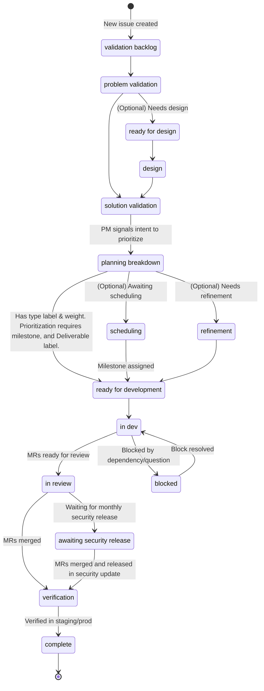

Please follow this [guidance](#contributing-to-this-page) on how to contribute to this page. <!-- To see a list of the latest updates to this page, visit [Product development flow releases](/handbook/product-development/product-development-flow/releases). -->

## Overview & philosophy

GitLab's product mission is to consistently create products and experiences that users love and
value. To deliver on this mission, it's important to have a clearly defined and repeatable flow for
turning an idea into something that offers customer value. Note that it's also important to allow
open source contributions at any point in the process from the wider GitLab community - these won't
necessarily follow this process.

This page is an evolving description of how we expect our cross-functional development teams to work, and reflects the current workflow being leveraged. All required actions or outcomes in this page are denoted as follows:

> <i class="fab fa-gitlab fa-fw" style="color:rgb(252,109,38); font-size:1.25em" aria-hidden="true"></i> Denotes a required aspect of the product development flow.

Feature development is expected to pass through all phases to achieve specified outcomes, while the rest of the workflow should be considered as a set of best practices, tools, and recommendations. We realize there are unique cases in which certain product improvements may not need to flow through all the phases. We trust product managers to use their best judgement with alignment from their design and engineering team. The goal of this page is to support teams in their workflows by highlighting the necessary **outcomes** to target in each phase as well as sharing strategies/tactics, **activities**, teams can employ to achieve these  outcomes. Additionally, this page aims to clarify the *minimal* set of required actions, such as labels, needed across all phases to keep the product system efficient in terms of tracking, searching and cross-functional collaboration. To maintain clarity and avoid confusion, we do not list optional actions on this page but teams may choose to employ additional actions, such as labels for planning, even if they are not mentioned on this page.

As teams leverage the product development flow, they may find that certain strategies/tactics are serving their teams well toward success. Therefore, we welcome MRs to this page, so we can create a robust playbook of options to build valuable features for customers. All team members are encouraged to follow the [change process](#contributing-to-this-page) for this page to share their best practices.

### Measuring Success

We take both a qualitative and quantitative approach to measuring success of the Product Development Flow. Details on the measures and results are available on [this handbook page](/handbook/product-development/product-development-flow/success-metrics/).

## But Wait, Isn't This Waterfall?

No. Although the phases described on this page appear to be independent and linear, they are not. They're presented in this way for simplicity and ease of navigation. At GitLab, we do not promote working in a linear manner. Phases in the product development lifecycle may overlap or occur in parallel.

We aim to achieve key outcomes in each phase in order to de-risk subsequent phases. However, the product development flow doesn't dictate the order we go through the phases, or the time spent in each. When teams have a high confidence in their direction, they should feel empowered to skip or shorten phases that won't contribute to improved confidence.

Examples:

- An engineering team conducts a technical review while other team members are performing Validation Phase activities. The team can then move to the Build phase rapidly with high confidence that their improvement is good for customers and technically feasible.

- A bug is reported by a GitLab customer. The Product Manager tests the bug and confirms its existence (Problem Validation). The team is extremely confident in the solution, so Design and Solution Validation are not needed. The bug is moved immediately to Build.

## Workflow Summary

<object data="/images/product-development-flow/PDF-Diagram.svg" style="width: 100%;" type="image/svg+xml">
  Product Development Flow diagram.
  Unable to load this content, check console for details.
</object>

> <i class="fab fa-gitlab fa-fw" style="color:rgb(252,109,38); font-size:1.25em" aria-hidden="true"></i> We use workflow labels to efficiently communicate an issue's state. Using these labels enables collaboration across teams and communicates an issue's current state.

The workflow labels are prefixed with `workflow::`, such as `workflow::ready for development`. The following diagram shows how a new issue moves to each workflow label, though states can be skipped when appropriate. The rest of this document describes each workflow step in detail.

### Issue descriptions as the Single Source of Truth (SSOT)

> <i class="fab fa-gitlab fa-fw" style="color:rgb(252,109,38); font-size:1.25em" aria-hidden="true"></i> Issue descriptions shall always be maintained as the single source of truth.

It's not [efficient](/handbook/values/#efficiency) for contributors to need to read every comment in an issue to understand the current state.

- Issue description accuracy should be maintained by the DRIs throughout each phase. However all collaborators can and should contribute when they see discrepancies or needed updates.

## Validation track

For situations [when the customer problem isn't well understood](/handbook/product/ux/ux-research/when-to-conduct-ux-research/#design-the-right-thingproblem-validation), Product Managers (PMs) and the User Experience Department (UXers) should work together to validate new opportunities before moving to the Build track. The **Validation** track is an independent track from the always moving **Build** track. PMs and UXers should work together to get at least two months ahead, so that the Build track always has well-validated product opportunities ready to start. Milestone work should be [prioritized](/handbook/product/product-processes/) with the understanding that some milestones may include more validation efforts than others. Validation cycles may not be necessary for things like bug fixes, well understood iterative improvements, minor design fixes, and technical debt.

### Validation Spectrum

The types of activities and depth of research required in the validation track will depend on how well we understand the customer problem and solution.

### Validation Goals & Outcomes

**When:** When our confidence about the proposed problem or solution isn't high. For example, if we aren't reasonably sure that the problem is important to a significant number of users, or that the solution is easy to understand and use.

**Who:** Product Manager, Product Designer, UX Researcher, Product Design Manager, Engineering Manager

**What:**

✅ **Understand** the user problem we are trying to solve.

✅ **Identify** business goals and key metrics to determine success.

✅ **Generate** hypotheses and research/experiment/user-test.

✅ **Define** MVC and potential future iterations.

✅ **Minimize** risks to value, usability, feasibility, and business viability with qualitative and quantitative analysis.

**Outcome:** We have confidence that a proposed solution will positively impact one or more [Product KPIs](/handbook/company/kpis/#product-kpis). There may be reason for exceptions, so the team would need to be clear in that case, and be able to justify that it's still important without mapping back to our KPIs.

If we don't have confidence in the MVC or what success looks like, we should continue validation cycles before we move to the Build track.

### Validation phase 1: Validation backlog

<i class="fab fa-gitlab fa-fw" style="color:rgb(252,109,38); font-size:1.25em" aria-hidden="true"></i> Label: `workflow::validation backlog`

#### Key Participants

| Role          | Function |
|---------------|----------|
| DRI           | Product Manager |
| Collaborators | Product Designer   Product Design Manager   Engineering Manager |
| Informed      | Customers  Customer Success Manager  Product Marketing Manager  Other [stakeholders](/handbook/product/product-processes/#what-is-a-stakeholder) as appropriate |

#### Description

The growth of a world class product is built from a well maintained backlog. Product Managers are responsible for refining a group's backlog to ensure validation opportunities are scoped and [prioritized](/handbook/product/product-processes/#prioritization) in line with category direction, stage, and/or section level strategy. The backlog is also the single source of truth for [stakeholders](/handbook/product/product-processes/#what-is-a-stakeholder) to understand and engage with your group. An issue position in the backlog, along with the description, discussion, and metadata on those issues are key pieces of data necessary to keep stakeholders up to date.

#### Outcomes and Activities

| Outcomes | Activities | DRI |
|----------|------------|-----|
| <i aria-hidden="true" style="color:rgb(252,109,38); font-size:1.25em" class="fab fa-gitlab fa-fw"></i>**Up to date issues and epics**: At GitLab, issues are the single source of truth for any change to the product. Keeping these up to date increases efficiency and transparency by allowing all team members to understand the planned work. | - Create issues in response to a [sensing mechanism](/handbook/product/product-processes/sensing-mechanisms/). Consider using the *Problem Validation* issue template for new features.  - Review issue discussions and update relevant info in the description.  - Keep metadata (such as labels) up-to-date.  - Actively respond to stakeholder comments.  - Transfer discussion notes, and external information to the issue (as links or discussion/description details). | Product Manager |
| <i class="fab fa-gitlab fa-fw" style="color:rgb(252,109,38); font-size:1.25em" aria-hidden="true"></i>**Prioritized backlog**: The issue and epic backlog is the primary signal stakeholders use to know what's "up next" for a group. The backlog is also the queue for a group to work from, as features progress through the Product Development Flow phases. This queue is kept up to date with milestones and rank ordering on issue boards. | - Regular review of issue prioritization (such as issue board ordering and milestone assignment).  - Align prioritized backlog to category direction and category maturity state.  - Consider using the [RICE formula](https://www.productplan.com/glossary/rice-scoring-model/) to help make prioritization tradeoffs. - Consider holding [prioritization sessions](/handbook/product/product-processes/#prioritization-sessions) to collect priority feedback from stable counterparts as there are [other DRIs for bug and maintenance work](/handbook/product/product-processes/). | Product Manager |

### Validation phase 2: Problem validation

<i class="fab fa-gitlab fa-fw" style="color:rgb(252,109,38); font-size:1.25em" aria-hidden="true"></i> Label: `workflow::problem validation`

#### Key Participants

| Role          | Function |
|---------------|----------|
| DRI           | Product Manager |
| Collaborators | Product Designer  UX Researcher |
| Informed      | Development team  Other [stakeholders](/handbook/product/product-processes/#what-is-a-stakeholder) as appropriate |

#### Description

To ensure the right solutions are delivered, the team must start their work with a [validated problem](/handbook/product/ux/ux-research/problem-validation-and-methods). This can take [many forms](/handbook/product/ux/ux-research/problem-validation-and-methods/#foundational-research-methods) and be achieved through Product Manager, Product Designer and UX Researcher collaboration.

If the problem is documented and well-understood, it may be possible to quickly move through this phase by documenting the known data about the user problem. A documented problem can be categorized as a pre-existing experience from feedback directly from users or an issue that has user engagement confirming that the problem is experienced by multiple users. A well-understood problem can be one that has a series of documented qualitative research from customer interviews led by the Product Manager, triangulating [different sensing mechanisms](/handbook/product/product-processes/sensing-mechanisms/) confirming the problem, or using known data. Some examples of known data include [Customer Request Issues](https://10az.online.tableau.com/#/site/gitlab/workbooks/2015827/views) or pre-existing [`Actionable Insights`](/handbook/product/ux/ux-research/research-insights/#how-to-document-actionable-insights) from prior research. To document that a problem is well-understood, link the known data and any customer calls to the relevant issues and epics.

If the problem is nuanced or not yet well understood, then it will likely take longer to validate with users properly. This phase's primary outcome is a clear understanding of the problem, along with a simple and clear way to communicate the problem to various stakeholders. Although optional, it is recommended to use an [Opportunity Canvas](/handbook/product/product-processes/#opportunity-canvas) as a tool that helps individuals better understand a problem, and communicate it to various stakeholders. An Opportunity Canvas can also be used to recommend creation of a new category including asking for new resourcing.

#### Outcomes and Activities

| Outcomes | Activities | DRI |
|----------|------------|-----|
| <i class="fab fa-gitlab fa-fw" style="color:rgb(252,109,38); font-size:1.25em" aria-hidden="true"></i> **Thorough understanding of the problem**: The team understands the problem, who it affects, when and why, and how solving the problem maps to business needs and product strategy. | - Create an issue using the [Problem Validation Template](https://gitlab.com/gitlab-org/gitlab/-/blob/master/.gitlab/issue_templates/Problem%20Validation.md) in the GitLab project.  - Complete an [Opportunity Canvas](/handbook/product/product-processes/#opportunity-canvas).  - Schedule a review of the opportunity canvas for feedback.  - Create an issue using the [Problem Validation Research Template](https://gitlab.com/gitlab-org/ux-research/-/blob/master/.gitlab/issue_templates/Problem%20validation.md) in the UX Research project and work with UX Researcher to execute the research study.  - Validate your problem with users using any of the [proposed methods](/handbook/product/ux/ux-research/problem-validation-and-methods/) and [document your findings in Dovetail](/handbook/product/ux/dovetail/). | Product Manager |
| <i class="fab fa-gitlab fa-fw" style="color:rgb(252,109,38); font-size:1.25em" aria-hidden="true"></i> **Update issue/epic description**: A well understood and clearly articulated customer problem is added to the issue, and will lead to successful and efficient design and development phases. | - Ensure your issue is up-to-date with the latest understanding of the problem.  - Understand and document (in the issue) the goals that people want to accomplish using the [Jobs to be Done (JTBD)](/handbook/product/ux/jobs-to-be-done/) framework.  - Conduct [continuous interviews](/handbook/product/product-processes/continuous-interviewing/) with customers on a regular cadence to stay up-to-date on the problems that users face.  - Leverage your [opportunity canvas](/handbook/product/product-processes/#opportunity-canvas) to communicate the problem to your stable counterparts and group stakeholders. Consider scheduling a review to gather feedback and communicate the findings to Product and UX leadership. - Confirm that the Product Designer understands the problem well enough to ideate on solutions. | Product Manager |
| Initiate the Dogfooding Process: When validating problems, it's important to gather feedback from [internal customers](/handbook/product/product-processes/#engage-with-internal-customers), in addition to the broader community. Capturing internal customer feedback early on in the product development flow helps ensure their needs are considered as the feature matures, accelerating key [Dogfooding](/handbook/product/product-processes/dogfooding-for-r-d/) outcomes. Driving internal usage of features consistently [leads to greater customer adoption](https://about.gitlab.com/blog/2020/04/16/geo-is-available-on-staging-for-gitlab-com/) and is required for [viable maturity](https://about.gitlab.com/direction/#maturity). | - PMs are strongly encouraged to open [Dogfooding issues](/handbook/product/product-processes/dogfooding-for-r-d/) during the validation phase and capture internal customer feedback to help inform initial and/or future iterations of a feature. | Product Manager |

### Validation phase 3: Design

<i class="fab fa-gitlab fa-fw" style="color:rgb(252,109,38); font-size:1.25em" aria-hidden="true"></i> Labels: `workflow::design`

#### Key Participants

| Role          | Function |
|---------------|----------|
| DRI           | Product Designer |
| Collaborators | Product Manager  Engineering Manager  Development team  UX Researcher  Software Engineer in Test  Technical Writer  Legal & Corporate Affairs|
| Informed      | Product Design Manager  Application Security Engineer    Other [stakeholders](/handbook/product/product-processes/#what-is-a-stakeholder) as appropriate |

#### Description

After understanding and validating the problem, we can begin or continue to ideate potential solutions through a [diverge/converge](https://web.archive.org/web/20210119060603/https://web.stanford.edu/~rldavis/educ236/readings/doet/text/ch06_excerpt.html) process. However, if the outcome from the problem validation phase confidently suggests an incremental modification to the existing solution, the aforementioned diverge/converge process could be skipped.

The Product Designer leads the team (Product Manager, Engineering team, UX Researcher, Software Engineers in Test, and Technical Writers, as needed, depending on the item) in ideating potential solutions and exploring different approaches (diverge) before converging on a single solution. Product Managers and the Engineering team evaluate solutions by determining if they meet customer and business goals, are technically feasible, and align with legal compliance considerations. The team is encouraged to engage with stakeholders to determine potential flaws, missed use cases, potential security risks, and if the solution has the intended customer impact.

During this phase the  Product Manager and Engineering Manager are both responsible for reviewing the [Legal Risk Checklist](https://internal.gitlab.com/handbook/legal-and-corporate-affairs/legal-and-compliance/legal-risk-checklist/) (accessible to team members only) and determining whether any sections need to be completed. After the team converges on the proposed solution or identifies a small set of options to validate, the issue moves into the Solution Validation phase.

To start the Design phase, the Product Designer or Product Manager applies the `workflow::design` label to an existing issue or, if needed, creates a new issue with this label.

#### Outcomes and Activities

| Outcomes | Activities | DRI |
|----------|------------|-----|
|<i class="fab fa-gitlab fa-fw" style="color:rgb(252,109,38); font-size:1.25em" aria-hidden="true"></i> **Proposed solution(s) identified and documented**: The Product Designer works with the Product Manager and Engineering team to explore solutions and identifies the approach(es) that strike the best balance of user experience, customer value, business value, and development cost. | The Product Designer optionally apply by `workflow::ready for design` label to the issue, signaling the design backlog of next issues to be done is prioritized.     **Diverge**: explore multiple different approaches as a team. Example activities:  - [Think Big](/handbook/product/ux/thinkbig/) session.  Internal interviews (be sure to [document findings in Dovetail](/handbook/product/ux/dovetail/)).   - Creating [user flows](https://careerfoundry.com/en/blog/ux-design/what-are-user-flows/).     **Converge**: identify a small set of options to validate. Example activities:  - [Think Small](/handbook/product/ux/thinkbig/#think-small) session with the team.  - Design reviews with team  - Low fidelity design ideas.   - Update issue/epic description with proposed solution. Add Figma design file link or attach design to [GitLab's Design Management](https://docs.gitlab.com/ee/user/project/issues/design_management.html) to communicate the solution idea. Read to understand [what tool to use](/handbook/product/ux/product-designer/#delivering-your-solution).   - Validate approach with help from stakeholders. Run user validation using any of the [proposed methods](/handbook/product/ux/ux-research/solution-validation-and-methods/) and [document your findings in Dovetail](/handbook/product/ux/dovetail/) and appropriate GitLab issue.   - Draw inspiration from competitive and adjacent offerings. | Product Designer |
|<i class="fab fa-gitlab fa-fw" style="color:rgb(252,109,38); font-size:1.25em" aria-hidden="true"></i> **Shared understanding in the team of the proposed solution**: The Product Designer leads the broader team through a review of the proposed solution(s). | - Review the proposed solution as a team so that everyone has a chance to contribute, ask questions, raise concerns, and suggest alternatives.  - Review the proposed solution with leadership. | Product Designer |
|<i class="fab fa-gitlab fa-fw" style="color:rgb(252,109,38); font-size:1.25em" aria-hidden="true"></i> **Confidence in the technical feasibility**: It's important that Engineering understands the technical feasibility of the solution(s) to avoid rework or significant changes when we start the build phase. | - Discuss the technical implications with Engineering to ensure that what is being proposed is possible within the desired timeframe. When sharing design work, use both Figma's collaboration tools and GitLab's design management features. Read to understand [what tool to use](/handbook/product/ux/product-designer/#delivering-your-solution).  - Engage engineering peers early and often through Slack messages, pings on issues or by scheduling sessions to discuss the proposal. - If the solution is large and complex, consider scheduling a [spike](/handbook/product/product-processes/#spikes) to mitigate risks and uncover the optimal iteration path. | Product Designer |
|<i class="fab fa-gitlab fa-fw" style="color:rgb(252,109,38); font-size:1.25em" aria-hidden="true"></i> **Updated issues/epic descriptions**: The Product Manager and Product Designer ensure issues and epics are up-to-date. | - Ensure issues and epics are up-to-date, so we can continue our work efficiently and asynchronously.  - [Experiment definition](/handbook/engineering/development/growth/#experimentation). | Product Manager |
|Continue Dogfooding process | - If applicable to their feature, the Product Manager continues the Dogfooding process by deciding whether to [build the feature in GitLab or keep outside](/handbook/product/product-processes/dogfooding-for-r-d/) the product. | Product Manager |

### Validation phase 4: Solution Validation

<i class="fab fa-gitlab fa-fw" style="color:rgb(252,109,38); font-size:1.25em" aria-hidden="true"></i> Label: <code>workflow::solution validation</code>

#### Key Participants

| Role          | Function |
|---------------|----------|
| DRI           | Product Designer |
| Collaborators | Product Manager  Development team|
| Informed      | Product Design Manager  Technical Writer  Software Engineer in Test  Application Security Engineer  Other [stakeholders](/handbook/product/product-processes/#what-is-a-stakeholder) as appropriate |

#### Description

After identifying one or more potential solutions that meet business requirements and are technically feasible, the Product Manager and Product Designer must ensure that we have confidence that the proposed solution will meet the user's needs and expectations. This confidence can be obtained from work performed during the design phase and supplemented with additional research (including user interviews, usability testing, or solution validation). If necessary, this phase will launch a Solution Validation issue within the [GitLab UX Research project](https://gitlab.com/gitlab-org/ux-research) which will walk the team through research to validate their proposed solution(s).

In addition, any [non-functional requirements](/handbook/product/product-processes/#foundational-requirements) for the feature need to be considered and documented. These include such things as evaluating whether or not [application limits](/handbook/product/product-processes/#introducing-application-limits) need to be introduced, or any [considerations around data storage](/handbook/product/product-processes/#considerations-around-data-storage) should be evaluated. Defining these non-functional requirements up front ensures we are considering scalability and the long-term success of the feature. Sensible default values should be identified at this stage which align with the long-term vision for the feature.

To start the Solution Validation phase, the Product Designer or Product Manager applies the `workflow::solution validation` label to an existing issue.

#### Outcomes and Activities

| Outcomes | Activities | DRI |
|----------|------------|-----|
|<i class="fab fa-gitlab fa-fw" style="color:rgb(252,109,38); font-size:1.25em" aria-hidden="true"></i> **High confidence in the proposed solution**: Confidence that the jobs to be done outlined within the problem statement can be fulfilled by the proposed solution. | - Gather feedback from relevant stakeholders.  - Follow [solution validation guidance](/handbook/product/ux/ux-research/solution-validation-and-methods/) to gather feedback. | Product Designer |
|<i class="fab fa-gitlab fa-fw" style="color:rgb(252,109,38); font-size:1.25em" aria-hidden="true"></i> **Documented Solution validation Learnings**: The results of the solution validation is communicated to and understood by team members. | - Document solution validation findings as [insights in Dovetail](/handbook/product/ux/dovetail/).  - Update the [opportunity canvas](/handbook/product/product-processes/#opportunity-canvas) (if used) with relevant insights.  - Update issue or epic description to contain or link to the findings. | Product Designer |

## Build track

The build track is where we plan, develop, and deliver value to our users by building [MVCs](/handbook/product/product-principles/#the-minimal-valuable-change-mvc), fixing defects, patching security vulnerabilities, enhancing user experience, and improving performance. This track is also a time [when we get insight into whether we are creating the right thing](/handbook/product/ux/ux-research/when-to-conduct-ux-research/#design-things-rightsolution-validation) for our users. DRIs across engineering disciplines involving [Design, Backend, Frontend and Quality](/handbook/product/product-processes/cross-functional-prioritization/) work closely together to implement MVCs while in close collaboration with the Product Manager. Decisions are made quickly if challenges arise. We instrument [usage](https://internal.gitlab.com/handbook/company/performance-indicators/product/#instrument-tracking) and track [product performance](https://internal.gitlab.com/handbook/company/performance-indicators/product/), so after MVCs are delivered to customers, feedback is captured quickly for learnings to [refine the next iteration](/handbook/product/product-processes/#iteration-strategies). For an example of how to leverage GitLab's various features to create a focused and collaborative board to flow through the Build track, [check out this video](https://youtu.be/rZW0ou4u-dw).

### Build Goals & Outcomes

**When:** As we build MVCs according to our [product development timeline](/handbook/engineering/workflow/#product-development-timeline)

**Who:** Product Manager, Product Designer, Development team, Software Engineer in Test

**What:**

✅ **Release** to a subset or full set of customers as appropriate.

✅ **Assess** UX, functional, technical performance, and customer impact.

✅ **Collect** data to measure MVC against success metrics to inform the next iteration.

✅ **Iterate** until success metrics are achieved and the product experience is optimal.

**Outcome:** Deliver performant MVCs that improve one or more of our [Product KPIs](/handbook/company/kpis/#product-kpis) and/or [Engineering KPIs](/handbook/company/kpis/#engineering-kpis). If it fails to do so, honor our Efficiency value (that includes a low level of shame), abandon it, and restart the validation cycle to identify the right solution.

### Build phase 1: Plan

#### Required Labels

| Label | Usage |
|-------|-------|
|<i class="fab fa-gitlab fa-fw" style="color:rgb(252,109,38); font-size:1.25em" aria-hidden="true"></i> `workflow::planning breakdown` | Applied by the Product Manager on or before the [4th of the month](/handbook/engineering/workflow/#product-development-timeline) signaling an intent to prioritize the issue for the next milestone. |
|<i class="fab fa-gitlab fa-fw" style="color:rgb(252,109,38); font-size:1.25em" aria-hidden="true"></i> `workflow::ready for development` | Issue has been broken down and prioritized by PM for development. Issue also has a [work type classification](/handbook/product/groups/product-analysis/engineering/metrics/#work-type-classification) (`type::`) label and milestone assigned at this point. |
|<i class="fab fa-gitlab fa-fw" style="color:rgb(252,109,38); font-size:1.25em" aria-hidden="true"></i> `Deliverable` | Applied to issues by engineering managers indicating it's been accepted into the current milestone. |

#### Key Participants

| Role          | Function |
|---------------|----------|
| DRI           | Product Manager |
| Collaborators | Product Design Manager   Engineering Manager  Product Designer  Software Engineer in Test  Development team  Legal & Corporate Affairs|
| Informed      | Product Marketing Manager  Customer Success Manager  Technical Writer   Application Security Engineer|

#### Description

This phase prepares features so they are ready to be built by engineering. Bugs, technical debt, and other similar changes that are not features may enter the process in this phase (or may benefit from entering in earlier phases based on the cost of doing the work requiring the full problem to be validated to ensure it makes sense to do the work). Following Validation Phase 4 the feature should already be broken down into the quickest change possible to improve the user's outcome and be ready for a more detailed review by engineering. During this phase, Product Managers will surface issues they intend to prioritize for a milestone by applying the `workflow::planning breakdown` label. At this point, Engineering Managers will assign an engineer to further break down and apply weights to that work. This process is a collaboration between the DRI and Collaborators. Tradeoff decisions can be made and feature issues evolve from validation solutions to clear MVCs that can be delivered in a single milestone. Be sure to document all decisions on issues.

During this phase, the Product Manager and the Engineering Manager must revisit the [Legal Risk Checklist](https://internal.gitlab.com/handbook/legal-and-corporate-affairs/legal-and-compliance/legal-risk-checklist/) (accessible to team members only) to make sure none of their previous determinations during Validation phase 3: Design need revision.

By reviewing and weighing work in the beginning of the Build Track, Product Managers are able to make better prioritization tradeoffs and engineering teams can ensure they've scoped the right amount of work for the milestone. If an issue enters the `workflow::planning breakdown` state it doesn't necessarily mean it will be prioritized in the next milestone, a Product Manager may make a tradeoff decision depending on capacity, and urgency.

Once work has passed the `workflow::planning breakdown` step, the `workflow::ready for development`, `type::` labels along with an upcoming milestone are applied to the issue. If an issue has been broken down, but not yet ready to pull into a milestone you may optionally apply the `workflow::scheduling` label; however, in this state any issue that has the `workflow::ready for development` label without a milestone has an implied status of "waiting to be scheduled". Engineering Managers and/or Product Design Managers will apply `Deliverable` label to issues with a milestone and marked `workflow::ready for development` signaling acceptance of the issue for that milestone. This process occurs at the [beginning of milestone planning](/handbook/engineering/workflow/#product-development-timeline).

During this phase, it's important to keep Application Security Engineers informed to ensure that they have visibility into planning schedule. This provides them with sufficient time for planning dynamic testing so they can keep the product manager and development team informed of any time/resource requirements.

#### Outcomes and Activities

| Outcomes  | Activities                                                                                                                                                                                                                                                                                                                                                                                                                                                                                                                                                                                                                                                                                                                                              | DRI  |
|-         |---------------------------------------------------------------------------------------------------------------------------------------------------------------------------------------------------------------------------------------------------------------------------------------------------------------------------------------------------------------------------------------------------------------------------------------------------------------------------------------------------------------------------------------------------------------------------------------------------------------------------------------------------------------------------------------------------------------------------------------------------------|-     |
|<i class="fab fa-gitlab fa-fw" style="color:rgb(252,109,38); font-size:1.25em" aria-hidden="true"></i> **Well-scoped MVC issues** - Issues are the [SSOT](/handbook/values/#single-source-of-truth) for all feature development. | - Refine issues into something that can be delivered within a single milestone - Open follow on issues to track work that is de-prioritized - Promote existing issues to Epics and open implementation issues for the upcoming milestone - Review feature issues with contributors - Consider scheduling a POC or engineering investigation issue - Make scope tradeoffs to reach for a [right-sized MVC](/handbook/product/product-principles/#the-minimal-valuable-change-mvc) - Request an issue review to ensure communication is clear and have proposed the [right iteration plan](/handbook/product/product-processes/#iteration-strategies) to execute on the solution. | - Product Manager  |
|<i class="fab fa-gitlab fa-fw" style="color:rgb(252,109,38); font-size:1.25em" aria-hidden="true"></i> **Prioritized Milestone** - The team should understand what issues should be delivered during the next milestone  | - Product Manager sets `workflow::ready for development`, `type::`, and a milestone signaling intent to prioritize   - Product Designer and Engineering Manager apply `Deliverable` label signaling acceptance of issue in the next milestone - Product Manager creates a planning issue                                                                                                                                                                                                                                                                                                                                                                                                                                                             | - Product Manager, Product Designer, and Engineering Manager |
|<i class="fab fa-gitlab fa-fw" style="color:rgb(252,109,38); font-size:1.25em" aria-hidden="true"></i> **Defined Quality Plan** - Involving SETs in this phase ensures they are able to understand and effectively plan their own capacity before engineering is truly underway.| - Quad Planning - [Test planning](/handbook/engineering/infrastructure-platforms/developer-experience/roadmap/#test-planning)                                                                                                                                                                                                                                                                                                                                                                                                                                                                                                                                                                                                                        | - Software Engineer in Test |
|**Implementation Issue Refinement** - Some teams have found it useful to treat issue refinement as a separate, iterative task from planning breakdown. This separation allows them to focus backlog refinement on the aspects of the original feature that will be delivered first.| - Further refine implementation issues identified in the `workflow::planning breakdown` step by  additionally applying `workflow::refinement`.                                                                                                                                                                                                                                                                                                                                                                                                                                                                                                                                                                                                          | - Engineering Manager |

### Build phase 2: Develop & Test

#### Required Labels

| Labels | Usage |
|--------|-------|
|<i class="fab fa-gitlab fa-fw" style="color:rgb(252,109,38); font-size:1.25em" aria-hidden="true"></i> `workflow::in dev` | Applied by the engineer after work (including documentation) has begun on the issue. An MR is typically linked to the issue at this point. |
|<i class="fab fa-gitlab fa-fw" style="color:rgb(252,109,38); font-size:1.25em" aria-hidden="true"></i> `workflow::in review` | Applied by an engineer indicating that all MRs required to close an issue are in review. |
|<i class="fab fa-gitlab fa-fw" style="color:rgb(252,109,38); font-size:1.25em" aria-hidden="true"></i> `workflow::blocked` | Applied if at any time during development the issue is blocked. For example: technical issue, open question to PM or PD, cross-group dependency. |
|<i class="fab fa-gitlab fa-fw" style="color:rgb(252,109,38); font-size:1.25em" aria-hidden="true"></i> `workflow::verification` | After the MRs in the issue have been merged, this label is applied signaling the issue needs to be verified in staging or production. |
|<i class="fab fa-gitlab fa-fw" style="color:rgb(252,109,38); font-size:1.25em" aria-hidden="true"></i> `workflow::awaiting security release` | Applied by an engineer after the security issue has passed verification, this label signals that it is ready but awaiting the next [monthly security release](https://gitlab.com/gitlab-com/gl-infra/readiness/-/tree/master/library/security-releases-development).|

#### Key Participants

| Role          | Function |
|---------------|----------|
| DRI           | Assigned engineer |
| Collaborators | Product Manager  Software Engineer in Test  Technical Writer  Product Designer   Application Security Engineer|
| Informed      | Product Marketing  Engineering Manager  Cross-stage PM  Sales  Customer Support |

#### Description

The develop and test phase is where we build the features, address bugs or technical debt and test the solutions before launching them. The PM is directly responsible for [overall prioritization](/handbook/product/product-processes/) of a milestone, including bugs and maintenance work; however, the Engineering Manager and software engineers are responsible for the implementation using the [engineering workflow](/handbook/engineering/workflow/#basics). Engineering owns the [definition of done](https://docs.gitlab.com/ee/development/contributing/merge_request_workflow.html#definition-of-done) and issues are not moved into the next phase until those requirements are met. Keep in mind that many team members are likely to contribute to a single issue and collaboration is key.

This phase begins after work has been broken down, and [prioritized](/handbook/product/product-processes/) in Phase 1. Work is completed in priority order as set at the beginning of the milestone. The Engineering Manager will assign an issue to an engineer who is responsible for building the feature or addressing a bug or maintenance issue. An engineer can also self-serve and pick up the next priority order issue from the `workflow::ready for development` queue on their team's board. That engineer will update its `workflow::` label to indicate where it's position in the [development process](/handbook/engineering/workflow/#basics).

When an issue is in `workflow::in review`, the Application Security Engineer would help validate the risk mitigations through the non-blocking [application security review process](/handbook/security/product-security/application-security/appsec-reviews/).

Documentation for the work will be developed by the engineer and the Technical Writer (see [Documentation with code as a workflow](https://docs.gitlab.com/development/documentation/workflow/#documentation-with-code-as-a-workflow)). The Technical Writer should review the documentation as part of the development process. Items discovered during a documentation review should not block issues moving into the next phase. This may drive the creation of follow-on improvement MRs for the documentation, after release.

After the feature code has been merged, the issue should be moved to `workflow::verification`.
When an issue is in `workflow::verification`, the responsible engineer will [manually test the feature](/handbook/engineering/#manual-verification) in either the Staging or Production environment.

*Note: Work deemed out-of-scope or incomplete by engineering is taken back into the [plan phase](#build-phase-1-plan) for refinement and rescheduling for completion.*

#### Outcomes and Activities

| Outcomes | Activities | DRI |
|----------|------------|-----|
|<i class="fab fa-gitlab fa-fw" style="color:rgb(252,109,38); font-size:1.25em" aria-hidden="true"></i> **Feature is built** | - Engineering Manager check that [definition of done](https://gitlab.com/gitlab-org/gitlab-foss/-/blob/master/doc/development/contributing/merge_request_workflow.md#definition-of-done) is met - Provide regular status updates to stakeholders - Provide asynchronous updates to avoid status check-ins and synchronous stand-ups  - Engineers follow the [engineering process](/handbook/engineering/workflow/#basics) to implement assigned issues. | Engineer |
|<i class="fab fa-gitlab fa-fw" style="color:rgb(252,109,38); font-size:1.25em" aria-hidden="true"></i> **Feature is tested** | - Engineers test features they implement (see [Definition of done](https://gitlab.com/gitlab-org/gitlab-foss/-/blob/master/doc/development/contributing/merge_request_workflow.md#definition-of-done)). - SET sets testing requirements on the issue. - SET follows up on any specific test coverage changes necessary as an outcome of Quad Planning.  - Technical Writers complete a [review](/handbook/product/ux/technical-writing/#reviews) of any developed documentation.  - Application Security Engineer validates the risk mitigations through the non-blocking [application security review process](/handbook/security/product-security/application-security/appsec-reviews/). | Engineer |

### Build phase 3: Launch

Issue Status: `Closed`

#### Required Labels

| Label | Usage |
|-------|-------|
|<i class="fab fa-gitlab fa-fw" style="color:rgb(252,109,38); font-size:1.25em" aria-hidden="true"></i> `workflow::complete` | Applied after the feature is deployed to production, any needed verification is complete, and the issue has been closed. |

#### Key Participants

| Role          | Function |
|---------------|----------|
| DRI           | **Development**: Close issue after it's available in production and any needed verification is complete.  **Product Manager**: Initiate [release post item creation](/handbook/marketing/blog/release-posts/#release-post-item-generator) if they decide it's warranted.  **Product Manager**: Continue the [dogfooding process](/handbook/product/product-processes/dogfooding-for-r-d/) if they decide it's applicable.  **Product Manager**: Consider alerting relevant stakeholders in appropriate Slack channels. |
| Collaborators | Development team, Quality counterpart, and Product Manager may verify the feature is working as expected in production. (Primary verification is, of course, performed prior to production whenever possible.)  -Technical Writers create any documentation issues or MRs required to address issues identified during review that weren't resolved. |
| Informed      | [Stakeholders](/handbook/product/product-processes/#what-is-a-stakeholder) for the change (including customers, open-source users, and GitLab team members) will be informed about the feature by the change in the status of the issue or the release post. GitLab team members may also be informed by posts in relevant Slack channels. |

#### Description

When the change becomes available in production and any needed verification is complete, the issue is closed by the development team and the `workflow::complete` label is added so stakeholders know work on it has been completed. Afterward, the Product Manager coordinates the [release post](/handbook/marketing/blog/release-posts/) and [dogfooding process](/handbook/product/product-processes/dogfooding-for-r-d/) when they apply.

#### Outcomes and Activities

| Outcomes | Activities | DRI |
|----------|------------|-----|
|<i class="fab fa-gitlab fa-fw" style="color:rgb(252,109,38); font-size:1.25em" aria-hidden="true"></i> **Feature is available to GitLab.com hosted customers**: After it's deployed to production (and any feature-flags for it are enabled), the feature is launched and available to GitLab.com hosted customers. | - Code is deployed to production.  - [Feature flag(s)](/handbook/product-development/product-development-flow/feature-flag-lifecycle/) enabled. | Development |
|<i class="fab fa-gitlab fa-fw" style="color:rgb(252,109,38); font-size:1.25em" aria-hidden="true"></i> **Feature is available to self-managed customers**: The feature will be available in the next scheduled release for self-managed customers to install. | - Code is included in the self-managed release, ([depending upon the cut-off](/handbook/engineering/releases/#self-managed-releases-process)). | Development |
|<i class="fab fa-gitlab fa-fw" style="color:rgb(252,109,38); font-size:1.25em" aria-hidden="true"></i> **Stakeholders of a feature will know it's available in production** | - After the feature is deployed to production and any needed verification in production is completed, the development team will close the issue and add the `workflow::complete` label.  - Product Manager may follow up with individual [stakeholders](/handbook/product/product-processes/#what-is-a-stakeholder) to let them know the feature is available. | Development |
|<i class="fab fa-gitlab fa-fw" style="color:rgb(252,109,38); font-size:1.25em" aria-hidden="true"></i> **Customers will be informed about major changes**: When appropriate for a change, a release post item will be written and merged by the Product Manager. | - Product Manager follows the instructions in the [template](https://gitlab.com/gitlab-com/www-gitlab-com/-/blob/master/.gitlab/merge_request_templates/Release-Post.md), which will then cause it to appear on the [GitLab.com releases page](https://about.gitlab.com/releases/gitlab-com/) and be part of the release post. | Product Manager |
|Continue Dogfooding process | - If the PM wants to Dogfood the feature and it's ready for internal consumption, the Product Manager [promotes it internally](/handbook/product/product-processes/dogfooding-for-r-d/). | Product Manager |
| Experiment results and follow-up issue is created | For experiments, create a [follow-up issue](/handbook/engineering/development/growth/experimentation/#experiment-status) that will be where results of the test and next-steps are tracked. | Product Manager |

### Build phase 4: Improve

Label: n/a

#### Key Participants

| Role          | Function |
|---------------|----------|
| DRI           | Product Manager |
| Collaborators | Product Designer  Customer Success  Sales  Data Analysts  UX Researcher  Product Management Marketer  Technical Writer |
| Informed      | Development team  Leadership Other [stakeholders](/handbook/product/product-processes/#what-is-a-stakeholder) as appropriate |

#### Description

After launch, the Product Manager and Product Designer should pay close attention to product usage data. This starts by ensuring your [AMAU](https://internal.gitlab.com/handbook/company/performance-indicators/product/#action-monthly-active-users-amau) is instrumented and reporting as you expect. From there consider how the feature has impacted [GMAU](https://internal.gitlab.com/handbook/company/performance-indicators/product/#group-monthly-active-users-gmau) and [SMAU](https://internal.gitlab.com/handbook/company/performance-indicators/product/#stage-monthly-active-users-smau). At this point you should also solicit customer feedback to guide follow-on iterative improvements, until success metrics are achieved/exceeded and a decision can be made that the product experience is sufficient. To create a combined and ongoing quantitative and qualitative feedback loop, consideration of the outcomes and potential activities below are recommended.

#### Outcomes and Activities

| Outcomes | Activities | DRI |
|----------|------------|-----|
|<i class="fab fa-gitlab fa-fw" style="color:rgb(252,109,38); font-size:1.25em" aria-hidden="true"></i> **Understand Qualitative Feedback**: To know how to improve something, it's important to understand the qualitative feedback that we're hearing from users and team members. | - Create a dedicated [feedback issue](/handbook/product/product-principles/#feedback-issues) (optional).  - Continue [dogfooding process](/handbook/product/product-processes/dogfooding-for-r-d/).  - Review [user feedback in issues](/handbook/product/product-principles/#feedback-issues).  - Follow up with [CSMs](/job-families/sales/customer-success-management/) and [SAEs](/job-families/sales/enterprise-account-executive/) to gather feedback from interested customers.  - Set up follow-up calls with customers to gather more specific feedback.  - Consider running a [Category Maturity Scorecard](/handbook/product/ux/category-maturity/category-maturity-scorecards/) evaluation.  - Consider running a survey for usability. | Product Manager |
|<i class="fab fa-gitlab fa-fw" style="color:rgb(252,109,38); font-size:1.25em" aria-hidden="true"></i> **Measure Quantitative Impact**: Qualitative data is great, but coupling it with quantitative data can help to paint the full picture of what is going on. [Set up dashboards in Tableau](/handbook/enterprise-data/platform/tableau/) and review the performance and engagement of your change. | - Update any applicable dashboards in Tableau, if necessary work with the data team for more complex reporting.  - Review [AMAU, GMAU, and SMAU dashboards](https://internal.gitlab.com/handbook/company/performance-indicators/product/#key-performance-indicators) to understand if the new feature or improvement has impacted core metrics.  - Consider running a Category Maturity Scorecard evaluation. | Product Manager |
|<i class="fab fa-gitlab fa-fw" style="color:rgb(252,109,38); font-size:1.25em" aria-hidden="true"></i> **Benchmark the experience**: | Consider performing a [UX Scorecard](/handbook/product/ux/ux-scorecards/) to score and benchmark the usability of the experience in the product based on a core set of heuristics and create new issues when identifying opportunities for improvement. | Product Designer |
|<i class="fab fa-gitlab fa-fw" style="color:rgb(252,109,38); font-size:1.25em" aria-hidden="true"></i> **Take action on Learnings**: After you understand the qualitative and quantitative impact, you can take action on your learnings by creating new issues or updating existing open issues with more information. | - Open new issues or revise existing open issues for [follow-on iterations](/handbook/product/product-processes/#iteration-strategies) and improvements.  - Ensure you've captured feedback in issues or as updates to your direction pages.  - If applicable, update your category maturity score and timeline.  - Share learnings with your group and stage.  - Consider sharing learnings with the broader team.  - Coordinate with your [PMM](/job-families/marketing/product-marketing-manager/) to understand if there are any relevant Go-To-Market motions you should consider updating.   - Update experiment follow-up issue with results and specific next steps.  - Potentially create issues or MRs for updates to the documentation site, to provide useful information in advance of potential product updates related to learnings. | Product Manager |

## Contributing to this page

All merge requests to this page require informing Product Operations prior to merging. To make updates such as grammatical
fixes and typos, you can create an MR and assign Product Operations DRI `@justinfarris` as Reviewer for reference, and then merge. There's no need to wait for feedback on these types of updates prior to merging.

For updates that affect the overall phases by modifying core definitions, workflow labels or other cross-functionally utilized processes,
you can create an issue or MR, add the current milestone and labels `product development flow`, `product operations`, `prodops:release`and assign it to Product Operations DRI`@justinfarris`  as Reviewer for collaboration and approval.

The Product Operations DRI will ensure the MR gets included in product develoment flow release updates as well as ensuring alignment happens with the following stakeholders if needed:

1. [CPO](/handbook/company/team/#david)
1. [VP of UX](/handbook/company/team/#clenneville)
1. [VP of Development](/handbook/company/team/#clefelhocz1)
1. [VP of Quality Engineering](/handbook/company/team/#meks)
1. [Product Leadership Team](/handbook/product/product-leaders/product-leadership/#product-leadership-team-structure)

In some cases, when significant changes to the product development flow are needed, affecting multiple teams and/or function workflows, Product Operations may request a draft page and/or a [working group](/handbook/company/working-groups/) for multiple iterations prior to pushing changes to this framework, to minimize disruption and distraction during product development.
