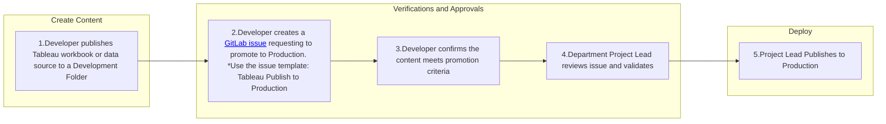

## Quick Links

- [Tips and Tricks](/handbook/enterprise-data/platform/tableau/tableau-developer-guide/tips-and-tricks-for-developers/)
- [Tableau Style Guide](handbook.gitlab.com/handbook/enterprise-data/platform/tableau/tableau-developer-guide/tableau-style-guide/)

## Data Source Types in Tableau

There are a few different options for what kind of data source you can use in Tableau, and which option you pick could impact the performance & end-user experience of your dashboard. Let’s get some terms defined:

- Extract vs. Live: An extracted data source has an extract of the data set that lives in Tableau. A live data source will query the underlying data source (Snowflake, Google Sheets) every time you change a filter or navigate to a new dashboard tab. Extracts will almost always perform faster.

- Local, Embedded, and Published: In the context of this tip, a ‘local’ and ‘embedded’ data source are the same thing. These are connections where the data source lives “inside of” or “with” the workbook. The only way to view or edit this data source is to open the workbook. This connection type can only connect to / live inside of one workbook at a time.

- Published: A published data source is published separately from the workbook. So in Tableau Cloud, you could navigate to a link for the data source, and separately a link for the workbook. You can connect one published data source to as many workbooks as you want, as it exists independently from the workbook.

A workbook’s data source can be Local + Live, Local + Extracted, Published + Live, or Published + Extracted.

### Tips Regarding Connection Types

You may find that developing a workbook in Tableau Desktop that uses a Published Data Source can be a slow and clunky experience. For whatever reason, a published data source connection can work slowly. To get around this problem while still using a published data source, you can work on a local copy.

[This video](https://www.youtube.com/watch?v=KcxtXmzS4mk) described the process. It is an old video, so the user interface is a little outdated, but the process of creating a local copy is the same.

The written instructions are as follows: Open the workbook in Desktop and navigate to any worksheet. Then right click on the data source and select "create local copy". Next, right click on the original published data source, and select "Replace data source" from the dropdown. In the pop-up, replace your original data source (published) with the new one (local copy).

Then you can develop as you normally would. When you are finished, you can publish the data source back to Tableau Cloud, and it will turn the local copy back into a published data source connection. Finally, publish the workbook.

Be mindful that you do not publish over someone else's existing data source, with changes that may disrupt the workings of their workbook.

#### Editing Fields In A Published Data Source

If you are developing in a workbook (in Tableau Cloud or Desktop) which is connected to a Published Data Source, you cannot make any changes to the published data source. This means:

1. If you want to make any edits to a calculated field, you will not be able to. You will have to create a copy of the calculated field.
1. If you use the "[replace references](https://www.thedataschool.co.uk/gregg-rimmer/tableaus-replace-references-feature/)" function it will only replace the instances where the field is on a worksheet independently. It will not replace any instances of that field that are contained within another calculated field (see point number 1, you cannot edit a calculated field in a published data source)
1. If you change any of the parameters in the workbook, Tableau will create a duplicate copy of your parameter and replace your parameter with the copy in the published version. If a stakeholder comes to you and says "this dashboard is broken! The dropdown does not work!", it is probable that there are two versions of the 'broken' parameter.
1. You cannot add a Table Calculation onto a pre-existing calculated field. You have to make a copy of the calculated field, and then you can use a table calculation with the copy.

If you find yourself in the scenario where you do need to do any of the above, it is possible. There are two options - you can either follow the instructions in the section above to create a local copy of the data source, make your adjustments, and then republish the data source.

Or, you can navigate to the published data source in Tableau Cloud, open it in "edit" mode, make your changes, and republish the data source.

## Data Source Approach

In general, our recommended approach to creating data sources in Tableau is to create all joins in dbt/Snowflake to materialize a final mart and/or rpt table that can be directly consumed by Tableau for the dashboard with no further joins, relationships, or calculations required in the BI layer.

During the Tableau implementation, we experimented with the approach of bringing fct & dim tables into Tableau and creating the joins and relationships there. However, we prefer to create the data structures in dbt/Snowflake where possible for the following reasons:

- By keeping business logic in the enterprise data warehouse as a rule and simply publishing the final mart/rpt tables for consumption, we avoid applying contradictory business logic in custom SQL across Tableau data sources.
- This approach keeps all joins & reporting logic it/data-team/ version control via the dbt/git integration.
- This approach makes the final data source query-able using SQL; this makes it easier for an Analyst to compare the results in the dashboard and the final dataset against upstream tables, and makes it more accessible for an Analyst to troubleshoot logic when a dashboard is showing unexpected results.
- This enables the same dataset to easily be used in a Tableau dashboard as well as an ad-hoc query, one-off export/analysis, or pulled into another downstream tool if needed (i.e. a Jupyter notebook).

For the same reasons, our approach to creating calculated fields is to create them in dbt/Snowflake rather than in Tableau when possible. One notable exception is for ratio metrics (for example, gross profit % would be calculated in Tableau so that it could be dynamically weighted as filters are applied to that metric; however, the numerator & denominator should both be defined in dbt/Snowflake with only the simple division occuring in Tableau).

This approach is intended to fulfill the majority of data source use cases, and Tableau developers are encouraged to try this approach first rather than creating joins & relationships in Tableau. If you find an instance that this approach does not support, please submit an MR to update this handbook guidance to share the scenarios where an alternate approach would be better.

## Connection Types in Workbooks

When you are publishing a workbook or data source, there are a few Authentication options. The default options will allow you to publish your work, but you will soon be getting:

1. Messages from users that the OAuth token has expired and they are unable to access a workbook
1. If you schedule an extract, you will get emails that the extract has failed.

The way to make sure users can always access the data within a workbook, is to choose the non-default authentication option.

<details markdown=1>

<summary><b> In Desktop </b></summary>

**Publishing a Data Source From Desktop**

If you are publishing a data source from Desktop to the Cloud/Online to be a Tableau Published Data Source, you will get the following window:


Select the "Edit" button it/data-team/ "Authentication". It will bring you to the following pop-up. Choose your <rolename> to embed.


**Publishing a Workbook With a Local Connection**

A workbook with a local connection is one whose data source is living inside of the workbook, and is not a separately published Tableau Data Source which you can search Tableau Online for. When you try to publish a workbook with a local connection, you will see the following window:


Select "Edit" it/data-team/ "Data Sources" and find "Authentication". Choose to embed your <rolename>.


</details>

<details markdown=1>

<summary><b> In Cloud/Online </b></summary>

**Publishing in Cloud/Online**

If you are editing a data source in Cloud/ Tableau Online/ your web browser (all the same thing), in order to make sure your credentials are embedded, find "Publish As":


In the following window, be sure to check the box for 'Embed Credentials'.


</details>

### Workflow for Embedding Your Rolename to Avoid Errors in Published Dashboards

This is the process for ensuring that your rolename is properly embedded into your published dashboards. This has two key steps, and following them in this order can help avoid the following two errors:

1. A user tries to access your published dashboard and is instead met with an error window asking them to login to Snowflake.
1. Another analyst tries to quickly check your data source in Cloud, to see how it is built or to see how the custom SQL is constructed.

The first place that you get the option to embed your rolename is when you first form a connection to your datasource. It looks like this:


If you want other people to be able to access your data source, you need to leave it blank. There is no reason to enter your rolename at this step, you will do it at a later step, so the proper workflow is to leave it blank at this step.

From here, set up your datasource and develop as you would like. Then, when you are ready, publish your workbook/datasource. This is where you will follow the steps from the [start of this section](/tableau-developer-guide/#connection-types-in-workbooks) for embedding your rolename as you publish the workbook.

If you forget to embed your rolename at this step, then your users will be asked to sign into Snowflake or otherwise send an error instead of letting them access the dashboard.

### Creating Connection Types that Allow Others Without Snowflake Access to Edit the Workbook

Using a published connection, or a local extracted connection in your workbook will give the ability for others who do not have Snowflake access to edit your workbook. If a workbook is published using a local, live connection then any Explorer who wants to make edits to your workbook will need to sign-in to Snowflake, using their own credentials. This is the screen that an editor would be met with when trying to edit a workbook with a local, live connection.

In the niche use-case that you want an Explorer without Snowflake access to be able to make small edits to your workbook, ensure you use only pulished, live connections, or extract the data.

 

## Common Connection Errors and How to Solve Them

 Are you or one of your users experiencing an error screen when trying to access Tableau? See if the issue is on this list, and how to resolve it.

### 1. Issue: Authentication

**Error**:
> `"Confirm that you have provided valid credentials for this data source. Tableau detected that your OAuth refresh token is expired. Reauthenticate with new credentials. Ask your Tableau admin if you need help" and "This sheet uses data that's on a Snowflake database. You need to sign into that server".`

This error message can be challenging to diagnose, as it can be the result of numerous causes. Unfortunately, there is no easy way to diagnose which possible cause is the reason you are seeing this message when it occurs.

  | Cause                     | Solution/Prevention             |
  |---------------------------|----------------------|
  |The developer used a local, live connection         | [Follow these steps.](/handbook/enterprise-data/platform/tableau/tableau-developer-guide/#creating-connection-types-that-allow-others-without-snowflake-access-to-edit-the-workbook)  |
  | The last person to publish changes to the workbook/data source forgot to embed their credentials when publishing.                | [Follow these steps when publishing.](/handbook/enterprise-data/platform/tableau/tableau-developer-guide/#workflow-for-embedding-your-rolename-to-avoid-errors-in-published-dashboards)|
  | The credential is truly expired (it was published weeks ago) | Have the data source owner refresh their credentials following these [steps](/handbook/enterprise-data/platform/tableau/#snowflake-oauth-data-source-connection-expiration-period). |

### 2. Issue: Insufficent Data Access

**Error**:
> `Upon trying to sign in to view a dashboard, you receive the error message "invalid consent request".`


This generally occurs because you do not have access to something you are trying to view. This can be:

- The a database or table the view is built off of.
- The credentials the developer embedded into the workbook. [See here.](/handbook/enterprise-data/platform/tableau/tableau-developer-guide/#workflow-for-embedding-your-rolename-to-avoid-errors-in-published-dashboards)

**Solution:** If the last person to publish the data source / workbook followed the steps linked above for correctly embedding their credentials, then it is likely an access issue. The simplest solution would be for the developer to publish the connection as a published and extracted data source.

If you need access and using an extracted connection is not suitable, you can check with the developer if they used a "large" warehouse which you do not have access to, or if there are non-standard tables used in the workbook that have restricted access.

### 3. Issue: Missing Columns in Data

**Error**:
> `"An unexpected error occurred. If you continue to receive this error please contact your Tableau Server Administrator" combined with "TableauException: ERROR: The field '[name]' in the datasource 'sqlproyx._______' does not exist in your database. It was either modified or removed. Would you like to reset the view?".`

This indicates that the connection is looking for a column that does not exist/ is broken. It may have been dropped or modified in Snowflake, and now those changes are causing a breakage in Tableau.

**Solution:** Contact the owner of the workbook for assistance. The easiest way to resolve errors like this is by downloading a local copy of the data source or workbook to Tableau Desktop and deleting or replacing the fields there.

## Embedding in the Handbook

In order for views from workbooks to be embedded and viewable in the handbook, public or internal, the workbook and their data sources must be prepared in a specific way. To be embedded in the public handbook the workbook and relevant datasource must be copied from the [internal GitLab Tableau](https://10az.online.tableau.com/#/site/gitlab) site to the [public GitLab Tableau](https://us-west-2b.online.tableau.com/#/site/gitlabpublic) site. To facilitate correct viewing of embedded views and the synchronization of content to the public site, workbooks must be set up in a specific way and given a specific tag.  Views that are meant to be embedded on the internal site do not need to be in a specific project, but should still meet the set up guidelines.

Instructions for how to embed a Tableau chart can be found on the [Handbook Embedding Demonstration](/handbook/enterprise-data/platform/tableau/embed-demo/) page.

### Workbook Set Up

For embedding in the handbook, views will embed better than dashboards will, so each view that is meant to be embedded should be designed to function without user selected inputs.  Filters and parameters can be preset during the embedding process, but will not be changeable by the viewer. Additionally, the view must meet the following criteria:

- The view cannot be hidden
- For embedding in the public handbook each datasource must connect to Snowflake with a Data Team Service Account username and password or use an extract
- For embedding in the public handbook each workbook must have the `Public` tag.

#### Data Source

If you are not using an extract, like when your extract is going to be over 10 million rows, then you will need to use the Data Team Service Account's credentials. Reach out to the data team to get set up with those credentials.

Be mindful when you are embedding your credentials in the data source while publishing either internal or external views. Using an extract with your role embedded will be the clearest way to make sure that users can always view the data and will not experience an authorization expiration error.

Make sure that if you do use the Data Team's credentials to publish the workbook, when you make any changes to the workbook it retains those credentials. You will need to embed passwords in the data source for the views to show correctly. This box may come unchecked when you are making changes. 

#### Public Tag

If your view is public and embedded in the public handbook (aka, people do not need to sign-in to view it), then it needs to be on the Public GitLab Tableau Cloud site due to the viewer license agreements. To tag a workbook as public, click on the workbook. On the main page for the workbook where you can see each of the views, next to the name, there is a "more settings" option '...'. Select that, and find "Tag...". Here, you can add "Public" as a tag.

It will take about a day for the URL to show up in [this list](/handbook/enterprise-data/platform/tableau/embed-demo/#views-availble-for-public-embedding). Once it does, copy that URL and use it in the embedding information. If your view has not shown up after a day or so, it is likely because one of your data sources is not following the guidelines of A\) being an extracted connection or B\) using the data team's service account's credentials.

### Workbook Synchronization

Each workbook with views that are meant to be embedded in the public handbook must be tagged with the `Public` tag. This will ensure that the workbook, and their datasources are copied to the public GitLab Tableau site.  Only Creators and Explorers who can access the workbook can tag the workbook, see the Tableau [documentation](https://help.tableau.com/current/pro/desktop/en-us/tags.htm#add-tags) for more information.  The individual tagging must it/data-team/stand if the data should be shared publicly and if there is any question please work with the BI team to check and apply the tag.  Removing this tag from a workbook will delete the workbook from the public GitLab Tableau site, this will cause handbook pages trying to load a view from that workbook to display an error. It should be noted that it can currently take up to 48 hours for the synchronized workbook to show up in the list of [views available for embedding](/handbook/enterprise-data/platform/tableau/embed-demo/#views-availble-for-public-embedding).

### Workbook Naming Convention

When publishing workbooks to our Tableau Cloud site for the first time please name the workbook with their intended / official title, so that the resulting URL will capture just this title (this will allow us to keep the same URL when the workbook is published to the Production spaces):


Publishing to the [Development](https://10az.online.tableau.com/#/site/gitlab/projects/300844) project:

All workbooks published to the Development project will be attached the *Draft* and their department tags to indicate that they are in development mode and not a workbook that has been peer reviewed and intended to serve as the single source of truth (SSOT) for a use case. The BI team will leverage the Tags functionality available in Tableau Cloud to better organize workbooks by department and publishing status. For example, this workbook below is assigned the *Draft* and *Data Team* tags:


To add tags to the workbook select on the ellipse symbol to the right of that workbook and click on *Tag...*:


Once in the Tag window, add in the *Draft* and department tags for the workbook:


## Publishing to Tableau Cloud

There are two environments for publishing: Development and Production.

- **Development** is intended for testing and iterating on dashboards and data sources. This environment allows for experimentation and refinement before content is finalized.
- **Production** is the environment for deploying **finalized, validated content** that is ready for broader distribution and trusted use across the organization. Only content that has passed all necessary reviews and meets quality standards should be promoted to Production. To publish content to Production, follow the workflow diagram below. You can request the promotion of a workbook or data source to Production by creating a [Tableau issue](https://gitlab.com/gitlab-data/tableau/-/issues/new) and using the template: `Tableau Publish to Production`. This process ensures all necessary steps are taken to safeguard data integrity and accuracy.

### Procedure for Publication to Production



## Tags

Applying tags allows us to provide more information on the workbook, so that we can easily discern them by their business function / department and distinguish draft content that is still in development. To filter workbooks by their tags, please click on the search box in the upper right-hand corner of the project. it/data-team/ **Content types** select **Workbooks**:


Once in the Workbooks section, click on the **Tags** dropdown to filter content by tags:


## Workbook and Data Source Descriptions

Adding a description to a workbook or data source in Tableau enhances clarity and usability by providing context and helping users quickly grasp the content's purpose. Descriptions should be concise, ideally 1-2 sentences, and clearly outline the intended use case for the content.

How to add a description:

1. Navigate to the Workbook or Data Source
1. Click on the three dots (...) next to the workbook or data source name and select Edit Details.
1. In the Edit Details page, find the Description field. Enter the description you want to associate with the workbook or data source.
1. Once you've added the description, click Save to apply the changes.


## Performance Indicators

The full code for embedding performance indicators into the handbook is typically not found on the same page as where the actual indicators are displayed. Instead, you might find something like this:

```Performance Indicator Shortcode
{{/% performance-indicators "developer_relations_department" /%}}
```

In order to update the performance indicator, you need to find the yml file which is associated with the performance indicators seen, and you can update from there. In order to locate the yml file, look at the name of the file that you see in the shortcode. In the example above, you would be looking for developer_relations_department, which is the title contained within " ".

To find this file, you are going to go to the GitLab-com repository, which is a repo "for the public-facing marketing website of GitLab, including improvements to the docs and the handbook". From [the repository](https://gitlab.com/gitlab-com/www-gitlab-com), find "Find File" and then paste in the name of the file you are looking for. In this example, you would paste developer_relations_department.

This will bring you to the yml file which you are looking for. From here, you can follow the instructions below to modify the file to include the Tableau view (dashboard or sheet) which you are looking for. Be sure to follow the [Embedding Instructions](/handbook/enterprise-data/platform/tableau/tableau-developer-guide/#embedding-in-the-handbook) when embedding views.

Two reminders, first - *make sure that any public views (does not need login access) that are embedded into the public handbook are coming from the public Tableau site*. This means that the workbook they come from has been tagged "Public", and you are getting the URL from the [views available for embedding](/handbook/enterprise-data/platform/tableau/embed-demo/#views-availble-for-public-embedding) page. More information on this process can be found on the [Handbook Embedding Demonstration Page](/handbook/enterprise-data/platform/tableau/embed-demo/).

Second, *if you are embedding a non-public view (requires login), make sure to copy the URL from the "share" button on the top right of the view, not the URL at the top of the page*.

### YML

The `data/performance_indicators.yml` file in the handbook repositories is the basis for a system that automatically generates handbook pages with performance indicator content on them.  The structure can take a list of charts and each chart can take a list of filters and parameters.  Only charts not tagged as public should be included on internal handbook pages. The following is an example of how to add the needed information to the data file:

```yml
- name: MR Rate
  description: MR Rate is a monthly evaluation of how MRs on average an Development engineer performs.
  tableau_data:
    charts:
      - url: https://us-west-2b.online.tableau.com/t/gitlabpublic/views/OKR4_7EngKPITest/PastDueSecurityIssues
        height: 300px
        toolbar: hidden
        hide_tabs: true
        filters:
          - field: Subtype Label
            value: bug::vulnerability
        parameters:
          - name: Severity Select
            value: S2
  is_key: true
```

For additional clarity, the exact syntax of this code block is very important so that it can be read like JSON data. Sometimes you might be updating an existing handbook yml file with everything filled out, except the chart is currently a Sisense chart. To replace the Sisense chart, replace the lines of code which point to the Sisense chart. You can leave everything else in the file as-is.

If you just want to embed a chart without any height, filter, or parameter specifications you would use the following:

```yml
  tableau_data:
    charts:
      - url:
```

Which, in plain English, is:

```yml
(tab)tableau_data:
(tab)(tab)charts:
(tab)(tab)(tab)-(space)url:
```

Please note, a tab is two spaces.

## Row Level Security

To use Row Level Security within Tableau the developer will need to use an entitlement table, found in `prod.entitlement`.  The entitlement table will be joined with the appropriate source table using the Tableau Data Modeling interface; this ensures that the tables can be properly filtered at query time and will allow for extracts to properly implement row level security.  Once the entitlement table is joined to its corresponding source table, a data source filter needs to be added to ensure the rows are correctly filtered to the current user.

### Example

Find the correct entitlement table for the table you are using.  The entitlement table should be named similar to the table you wish to join it to.


Perform a direct inner join, not a relationship, between the source table and the entitlement table.


Create a Data Source filter using the `USERNAME()` function and the `tableau_user` field in the entitlement table.  This is the step that will ensure that only rows visible to the current user will be retrieved.


### Geo-Based Row-Level Security

Implementing RLS based on GEO data in Tableau ensures that users access only the data pertinent to their assigned GEO. This is facilitated through the [ent_sfdc_geo_pubsec_segment](https://dbt.gitlabdata.com/#!/model/model.gitlab_snowflake.ent_sfdc_geo_pubsec_segment) table which integrates SFDC user roles with Tableau.

This Geo based entitlement table is designed to manage user access to specific GEOs by combining information from SFDC user roles and Tableau's SAFE access groups. The table's logic determines access based on the following criteria:

- **Users with Assigned GEOs**: If a Salesforce user has an assigned GEO, they are granted access to that specific region.

- **SAFE and SFDC Role Users**: Users who are part of both the Tableau SAFE access group and specific Salesforce roles gain global access. (e.g. Executive)

- **Non-Pubsec Roles**: Certain roles are granted global access excluding the 'AMER-PUBSEC' GEO (e.g. Executive - Global Minus Pubsec)

- **Non-SFDC SAFE Users**: Tableau SAFE users without corresponding Salesforce roles are granted access based on their Tableau entitlements.

This approach ensures that each user’s access to GEO data aligns with their organizational role and permissions.

### Submitting an Access Request (AR) to Update Roles

If you require modifications to your Salesforce roles or Tableau access groups to change your GEO access permissions, follow GitLab's standard Access Request process:

- Submit the AR: Complete the standard [AR issue template](https://gitlab.com/gitlab-com/team-member-epics/access-requests) with the necessary details, specifying the roles or access levels you wish to obtain or modify.

- Approval Workflow: Your request will undergo the standard approval process, involving reviews by the relevant managers and system administrators.

- Role Assignment: Upon approval, the Sales Systems team or the Tableau Admin will implement the changes in Salesforce and/or Tableau.

- Entitlement Update: The ent_sfdc_geo table will automatically reflect these changes, updating your data access permissions accordingly.

## Guidelines for Publishing Extracts

1. **Data Source Live vs. Extract** - Extracts are primarily a performance optimization tool and should not be the default choice. Use Live Connections by default, and consider Extracts only in the following situations:

   - **Dashboard Performance** - If visualizations take longer than one minute to load despite applying performance optimizers.

   - **Heavy traffic data sources** - To reduce data warehouse costs, use scheduled Extract refreshes instead of numerous user live queries.

1. **Extract Size** - We have 1 TB of storage on Tableau Cloud. Extracts should not exceed 5 GB, which accommodates up to ~50 million rows of data.

1. **Extract Scheduling** - Schedule Extract refreshes between 18:00 and 05:00 UTC. Ideally, limit refreshes to business weekdays.

1. **Optimize Extracts** - Consider the following strategies to shrink and improve extract refresh performance:

   - **Aggregate Data** - Aggregate data at a higher level before creating an extract to reduce size and improve performance.

   - **Filter Data** - Apply filters to include only relevant data in the extract. This can help reduce size and improve refresh times.

   - **Use Incremental Refreshes** - For large datasets, configure incremental refreshes instead of full refreshes. This updates only the new or changed data, which is more efficient. Consider using Tableau Prep to implement incremental and merge/update refreshes.

1. **Extract Refresh Suspension** - Tableau Cloud will automatically suspend data sources that remain unused for 30 days.

## Improving Local Connection Timeouts

To reduce the number of times Tableau Desktop will ask to reconnect, the developer can set their local snowflake
driver to keep their session alive.
To do this the developer needs to edit the `odbc.ini` file
and set the `CLIENT_SESSION_KEEP_ALIVE` flag to `True`. Typical locations for the file can be found in the [Snowflake documentation](https://docs.snowflake.com/en/developer-guide/odbc/odbc-mac#step-2-configure-the-odbc-driver)


## Replacing Datasources in Tableau Desktop

The steps are as follows:

1. Edit the workbook in Tableau Desktop (this is needed for a specific tool that is used)
1. Add the datasource to swap to as a new datasource in the workbook.
1. Navigate to a sheet that uses datasource to be replaced.
1. Right click on datasource to be replaced and select `Replace Data Source...`
1. In the dialog box ensure that datasource to be replaced is selected as
Current and select new datasource for the Replacement and select ok
1. Check that the all of the fields swapped over to the new datasource are working and not showing an error- some may have a `!` next to them and require replacing.  Any manual field aliases may also need to be reapplied.
1. Right click on the datasource to be replaced and select close (to reduce un-needed clutter).
1. Publish the workbook.

## Testing Tables from MR Databases in Tableau Prior to Merging

If you are working in Tableau using a report table from snowflake (created in DBT), you will likely need to update your table at some point. It is in your best interest to test these changes in Tableau prior to merging your MR, so that you can catch any problems with the updates before going through the process of formally requesting to merge the changes, and waiting for the data to be available.

There are some key lessons that the Data Team learned about testing our MR databases in Tableau, which we will share below.

### Workflow

1. The author of the MR shares the MR database with you.
2. Open up a development copy of the workbook or data source you want to test the changes on.
   1. ***Make sure you are using a development copy and not working on the published data source!*** This is important because at some point in the future, when the MR is merged, you will no longer be able to access the data source that points to the MR db - even to update it to repoint to PROD. Hence it is important that you leave the original data source untouched to avoid this issue.
3. Open up the data connections pane.
4. Find the MR database in the left-hand connections window/dropdown.
5. Replace the PROD tables with the MR database tables.
6. Test your changes.
7. Close and exit without saving your changes, or un-do the changes to revert the dashboard back to it's original state and data source.
8. Merge the MR when you are satisfied with the changes - the MR database will disappear.

### Forming a Connection

Once you have a local development copy of the data source, open up the data source connection pane where you would normally edit a data source.


On the left side is where you add new connections, and in the middle is where the tables that make up the workbook are visualized.

If you have been granted access to query the MR database which is attached to the merge request you are looking for, then you will be able to see it as an option it/data-team/ the dropdown for "**Database**".


Search this MR database for your desired tables. Create your data source as you normally would - either replacing exiting tables with a test version, or bringing out new tables into the model and creating a join or relationship.

You can now test the tables that the MR would build right in your Tableau workbook, to make sure all of the changes will have the desired effect.

### Saving Changes

You cannot save these changes that you are testing, because once the MR gets merged, the MR database you are using will disappear.

It is recommended you only test the logic and totals of the columns being added/changed, and not make any time-consuming dashboard changes that will not be able to be saved.

If you try saving the development copy that is pointing to your development data source, you will be unable to access that data source.

### Avoiding Errors

To repeat: once your Merge Request gets merged, any Tableau Data Source which is trying to connect to that MR database will become inaccessible. You will not be able to even open the data source to edit it - in Cloud, Desktop, a duplicate version, or via any other method.

This is why it is recommended to work on a development copy of the data source only, and not in the published/production version of the data source at all.

*Even if you are 'searching for' the MR database (pictured below) but not using this connection for any of the tables in the workbook, you will encounter errors.*


Below is the error you will get if any leftover connections to the dropped database still exist in your data source. There is no workaround for this, you will need to replace the data source with an identical data source or, if you do not have an identical version, you will need to rebuild it and then 'Replace References' on most of the fields.


### Final Testing Notes

Testing MR databases is a useful way to test changes before they get merged into production and save time. The use cases that work best for this are:

- Business logic changes that would affect a total number
- Quick changes to fields that would affect the view

It is not efficient to extensively test changes that would require many changes to the dashboard/ calculated fields, because you will not be able to save those changes for use with the updated table once the MR goes through.

Make sure to open a local, development copy of the workbook/data source prior to testing the MR database.

## What are Relationships? (Tableau)

Relationships are a feature in Tableau that allow you to combine data from multiple tables for analysis without having to define join types. They offer a more flexible and performant way to work with multi-table data sources compared to traditional joins. Here are some key points about relationships in Tableau:

1. Dynamic and flexible: Relationships adapt to the specific fields and filters used in a visualization, optimizing queries for better performance.

2. Maintain data granularity: Unlike joins, relationships preserve the native level of detail in each related table, reducing data duplication and aggregation issues.

3. Multiple tables at different levels of detail: You can easily relate tables with different levels of granularity without worrying about fanout or incorrect aggregations.

4. Noodle diagrams: Relationships are represented visually as "noodles" connecting tables in the data model, making it easier to it/data-team/stand table associations.

5. Context-aware: Tableau only queries the tables and fields necessary for the current visualization, improving performance and reducing unnecessary data retrieval.

6. Easy to set up: Simply drag and drop tables onto the canvas and define relationships based on common fields between tables.

7. Compatibility with joins: You can still use traditional joins within a single logical table, allowing for a hybrid approach when needed.

8. Performance optimization: Relationships often result in better query performance compared to complex join scenarios, especially for large datasets.

9. Simplified data modeling: Relationships make it easier to create and maintain complex data models without requiring extensive knowledge of join types and their implications.

10. Improved data accuracy: By maintaining the native level of detail in each table, relationships help prevent accidental data loss or duplication that can occur with poorly designed joins.

When working with multi-table data sources in Tableau, consider using relationships as your default approach for combining tables, reserving joins for specific scenarios where more precise control over table combinations is required.

If you would like to see a simple example demonstrating how relationships work - with the SQL queries that the example produced, you can find an in-depth writeup [here](https://anniesanalytics.com/what-are-relationships-in-tableau-really).

## Snowflake & Tableau Settings Rolename Embedding

In order to properly embed your credentials in connections (as described [here](/handbook/enterprise-data/platform/tableau/tableau-developer-guide/#workflow-for-embedding-your-rolename-to-avoid-errors-in-published-dashboards)), you will need to have two prerequisites:

1. You have set a 'default role' in Snowflake. You can follow [the instructions here](/handbook/enterprise-data/platform/#logging-in-and-using-the-correct-role) on how to set your default role if you have not done so already.

1. You have embedded your rolename into your Tableau settings. To do this, navigate to your Tableau homepage and look to the top right corner. Click on your profile dropdown (usually a cirlce with your initials), and click 'My Account Settings. In the "Saved Credentials for Data Sources" section, scroll until you find Snowflake, and add your default role there.
