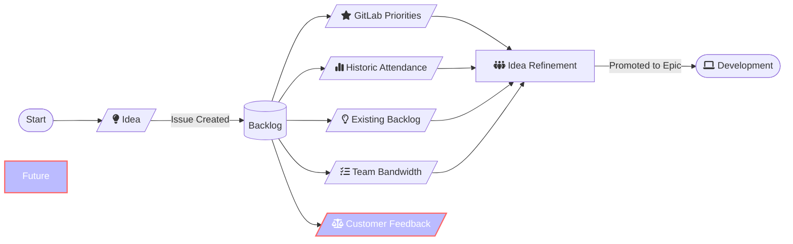

## <i class="fa-solid fa-door-open" style="color: #B197FC;"></i> Welcome to the CSE Content Handbook

## <i class="fa-solid fa-signs-post" style="color: #B197FC;"></i> QuickLinks

### Team Workflows, Planning and Collaboration

<!---
#### Issue Templates

- [<i class="far fa-edit"></i> New Content Issue](...)

--->

#### Issue Boards

- [<i class="far fa-clipboard"></i> Content Development](https://gitlab.com/gitlab-com/customer-success/customer-success-engineering/content/-/boards/7697122?label_name[]=content-idea&group_by=epic)
- [<i class="far fa-clipboard"></i> Content Idea Backlog](https://gitlab.com/gitlab-com/customer-success/customer-success-engineering/scale-cse/-/boards/7694684?label_name[]=content-idea)
- [<i class="far fa-clipboard"></i> Program Development](https://gitlab.com/gitlab-com/customer-success/customer-success-engineering/content/-/boards/7672022?group_by=epic)
- [<i class="far fa-clipboard"></i> Release Management](https://gitlab.com/gitlab-com/customer-success/customer-success-engineering/content/-/boards/7672054?group_by=epic)

### Roadmap

- [<i class="far fa-clipboard"></i> Customer Success Engineering Roadmap](https://gitlab.com/groups/gitlab-com/customer-success/customer-success-engineering/-/roadmap?state=opened&sort=START_DATE_ASC&layout=MONTHS&timeframe_range_type=CURRENT_YEAR&progress=COUNT&show_progress=true&show_milestones=true&milestones_type=SUBGROUP&show_labels=true)

### Team Resources

- [<i class="far fa-calendar-alt"></i> Webinar and Labs Calendar](https://university.gitlab.com/pages/gitlab-user-webinars)

### Want to work with the team?

- [<i class="far fa-edit"></i> Content Idea Template](https://gitlab.com/gitlab-com/customer-success/customer-success-engineering/scale-cse/-/issues/new?issuable_template=content-idea-template)
- [<i class="far fa-edit"></i> Raise Content Bug](https://gitlab.com/gitlab-com/customer-success/customer-success-engineering/content/-/issues/new?issuable_template=bug)

---

## <i class="fa-solid fa-map-location-dot" style="color: #B197FC;"></i> CSE Content Team Strategy

The main goals of the CSE Content team are to:

- Produce High-Quality, Customer-Aligned Content in support of Customer Sucess Engineering goals, aligned with market needs
- Effectively market all content
- Establish Clear Metrics for data driven analysis
- Foster Cross-Functional Collaboration

<!---
### OKRs

### Highspot

The team's content is distributed in [Highspot](https://gitlab.highspot.com/)...

### Product Adoption Initiatives

- [Title](Issue/Epic) (internal).
- [Title](Issue/Epic) (internal).
--->

## <i class="fa-solid fa-users" style="color: #B197FC;"></i></i> Team members and focus areas

We are members of the [Customer Success Engineering team](/handbook/customer-success/csm/segment/cse).

| Team member |  Responsibilities |
|-------------|-------------|
| [Nicole Esplin](/handbook/company/team/#nesplin)   Content Strategist | Cross Functional Collaboration, Content Strategy, Marketing/Promotion, Content Optimization, Content Delivery |
| [Tearyne Almendariz](/handbook/company/team/#talmendariz)   Content Architect | Quarterly Planning/Backlog Management, Content Creation (Non Demos), Content Operations |
| [James Wormwell](/handbook/company/team/#jwormwell)   Demo Architect |  Content Creation (Demos), Demos/Lab Content Creation, Demo Operations, Demo Asset Maintenance |

    Responsibility Detail

---

> **Note**: The following RACI chart can be used to understand how content creation stakeholders interact on each area of `Responsibilities` listed above. The table will continually be updated as the team evolves and matures.

### Content Team Responsibilities Matrix

| Responsibilities | Content Strategist | Content Architect             | Demo Architect                   | CSEs      | CSSO | CSE Leadership |
| ------------------------------------------------------------ | --------------------------- | ---------------------------------------- | ---------------------------------------- | --------- | -------------- | -------------- |
| **Cross Functional Collaboration -**: maintain alignment with other content stakeholders - EDU, Field Marketing, SAs, DevRel | DRI                         | Consulted                                | Consulted                                | Informed  | Informed       | Consulted      |
| **Content Strategy**: - oversee strategy and execution for driving GitLab adoption at scale thru multiple content delivery methods (aligned with CSE quarterly goals/initiatives) | DRI                         | Consulted                                | Consulted                                | Consulted | Informed       | Consulted      |
| **Quarterly Planning/Backlog Management**: - organize and maintain visible backlog ensuring content creation is aligned with strategy/quarterly objectives. | Consulted                   | DRI                                      | Consulted                                | Informed  | Informed       | Consulted      |
| **Marketing/Promotion**: - create and execute internal and external strategies designed to maximize visibility, engagement and impact through various channels | DRI                         | Consulted                                | Consulted                                | Informed  | Informed       | Informed       |
| **Content Creation**: - develop and execute against content strategy. Work with SMEs to ensure workback plan for delivery | Consulted                   | DRI (Webinars, blogs)                    | DRI (Labs)                               | Consulted | Informed       | Informed       |
| **Demos/Lab Content Creation**                                  | Consulted                   | Consulted (decks, talk tracks, delivery) | DRI (structure, architecture, messaging) | Consulted | Informed       | Informed       |
| **Content Optimization**: use data to refine and enhance content performance, reach and engagement across various channels.  Includes creation/iteration of email text and monitoring effectiveness of campaigns | DRI                         | Consulted                                | Consulted                                | Informed  | Consulted      | Consulted      |
| **Content Delivery**: oversee scheduling and ensure the right SMEs are delivering in the most impactful manner | DRI                         | Consulted                                | Consulted                                | Informed  | Informed       | Consulted      |
| **Content Operations**:  Updating GLU Calendar (Thought Industries), Zoom registration process and uploading of all content.  Also management of email campaigns in GS. | Informed                    | DRI                                      | Informed                                 | Informed  | Consulted      | Informed       |
| **Demo Operations -**: manage demo codes for hands on labs.  Collaborate with architecture team for CSE needs (SA DAs to cover for PTO) | Informed                    | Informed                                 | DRI                                      | Informed  | Informed       | Informed       |
| **GL Release Management -**: update learn labs after each GL release.  Create monthly TLDR for CSE org to be used across all content delivery. Update content assets that change due to releases and ensure CSE or understands value and talk tracks as applicable | Consulted                   | Consulted                                | DRI                                      | Informed  | Informed       | Informed       |

## <i class="fa-solid fa-book" style="color: #B197FC;"></i> Content Catalog

The Content team creates content that will be maintained and can be reused for customers to consume.

You can search for relevant content and contact the team in the linked content projects or in the [#cse-content-team](https://gitlab.enterprise.slack.com/archives/C07EE4FNM9T) Slack channel.

The following sections provide an overview of all content assets, and links to find them.

### Environments/Infrastructure to support Demonstrating Content

- **Build Your Own -** Self service public cloud infrastructure/tooling/environments. Individual AWS account or GCP project access documented in the [Sandbox Cloud Realm](/handbook/company/infrastructure-standards/realms/sandbox) handbook pages and accessed through [gitlabsandbox.cloud](https://gitlabsandbox.cloud).
  - *Use Cases:*
    - *Competitor analysis/demonstration/exploration*
    - *Personal runner/fleet demonstration/exploration*
    - *Self-managed deployment*
    - *Customer environment simulation*
    - *Self maintained deployment target(s)*
- **Self-Managed -** Shared Customer Success Omnibus instance [cs.gitlabdemo.cloud](https://cs.gitlabdemo.cloud) (internal) with visibility of Admin areas accessed through [gitlabdemo.cloud](https://gitlabdemo.cloud), maintained by the Demo Architecture team.
  - *Use Cases:*
    - *Self-managed demonstration/exploration*
    - *Admin area demonstration/exploration*
    - *User impersonation*
- **SaaS -** GitLab Licensed Demo Groups [Premium and Ultimate Access Request](https://gitlab.com/gitlab-com/team-member-epics/access-requests/-/issues/new?issuable_template=GitlabCom_Licensed_Demo_Group_Request) (internal).
  - *Use Cases:*
    - *License tier comparisons*
    - *Personal exploration of the platform*
    - *Adhoc demonstration area*
- [Produce effective demos with OBS Studio](https://docs.google.com/document/d/1kchnm55N8zx8tBBsxilWadGqBndhvb5d4eG9LsSS6DA/edit#heading=h.quzn6r2hna1l) (internal)

### Webinars

| Title                                                        | Group         | Last updated | YouTube |
| ------------------------------------------------------------ | ------------- | ------------ | ------- |
| [Holistic Approach to Securing the Development Lifecycle](https://drive.google.com/file/d/11-mPw0aNXcazOMVVVvxEo97meQz1TYMW/view?usp=drive_link) | Secure        | 2023-10-13   | https://youtu.be/WWA7z2WtFvM  |
| [Git Basics](https://drive.google.com/file/d/17BvOGiXmWNLYm3MXmIqZ6kAkC0b4cow7/view?usp=drive_link) | Create        | 2023-10-13   | https://youtu.be/WMWoi6for1M |
| [Intro to GitLab](https://drive.google.com/file/d/14vWu6oCIcWwrkNtcZw_pioC8K3c2hNEt/view?usp=drive_link) | All           | 2023-12-07   | https://youtu.be/E1tKfOPKMA8 |
| [Intro to CI/CD](https://drive.google.com/file/d/1V3sH4rTQSMzFfwZpzZgmi9wZJq8vSoMm/view?usp=drive_link) | Verify        | 2023-10-13   | https://youtu.be/bE2YXhAVBeE |
| [Advanced CI/CD](https://drive.google.com/file/d/1GlGg0Q7p7gsAGGWgZ1vj82NZmap7PX3w/view?usp=drive_link) | Verify        | 2023-10-23   | https://youtu.be/9VTGW1pCTC8 |
| [AI Powered DevSecOps](https://drive.google.com/file/d/1Y426FrNWLIFl3u40-yXBEdy-D_RM4TAO/view?usp=drive_link) | Data Science  | 2024-06-25   | https://youtu.be/4Tzp88KYzZM |
| [Getting Started with DevSecOps Metrics](https://drive.google.com/file/d/1YRBQzNyp1Fdb-kt_PUFk9fYWHpCR7gOz/view?usp=drive_link) | Plan          | 2023-10-23   | https://youtu.be/3Tyad8o8E_A |
| [Continuous Change Management in a Secure Way](https://drive.google.com/file/d/1ctwS4FpaEbrywn_ybZlsZDGLkfdYKe8G/view?usp=drive_link) | Secure        | 2023-10-23   | https://youtu.be/oerKHtULwa0 |
| [Security and Compliance](https://drive.google.com/file/d/1UK56of57h-BVccZODI5awKTZUnpEq8fF/view?usp=drive_link) | Secure        | 2023-10-31   | https://youtu.be/cx2sPBJOStE |
| [Jira to GitLab](https://drive.google.com/file/d/1ME_oU5zGtySPoAf8_I-3u5jJZW-kBMSo/view?usp=drive_link) | Verify        | 2023-12-18   | https://youtu.be/wGnl2fs75Pg |
| [GitLab Administration (SaaS)](https://drive.google.com/file/d/1JQYVed7StwOBGEnzmsT7yiDmDfNSkx_a/view?usp=drive_link) | Core Platform | 2023-10-23   | https://youtu.be/lXtBV9o7q68 |
| [GitLab Runners](https://drive.google.com/file/d/1nxglK5j8D5XsbZTaylN-HbbVJ0gKojJd/view?usp=drive_link) | Verify        | 2024-01-17   | https://youtu.be/Xq0kNaGxcaM |
| [Vulnerability Management Strategies](https://drive.google.com/file/d/1DRhHsgeqRPGpu2NR5726QSGqg6bh7aJS/view?usp=drive_link) | Software Supply Chain Security        | 2024-05-07   | https://youtu.be/CS_GlJGtnpM |
| [Separation of Duties](https://drive.google.com/file/d/16YcUdYDNPP0x0vXzG01OsCODVnYhYe4O/view?usp=drive_link) | Software Supply Chain Security        | 2024-06-18   | https://youtu.be/vFbgzta5cyA |
| [What's New! GitLab 17.0](https://drive.google.com/file/d/11EhjSsgMepd9iZYY9vNz8LFoQPLGVNuS/view?usp=drive_link) | All           | 2024-06-04   | https://youtu.be/3gROieX0-9Q |
| [CI/CD Components](https://drive.google.com/file/d/1mSj3YhvTu5llgRzqRMZ0Lk08KlFLlhp4/view?usp=drive_link) | Create           | 2024-07-11   | https://youtu.be/2MosExpnxsw |
| [DAST API and Security Testing](https://drive.google.com/file/d/1G8XeiaQDpGQAyd1gwLsYmaf-tp3N4p91/view?usp=drive_link) | Secure           | 2024-07-12   | https://youtu.be/R6nO_0u2UqA |
| [Unlocking GitLab Duo Pro AI Webinar](https://drive.google.com/file/d/11zmxdA7XUGeqrHwZ2LuCtgdctajT5qu7/view?usp=drive_link) | AI           | 2024-08-29   | https://youtu.be/mI9F6QCtEI4 |

> **Note**: Recordings are stored in the [Webinar Master Recordings folder](https://drive.google.com/drive/folders/1x0_7J30cTpfbRXjrXgG_2XOIARLusNt3?usp=drive_link) (internal)

### Labs

| Title                                                        | Project                                                      | Group          | Last updated |
| ------------------------------------------------------------ | ------------------------------------------------------------ | -------------- | ------------ |
| [AI in DevSecOps](https://docs.google.com/presentation/d/1GdS0MQI53_mxQG-VvPxK2g9AmeJDmm403vSl8zZvy7I/edit?usp=drive_link) | [AI in DevSecOps](https://gitlab.com/gitlab-learn-labs/onboarding-cohort-projects/ai-in-dev-sec-ops/) | Data Science   | 2024-04-30   |
| [GitLab CI](https://docs.google.com/presentation/d/1IiRo4KHAgYqmzNiLkNYEatzHo75ax1BNKy-HsHoZW3k/edit?usp=drive_link) | [CICD Adoption Workshop](https://gitlab.com/gitlab-learn-labs/sample-projects/cicd-adoption-workshop) | Verify         | 2023-10-23   |
| [GitLab Advanced CI](https://docs.google.com/presentation/d/1g36th6wlPUj9YMHooAr7M0koscEdDAnxJULTu3F93Fg/edit?usp=drive_link) | [Advanced CI Lab](https://gitlab.com/gitlab-learn-labs/onboarding-cohort-projects/advanced-ci-lab/-/tree/main?ref_type=heads) | Package/Verify | 2024-05-10   |
| [CI/CD Adoption for Jenkins Users](https://docs.google.com/presentation/d/1d2u6Ls_ELgEAv8VXMatljVkPydOelUQ3_hsOvUe2k28/edit?usp=drive_link) | [CICD Adoption Workshop](https://gitlab.com/gitlab-learn-labs/sample-projects/cicd-adoption-workshop) | Verify         | 2024-01-10   |
| [Security and Compliance](https://docs.google.com/presentation/d/1_o1UbmM0u96f9XTpjYBLG3jnHeJuwJAVOrCg7Ri4ti4/edit#slide=id.g2e71b1d1f20_1_598) | [Tanuki Racing Security and Compliance](https://gitlab.com/gitlab-learn-labs/onboarding-cohort-projects/tanuki-racing-security-and-compliance) | Software Supply Chain Security/Secure  | 2024-06-26   |

## <i class="fa-solid fa-folder-plus" style="color: #B197FC;"></i> Content Creation Process

The CSE Content team creates, promotes, and distributes content that is focused on customer enablement and adoption of GitLab features, tools, and best practices. The types of content we currently create are **Short Form Demos, Labs, and Webinars**. This content is initially designed for the 1:many audience use by our Customer Success Engineers, but we aspire for the content to be used and adapted to 1:1 customer engagements and other uses within GitLab.

### Suggesting Content

We are always taking suggestions for new content to enable customers. Please visit our [content idea backlog here](https://gitlab.com/gitlab-com/customer-success/customer-success-engineering/scale-cse/-/boards/7694684) to see if a topic already exists; and you also can [submit an idea for content here using our ideation template](https://gitlab.com/gitlab-com/customer-success/customer-success-engineering/scale-cse/-/issues/new?issuable_template=content-idea-template) if the content piece that you have in mind has not already been suggested.

Submissions will be reviewed and refined on a quarterly basis during our backlog review, facilitated by the team's Content Architect. If an idea is chosen for  creation, it will be promoted to an epic in the Customer Success Engineering Group and assigned issues for the creation process associated with that content type. While this is a collaborative process, the Director of the Customer Success Engineering team has the final say on which content will be created each quarter.

While our goal is to establish a more structured process that we can measure to ensure it delivers value to our customers, CSEs are encouraged to research topics as needed for customer needs or personal growth. CSEs are asked to please discuss any content projects outside of the official CSE Content Team process and workflow directly with their managers. We are working toward a set of quality assurance guidelines and standards which one can use to independently evaluate personal projects that they may want to propose be adapted to a future webinar or lab.

#### Content Idea Lifecycle

