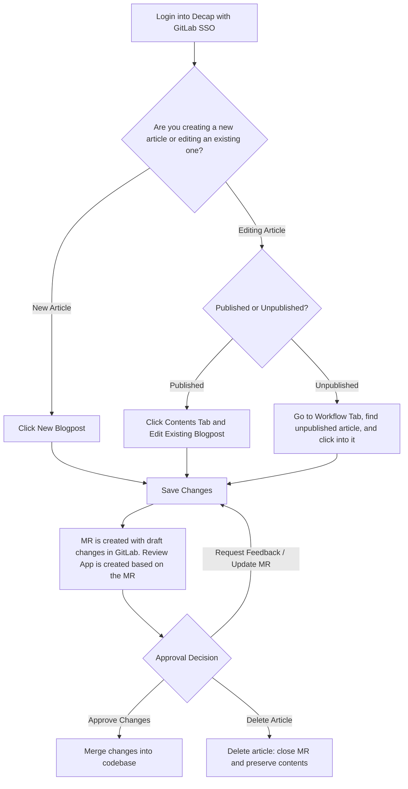
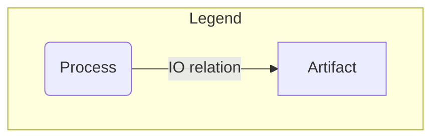

### Where can I find blog posts?

Blog posts can be found in two different locations:

1. [Yaml files in the about.gitlab.com Repository](https://gitlab.com/gitlab-com/marketing/digital-experience/about-gitlab-com/-/tree/main/content?ref_type=heads)
2. [Decap CMS](https://about.gitlab.com/admin/)

### Creating a blog post in the about.gitlab.com repository

Creating a blog post from scratch is as easy as filling out the [blog post template](https://gitlab.com/gitlab-com/marketing/digital-experience/about-gitlab-com/-/blob/main/.gitlab/merge_request_templates/blog-post.md?ref_type=heads). This can be done using the WebIDE, or by setting up the project locally.

1. Copy the example yaml document, and place it under the `/blog/` folder within the appropriate locale. For example, English blog posts would be under `/content/en-us/blog/`
2. If you're adding a new image, add it to the `/public/images/blog/hero-images/` folder and update the file path in your yaml file.
3. Add an author (first name, last name). If the author does not already exist in this [list of authors](https://gitlab.com/gitlab-com/marketing/digital-experience/about-gitlab-com/-/tree/main/content/en-us/blog/authors?ref_type=heads), you can create a new one by copying and pasting the format of an existing author.
4. Fill in the remaining sections of the yaml file, using markdown for the body of the blog post, and assign your merge request to `@Sgittlen` for review.

### Creating a blog post using Decap CMS



1. Log into Decap by visiting https://about.gitlab.com/admin/ and entering your GitLab credentials.
1. Using the language of your choice, select a `Blog - Post` Collection.
1. Fill in the fields under `Content`. Most fields are required unless otherwise noted. (You may also fill out the `SEO` fields - if you leave them blank, they will populate automatically with the Title and Description from the `Content` section.The last section, `Config`, can optionally be used to change the slug, and set the blog post to be Featured on the blog landing page.)
1. Click `Save` in the upper right corner.
1. Check the latest [Merge Requests](https://gitlab.com/gitlab-com/marketing/digital-experience/about-gitlab-com/-/merge_requests) in the about.gitlab.com repository. A new merge request titled "Create Blog - Post {title}" will have automatically been created. 
1. Within that MR, you will be able to view the review app of your blog post, and tag `@Sgittlen` for approval and merge.
1. Deleting a non-published post in Decap will end up **closing the MR**. If you are looking for that content, it will remain in the GitLab UI. 

Video Tutorials can be found at the following [playlist](https://www.youtube.com/watch?v=91Ul69LrSb4&list=PL05JrBw4t0KoIEZXWugERwHAsR2cEalKl). For assistance, please reach out to `#digital-experience-team` or `#blog` in slack.

#### Additonal Notes

- Note that the swim lames/board in the Workflow tab correspond to labels applied to the various MRs.
- If you want to add an author, category, or tag, you will need to create those in Decap and merge the MRs in to the `main` branch first. Once that is complete the author, category, or tag will become available to be selected in Decap when creating or editing an existing article.

### Adding media to blog posts

#### Mermaid charts

````plaintext

````

#### Videos

```html
    <figure class="video_container">

    <iframe width="560" height="315"
    src="https://www.youtube.com/embed/pA5SfHwlq0s" frameborder="0"
    allowfullscreen="true">

    </iframe>

    </figure>
```

#### Code blocks with syntax highlighting

````plaintext
```json
    {
        "Version": "2012-10-17",
        "Statement": [
            {
                "Effect": "Allow",
                "Action": [
                    "ecr:GetAuthorizationToken",
                    "ecr:BatchCheckLayerAvailability",
                    "ecr:GetDownloadUrlForLayer",
                    "ecr:DescribeRepositories",
                    "ecr:ListImages",
                    "ecr:DescribeImages",
                    "ecr:BatchGetImage"
                ],
                "Resource": "*"
            }
        ]
    }
```
````
