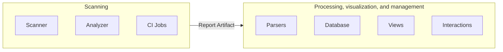

## Architecture

- [Overview](#overview)
- [Severity Levels](https://docs.gitlab.com/ee/user/application_security/vulnerabilities/severities.html)
- [Feedback](feedback/)(Dismiss, create an issue or a Merge Request)

## Overview

The architecture supporting the Secure features is split into two main parts.

### Scanning

The scanning part is responsible for finding vulnerabilities in given resources and exporting results.
The scans are executed in CI jobs via several small projects called [Analyzers](https://docs.gitlab.com/ee/user/application_security/terminology/#analyzer) which can be found in our [Analyzers sub-group](https://gitlab.com/gitlab-org/security-products/analyzers).
The Analyzers are small wrappers around in-house or external security tools called [Scanners](https://docs.gitlab.com/ee/user/application_security/terminology/#scanner) to integrate them into GitLab.
The Analyzers are mainly written in Go and rely on our [Common Go library](https://gitlab.com/gitlab-org/security-products/analyzers/common).

Some 3rd party integrators also make additional Scanners available by following our [integration documentation](https://docs.gitlab.com/ee/development/integrations/secure/), which leverages the same architecture.

The results of the scans are exported as JSON reports that must follow [Secure Report Format](https://docs.gitlab.com/ee/user/application_security/terminology/#secure-report-format) and are uploaded as [CI Job Report Artifacts](https://docs.gitlab.com/ee/ci/jobs/job_artifacts.html#artifactsreports) to make them available for processing after the pipelines completes.

This part is mainly covered by the following groups:

- [Composition Analysis](/handbook/product/categories/#composition-analysis-group)
- [Dynamic Analysis](/handbook/product/categories/#dynamic-analysis-group)
- [Fuzz Testing](/handbook/product/categories/#fuzz-testing-group)
- [Static Analysis](/handbook/product/categories/#static-analysis-group)
- [Vulnerability Research](/handbook/product/categories/#vulnerability-research-group)

### Processing, visualization, and management

Once the data is available as Report Artifact, it can be processed by the [GitLab Rails application](https://gitlab.com/gitlab-org/gitlab) to enable our security features:

- [Security Dashboards](https://docs.gitlab.com/ee/user/application_security/security_dashboard/), Merge Request widget, Pipeline view, etc.
- [Interactions with vulnerabilities](https://docs.gitlab.com/ee/user/application_security/#interacting-with-the-vulnerabilities)
- [Approval rules](https://docs.gitlab.com/ee/user/application_security/#security-approvals-in-merge-requests)
- etc.

Depending on the context, the security reports can be stored in the database or stay as Report Artifacts for on-demand access.

This part is mainly covered by the [Threat Insights group](/handbook/product/categories/#threat-insights-group).

Though, the boundaries can sometimes be a bit blurry so [we're trying to delineate this as clearly as possible](/handbook/engineering/development/sec/delineate-sec/#technical-boundaries).

## ClickHouse Datastore

Key workloads across the Secure features rely on high rates of writes and aggregated analysis across historic data. These types of OLAP scenarios are not well-suited to transactional datastores like PostgreSQL and can benefit from batch-based inserts, high-read ratios, and wide tables.

In these cases, the introduction of [ClickHouse](https://clickhouse.com) to the GitLab technology stack provides an important opportunity to scale Secure features for the future.

ClickHouse as a datastore has the potential to power several key workflows within the section including:

### Security Dashboards

Security dashboards provide historical aggregate data for tracking active vulnerabilities across projects and namespaces. These requests are analytical aggregation queries of read-only data for which ClickHouse is heavily optimized.

Beyond improving the performance of the existing aggregations, use of an OLAP datastore provides more open-ended options in allowing on-demand aggregation by additional fields; i.e. report types and classifications alongside severity.

### Vulnerability Lists

Vulnerability lists provide tabular data and interactivity for reviewing, assessing, and triaging vulnerabilities within projects and namespaces. These requests are high-read, wide-column and (often) filtered. With a shift towards query-based view aggregation, columnar stores provide significant advantages in fetching limited columns for a given table rather than needing full record access.

In addition, with ongoing architecture aimed at reducing persistence to user-interaction such as the work to [Create Vulnerabilities on-the-fly](https://gitlab.com/gitlab-org/gitlab/-/issues/324860) there is a lot of potential for performance improvements in shifting vulnerability finding storage to ClickHouse over PostgreSQL.

## Researches

- [Data model for dependencies information](data-model-for-dependencies-information/)

## Brown bag sessions

Secure team members also share knowledge through [brown bag sessions](https://gitlab.com/gitlab-org/secure/brown-bag-sessions#brown-bag-sessions) on various topics.
