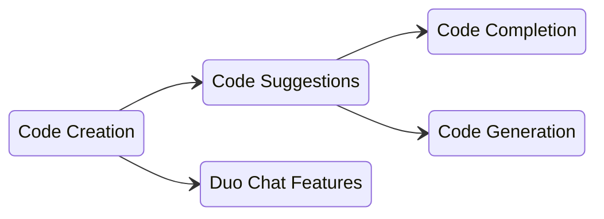

## Team Vision

We envision a world where our innovations in AI-driven code creation not only enhance productivity but also inspire creativity, enabling developers to tackle more complex challenges and push the boundaries of what's possible in software development.

## Team Mission

Develop cutting-edge AI-powered tools that enhance the efficiency and creativity of software engineers. We are committed to providing intelligent code suggestions that not only streamline coding tasks but also elevate the quality of software products. We aim to empower developers worldwide, making complex coding more accessible, and accelerating the creation of exceptional software.

## Team Ownership

Features/capabilities Code Creation owns today:

- Code suggestions: completion + generation
- Code-related slash commands: `/explain`, `/refactor`, `/tests`, `/fix` 
- Repository X-Ray
- Code suggestions context (e.g. open tabs) - partnered with [Create:Editor Extensions Group](/handbook/engineering/development/dev/create/editor-extensions/)

Code Creation is also responsible for evaluations for each of these features which includes:

- Creating datasets in LangSmith and registering them in the [Datasets repository](https://gitlab.com/gitlab-org/modelops/ai-model-validation-and-research/ai-evaluation/datasets/-/blob/main/doc/guidelines/register_dataset.md#registration-process)
- Creating evaluators in [Eli5](https://gitlab.com/gitlab-org/modelops/ai-model-validation-and-research/ai-evaluation/prompt-library/-/tree/main/eli5?ref_type=heads)
- Running evaluations 

## About Code Suggestions

One of the main features we work on in the Create:Code Creation group is Code Suggestions. Here is some quick information to get you started with Code Suggestions.

- [Code Suggestions Engineering Overview](/handbook/engineering/development/dev/create/code-creation/engineering_overview/) - Handbook technical overview of Code Suggestions
- [Code Suggestions Guide](/handbook/engineering/development/dev/create/code-creation/code-suggestions-guide/) - Handbook development guide for engineers
- [Code Suggestions Quick Start](https://docs.gitlab.com/ee/user/gitlab_duo/quick_start/) - GitLab Documentation
- [Difference between Code Completion and Code Generation](https://youtu.be/9dsyqMt9yg4) - YouTube
- [Code Suggestion Documentation](https://docs.gitlab.com/ee/user/project/repository/code_suggestions/) - GitLab Documentation

A lot of the terms we use in this area sound similar and can be confusing at first. Here are the basic terms we use:

- **Code Creation**: The group name and a collection of features relating to providing AI generated code
- **Code Suggestions**: A feature within Code Creation that provides AI-generated code within an IDE
  - **Code Completion**: A short AI-generated suggestion intended to complete an existing line or block of code
  - **Code Generation**: A longer AI-generated suggestion intended to create entire functions, classes, code blocks, etc.
- **Duo Chat**: Another feature that interacts with GitLab Duo Chat to write new code, refactor existing code, or scan code for vulnerabilities

If it helps, here are these terms in a diagram:



## Team Handles

Use this information to connect with the Code Creation group:

| Category                 | Handle                                |
|--------------------------|---------------------------------------|
| GitLab Team Handle       | @gitlab-com/create-team/code-creation |
| Slack Channel            | #g_code_creation                      |
| Slack Handle (Engineers) | @code-creation-engs                   |

## Commonly Monitored Issue Lists

- [Planning Issues](https://gitlab.com/gitlab-org/create-stage/-/issues/?sort=due_date&state=opened&label_name%5B%5D=group%3A%3Acode%20creation&label_name%5B%5D=Planning%20Issue&first_page_size=20)
- [OKRs](https://gitlab.com/gitlab-com/gitlab-OKRs/-/issues/?sort=title_asc&state=opened&label_name%5B%5D=devops%3A%3Acreate&label_name%5B%5D=group%3A%3Acode%20creation&first_page_size=20)
- [Workflow Board](https://gitlab.com/groups/gitlab-org/-/boards/5998095)
- [Reliability](https://gitlab.com/gitlab-org/gitlab/-/boards/4227439?not[label_name][]=type%3A%3Afeature&label_name[]=section%3A%3Adev&label_name[]=devops%3A%3Acreate&label_name[]=group%3A%3Acode%20creation)
- [Security](https://gitlab.com/gitlab-org/gitlab/-/issues/?sort=due_date&state=opened&label_name%5B%5D=security&label_name%5B%5D=devops%3A%3Acreate&label_name%5B%5D=group%3A%3Acode%20creation&amp;not%5Blabel_name%5D%5B%5D=type%3A%3Afeature&first_page_size=20)
- [InfraDev Issues](https://gitlab.com/gitlab-org/gitlab/-/issues/?sort=due_date&state=opened&label_name%5B%5D=devops%3A%3Acreate&label_name%5B%5D=infradev&label_name%5B%5D=group%3A%3Acode%20creation&amp;not%5Blabel_name%5D%5B%5D=type%3A%3Afeature&amp;not%5Blabel_name%5D%5B%5D=severity%3A%3A4&first_page_size=200)

## Team Members

The following people are permanent members of the Code Creation Team:



You can reach the whole team on GitLab issues/MRs by using the `@code-creation-team` handle.

## Stable Counterparts

The following members of other functional teams are our stable counterparts:

| Category          | Counterpart                                                                          |
|-------------------|--------------------------------------------------------------------------------------|
| Product Manager   |                                                 |
| Technical Writing |                                                 |
| UX                | TBD                                                                                  |
| Support           | [TBD](/handbook/support/support-stable-counterparts/)                                |
| AppSec            | [TBD](/handbook/security/product-security/application-security/stable-counterparts/) |

## Partner Groups

Here are other groups within GitLab that we work closely with:

### Create Stage

- [Editor Extensions](/handbook/engineering/development/dev/create/editor-extensions/)
  - Collaborate on Code suggestions context (e.g. open tabs)

### AI Powered Stage

- [AI Powered Stage](/handbook/engineering/development/data-science/ai-powered)
- [AI Framework](/handbook/engineering/development/data-science/ai-powered/ai-framework/)
  - Collaborate on datasets for evaluations
- [AI Model Validation](/handbook/engineering/development/data-science/ai-powered/model-validation/)
- [Custom Models](/handbook/engineering/development/data-science/ai-powered/custom-models/)
- [Duo Chat](/handbook/engineering/development/data-science/ai-powered/duo-chat/)
  - Collaborate on code related slash commands: `/explain`, `/refactor`, `/tests`, `/fix`

### ModelOps Stage

- [ModelOps Stage](/handbook/engineering/development/data-science/modelops/)
- [MLOps](/handbook/engineering/development/data-science/modelops/mlops/)

## Engineering Onboarding

To help get started as a developer with the Create:Code Creation team, we have created an
[onboarding issue template](https://gitlab.com/gitlab-com/create-stage/code-creation/team-tasks/-/issues/new?issuable_template=developer_onboarding).

## Group Processes

### Milestone Meetings

Our team operates on monthly milestones with one key meeting per milestone cycle. This meeting combines both the retrospective for the previous milestone and the kickoff for the upcoming milestone. To accommodate our globally distributed team, this meeting is held twice each milestone at different times - once in an APAC-friendly time zone and once in an EMEA/AMER-friendly time zone. This approach ensures all team members have the opportunity to participate live in the meeting that best fits their schedule.

The Combined Retrospective/Kickoff Meeting serves two purposes: reviewing the outcomes from our async retrospectives of the completed milestone, and aligning on objectives, discussing requirements, and assigning responsibilities for the upcoming milestone.

All of our meetings are recorded and uploaded to the [Code Creation YouTube Playlist](https://www.youtube.com/playlist?list=PL05JrBw4t0KoZOUC-DfaJOzFb6w6hG198). Some meetings are marked as private, so internal team members will need to switch to use the [Unfiltered YouTube account](/handbook/marketing/marketing-operations/youtube/#unable-to-view-a-video-on-youtube).

### Milestone Planning

See the [Code Creation Milestone Planning](/handbook/engineering/development/dev/create/code-creation/milestone_planning/) for more information on the milestone planning process.

### Weekly Status Updates

We maintain a practice of weekly async status updates to ensure clear communication, track progress effectively, and maintain transparency across our team. This process aligns with our core values by fostering collaboration, driving results, and promoting efficiency through structured communication.

#### Timing and Frequency

- Team members post updates every Wednesday
- Updates are required for all assigned issues
- Multiple updates may be needed if working on multiple issues

#### Template

This is the template to use for the updates

```markdown
## Async Status Update yyyy-mm-dd

- **Progress & Status**: _What progress have you made? What's the current state?_
- **Next Steps**: _What are your planned next actions?_
- **Blockers**: _Are you blocked or need assistance with this?_
- **How confident are you that this will make it to the current milestone?**
    - [ ] Not confident
    - [ ] Slightly confident
    - [ ] Very confident

_Remember to update the workflow label!_

/cc @mnohr @jordanjanes
```

Be sure to tag the engineering manager, product manager, and any team members you are collaborating with.

#### Best practices

- Be specific and concise in updates
- Always include next steps, even if they're tentative
- Flag blockers early - don't wait until they become critical
- Use the template consistently for easier scanning
- Link to relevant issues or documentation when appropriate

## Other Related Pages

- Product Categories: [Code Creation](/handbook/product/categories/#code-creation-group)
- Direction: [Code Suggestion Direction](https://about.gitlab.com/direction/create/code_creation/code_suggestions/)

## Code Suggestion Dashboards

1. [Code Suggestions Metrics](https://10az.online.tableau.com/#/site/gitlab/views/PDCodeSuggestions/ExecutiveSummary) ([README](https://10az.online.tableau.com/#/site/gitlab/views/PDCodeSuggestions/README?:iid=1)) - usage, acceptance rate, latency, error rates, etc (Tableau)
1. [General Metric Reporting](https://10az.online.tableau.com/#/site/gitlab/views/DRAFTCentralizedGMAUDashboard/MetricReporting?:iid=1) - can find code suggestions rate limiting, X-Ray usage, etc (Tableau)
1. [Log Visualization Dashboard](https://log.gprd.gitlab.net/app/dashboards#/view/6c947f80-7c07-11ed-9f43-e3784d7fe3ca?_g=(refreshInterval:(pause:!t,value:0),time:(from:now-6h,to:now))) - another view of latency, response codes, number of requests, etc (Kibana)
1. [Code suggestions latency](https://log.gprd.gitlab.net/app/r/s/mMaY3): Breakdown of server-side latency for code suggestions (Kibana)
1. [X-Ray Dependency Parsing Errors Dashboard](https://log.gprd.gitlab.net/app/dashboards#/view/a828978b-8f41-489a-9e3b-aa71937e25b9?_g=h@e98e959): Breakdown of parsing errors triggered by X-Ray dependency scanning (Kibana)
1. [Metrics Dashboard](https://dashboards.gitlab.net/d/stage-groups-code_creation/stage-groups3a-code-creation3a-group-dashboard?orgId=1) (Grafana)
1. [Error Budget](https://dashboards.gitlab.net/d/stage-groups-detail-code_creation/stage-groups-code-creation-group-error-budget-detail?orgId=1) (Grafana)
