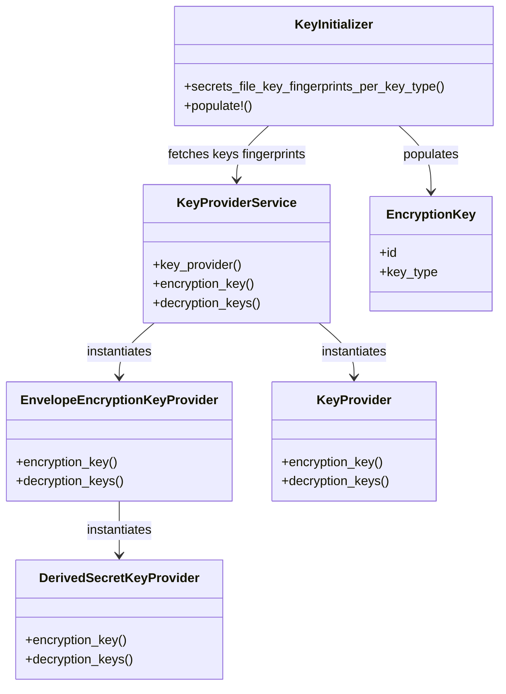



## Introduction

We need a solution to rotate GitLab's encryption keys (used to protect sensitive data at rest) without requiring system downtime, addressing a significant security and operational risk for both our customers and GitLab.com. The proposed solution enables zero-downtime key rotation through support for multiple concurrent keys, automated background re-encryption, and a deployment workflow optimized for multi-node installations, allowing organizations to maintain security best practices without service interruption.

## Objectives

This design document addresses a big inconvenience in GitLab's current encryption key management system.
Currently, GitLab's encryption keys, which protect sensitive data at rest in the database, cannot be rotated without
taking the entire system offline. This limitation poses significant business risks:

1. In the event of a key compromise, customers would face service disruption during key rotation
2. For GitLab.com and large enterprise deployments, the required downtime makes regular key rotation practically
  impossible
3. With the expansion of GitLab's Dedicated and Cells infrastructure, the risk of key compromise increases, as does
  the operational complexity of key management across multiple instances
4. [In Cells 1.0, all cells will use the same secrets](https://gitlab.com/groups/gitlab-org/-/epics/13166#proposal),
  wich further increases the risk and impact of any key exfiltration.

The proposed solution enables zero-downtime encryption key rotation through:

- Support for multiple concurrent encryption keys
- Automated background re-encryption of data
- Clear visibility into key usage and rotation progress through a new admin interface
- A deployment workflow optimized for multi-node installations

Key business benefits:

- Eliminates service disruption during security-critical key rotations
- Enables compliance with security policies requiring regular key rotation
- Reduces operational risk in multi-instance deployments, especially in the context of Cells
- Provides foundation for secure data movement between GitLab instances, especially when using the Cells Org Mover

The implementation is planned across seven iterations, focusing on maintaining system stability while introducing this
capability. This project directly supports GitLab's scaling initiatives and enterprise security requirements.

## Overview

Provide GitLab administrators with a way to:

- Introduce a new encryption key that will replace the previous one for encrypting data. The new key as well as all
  previous keys are used for decryption.
- Provide a deployment workflow for multi-node installations where the new encryption key is first introduced at the
  head of the keys array (so that it's first only used for decryption), then when the new key is deployed to all nodes,
  it would need to be moved to the tail of the keys array, so that it's used for encryption from now on.
  This is important in the scenario where an administrator adds a new key to `config/secrets.yml`, and then kicks off a
  new deployment. During the deployment phase, some of the pods/VMs will not have the new key. It's critical that the
  new pods/VMs don't start re-encrypting using the new key until the deployment is completed.
  When the deployment completes successfully, all pods/VMs now have the new key and the administrator can move the key
  to be last in the keys array so that it becomes the current encryption key.
- Introduce an always-running background process (with automated throttling to avoid degrading database performance) to take
  care of progressive re-encryption while GitLab stays online. The process would look up and re-encrypt any data
  encrypted with the non-current encryption key.
- Monitor the progress for the re-encryption of data encrypted with legacy keys, and overall usage of each key.
- Visualize keys and their usage in the admin UI.

### Non-goals

This blueprint does not cover the following:

- Introduce scripts to re-encrypt all the data while GitLab is offline. While there might be customer use-cases for
  this, we won't implement this initially.
- Other keys & secrets such as `secret_key_base`, `otp_key_base`, `openid_connect_signing_key`, and
  `encrypted_settings_key_base`, but ideally it should describe a solution that's generic enough to be applied to other
  secrets without too much changes in the future.
- Possibility to rotate the encryption keys from the Admin UI (this would require writing to the `config/secrets.yml`
  at runtime, which is impossible with most deployment strategies).
- Possibility to pull encryption keys from an external secrets manager (e.g. GCP and AWS KMS).
  While this is related and more secure, it should be solved with a dedicated proposal.
- Decision to use [envelope encryption or not](https://cloud.google.com/kms/docs/envelope-encryption).
  While envelope encryption has many benefits and is supported natively by Active Record Encryption, the decision to
  use it is independent from this proposal, and should be solved with a dedicated proposal.

### Pre-requisites

The idea is based on 2 pre-requisites:

1. Support for multiple encryption keys: this allows online rotation of the secret
1. Ability to know what key was used to encrypt an attribute: this allows to re-encrypt data encrypted with a legacy key

### Rotation workflow

1. When a key needs to be rotated, just add a new one to the tail of the
   `db_key_base` / `active_record_encryption_primary_key` / `active_record_encryption_deterministic_key` arrays in
   `config/secrets.yml`, and restart GitLab. In multi-nodes installations, the new key deployment should happen in two
   phases: First add the key at the head of the keys array and wait for it to be deployed everywhere; then move the key to
   the tail of the keys array and start a new deployment.
1. Once deployed at the tail of the keys array, the new key becomes the current encryption key.
1. The decryption process uses the key that was used to encrypt the data.
   In the case the encryption key ID isn't stored alongside the encrypted data, the decryption process tries
   each key (in the order they appear in the key arrays), until it can decrypt the data.
   That way, there's no need to bring GitLab down to mass-re-encrypt all data.
1. A background process continuously runs to re-encrypt any data that was encrypted with the non-current encryption key.
   The whole re-encryption process would likely take a long time on big instances (e.g. GitLab.com), but as long as we
   have a limiting/throttling mechanism in place, it shouldn't impact the database stability.
   The background process becomes a no-op as soon as all the data is re-encrypted with the current encryption key.
1. A new dedicated admin page allows to monitor the encryption key usage:
   - What percentage of data is encrypted with each active encryption/decryption keys?
   - What's the expected ETA for everything to be re-encrypted with the current encryption key?
   - What keys can be removed from `config/secrets.yml` (i.e. no data is encrypted with this key anymore)?

### "Encryption keys" admin page mockup


## Decisions

## Implementation Details

### Keys tracking

Keys lifecycle information will be stored in a new `encryption_keys` table, including:

- Key type `key_type`, an enum:
  - `db_key_base`
  - `db_key_base_32`
  - `db_key_base_truncated`
  - `active_record_encryption_primary_key`
  - `active_record_encryption_deterministic_key`
- Key fingerprint (4 hex chars), (inspired by
  <https://github.com/rails/rails/blob/v7.0.8.6/activerecord/lib/active_record/encryption/key.rb#L24>).
- Key creation time `created_at`: the first time it appeared in the `config/secrets.yml` file.
- Key deletion time `removed_at`: the time when the key disappeared from the `config/secrets.yml` file.

Keeping track of this information in the database provides the following capabilities:

- See the current encryption and decryption keys
- Keep track of keys that were used in the past

Later on, we could also keep statistics about keys usage in a separate table.

Note: The actual keys used to encrypt/decrypt data still come from the `config/secrets.yml` file.

#### During initialization

During initialization, if a new key is discovered in `config/secrets.yml`, the following 3 steps happens:

1. If the new key's fingerprint collides with an existing non-removed key fingerprint, the application fail to start
   as it would introduce ambiguity when picking the decryption key at decryption time.
   In that case, the key should be removed and replaced with another key.
   Note that a rake task will be provided to perform this collision check before the key is actually added to `config/secrets.yml`.
1. A record for the new key is created in the `encryption_keys` table.
1. If a key is present in `encryption_keys` but not in `config/secrets.yml` anymore, the record's `removed_at` is set.
   If the key was still in use (based on the usage data we will regularly compute), an error is raised to prevent the
   application from starting without the key.

### Encryption key selection

We'll introduce a `KeyProviderService` that will abstract the encryption/decryption keys selection so that's it's
framework-agnostic (to ease the transition from legacy encryption framework to Active Record Encryption).

### Architecture



### Changes required for `attr_encrypted`

The `attr_encrypted` gem supports dynamic key by passing a method name as the `key:` option, e.g.

```ruby
attr_encrypted :email, key: :db_key_base_32
```

We're taking advantage of that so that the key(s) used for encryption/decryption are retrieved from
`Gitlab::Database::Encryption::KeyProviderService`.

See the PoC code at <https://gitlab.com/gitlab-org/gitlab/-/merge_requests/177748/diffs?commit_id=828f2470e5d034e77b7c094952ff2d7676cf962f#5d31008bc68bfcfa3787a3338a808f53c51a6ad5>.

### Changes required for `TokenAuthenticatable`

Changes are similar to what's done for `attr_encrypted`.

See the PoC code at <https://gitlab.com/gitlab-org/gitlab/-/merge_requests/177748/diffs?commit_id=828f2470e5d034e77b7c094952ff2d7676cf962f#a99cfc117c9fe8408818387e8197ef3186848efe>.

### Implementation of "Encryption keys" admin page

See the PoC code at <https://gitlab.com/gitlab-org/gitlab/-/merge_requests/177838/diffs?commit_id=a5cafd65bb706fd1ad2784d7a35592443f02980e>.

### Background re-encryption process

Following is a naive implementation of what the background re-encryption process would roughly do.

```ruby
# ActiveRecord::Encryption
def reencrypts_active_record_encryption(model, attributes, key_fingerprint)
  attributes.each do |attr|
    model.where("NOT (#{attr}->'h'->'i') ? :value", value: ::Base64.strict_encode64(key_fingerprint))
      .find_in_batches do |batch|
      batch.each do |record|
        record.encrypt # this forces the re-encryption of all encrypted attribute
      end
    end
  end
end

def reencrypts_legacy_encryption(model, attributes, encryption_key_id)
  model.where.not(encryption_key_id: encryption_key_id).find_in_batches do |batch|
    batch.each do |record|
      attributes.each do |attr|
        record.public_send(:"#{attr}=", record.public_send(attr))
      end
      record.save!
    end
  end
end

ApplicationRecord.descendants.select { |d| d.deterministic_encrypted_attributes.present? }.each do |model|
  reencrypts_active_record_encryption(
    model,
    model.deterministic_encrypted_attributes,
    Gitlab::Database::Encryption::KeyProviderService.new(:active_record_encryption_deterministic_key).encryption_key.id
  )
end

ApplicationRecord.descendants.select { |d| d.encrypted_attributes.present? }.each do |model|
  reencrypts_active_record_encryption(
    model,
    model.encrypted_attributes,
    Gitlab::Database::Encryption::KeyProviderService.new(:active_record_encryption_primary_key).encryption_key.id
  )
end

# TokenAuthenticatable
encryption_key = EncryptionKey.find_by_fingerprint(Gitlab::CryptoHelper.encryption_key.id)

ApplicationRecord.descendants.select { |d| d.include?(TokenAuthenticatable) && d.encrypted_token_authenticatable_fields.present? }.each do |model|
  encrypted_fields = model.encrypted_token_authenticatable_fields

  reencrypts_legacy_encryption(model, encrypted_fields, encryption_key.id)
end

# attr_encrypted
ApplicationRecord.descendants.select { |d| d.attr_encrypted_attributes.present? }.each do |model|
  encrypted_fields = model.attr_encrypted_attributes
  key_type = encrypted_fields[encrypted_fields.keys.first][:key]
  current_key_fingerprint = Gitlab::Database::Encryption::KeyProviderService.new(key_type).encryption_key.id

  reencrypts_legacy_encryption(model, encrypted_fields, EncryptionKey.find_by_fingerprint(current_key_fingerprint).id)
end
```

The final implementation could build upon
[the Background migration framework, which includes a throttling mechanism](https://docs.gitlab.com/ee/development/database/batched_background_migrations.html#throttling-batched-migrations).

Also, using the Background migration framework, we could have one background migration per table to be re-encrypted,
and report [its progress](https://docs.gitlab.com/ee/development/database/batched_background_migrations.html#monitor-the-progress-and-status-of-a-batched-background-migration)
directly in the admin UI.

### Data encrypted through `ActiveRecord::Encryption`

The `ActiveRecord::Encryption` framework already fulfills the pre-requisites (except for rotating deterministic keys,
but we might work around that, or even implement proper support for it).

### Data encrypted through `attr_encrypted` and `TokenAuthenticatable`

Currently, `attr_encrypted` and `TokenAuthenticatable` don't store the fingerprint of the key used to encrypt an attribute.
We could introduce a new `encryption_key_id` column referencing the `EncryptionKey#id` column to tables that include
encrypted columns.

A single `encryption_key_id` column per table is enough since the same key is used to encrypt all encrypted attributes
for a given record.

Once introduced, a post-deploy migration should populate all rows with the current encryption key ID.

The implementation of `attr_encrypted` and `TokenAuthenticatable` would need to be modified to populate the
`encryption_key_id` attribute.

**In the future, we should progressively migrate all the usage of `attr_encrypted` and `TokenAuthenticatable` to
`ActiveRecord::Encryption`.**

### Other usages of `db_key_base`

There are few places where the `db_key_base` secrets are used (mostly in JWT generation):

- `Auth::DependencyProxyAuthenticationService#secret` in `app/services/auth/dependency_proxy_authentication_service.rb`
- `Gitlab::Geo::Oauth::LogoutState#with_cipher` in `ee/lib/gitlab/geo/oauth/logout_state.rb`
  - Note that in `Gitlab::Geo::Oauth::LoginState#key`, we use `Gitlab::Application.credentials.secret_key_base`...
- `Gitlab::ConanToken#secret` in `lib/gitlab/conan_token.rb`
- `Gitlab::JWTToken#secret` in `lib/gitlab/jwt_token.rb`
- `Gitlab::LfsToken::HMACToken#secret` in `lib/gitlab/lfs_token.rb`

In all these cases, we should probably follow the general practice:

- Encrypt with the current active key
- Try to decrypt with all keys until one works

### Rotation of deterministic key

Deterministic encryption allows to query a table for a specific column value (e.g. personal access tokens are currently
queried by their digest, but we should migrate them to be encrypted instead so that we can rotate the key without
invalidating all the tokens).

`ActiveRecord::Encryption` doesn't support deterministic keys rotation at the moment, support for it should be
implemented either in GitLab, or in Rails directly.

That said, we might be able to work around this limitation by specifying a custom key provider so that under the hood
it uses the logic from `DerivedSecretKeyProvider` but with the `deterministic: true` option which makes the encryption
process generate the initialization vector based on the encrypted content instead of being random, i.e.

```ruby
encrypts :attr, deterministic: true, key_provider: Gitlab::Database::Encryption::KeyProviderService.new(:active_record_encryption_deterministic_key)
```

## Proof of Concept merge requests

### Multiple encryption key support

The following merge request shows that support of multiple encryption keys is possible today for both `attr_encrypted`
and `TokenAuthenticatable`: <https://gitlab.com/gitlab-org/gitlab/-/merge_requests/177748>

What's missing from this PoC is [the second pre-requisite](#pre-requisites): the ability to know
what key was used to encrypt an attribute. It's possible to add support for this with the introduction of a new
`encryption_key_id` column per table.

### Encryption keys services and admin UI

The following merge request implements the basis for encryption keys services and admin UI:
<https://gitlab.com/gitlab-org/gitlab/-/merge_requests/177838>

What's missing from this PoC is:

- the automated background process to re-encrypt legacy-key-encoded data
- key usage statistics in the admin

## Iteration plan

### Iteration 1: Introduce encryption key services and support multiple `db_key_base`

1. Introduce `KeyProviderService` to abstract `#encryption_key` and `#decryption_keys` similarly to how `ActiveRecord::Encryption` does.
1. Implement support for multiple keys in `attr_encrypted` and `TokenAuthenticatable` but raise if more than one key is
   defined (until iteration 4 is done).
1. Implement support for multiple keys in other usages of `db_key_base`

PoC MR: <https://gitlab.com/gitlab-org/gitlab/-/merge_requests/177748/diffs>

### Iteration 2: `EncryptionKey` model implementation

1. Implement the keys tracking system in the database
   - Create a new `encryption_keys` table to store keys information (id, fingerprint, status, timestamps)
   - Add collision detection mechanism

PoC MR: <https://gitlab.com/gitlab-org/gitlab/-/merge_requests/177838/diffs?commit_id=aa0fbdb1ddd422e54a4067108dbddc93315c11e7>

### Iteration 3: Encryption keys initializer

1. Implement initializer calling `KeyInitializer.populate!` to read keys from `config/secrets.yml` and populate/update the database.

PoC MR: <https://gitlab.com/gitlab-org/gitlab/-/merge_requests/177838/diffs?commit_id=939535f3016dd607175e74b41988e137d3d2b203>

### Iteration 4: Key usage tracking in models

1. Add the `encryption_key_id` column to all models that use `attr_encrypted` and `TokenAuthenticatable`
   - Populate the column with the current encryption key

PoC MR: <https://gitlab.com/gitlab-org/gitlab/-/merge_requests/177838/diffs?commit_id=8817d3fdaa22ac5a1fbc54c6047db383cfa9bd7e>

### Iteration 5: Encryption keys admin interface

1. Create the admin interface for keys tracking
   - Develop the UI for viewing key status, and usage statistics

PoC MR: <https://gitlab.com/gitlab-org/gitlab/-/merge_requests/177838/diffs?commit_id=31951095cf5227cbbfa988faf39412c07cd59933>

### Iteration 6: Re-encryption Process

1. Implement background re-encryption process
   - Build on top of background migration framework
   - Ensure database load is under control during re-encryption
   - Support `ActiveRecord::Encryption`, `attr_encrypted`, and `TokenAuthenticatable`
1. Develop progress tracking for re-encryption
   - Add database columns to track re-encryption progress
   - Update admin interface to display re-encryption status

### Iteration 7: Additional tooling

1. Create rake task to detect key collision in advance
1. Develop safeguards against accidental key deletion

## References

- <https://gitlab.com/gitlab-org/gitlab/-/issues/25332>
- <https://gitlab.com/gitlab-org/gitlab/-/issues/26243>
- <https://gitlab.com/groups/gitlab-org/-/epics/10193>
- <https://gitlab.com/gitlab-com/gl-infra/gitlab-dedicated/team/-/issues/594> (confidential)
- <https://gitlab.com/gitlab-org/gitlab/-/issues/228663> (confidential)
- <https://gitlab.com/gitlab-com/gl-security/security-department-meta/-/issues/756> (confidential)
- <https://gitlab.com/gitlab-org/gitlab/-/issues/244855> (confidential)
- <https://gitlab.com/groups/gitlab-com/gl-infra/-/epics/443> (confidential)
- <https://gitlab.com/gitlab-com/gl-infra/production-engineering/-/issues/12927> (confidential)

## Who

DRIs:

<!-- vale gitlab.Spelling = NO -->

| Role                | Who                                            |
|---------------------|------------------------------------------------|
| Author              | Rémy Coutable, Principal Engineer              |

<!-- vale gitlab.Spelling = YES -->
