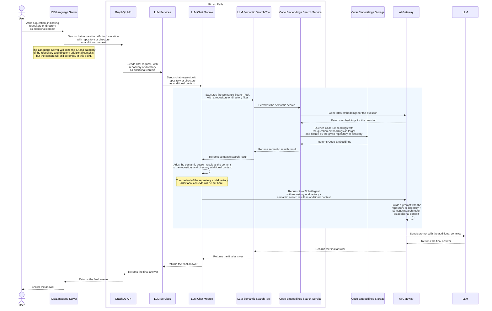
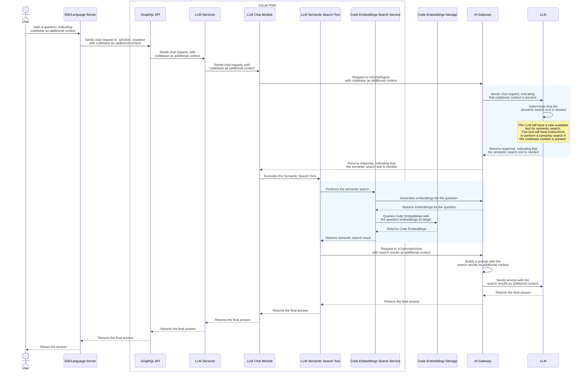
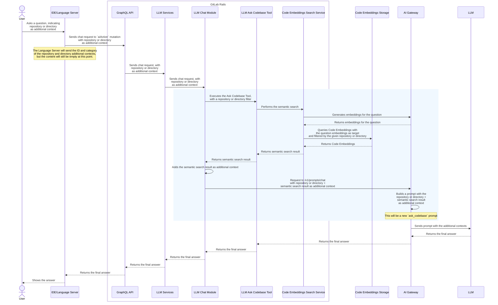

---
# This is the title of your design document. Keep it short, simple, and descriptive. A
# good title can help communicate what the design document is and should be considered
# as part of any review.
title: Codebase as Chat Context
status: proposed
creation-date: "2025-04-02"
authors: [ "@partiaga", "@tgao3701908" ]
coaches: [ "@jessieay", "@dgruzd" ]
dris: [ "@jordanjanes", "@mnohr" ]
owning-stage: "~devops::create"
participating-stages: []
# Hides this page in the left sidebar. Recommended so we don't pollute it.
toc_hide: true
---

<!--

The canonical place for the latest set of instructions (and the likely source
of this file) is
[content/handbook/engineering/architecture/design-documents/_template.md](https://gitlab.com/gitlab-com/content-sites/handbook/-/blob/main/content/handbook/engineering/architecture/design-documents/_template.md).

Document statuses you can use:

- "proposed"
- "accepted"
- "ongoing"
- "implemented"
- "postponed"
- "rejected"

-->

<!-- Design Documents often contain forward-looking statements -->
<!-- vale gitlab.FutureTense = NO -->

<!-- This renders the design document header on the detail page, so don't remove it-->


<!--
Don't add a h1 headline. It'll be added automatically from the title front matter attribute.

For long pages, consider creating a table of contents.
-->

## Summary

We are introducing the capability to include **Codebase** as **additional contexts** to **[Duo Chat](https://docs.gitlab.com/user/gitlab_duo_chat/) requests**. This can refer to the entire repository or to a sub-directory under the repository.

To achieve this, we will index the codebase as vector embeddings, referred to as **Code Embeddings**.

When the user asks a question on Duo Chat, the system executes a semantic search over the Code Embeddings to retrieve relevant context from repositories, which is then processed by large language models to generate helpful responses.

This new feature will be available to GitLab **Premium** or **Ultimate** users with the [**Duo Pro** or **Duo Enterprise**](https://docs.gitlab.com/subscriptions/subscription-add-ons/) add-ons.

**Epic:** The work for this feature is tracked in [this epic](https://gitlab.com/groups/gitlab-org/-/epics/16910).

## Motivation

Currently, we don't do a great job of helping customers understand their repository and code base. Competitors support a broader aperture -- a user can ask questions about an entire repository, or scope the context to multiple folders, multiple files, and portions of code. This functional gap is commonly mentioned by customers, and here's a [recent summary](https://docs.google.com/presentation/d/1oyuqOCzR4wzWa6Llo-EwwHdsTxMetd17X9bPYf-YMHA/edit#slide=id.g32a4294fe40_0_77) of research in this space. [LLM's are only as good as the context we give them](https://nmn.gl/blog/ai-understand-senior-developer), so it is important that we achieve parity with our competitors in this area.

This initiative aims to bridge this critical functional gap in GitLab's [Duo Chat](https://docs.gitlab.com/user/gitlab_duo_chat/) offering by enabling users to interact with their entire codebase through natural language queries. This capability allows users to more effectively understand, navigate, and plan changes to their repositories -- a feature already offered by competing products.

### Goals

The main goal is to add Codebase as an additional context to [Duo Chat](https://docs.gitlab.com/user/gitlab_duo_chat/). In this initiative, this is scoped to Repository and Directory. A semantic search will then be done over the Repository or Directory, with the results used to enhance the Chat prompt sent to the AI model.

To support semantic search, the creation of code embeddings is included in the initial scope of this work. Indexing of the default branch will be done for the first phase of the work, with feature branches indexed in the second phase.

We will only generate embeddings for projects or namespaces with [Duo enabled](https://docs.gitlab.com/user/get_started/getting_started_gitlab_duo/).

### Non-Goals

The following is out of scope for this initiative, but could theoretically be built upon it:

- Codebase as additional context for Agentic Duo Chat.
- Codebase as additional context for Duo Chat Slash Commands.
- Codebase as additional context for Code Suggestions.
- Support for indexing and querying locally changed files as vector embeddings.
- A Knowledge Graph representation of the codebase as additional context to Duo Chat.

_Please see [Next Steps and Future Proofing](#next-steps-and-future-proofing) for proposed plans regarding the above topics._

## Proposal

In order to support **Codebase as Chat Context**, we need to:

1. Introduce **Code Embeddings**
    - This is a vector representation of files in the codebase.
    - This includes a pipeline to index the codebase as vector embeddings
    - This gives the ability to perform a semantic search over the embeddings
    - This will be developed in 2 phases:
        - Phase 1: Support code embeddings on the main branch
        - Phase 2: Support code embeddings on feature branches

1. Update **[Duo Chat](https://docs.gitlab.com/user/gitlab_duo_chat/)** to support **codebase as additional context**.
    - When asking a question on Chat, the user will have the option to include the following as contexts:
        - _repository_ - refers to the entire codebase of a project
        - _directory_ - this is a "subset" of the _repository_, and refers to a subfolder in a project
    - When a _repository_ is selected as additional context
        - a semantic search is done over the **Code Embeddings** representation of the files in the repository. The search result is then used to enhance the Chat prompt sent to the AI model.
    - When a _directory_ is selected as additional context:
        - a semantic search is done over the **Code Embeddings** representation of the files in the directory. The search result is then used to enhance the Chat prompt sent to the AI model.
        - as an additional consideration: if a directory only has a few files, the file contents are included directly as additional context to enhance the Chat prompt sent to the AI model.

## Design and implementation details

### Components

This initiative introduces or updates the following components:

#### Code Embeddings

_Please refer to the **[Code Embeddings blueprint](./code_embeddings.md)** for the detailed design of this component._

This is a vector representation of files in the Codebase. We will introduce an indexing pipeline to generate embeddings when a change is pushed to a branch. We will also introduce the capability to search over these embeddings.

**Indexing the Code Embeddings**

- The changes are done on both the [Gitlab Elasticsearch Indexer](https://gitlab.com/gitlab-org/gitlab-elasticsearch-indexer) and [GitLab Rails](https://gitlab.com/gitlab-org/gitlab).
- On Rails, we will make use of the [AI Context Abstraction Layer](../ai_context_abstraction_layer/).
- We will make use of a new **Code Parser** library to parse the code files into logical chunks before generating embeddings on those chunks.
  - The Code Parser lives in its own repository so that it can be used in different projects.
  - For further design and implementation details, please see the [One Parser proposal](https://gitlab.com/groups/gitlab-org/-/epics/16210).

**Searching the Code Embeddings**

- The changes will be done on [GitLab Rails](https://gitlab.com/gitlab-org/gitlab)
- We will make use of the [AI Context Abstraction Layer](../ai_context_abstraction_layer/) to perform a search on the embeddings.

#### Duo Chat

**[Duo Chat](https://docs.gitlab.com/user/gitlab_duo_chat/)** is already an existing AI feature on GitLab.

For details on the current Duo Chat workflow and architecture, please refer to the following documentations:

- [How a Chat prompt is constructed](https://docs.gitlab.com/development/ai_features/duo_chat/#how-a-chat-prompt-is-constructed)
- [GraphQL API (`aiAction`) flow](https://docs.gitlab.com/development/ai_features/#graphql-api)
- [Duo Chat process flow](https://gitlab.com/gitlab-org/modelops/applied-ml/code-suggestions/ai-assist/-/blob/main/docs/duo_chat.md)
- [Duo Chat tools](https://gitlab.com/gitlab-com/content-sites/handbook/-/blob/main/content/handbook/engineering/architecture/design-documents/prompts_migration/_index.md#duo-chat-tools)

In this initiative, we will introduce changes on the [GitLab Language Server](https://gitlab.com/gitlab-org/editor-extensions/gitlab-lsp), [GitLab Rails](https://gitlab.com/gitlab-org/gitlab), and the [GitLab AI Gateway](https://gitlab.com/gitlab-org/modelops/applied-ml/code-suggestions/ai-assist/). For further implementation details, please proceed to the [Adding the Codebase as Context on Duo Chat](#adding-the-codebase-as-context-on-duo-chat) section below.

### Adding the Codebase as Context on Duo Chat

The diagram below shows the workflow for including codebase (repository or directory) semantic search results as additional context. The areas highlighted in blue are where we'll introduce new changes.



#### Additional Context Category

We will add one additional context category: `repository`. If a directory is given, it will be considered a `repository` additional context, with the relative path of the directory specified in the `metadata`.

#### Unit Primitives

We will add the following unit primitives as part of this initiative:

**Include Context**

- `include_repository_context` - used by both the Language Server and AIGW

**Tool**

- `codebase_search` - used by Rails, for the [Semantic Search Tool](#duo-semantic-search-tool)

**Embeddings Generation**

- `generate_embeddings_codebase` - unit primitive used for the embeddings generation endpoint ([`/v1/proxy/vertex-ai`](https://gitlab.com/gitlab-org/modelops/applied-ml/code-suggestions/ai-assist/-/blob/main/ai_gateway/api/v1/proxy/vertex_ai.py#L31))

#### Code Embeddings Search Service

This is a service class that handles the calls to the **Code Embeddings**. This makes use of the [AI Context Abstraction Layer](../ai_context_abstraction_layer/). For details on how this is done, please refer to the **Search** section in the [Code Embeddings blueprint](./code_embeddings.md).

#### Duo Semantic Search Tool

This is a new [Duo Chat tool](https://docs.gitlab.com/development/ai_features/duo_chat/#adding-a-new-tool) that will be introduced in this initiative.

Similar to the [Slash Command Tools](https://gitlab.com/gitlab-org/gitlab/-/blob/30817374f2feecdaedbd3a0efaad93feaed5e0a0/ee/lib/gitlab/llm/completions/chat.rb#L120), there is no need to have LLM infer whether the tool is needed. This tool will be called as long as the `repository` additional context is present.

On Rails, we will introduce an LLM Tool class that will call the **Code Embeddings Search Service** to fetch the matching embeddings of a Chat question. This new **Semantic Search Tool** will be called from the LLM Chat module, with the search results then included as the _content_ of either the `repository` additional context. The Chat request is then sent to AIGW with the new additional contexts.

#### API Changes - Duo Chat Available Features

The Language Server calls the [GraphQL query `{currentUser { duoChatAvailableFeatures } }`](https://docs.gitlab.com/api/graphql/reference/#currentuser) to fetch the list of available Duo Chat features.

As part of this initiative, we will add the `include_repository_context` unit primitive to this list of features.

#### API Changes - Chat Request

The [GraphQL mutation used by Duo Chat (`aiAction`)](https://docs.gitlab.com/development/ai_features/#graphql-api) already accepts `additionalContext` as a parameter for a [`chat` input](https://docs.gitlab.com/development/ai_features/#graphql-api).

With the [`repository` additional context category](#additional-context-category), the `chat` input to the `aiAction` mutation should then look like:

**For `repository` as additional context**

```graphql
mutation newChatMessage {
  aiAction(
    input: {
      chat: {
        content: "the user question"
        additionalContext: [{
          category: "repository",
          id: "the-project-id",
          content: "", # should be empty
          metadata: {
            directory: "some/dir" # this is optional, specified when the user selects directory as an additional context
            branch: "some-branch" # including the branch is a second phase iteration
          }
        }]
      }
    }
  ) {
    requestId
  }
}
```

#### Duo Chat Changes - Frontend

[See UI Design](https://gitlab.com/gitlab-org/gitlab/-/issues/523960).

## Evaluations

Codebase context enhancement can have different results depending on different factors such as the granularity of embeddings or the embeddings model used. Beyond the MVC iteration of this feature, we should evaluate the effectivity of different embeddings models, chunking granularity, and other approaches to embeddings.

### Possible approaches for evaluation

| Approach | Description |
| -------- | ----------- |
| **Size-based chunking** | Split files into chunks of fixed size or token count |
| **Tree-sitter chunking** | Parse code structure using AST to create semantically meaningful chunks |
| **Whole File Embedding** | Generate embeddings for entire file contents (blob content) |
| **Different Embedding Models** | Use purpose-built models for code vs. general text models |

## Next Steps and Future Proofing

### Proposed steps for porting to the Agentic Chat architecture

Once we introduce the [Agentic Chat architecture](https://gitlab.com/groups/gitlab-org/-/epics/17182), either the **Duo Workflow Service on the AI Gateway** or the **Duo Workflow Executor on the Language Server** will need to query the vector embeddings.

In order to support this, we will introduce an API over the **[Code Embeddings Search Service](#code-embeddings-search-service)** to be called either from the **Duo Workflow Service** or the **Duo Workflow Executor**.

### Codebase as additional context for Duo Chat Slash Commands

Slash commands include `/refactor`, `/fix`, `/test`.

The Slash commands can either make use of the **[Semantic Search Tool](#duo-semantic-search-tool)** or directly call the **[Code Embeddings Search Service](#code-embeddings-search-service)** to search over Code Embeddings.

Alternatively, we can support codebase as additional context for Slash commands only in Agentic Chat.

### Codebase as additional context for Code Suggestions

Code Completion or Code Generation can make use of the **[Code Embeddings Search Service](#code-embeddings-search-service)**, which abstracts all the logic needed for searching over the Code Embeddings.

### Proposed steps for supporting local file indexing

TBA

### Indexing the codebase as a Knowledge Graph

TBA

## Alternative Solutions

### Allow LLM to infer the need for Codebase Semantic Search

In this solution, we would introduce a tool definition for the Codebase Semantic Search on the AIGW. This tool will then be made available to the LLM, which infers whether the tool is needed based on the question.

We decided not to go with this solution for the following reasons:

- There is no need for the LLM to infer whether the codebase search tool is required. If a _repository_ or _directory_ additional context is included, then we can immediately do a codebase search.
- The MVC proposal and the requirement from Product is that the user should be able to explicitly decided whether a codebase semantic search is needed. In this solution, while the user can specify _repository_ or _directory_ as additional context, the LLM still has the final decision on whether the codebase search is performed.
- This solution means an additional round of requests between Rails and AIGW, making the latency higher.

**PoC for the tool definition:** [MR: POC: Codebase search tool](https://gitlab.com/gitlab-org/modelops/applied-ml/code-suggestions/ai-assist/-/merge_requests/2415).

**Workflow diagram:**



### Introduce an "Ask Codebase" tool and prompt

In this solution, we will introduce an "Ask Codebase" tool:

- On Rails, the LLM Chat module will determine that the tool is needed if there is a `repository` additional context
- The "Ask Codebase" tool will use the "Codebase Embeddings Search Service" to get the semantic search results
- The "Ask Codebase" tool will then send a request to the `/v1/prompts/chat` endpoint
- On AIGW, there will be a new prompt for `ask_codebase` available through the `/v1/prompts/chat` endpoint
- The workflow will essentially be similar to the Slash Command tools workflow



### Using different categories and unit primitives for `repository` and `directory`

Instead of using a single `repository` category for the repository and directory additional context, we will use `repository` and `directory` categories.

Note: we decided not to go with this option because a category has a 1-to-1 mapping to a unit primitive, and conceptually, we should only have 1 unit primitive for the "include codebase" context.

The `chat` input to the `aiAction` mutation should then look like:

**For `repository` as additional context**

```graphql
mutation newChatMessage {
  aiAction(
    input: {
      chat: {
        content: "the user question"
        additionalContext: [{
          category: "repository",
          id: "the-project-id",
          content: "", // should be empty
          metadata: {'branch': 'some-branch'} // including the branch is a second phase iteration
        }]
      }
    }
  ) {
    requestId
  }
}
```

**For `directory` as additional context**

```graphql
mutation newChatMessage {
  aiAction(
    input: {
      chat: {
        content: "the user question"
        additionalContext: [{
          category: "directory",
          id: "file:///home/user/workspace/src/dir",
          content: "", // should be empty
          metadata: {
            'relativePath': 'src/dir',
            'branch': 'some-branch' // including the branch is a second phase iteration
          }
        }]
      }
    }
  ) {
    requestId
  }
}
```
