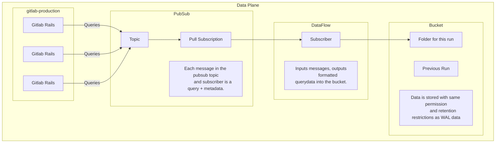

<!-- Design Documents often contain forward-looking statements -->
<!-- vale gitlab.FutureTense = NO -->

<!-- This renders the design document header on the detail page, so don't remove it-->


## Summary

Develop comprehensive tooling to capture, store, and replay SQL query traffic
from GitLab.com. This solution will implement a lightweight query forwarding
mechanism within GitLab that sends SQL queries to an external service with
minimal performance impact on Rails and Sidekiq processes. Combined with
purpose-built replay utilities, this system will enable performance testing,
capacity planning, and database architecture evaluation, allowing us to simulate
production loads at variable speeds, identify saturation and contention points,
assess potential database configuration changes, and validate sharding
strategies without adversely affecting production systems.

## Motivation

This tool will allow us to collect and measure our database capacity. This will
effectively settle questions about the capacity of both our current setup, as
well as the effectiveness of other mitigations such as changes to anything in
our production database infrastructure.

### Goals

1. Negligible performance impact on production Rails/Sidekiq processes.
2. Increased confidence in database scaling decisions and configuration changes.
3. Enhanced ability to identify and mitigate performance bottlenecks proactively.
4. Improved database architecture testing capabilities without production risk.

### Non-Goals

1. This is not a backup tool.
2. Not for data analysis, doesn't run continuously, not load bearing for any
   other uses.
3. We do not expect to converge on exactly the same database state that occurred
   in production. Specifically we are concerned with database performance under
   load, not correctness or data consistency.
4. We expect captures to be not entirely consistent. Some queries will fail to
   execute during replay.

## Proposal

We will capture all query traffic from the gitlab application, and replay it
against the benchmarking environment. We will do this for a period of time,
generally not to exceed an hour, and will use it to verify configuration changes
to database hosts.

We will also support shrinking the traffic replay into a smaller period of time
to simulate higher production load that the application might see in the future.

## Design and implementation details

We will capture query data from rails nodes, publish it to a pubsub topic, then
aggregate the query data and persist it to a bucket.

To replay, we will load the query data from the bucket, and replay it against a
benchmarking database restored from production at the time of the capture, using
the same number of connections as were originally used in production.

```mermaid
flowchart TD
    subgraph DataPlane2["Data Plane"]
        subgraph Benchmark["gitlab-db-benchmarking"]
            MachineCreation["Machines Created
            GPRD Snapshot used for machine creation is calculated on
            timestamp of folder of query data being replayed.
            WAL is replayed up until start LSN of the query data capture, then stopped."]
        end

        subgraph PipelineStageA["Trigger Pipeline Stage A"]
            StageAVars["input variables include:
            - foldername of querydata we want to replay
            - how many replay nodes we want to create
            - primary database instance only or also replicas
            - if we want database replicas, how many?
            - if we want to override default machine sizes, machine types etc"]
        end

        PauseA["Pause until next step manually triggered
        A good time for engineers to make any other manual changes to environment"]

        subgraph PipelineStageB["Trigger Pipeline Stage B"]
            StageBVars["input variables include:
            - replay speed (1x, 1.2x, 2x, etc)
            - write only or read & write

            Engineers can choose not to run Stage B if they just wanted
            an environment created and do not need a querydata replay"]
        end

        subgraph ReplayPerformed["Replay Performed"]
            ReplayProcess["Query Data will be gathered from GPRD bucket then replayed"]
        end

        PauseB["Pause until next step manually triggered
        A good time for engineers to make any other checks on the environment"]

        subgraph PipelineStageC["Trigger Pipeline Stage C"]
            StageCNote["- Pipeline C needs to be able to be run even if Pipelines A and B either a) were not run or b) failed"]
        end

        subgraph MachinesDeleted["Machines Deleted"]
            DeleteNote["Query Data will NOT be deleted from GPRD bucket"]
        end
    end

    PipelineStageA -->|"Creates"| MachineCreation
    MachineCreation --> PauseA
    PauseA --> PipelineStageB
    PipelineStageB -->|"Executes"| ReplayPerformed
    ReplayPerformed --> PauseB
    PauseB --> PipelineStageC
    PipelineStageC -->|"Cleans up"| MachinesDeleted

    %% Styling
    classDef sectionHeader fill:#f9f,stroke:#333,stroke-width:2px
    classDef pauseStep fill:#ffe6cc,stroke:#d79b00,stroke-width:1px
    classDef pipelineStep fill:#d5e8d4,stroke:#82b366,stroke-width:1px

    class QueryCapture,QueryReplay sectionHeader
    class PauseA,PauseB pauseStep
    class PipelineStageA,PipelineStageB,PipelineStageC,MachineCreation,ReplayPerformed,MachinesDeleted pipelineStep
```

## Alternative Solutions

1. We could capture query traffic at the connection pooler level, using
   something like pgcat or pgdog.
   - We aren't yet running such a pooler in production (we're currently running
     pgbouncer) and this tool will be useful to evaluate a change in connection
     pooler.

2. We could use a tool already built, such as
   https://github.com/gocardless/pgreplay-go.
   - pgreplay-go and similar tools capture data from the postgres log file, but
     that won't work at our scale - the volume of query text would exceed the
     capacity of a disk very quickly.
