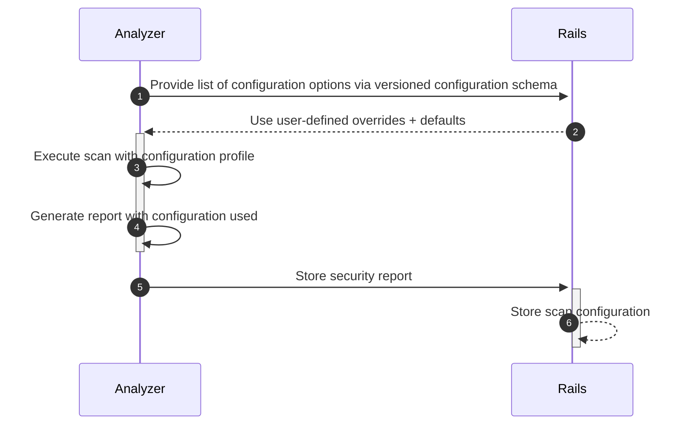
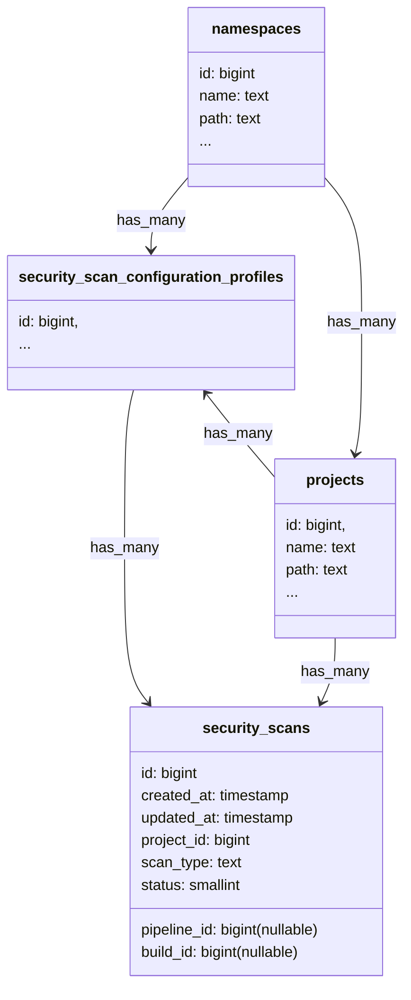



## Summary

We need a scalable way of storing and injecting analyzer configuration between security analyzers
and the Gitlab monolith. By introducing persisted configuration profiles we can provide an explicit and injectable
list of configuration options to be used when executing a security scan.

## Motivation

Analyzer configuration was first designed for CI-based scans, but increasingly, GitLab security
analyzers are moving outside of pipelines. For CI-based analyzers, we have traditionally relied on exposing
CI variables in the corresponding components and templates which are passed to each analyzer for configuring
the execution of a scan.

There are several challenges with this approach:

- Difficulty in configuring scans performed outside of CI contexts (e.g. Secret Push Protection and Continuous Vulnerability Scanning)
- Inconsistent configuration profiles between different scan contexts
- Inability to store user-defined configurations uniformally
- Inability to scale shared configuration to organization-wide levels

There’s also a growing need to standardize configuration and store user-defined configurations in a consistent and scalable manner.

### Goals

Provide GitLab users with a way to:

- Securely store default analyzer configurations within GitLab
- Securely store user-defined analyzer configurations within GitLab
- Manage multiple stored configuration profiles
- Inject configuration profiles into all possible scan contexts
- Validate all possible configuration values for each supported scanner
- Manage configuration profiles at a group and project level
- Get visibility into what has been configured, and where that configuration has been applied

#### Use cases

### Sequence for CI-based scan



### Non-Goals

Configuration Profiles are focused entirely on the way in which an analyzer executes its scan. The context by which
a scan is ran (i.e. within CI, upon registry push, upon git push, etc..) is out of scope from the initial design.

## Proposal

1. Define JSON schema encompassing all supported analyzer configuration options
1. Develop API for persisting and managing user preferences as configuration profiles (validated against schema)
1. Develop UI for persisting and managing user preferences as configuration profiles (validated against schema)
1. Inject chosen** configuration profile into scan contexts (starting with CI)
1. Update analyzers to prefer injected configuration settings, prioritizing over ENV and defaults
1. Update analyzers to provide `configuration` used to execute each scan
1. Generate audit events on configuration profile changes
1. Create both a new default and new custom role for scan configuration profile modification

### Configuration JSON schema

Example schema:

```json
{
  "$schema": "https://json-schema.org/draft/2020-12/schema",
  "$id": "",
  "title": "Security Analyzer Configuration Options",
  "description": "Mapping of all possible configuration options for Gitlab security analyzers",
  "type": "object",
  "properties": {
    "additional_ca_cert_bundle": {
        "description": "Bundle of CA certs that you want to trust.",
        "type": "string"
    },
    "log_level": {
        "description": "Set the minimum logging level. Messages of this logging level or higher are output. From highest to lowest severity, the logging levels are: fatal, error, warn, info, debug",
        "type": "string",
        "enum": ["fatal, error, warn, info, debug"],
        "default": "info"
    },
    "secret_detection_historic_scan": {
        "description": "Flag to enable a historic Gitleaks scan",
        "type": "boolean",
        "default": false
    },
  }
}
```

### Configuration DB Schema


