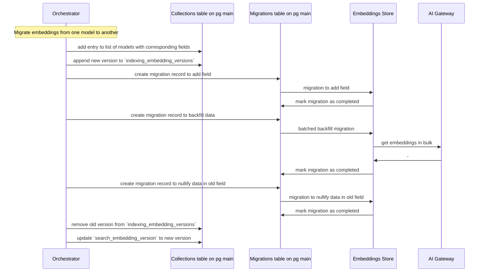

<!-- Design Documents often contain forward-looking statements -->

<!-- This renders the design document header on the detail page, so don't remove it-->


## Summary

To enhance the grounding of our AI features, there is a need for Retrieval Augmented Generation (RAG). As RAG evolves, no single method or storage solution currently addresses all potential use cases. Additionally, with advances in LLMs and larger context windows, our solution must remain adaptable. While we are already using Elasticsearch for most search features and embeddings, we still don't have all self-managed customers running Elasticsearch, so we will want to support some features with Postgres as well. Hence, creating an abstraction layer that unifies various RAG and embedding solutions will enable us to support diverse use cases efficiently.

## Motivation

The RAG abstraction layer will provide several key benefits:

- **Customer Flexibility**: Customers that do not run Elasticsearch today will be able to get some RAG features powered by Postgres.
- **Avoid Vendor Lock-in**: The architecture is designed to prevent dependency on a single vendor.
- **Modular Feature Development**: Features can be built independently of underlying data store constraints.
- **Adaptability**: Our solution can evolve as new techniques, models, and vendors emerge.

## Goals

- Enable the Global Search team to support multiple vector databases and embedding models while maximising the amount of code shared across databases.
- Build an abstraction layer for diverse features like chat routing, memory, issue search, and code context.

## Proposal

Here's the outline of the proposed interface for the GitLab Data Layer.

### Setup

When admins set up a new supported database, they are going to add it to the GitLab
Data Layer configuration. It needs to be one of the databases that has an
adapter implemented.

This would be configured in the `gitlab.rb` file like:

```ruby
gitlab_rails['ai_context_abstraction_layer'] = {
  enabled: true,
  databases: {
    es1: {
      adapter: 'elasticsearch',
      options: {
          prefix: 'gitlab', # Optional, but important to allow using the same DB for multiple instances
          url: 'https://elastic.host'
      }
    },
    os1: {
      adapter: 'opensearch',
      options: {
          prefix: 'gitlab', # Optional, but important to allow using the same DB for multiple instances
          url: 'https://elastic.host'
      }
    },
    pg1: {
      adapter: 'postgresql',
      options: {
          prefix: 'gitlab', # Optional, but important to allow using the same DB for multiple instances
          host: 'postgres.host',
          username: 'postgres',
          password: '..'
      }
    },
    # ...
  }
}
```

### Stable interface

In this section I'll attempt to outline how users (team members) can define the
collection, migrate the data, and query it.

#### Defining the collection

The first step will be to create a top level class for the collection.

We're going to have one class per collection that would be responsible for
pointing to other reference/indexing/searching classes as well as for defining
routing.

```ruby
module Ai
  module Search
    module Context
      module Collections
        class Issue
          class << self
            def reference_class
              Issue
            end

            # ...
          end
        end
      end
    end
  end
end
```

This is the reference class, which is responsible for generating the document as
well as serialization/deserialization from/to the ZSETs.

```ruby
module Ai
  module Search
    module Context
      class Issue < Reference
        include Ai::Search::Context::Concerns::DatabaseReference

        MODELS = {
          0: {
               field: 'embeddings_gecko',
               model: 'textembedding-gecko@003',
               chunking_strategy: {
                 # We can start with a naive approach first, but eventually
                 # we'll need to introduce chunking strategies
                 # ..
               }
             },
          1: {
               field: 'embeddings_mistral',
               model: 'mistral7B',
               chunking_strategy: {
                 # We can start with a naive approach first, but eventually
                 # we'll need to introduce chunking strategies
                 # ..
               }
             }
        }

        override :as_indexed_jsons
        def as_indexed_jsons
          [
            {
              issue_id: target.issue_id,
              namespace_id: target.namespace_id,
              embedding_gecko: Ai::Search::Context.embedding(embeddings_content, collection: :issues, model_version: 0),
              embedding_mistral: Ai::Search::Context.embedding(embeddings_content, collection: :issues, model_version: 1)
              # ...
            }
          ]
        end

        private

        def embeddings_content
          "issue with title '#{target.title}' and description '#{target.description}'"
        end
      end
    end
  end
end
```

#### Data migration

```ruby
class AddIssueCollection < Gitlab::Ai::Context::Migration[1.0]
  milestone '18.0'

  def change
    create_collection :issues, number_of_partitions: 5 do |c|
      c.bigint :issue_id
      c.bigint :namespace_id
      c.bigint :project_id
      c.prefix :traversal_ids
      c.vector :embeddings_gecko, options: { dimensions: 768, m: 16, ef_construction: 100 }
      c.integer :embeddings_version

      # These will only be used with pgvector adapter since Elasticsearch
      # indexes fields automatically
      # we could also consider adding `index: true` to field definitions as syntactic sugar
      c.index [:namespace_id, :project_id]
      c.index :traversal_ids
      c.index :embeddings_gecko
    end
  end
end
```

##### Tracking the state of the collection

We plan to add 1 record for each collection to track some dynamic attributes like:

- search_embedding_version: `0`
- indexing_embedding_versions: `[0, 1]`

##### Migrating the collection

```ruby
class AddContentToIssueCollection < Gitlab::Ai::Context::Migration[1.0]
  milestone '18.0'

  def change
    add_field :issues, field: :content, type: :text
  end
end
```

```ruby
class BackfillContentToIssueCollection < Gitlab::Ai::Context::Migration[1.0]
  milestone '18.0'

  def change
    backfill_collection :issues, field: :content
  end
end
```

##### Tracking the state of migrations

We're going to add a new table (in the main DB) to track the state of all the
migrations. The table could looks something like

- version: text
- status: pending, in_progress, finished, failed (enum)
- created_at
- updated_at
- completed_at
- metadata/info: jsonb

We're going to have helper methods to get the current migration state(s) since
some code will need to know whether or not a specific migration has been
completed.

```ruby
Ai::Search::Context.migration(:backfill_content_to_issue_collection).state

# or

Ai::Search::Context.migration_finished?(:backfill_content_to_issue_collection)
```

##### Migrating between different models

We plan to make it easy to migrate between different LLMs without any downtime. The plan is to have a
list of models mapped to field names. That way we can track current/active
models and switch to the new one as soon as the backfill is completed.



#### Ingestion

```ruby
Ai::Search::Context.track!(objects)
```

This will create references under the hood and add these to sharded redis
ZSET's, which are used as deduplicated queues.

Then another worker/workers processes the queue to be within the specified rate
limits.

We're going to introduce concerns to include into the model so that changes are
tracked automatically. Similar to
[`Elastic::ApplicationVersionedSearch`](https://gitlab.com/gitlab-org/gitlab/-/blob/66a6ae61dde6c942cfbaf8f230cbc177c8fc3fd2/ee/app/models/concerns/elastic/application_versioned_search.rb#L48-50).

Note: One indexing event might need to be distributed to multiple separate collections. For example,
it could be different chunking strategies for code or another document type.

#### Retrieval

```ruby
embedding = Ai::Search::Context.embedding('Abstraction layer', collection: :issues, model_version: 0, user: current_user)
# or for batching
embeddings = Ai::Search::Context.embeddings(['Abstraction layer'], collection: :issues, model_version: 0, user: current_user)

Ai::Search::Context.collection(:issues).query(prefix: { traversal_ids: '9970-' }, model_version: 0, embeddings: embedding, limit: 5)
```

If we find that it is difficult to represent all our query logic in a Ruby based API, we could consider using the GLQL compiler to transform the query into an AST. Currently,
it is being [rewritten in Rust](https://gitlab.com/gitlab-org/gitlab-query-language/glql-rust),
which allows us to incorporate it as part of the abstraction layer in the monolith. We decided not to start with GLQL as it introduces new dependencies on other complex projects and this use case is not aligned with the original design goal of GLQL to be a user facing query language to present data in the GitLab UI.

Another alternative is to use a JSON object to represent the query, similar to the approach Elasticsearch takes.
However, one downside of this approach is that it makes expressing complex AND/OR queries quite challenging.
A SQL-like syntax might be more convenient and familiar to the team members.

Important note: As part of the initial implementation we should have redaction logic
built-in.

### Initial features

We intend to build the abstraction layer so that it can support a broad range of features in GitLab. The following are some features we intend to support eventually:

- Documentation embeddings
- Code embeddings
- Issue/MR/Epic embeddings
- CI logs embeddings

Since code (stored in Gitaly, updated by git push, has multiple versions at any one time) is very different to issues and merge requests (stored in Postgres, updated by application code, only one version at a time) we expect the Global Search team will need to build a reference implementation for both. The architecture we build will need to be flexible to many different ways of constructing and searching embeddings but it will require experimentation to learn which approaches are useful for specific features. As such we expect the Global Search team to build an experimental reference implementation that may not be rolled out to all customers. We will make our best effort to design the feature to be useful based on what we know today but we will not delay the initial reference implementation while we wait for deeper research into this topic.

Once we have clear reference implementations in place it will be easier for other feature teams to build the indexing and search functionality they need to support their features.
