## Mission

The Infrastructure Department enables GitLab (the company) to deliver a single DevOps application, and GitLab SaaS users to focus on generating value for their own businesses by ensuring that we operate an enterprise-grade SaaS platform.

The Infrastructure Department does this by focusing on **availability**, **reliability**, **performance**, and **scalability** efforts.
These responsibilities have cost efficiency as an additional driving force, reinforced by the properly prioritized [**dogfooding**](#dogfooding) efforts.

Many other teams also contribute to the success of the SaaS platform.
However, it is the responsibility of the Infrastructure Department to drive the ongoing evolution of the SaaS platform, enabled by platform observability data.

## Getting Assistance

If you're a GitLab team member and are looking to alert the Infrastructure teams about an availability issue with GitLab.com, please find quick instructions to report an incident here: [Reporting an Incident](/handbook/engineering/infrastructure/incident-management/#reporting-an-incident).

For all other queries, please see the [getting assistance](/handbook/engineering/infrastructure/getting-assistance) page.

## Vision

The Infrastructure Department operates a fast, secure, and reliable SaaS platform to which (and with which) [everyone can contribute](/handbook/company/mission/#everyone-can-contribute).

Integral part of this vision is to:

1. Build a highly performant team of engineers, combining operational and software development experience to influence the best in reliable infrastructure.
1. Work publicly in accordance with our [transparency](/handbook/values/#transparency) value.
1. [Use our own product](#dogfooding) to prepare, build, deliver work, and support [the company strategy](/handbook/company/strategy/).
1. Align our [strategy](/handbook/company/strategy/) with the industry trends, company direction, and end customer needs.

## Direction

The direction is accomplished by using Objectives and Key Results (OKRs).

Other strategic initiatives to achieve this vision are driven by the needs of enterprise customers looking to adopt GitLab.com. [The GitLab.com strategy](https://about.gitlab.com/direction/core_platform/dotcom/) catalogs top customer requests for the SaaS offering and outlines strategic initiatives across both Infrastructure and Stage Groups needed to address these gaps.



## Organization structure

(click the boxes for more details)

```mermaid
flowchart LR
    I[Infrastructure Platforms]
    click I "/handbook/engineering/infrastructure/"

    I --> DA[Data Access]
    click DA "/handbook/engineering/infrastructure-platforms/data-access/"
    I --> D[Dedicated]
    click D "/handbook/engineering/infrastructure/team/gitlab-dedicated/"
    I --> DE[Developer Experience]
    click DE "/handbook/engineering/infrastructure-platforms/developer-experience/"
    I --> PE[Production Engineering]
    click PE "/handbook/engineering/infrastructure-platforms/production-engineering/"
    I --> SD[Software Delivery]
    click SD "/handbook/engineering/infrastructure/team/delivery/"
    I --> TS[Tenant Scale]
    click TS "/handbook/engineering/infrastructure-platforms/tenant-scale/"

    DA --> GC[Gitaly]
    click GC "/handbook/engineering/infrastructure-platforms/data-access/gitaly/"
    DA --> Git[Git]
    click GG "/handbook/engineering/infrastructure-platforms/data-access/git/"
    DA --> DF[Database Framework]
    click DF "/handbook/engineering/infrastructure-platforms/data-access/database-framework/"
    DA --> DO[Database Operations]
    click DO "/handbook/engineering/infrastructure-platforms/data-access/database-operations/"
    DA --> DU[Durability]
    click DU "/handbook/engineering/infrastructure-platforms/data-access/durability/"

    D --> E[Environment Automation]
    click E "/handbook/engineering/infrastructure/team/gitlab-dedicated/"
    D --> PSS[Public Sector Services]
    click PSS "/handbook/engineering/infrastructure/team/gitlab-dedicated/us-public-sector-services/"
    D --> Switchboard
    click Switchboard "/handbook/engineering/infrastructure/team/gitlab-dedicated/switchboard/"

    DE --> EA[Development Analytics]
    click EA "/handbook/engineering/infrastructure-platforms/developer-experience/engineering-analytics/"
    DE --> DT[Developer Tooling]
    click DT "/handbook/engineering/infrastructure-platforms/developer-experience/developer-tooling/"
    DE --> FE[Feature Readiness]
    click FE "/handbook/engineering/infrastructure-platforms/developer-experience/"
    DE --> PER[Performance Enablement]
    click PER "/handbook/engineering/infrastructure-platforms/developer-experience/performance-enablement/"
    DE --> TG[Test Governance]
    click TG "/handbook/engineering/infrastructure-platforms/developer-experience/test-governance/"

    PE --> CC[Cloud Connector]
    click CC "/handbook/engineering/infrastructure/team/cloud-connector/"
    PE --> Foundations
    click Foundations "/handbook/engineering/infrastructure-platforms/production-engineering/foundations/"
    PE --> Observability
    click Observability "/handbook/engineering/infrastructure/team/scalability/"
    PE --> Ops
    click Ops "/handbook/engineering/infrastructure/team/ops/"
    PE --> Runway
    click Ops "/handbook/engineering/infrastructure/team/runway/"

    SD --> DB[Build]
    click DB "/handbook/engineering/infrastructure-platforms/gitlab-delivery/distribution/"
    SD --> DD[Deploy]
    click DD "/handbook/engineering/infrastructure-platforms/gitlab-delivery/distribution/"
    SD --> FR[Framework]
    click FR "/handbook/engineering/infrastructure-platforms/gitlab-delivery/framework/"
    SD --> RE[Releases]
    click RE "/handbook/engineering/infrastructure-platforms/gitlab-delivery/delivery/"
    SD --> SM[Self-managed]
    click SM "/handbook/engineering/infrastructure-platforms/gitlab-delivery/delivery/"

    TS --> Geo
    click Geo "/handbook/engineering/infrastructure-platforms/tenant-scale/geo/"
    TS --> Organizations
    click Organizations "/handbook/engineering/infrastructure-platforms/tenant-scale/organizations/"
    TS --> Cells
    click Cells "/handbook/engineering/infrastructure-platforms/tenant-scale/cells-infrastructure/"
```

## Technical Roadmap

Infrastructure maintains a [Technical Roadmap](/handbook/engineering/#technical-roadmaps)
for planning projects over the short (1y), medium (2y), and long term (3y).
This serves as our strategic compass,
helping us balance immediate needs with long-term sustainability.

The Technical Roadmap is based on the [Product Roadmap](https://about.gitlab.com/direction/),
where Product provides the "What" (customer needs) and "Why" (business strategy).
Engineers then determine the "How" (technical implementation),
while Engineering Managers plan the "When" (scheduling).
This comprehensive roadmap emphasizes building high-quality,
complete features in a sustainable manner.

The Technical Roadmap serves three key purposes:

1. It helps build engineering excellence by addressing critical areas that might not show up in product backlogs,
   such as technical debt, performance improvements, platform improvements, and system scalability.

1. It enables the department to be proactive rather than reactive.
   By regularly asking key questions like "Where do we see the biggest instability in our systems?" or
   "What is generating the most toil?", we can address issues before they become critical problems.
   This helps maintain our SLOs and keeps our customers happy.

1. It aligns engineering efforts with business goals, ensuring technical improvements drive GitLab's success.
   Each technical roadmap item is prioritized based on business value and strategic alignment.

### Current State

The Infrastructure Roadmap is maintained as a static site.
GitLab team-members can review the current technical roadmap,
at [infra-roadmap.gitlab.com](https://infra-roadmap.gitlab.com/).

**NOTE**:
The Infrastructure Roadmap is not publicly available as some of the projects and
initiatives may be considered [unSAFE](/handbook/legal/safe-framework/).

The site presents the roadmap in a visual manner, showing:

- Dependencies between planned initiatives
- Filtering options by confidence, stage, or tags
- Individual roadmaps for each stage within the department
- Impact analysis through dependency visualization

### Updating the Roadmap

Changes to the Roadmap are made through merge requests to the [`infra-roadmap`](https://gitlab.com/gitlab-com/gl-infra/infra-roadmap/-/tree/main/data) project.
The data is stored in YAML format, and changes can be made by editing the YAML.
This allows for version control and collaborative discussion through the merge request process.

Full instructions for making changes to the Infrastructure Roadmap are available
in [the project's README.md](https://gitlab.com/gitlab-com/gl-infra/infra-roadmap/-/blob/main/README.md#updating-the-roadmap).

Everyone is encouraged to contribute to the roadmap,
whether proposing new initiatives or making smaller changes
like updating descriptions or adding links to relevant issues.

## Design

The [**Infrastructure Library**](https://gitlab.com/gitlab-com/gl-infra/readiness/-/tree/master/library) contains documents that outline our thinking about the problems we are solving and represents the ***current state*** for any topic, playing a significant role in how we produce technical solutions to meet the challenges we face.

## Dogfooding

The Infrastructure department uses GitLab and GitLab features extensively as the main tool for operating many [environments](/handbook/engineering/infrastructure/environments/), including GitLab.com.

We follow the same [dogfooding process](/handbook/engineering/development/principles/#dogfooding) as part of the Engineering function, while keeping the [department mission statement](#mission) as the primary prioritization driver. The prioritization process is aligned to [the Engineering function level prioritization process](/handbook/engineering/#prioritizing-technical-decisions) which defines where the priority of dogfooding lies with regards to other technical decisions the Infrastructure department makes.

When we consider building tools to help us operate GitLab.com, we follow the [`5x rule`](/handbook/product/product-processes/dogfooding-for-r-d/#dogfooding-process) to determine whether to build the tool as a feature in GitLab or outside of GitLab. To track Infrastructure's contributions back into the GitLab product, we tag those issues with the appropriate [Dogfooding](https://gitlab.com/groups/gitlab-org/-/labels?utf8=%E2%9C%93&subscribed=&search=dogfooding) label.

## Handbook use at the Infrastructure department

At GitLab, we have a [handbook first policy](/handbook/about/handbook-usage/#why-handbook-first). It is how we communicate process changes, and how we build up a single source of truth for work that is being delivered every day.

The [handbook usage page guide](/handbook/about/handbook-usage/) lists a number of general tips. Highlighting the ones that can be encountered most frequently in the Infrastructure department:

1. The wider community can benefit from training materials, architectural diagrams, technical documentation, and how-to documentation. A good place for this detailed information is in the related project documentation. A handbook page can contain a high level overview, and link to more in-depth information placed in the project documentation.
1. Think about the audience consuming the material in the handbook. A detailed run through of a GitLab.com operational runbook in the handbook might provide information that is not applicable to self-managed users, potentially causing confusion. Additionally, the handbook is not a go-to place for operational information, and grouping operational information together in a single place while explaining the general context with links as a reference will increase visibility.
1. Ensure that the handbook pages are easy to consume. Checklists, onboarding, repeatable tasks should be either automated or created in a form of template that can be linked from the handbook.
1. The handbook is the process. The handbook describes our principles, and our epics and issues are our principles put into practice.

## Projects

Classification of the Infrastructure department projects is described on the [infrastructure department projects page](/handbook/engineering/infrastructure/projects).

The [infrastructure issue tracker](https://gitlab.com/gitlab-com/gl-infra/production-engineering/-/issues) is the backlog and a catch-all project for the infrastructure teams and tracks the work our teams are doing–unrelated to an ongoing change or incident.

In addition to tracking the backlog, Infrastructure Department projects are captured in our [Infrastructure Department Epic](https://gitlab.com/groups/gitlab-com/-/epics/1049) as well as in our [Quarterly Objectives & Key Results](https://gitlab.com/groups/gitlab-com/-/epics/1420)

## Supporting Product Features

We have a model that we use to help us support product features. [This model](/handbook/engineering/infrastructure/feature-support/) provides details on how we collaborate to ship new features to Production.

## Stable Counterparts

Infrastructure SREs may be aligned with [stage groups](/handbook/product/categories/#categories-a-z) as [stable counterparts](https://about.gitlab.com/blog/2018/10/16/an-ode-to-stable-counterparts/).

[Stable Counterparts](team/stable-counterpart.html) are used as a framework for managing reliable services at GitLab.  The framework provides guidelines for collaboration between [Stage Groups](/handbook/product/categories/#categories-a-z) and [Infrastructure Teams](/handbook/engineering/infrastructure-platforms).

## Interviewing

The Infrastructure department hires for a number of different technical specialisms and positions across its teams. This [Infrastructure Interviewing Guide](/handbook/hiring/interviewing/infrastructure-interview/) offers more detail on some of our regular openings, interview process and other useful information related to applying to jobs with us. More information on our current openings can be found on the [careers page](https://about.gitlab.com/jobs/).

## Common Links

- [How we do Incident Management for GitLab.com](incident-management/)
- [GitLab.com status information](https://status.gitlab.com)

### Slack Channels

- [#production](https://gitlab.slack.com/archives/production)
- [#infrastructure-lounge](https://gitlab.slack.com/archives/infrastructure-lounge)
- [#incidents-dotcom](https://gitlab.slack.com/archives/incidents-dotcom)
- [#announcements](https://gitlab.slack.com/archives/announcements)
- [#feed_alerts-general](https://gitlab.slack.com/archives/feed_alerts-general)

### General Issue Trackers

- [Infrastructure issue queue](https://gitlab.com/gitlab-com/gl-infra/production-engineering/-/issues)
- [Production incidents, and changes](https://gitlab.com/gitlab-com/gl-infra/production/issues/)
- [Delivery](https://gitlab.com/gitlab-com/gl-infra/delivery/issues/)
- [Scalability](https://gitlab.com/gitlab-com/gl-infra/scalability/issues/)

### Resources

- [Production Architecture](production/architecture/)
- [Operational Runbooks](https://gitlab.com/gitlab-com/runbooks)
- [Environments](environments/)
- [Monitoring](../monitoring/_index.md)
- [Readiness Reviews](production/readiness/)
- [Infrastructure Standards](infrastructure-standards/)

## Other Pages

- [On-call Handover](/handbook/engineering/infrastructure/team/ops/on-call-handover/)
- [SRE Onboarding](/handbook/engineering/infrastructure/team/ops/sre-onboarding/)
- [GitLab.com data breach notification policy](https://about.gitlab.com/security/#data-breach-notification-policy)
- [Infrastructure careers and internships](career/)
- [Coding at scale](/handbook/engineering/infrastructure/team/scalability/#regarding-coding-at-scale)
