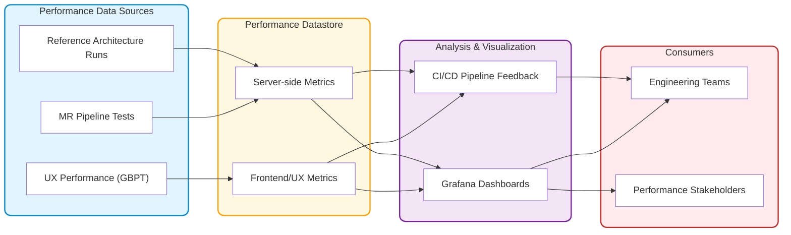
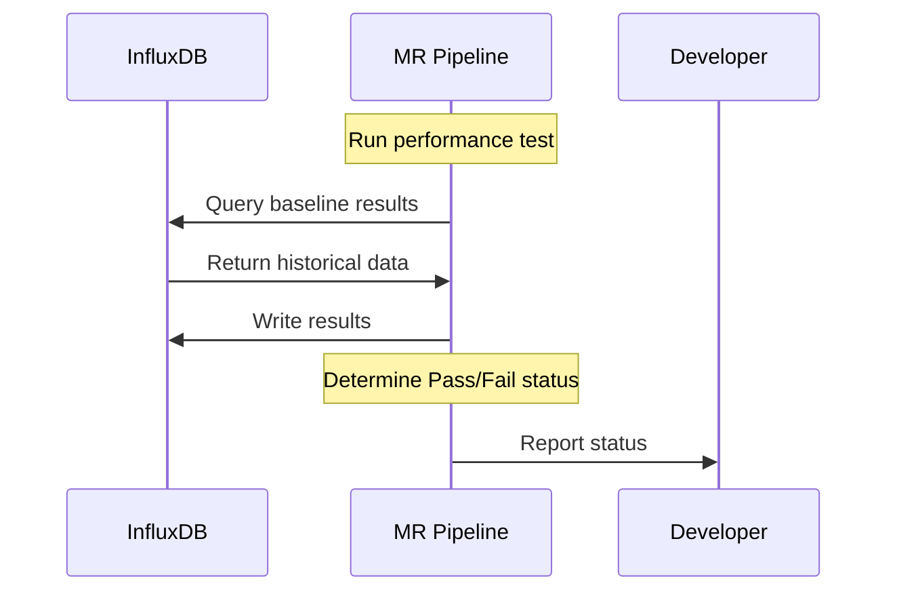
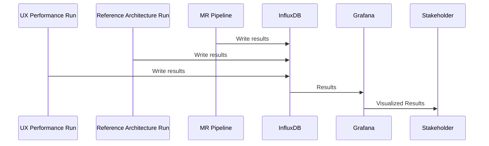

## Summary

This blueprint proposes a Performance Results Data store to build off of the GitLab Performance Tool by centralizing performance metrics in order to enable data-informed decisions, dynamic baselines, and integrate performance awareness throughout the development lifecycle.

## Goals

- Create a centralized repository for all performance test results
- Enable programmatic access to performance data for analysis and visualization
- Enable trend analysis between different test runs, environments, and GitLab versions
- Provide a foundation for automated performance regression detection
- Integrate with existing CI/CD pipelines for automatic data collection
- Support both high-level aggregated metrics and detailed raw performance data
- Enable dynamic baseline creation based on historical data

## Non-Goals

- **Replacing existing performance testing tools**: We'll enhance and integrate with tools like GitLab Performance Tool rather than replacing them
- **Duplicating our monitoring infrastructure**: We'll leverage our current monitoring solutions rather than creating parallel systems
- **Reinventing visualization**: We'll continue to make use of current visualization tools instead of creating custom alternatives
- **Competing with real-time monitoring**: We'll complement our existing real-time monitoring capabilities rather than replacing them
- **Expanding beyond performance focus**: We'll maintain a dedicated focus on performance metrics to ensure depth and relevance of insights

This initiative is about amplification and evolution of our performance capabilities, not replacement. We're building upon the solid foundation created by previous work to unlock new possibilities without discarding the valuable systems already in place.

## Proposal

We propose building a Performance Results Datastore to enable cross functional analysis and interpretation of the performance metrics. Key capabilities will include:

- Support multiple types of performance tests
- Store results with rich metadata (GitLab version, environment details, test parameters)
- Provide flexible querying capabilities for various analysis needs
- Scale to accommodate growing volumes of performance data
- Integrate seamlessly with existing CI/CD pipelines

## Implementation Approach

We'll leverage existing infrastructure (InfluxDB and Grafana) to create a proof-of-concept that enables:

- Storage of performance data from multiple sources
- Visualization through Grafana dashboards
- Programmatic access from CI/CD pipelines

### Infrastructure Details

The following resources have been provisioned for this implementation:

- **InfluxDB Instance**
  - URL: https://influxdb.quality.gitlab.net/
  - Bucket name: `perf-test-metrics`

- **Grafana Instance**
  - URL: https://dashboards.quality.gitlab.net/
  - Connected to the InfluxDB instance for visualization of performance metrics

## Architecture Overview

### Key Use Cases

- MR Pipeline Performance Validation
- Trend Analysis
- Dynamic Baselines
- Regression Detection

### Data Retention

Performance testing across numerous MRs will generate substantial data volumes. We need a thoughtful retention strategy to balance analytical value with storage constraints. Potential approaches include:

1. **Selective Storage** - Only persist results from merged MRs, treating pipeline runs on unmerged MRs as transient data
2. **Data Aggregation** - Implement a periodic process to consolidate historical data, preserving trends while reducing granularity of older measurements
3. **Time-based Retention** - Maintain full fidelity for recent data, for example 30-90 days, then progressively reduce resolution for older data
4. **Significance-based Pruning** - Retain all data points that represent significant changes or anomalies, while sampling or aggregating data that follows expected patterns
5. **Environment-based Policies** - Apply different retention rules based on the source environment, for example longer retention for Reference Architecture runs vs. MR pipeline tests.

Our initial implementation will focus on establishing the core infrastructure while we evaluate these approaches based on actual usage patterns.

## Sample Workflows

### As a developer, I want to know if my change affects performance

### As a Stakeholder, I want to be able to investigate performance trends

## Alternative Solutions

1. Run a baseline run and the performance run every MR
   - Pros:
     - Provides immediate, direct comparison without relying on historical data
     - Guarantees latest reference point for comparison
     - Eliminates concerns about environmental or temporal variations
   - Cons:
     - Dramatically increases CI resource consumption and pipeline duration
     - Creates redundant test runs of the same baseline code
     - Doubles the testing time for every performance-relevant MR
     - Scales poorly as more performance tests are added to the suite
     - Use a hard coded baseline
2. Use Static, Hard-Coded Baselines
   - Pros:
     - Simple implementation with minimal infrastructure needs
     - Consistent reference points for comparison
     - Low maintenance overhead for implementation
   - Cons:
     - Quickly becomes outdated as the application evolves
     - Fails to account for legitimate performance changes over time
     - Requires manual updates to adjust expectations
3. Use Existing Per-Environment Prometheus Instances
   - Pros:
     - Leverages existing monitoring infrastructure
     - Data already collected and available
   - Cons:
     - Data is isolated within each environment
     - Added complexity on the CI run to determine which data source to use
     - Test run will vary, will the needed data be present?
4. Build a Custom Performance Analytics Platform
   - Pros:
     - Fully tailored to our specific performance testing needs
     - Maximum flexibility in data model and analysis capabilities
   - Cons:
     - Significantly higher development and maintenance effort
     - Longer time to initial value
     - Requires specialized skills to build and maintain
     - Will reinvent capabilities already available in existing tools
5. Use Object Storage (S3/GCS/Package Registry) for JSON Baselines
   - Pros:
     - Simple implementation with minimal infrastructure dependencies
     - Easy integration with CI/CD pipelines and existing tools
     - Straightforward version control of baseline files
     - Low operational overhead with highly reliable storage
     - Cost-effective for the amount of data involved
   - Cons:
     - Limited query capabilities for dynamic analysis and investigation
     - No built-in visualization or trending capabilities
     - Requires custom tooling for comparison and regression detection
     - Difficult to perform ad-hoc analysis or identify patterns across multiple tests
     - Doesn't scale well for storing full test result datasets, only suitable for baselines

We opted for the current approach because it leverages our existing infrastructure investments while enabling the dynamic baselines critical for effective MR performance testing. This solution offers the best balance of implementation speed, analytical capabilities, and long-term scalability.

## References

- [GitLab Performance Tool (GPT)](https://gitlab.com/gitlab-org/quality/performance)
- [GPT Benchmarks Wiki](https://gitlab.com/gitlab-org/quality/performance/-/wikis/Benchmarks/Latest)
- [Reference Architecture Test Environment Details](https://gitlab.com/gitlab-org/quality/gitlab-environment-toolkit-configs/quality/-/wikis/Performance-environments-setup)
- Replace InfluxDB with Prometheus InfluxDB exporter
  - [MR](https://gitlab.com/gitlab-org/gitlab-environment-toolkit/-/merge_requests/174)
  - [Issue](https://gitlab.com/gitlab-org/gitlab-environment-toolkit/-/issues/98)
- [Shift Left and Right Performance Testing](../shift_left_right_performance/)
- [End-to-End Pipeline Monitoring](/handbook/engineering/testing/end-to-end-pipeline-monitoring/#test-metrics)
