## Overview of Infrastructure Standards

This handbook section defines the latest iteration of infrastructure and security standards for GitLab team members. These provide a baseline for the GitLab organization, and we have Infrastructure Realms for each of our infrastructure teams that override these standards to meet specific business needs.

The following standards are covered:

- Access Requests
- AWS Cloud Provider
  - Architecture Diagram
  - Organization Policies
  - IAM and Access Requests
  - IT Realm
  - SaaS Realm
  - Sandbox Realm
  - Project Horse Realm
- GCP Cloud Provider Architecture
  - Architecture Diagram
  - Organization Policies
  - IAM and Access Requests
  - IT Realm
  - SaaS Realm
  - Sandbox Realm
- Infrastructure-as-Code
  - Terraform
  - Ansible
- [Labels and Tags](/handbook/company/infrastructure-standards/labels-tags/)
- [Policies](/handbook/company/infrastructure-standards/policies/)
- Security Standards
  - Application Security
  - Infrastructure Security
- [Tutorials](/handbook/company/infrastructure-standards/tutorials/)

### Background Context

These standards were created by a cross-department collaboration in this [sandbox-cloud#3 Budget and Cost Allocation](https://gitlab.com/gitlab-com/demo-systems/sandbox-cloud/sandbox-cloud-issue-tracking/-/issues/3) issue and [infrastructure&257 Provide cloud resources for non-production usage](https://gitlab.com/groups/gitlab-com/gl-infra/-/epics/257).

These standards apply to new infrastructure. Existing resources can adopt these standards as infrastructure is iterated, unless advised by Infrastructure Security, IT, Reliability SRE.

## Realms

You can think of each realm as a domain or namespace that provides flexibility for department(s) and group(s) that use that realm to customize their infrastructure configuration and security policies as needed without affecting other departments or realms at GitLab.

For cloud infrastructure, we have created top-level AWS organizational units and GCP folders under the respective cloud provider top-level organization account that we refer to as "realms".

### Which realm should I use?

| Realm      | Data Classification | Resources Managed By | Usage Documentation | Slack Channel |
|------------|---------------------|----------------------|---------------------|---------------|
| `infra-shared-services`  | Red/Orange/Yellow/Green | `infra-realm-owners` | [Realm Docs](/handbook/company/infrastructure-standards/realms/infra-shared-services) | `#infra-realm-owners` |
| `it`       | Orange/Yellow/Green | [IT Engineering](/handbook/it/it/) | [Realm Docs](/handbook/company/infrastructure-standards/realms/it) | `#it_help` (tag `@it-eng`) |
| `saas`     | Red/Orange/Yellow/Green | [Reliability Engineering](/handbook/engineering/infrastructure/team/) | [Realm Docs](/handbook/company/infrastructure-standards/realms/saas) | `#infrastructure-lounge` |
| `sandbox`  | Green | Self Service (Team Member) | [Sandbox Cloud](/handbook/company/infrastructure-standards/realms/sandbox) | `#sandbox-cloud-questions` |
| `security` | Orange/Yellow/Green | [Infrastructure Security](/handbook/security/product-security/infrastructure-security/) | [Realm Docs](/handbook/company/infrastructure-standards/realms/security) | `#security-infrasec` |

### Managed by Infrastructure Teams

**Are you looking to deploy a production or production-like service?** All engineering or product related production infrastructure should be deployed and managed in the `saas` realm that is managed by the Engineering Infrastructure team with SRE on-call coverage. All business (non-engineering) production infrastructure should be deployed in the `it` realm in the GCP project or AWS account specified by the security team. All standardized security and logging resources that are not managed in the `saas` or `it` realm should be deployed in the `security` realm.

**Want to add a realm?** Any departments without their own realm should have resources for their groups (teams) created in the `sandbox` or `it` realms. If there are enough cloud resources and a dedicated infrastructure engineer team member to justify creating a new realm, please see the [instructions for creating a new infrastructure realm](/handbook/company/infrastructure-standards/tutorials/realms/create-realm).

### Self Service Infrastructure

Approximately ~750 of the GitLab team members are in departments that use cloud infrastructure for development, experiment, testing or **non-production** purposes. This includes team members in Customer Success, Engineering division departments, Support, etc. **For documentation purposes, we refer to this as the *GitLab infrastructure community*.**

For any groups that are not part of the GitLab infrastructure community (ex. Finance, Marketing, Sales, etc), please reach out to `#it_help` for assistance with your infrastructure needs.

We've standardized how we create and manage ephemeral (sandbox) infrastructure that GitLab team members provision.

**The oversimplified user story is "I need to spin up VM(s) or cluster(s) in GCP or AWS to try something (anything, may not be GitLab product specific), what's the company infrastructure standards for doing that?"**

The Sandbox Cloud is a custom-built web application that automates the provisioning of an AWS account or GCP project for each GitLab team member that needs one for ephemeral sandbox and testing use cases.

The goal is to create a frictionless approach for technical team members that includes the tagging needed for cost allocation, best practice security configurations, and provide you the ability to create any resources that you need using the AWS or GCP web console or use our shared library of Terraform modules that include documentation and usage examples that can be copied into the Terraform configuration file for each user account. When you sign in with OKTA, we use the OKTA meta data that is integrated with Workday to determine your department and entity for cost reporting, and use this for the auto-creation of a tagging policy for resources that you create.

Learn more on the [sandbox realm handbook page](/handbook/company/infrastructure-standards/realms/sandbox).

#### Individual Environment

**Are you looking for a sandbox or testing AWS account or GCP project?** Please use the [GitLab Sandbox Cloud](/handbook/company/infrastructure-standards/realms/sandbox/#individual-aws-account-or-gcp-project) which gives you access to your own private AWS account or GCP project that grants you owner permissions and has centrally managed billing with the GitLab master account.

#### Group Environments

**Are you looking for an AWS account or GCP project to deploy experimental or testing resources that you will share with your team?** You can request a Group AWS account or GCP project using the Sandbox Cloud. See the [handbook page for instructions](/handbook/company/infrastructure-standards/realms/sandbox/#groupteam-aws-account-or-gcp-project-non-production).

#### Definition of Sandbox and Test Infrastructure

- Any infrastructure that you or your team manages that **does not contain real customer or team member data/information or RED/ORANGE data**. In other words, it's real infrastructure but uses fake data for testing.
- Any infrastructure that is only used internally (scripts, test apps, tools, etc) and does not impact business continuity if the service is unavailable temporarily.
- Any infrastructure that is ephemeral in nature that is available externally but does not contain real customer data/information/intellectual property or RED/ORANGE data. This categorically includes collaboratively reproducing customer problems (with fake data), demos, proof-of-concepts, training, workshops, etc.
- Any infrastructure that does not have global infrastructure support coverage (ex. is this managed by the SRE team?).
- Please review the [Data Classification Policy](/handbook/security/standards/data-classification-standard/) and the [Data Classification Index](https://internal.gitlab.com/handbook/security/data_classification/) to ensure your infrastructure does not contain sensitive information. It is best practice to contact the [Security team](/handbook/security/) for a review if your infrastructure is in a gray area.

In the near future, we will be introducing [readiness reviews](/handbook/engineering/infrastructure/production/readiness/) for more infrastructure realms.

### Realm Owners

Each realm has one or more team members that are system owners that are the [DRI](/handbook/people-group/directly-responsible-individuals/) or stable counterparts responsible for all of the infrastructure architecture, billing, resource provisioning and security policies in that realm.

Each realm DRI or counterpart is an engineering manager or experienced infrastructure engineer who can perform all actions needed for day-to-day management of the realm, including responding to security incidents and supporting group owners and counterparts in their realm.

Our infrastructure standards are designed to provide a well defined baseline with guidelines for customization by realm owners as needed within their realm.

You can see the list of infrastructure realm owners in the [Google Group](https://groups.google.com/a/gitlab.com/g/infra-realm-owners/members) (internal).

## GCP Architecture Diagram

```mermaid
graph LR;

    subgraph gcp["Google Cloud Platform"]

        subgraph gcp-realms["<br />GitLab Realms<br />(Folders)"]
            gcp-realm-saas[/saas<br />GitLab SaaS/]
            gcp-realm-eng-dev[/eng-dev<br />Engineering Development/]
            gcp-realm-eng-infra[/eng-infra<br />Engineering Infrastructure/]
            gcp-realm-eng-security[/eng-security<br />Engineering Security/]
            gcp-realm-eng-support[/eng-support<br />Engineering Support/]
            gcp-realm-sales-cs[/sales-cs<br />Customer Success/]
            gcp-realm-business-tech[/business-tech<br />Business Technology/]
            gcp-realm-sandbox[/sandbox<br />Compute Sandbox/]
        end

        subgraph gcp-saas-accounts["eng-saas Realm GCP Projects"]
            gcp-saas-account-ops["saas-ops"]
            gcp-saas-account-stg["saas-stg"]
            gcp-saas-account-prd["saas-prd"]
        end

        subgraph gcp-business-tech["business-tech Realm GCP Projects"]
            gcp-ga-accounting-x["ga-accounting-x"]
            gcp-ga-business-tech-x["ga-business-tech-x"]
            gcp-ga-ceo-x["ga-ceo-x"]
            gcp-ga-finance-x["ga-finance-x"]
            gcp-ga-legal-x["ga-legal-x"]
            gcp-ga-people-x["ga-people-x"]
            gcp-ga-talent-acquisition-x["ga-talent-acquisition-x"]
            gcp-mktg-x["mktg-x"]
            gcp-sales-alliances-x["sales-alliances-x"]
            gcp-sales-commercial-x["sales-commercial-x"]
            gcp-sales-ent-x["sales-ent-x"]
            gcp-sales-field-ops-x["sales-field-ops-x"]
            gcp-sales-practice-mgmt-x["sales-practice-mgmt-x"]
        end

        subgraph gcp-eng-dev-accounts["eng-dev Realm GCP Projects"]
            gcp-eng-dev-manage-x["eng-dev-manage-x"]
            gcp-eng-dev-plan-x["eng-dev-plan-x"]
            gcp-eng-dev-create-x["eng-dev-create-x"]
            gcp-eng-dev-verify-x["eng-dev-verify-x"]
            gcp-eng-dev-package-x["eng-dev-package-x"]
            gcp-eng-dev-release-x["eng-dev-release-x"]
            gcp-eng-dev-configure-x["eng-dev-configure-x"]
            gcp-eng-dev-monitor-x["eng-dev-monitor-x"]
            gcp-eng-dev-secure-x["eng-dev-secure-x"]
            gcp-eng-dev-govern-x["eng-dev-govern-x"]
            gcp-eng-dev-growth-x["eng-dev-growth-x"]
            gcp-eng-dev-enablement-x["eng-dev-enablement-x"]
            gcp-eng-quality-x["eng-quality-x"]
            gcp-eng-ux-x["eng-ux-x"]
            gcp-product-x["product-x"]
        end

        subgraph gcp-eng-infra-accounts["eng-infra Realm GCP Projects"]
            gcp-eng-infra-x["eng-infra-x"]
        end

        subgraph gcp-eng-security-accounts["eng-security Realm GCP Projects"]
            gcp-eng-security-x["eng-security-x"]
        end

        subgraph gcp-eng-support-accounts["eng-support Realm GCP Projects"]
            gcp-eng-support-x["eng-support-x"]
        end

        subgraph gcp-sales-cs-accounts["sales-cs Realm GCP Projects"]
            gcp-sales-cs-demo-cloud-x["sales-cs-demo-cloud-x"]
            gcp-sales-cs-training-cloud-x["sales-cs-training-cloud-x"]
            gcp-sales-cs-sa-x["sales-cs-sa-x"]
            gcp-sales-cs-tam-x["sales-cs-tam-x"]
            gcp-sales-cs-ps-x["sales-cs-ps-x"]
        end

        subgraph gcp-sandbox-departments-folders["sandbox Realm GCP Folders <br />(GitLab Departments)"]
            gcp-sandbox-dept-eng-support[/"eng-support"/]
            gcp-sandbox-dept-eng-dev[/"eng-dev"/]
            gcp-sandbox-dept-eng-infra[/"eng-infra"/]
            gcp-sandbox-dept-eng-quality[/"eng-quality"/]
            gcp-sandbox-dept-eng-security[/"eng-security"/]
            gcp-sandbox-dept-eng-ux[/"eng-ux"/]
            gcp-sandbox-dept-ga-accounting[/"ga-accounting"/]
            gcp-sandbox-dept-ga-business-tech[/"ga-business-tech"/]
            gcp-sandbox-dept-ga-ceo[/"ga-ceo"/]
            gcp-sandbox-dept-ga-finance[/"ga-finance"/]
            gcp-sandbox-dept-ga-legal[/"ga-legal"/]
            gcp-sandbox-dept-ga-people[/"ga-people"/]
            gcp-sandbox-dept-ga-talent-acquisition[/"ga-talent-acquisition"/]
            gcp-sandbox-dept-mktg-awareness[/"mktg-awareness"/]
            gcp-sandbox-dept-mktg-brand-design[/"mktg-brand-design"/]
            gcp-sandbox-dept-mktg-campaigns[/"mktg-campaigns"/]
            gcp-sandbox-dept-mktg-communications[/"mktg-communications"/]
            gcp-sandbox-dept-mktg-community[/"mktg-community"/]
            gcp-sandbox-dept-mktg-content[/"mktg-content"/]
            gcp-sandbox-dept-mktg-digital[/"mktg-digital"/]
            gcp-sandbox-dept-mktg-field[/"mktg-field"/]
            gcp-sandbox-dept-mktg-inbound[/"mktg-inbound"/]
            gcp-sandbox-dept-mktg-ops[/"mktg-ops"/]
            gcp-sandbox-dept-mktg-events[/"mktg-events"/]
            gcp-sandbox-dept-mktg-partner[/"mktg-partner"/]
            gcp-sandbox-dept-mktg-sales-dev[/"mktg-sales-dev"/]
            gcp-sandbox-dept-mktg-strategic[/"mktg-strategic"/]
            gcp-sandbox-dept-product[/"product"/]
            gcp-sandbox-dept-sales-alliances[/"sales-alliances"/]
            gcp-sandbox-dept-sales-channel[/"sales-channel"/]
            gcp-sandbox-dept-sales-commercial[/"sales-commercial"/]
            gcp-sandbox-dept-sales-cs[/"sales-cs"/]
            gcp-sandbox-dept-sales-ent[/"sales-ent"/]
            gcp-sandbox-dept-sales-field-ops[/"sales-field-ops"/]
            gcp-sandbox-dept-sales-practice-mgmt[/"sales-practice-mgmt"/]
        end

        subgraph gcp-sandbox-departments-accounts["sandbox eng-support GCP Projects"]
            gcp-sandbox-dept-eng-support-account-amulvaney["amulvaney-a1b2c3d4"]
            gcp-sandbox-dept-eng-support-account-asmith["asmith-b2c3d4e5"]
            gcp-sandbox-dept-eng-support-account-hramachandran["hramachandran-c3d4e5f6"]
            gcp-sandbox-dept-eng-support-account-jyoung["jyoung-d4e5f6g7"]
        end

    end

    gcp-realm-saas-->gcp-saas-account-ops;
    gcp-realm-saas-->gcp-saas-account-stg;
    gcp-realm-saas-->gcp-saas-account-prd;

    gcp-realm-business-tech-->gcp-ga-accounting-x;
    gcp-realm-business-tech-->gcp-ga-business-tech-x;
    gcp-realm-business-tech-->gcp-ga-ceo-x;
    gcp-realm-business-tech-->gcp-ga-finance-x;
    gcp-realm-business-tech-->gcp-ga-legal-x;
    gcp-realm-business-tech-->gcp-ga-people-x;
    gcp-realm-business-tech-->gcp-ga-recruiting-x;
    gcp-realm-business-tech-->gcp-mktg-x;
    gcp-realm-business-tech-->gcp-sales-alliances-x;
    gcp-realm-business-tech-->gcp-sales-commercial-x;
    gcp-realm-business-tech-->gcp-sales-ent-x;
    gcp-realm-business-tech-->gcp-sales-field-ops-x;
    gcp-realm-business-tech-->gcp-sales-practice-mgmt-x;

    gcp-realm-eng-dev-->gcp-eng-dev-manage-x;
    gcp-realm-eng-dev-->gcp-eng-dev-plan-x;
    gcp-realm-eng-dev-->gcp-eng-dev-create-x;
    gcp-realm-eng-dev-->gcp-eng-dev-verify-x;
    gcp-realm-eng-dev-->gcp-eng-dev-package-x;
    gcp-realm-eng-dev-->gcp-eng-dev-release-x;
    gcp-realm-eng-dev-->gcp-eng-dev-configure-x;
    gcp-realm-eng-dev-->gcp-eng-dev-monitor-x;
    gcp-realm-eng-dev-->gcp-eng-dev-secure-x;
    gcp-realm-eng-dev-->gcp-eng-dev-govern-x;
    gcp-realm-eng-dev-->gcp-eng-dev-growth-x;
    gcp-realm-eng-dev-->gcp-eng-dev-enablement-x;
    gcp-realm-eng-dev-->gcp-eng-quality-x;
    gcp-realm-eng-dev-->gcp-eng-ux-x;
    gcp-realm-eng-dev-->gcp-product-x;

    gcp-realm-eng-infra-->gcp-eng-infra-x;

    gcp-realm-eng-security-->gcp-eng-security-x;

    gcp-realm-eng-support-->gcp-eng-support-x;

    gcp-realm-sales-cs-->gcp-sales-cs-demo-cloud-x;
    gcp-realm-sales-cs-->gcp-sales-cs-training-cloud-x;
    gcp-realm-sales-cs-->gcp-sales-cs-sa-x;
    gcp-realm-sales-cs-->gcp-sales-cs-tam-x;
    gcp-realm-sales-cs-->gcp-sales-cs-ps-x;

    gcp-realm-sandbox-->gcp-sandbox-dept-eng-support;
    gcp-realm-sandbox-->gcp-sandbox-dept-eng-dev;
    gcp-realm-sandbox-->gcp-sandbox-dept-eng-infra;
    gcp-realm-sandbox-->gcp-sandbox-dept-eng-quality;
    gcp-realm-sandbox-->gcp-sandbox-dept-eng-security;
    gcp-realm-sandbox-->gcp-sandbox-dept-eng-ux;
    gcp-realm-sandbox-->gcp-sandbox-dept-ga-accounting;
    gcp-realm-sandbox-->gcp-sandbox-dept-ga-business-tech;
    gcp-realm-sandbox-->gcp-sandbox-dept-ga-ceo;
    gcp-realm-sandbox-->gcp-sandbox-dept-ga-finance;
    gcp-realm-sandbox-->gcp-sandbox-dept-ga-legal;
    gcp-realm-sandbox-->gcp-sandbox-dept-ga-people;
    gcp-realm-sandbox-->gcp-sandbox-dept-ga-talent-acquisition;
    gcp-realm-sandbox-->gcp-sandbox-dept-mktg-awareness;
    gcp-realm-sandbox-->gcp-sandbox-dept-mktg-brand-design;
    gcp-realm-sandbox-->gcp-sandbox-dept-mktg-campaigns;
    gcp-realm-sandbox-->gcp-sandbox-dept-mktg-communications;
    gcp-realm-sandbox-->gcp-sandbox-dept-mktg-community;
    gcp-realm-sandbox-->gcp-sandbox-dept-mktg-content;
    gcp-realm-sandbox-->gcp-sandbox-dept-mktg-digital;
    gcp-realm-sandbox-->gcp-sandbox-dept-mktg-field;
    gcp-realm-sandbox-->gcp-sandbox-dept-mktg-inbound;
    gcp-realm-sandbox-->gcp-sandbox-dept-mktg-ops;
    gcp-realm-sandbox-->gcp-sandbox-dept-mktg-events;
    gcp-realm-sandbox-->gcp-sandbox-dept-mktg-partner;
    gcp-realm-sandbox-->gcp-sandbox-dept-mktg-sales-dev;
    gcp-realm-sandbox-->gcp-sandbox-dept-mktg-strategic;
    gcp-realm-sandbox-->gcp-sandbox-dept-product;
    gcp-realm-sandbox-->gcp-sandbox-dept-sales-alliances;
    gcp-realm-sandbox-->gcp-sandbox-dept-sales-channel;
    gcp-realm-sandbox-->gcp-sandbox-dept-sales-commercial;
    gcp-realm-sandbox-->gcp-sandbox-dept-sales-cs;
    gcp-realm-sandbox-->gcp-sandbox-dept-sales-ent;
    gcp-realm-sandbox-->gcp-sandbox-dept-sales-field-ops;
    gcp-realm-sandbox-->gcp-sandbox-dept-sales-practice-mgmt;

    gcp-sandbox-dept-eng-support-->gcp-sandbox-dept-eng-support-account-amulvaney;
    gcp-sandbox-dept-eng-support-->gcp-sandbox-dept-eng-support-account-asmith;
    gcp-sandbox-dept-eng-support-->gcp-sandbox-dept-eng-support-account-hramachandran;
    gcp-sandbox-dept-eng-support-->gcp-sandbox-dept-eng-support-account-jyoung;

```

### AWS Architecture Diagram

The AWS architecture is currently being designed. Please create a GitLab issue and tag `jeffersonmartin`, `dawsmith`, and `jurbanc` for assistance in the interim.
