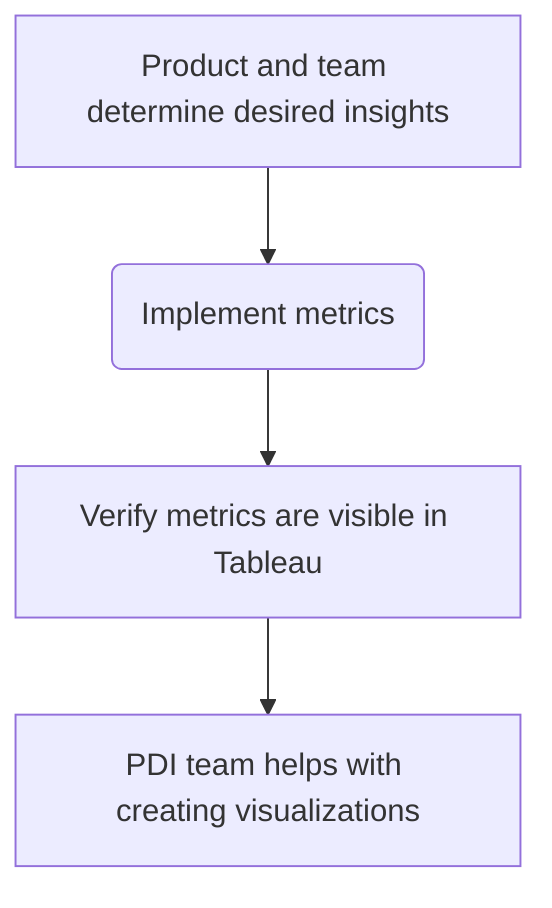

## Overview

This page documents the process a member of the Secure: Secret Detection team should use to add metrics to capture product insights for the features we develop.

You should this guide to help you understand the 2 different types of metrics we
can use, when to use each one, and give you a jumpstart in implementing them.

### Metrics workflow

In general, the workflow for developing and adding metrics is:



## Creating metrics

For our use cases, we utilize Internal Tracking Events or Database Metrics
(formerly Service Ping) depending on the situation:

- Internal Tracking Events are good for capturing _events_ that occur but aren't
stored in the database. E.g., a user clicks a specific button.
- Database metrics are useful when the data you want _is_ stored in the database
in some way that can be extracted with the right query. E.g., the nubmer of
projects that have a setting enabled.

The Analytics Instrumentation team has great documentation
[here](https://docs.gitlab.com/ee/development/internal_analytics/internal_event_instrumentation/quick_start.html#quick-start-for-internal-event-tracking)
but we outline some of the learnings on implementing metrics for our use here.

### Internal tracking events

Internal Tracking Events capture discrete events and can be collected over 7
days, 28 days, or all time. These events require code changes to explicitly fire the
event.

Here is an example from [Notes::BaseService](https://gitlab.com/gitlab-org/gitlab/-/blob/master/app/services/notes/base_service.rb?ref_type=heads)

```ruby
...

include Gitlab::InternalEventsTracking

...

track_internal_event('create_commit_note', project: project, user: current_user)
...
```

Each event has a descriptive name and, when possible, useful data for context like:

- user
- project
- namespace (which will be pulled from `project` if not supplied)

There's another field, `category` that is automatically set to the classname of
the class that the event was fired from. This is important to know for testing.

Each event can also have up to 3 additional data. Events support 2 string values, and 1 numeric.
These additional properties are stored in the `additional_properties` map in the
event and the keys are:

- `label` (string)
- `property` (string)
- `value` (numeric)

You should utilize them in that order when possible, i.e., `label` before
`property`.

#### Process for adding

You should follow the process Analytics Instrumentation has defined in the [quick start guide](https://docs.gitlab.com/ee/development/internal_analytics/internal_event_instrumentation/quick_start.html#quick-start-for-internal-event-tracking).
linked docs.

TL;DR Run the `ruby scripts/internal_events/cli.rb` CLI tool and follow the
prompts. The event definition is necessary for the code to know what
events to output and the metric definition is what Snowflake and Tableau will
make available given the events.

#### Testing

There are shared examples that you can utilize to test firing of tracking
events:

```ruby
it_behaves_like 'internal event tracking' do
    let(:event) { "detect_secret_type_on_push" }
    let(:namespace) { project.namespace }
    let(:label) { "GitLab Personal Access Token" }
    let(:category) { described_class.name }

    ...
    subject
end

```

Unlike in the implementation file, when using the shared example in the specs,
you will need to define the `:category` to be the class under test.

##### Shared Examples

If you're adding internal event tracking tests to shared specs, you need to be
able to redefine the `subject` to be what triggers the event firing if it isn't
already.

As an example, in the
[specs](https://gitlab.com/gitlab-org/gitlab/-/blob/master/ee/spec/lib/gitlab/checks/secrets_check_spec.rb?ref_type=heads) for
[Gitlab::Checks::SecretsCheck](https://gitlab.com/gitlab-org/gitlab/-/blob/master/ee/lib/gitlab/checks/secrets_check.rb?ref_type=heads) we use the shared examples from [secrets_check_shared_example.rb](https://gitlab.com/gitlab-org/gitlab/-/blob/master/ee/spec/support/shared_examples/lib/gitlab/secrets_check_shared_examples.rb?ref_type=heads).

In that file, most of the specs call `subject.validate!` to run the secrets
check, but for the internal tracking shared examples, it expects to be able to
just call `subject`.

Therefore, to use the internal tracking event shared
examples from _our_ shared examples we have to redefine `subject` to `subject {
super().validate! }`. `super()` within the `subject{}` block refers to the
predefined `subject` object, i.e., the `Gitlab::Checks::SecretsCheck` class.

So in this special case, we add a shared example `internal event tracking` to
be:

```ruby
it_behaves_like 'internal event tracking' do
    let(:event) { 'skip_secret_push_protection' }
    let(:namespace) { project.namespace }
    let(:label) { "commit message" }
    let(:category) { described_class.name }
    subject { super().validate! }
  end
```

### Database Metric (Service Ping)

[Database metrics](https://docs.gitlab.com/ee/development/internal_analytics/metrics/metrics_instrumentation.html#database-metrics),
aka Service Pings, are metrics that can be collected with
database queries. These metrics are updated in a batch approximately every 7
days. However, this is not guaranteed and may be generated anywhere from 4-10 days.

#### Process for adding

Database metrics are implemented by a Ruby subclass of
`GitLab::Usage::Metrics::Instrumentation::DatabaseMetric` and
utilizes `ActiveRecord` relations to build the queries. Alternatively, you can
provide the SQL for the query too.

The class should be in `lib/gitlab/usage/metrics/instrumentation/` or the EE
equivalent.

We have a Rails
[generator](https://docs.gitlab.com/ee/development/internal_analytics/metrics/metrics_instrumentation.html#create-a-new-metric-instrumentation-class)
that can be used to create the necessary classes:

```ruby
rails generate gitlab:usage_metric CountIssues --type database --operation distinct_count
        create lib/gitlab/usage/metrics/instrumentations/count_issues_metric.rb
        create spec/lib/gitlab/usage/metrics/instrumentations/count_issues_metric_spec.rb

```

The simplest way to implement the metric is to call the class-level `#operation` and `#relation` methods.

The argument to `operation` can be

- `:count`
- `:distinct_count`
- `:estimate_batch_distinct_count`
- `:sum`
- `:average`

`relation` takes a block that returns the query results.

Example from
[`Gitlab::usage::Metrics::Instrumentation::CountProjectsWithSecretPushProtectionEnabledMetric](https://gitlab.com/gitlab-org/gitlab/-/blob/master/ee/lib/gitlab/usage/metrics/instrumentations/count_projects_with_secret_push_protection_enabled_metric.rb?ref_type=heads):

```ruby
class CountProjectsWithSecretPushProtectionEnabledMetric < DatabaseMetric
  operation :count

  relation do
    ProjectSecuritySetting.where(pre_receive_secret_detection_enabled: true)
  end
end
```

Each database metric has to have an accompanying metric dictionary like Internal
Tracking Events. Unfortunately, database metrics are not yet supported by the `internal_events` CLI script so must be partially done by hand.

1. Create a yaml file in the appropriate subdirectory of `config/metrics` or `ee/config/metrics` if it's a metric limited to an enterprise tier.
    1. If the metric is meant to capture all time, use the `counts_all` subdirectory.
    1. Otherwise use the appropriate `counts_7d` or `counts_28d` subdirectory for weekly and monthly metrics respectively.
1. Use existing yaml files as templates
1. Use the schema defined [here](https://docs.gitlab.com/ee/development/internal_analytics/metrics/metrics_dictionary.html).

NOTE: Make sure that the milestone is a string.

#### Testing

Like Internal Tracking Events, database metrics have shared examples that we can
utilize in our tests.

```ruby
it_behaves_like 'a correct instrumented metric value', { time_frame: 'all',
data_source: 'database' }
```

`time_frame` should match the value in the dictionary for the metric that was
defined, i.e., `7d`, `28d`, or `all`.

## Viewing and analyzing

### Verifying creation and deployment

Metrics are collected into Snowflake which are then viewable in Tableau. To
verify a metric is in production and being generated there are 2 locations to
check:

1. [Metrics dictionary](https://metrics.gitlab.com/)
1. [Tableau Service Ping Exploration](https://10az.online.tableau.com/#/site/gitlab/views/PDServicePingExplorationDashboard/MetricExplorationbyGroup?:iid=1) (You need `Explorer` level access or higher to Tableau)

The `Metrics dictionary` only shows what metrics are available and gives you the
ability to copy the Snowflake query to get its values.

The Tableau Service Ping explorer shows the basic values of and allows you see the last
5 generated values. Further analysis must be done either in Tableau or Snowflake.

With the `Explorer` role in Tableau, you will be able to create dashboards but
will be limited to using data sources created by someone with higher
permissions. Any new Internal Tracking Event or Database Metric should be
included in existing data sources

- `Mart Ping Instance Metric Monthly`
- `Mart Ping Instance Metric Weekly`

### Asking for help

If you're not familiar with Tableau, creating worksheets and dashboards in it,
and haven't worked through the Tableau-hosted courses, you have some options for
help:

1. For help in creating Tableau dashboards and visualizations, the
[Product Data Insights (PDI) team](/handbook/product/groups/product-analysis/) has an issue
[intake process](/handbook/product/groups/product-analysis/#issue-intake) where you can request their help.
1. For specific questions on your Tableau worksheet or
dashboard, you can reach out to the PDI team on their slack channels:
    - [#data-tableau](https://gitlab.enterprise.slack.com/archives/C03RMCEHVCP) for
Tableau-specific help
    - [#data](https://gitlab.enterprise.slack.com/archives/C8D1LGC23) for any
data-related question

### Troubleshooting

If the metrics don't show up in Tableau or Snowplow you should contact
`#g_monitor_analytics_instrumention` or `#data_tableau` slack channel.

If, in Tableau, you can't find either of the 2 data sources mentioned above,
make sure to use the `New Data Source` button, then click the `See All` link on
the right side above the table of available data sources.
