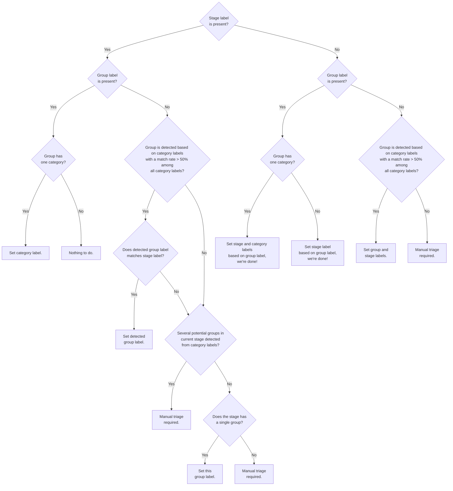
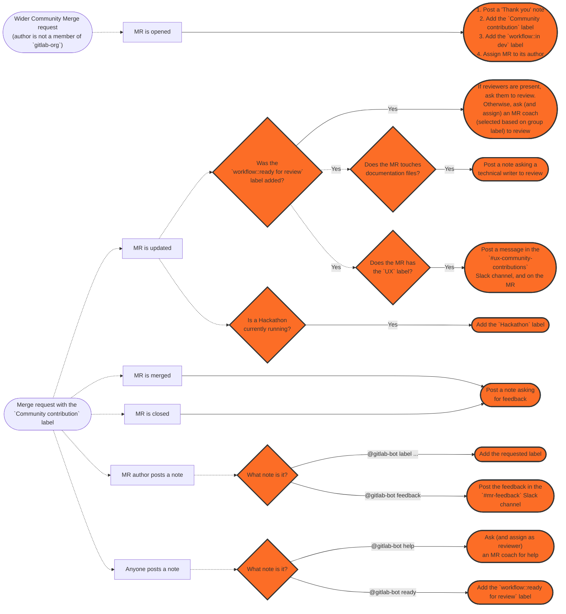

Any GitLab team-member can triage issues. Keeping the number of [un-triaged issues](/handbook/engineering/infrastructure/engineering-productivity/issue-triage/#triaging-issues) low is essential for maintainability, and is our collective responsibility.

We have implemented automation and tooling to handle this at scale and distribute the load to each team or group.

Video introduction to triage operations, triage report, priority and severity labels.

<iframe width="560" height="315" src="https://www.youtube.com/embed/qOlN2G1BDhk" frameborder="0" allow="accelerometer; autoplay; encrypted-media; gyroscope; picture-in-picture" allowfullscreen></iframe>

## Accountability

The Quality Engineering Department ensures that every Product and Engineering group is held accountable to deliver on the SLA set forth.

Our defect SLA can be viewed at:

* [Priority labels](/handbook/engineering/infrastructure/engineering-productivity/issue-triage/#priority)
* [Severity labels](/handbook/engineering/infrastructure/engineering-productivity/issue-triage/#severity)

The Quality Engineering department employs a number of tools and automation in addition to manual intervention to help us achieve this goal.
The work in this area can been seen in our department roadmap under Triage and Measure tracks of work.

## Label renaming

There is a large amount of automation that uses stage, group, and category labels. We ask that Product Managers create an issue in triage-ops when any of the following changes occur. This issue helps ensure limited to no impact to automation and reports.

* [Stage creation or rename](https://gitlab.com/gitlab-org/quality/triage-ops/issues/new?issuable_template=category-stage-group-label-change)
* [Group creation or rename](https://gitlab.com/gitlab-org/quality/triage-ops/issues/new?issuable_template=category-stage-group-label-change)
* [Category label creation or rename](https://gitlab.com/gitlab-org/quality/triage-ops/issues/new?issuable_template=category-label-change)

## Auto-labelling of issues and merge requests

Our triage bot will automatically infer section, stage, and group labels based
on the category/feature already set on an issue or MR. This is available for **open** issues/MRs within the `gitlab-org` group.

The most important rules are:

* The bot doesn't change a stage or group label if the stage or group is listed in `stages.yml` and the label is already set.
* A group label is chosen only if the highest group match from its category labels is > 50%.
* A group label is chosen only if it matches the already set stage label (if applicable).
* A stage label is set based on the chosen or already set group label.
* A section label is set based on the chosen or already set group or stage label.
* The bot leaves a message that explains its inference logic.

The following logic was initially implemented in
[this merge request](https://gitlab.com/gitlab-org/quality/triage-ops/merge_requests/155#workflow):

After the above inference is done, a section label will be added based on the
stage or group label. An explanation will not be added
in this step if the inferred labels contain only a section label.

Check out the
[list of actual use-cases](https://gitlab.com/gitlab-org/quality/triage-ops/merge_requests/155#test-cases)
to better understand what this flow means in practice.

If your issue/MR doesn't belong to a particular stage, you can remove the stage
label and add the `~"automation:devops-mapping-disable"` label to prevent this
automation from happening in the future.

## Triage reports

A [triage report](https://gitlab.com/gitlab-org/quality/team-tasks/issues/35) is an issue containing a checklist of issues or merge requests requiring attention.
Usually, each task corresponds to an issue or a merge request that needs labels, prioritization, scheduling, attention etc.
Some reports also include heatmaps or other various information.

Triage report are automatically assigned to specific team members, listed in
[the stages definition file](https://gitlab.com/gitlab-com/www-gitlab-com/-/blob/master/data/stages.yml).

To change who an issue gets assigned to, open a merge request for the above
files. If the group definition file is changed, we'll need to
[run some scripts](https://gitlab.com/gitlab-org/quality/triage-ops#generating-policy-files-and-ci-jobs)
to update the generated files as well.

### Community-related triage reports

These reports are owned by the [Contributor Success team](/handbook/marketing/developer-relations/contributor-success/).

#### Newly created community merge requests

This report contains community merge requests requiring [partial triage](/handbook/engineering/infrastructure/engineering-productivity/merge-request-triage/#partial-triage-gitlab-org).
The goal is for coaches to add type, stage, and group labels, so that the relevant people can be pinged later on based on these labels.

* Frequency: Daily.
* Assignees: [Merge Request Coaches](https://gitlab.com/gitlab-org/coaches) who are not out of the office by [gitlab roulette](https://gitlab.com/gitlab-org/gitlab-roulette#features).
* Listed merge requests: The latest 100 `Community contribution` which are not partially triaged.
* Triage action: Follow the instructions in the triage report.
* Example: <https://gitlab.com/gitlab-org/quality/triage-reports/-/issues/7903>
* Policy: <https://gitlab.com/gitlab-org/quality/triage-ops/-/blob/master/policies/stages/report/untriaged-community-merge-requests.yml>

#### Community merge requests requiring attention

This report contains community merge requests that may require some attention from GitLab team members.

* Frequency: Weekly.
* Assignees: [Contributor Success team](/handbook/marketing/developer-relations/contributor-success) + volunteer wider community members.
* Listed merge requests (all awaiting GitLab response):
  1. Merge requests from new contributors idle for 7 days.
  1. Merge requests idle for 21 days (excluding ~group::runner).
  1. ~group::runner merge requests idle for 21 days.
* Triage action:
  1. Determine if the merge request should be followed through or closed.
  1. Determine if the merge request is ready or further changes are required.
  1. Assign a reviewer as needed.
* Example: <https://gitlab.com/gitlab-org/quality/triage-reports/-/issues/7690>
* Policy: <https://gitlab.com/gitlab-org/quality/triage-ops/-/blob/master/policies/groups/gitlab-org/quality/community-contribution-mr-report.yml>

### Team reports

#### Group level bugs, features, and Deferred UX

This report contains the relevant bugs, feature requests, and Deferred UX issues that belong to a group in our [DevOps stages](/handbook/product/categories/#devops-stages).
The goal is to achieve [complete-triage](/handbook/engineering/infrastructure/engineering-productivity/issue-triage#complete-triage) by the Product Manager, Engineering Manager, UX team member in that area.

The report itself is divided into 4 main parts.

* Feature proposals
* Deferred UX issues
* Frontend bugs
* Bugs (likely backend)
* `~priority::1` and `~priority::2` bugs past the target SLO.

The bug sections also contains a heatmap.

An example: [https://gitlab.com/gitlab-org/quality/triage-ops/issues/118](https://gitlab.com/gitlab-org/quality/triage-ops/issues/118)

Video overview of the triage report.

<iframe width="560" height="315" src="https://www.youtube.com/embed/JzHSUop9PSg" frameborder="0" allow="accelerometer; autoplay; encrypted-media; gyroscope; picture-in-picture" allowfullscreen></iframe>

There is also an optional stage policy for [missing categories](https://gitlab.com/gitlab-org/quality/triage-ops/-/blob/master/policies/missing-categories.yml).
If your team has enabled this, you will receive a list of up to 100 items that have the stage label but have zero appropriate category labels for that stage.

##### Feature proposals

This section contains issues with the `~"type::feature"` label without a milestone. It is divided further into issues with and without `~"customer"`

* Triage owner: Product Manager(s) for that group.
* Triage actions:
  1. If the issue is a duplicate or irrelevant, close the issue out.
  1. Assign a milestone either to a versioned milestone, `Backlog` or `Awaiting further demand` milestone.

##### Frontend bugs

This section contains issues with the `~"type::bug"` and `~"frontend"` labels without priority and severity. It is divided further into issues with and without `~"customer"`

* Triage owner: Frontend Engineering Manager(s) for that group.
* Triage actions:
  1. Close the issue if it is no longer relevant or a duplicate.
  1. Assign a [Priority Label](/handbook/engineering/infrastructure/engineering-productivity/issue-triage/#priority).
  1. Assign a [Severity Label](/handbook/engineering/infrastructure/engineering-productivity/issue-triage/#severity).
  1. Assign either a versioned milestone or to the `Backlog`.

##### Non-frontend bugs (likely backend)

This section contains issues with the `~"type::bug"` label without priority and severity. It is divided further into issues with and without `~"customer"`

* Triage owner: Backend Engineering Manager(s) for that group.
* Triage actions:
  1. Close the issue if it is no longer relevant or a duplicate.
  1. Assign a [Priority Label](/handbook/engineering/infrastructure/engineering-productivity/issue-triage/#priority).
  1. Assign a [Severity Label](/handbook/engineering/infrastructure/engineering-productivity/issue-triage/#severity).
  1. Assign either a versioned milestone or to the `Backlog`.

##### severity::1 & severity::2 bugs past SLO

This section contains bugs which has past our targeted SLO based on the severity label set. This is based on our [missed SLO detection](/handbook/engineering/infrastructure/engineering-productivity/triage-operations/#missed-slo) triage policy.

##### Heatmap for ~customer bugs

This section contains a table displaying the open issues for a group labeled with `~"customer"` and `~"bug"`. There is a breakdown by the assigned severity and priority labels

#### Group level merge requests that may need attention

This report contains idle [group](/handbook/product/categories/) merge requests authored by GitLab team members.

Merge requests are considered idle when they have no human activity for 28 days.
This report collects them for prompting of any actions to move the MR forward,
such as nudging the author, reviewer, or maintainer.

* Triage owner: Engineering Manager(s) for that group.
* Triage frequency: On 8th and 23rd every month.
* Triage actions:
  1. Review these merge requests to identify if there are any steps that can
     shorten the time to merge. Steps can be:
     1. Reminding the author about it.
     1. Changing the DRI.

An example report: [Merge requests requiring attention for `group::access` - 2020-11-08](https://gitlab.com/gitlab-org/quality/triage-reports/-/issues/751). Current reports can be found in the [triage-reports project](https://gitlab.com/gitlab-org/quality/triage-reports/-/issues?scope=all&utf8=%E2%9C%93&state=all&search=%22Merge+Requests+requiring+attention%22)

#### Group level feature flags that may need attention

This report contains feature flags that have enabled in the codebase for 2 or more releases for
groups within our [DevOps stages](/handbook/product/categories/#devops-stages).

The DRI is responsible for reviewing these feature flags to determine if they are able to be removed
entirely, or create separate issues to ensure the overdue feature flags are removed accordingly.

* Triage owner: Engineering Manager(s) for that group.
* Triage frequency: On 1st of every month.
* Triage actions:
  1. Review the feature flags to identify whether they can be:
     1. Removed by the Engineering DRI.
     1. Tracked with a separate issue for removal to be scheduled by the PM for the group.

An example report: [Feature Flags requiring attention for `group::continuous integration` - 2021-03-01](https://gitlab.com/gitlab-org/quality/triage-reports/-/issues/2161). Current reports can be found in the [triage-reports project](https://gitlab.com/gitlab-org/quality/triage-reports/-/issues?scope=all&utf8=%E2%9C%93&state=all&search=%22Feature+flags+requiring+attention%22)

The feature flag triage reports are generated in a [quality toolbox scheduled pipeline](https://gitlab.com/gitlab-org/quality/toolbox/-/pipeline_schedules) with the [gitlab-feature-flag-alert](https://gitlab.com/gitlab-org/gitlab-feature-flag-alert) project.

#### Group level Bug Prioritization report

This report contains [group](/handbook/product/categories/) level the Top 10 open issues of  `~"type::bug"` which needs to be prioritized for the upcoming milestone. It is divided further into issues with `~"severity::`, `~"bug::vulnerability"` and `~"customer"` labels and listed based on the oldest age of the issues

* Triage owner: Product Manager(s) and Engineering Manager(s) for that group.
* Triage frequency: On 2nd of every month.
* Triage actions:
     1. Close the issue if it is no longer relevant or a duplicate.
     1. Prioritize these issues and identify the ones that needs to be picked into the upcoming milestone
     1. Assign either a versioned milestone or to the `Backlog`.
* Policy: <https://gitlab.com/gitlab-org/quality/triage-ops/-/blob/master/policies/template/group/bug-prioritization.yml.erb>

An example report: [2023-11-01 - Bugs Prioritization for "group::source code" for upcoming milestone - 16.7](https://gitlab.com/gitlab-org/quality/triage-reports/-/issues/14732). Current reports can be found in the [triage-reports project](https://gitlab.com/gitlab-org/quality/triage-reports/-/issues/?sort=updated_desc&state=all&search=Bugs%20Prioritization%20for&first_page_size=100)

#### Auto closure of triage reports

Reports open for more than 2 weeks with the `~"triage report"` label will be closed automatically with the [close old triage reports](https://gitlab.com/gitlab-org/quality/triage-ops/-/blob/master/policies/stages/close-reports/close-old-triage-reports.yml) automation.

## Reactive workflow automation

Reactive triage automation is complementary to scheduled triage automation where
realtime feedback provides an improved developer experience. This is handled by
[triage-ops](https://gitlab.com/gitlab-org/quality/triage-ops).

### Community-related reactive workflow automation

**Note**: reactive command arguments between brackets (`[]`) are considered as optional.

Following is a diagram that shows how all the automations fit together:

#### Community contribution thank you note

* Automation conditions:
  * MR was opened
  * The MR is opened in a project under the `gitlab-org` group or for the `gitlab-com/www-gitlab-com` project, and its
    author is not present in the [team page](/handbook/company/team/)
* Automation actions:
  * Posts a "Thank you" note
  * Adds the `Community contribution` and `workflow::in dev` labels
  * Assigns the MR to its author
* Processor: <https://gitlab.com/gitlab-org/quality/triage-ops/-/blob/master/triage/processor/community/thank_contribution.rb>

#### Automated review request

* Automation conditions:
  * The `workflow::ready for review` label was added
  * The MR has the `Community contribution` label set
  * The MR is not opened in a distribution project listed at <https://gitlab.com/gitlab-org/distribution/monitoring/-/raw/master/lib/data_sources/projects.yaml>
  * The MR is not opened in a project which has an external review process (as defined in the processor).
* Automation actions:
  * If the MR already has reviewers, nudge them to perform a review, reassign or set the `workflow::in dev` label
  * If the MR has no reviewers, nudge and assign (as reviewer) a coach based on the MR's group (or a random coach otherwise), to review, reassign or set the `workflow::in dev` label
* Processor: <https://gitlab.com/gitlab-org/quality/triage-ops/-/blob/master/triage/processor/community/automated_review_request_generic.rb>

#### Automated review request for doc contributions

* Automation conditions:
  * The `workflow::ready for review` label was added
  * The MR has the `Community contribution` label set
  * The MR does not have the `Technical Writing` label set
  * MR has documentation changes
  * No existing note asking for documentation review
* Automation actions:
  * Asks a relevant Technical Writer (based on the changes' mapped from the `CODEOWNERS` file) to review
* Processor: <https://gitlab.com/gitlab-org/quality/triage-ops/-/blob/master/triage/processor/community/automated_review_request_doc.rb>

#### Automated review request for UX contributions

* Automation conditions:
  * The `workflow::ready for review` label was added
  * The MR has the `Community contribution` label set
  * The MR has the `UX` label set
  * No existing note asking for UX review
* Automation actions:
  * Posts a Slack message in the `#ux-community-contributions` Slack channel (internal) to ask a UX reviewer to review non-draft MRs
  * Posts a note to let the author know about the Slack ping
* Processor: <https://gitlab.com/gitlab-org/quality/triage-ops/-/blob/master/triage/processor/community/automated_review_request_ux.rb>

#### Reactive `help` command

* Automation conditions:
  * A new MR note that starts with `@gitlab-bot help` is posted on a merge request
  * The note is posted by the MR author or a team member
* Automation actions:
  * Pings and assigns (as reviewer) a random MR coach for help
* Rate limiting: once per author/MR per hour, or 100 times per team member/MR per hour
* Processor: <https://gitlab.com/gitlab-org/quality/triage-ops/-/blob/master/triage/processor/community/command_mr_help.rb>

#### Reactive `ready` command

* Automation conditions:
  * A new MR note that starts with `@gitlab-bot ready [@user1 @user2 ...]`, `@gitlab-bot review [@user1 @user2 ...]`,
    or `@gitlab-bot request_review [@user1 @user2 ...]`
  * The note is posted by the MR author or a team member
* Automation actions:
  * Adds the `workflow::ready for review` label to the MR
  * Assigns the provided users (any GitLab community member) as reviewers, otherwise picks a random MR coach as reviewer
* Rate limiting: once per author/MR per hour, or 100 times per team member/MR per hour
* Processor: <https://gitlab.com/gitlab-org/quality/triage-ops/-/blob/master/triage/processor/community/command_mr_request_review.rb>

#### Reactive `unassign_review` command

* Automation conditions:
  * A new MR note that starts with `@gitlab-bot unassign_review`
  * The note is posted by one of the currently assigned reviewers (any GitLab community member)
* Automation actions:
  * Removes the posting user from the list of currenly assigned reviewers
* Rate limiting: 100 times per hour
* Processor: <https://gitlab.com/gitlab-org/quality/triage-ops/-/blob/master/triage/processor/community/command_mr_unassign_review.rb>

#### Reactive `label` and `unlabel` commands

* Automation conditions:
  * A new note that starts with `@gitlab-bot label ~"label-name"` or `@gitlab-bot unlabel ~"label-name"` where `label-name` matches:
    * `group::*`, `type::*`, `feature::*`, `bug::*`, `maintenance::*`, `category:*`
    * `backend`, `Contributor Success`, `database`, `documentation`, `frontend`, `handbook`, `UX`
    * `security` (`label` only for community members)
    * `workflow::in dev`, `workflow::ready for review`, `workflow::in review`, `workflow::complete`, `workflow::blocked`
  * The note is posted by the author, an assignee, or a team member
* **Note**: to add or remove multiple labels, list all labels after the command, for example: `@gitlab-bot label ~"group::project management" ~"type::bug"`
* Automation actions:
  * Adds or removes the requested label
* Rate limiting: 60 times per requester/item per hour
* Processor: <https://gitlab.com/gitlab-org/quality/triage-ops/-/blob/master/triage/processor/community/command_mr_label.rb>

#### Idle/Stale label remover

* Automation conditions:
  * The MR author posts a note or pushes new changes to the MR
  * The MR has the `Community contribution` label set
  * The MR has the `idle` or `stale` labels set
* Automation actions:
  * Removes the `idle` and `stale` labels
* Processor: <https://gitlab.com/gitlab-org/quality/triage-ops/-/blob/master/triage/processor/community/remove_idle_labels_on_activity.rb>

#### Code Review Experience Feedback

* Automation conditions:
  * MR was merged or closed
  * The MR has the `Community contribution` label set
  * No existing note asking for feedback
* Automation actions:
  * Posts a note to ask MR author about their contributing experience
* Processor: <https://gitlab.com/gitlab-org/quality/triage-ops/-/blob/master/triage/processor/community/code_review_experience_feedback.rb>

#### Reactive `feedback` command

* Automation conditions:
  * A new MR note that starts with `@gitlab-feedback`
  * The note is posted by the MR author or a team member
* Automation actions:
  * Posts the contributor feedback note in the `#mr-feedback` Slack channel (internal)
* Rate limiting: once per requester/MR per day
* Processor: <https://gitlab.com/gitlab-org/quality/triage-ops/-/blob/master/triage/processor/community/command_mr_feedback.rb>

#### Leading Organizations labeler

* Automation conditions:
  * MR was opened or updated
  * The MR does not have the `Leading Organization` label set
  * The MR author is from a [leading organization](/handbook/engineering/workflow/code-review/#leading-organizations) based on the data we have on Sisense
* Automation actions:
  * Adds the `Leading Organization` label
* Processor: <https://gitlab.com/gitlab-org/quality/triage-ops/-/blob/master/triage/processor/community/label_leading_organization.rb>

#### Hackathon labeler

* Automation conditions:
  * MR was opened or updated during the Hackathon dates
  * The MR has the `Community contribution` label set
  * No existing note mentioning the Hackathon
* Automation actions:
  * Posts a note mentioning the Hackathon
  * Adds the `Hackathon` label
* Processor: <https://gitlab.com/gitlab-org/quality/triage-ops/-/blob/master/triage/processor/community/hackathon_label.rb>

#### Spam detector

* Automation conditions:
  * MR has the `Community contribution` label set
  * MR not currently labeled as `Spam`
  * MR content matches phrases associated with inappropriate and abusive activity (More information can be found in the Processor implementation)
* Automation actions:
  * Posts a note linking to [GitLab Website Terms of Use](/handbook/legal/policies/website-terms-of-use/)
  * Relabels (removes all other labels) as `Spam`
  * Closes the MR
* Processor: <https://gitlab.com/gitlab-org/quality/triage-ops/-/blob/master/triage/processor/community/detect_and_flag_spam.rb>

### Engineering workflow automation

#### Ensure priorities for availability issues

For issues labeled `~"availability"`, the minimal are enforced with the
guidelines at
<https://handbook.gitlab.com/handbook/engineering/infrastructure/engineering-productivity/issue-triage/#availability-prioritization>

#### Ensure no deprecated backstage labels are added

Whenever `~"backstage [DEPRECATED]"` is added, it'll remove it and hint
about why it should not be added, and alternatives will be provided.

#### Add customer label whenever a customer associated link is added

The `~"customer"` label is applied when a customer associated link is applied.

The following URLs are considered customer associated links:

* `gitlab.zendesk.com`
* `gitlab.my.salesforce.com`

#### Add type label from subtype

Whenever a subtype label is added, the corresponding type label is added.
Current type labels with subtype labels are:

* `~"type::feature"`
* `~"type::tooling"`

#### Merge request type label copy from related issues

* Automation conditions:
  * Open or update of a merge request without a type label that have a related issue with a type label.
* Automation actions:
  * The type label in the issue is applied to the merge request
* Policy: <https://gitlab.com/gitlab-org/quality/triage-ops/-/blob/master/triage/processor/apply_type_label_from_related_issue.rb>

#### Reactive `retry_job` command

* Automation conditions:
  * A new issue note with `@gitlab-bot retry_job <job_id>` posted by a GitLab team member in a broken master incident.
  * This automation can only be invoked from the [gitlab-org/quality/engineering-productivity/master-broken-incidents](https://gitlab.com/gitlab-org/quality/engineering-productivity/master-broken-incidents) project right now.
* Automation actions:
  * `@gitlab-bot` will send a request to retry the target job and reply with a new job link.
* Example: <https://gitlab.com/gitlab-org/quality/engineering-productivity/master-broken-incidents/-/issues/3188#note_1496059720>
* Processor: <https://gitlab.com/gitlab-org/quality/triage-ops/-/blob/master/triage/processor/gitlab_internal_commands/command_retry_pipeline_or_job.rb>

#### Reactive `retry_pipeline` command

* Automation conditions:
  * A new issue note with `@gitlab-bot retry_pipeline <pipeline_id>` posted by a GitLab team member in a broken master incident.
  * This automation can only be invoked from the [gitlab-org/quality/engineering-productivity/master-broken-incidents](https://gitlab.com/gitlab-org/quality/engineering-productivity/master-broken-incidents) project right now.
* Automation actions:
  * `@gitlab-bot` will send a request to retry all failed jobs in the target pipeline and reply with the pipeline link.
* Example: <https://gitlab.com/gitlab-org/quality/engineering-productivity/master-broken-incidents/-/issues/3187#note_1496076800>
* Processor: <https://gitlab.com/gitlab-org/quality/triage-ops/-/blob/master/triage/processor/gitlab_internal_commands/command_retry_pipeline_or_job.rb>

#### Reactive `delete_bot_comment` command

* Automation conditions:
  * A new issue or merge request note with `@gitlab-bot delete_bot_comment` posted by a GitLab team member as a reply to a bot comment thread.
  * The comment to be deleted must be posted by `@gitlab-bot`, and the command must be posted by a GitLab team member.
  * Community members must reach out to a GitLab team member for help, as they will not have access to this command.
* Automation actions:
  * `@gitlab-bot` will delete the bot comment along with any reply comments it has.
  * A page refresh may be needed for the thread to be removed from page.
  * If the above automation conditions are not met, posting this command will not have any effect on the replied comment.
  * NOTE: After deleting the bot comment, it will be re-posted to the resource if the required labels or other attributes are missing again.
* Example: not available, as the comment gets deleted as a result of running the command
* Processor: <https://gitlab.com/gitlab-org/quality/triage-ops/-/blob/master/triage/processor/gitlab_internal_commands/command_delete_bot_comment.rb>

### Database-related reactive workflow automation

#### Database Review Experience Feedback

* Automation conditions:
  * MR was merged or closed
  * The MR has the `database::reviewed` or `database::approved` label set
  * No existing note asking for feedback
* Automation actions:
  * Posts a note to ask MR author for feedback to improve the database review process
* Processor: <https://gitlab.com/gitlab-org/quality/triage-ops/-/blob/master/triage/processor/database/database_review_experience_feedback.rb>

## Scheduled workflow automation

Scheduled triage automation is run to label and update issues which help with
reporting and milestone transition. This is handled by
[triage-ops](https://gitlab.com/gitlab-org/quality/triage-ops).

### Community-related scheduled workflow automation

#### Remove `Seeking community contributions` from issues with an assignee

When an issue is assigned, it shouldn't accept any new contribution to prevent duplicated work.

* Automation conditions:
  * Issues with an assignee and the `Seeking community contributions` label
* Automation actions:
  * The `Seeking community contributions` label is removed
* Policy: <https://gitlab.com/gitlab-org/quality/triage-ops/-/blob/master/policies/stages/hygiene/label-seeking-community-contributions.yml>

#### Remove `Seeking community contributions` from issues with an invalid workflow label

When an issue has the `Seeking community contributions` label set, but also an incompatible workflow label, the issue isn't actually ready to accept a contribution.

* Automation conditions:
  * Issues with the `Seeking community contributions` and one of the `workflow::blocked`, `workflow::design`, `workflow::planning breakdown`, `workflow::refinement`, `workflow::verification` labels
* Automation actions:
  * The `Seeking community contributions` label is removed
* Policy: <https://gitlab.com/gitlab-org/quality/triage-ops/-/blob/master/policies/stages/hygiene/label-seeking-community-contributions.yml>

#### Remove `Seeking community contributions` from all merge requests

It doesn't make sense to have `Seeking community contributions` set on merge requests.

* Automation conditions:
  * Merge requests with the `Seeking community contributions` label
* Automation actions:
  * The `Seeking community contributions` label is removed
* Policy: <https://gitlab.com/gitlab-org/quality/triage-ops/-/blob/master/policies/stages/hygiene/label-seeking-community-contributions.yml>

#### Label community contributions

Merge requests which have an author that is not a member of `gitlab-org` will have the `Community contribution` label applied. This scheduled automation is a backup for the reactive automation that applies `Community contribution` in the [welcome message](#community-contribution-thank-you-note).

* Automation conditions:
  * Merge request under `gitlab-org` with author that is not ia member of the `gitlab-org` group, or with author that is a member of the `gitlab-org/gitlab-core-team/community-members` group
* Frequency: daily
* Automation actions:
  * The label `Community contribution` is applied, and optionally the `1st contribution` label if it's the first contribution from the author in this project
* Example: <https://gitlab.com/gitlab-org/gitlab-ce/merge_requests/30909/#note_0a1c0937d1b2851e9695fb89848d8425dcf28e00>
* Policy: <https://gitlab.com/gitlab-org/quality/triage-ops/-/blob/master/policies/stages/hygiene/label-community-contributions.yml>

#### Add milestone to community merge requests

Merged merge requests with the `Community contribution` label and no milestone will automatically get the relevant milestone set. This helps keep the community contributions numbers accurate.

* Automation conditions:
  * Merged merge request with the `Community contribution` label, and no milestone
* Automation actions:
  * The relevant milestone is set based on the `merged_at` of the merge request and the `start_date` and `due_date` of the milestone
* Example: <TBD>
* Policy: <https://gitlab.com/gitlab-org/quality/triage-ops/-/blob/master/policies/stages/hygiene/add-milestone-to-community-merge-requests.yml>

#### Label idle community merge requests

* Automation conditions:
  * Merge request with the `Community contribution` label, and no human interaction for more than 28 days
* Automation actions:
  * The `idle` label is applied
* Example: <TBD>
* Policy: <https://gitlab.com/gitlab-org/quality/triage-ops/-/blob/master/policies/stages/hygiene/label-idle-community-mrs.yml>

#### Label stale community merge requests

* Automation conditions:
  * Merge request with the `Community contribution` label, and no human interaction for more than 120 days
* Automation actions:
  * The `stale` label is applied
* Example: <TBD>
* Policy: <https://gitlab.com/gitlab-org/quality/triage-ops/-/blob/master/policies/stages/hygiene/label-idle-community-mrs.yml>

#### Nudge EMs on community merge requests that are `stale`

* Automation conditions:
  * Merge request with the `Community contribution` and `stale` labels
* Automation actions:
  * An Engineering Manager is pinged to decide if a GitLab team member will pick up the work on it or close the merge request
* Example: <TBD>
* Policy: <https://gitlab.com/gitlab-org/quality/triage-ops/-/blob/master/policies/stages/hygiene/nudge-stale-community-contributions.yml>

#### Nudge relevant coach on community merge requests that are waiting for a review

* Automation conditions:
  * Merge request with the `Community contribution` and `workflow::ready for review` labels, and without the `automation:reviewers-reminded` label
  * No activity on the MR in the last day (i.e. after 1 day of inactivity)
  * MR has no reviewers assigned
* Automation actions:
  * Nudge and assign (as reviewer) a coach based on the MR's group (or a random coach otherwise), to review, reassign or set the `workflow::in dev` label
* Example: <https://gitlab.com/gitlab-org/gitlab-pages/-/merge_requests/788#note_1011327312>
* Policy: <https://gitlab.com/gitlab-org/quality/triage-ops/-/blob/master/policies/community/hygiene/ping-inactive-reviewers.yml>

#### Nudge assigned reviewers on community merge requests that are waiting for a review

* Automation conditions:
  * Merge request with the `Community contribution` and `workflow::ready for review` labels, and without the `automation:reviewers-reminded` label
  * No activity on the MR in the last 7 days
  * MR has reviewer(s) assigned
* Automation actions:
  * Nudge current reviewers to perform a review, reassign or set the `workflow::in dev` label
* Example: <https://gitlab.com/gitlab-org/gitlab-runner/-/merge_requests/3460#note_1011327399>
* Policy: <https://gitlab.com/gitlab-org/quality/triage-ops/-/blob/master/policies/community/hygiene/ping-inactive-reviewers.yml>

### Engineering workflow automation

#### Milestone reschedule

Open issues and merge requests that have missed the current release will be rescheduled to the next active milestone. This identifies pending work that was not completed within the planned milestone.

**Note:** Confidential issues will be skipped as part of the `missed` label application. Please see the [this issue](https://gitlab.com/gitlab-org/quality/triage-ops/-/issues/45) for more information

* Automation conditions: Open issues or merge requests that missed the current
  milestone, i.e. current date is `>= third Wednesday of the month`
* Automation actions:
  * The issues and merge requests are rescheduled to the next milestone
  * The label `~missed:x.y` is applied, where `x.y` is the current milestone
  * If the resource has the `~Deliverable` label, the `~missed-deliverable` label is applied
* Example: [Rescheduled Issue](https://gitlab.com/gitlab-org/gitlab-ce/issues/63145)
* Policy: <https://gitlab.com/gitlab-org/quality/triage-ops/-/blob/master/policies/stages/hygiene/missed-resources.yml>

#### Missed deliverable

Open issues and merge requests planned as `~Deliverable` but have a `~missed:x.y`
label will have the `~missed-deliverable` label applied.

**Note:** Confidential issues will be skipped as part of the `missed` label application. Please see the [this issue](https://gitlab.com/gitlab-org/quality/triage-ops/-/issues/45) for more information

* Automation conditions:
  * Open issues or merge requests with the `~Deliverable`
  label and a `~missed:x.y` label, and no `~missed-deliverable` label.
* Automation actions:
  * The labels `~missed-deliverable` is applied.
* Policy: <https://gitlab.com/gitlab-org/quality/triage-ops/-/blob/master/policies/stages/hygiene/missed-resources.yml>

#### Deliverable with no milestone

Issues which have a label of `~Deliverable` without a milestone will have the milestone set to `%Backlog`.

* Automation conditions:
  * Open issues or merge requests have label of `~Deliverable` without a milestone
* Automation actions:
  * `~Deliverable` label is removed
  * (Issues only) Milestone is set to `%Backlog`
* Policy: <https://gitlab.com/gitlab-org/quality/triage-ops/-/blob/master/policies/stages/hygiene/remove-far-deliverable.yml>

#### Missed SLO

Issues which have a severity label and missed the [SLO target](/handbook/engineering/infrastructure/engineering-productivity/issue-triage/#severity) will be labeled with `~missed-SLO`. The calculation for elapsed time starts from the date of the severity label was applied. This enables reporting on SLO target adherence.

* Automation conditions:
  * Issue with severity label present and is remains in an open state past SLO target.
* We currently only detect missed SLOs for `~severity::1` and `~severity::2` bugs.
* Automation actions:
  * The label `~missed-SLO` is applied.
* Example: <https://gitlab.com/gitlab-org/gitlab-ce/issues/61662>
* Policy: <https://gitlab.com/gitlab-org/quality/triage-ops/-/blob/master/policies/stages/hygiene/label-missed-slo.yml>

#### Bug priority label inference

Bugs which have a severity 1 or severity 2 label without a priority label will be labeled with the equal priority label. For example, a `~severity::1` `~"type::bug"` without a priority label will have `~priority::1` applied.

* Automation conditions:
  * `~"type::bug"` issue with `~severity::1` or `~severity::2` without a `~priority::*` label.
* Automation actions:
  * Apply the `~priority::*` label of the same level
* Policy: <https://gitlab.com/gitlab-org/quality/triage-ops/-/blob/master/policies/stages/hygiene/set-priority-from-severity.yml>

#### Master broken categorization

Issues or merge requests that have a label of `~"master:broken"` will have labels of `~"priority::1"` and `~"severity::1"` applied. This ensures that requests which break master are sufficiently categorized for reporting.

* Automation conditions:
  * Open issue or merge request with `~"master:broken"` label.
* Automation actions:
  * The `~"priority::1"` and `~"severity::1"` labels are applied.
* Example: <https://gitlab.com/gitlab-org/gitlab-ee/issues/12363>
* Policy: <https://gitlab.com/gitlab-org/quality/triage-ops/-/blob/master/policies/stages/hygiene/label-reminders.yml#L27-45>

#### Identify interesting feature proposals

This automation identifies potential and popular proposals using upvotes. This helps identify feature proposals that people have indicated they would like.

* Automation conditions:
  * Issues with 10 or more upvotes are identified as potential
  * Issues with 50 or more upvotes are identified as popular
* Automation actions:
  * The label `~"potential proposal"` or `~"popular proposal"` is applied depending on the condition.
* Examples:
  * Potential: <https://gitlab.com/gitlab-org/gitlab-ce/issues/62067#note_ca6949d26c3d121c421b4f8b20f7e5dc2028c0a6>
  * Popular: <https://gitlab.com/gitlab-org/gitlab-ce/issues/55638#note_b15ea9cbc76b8dea82963d7f14a4a65da52c2b09>
* Policy: <https://gitlab.com/gitlab-org/quality/triage-ops/-/blob/master/policies/stages/hygiene/discover.yml>

#### Auto-close inactive bugs

GitLab values the time spent by contributors on reporting bugs. However, if a bug remains inactive for a very long period, it will qualify for auto-closure.
The following is the policy for identification and auto-closure of inactive bugs.

* If a `~"severity::3"` or `~"severity::4"` `~"type::bug"` issue is inactive for at least 12 months, it will be
identified as eligible for auto-closure. At this point, the following actions occur:
  * Application of `~"vintage"` to indicate the issue has been inactive for a year.
  * Application of `~"stale"` to indicate that it is currently being identified for auto-closure.
  * Comment by GitLab Bot to the author to check whether the reported bug still persists and to comment accordingly within the next 7 days.
* After 7 days, one of the below mentioned actions happen:
  * Issues which have not received a comment will be closed and the `~"auto-closed"` is applied.
  * Issues with a comment from anyone other than the gitlab-bot in the last 7 days are considered active and `~"stale"` is removed
* Policy: <https://gitlab.com/gitlab-org/quality/triage-ops/-/blob/master/policies/stages/hygiene/close-stale-bugs.yml>

#### Prompt for Tier labels on issues

Tier labels should be applied to issues to specify the license tier of feature. This policy prompts the Product Manager for the applied group label to add the license tier label to issues that are scheduled for the current milestone and labeled with `~direction`.

The possible tier labels to be applied are:

* ~"GitLab Free"
* ~"GitLab Premium"
* ~"GitLab Ultimate"

* Automation conditions:
  * Open issue without tier labels, with group and `~direction` label, in current milestone
* Automation actions:
  * Mention the relevant PM for the group asking to add appropriate label
* Policy: <https://gitlab.com/gitlab-org/quality/triage-ops/-/blob/master/policies/stages/hygiene/prompt-for-tier-labels.yml>

#### Prompt for Type labels on issues

[Type labels](https://docs.gitlab.com/ee/development/labels/index.html#type-labels) are applied to issues to increase the visibility and discoverability during team issue refinement. This policy applies to `gitlab-org` team member created issues and prompts the author to apply a type label to the issue within the first week.

Type labels ensure that issues are present in the [group triage report](#group-level-bugs-features-and-deferred-ux) and added to the correct section.

* Automation conditions:
  * Open issue with no type label applied, opened in the past 7 days, authored by `gitlab-org` member
* Automation actions:
  * Mention the author asking to add appropriate type label
* Policy: <https://gitlab.com/gitlab-org/quality/triage-ops/-/blob/master/policies/stages/hygiene/prompt-team-member-type-label.yml>

##### Data

* [Chart displaying the number of open issues by type label](https://10az.online.tableau.com/#/site/gitlab/views/DRAFTIssueTypesDetail/TotalIssuesbyTypes?:iid=1)

#### Bug SLO Warning

Bugs have a severity label that indicates the [SLO for a fix](/handbook/engineering/infrastructure/engineering-productivity/issue-triage/#severity). This automated policy aims to prompt managers about bugs in their group that are approaching the SLO threshold

* Automation conditions:
  * Open issue labeled `~"type::bug"` and has a `~severity::1` or `~severity::2`
  * Time since current severity label was applied and today is over 75% towards the SLO threshold
* Automation actions:
  * Mention EM and PM on the issue to make them aware of the impending SLO breach
* Example: <TBD>
* Policy: <https://gitlab.com/gitlab-org/quality/triage-ops/-/blob/master/policies/stages/hygiene/comment-slo-breaching-bugs.yml>

#### Reminder on ~infradev issues to set severity label, priority label, and milestone

Issues with the ~infradev label should have a [severity label](/handbook/engineering/infrastructure/engineering-productivity/issue-triage/#severity), a [priority label](/handbook/engineering/infrastructure/engineering-productivity/issue-triage/#priority), and a milestone set. This automated policy aims to prompt managers about such issues missing one of these attributes.

* Automation conditions:
  * Open issue labeled `~infradev` and has no severity label, or no priority label, or no milestone set
  * Issue doesn't have the `~"automation:infradev-missing-labels"` set
* Automation actions:
  * The label `~"automation:infradev-missing-labels"` is applied
  * A message is posted to ask for a severity label, a priority label, and a milestone to be set on the issue
* Example: <TBD>
* Policy: <https://gitlab.com/gitlab-org/quality/triage-ops/-/blob/master/policies/stages/hygiene/ask-severity-priority-for-infradev-issues.yml>

Note:

1. The `~"automation:infradev-missing-labels"` is automatically removed when a severity label, a priority label, and a milestone are set on the issue.
1. The `~"automation:infradev-missing-labels"` is automatically removed after two weeks, leading to a new message being posted if the Automation Conditions above are still met.
   This effectively ensures that a reminder is posted on the issue every two weeks.

#### Reminder on ~customer ~type::bug issues to set severity label

Issues with the ~customer and ~type::bug labels should have a [severity label](/handbook/engineering/infrastructure/engineering-productivity/issue-triage/#severity) set. This automated policy aims to prompt team members to set a severity so that ~customer bugs are triaged in a timely fashion.

* Automation conditions:
  * Open issue labeled `~customer` and `~type::bug` which has no severity label set
  * Issue does not have the `~"automation:customer-bug-missing-labels"` set
* Automation actions:
  * The label `~"automation:customer-bug-missing-labels"` is applied
  * A message is posted to ask for a severity label to be set on the issue
* Policy: <https://gitlab.com/gitlab-org/quality/triage-ops/-/blob/master/policies/stages/hygiene/ask-severity-for-customer-bug-issues.yml>

Note:

1. The `~"automation:customer-bug-missing-labels"` is automatically removed when a severity label is set on the issue.

## Resources

* [Issue Triage Policies](/handbook/engineering/infrastructure/engineering-productivity/issue-triage/).
* [Wider Community Merge Request Triage Policies](/handbook/engineering/infrastructure/engineering-productivity/merge-request-triage/)
* Chat channels; we use our chat internally as a realtime communication tool:
  * [#triage](https://gitlab.slack.com/messages/triage): general triage team channel.
  * [#gitlab-issue-feed](https://gitlab.slack.com/messages/gitlab-issue-feed) - Feed of all GitLab-CE issues
  * [#support-tracker-feed](https://gitlab.slack.com/messages/support-tracker-feed) - Feed of the GitLab.com Support Tracker
  * [#mr-coaching](https://gitlab.slack.com/messages/mr-coaching): for general conversation about Merge Request Coaching.
  * [#opensource](https://gitlab.slack.com/messages/opensource): for general conversation about Open Source.
