The **R&D Interlock Process** is used to align Product Management, User
Experience, and Engineering teams on roadmap planning and coordinating
execution. The interlock consists of three major components:

- The [Resource Allocation Framework](#resource-allocation-framework) provides a
  structure to map product and engineering driven efforts to the available
  engineering resources.
- The [Roadmap Structure](#roadmap-structure) describes the planning artifacts
  (roadmaps) used for alignment and defines their ownership, purpose and
  audience.
- The [R&D Alignment Process](#rd-alignment-process) provides a process and
  timeline to create alignment for the next execution quarters.

The alignment process outlines a joint approach across product-driven and
engineering-driven initiatives while ensuring clear communication channels with
various stakeholders.

## Resource Allocation Framework

We're establishing a balanced approach between product-led and
engineering-driven initiatives that prioritizes customer needs, quality
standards, and long-term product sustainability. This balance serves as the
foundation for ongoing dialogue between Product Management and Engineering
teams, with the flexibility to adjust ratios as needed for each team's specific
context.

Every initiative is going to be tracked as a separate slide in the
[R&D Execution Roadmap](#rd-execution-roadmap) and (after alignment) represented in
the [R&D Investment Roadmap](#rd-investment-roadmap), the
[Internal Roadmap](#internal-roadmap) and the [Public Roadmap](#public-roadmap).

- ### P1/P2/P3: Product-Driven Initiatives

  - Prioritization Levels
    - P1: 100% Eng Confidence that the complete initiative will be delivered at the committed date
    - P2: 80% Eng Confidence that the complete initiative will be delivered at the committed date
    - P3: 50% Eng Confidence, can be stopped if a P1-2 or E1-2 is at risk.
  - Some but not all P1/P2/P3 projects will be added to the
    [Public Roadmap](#public-roadmap) (owned by GTM) and will be labeled with
    the GTM tiers T1/T2/T3 (reference:
    [definition of GTM tiers](https://docs.google.com/spreadsheets/d/1Pis-VRUYTlitNjoKmDKNQMIf-4bWBo5XjPyWOYo0R54/edit?gid=838006198#gid=838006198&range=B20)).
    - It’s possible that T and P priorities do not strictly match. For example,
      a contractual customer commitment might be a P1 for Product but a T3 for
      GTM. Similarly, a competitive gap might be a P2 for Product but a T3 for
      GTM. It is expected that this divergence of priorities will happen
      frequently.
    - **GTM priorities T1-3 can never be higher (only ever be equal or lower)
      than Product priorities P1-P3, else we’ll run into priority
      inversion. Exceptions need PLT/ELT/MLT approval.**
    - T priorities are externally communicated to stakeholders via
      [Public Roadmap](#public-roadmap)
    - P priorities are externally communicated to stakeholders via
      [Internal Roadmap](#internal-roadmap)

- ### E1/E2/E3: Engineering-Driven Initiatives

  - Prioritization Levels:
    - E1: 100% Eng Confidence that the complete initiative will be delivered at the committed date
    - E2: 80% Eng Confidence that the complete initiative will be delivered at the committed date
    - E3: 50% Eng Confidence, can be stopped if a P1-2 or E1-2 is at risk.
  - Internal visibility only
  - Not externally communicated

Unless approved by the respective VP of Product and/or Engineering, there is a
maximum limit of 1 x (P1 or E1) and 2 x (P2 or E2) per 20 engineers with a
minimum of 1 x P2 per key investment areas (e.g. SCM, CI, Security, Compliance,
Planning, Duo).

Creating a clean alignment ("interlock") between Product and Engineering
requires a structured planning methodology that integrates user requirements
with focused quality improvements and essential technical efforts. This
framework establishes a dual-track system where product-driven initiatives
(P1/P2/P3) operate with explicit resource allocation parameters—P1 receiving
engineering capacity to deliver 100% of planned scope with 100% certainty and
full visibility in external communications, P2 allocated engineering resources
to deliver 100% of planned scope with 80% certainty, both with defined
acceptance criteria. P3 efforts are implemented through iterative development
cycles when capacity permits with a target of 50% confidence. This systematic
approach ensures proper resource allocation while creating a traceable
relationship between committed functionality and execution.

Parallel to these requirement-driven developments, the framework implements a
technical sustainability track (E1/E2/E3) with equivalent resource allocation
metrics but isolated from external dependencies and release communications. This
structure enables critical refactoring, dependency upgrades, test automation
improvements, and infrastructure optimization to proceed with appropriate
prioritization without external scheduling constraints.

The configurable ratio between P-track and E-track allocations provides
implementation flexibility across different system components and architectural
layers, allowing teams to adapt the framework based on technical debt
accumulation, system stability metrics, and component lifecycle
phases—ultimately producing systems that satisfy functional requirements while
maintaining architectural integrity.

## Roadmap Structure

### R&D Execution Roadmap

- **Content:** All P1/P2/P3 and E1/E2/E3 initiatives
- **Cadence:** Quarterly updates, 4-quarter rolling window
- **Audience:** Product and Engineering leadership
- **Owner:** Eng VP in alignment with Product
- **Purpose:** Readiness, Feasibility, and Execution Planning
- **Format:** One deck per section
  ([template](https://docs.google.com/presentation/d/1UTjvJVl544gj9cYrmKeW8KI8dtXBZ6jzxywOuIxRHrI/edit)),
  one roadmap overview for customer and engineering driven initiatives per
  stage, Individual alignment slides for each initiative

### R&D Investment Roadmap

- **Content**: P1/P2 and E1/E2 initiatives (80%+ confidence)
- **Cadence**: Quarterly updates, 4-quarter rolling window
- **Audience**: Board level
- **Owner: CPO and CTO Purpose**: Strategic investment overview

### Internal Roadmap

- **Content**: All P1/P2/P3 features
- **Cadence**: Quarterly updates, 4-quarter rolling window
- **Audience**: Select customers
- **Owner**: PM VP in alignment with Eng and UX
- **Purpose**: Product evolution and feature planning

### Public Roadmap

- **Content**: A subset of P1/P2/P3 product-driven features will be labeled as
  T1/T2/T3 for GTM. **N.b. that GTM priority T1/T2 can never be higher than
  product priority to avoid priority inversion.**
- **Cadence**: Quarterly updates, 4-quarter rolling window
- **Audience**: Customers
- **Owner**: GTM in alignment with Product
- **Purpose**: External commitment tracking

```mermaid
---
config:
  look: handDrawn
  theme: neutral
---
flowchart LR
    Execution_Roadmap("
        ⚙ **R&D Execution Roadmap**<br>
        *Purpose*: Readiness, Feasibility and Execution Planning<br>
        **P1/P2/P3 and E1/E2/E3 Initiatives**<br>
        *Audience*: PM, UX and Engineering Leadership
        *Owner*: Env VP in alignment with PM and UX
    ")

    Product_Roadmap("
        🧁 **Product Roadmap**<br>
        *Purpose*: Product Evolution and Features<br>
        **P1/P2/P3 Initiatives**<br>
        *Audience*: Select Customers
        *Owner*: PM VP in alignment with Eng and UX
    ")

    Investment_Roadmap("
        💰 **R&D Investment Roadmap**<br>
        *Purpose*: Strategic investment overview<br>
        **P1/P2 and E1/E2 Initiatives**<br>
        *Audience*: Board level
        *Owner*: CPO and CTO
    ")

    Public_Roadmap("
        📢 **Public Roadmap**<br>
        *Purpose*: Strategic investment overview<br>
        **P1/P2/P3 Initiatives**<br>
        *Audience*: Select Customers
        *Owner*: PM VP in alignment with Eng and UX
    ")

    Execution_Roadmap --> Product_Roadmap
    Execution_Roadmap --> Investment_Roadmap
    Product_Roadmap --> Public_Roadmap
```



## R&D Alignment Process

The R&D Alignment process produces a generally agreed on
[R&D Execution Roadmap](#rd-execution-roadmap) (and all
[derivative roadmaps](#roadmap-structure)) one quarter ahead of the planning
window. If we’re planning for Q<sub>n</sub> to Q<sub>n+3</sub>, the planning
quarter is prior to execution and marked as Q<sub>n-1</sub> to provide a clear
planning timeline. The alignment process runs in Q<sub>n-1</sub> Week 7-12.


<table>
  <tr>
    <td>
      <h3 id="#feature-alignment">Feature Alignment</h3>
      <p>Timeline: Q<sub>n-1</sub> Week 8</p>
    </td>
    <td>
      <ul>
        <li>Goal: Create PM/EM alignment on full set of P1-3/E1-3 features</li>
        <li>
          Content:
          <ul>
            <li>Discuss P1/P2/P3 and E1/E2/E3 initial draft ideas</li>
            <li>Identify ownership, dependencies and conflicts</li>
            <li>
              Initial assessment of:
              <ul>
                <li>Business value</li>
                <li>Technical feasibility</li>
                <li>Engineering bandwidth and timeline</li>
                <li>Resource requirements and Dependencies</li>
                <li>Strategic alignment</li>
                <li>Customer Zero requirements and enablement</li>
              </ul>
            </li>
            <li>
              Improvements (Quality, stability, security etc.) should be mapped
              as either P or E driven initiatives
            </li>
          </ul>
        </li>
        <li>
          Artifact: Stage-level alignment slides in
          <a href="#rd-execution-roadmap">R&amp;D Execution Roadmap</a>
        </li>
        <li>Owner: PLT/ELT</li>
        <li>
          Participants: Group PM/PD/EM for each capability under consideration
        </li>
        <li>Format: Sync or async, as preferred by group-level teams</li>
      </ul>
    </td>
  </tr>
  <tr>
    <td>
      <h3 id="#rd-alignment-discussion">R&amp;D Alignment Discussion</h3>
      <p>Timeline: Q<sub>n-1</sub> Week 9</p>
    </td>
    <td>
      <ul>
        <li>
          Goal: Align Product & Engineering leadership on:
          <ul>
            <li>
              Scope and importance of capability to customer, quality and needs
            </li>
            <li>Ability to commit to proposed E/P priority ranking</li>
          </ul>
        </li>
        <li>
          Content:
          <ul>
            <li>
              Discussion to align on:
              <ul>
                <li>Customer Problem and Business Value</li>
                <li>
                  Proposed solution and Definition of Good: Clear success and
                  landing criteria
                </li>
                <li>Proposed priority</li>
                <li>Resource requirements</li>
                <li>Initial timeline estimates</li>
                <li>Dependencies identification</li>
                <li>Risk assessment</li>
              </ul>
            </li>
          </ul>
        </li>
        <li>
          Topic Granularity: Minimum threshold of 1 FTE quarter
          <ul>
            <li>
              Smaller initiatives are aggregated as milestones into thematic
              features
            </li>
          </ul>
        </li>
        <li>
          Artifact:
          <a href="#rd-execution-roadmap">R&amp;D Execution Roadmap</a> with one
          joint alignment slide per feature (<a
            href="https://www.google.com/url?q=https://docs.google.com/presentation/d/1UTjvJVl544gj9cYrmKeW8KI8dtXBZ6jzxywOuIxRHrI/edit"
            >template</a
          >)
        </li>
        <li>Owner: PLT/ELT</li>
        <li>
          Participants:
          <ul>
            <li>E-track: EM responsible for capability</li>
            <li>P-track: PM &amp; EM responsible for capability</li>
          </ul>
        </li>
      </ul>
    </td>
  </tr>
  <tr>
    <td>
      <h3 id="#gtm-alignment-discussion">GTM Alignment Discussion</h3>
      <p>Timeline: Q<sub>n-1</sub> Week 10</p>
    </td>
    <td>
      <ul>
        <li>
          Goal: Align R&amp;D and GTM leadership on:
          <ul>
            <li>Scope and importance of capability to GTM considerations</li>
            <li>Ability to commit to proposed T priority ranking</li>
          </ul>
        </li>
        <li>
          Content:
          <ul>
            <li>
              Pre-read: R&amp;D joint alignment slide in
              <a href="#rd-execution-roadmap">R&amp;D Execution Roadmap</a>
            </li>
            <li>Discussion artifact: Proposed T priorities from GTM</li>
          </ul>
        </li>
        <li>Owner: MLT</li>
        <li>Participants: ELT, PLT & MLT</li>
      </ul>
    </td>
  </tr>
  <tr>
    <td>
      <h3 id="#final-prioritization-and-commitment">
        Final Prioritization and Commitment
      </h3>
      <p>Timeline: Q<sub>n-1</sub> Week 11</p>
    </td>
    <td>
      <ul>
        <li>
          Goal: Document outcome of alignment discussions in
          <a href="#rd-execution-roadmap">R&amp;D Execution Roadmap</a>
        </li>
        <li>
          Content:
          <ul>
            <li>Final T/P/E assignments</li>
            <li>Delivery timeline commitment</li>
            <li>Resource allocation confirmation</li>
            <li>Identification of dependencies</li>
            <li>Documentation of risks</li>
          </ul>
        </li>
        <li>
          Owner:
          <ul>
            <li>E-track: EM responsible for capability, Eng VP signoff</li>
            <li>
              P-track: PM & EM responsible for capability, PM and Eng VP signoff
            </li>
          </ul>
        </li>
        <li>Format: Async</li>
      </ul>
    </td>
  </tr>
  <tr>
    <td>
      <h3 id="#upstream-communication">Upstream Communication</h3>
      <p>Timeline: Q<sub>n-1</sub> Week 12</p>
    </td>
    <td>
      <ul>
        <li>
          Aligned P1-3 initiatives integrated into
          <a href="#internal-roadmap">Internal Roadmap</a>
        </li>
        <li>
          P1/P2 and E1/E2 initiatives integrated into
          <a href="#rd-investment-roadmap">R&amp;D Investment Roadmap</a>
        </li>
        <li>
          Select P1/P2 initiatives integrated into
          <a href="#public-roadmap">Public Roadmap</a> as T1/T2, n.b. that GTM
          priority T1/T2 can never be higher than product priority to avoid
          priority inversion.
        </li>
      </ul>
    </td>
  </tr>
  <tr>
    <td>
      <h3 id="#retrospective">Retrospective</h3>
      <p>Timeline: Q<sub>n</sub> Week 1</p>
    </td>
    <td>
      <ul>
        <li>
          Goal: Learn from prior planning cycle and identify any changes that
          need to be implemented going forward.
        </li>
        <li>
          Content: Collect, discuss and incorporate feedback from prior planning
          iteration
        </li>
        <li>Artifact: Q<sub>n-2</sub> Planning Retrospective.</li>
        <li>Owners: PLT/ELT</li>
        <li>Participants: Planners at Section and Stage Level</li>
      </ul>
    </td>
  </tr>
</table>

## Success Metrics

- Roadmap alignment with company goals
- Planning efficiency (time spent planning and aligning, effort sizing,
  customer / quality / sustainability balance)
- Planning and execution accuracy (Delivery against commitments in time)

## Commitment Change Requests

Any major changes to the timeline, scope, cost, priority, quality or risk for a
committed feature of priorities P1/E1 and P2/E2 should be raised to respective
PLT and ELT members as well as CPO and CTO via a **Commitment Change Request**
to get explicit approval and keep all stakeholders in the loop:

1. Project DRIs update the alignment slide in the
   [R&D Execution Roadmap](#rd-execution-roadmap) and post a proposed update to
   [\#r-and-d-roadmap-changes](https://gitlab.enterprise.slack.com/archives/C08G1GJLKN0),
   @’ing in the respective stakeholders. The post should follow a standardized
   format, so decision makers can quickly respond / act:

   ```text
   Proposing change to feature: [$FEATURE](https://direct-link-to-execution-slide)

   Change Type: [select: Timeline / Scope / Cost / Priority / Quality / Risk]

   What’s changing: <Priority from XX to YY>, <Delivery Milestone from YY.Y to ZZ.Z>, …

   Background: [2-3 sentences describing the decision]

   Impact: [optional, further detail on impact to customers / cost / list of projects that are dependent on this project + @ mentions of DRIs for those projects]

   Proposed by: [Name of Product and Engineering DRI]

   Approvers: [specific PLT, ELT members], CPO, CTO

   <more narrative / details of change, motivation, impact>
   ```

2. Free form discussion on the thread, optional meeting
3. Approval to commit to change from CPO and CTO

Any change that constitutes a slip in deadline, a significant reduction in
scope, or anything else that would make us miss customer expectations
constitutes a major change. *If in doubt, go through the change management
process.*
