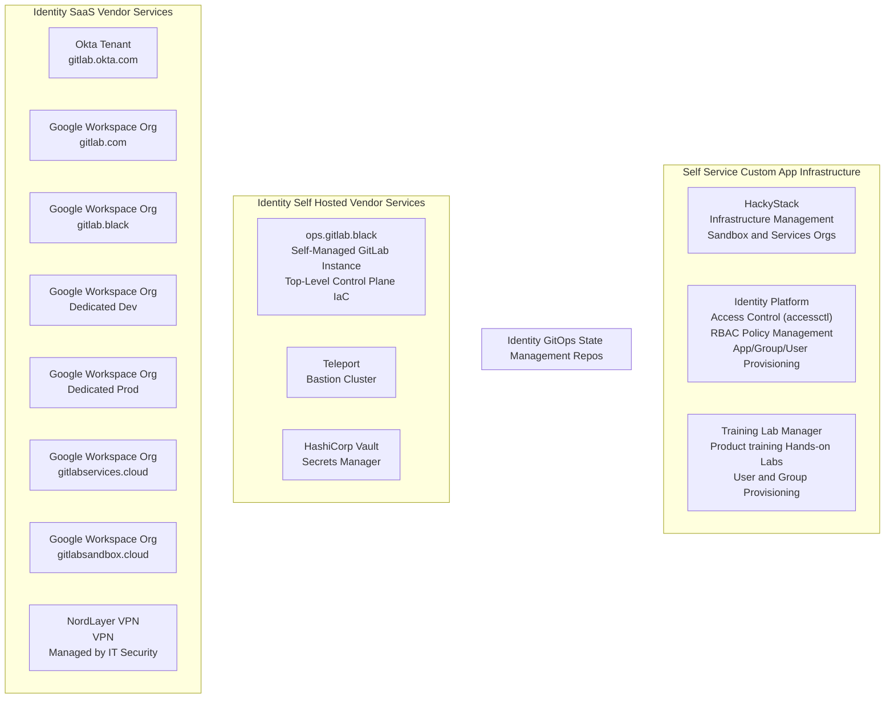

## Business Kingdom

The [GitLab Tech Stack](/handbook/business-technology/tech-stack-applications/) has a comprehensive list of all of the SaaS applications and vendors that we use. The Business Technology and IT team under the Finance division provide IT governance and procurement management for our [cross-department system owners](/handbook/business-technology/#cross-department-system-owners).

The primary focus for the IT team is on federating most applications with Okta SSO, with a focus on applications used across the organization, and any applications under SOX compliance or related to Finance, Legal, People, and Sales functions.

Learn more on the [tech stack handbook page](/handbook/business-technology/tech-stack-applications/) and [Okta handbook page](/handbook/it/okta/).

## Cloud Kingdom

We use Amazon Web Services (AWS) and Google Cloud Platform (GCP) at GitLab, with a few Microsoft-specific sandbox use case workloads running in Azure and a small GitLab SaaS Runner workload running in Oracle Cloud Infrastructure (OCI).

Each team is responsible for the workloads in their respective child AWS accounts, GCP projects, etc.

The Cloud Kingdom is managed by Security Identity with collaboration from counterparts in Infrastructure Security, Infrastructure, and SIRT. All access management is handled through standard baseline entitlements, access requests for production access, and [Sandbox Cloud](/handbook/company/infrastructure-standards/realms/sandbox/) for non-production access and dev/test accounts or projects.

See the [Identity Infrastructure](/handbook/security/identity/infrastructure) handbook page to learn more.

## Product SaaS Production (product-prd) Kingdom

The Product Tech stack refers to all of the infrastructure packages, services, and software that we use to any host GitLab.com SaaS, GitLab Dedicated, GitLab product source code and related services, and any customer-facing services related to our product.

The [Infrastructure Production Architecture](/handbook/engineering/infrastructure/production/architecture/) handbook page has more details on how services are managed. See the [Services Catalog](https://gitlab.com/gitlab-com/runbooks/-/blob/master/services/service-catalog.yml) for a non-exhaustive list of included services. You can also see the infrastructure-as-code configuration in the [config-mgmt](https://gitlab.com/gitlab-com/gl-infra/config-mgmt) repository.

Our counterparts in the Infrastructure department are responsible for the architecture, configuration, and management of the `Product Stack`.

## Product Dedicated (product-ded) Kingdom

The Dedicated Product Kingdom is managed by the Environment Automation team.

You can learn more on the [GitLab Dedicated Group handbook page](/handbook/engineering/infrastructure/team/gitlab-dedicated/).

## Black Ops Kingdom

We use [Access Level Wristband Colors](https://internal.gitlab.com/handbook/it/it-self-service/access-level-wristband-colors/) to provide separate `BLACK` user accounts for admin access. All admin accounts are managed with GitOps in an upstream control plane with the `gitlab.black` domain name. In alignment with the `ops.gitlab.net` nomenclature for our product kingdom configuration management, the admin-level configuration is managed in the `ops.gitlab.black` self-managed GitLab instance that we refer to as `Black Ops` (homeage to stealth operations, not intended as a military reference).

The Black Ops kingdom is managed by the Identity Infrastructure team.

