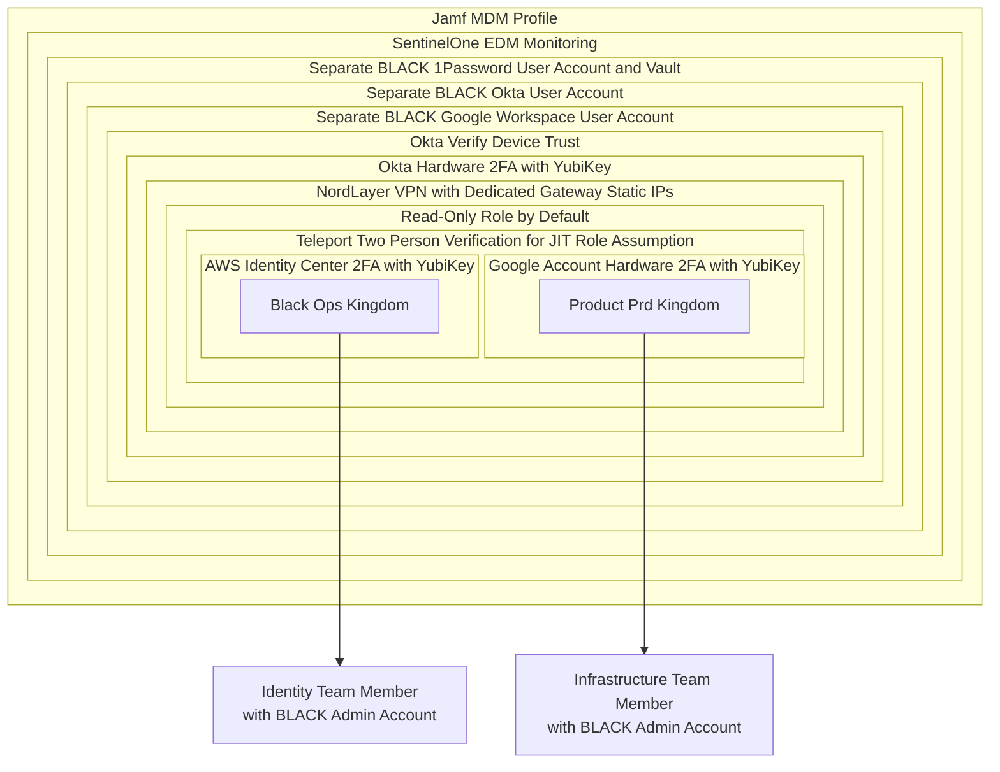

## Security Risk Disclaimer

As part of our transparency, we share this high level explanation of what we do, but do not publicly share the details of how we do it. By exposing this high-level overview, we tend to hear feedback from the community about shortcomings that we can remediate to improve our posture.

The world's source code is more secure when we collaborate on best practices together. If you are able to penetrate this, we'd love to talk to you about joining our team.

Please report any vulnerabilities using our bug bounty and responsible disclosure process.

## Castle Walls

### Administrative Kingdoms

## Insider Access Trust

The lateral movement controls in each kingdom are different and are not shared publicly. We have additional hidden monitoring controls in sensitive areas to ensure that all activities are monitored by cross-functional teams and actions are verified with the user and mapped to justification documentation (incidents/issues/tickets/etc).

As we iterate from GitLab Identity v2 to GitLab Identity v3, we will be refining our scoped access policies to prevent the potential for lateral movement.
