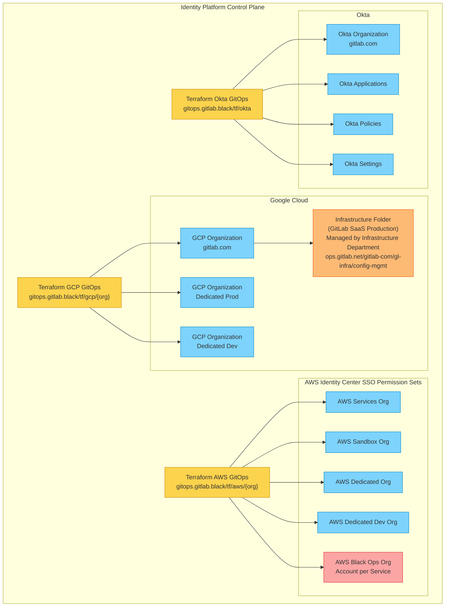

## Architecture Diagram

```mermaid
graph TB

subgraph Identity Platform Control Plane

BLACK_CI_TF_AWS["Terraform AWS GitOps<br />gitops.gitlab.black/tf/aws/{org}"]:::yellow
BLACK_CI_TF_GCP["Terraform GCP GitOps<br/>gitops.gitlab.black/tf/gcp/{org}"]:::yellow
BLACK_CI_TF_OKTA["Terraform Okta GitOps<br/>gitops.gitlab.black/tf/okta"]:::yellow

subgraph AWS Identity Center SSO Permission Sets
BLACK_AWS_SERVICES_ORG["AWS Services Org"]:::sky
BLACK_AWS_SANDBOX_ORG["AWS Sandbox Org"]:::sky
BLACK_AWS_DEDICATED_ORG["AWS Dedicated Org"]:::sky
BLACK_AWS_DEDICATED_DEV_ORG["AWS Dedicated Dev Org"]:::sky
BLACK_AWS_BLACK_OPS_ORG["AWS Black Ops Org<br/>Account per Service"]:::red
end

subgraph Google Cloud
BLACK_GCP_COM_ORG["GCP Organization<br/>gitlab.com"]:::sky
BLACK_GCP_COM_ORG_INFRA_FOLDER["Infrastructure Folder<br/>(GitLab SaaS Production)<br />Managed by Infrastructure Department<br />ops.gitlab.net/gitlab-com/gl-infra/config-mgmt"]:::orange
BLACK_GCP_DEDI_PROD_ORG["GCP Organization<br />Dedicated Prod"]:::sky
BLACK_GCP_DEDI_DEV_ORG["GCP Organization<br />Dedicated Dev"]:::sky
BLACK_GCP_COM_ORG --> BLACK_GCP_COM_ORG_INFRA_FOLDER
end

subgraph Okta
BLACK_OKTA_COM_ORG["Okta Organization<br/>gitlab.com"]:::sky
BLACK_OKTA_COM_APPS["Okta Applications"]:::sky
BLACK_OKTA_COM_POLICIES["Okta Policies"]:::sky
BLACK_OKTA_COM_SETTINGS["Okta Settings"]:::sky
end

end

BLACK_CI_TF_AWS --> BLACK_AWS_SERVICES_ORG
BLACK_CI_TF_AWS --> BLACK_AWS_SANDBOX_ORG
BLACK_CI_TF_AWS --> BLACK_AWS_DEDICATED_ORG
BLACK_CI_TF_AWS --> BLACK_AWS_DEDICATED_DEV_ORG
BLACK_CI_TF_AWS --> BLACK_AWS_BLACK_OPS_ORG
BLACK_CI_TF_GCP --> BLACK_GCP_COM_ORG
BLACK_CI_TF_GCP --> BLACK_GCP_DEDI_PROD_ORG
BLACK_CI_TF_GCP --> BLACK_GCP_DEDI_DEV_ORG
BLACK_CI_TF_OKTA --> BLACK_OKTA_COM_ORG
BLACK_CI_TF_OKTA --> BLACK_OKTA_COM_APPS
BLACK_CI_TF_OKTA --> BLACK_OKTA_COM_POLICIES
BLACK_CI_TF_OKTA --> BLACK_OKTA_COM_SETTINGS


classDef slate fill:#cbd5e1,stroke:#475569,stroke-width:1px;
classDef red fill:#fca5a5,stroke:#dc2626,stroke-width:1px;
classDef orange fill:#fdba74,stroke:#ea580c,stroke-width:1px;
classDef yellow fill:#fcd34d,stroke:#ca8a04,stroke-width:1px;
classDef emerald fill:#6ee7b7,stroke:#059669,stroke-width:1px;
classDef cyan fill:#67e8f9,stroke:#0891b2,stroke-width:1px;
classDef sky fill:#7dd3fc,stroke:#0284c7,stroke-width:1px;
classDef violet fill:#c4b5fd,stroke:#7c3aed,stroke-width:1px;
classDef fuchsia fill:#f0abfc,stroke:#c026d3,stroke-width:1px;
```
