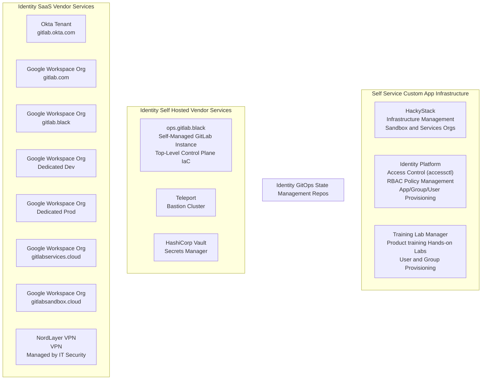
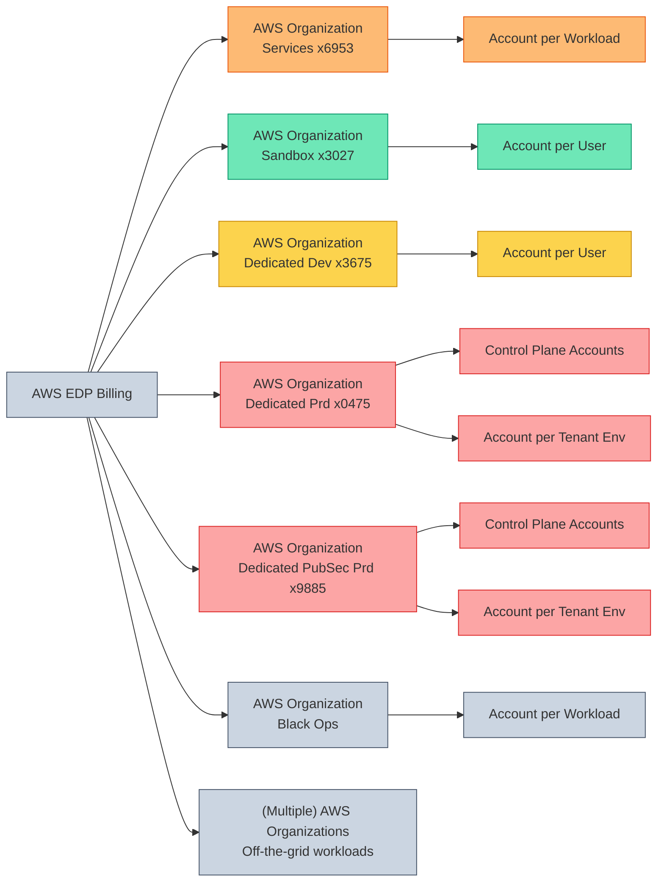
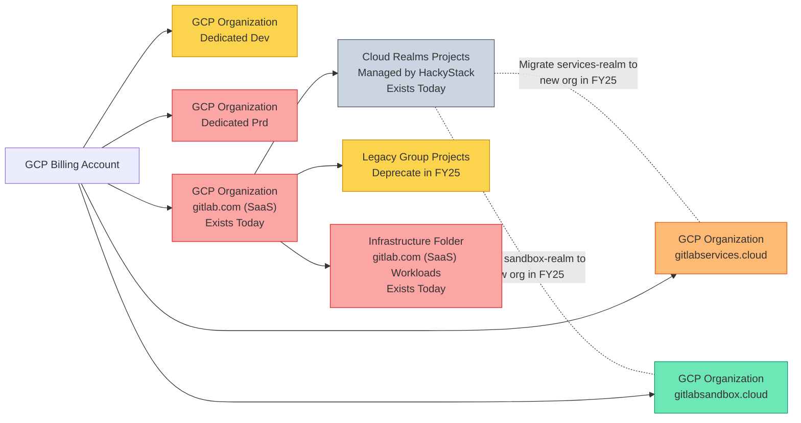
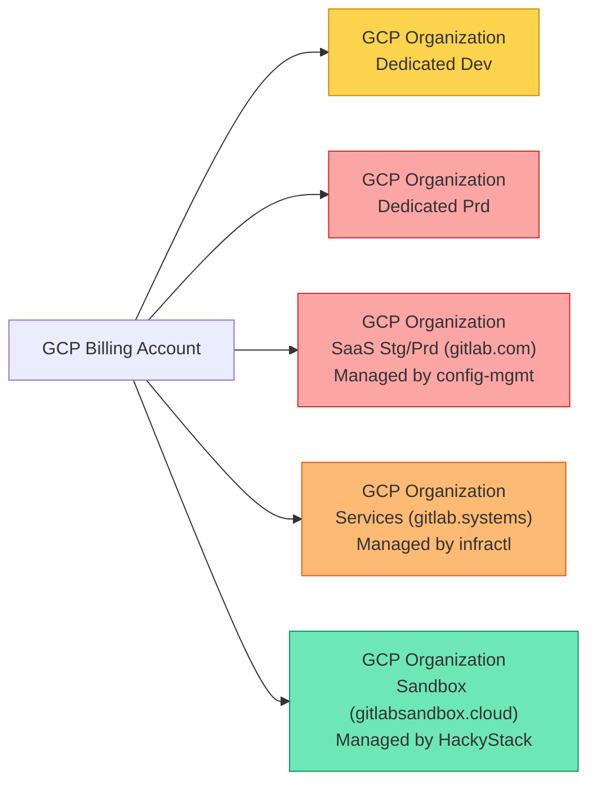

<link rel="stylesheet" type="text/css" href="/stylesheets/biztech.css" />

## Overview

All Cloud infrastructure with RED data is managed by the [Infrastructure](/handbook/engineering/infrastructure) department. All demo/dev/test/sandbox/staging/production infrastructure for ORANGE/YELLOW/GREEN data is created by the Identity team using our self service portal or through issue templates.

Every team member can self-service create an AWS account and GCP project using the Sandbox Cloud for their own experimentation. This is your personal sandbox and is not shared with others.

We provision AWS accounts and GCP projects for each service/workload that more than one user has access to.

We believe in "one account/project per workload" for security blast radius and cost attribution reasons. Do **not** deploy different functional applications in the same AWS account or GCP project that has your team's name on it. You simply need to use the issue template to request a new AWS account or GCP project.

- [Sandbox Cloud Documentation](/handbook/company/infrastructure-standards/realms/sandbox)
- Self Service: [Create an Individual AWS Account or GCP Project](/handbook/company/infrastructure-standards/realms/sandbox/#individual-aws-account-or-gcp-project)
- Issue Template: [Create a Service/Team/Workload AWS Account](https://gitlab.com/gitlab-com/business-technology/engineering/infrastructure/issue-tracker/-/issues/new?issuable_template=aws_group_account_create_request)
- Issue Template: [Create a Service/Team/Workload GCP Project](https://gitlab.com/gitlab-com/business-technology/engineering/infrastructure/issue-tracker/-/issues/new?issuable_template=gcp_group_account_create_request)
- Issue Template: [Add or Remove IAM Users from AWS Account](https://gitlab.com/gitlab-com/business-technology/engineering/infrastructure/issue-tracker/-/issues/new?issuable_template=aws_group_account_iam_update_request)
- Issue Template: [Add or Remove IAM Users from GCP Project](https://gitlab.com/gitlab-com/business-technology/engineering/infrastructure/issue-tracker/-/issues/new?issuable_template=gcp_group_account_iam_update_request)
- `#sandbox-cloud-questions` for non-production infrastructure questions
- `#security-identity-ops` and tag Jeff Martin or Vlad Stoianovici for organization-level questions

## Identity Site Reliability Engineering

Since the Identity team manages our administrative access control plane with our [BLACK accounts](https://internal.gitlab.com/handbook/it/it-self-service/access-level-wristband-colors/), we refer to this as the **Black Ops Kingdom** that includes the following services:

> For security reasons, any services with a `*.gitlab.black` subdomain use an internal IP address that are only accessible with VPN access (BLACK account users) or for service accounts with addresses that have been added to the firewall ACL.

- (Future) `ctl.gitlab.systems` - Our instance of `accessctl-ui` self-service portal for team members (end users) that allows access without VPN using Okta and Okta Verify device trust. For security reasons, the self-service portal focuses on read-only functionality and creating requests, however has no administrative capabilities.
- (Internal IP) `ctl.gitlab.black` - Our internal instance of `accessctl-api` API for administrative operations using the CLI with a valid API token when connected to the VPN.
- (Internal IP) `gitops.gitlab.black` - Self-managed GitLab instance with `accessctl-ci` policies, manifests, changelogs, cloud infrastructure organization-level configuration, and Identity configuration pipelines. This instance is hardened for least privilege and is only accessible by designated Security team members.
- (Future) `gitops.gitlab.systems` - Terraform environments for Services Cloud (powered by HackyStack)
- [gitops.gitlabsandbox.cloud](https://gitops.gitlabsandbox.cloud) - Terraform environments for Sandbox Cloud (powered by HackyStack)
- [gitlabsandbox.cloud](https://gitlabsandbox.cloud) - Our instance of HackyStack that provides self-service access to AWS and GCP for team members.
- (Future) `vault.gitlab.black` - HashiCorp Vault instance
- (Future) `teleport.gitlab.black` - Teleport Bastion instance

## Cloud Provider Organization Management

The Identity Infrastructure team manages our top-level cloud provider infrastructure organization-level management for AWS and GCP in collaboration with the [Infrastructure Security](/handbook/security/product-security/infrastructure-security) team.

Each team that deploys infrastructure resources is responsible for managing their own infrastructure workloads and DevOps operations using industry best practices. In other words, the Security team provides the scaffolding for your castle (Terraform templates) and provides hardened castle walls, while your team is responsible for anything you build inside the castle walls.

### AWS Organizations

### GCP Organizations

#### Current State

#### Future State

## Shared Responsibilities

We use a shared responsibility model for cloud providers.

### Identity Infrastructure Team

> Responsible for defining our kingdoms, castles, castle walls, and naming conventions. Focus on BLACK administrative control plane and provisioning and automation of ORANGE, YELLOW, and GREEN data infrastructure.

- Top-level AWS and GCP organization-level management, billing, IAM/RBAC
- Admin account administration and architecture
- Audit-related service accounts
- Infrastructure standards naming schema
- AWS Account creation
- GCP Project creation
- Azure sandbox user management
- Defining Identity Roles and Identity Groups
  - Managing AWS Identity Center Groups and Permission Sets
  - Managing Google Groups and User Memberships (using Identity Roles)
- Services Cloud Architecture and Automation (production-esque environments)
- Sandbox Cloud Architecture and Automation (dev/test environments)
- Tech debt reduction of legacy AWS accounts

### Infrastructure Security Team

> Responsible for security of all RED data infrastructure and cloud provider best practice configuration policies across all AWS and GCP organizations.

- Top-level AWS and GCP security policies
- Resource and workload configuration audit and risk remediation
- Least privilege and role-based access control assignments for GCP Projects, Roles, and Resources in RED data organizations
- Zero touch optimization for change and configuration management
- Just-in-time access controls for resources not already managed by Identity team
- All security related to infrastructure with RED data
- GCP Infrastructure (SaaS Production) Folder and Projects
- Tech Debt Reduction of legacy GCP projects

See the team's [handbook page](/handbook/security/product-security/infrastructure-security) to learn more.

### Infrastructure SaaS Platforms Team

> Responsible for product hosting, reliability, and scalability of customer-facing applications and services related to the GitLab product.

- GCP Infrastructure (SaaS Production) Folder and Projects
  - Architecture, deployment, and management of all product workloads
  - Reliability of customer-facing services in the [production architecture](/handbook/engineering/infrastructure/production/architecture)
  - Management of GitOps deployments using [config-mgmt](https://gitlab.com/gitlab-com/gl-infra/config-mgmt) and [runbooks](https://gitlab.com/gitlab-com/runbooks)
- Runway Infrastructure for Development Teams

See the team's [handbook page](/handbook/engineering/infrastructure) to learn more.

### Services Cloud

Each team that deploys infrastructure resources is responsible for managing their own infrastructure workloads and DevOps operations using industry best practices.

In other words, the Security team provides the scaffolding for your castle and provides hardened castle walls, while your team is responsible for anything you build inside the castle walls.

### Sandbox Cloud Users (Engineers)

Each user is responsible for creating and destroying your own workloads.

See the [Sandbox Cloud handbook page](/handbook/company/infrastructure-standards/realms/sandbox) to learn more.
