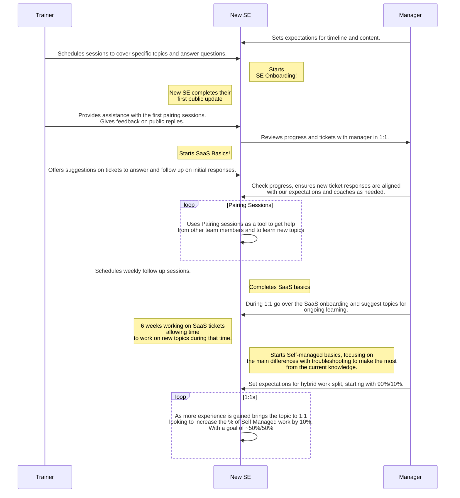

## Support Learning Pathways

All the learning pathways we have in Support are listed [here](https://gitlab-support-readiness.gitlab.io/support-team/skills-by-subject.html). Each pathway contains a set of modules, and a module may reside in multiple pathways.

To create an issue for yourself with one of the module templates:

- Click on the module you want to pursue from the [Skills Catalog](https://gitlab-support-readiness.gitlab.io/support-team/skills-catalog.html) page
- Title it as ***Your Name*: *Module Name***
- Assign it to yourself
- Now you're all set to follow the instructions in the module!

**NOTE:** Contact your [Onboarding Buddy](/handbook/support/training/onboarding_buddy) if you have any questions about these pathways. Buddies are always happy to help!

## Support hybrid model

The hybrid model is a structured training plan that will prepare you to work on [GitLab.com](https://docs.gitlab.com/subscriptions/gitlab_com/), [self-managed](https://docs.gitlab.com/subscriptions/self_managed/), and [GitLab Dedicated](https://docs.gitlab.com/subscriptions/gitlab_dedicated/) support issues. You may find these [checkpoints](/handbook/support/training/onboarding_hybrid_path_checkpoints) helpful while working through the hybrid model path.

## Overview of Support Onboarding

When you first join the team everything will be new to you. Don't worry! In order to get you started with GitLab quickly, apart from the company wide onboarding issue that will be assigned to you on Day 1 by PeopleOps, we also have an onboarding program in Support. There are two pathways:

1. [Support Engineer Onboarding Pathway](#support-engineer-onboarding-pathway)
1. [Support Manager Onboarding Pathway](#support-manager-onboarding-pathway)

**NOTE:** You can start the PeopleOps onboarding and the Support Onboarding at the same time, or you can complete PeopleOps and then switch to Support. Determine the best path with your manager.

## Support Engineer Onboarding Pathway

Your primary Support Engineer Onboarding Issue is created from the [New Support Team Member Start Here template](https://gitlab.com/gitlab-com/support/support-training/-/blob/main/.gitlab/issue_templates/New%20Support%20Team%20Member%20Start%20Here.md). This issue keeps track of your completion of the onboarding modules shown in the table below.

It is recommended that you start the modules in the order listed, but it depends on your learning style. Note that the specific learning pathway modules are not included in the list, and when you open and start working on those modules may differ from other team members as well.

For example, many Support Engineers on the "GitLab Support Learning Pathway" will open the "Working on Tickets" module to start pairing with others once they have parts of the various basics module completed. Similarly, prior experience with administering a self-managed GitLab instance may change the order you complete the modules as well. If you are unsure about how best to approach onboarding, please discuss it with your manager.

Typically, for a new team member in Support, completion of the below onboarding modules (including those in the Area of Focus Pathway) takes **approximately 6 weeks**. A new team member's first ticket reply ranges typically in their first 28 - 38 days (week 3 - 5 of Support onboarding).

| Module | Duration | Description |
| ------ | ------ | ------ |
| [Git & GitLab Basics](https://gitlab.com/gitlab-com/support/support-training/issues/new?issuable_template=Git%20and%20GitLab%20Basics) | 2 days | Understand our products and services |
| [Customer Service Skills](https://gitlab.com/gitlab-com/support/support-training/issues/new?issuable_template=Customer%20Service%20Skills) | 2 Days | Understand how we interact with customers, and how to utilize your customer service skills to ensure customer success |
| [GitLab Support Basics](https://gitlab.com/gitlab-com/support/support-training/issues/new?issuable_template=GitLab%20Support%20Basics) | 1 Day | Understand how GitLab Support operates and the most common workflows |
| [Zendesk Basics](https://gitlab.com/gitlab-com/support/support-training/issues/new?issuable_template=Zendesk%20Basics) | 1 Day | Utilize ZenDesk to perform ticket management |
| [Triaging Tickets](https://gitlab.com/gitlab-com/support/support-training/issues/new?issuable_template=Triaging%20Tickets) | 4 Days | Understand how to triage tickets including the triage view in Zendesk |
| [Customer Calls](https://gitlab.com/gitlab-com/support/support-training/-/issues/new?issuable_template=customer_calls) | 6-12 hours | Understand when and how to organize and lead successful calls with customers |
| [Documentation](https://gitlab.com/gitlab-com/support/support-training/-/issues/new?issuable_template=Documentation) | 1 Day | Become proficient in making documentation and merge requests |

### Choosing your initial Area of Focus

Work with your manager to decide your initial [Area of Focus](/handbook/support/support-engineer-responsibilities#support-engineer-areas-of-focus).

1. For GitLab (SaaS or Self-managed), complete the [GitLab Support Learning pathway](#gitlab-support-learning-pathway).
1. For License & Renewals, complete the [License and Renewals Learning Pathway](#license-and-renewals-learning-pathway).

### GitLab.com Administration access

Whenever GitLab.com administration access is required to complete any of the modules listed on this page, the training will direct you to the [GitLab-com Admin](https://gitlab.com/gitlab-com/support/support-training/-/issues/new?issuable_template=GitLab-com%20Admin) module.

### GitLab Support Learning Pathway

The GitLab Support pathway covers all platforms that we offer. In completing these modules, Support Engineers are expected to answer tickets submitted to any of them.

**NOTE:** As described in [Support hybrid model](#support-hybrid-model), engineers typically complete one Area of Focus, and then add another. Please discuss your timeline with your manager.

| Module | Duration | Description |
| ------ | ------ | ------ |
| [Working on Tickets](https://gitlab.com/gitlab-com/support/support-training/issues/new?issuable_template=Working%20On%20Tickets) | 2 Weeks | Help customers by pairing with Support Engineers and replying to tickets |
| [GitLab-com SaaS Basics](https://gitlab.com/gitlab-com/support/support-training/-/issues/new?issuable_template=GitLab-com%20SaaS%20Basics) | 2 Weeks | Understand the basics to answer GitLab.com (SaaS) product related tickets |
| [GitLab Installation & Administration Basics](https://gitlab.com/gitlab-com/support/support-training/issues/new?issuable_template=GitLab%20Installation%20and%20Administration%20Basics) | 1 Week | Understand the different ways in which GitLab can be installed and managed |
| [Self-Managed Support Basics](https://gitlab.com/gitlab-com/support/support-training/issues/new?issuable_template=Self-Managed%20Basics) | 2 Weeks | Understand the basics to answer Self Managed product related tickets |
| [GitLab Dedicated Basics](https://gitlab.com/gitlab-com/support/support-training/-/issues/new?issuable_template=GitLab%20Dedicated) | 1 Week | Understand the basics to answer GitLab Dedicated related tickets |

When these modules are complete:

1. Let your manager know that you are ready to [proceed to the appropriate on-call rotation training](#on-call-rotations).
1. With your manager, discuss how to describe your Area of Focus percentage in the [support-team project](https://gitlab.com/gitlab-support-readiness/support-team), removing onboarding.

### License and Renewals Learning Pathway

| Module | Duration | Description |
| ------ | ------ | ------ |
| [License and Renewals](https://gitlab.com/gitlab-com/support/support-training/-/issues/new?issuable_template=Subscriptions%20License%20and%20Renewals) | 2 Weeks | Understand the basics to answer our product's License and Renewals related tickets |
| [Working on Tickets](https://gitlab.com/gitlab-com/support/support-training/issues/new?issuable_template=Working%20On%20Tickets) | 2 Weeks | **Work concurrently with your L&R module** -- Help customers by pairing with Support Engineers and replying to tickets |

### On-call rotations

After you complete an Area of Focus, talk with your manager about joining an on-call rotation. Usually, you complete only one of these modules, and join only one on-call rotation.

| Module | Duration | Description |
| ------ | ------ | ------ |
| [GitLab.com CMOC](https://gitlab.com/gitlab-com/support/support-training/-/issues/new?issuable_template=GitLab-com%20CMOC) | 1 Day | Understand the responsibilities of being the [Communications Manager On Call (CMOC)](/handbook/engineering/infrastructure/incident-management/#roles-and-responsibilities) for an active GitLab.com incident |
| [Customer Emergencies](https://gitlab.com/gitlab-com/support/support-training/issues/new?issuable_template=Customer%20Emergencies) | 1 Week | Understand the responsibilities of being on-call for Customer Emergencies |

### Support Engineer Achievable Progress - First 6 Months

Our onboarding pathway gives new Support Engineers an opportunity to learn at their own pace and explore. We strongly believe in learning by doing ([70/20/10 learning model](https://trainingindustry.com/wiki/content-development/the-702010-model-for-learning-and-development/)), and encourage Support Engineers to start contributing on tickets (with public or internal comments) from as early as your 3rd week.

**NOTE:** The 6 months starts after your initial [Support Learning Pathways](#support-learning-pathways) are complete.

The following reference table can be used as a guideline on achieving comfort with ticket management in your first 6 months in GitLab Support. Managers can also use this table to gauge the progress of new hires in their first 6 months after onboarding.

**NOTE:** Table data is shown by month - for instance, in my 4th month as a SaaS-focus support engineer, I can aim to make about 60+ comments on tickets per month.

| Month | Public Comments per month Reference Range - Self-managed | Public Comments per month Reference Range - SaaS |
| ------ |  ------ | ------ |
| 1 | 0-10 | 0-20 |
| 2 | 10-30 | 20-40 |
| 3 | 30-50 | 40-60 |
| 4 | 50+ | 60+ |
| 5 | 60+ | 80+ |
| 6 | 70+ | 100+ |

---

### Ongoing learning

The modules in this section should eventually be taken regardless of your Area of Focus. The topics listed here can be completed in any order. Please discuss with your manager to determine which areas will be relevant to your work and the timing for completion.

| Module | Description |
| ------ | ------ |
| [GitLab Intermediate Topics](https://gitlab.com/gitlab-com/support/support-training/issues/new?issuable_template=GitLab%20Intermediate%20Topics) | Intermediate topics for both areas of focus |

### Additional Modules in the Support Training Project

We are continuously working on adding more modules and building out more learning pathways: you can find a list of all our current training modules and Modules in the [Support Training project](https://gitlab.com/gitlab-com/support/support-training/-/tree/main/.gitlab/issue_templates).

### Creating and viewing GitLab component based training

Anyone at GitLab can contribute to creating custom Support-specific training on how to use, configure or debug GitLab and its various components. Within the existing [Support Training Project](/handbook/support/training/) there is a directory named [Support Specific Trainings](https://gitlab.com/gitlab-com/support/support-training/-/tree/main/Support%20Specific%20Trainings ) that provides a means for storing shorter non-module-based training documents and videos. The directory contains a [ReadMe](https://gitlab.com/gitlab-com/support/support-training/-/blob/main/Support%20Specific%20Trainings/ReadMe.md) which provides specific instructions on how to add training material to the directory and where to upload any associated videos.

---

## Support Manager Onboarding Pathway

Your primary Support Manager Onboarding Issue is based on the [New Support Team Member Start Here template](https://gitlab.com/gitlab-com/support/support-training/-/blob/main/.gitlab/issue_templates/New-Support-Team-Member-Start-Here.md). This Issue keeps track of and completes the onboarding modules shown in the following table.

It is recommended that you complete the modules in the order listed, unless an issue mentions that you can start something else simultaneously. Typically, for a new manager in Support, completion of the below onboarding modules should take **3 weeks**.

| Module | Duration | Description |
| ------ | ------ | ------ |
| [Support Manager Basics](https://gitlab.com/gitlab-com/support/support-training/-/blob/main/.gitlab/issue_templates/Support-Manager-Basics.md) | 2 Weeks | Understand support management processes and workflows, including on-call rotations |
| [Git & GitLab Basics](https://gitlab.com/gitlab-com/support/support-training/-/blob/main/.gitlab/issue_templates/Git-GitLab-Basics.md) | 1 Week | Understand our products and services |
| [GitLab Support Basics](https://gitlab.com/gitlab-com/support/support-training/-/blob/main/.gitlab/issue_templates/GitLab-Support-Basics.md) | 1 Day | Understand how GitLab Support operates and the most common workflows |
| [ZenDesk Basics](https://gitlab.com/gitlab-com/support/support-training/-/blob/main/.gitlab/issue_templates/Zendesk-Basics.md) | 1 Day | Utilize ZenDesk to perform ticket management |
| [Triaging Tickets](https://gitlab.com/gitlab-com/support/support-training/issues/new?issuable_template=Triaging%20Tickets) | 4 Days | Understand how to triage tickets including the triage view in Zendesk |
| [Customer Emergencies](https://gitlab.com/gitlab-com/support/support-training/-/blob/main/.gitlab/issue_templates/Customer-Emergencies.md) | 1 Week | Understand the responsibilities of being on-call for Customer Emergencies |
| [SSAT Reviewing for Managers](https://gitlab.com/gitlab-com/support/support-training/-/blob/main/.gitlab/issue_templates/SSAT%20Reviewing%20Manager.md) | 1 day | Understand how to handle Support Satisfaction feedback results |

When this pathway is complete, let your manager know that you are ready to join the appropriate on-call rotations. (Your Support Manager Basics issue contains the instructions for this step.)

*As always, please submit an Issue or MR if you have suggestions on how this page could be better!*
