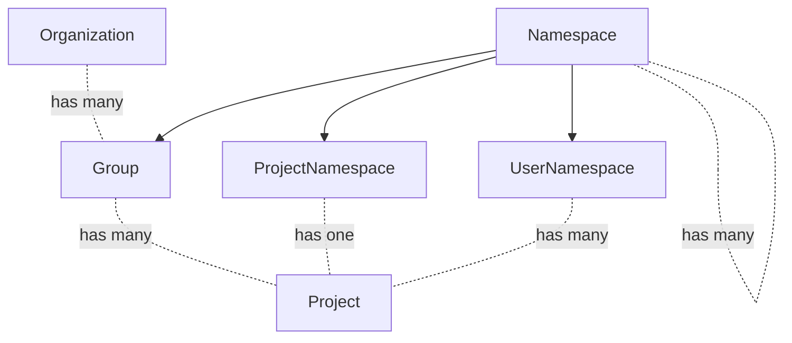
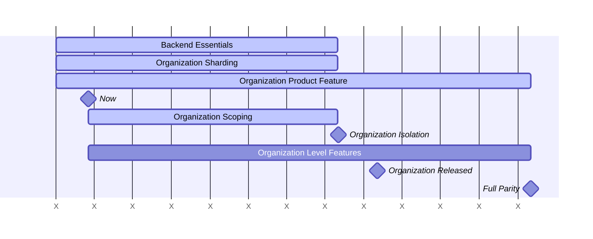



This document is a work in progress and represents the current state of the Organization design.

## Glossary

- User: A user account.
- Member: A User that belongs to an entity with a set of privileges represented by a role. A User can be a Member of one Organization, and many Groups and Projects within said Organization.
- Top-level Group: Top-level Group is the name given to the topmost Group of all other Groups. Groups and Projects are nested underneath the top-level Group.
- Organization: An Organization is the container for one or multiple top-level Groups. Organizations are isolated from each other.
- Organization Member: Organizations have many Users called Members. Only Organization Members have visibility of the Organization. Adding a User to a Group or Project within an Organization makes them an Organization Member.
- Default Organization: An Organization with `ID = 1` seeded on every GitLab instance.

## Summary

GitLab.com is a public shared installation of the GitLab software. This provides GitLab as a convenient SaaS but falls short of the full GitLab experience in important ways:

1. Parity: The features provided to a customer on GitLab.com and Self Managed
   are different. For example, on GitLab.com customers do not receive
   administrative privileges which accounts for a significant amount of
   functionality.
2. Isolation: On GitLab.com a customer can not exist independent of other
   customers like they do with a Self Managed installation.

Organizations will solve these problems by being a common container across all platforms. Through the creation of an Organization container we can enforce isolation boundaries, and provide a common entity for all top level features.

In effect, the Organization will wrap the Self Managed features into a container and bring this experience to all other GitLab platforms.

The isolation solution is also a pre-requisite for the [Cells project](https://docs.gitlab.com/ee/architecture/blueprints/cells/index.html) which is described in relation to Organization in [Organizations and Cells](cells.md).

## Frequently Asked Questions

If you have a specific question it may be answered within our [FAQ](faq.md) or you may also try to query [GitLab Duo Chat](https://docs.gitlab.com/user/gitlab_duo_chat/examples/) referencing the "Organization Blueprints".

### Splitting the GitLab.com Platform

The GitLab.com platform will be split into two distinct experiences.

Customers join GitLab.com today as a top level group within the default organization.
This experience will persist indefinitely in part to allow for a shared pool of users to contribute to open source projects.

GitLab.com will now expand its offering with a solution for private enterprise Organizations.
These enterprise Organizations will operate in complete isolation from all other Organizations, including the default organization.

Eventually it will be possible for customers to migrate out of the default
organization and into their own private Organization.

## Fundamentals of Organizations

- Organization will wrap around nearly all GitLab features.
- It won't be possible to read or write data between Organizations. Read more about [Organization Isolation](isolation.md).
- Many product features will remain unchanged, but most instance level features will move down and other features up to Organization level. Level changes are elaborated [below](#level-structure).
- Users can only be a Member of a single Organization.
- They can be owners of the Organization or just standard members.
- In future we will review the ability for Users to be a Member of multiple Organizations.
- Organization owners will have admin style privileges within their Organization, such as the ability to delete user accounts. More details [below](#roles-and-permissions).
- These changes will occur on all GitLab platforms including GitLab.com, Self Managed, and Dedicated.

## Organization Isolation

All Organization data and functionality in GitLab will be isolated.
Isolation means that data and features can never cross Organization boundaries.
This is covered in further detail at [Organization Isolation](isolation.md).

## Impact of the Organization on Other Domains

Here is a growing list of pages that describe in more detail how
Organization affects other parts of the system.

- [Billing](billing.md)
- [Cells](cells.md)
- [Settings](settings.md)
- [Users](users.md)

## Level Structure

Organization will form a new level that combines most Instance Level functionality and all of the Top Level Group functionality.

Instance Level will be reserved for infrastructure level settings.

Top Level Groups are a psuedo level that overload Group level with specific behavior.
This has been the defacto method of GitLab.com finding parity with Self Managed, until Organizations,

Below is a depiction of the current and future hierarchy levels within GitLab.

| Current Hierarchy         | Future Hierarchy |
| ------------------------- | -----------------|
| Instance Level            | Instance Level |
|                           | Organization Level |
| Top Level Group           | |
| Group                     | Group |
| Project                   | Project |

Only core features will be moved to Organization prior to Organization launch.
After launch all remaining features will move to the Organization level.

Here is an entity diagram of these levels:

## Roles and Permissions

Organizations will have an Owner role. Compared to other Organization Members, they can perform the following actions:

| Action | Owner | Member |
| ------ | ------ | ----- |
| View Organization settings | ✓ |  |
| Edit Organization settings | ✓ |  |
| Delete Organization | ✓ |  |
| Remove Users | ✓ |  |
| View Organization front page | ✓ | ✓ |
| View Groups overview | ✓ | ✓ (1) |
| View Projects overview | ✓ | ✓ (1) |
| View Users overview | ✓ |  |
| View Organization activity page | ✓ | ✓ (1) |
| Transfer top-level Group into Organization if Owner of both | ✓ |  |

(1) Members can only see what they have access to.

[Roles](https://docs.gitlab.com/ee/user/permissions.html) at the Group and Project level remain as they currently are.

## Relationship between Organization Owner and Instance Admin

Users with the (Instance) Admin role can currently [administer a self-managed GitLab instance](https://docs.gitlab.com/ee/administration/index.html).
As functionality is moved to the Organization level, Organization Owners will be able to access more features that are currently only accessible to Admins.
On our SaaS platform, this helps us in empowering enterprises to manage their own Organization more efficiently without depending on the Instance Admin, which is currently a GitLab team member.
On SaaS, we expect the Instance Admin and the Organization Owner to be different users.
Self-managed instances are generally scoped to a single organization, so in this case it is possible that both roles are fulfilled by the same person.
There are situations that might require intervention by an Instance Admin, for instance when Users are abusing the system.
When that is the case, actions taken by the Instance Admin overrule actions of the Organization Owner.
For instance, the Instance Admin can ban or delete a User on behalf of the Organization Owner.

## Routing

Today only Users, Projects, Namespaces and container images are considered routable entities which require global uniqueness on `https://gitlab.com/<path>/-/`.
Initially, Organization routes will be [unscoped](https://docs.gitlab.com/ee/development/routing.html).
Organizations will follow the path `https://gitlab.com/-/organizations/org-name/` as one of the design goals is that the addition of Organizations should not change existing Group and Project paths.

## Organization Development

Below is a high level development roadmap for Organizations.
The project is complicated and requires coordination across many engineering teams.
In response to this, the roadmap has been broken into the following broad phases.

### Milestones

Now (During FY26 Q1)
: Work has carried over from the Cells roadmap.

Organization Isolation (Target FY26 Q3)
: Complete database sharding to link tables back to an Organization where
possible.
: Prevent reads/writes from extending beyond Organization boundaries.

Organization Released (Target FY26 Q4)
: Organization as a minimal feature is released in the application. The nature of this release is still under discussion.

Full Parity (Target FY27 Q4 or beyond)
: GitLab.com will provide the same feature set as Self Managed and Dedicated but on a shared platform.

### Work Streams

#### Backend Essentials

This is foundational work to integrate the Organization at low levels of the code base.
Ensure all Organizations are equal by removing references to the Default Organization (ID = 1).
This is in part a carry over from the 2023 roadmap.

#### Organization Sharding

Tables, with a small number of exceptions, should be related to an Organization.
Organizational tables must have an `organization_id`, `namespace_id`, or a `project_id` column so all tables directly or indirectly belong to an Organization.
This work is currently located within this epic: https://gitlab.com/groups/gitlab-org/-/epics/13678.
All tables with an `organization_id` foreign key are defined with not null foreign key constraints.
All code paths are writing the correct `organization_id` value and are not relying on a default value.

#### Organization Product Feature

Build a user interface for the Organization including Organization membership management and dashboard.

We will include the following set of features in the initial Organization
target. In some cases we have intentionally restricted the problem scope and intend to expand on the solution later.

- **Creation**
  - A default organization is seeded during the installation process.
  - On GitLab.com Organizations can only be created during user registration.
  - Self Managed and Dedicated will not offer the option to create an
    Organization during registration.
  - An admin setting controls the ability to create Organizations. This setting is enabled on GitLab.com and disabled elsewhere.
  - In addition to the admin setting, a feature flag will control the ability to create Organizations. On GitLab.com, this feature flag will only be enabled for GitLab team members. Elsewhere this feature flag will be disabled by default. We will warn against enabling it, but will not be able to prevent self-managed instances from doing so.
- **Editing**
  - Organizations can be edited in the **Settings > General** section. Form fields include name, ID (readonly), description, avatar, and visibility. Only accessible by Organization Owners.
  - Organization slug can be changed in the **Settings > General** section. Only accessible by Organization Owners.
- **Visibility**
  - The Default Organization will be public, while every other organization will
    be private.
  - Requests made to non-Organization specific endpoints such as `/explore` will
    default to the default organization.
  - Private Organizations can only be seen by the Users that are part of the Organization. They can only contain private or internal Groups and Projects.
- **Users**
  - [Roles and permissions](#roles-and-permissions)
  - The creation of an Organization appoints the creating User as the Organization Owner.
  - Organization Owners can update the existing role of a user from User to Owner or vice versa.
  - There must be ast least one Organization owner per Organization.
  - A User can only be part of one Organization. A new account needs to be created for each Organization a User wants to be part of.
  - Organization Owners can delete users within their own Organization.
  - When a user becomes a member of a group or project they are also added as an Organization member. They receive an email informing them that they have been added to the Organization.
  - Removing a user from their last group or project should not remove them from the Organization.
  - Users can delete their own accounts. Users should not be able to delete their account when they are the last Owner of an Organization.
- **Groups**
  - All existing top-level Groups are part of the default Organization.
  - Groups can be created in an Organization.
  - Groups can be edited by the Organization Owner.
  - Groups can be deleted by the Organization Owner.
  - Organization members can view the groups they have access to in the Groups overview. The list of groups can be sorted and searched.
- **Projects**
  - All existing Projects on GitLab.com are part of the default Organization.
  - Projects cannot be created directly in an Organization, instead they are created in a group that belongs to an Organization.
  - Projects can be edited by the Organization Owner.
  - Projects can be deleted by the Organization Owner.
  - Organization members can view the projects they have access to in the Projects overview. The list of projects can be sorted and searched.
- **Activity**
  - Organization members can access the Activity page for the Organization.
- **Admin**
  - All created Organizations are listed in the Admin Area section `Organizations`.
  - Admins can assign the Owner or User role to new users.
  - Admins can update the existing role of a user.
  - Admins can delete a user and receive a warning about the user's Organization association. Admins cannot delete the last Organization Owner. They need to assign a new Owner first.
- **Navigation**
  - Current Organization context is indicated in the navigation sidebar.

#### Organization Level Features

Features will move from Instance Level and Top Level Group to Organization
Level. New features may also be built at the Organization Level. The focus
will begin with core features such as authentication and billing.

There is two phases to this work stream. The first phase is to migrate critical
features that make Organization viable. A second phase after Organization
release is to bring all remaining features to the Organization level.

## Data Exploration

From an initial [data exploration](https://gitlab.com/gitlab-data/analytics/-/issues/16166#note_1353332877), we retrieved the following information about Users and Organizations:

- For the users that are connected to an organization the vast majority of them (98%) are only associated with a single organization. This means we expect about 2% of Users have a need to navigate across multiple Organizations.
- The majority of Users (78%) are only Members of a single top-level Group.
- 25% of current top-level Groups can be matched to an organization.
  - Most of these top-level Groups (83%) are associated with an organization that has more than one top-level Group.
  - Of the organizations with more than one top-level Group the (median) average number of top-level Groups is 3.
  - Most top-level Groups that are matched to organizations with more than one top-level Group are assumed to be intended to be combined into a single organization (82%).
  - Most top-level Groups that are matched to organizations with more than one top-level Group are using only a single pricing tier (59%).
- Most of the current top-level Groups are set to public visibility (85%).
- Less than 0.5% of top-level Groups share Groups with another top-level Group.
  These groups will be unable to migrate to an Organization until we determine a solution.

Based on this analysis we expect to see similar behavior when rolling out Organizations.

## Decisions

- 2023-05-15: [Organization route setup](https://gitlab.com/gitlab-org/gitlab/-/issues/409913#note_1388679761)
- [001: Organization context resolution](decisions/001_organization_context_resolution.md)

## Links

- [Organization epic](https://gitlab.com/groups/gitlab-org/-/epics/9265)
- [Organization Isolation](isolation.md)
- [Organization: Frequently Asked Questions](faq.md)
- [Organization development guidelines](https://docs.gitlab.com/development/organization/)
- [Enterprise Users](https://docs.gitlab.com/ee/user/enterprise_user/index.html)
- [Cells blueprint](https://docs.gitlab.com/ee/architecture/blueprints/cells/index.html)
