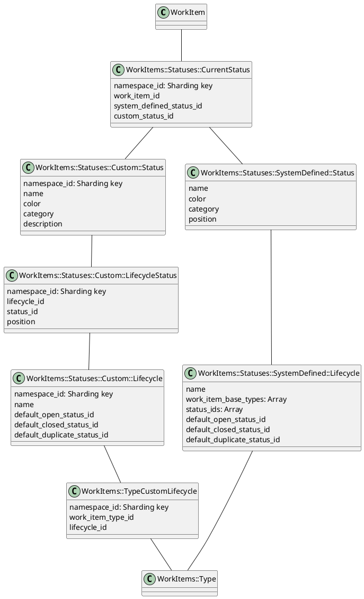

<!-- Design Documents often contain forward-looking statements -->
<!-- vale gitlab.FutureTense = NO -->

<!-- This renders the design document header on the detail page, so don't remove it-->


## Summary

This document outlines our approach to implementing a
[flexible status system for work items](https://gitlab.com/groups/gitlab-org/-/epics/5099) in GitLab.
We're evolving beyond the binary open/closed states and label-based status tracking by introducing proper status
fields with customization capabilities.

The solution introduces system-defined statuses as the foundation for Premium and Ultimate users, with users able to
add statuses, change status name or color, and alter the order of statuses.
We'll initially target Tasks before expanding to Issues, Epics and other work item types, while Free users will
continue using the binary open/closed state system.

This initiative lays the groundwork for users to more effectively manage work
item lifecycles and addresses problems caused by requiring labels for status
management.

## Timeline & status updates

1. Custom Status is the Plan Stage's highest priority in FY26Q2, and we've planned to deliver the first two iterations to General Availability by the 18.2 milestone
1. Status updates can be derived from the [custom statuses epic](https://gitlab.com/groups/gitlab-org/-/epics/5099)
   and the iteration child epics.

## Glossary

### Existing concepts and terms

1. **Work Item Type:** A classification that determines a work item's available features and behaviors
   through its associated widgets.
1. **Widget:** A functional component that provides specific capabilities to a work item type
   (for example "assignees" and "labels").
1. **State:** The fundamental binary classification of a work item as either 'open' or 'closed'.

### New concepts and terms

1. **Status:** A specific step in a work item's workflow ("In progress", "Done", "Won't do")
   that belongs to a category and maps to a binary state (open/closed).
1. **Status category:** A logical grouping for statuses (triage, to_do, in_progress) that determines
   their effect on a work item's state (and icon).
1. **System-defined status:** A system-provided status that cannot be modified and that is available
   to get started with work item statuses.
1. **Custom Status:** A namespace-defined status that replaces system-defined statuses for all groups
   and projects within that namespace.
1. **Lifecycle:** A collection of statuses that can be applied to a work item type. It allows statuses
   to be grouped into meaningful workflows that can be reused consistently across types and namespaces.
1. **Status Widget:** The component that displays status and allows users to modify the status of a
   work item on list, board, and detail views.

## Motivation

GitLab currently relies on a combination of labels and two formal states (open/closed) to represent work item status.
This approach has significant limitations for teams managing complex workflows.
The binary open/closed system doesn't provide enough context about where items stand in a process, and overusing
labels for status tracking creates inconsistency and management overhead.

### Goals

1. Expand work item status beyond the binary open/closed system to represent more workflow stages
1. Improve context on the status of work items
1. Enable better reporting on the reasons for closing issues (completed vs. duplicated/moved/won't do)
1. Enhance lead/cycle time calculations by distinguishing active time from waiting time
1. Build on top of our work item system to leverage status for all work item types
1. Reduce reliance on labels for tracking status

### Non-Goals

1. Make status usable beyond the work items framework (for example for other entities outside the framework).
1. Force every status-like functionality into work item status (for example incident paging status and requirements verification status)

## Proposal

We propose implementing a flexible status system for work items in GitLab, built around these core concepts:

1. Status is available for Premium and Ultimate customers.
1. Free customers continue to use state (open/closed) and labels.
1. Customizable workflows through lifecycles that can be applied to work item types and that hold statuses.
1. System-defined statuses as a starting point.
1. Allow users to create and modify status and lifecycles as custom statuses and custom lifecycles.
1. Sync state and status along the workflow to ensure consistency and compatibility.
1. Use the work item framework and widget concepts and the GraphQL API.
1. Migration tools to assist users in transitioning from workflow labels to the new status system.

## Design and implementation details

This section outlines the core concepts, implementation architecture, and rollout plan
for the new work item status system in GitLab.
We'll explore the key components and detail how they interact to create a flexible,
scalable status management solution.

### Core Concepts

#### Lifecycles

Lifecycles function as a holder for statuses and can be applied to work item types.
They define which statuses are available for items of a given work item type.

**For example:** In a customers root group, issues should use the "Engineering" lifecycle,
tasks "Kanban", and epics, objectives, and key results the "Strategy" lifecycle.
All lifecycles reuse the "Done" and "Won't do" statuses, but overall the number of statuses and
their position is different.

We start with providing one default lifecycle for work item types like tasks, issues, epics,
objectives and key results.

Service Desk tickets may use a different lifecycle with different statuses like `waiting for first response`,
`waiting for customer` and `waiting for next response`. But that is to be defined.
[See this discussion](https://gitlab.com/gitlab-org/gitlab/-/issues/498393#note_2314175535) to learn more.

There's a limit of `50` lifecycles per namespace.

#### Statuses

A status can be used in multiple lifecycles and can be attached to a work item based on the available lifecycle of
the work item type and namespace. The default lifecycle contains these statuses:

- `To do`
- `In progress`
- `Done`
- `Won't do`
- `Duplicate`

There's a limit of max. `70` statuses per namespace. A max. of `30` statuses can be attached to a lifecycle.

#### Status Categories

Statuses are organized into categories that are not user-configurable that determine their behavior:

```ruby
CATEGORIES = {
  triage: 1, # Exists but without system-defined status
  to_do: 2,
  in_progress: 3,
  done: 4,
  canceled: 5
}.freeze
```

The category is only visible in the management area of statuses and not in list, detail and board views.
The category defines the icon of the status.

#### Status-State Relationship and Transitions

Status builds on top of the existing state system (open and closed).
We need to transition work items automatically when either state or status change according to the following rules:

- Statuses in `done` and `canceled` categories automatically set work items to `closed` state
- All other categories maintain work items in `open` state
- The lifecycle defines default transition statuses (this is true for both system-defined and custom lifecycles):
  - Default Open Status: Applied when creating and reopening items
  - Default Closed Status: Applied when closing items
  - Default Duplicated Status: Applied when marking items as duplicates (or moved, promoted TBD)

### Implementation Architecture

#### Distinction between system-defined and custom entities

We've decided against prepopulating statuses for each root namespace, as this approach would make modifying or extending
statuses more challenging and significantly increase the database table size. Instead, we're introducing system-defined
statuses and lifecycles as defaults, which can then be customized into custom statuses and lifecycles.

The [Cells initiative](../cells/_index.md) aims to make our platform horizontally scalable and resilient.
To achieve this, we need a sharding key in every database table.
Sharding keys cannot be `null`, and we're discouraged from using a custom sequence (such as using `-1` for
system-defined statuses or lifecycles, or reserving the first `1,000` IDs for system-defined entities).

Because system-defined data doesn't belong to a namespace and can be considered global, we need to handle it separately.
For all other tables, we'll use `namespace_id` as the sharding key.

We considered three options for managing system-defined entities:

1. Define system-defined entities in code (chosen approach)
2. Store system-defined data in a separate table
3. Use a single table and reserve first `1_000` IDs with a custom `CHECK` constraint

We've chosen to implement the first option: defining system-defined entities in code. This approach offers the
best balance of simplicity, scalability, and maintainability for our system.

#### Fixed items models and associations

Since system-defined data is static per definition we can hard-code it and benefit from not hitting the database.
The challenge is that we cannot make joins and use ActiveRecord methods.

We introduce the concept of fixed items models that include a module that adds ActiveRecord-like methods and defines
the static data in an array of hashes called `ITEMS`.

- [MR that introduces the abstraction modules](https://gitlab.com/gitlab-org/gitlab/-/merge_requests/179547)
- [MR that introduces the concrete models and associations](https://gitlab.com/gitlab-org/gitlab/-/merge_requests/181962)

For example:

```ruby
class StaticModel
  include ActiveModel::Model
  include ActiveModel::Attributes
  include ActiveRecord::FixedItemsModel::Model

  ITEMS = [
    {
      id: 1,
      name: 'To do'
    }
  ]

  attribute :id, :integer
  attribute :name, :string
end
```

ActiveRecord-like methods can be used like:

```ruby
StaticModel.find(1)
StaticModel.where(name: 'To do')
StaticModel.find_by(name: 'To do')
StaticModel.all
```

To make associations possible we introduce a custom association `belongs_to_fixed_items` which resolves associations
to fixed items models like this (`*_id` column needs to be present):

```ruby
class MyModel < ApplicationRecord
  include ActiveRecord::FixedItemsModel::HasOne

  belongs_to_fixed_items :static_model, fixed_items_class: StaticModel
end
```

The association can then be used as:

```ruby
m = MyModel.last
m.static_model # Returns fixed items model instance
m.static_model = StaticModel.find(1)
m.static_model_id = 1 # still possible
m.static_model? # Bool
m.save! # Saves association
```

#### Overview of classes



To encapsulate everything status related we use the `WorkItems::Statuses` namespace.

Starting from the `WorkItem` we'll create a join model called `WorkItems::Statuses::CurrentStatus` that holds the
status associations of a work item. We have separate columns `system_defined_status_id` and `custom_status_id` which map
to the different concepts of how we store system-defined and custom data.
The model itself abstracts that away and we just set and get a status (using `#status` and `#status=`).

We can determine on the root namespace level whether all descendants of the root namespace use
system-defined statuses or custom statuses.

For lists that collect work items from various root namespaces we won't check which status to use but instead check
for the availability of data on the join model.
If `custom_status_id` is set, use the custom status. If not use the system-defined status.
To efficiently fetch this data for work item lists, we use a
[bulk status resolver](https://gitlab.com/gitlab-org/gitlab/-/blob/master/ee/app/graphql/resolvers/work_items/statuses/bulk_status_resolver.rb)
which only adds two additional queries. One to load the join model and another to load custom statuses.

We use the fields `default_open_status_id`, `default_closed_status_id`, and `default_duplicate_status_id` to make
automatic state/status transitions possible.
When the assigned status for any of these changes, we won't change status for existing work items.
Instead we'll [use the newly assignes status for new transitions or new items only](https://gitlab.com/gitlab-org/gitlab/-/issues/498394#note_2450687886).

#### Namespace Configuration

Each root namespace exclusively uses either system-defined statuses or custom statuses.
When editing statuses for the first time, the system creates copies of all system-defined statuses as custom statuses.
All work items of this namespace and its descendants will need to be migrated from the old to the new statuses
(which will happen in the background). After that there's no way back to using system-defined statuses for this namespace.

Lifecycles and statuses can only be configured on the root namespace level in the first iterations.
It's to be defined how the mechanic to configure on a lower level will work and which restrictions will apply.

In dashboards and lists that render items from different root namespaces:
Statuses with the same name across different namespaces will be grouped in frontend filters (for example in dashboards).
The API call will include a filter with the grouped statuses in a `OR` condition.

For example: we filter for status `Done` which is available in two root namespaces (`A` and `B`).
The frontend filter only shows `Done`, but the API call will filter for `A::Done OR B::Done`.

#### API design

We use the existing work items GraphQL API and build on top of the work items widgets concept.

The API returns status related data of a work item in the `STATUS` widget.
We can get a list of available statuses for a given work item type in a namespace
by querying the widget definitions for the work item type.

We'll add concrete queries once the widget API is finalized.

##### Permissions

We've decided not to introduce new permissions for work item statuses. Instead, authorization is handled
by existing work item permissions like `read_work_item` or `update_work_item`.

This approach avoids redundant permission checks by leveraging GraphQL's higher-level query execution
for authorization, improving query performance by reducing the number of Permission checks.

Additionally, work item status-specific resolvers like `BulkStatusResolver` and `AllowedStatusesResolver`
ensure that the licensed feature is available and the feature flag is enabled before proceeding.

#### Status widget

We use the `STATUS` widget.

We already introduced the mock API using the widget name `CUSTOM_STATUS` because `STATUS` was already taken.
This legacy widget represents the verification status of requirements and should be renamed to `VERIFICATION_STATUS`.
We marked both widgets and fields as experiment in `17.9`, so we can rename them like this:

1. `STATUS` --> `VERIFICATION_STATUS` ([see MR](https://gitlab.com/gitlab-org/gitlab/-/merge_requests/182520))
1. `CUSTOM_STATUS` --> `STATUS` ([see MR](https://gitlab.com/gitlab-org/gitlab/-/merge_requests/183026))

#### Backfill status data for existing work items

##### Backfill System Defined Status

Each work item of a work item type that supports status should have a status assigned.
We'll backfill the `system_defined_status_id` on `work_item_current_statuses` table, before adding status support for a work item type.

To conserve database storage we'll only backfill status data for `open` work items.

Although custom status is a licensed feature, we will backfill status data for all work items
of a given work item type regardless of license.
We will also perform automatic status transitions for all items, including those that are open, closed, or marked as duplicates.

For example a newly created work item will receive the default open status,
and when closed, it will transition to the default closed status. Or when a closed work item without a status
would be reopened it would transition to default open status.

See the [discussion on this topic on this issue](https://gitlab.com/gitlab-org/gitlab/-/work_items/517342).

This approach ensures:

1. Status is immediately available when a namespace adds a license.
1. Work items maintain correct status assignments when a namespace changes tiers.

This significantly reduces complexity by eliminating the need for additional data migrations during namespace tier changes.

##### Backfill Custom Statuses (backup option)

Alternatively, as a backup, we've discussed the option of backfilling custom statuses records, with system defined values.
In this case we'd need to backfill not only `work_item_current_statuses`, but also for each root level Group we'd need to populate data in:

- `work_item_custom_statuses` - 5 records per root Group
- `work_item_custom_lifecycles` - 1 record per root Group
- `work_item_custom_lifecycle_statuses` - 5 records per each `work_item_custom_lifecycles` record
- `work_item_type_custom_lifecycles` - 2 records(Issue and Task) initially, per each `work_item_custom_lifecycles` record.

This results in more database storage used from the start.

The benefit being that we would not require an on-demand status migration from system defined statuses to
custom statuses, see Option 1 in [Status migration and migration wizard](#status-migration-and-migration-wizard) section.

#### Status migration and migration wizard

We need to migrate statuses of work items in the following cases:

1. A namespace transitions from system-defined statuses to custom statuses
1. A user applies a different lifecycle to a work item type
1. [A user creates statuses from labels or scoped labels](https://gitlab.com/gitlab-org/gitlab/-/issues/463083)
1. A status will be deleted and its assigned work items need to be migrated to a new status

We'll persist a mapping from one status to another in the database and run a job in the background
that updates the status association.

Optionally we'll also consider the mapping in list queries and include the old and new status during the migration.

We acknowledge that there might be a short time where status data is inconsistent in list views during migration.
This is especially true for namespaces with a large number of work items.

Details about the database structure and service architecture are to be defined.

### Namespaces downgrade to free tier

[We discussed implications of downtiering](https://gitlab.com/gitlab-org/gitlab/-/issues/498393#note_2294814031)
from using custom statuses to system-defined statuses.
The main takeaway is that it would introduce a decent amount of complexity to handle mapping existing
custom statuses to previously existing system-defined statuses.

Because of that [we decided that status will only be available in Premium and Ultimate tier](https://gitlab.com/gitlab-org/gitlab/-/issues/498393#note_2312781591).
When a customer transitions to the free tier, they won't see status anymore.
But we keep all status relevant data and associations and continue to do status/state transitions.
If they decide to uptier again, they'll see their custom statuses again and all work items will be in a correct status.

### Other status-like functionality

In GitLab we have entities with functionality that is comparable to work item status but represent something different
or are highly custom integrations for a specific purpose. While we have ideas on how to include these into work item
statuses, we refrain from doing so in the forseable future. Specifically we've evaluated this for:

1. **Incident paging status.** We plan to relabel this in the UI from "Status" to something else and when we migrate
   incidents to work items, we'll introduce this in a separate widget for now.
   [See this discussion for details](https://gitlab.com/gitlab-org/gitlab/-/merge_requests/181962#note_2365911203)
1. **Requirements verification status.** We're renaming the existing `STATUS` widget to `VERIFICATION_STATUS`
   and keep the functionality separate.

### Challenges

1. Because the incidents detail view won't be migrated to the work item detail view short-term,
   status won't be available for this work item type.
   It's to be defined whether we'll work on an intermittent solution or postpone adding status
   to incidents until the migration is completed.
   [See this discussion for details](https://gitlab.com/gitlab-org/gitlab/-/merge_requests/181962#note_2356993383)

### Feature flags and licensed feature

We'll use the feature flag `work_item_status_feature_flag` throughout the development of this feature.
The actor needs to be the root group.

For testing purposes, the feature flag is currently enabled in production for the Plan Stage testing
group called [gl-demo-ultimate-plan-stage](https://gitlab.com/gl-demo-ultimate-plan-stage).

We're using [this feature flag rollout issue](https://gitlab.com/gitlab-org/gitlab/-/issues/521286).

Since the feature will only be available in Premium and Ultimate tier, we consider it a licensed feature.
The feature name is `work_item_status`.
The name differs from the feature flag because we cannot use the same name.

### Implementation and release plan

We've identified these iterations for this initiative:

#### Iteration 1 (internal dogfooding)

- [Iteration 1 epic](https://gitlab.com/groups/gitlab-org/-/epics/14793)
- Implement system-defined status and join model
- Make the status widget visible on Tasks only
- Implement status setting and viewing functionality
- Implement state/status transitions
- Add `/status` quick action

We want to [dogfood the first iteration internally](https://gitlab.com/gitlab-org/gitlab/-/issues/527255#note_2423284340)
to gather early feedback.
To make this happen we'll [use the following approach](https://gitlab.com/gitlab-org/gitlab/-/issues/527255#note_2430372132):

1. Continue to use the `work_item_status_feature_flag` for the full GA release.
1. Move the parts we want to dogfood to `work_items_beta` feature flag which is enabled for the
   `gitlab-org` and `gitlab-com` groups.
   This way we only release the feature internally and are still able to disable the feature.
1. We'll use this [rollout issue](https://gitlab.com/gitlab-org/gitlab/-/issues/533557).

#### Iteration 2 (GA)

- [Iteration 2 epic](https://gitlab.com/groups/gitlab-org/-/epics/14794)
- Implement custom statuses
- Expand support to Issues
- Board integration (Issues only)
- Filter by a single status on list views (if ready only work item list, else legacy list, no support for legacy epic list)
- Status management (create, update, reorder, delete)

Iteration 2 is the GA release. The following changes need to happen to change from internal dogfooding to GA:

1. Change the feature flag of the internal dogfooding paths back to `work_item_status_feature_flag`.
1. Enable the feature flag by default in the same MR.

##### Nice to have

- Migration from labels to statuses

#### Iteration 3 (fast follow)

- [Iteration 3 epic](https://gitlab.com/groups/gitlab-org/-/epics/17798)
- Expand support to epics: epic detail view, epic list view, legacy epic board view. If the new board experience becomes available,
skip implementing the legacy epic board view and focus on the new experience instead.

#### Iteration 4

- [Iteration 4 epic](https://gitlab.com/groups/gitlab-org/-/epics/14795)
- Customizable status for all work item types
- Lifecycle management (create, update, assign work item types, delete)
- Status available on dashboards (more complex because they can be fed by different root namespaces)
- Calculations for milestone and iteration burndown

#### Future iterations

- [Future iterations epic](https://gitlab.com/groups/gitlab-org/-/epics/16448)
- Customize lifecycles / statuses at any hierarchy level (group, subgroup project)

## Internationalization

[System-defined statuses will only use english names](https://gitlab.com/groups/gitlab-org/-/epics/14793#note_2359390868).
Customers can customize statuses to match their preferred language.

## Alternative Solutions

### Do nothing and continue to use state and labels

**Pros:**

- No change to existing workflows
- No development cost

**Cons:**

- Doesn't address customer feedback about label overuse
- Doesn't provide a first-class status integration into the product
- Limits reporting capabilities

## Decision registry

This section documents key architectural and implementation decisions made during the development of this feature.

1. Define system-defined entities in code rather than database tables.
1. [Status will only be available in Premium and Ultimate tier](https://gitlab.com/gitlab-org/gitlab/-/issues/498393#note_2312781591).
1. [No new permissions for work item statuses](https://gitlab.com/gitlab-org/gitlab/-/merge_requests/184128#note_2402077740). Reuse `read_work_item` and `update_work_item`.
1. Use the name `STATUS` widget for custom status. Rename existing `STATUS` widget to `VERIFICATION_STATUS`
   and rename `CUSTOM_STATUS` widget to `STATUS`.
1. [Statuses are unique across the namespace and are attached to a lifecycle](https://gitlab.com/gitlab-org/gitlab/-/work_items/517342#note_2359312888).
   We don't create new statuses for each lifecycle. So the status `done` may be attached to multiple lifecycles.
1. [System-defined statuses won't be internationalized](https://gitlab.com/groups/gitlab-org/-/epics/14793#note_2359390868).
   We only use english names.
1. We'll [dogfood iteration 1 internally](https://gitlab.com/gitlab-org/gitlab/-/issues/527255#note_2423284340).
   and use the release plan outlined in this document.
1. We'll [backfill only open work items](https://gitlab.com/gitlab-org/gitlab/-/issues/498395#note_2388702770)
   with a default open status.
1. We'll always add status data regardless of license to eliminate the need for additional data migrations during tier changes.
1. Once a namespace uses custom statuses, [there's no way back to system-defined statuses](https://gitlab.com/gitlab-org/gitlab/-/merge_requests/187267#note_2451249170).
1. When the default open/closed/duplicate status of a lifecycle is changed, [it only affects new transitions and new item creations](https://gitlab.com/gitlab-org/gitlab/-/issues/498394#note_2450687886).
1. [We decided on limits](https://gitlab.com/groups/gitlab-org/-/epics/17321#note_2451571648): max. `70` statuses and
   `50` lifecycles per namespace and `30` statuses per lifecycle.
1. We'll [set default open/closed statuses for all items of supported work item types](https://gitlab.com/gitlab-org/gitlab/-/merge_requests/187686#note_2456571060)
   regardless of feature flag state and license.
1. We'll [show the default open status as a preselected value on the work item create form](https://gitlab.com/gitlab-org/gitlab/-/issues/526531#note_2457132393).
1. We'll be implementing work item [status badge and filters in legacy issues list](https://gitlab.com/gitlab-org/gitlab/-/work_items/508015#note_2461199237).
1. [Expanding support to epics](https://gitlab.com/gitlab-com/content-sites/handbook/-/merge_requests/13402#note_2491127675), including the epic detail view, epic list view,
and legacy epic board view will be included in Iteration 3 (Fast follow). If the new board experience is available by the time of implementation, we'll skip the legacy board
view and focus on the new experience instead.
1. [Backfill Custom Statuses](#backfill-custom-statuses-backup-option) is added as a backup option if later on we determine that migration from system-defined statuses to custom statuses poses more challenges than initially foreseen

## Resources

1. [Top level epic for this initiative](https://gitlab.com/groups/gitlab-org/-/epics/5099)
1. Designs for [list/detail/board](https://gitlab.com/gitlab-org/gitlab/-/issues/383125)
1. Designs for [status management](https://gitlab.com/gitlab-org/gitlab/-/issues/431600)
1. Designs for [status migration wizard](https://gitlab.com/gitlab-org/gitlab/-/issues/463083)
1. [Initial spike work for first iteration](https://gitlab.com/gitlab-org/gitlab/-/issues/477863)
1. [Proof of concept (POC) for system-defined and custom statuses](https://gitlab.com/gitlab-org/gitlab/-/merge_requests/178180)

## Team

Please mention the current team in all MRs related to this document to keep everyone updated.
We don't expect everyone to approve changes.

```text
@gweaver @nickleonard @donaldcook @ntepluhina @msaleiko @aslota @deepika.guliani @stefanosxan
```

Feel free to mention the following people to spread the word:

```text
@johnhope @amandarueda @caitlinsteele
```
