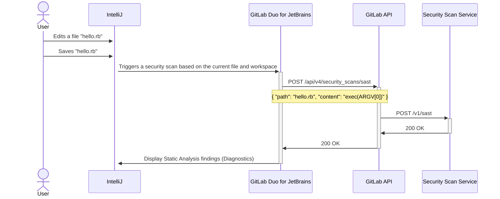

<!--
Before you start:

- Remove comment blocks for sections you've filled in.
  When your blueprint ready for review, all of these comment blocks should be
  removed.

To get started with a blueprint you can use this template to inform you about
what you may want to document in it at the beginning. This content will change
/ evolve as you move forward with the proposal.  You are not constrained by the
content in this template. If you have a good idea about what should be in your
blueprint, you can ignore the template, but if you don't know yet what should
be in it, this template might be handy.

- **Fill out this file as best you can.** At minimum, you should fill in the
  "Summary", and "Motivation" sections.  These can be brief and may be a copy
  of issue or epic descriptions if the initiative is already on Product's
  roadmap.
- **Create a MR for this blueprint.** Assign it to an Architecture Evolution
  Coach (i.e. a Principal+ engineer).
- **Merge early and iterate.** Avoid getting hung up on specific details and
  instead aim to get the goals of the blueprint clarified and merged quickly.
  The best way to do this is to just start with the high-level sections and fill
  out details incrementally in subsequent MRs.

Just because a blueprint is merged does not mean it is complete or approved.
Any blueprint is a working document and subject to change at any time.

When editing blueprints, aim for tightly-scoped, single-topic MRs to keep
discussions focused. If you disagree with what is already in a document, open a
new MR with suggested changes.

If there are new details that belong in the blueprint, edit the blueprint. Once
a feature has become "implemented", major changes should get new blueprints.

The canonical place for the latest set of instructions (and the likely source
of this file) is [here](/doc/architecture/blueprints/_template.md).

Blueprint statuses you can use:

- "proposed"
- "accepted"
- "ongoing"
- "implemented"
- "postponed"
- "rejected"

-->



## Summary

<!--
This section is very important, because very often it is the only section that
will be read by team members. We sometimes call it an "Executive summary",
because executives usually don't have time to read entire document like this.
Focus on writing this section in a way that anyone can understand what it says,
the audience here is everyone: executives, product managers, engineers, wider
community members.

A good summary is probably at least a paragraph in length.
-->

Support developers performing API-based Static Analysis Security Testing
[from their IDE](https://gitlab.com/groups/gitlab-org/-/epics/10283).

## Motivation

<!--
This section is for explicitly listing the motivation, goals and non-goals of
this blueprint. Describe why the change is important, all the opportunities,
and the benefits to users.

The motivation section can optionally provide links to issues that demonstrate
interest in a blueprint within the wider GitLab community. Links to
documentation for competing products and services is also encouraged in cases
where they demonstrate clear gaps in the functionality GitLab provides.

For concrete proposals we recommend laying out goals and non-goals explicitly,
but this section may be framed in terms of problem statements, challenges, or
opportunities. The latter may be a more suitable framework in cases where the
problem is not well-defined or design details not yet established.
-->

### Goals

**What is it trying to achieve?**

- Provide SAST results to Ultimate users running any GitLab Editor Extension.

**How will we know that this has succeeded?**

- Users with the required connectivity receive diagnostics for SAST findings.

**What are other less tangible opportunities here?**

- Defining how non-SAST security scan results may be presented in the IDE in the future.
- Populate IDE diagnostics from an existing SAST report.

### Non-Goals

**What is out of scope for this blueprint?**

- Defining how offline users will run analyzers locally.

## Proposal

Provide both local and API-based security scans against the current IDE workspace.

Pros:

- All platforms where we have GitLab Editor Extensions would support SAST findings.
- Scan service API could be implemented through a local service to consume existing local SAST reports.
- Offline users could use offline scan images or distributions.

Cons:

- We must deploy new infrastructure.
- We must be intentional in showing/hiding this feature based on the user,
  group, and project configuration.

## Decisions

- [001: Provide API-based security scans](decisions/001_provide_api-based_security_scans.md)

## Design and implementation details

<!--
This section should contain enough information that the specifics of your
change are understandable. This may include API specs (though not always
required) or even code snippets. If there's any ambiguity about HOW your
proposal will be implemented, this is the place to discuss them.

If you are not sure how many implementation details you should include in the
blueprint, the rule of thumb here is to provide enough context for people to
understand the proposal. As you move forward with the implementation, you may
need to add more implementation details to the blueprint, as those may become
an important context for important technical decisions made along the way. A
blueprint is also a register of such technical decisions. If a technical
decision requires additional context before it can be made, you probably should
document this context in a blueprint. If it is a small technical decision that
can be made in a merge request by an author and a maintainer, you probably do
not need to document it here. The impact a technical decision will have is
another helpful information - if a technical decision is very impactful,
documenting it, along with associated implementation details, is advisable.

If it's helpful to include workflow diagrams or any other related images.
Diagrams authored in GitLab flavored markdown are preferred. In cases where
that is not feasible, images should be placed under `images/` in the same
directory as the `index.md` for the proposal.
-->

## Remote scans

## Alternative Solutions

### Do nothing

The current experience for GitLab users in the IDE is that they must run separate
Static Analysis tools locally before pushing their code and waiting on their CI/CD
pipeline's security scan results.

### Run analyzers locally as offline analyzer

Pros:

- Local data and execution simplifies performance optimization
- A narrower usecase allows for a simpler, more tightly coupled design

Cons:

- We would need to start supporting binary distributions along with a release cycle that limits our ability to distribute rule refinements and bugfixes
- We would need to codesign our binaries especially for Mac OS.
- We would need to provide documentation for installation.
- We would need to provide tooling for installation.
