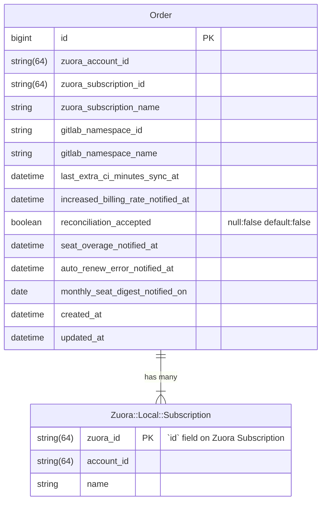

```mermaid
erDiagram
  "Zuora::Local::Subscription" ||--|{ "Zuora::Local::RatePlan" : "has many"
  "Zuora::Local::RatePlan" ||--|{ "Zuora::Local::RatePlanCharge" : "has many"
  "Zuora::Local::RatePlanCharge" ||--|{ "Zuora::Local::RatePlanChargeTier" : "has many"

  "Zuora::Local::Subscription" {
    string(64) zuora_id PK "`id` field on Zuora Subscription"
    integer version "null:false"
    integer current_term
    integer initial_term
    integer renewal_term
    datetime created_date "null:false"
    datetime updated_date "null:false"
    date term_start_date "null:false"
    date term_end_date
    date cancelled_date
    date subscription_start_date "null:false"
    date subscription_end_date
    boolean auto_renew "null:false default:false"
    string(3) eoa_starter_bronze_offer_accepted__c
    string(3) contract_auto_renew__c
    string(3) turn_on_auto_renew__c
    string(3) turn_on_operational_metrics__c
    string(3) turn_on_seat_reconciliation__c
    string(5) current_term_period_type
    string(7) turn_on_cloud_licensing__c
    string(7) marketplace_offer_type__c
    string(18) status
    string(64) account_id "null:false"
    string(64) previous_subscription_id
    string(64) invoice_owner_id "null:false"
    string(64) original_id "null:false"
    string(64) ramp_id
    string(64) created_by_id "null:false"
    string(64) updated_by_id "null:false"
    string(255) name "null:false"
    string(255) opportunity_id__c
    string(255) renewal_subscription__c__c
    string(255) external_subscription_id__c
    string(255) external_subscription_source__c
    string(255) git_lab_namespace_id__c
    string(255) git_lab_namespace_name__c
    string(255) marketplace_agreement_id__c
    string(255) marketplace_offer_id__c
    string(255) marketplace_fee_percentage__c
    string(500) notes
    datetime created_at
    datetime updated_at
  }

  "Zuora::Local::RatePlan" {
    string(64) zuora_id PK "`id` field on Zuora RatePlan"
    datetime created_date "null:false"
    datetime updated_date "null:false"
    datetime created_at "null:false"
    datetime updated_at "null:false"
    string(64) subscription_id FK "null:false"
    string(64) product_rate_plan_id "null:false"
    string(64) created_by_id "null:false"
    string(64) updated_by_id "null:false"
    string(255) name "null:false"
  }

  "Zuora::Local::RatePlanCharge" {
    string(64) zuora_id PK "`id` field on Zuora RatePlanCharge"
    integer version "null:false"
    integer segment "null:false"
    integer quantity
    integer mrr
    integer tcv
    integer dmrc
    integer dtcv
    datetime created_date "null:false"
    datetime updated_date "null:false"
    datetime created_at "null:false"
    datetime updated_at "null:false"
    date effective_start_date
    date effective_end_date
    boolean is_last_segment "null:false default:false"
    string(9) charge_type
    string(30) price_change_option
    string(50) charge_number "null:false"
    string(64) rate_plan_id FK "null:false"
    string(64) subscription_id "null:false"
    string(64) subscription_owner_id "null:false"
    string(64) product_rate_plan_charge_id "null:false"
    string(64) created_by_id "null:false"
    string(64) updated_by_id "null:false"
    string(100) name
    string(500) description
  }

  "Zuora::Local::RatePlanChargeTier" {
    string(64) zuora_id PK "`id` field on Zuora RatePlanChargeTier"
    integer tier
    decimal price "precision:18 scale:2"
    datetime created_date "null:false"
    datetime updated_date "null:false"
    datetime created_at "null:false"
    datetime updated_at "null:false"
    string(3) currency
    string(16) price_format
    string(64) rate_plan_charge_id FK "null:false"
    string(64) created_by_id "null:false"
    string(64) updated_by_id "null:false"
  }
```


## Summary

The [GitLab Customers Portal](https://customers.gitlab.com/) is an application separate from the GitLab product that allows GitLab Customers to manage their account and subscriptions, tasks like purchasing additional seats. More information about the Customers Portal can be found in [the GitLab docs](https://docs.gitlab.com/ee/subscriptions/customers_portal.html). Internally, the application is known as [CustomersDot](https://gitlab.com/gitlab-org/customers-gitlab-com) (also known as CDot).

GitLab uses [Zuora's platform](../../../../business-technology/enterprise-applications/guides/zuora/) to manage their subscription-based services. CustomersDot integrates directly with Zuora Billing and treats [Zuora Billing](../../../../finance/accounting/finance-ops/billing-ops/zuora-billing/) as the single source of truth for subscription data.

CustomersDot stores some subscription and order data locally, in the form of the `orders` database table, which at times can be out of sync with Zuora Billing. The main objective for this blueprint is to lay out a plan for improving the integration with Zuora Billing, making it more reliable, accurate, and performant.

## Motivation

Working with the `Order` model in CustomersDot has been a challenge for Fulfillment engineers. It is difficult to trust `Order` data as it can get out of sync with the single source of truth for subscription data, Zuora Billing. This has led to bugs, confusion and delays in feature development. An [epic exists for aligning CustomersDot Orders with Zuora objects](https://gitlab.com/groups/gitlab-org/-/epics/9748) which lists a variety of issues related to these data integrity problems. The motivation of this blueprint is to develop a better data architecture in CustomersDot for Subscriptions and associated data models which builds trust and reduces bugs.

### Goals

This re-architecture project has several multifaceted objectives.

- Increase the accuracy of CustomersDot data pertaining to Subscriptions and its entitlements. This data is stored as `Order` records in CustomersDot - it is not granular enough to represent what the customer has purchased, and it is error prone as shown by the following issues:
  - [Multiple order records for the same subscription](https://gitlab.com/gitlab-org/customers-gitlab-com/-/issues/6971)
  - [Multiple subscriptions active for the same namespace](https://gitlab.com/gitlab-org/customers-gitlab-com/-/issues/6972)
  - [Support Multiple Active Orders on a Namespace](https://gitlab.com/groups/gitlab-org/-/epics/9486)
- Continue to align with Zuora Billing being the SSoT for Subscription and Order data.
- Decrease dependency and reliance on Zuora Billing uptime.
- Improve CustomersDot performance by storing relevant Subscription data locally and keeping it in sync with Zuora Billing. This could be a key piece to making Seat Link more efficient and reliable.
- Eliminate confusion between CustomersDot Orders, which contain data more closely resembling a Subscription, and [Zuora Orders](https://knowledgecenter.zuora.com/Zuora_Billing/Manage_subscription_transactions/Orders), which represent a transaction between a customer and merchant and can apply to multiple Subscriptions.
  - The CustomersDot `orders` table contains a mixture of Zuora Subscription and trials, along with GitLab-specific metadata like sync timestamps with GitLab.com. GitLab does not store trial subscriptions in Zuora at this time.

## Proposal

As the list of goals above shows, there are a good number of desired outcomes we would like to see at the end of implementation. To reach these goals, we will break this work up into smaller iterations.

1. [Phase one: Build models for Zuora subscriptions local copy](#phase-one-build-models-for-zuora-subscriptions-local-copy)

    The first iteration focuses on creating the foundation for the local copy for Zuora Subscription objects, including Rate Plans, Rate Plan Charges, and Rate Plan Charge Tiers, in CustomersDot. This involves creating the database tables and models for the local copy of resources.

    [Phase 1: Build Zuora Cache Models (&11751)](https://gitlab.com/groups/gitlab-org/-/epics/11751)

1. [Phase two: Implement sync and backfill of Zuora subscriptions local copy](#phase-two-implement-sync-and-backfill-of-zuora-subscriptions-local-copy)

    The second iteration involves establishing a sync between Zuora and the newly introduced models. Additionally, existing Zuora Subscription data will need to be backfilled to ensure seamless integration and data consistency.

    [Phase 2: Implement Zuora Cache Sync and Backfill (&13630)](https://gitlab.com/groups/gitlab-org/-/epics/13630)

1. [Phase three: Utilize Zuora subscriptions local copy](#phase-three-utilize-zuora-subscriptions-local-copy)

    In the third phase, the objective is to leverage the Zuora subscriptions local copy introduced in phase one and synchronized in phase two. The focus will be on replacing any code in CustomersDot that currently makes read requests to Zuora for Subscription data with ActiveRecord queries. This shift should lead to a significant performance improvement.

    [Phase 3: Utilize Zuora Cache Models (&11752)](https://gitlab.com/groups/gitlab-org/-/epics/11752)

1. [Phase four: Transition from `Order` to `Subscription`](#phase-four-transition-from-order-to-subscription)

    The next iteration focuses on trimming down the `Order` model and resolving data consistency issues.

    [Phase 4: Replace CDot Order with Subscription (&11753)](https://gitlab.com/groups/gitlab-org/-/epics/11753)

- Note: The implementation of the local models doesn't match a traditional cache, as such it was decided to refer to them as local copy instead. The references to cache were updated accordingly, except the names of the completed and in progress issues.

## Design and implementation details

### Phase one: Build models for Zuora subscriptions local copy

The first phase for this blueprint focuses on adding new models for caching Zuora Subscription data locally in CustomersDot. These local data models will allow CustomersDot to query the local database for Zuora Subscriptions. Currently, this requires querying directly to Zuora which can be problematic if Zuora is experiencing downtime. Zuora also has rate limits for API usage which we want to avoid as CustomersDot continues to scale.

This phase will consist of writing migrations to create the new database tables and building the new data models. This involves analyzing what data attributes from these Zuora resources are needed by the CustomersDot application and ensuring they are built into the migrations with appropriate data types and limitations. The new data models will need validations and assocations set up as well.

#### Proposed DB schema



#### Notes

- The namespace `Zuora` is already taken by the classes used to extend `IronBank` resource classes. These classes will be moved to the namespace `Zuora::Remote` to indicate these are intended to reach out to Zuora. This frees up the `Zuora` namespace to be used for other purposes in later Phases.
- The new models related to Zuora subscriptions local copy will be added to the namespace `Zuora::Local`. This has nice symmetry with `Zuora::Remote` and makes it clear which classes refer to the remote Zuora data source or the local data source.
- All versions of Zuora Subscriptions will be stored in this table to be able to support display of current as well as future purchases when Zuora is down. One of the guiding principles from the Architecture Review meeting on 2023-08-06 was "Customers should be able to view and access what they purchased even if Zuora is down". Given that customers can make future-dated purchases, CustomersDot needs to store current and future versions of Subscriptions.
- `zuora_id` would be the primary key given we want to avoid the field name `id` which is magical in ActiveRecord.
- The timezone for Zuora Billing is configured as Pacific Time. Let's account for this timezone as we sync data from Zuora into CDot's cached models to allow for more accurate comparisons.

### Phase two: Implement sync and backfill of Zuora subscriptions local copy

The second phase for this blueprint focuses building the mechanisms to keep the local data in sync with Zuora and backfilling the existing data. Ideally, the local cache models would be read-only for most of the application to ensure the data stays in sync. Only the syncing mechanism would have the ability to write to these models.

#### Keeping data in sync with Zuora

CDot currently receives and processes `Order Processed` Zuora callouts for Order actions like `Update Product` ([full list](https://gitlab.com/gitlab-org/customers-gitlab-com/-/blob/64c5d17bac38bef1156e9a15008cc7d2b9aa46a9/lib/zuora/order.rb#L26)). These callouts help to keep CustomersDot in sync with Zuora and trigger provisioning events. These callouts will be important to keeping `Zuora::Local::Subscription` and related local models in sync with changes in Zuora.

This existing callout would not be sufficient to cover all changes to a Zuora Subscription though. In particular, changes to custom fields may not be captured by these existing callouts. We will need to create custom events and callouts for any custom field in the Zuora subscriptions local copy in CustomersDot for any of these resources to ensure CDot is in sync with Zuora. This should only affect `Zuora::Local::Subscription` though as no custom fields are used by CustomersDot on any of the other proposed local resources at this time.

#### Read only models

Given the data stored in these new models are a copy of Zuora data, it will important to ensure these models are modified within the appropriate context, not throughout the application. We want a clear separation when a local copy of a resource can be in "write" mode versus "read-only" mode. This separation helps avoid writing to the local copy of a resource inappropriately or mistakenly. We considered different options as part of [this Spike issue](https://gitlab.com/gitlab-org/customers-gitlab-com/-/issues/8511).

We aligned on creating a concern, `ReadOnlyRecord`, that will prevent a save when included in an ActiveRecord model.

```ruby
module ReadOnlyRecord
  extend ActiveSupport::Concern

  included do
    after_initialize :readonly!
  end
end
```

- Attempting to save (e.g. create, update, or destroy) one of these models would raise an error (e.g. `ActiveRecord::ReadOnlyRecord: Subscription is marked as readonly`)
- Even with this code, a record could still be deleted with `record.delete`. We could write a RuboCop rule for avoiding using delete (possibly even for just these ReadOnlyModels). We could also overwrite this method to raise an error as well.
- Within certain namespaces like the Zuora subscriptions local copy sync service, we want access to a model that have write privileges.

#### Rollout of Zuora subscriptions local copy

With the first iteration of introducing the models for Zuora subscriptions local copy, we will take an iterative approach to the rollout. There should be no impact to existing functionality as we build out the models, start populating the data through callouts, and backfill these models. Once this is in place, we will iteratively update existing features to use the Zuora subscriptions local copy instead of querying Zuora directly.

We will make this transition using many small scoped feature flags, rather than one large feature flag to gate all of the new logic using Zuora subscriptions local copy. This will help us deliver more quickly and reduce the length with which feature flag logic is maintained and test cases are retained.

Testing can be performed before Zuora subsctiptions local copy is used in the codebase to ensure data integrity of the models of subscriptions local copy.

### Phase three: Utilize Zuora subscriptions local copy

This phase covers the third phase of work of the Orders re-architecture. In this phase, the focus will be utilizing the new models for Zuora subscriptions local copy introduced in phase one. Querying Zuora for Subscription data is fundamental to Customers so there are plenty of places that will need to be updated. In the places where CDot is reading from Zuora, it can be replaced by querying the local copy instead. This should result in a big performance boost by avoiding third party requests, particularly in components like the Seat Link Service.

This transition will be completed using many small scoped feature flags, rather than one large feature flag to gate all of the new logic using these models for local copy. This will help to deliver more quickly and reduce the length with which feature flag logic is maintained and test cases are retained.

### Phase four: Transition from `Order` to `Subscription`

The fourth phase for this blueprint focuses on trimming the `orders` table and resolving data consistency issues.

#### 1. Trimming `orders` table

We want to go over the below attributes and evaluate if their functionality can be replaced with methods. If it is feasible, we should remove the column from the `orders` table and add a new method for it in `Order` model.

- billing_account_id
- product_rate_plan_id
- subscription_id
- start_date
- end_date
- quantity
- amendment_type
- source

##### Current schema of orders table

| Column                             | Action                            |
| ---------------------------------- | --------------------------------- |
| customer_id                        | Handle in trials data migration * |
| product_rate_plan_id               | Evaluate and remove if feasible   |
| subscription_id                    | Evaluate and remove if feasible   |
| subscription_name                  | Keep                              |
| start_date                         | Evaluate and remove if feasible   |
| end_date                           | Evaluate and remove if feasible   |
| quantity                           | Evaluate and remove if feasible   |
| gl_namespace_id                    | Keep                              |
| gl_namespace_name                  | Keep                              |
| amendment_type                     | Evaluate and remove if feasible   |
| trial                              | Handle in trials data migration * |
| last_extra_ci_minutes_sync_at      | Keep                              |
| zuora_account_id                   | Keep                              |
| increased_billing_rate_notified_at | Keep                              |
| reconciliation_accepted            | Keep                              |
| source                             | Evaluate and remove if feasible   |
| seat_overage_notified_at           | Keep                              |
| auto_renew_error_notified_at       | Keep                              |
| billing_account_id                 | Evaluate and remove if feasible   |
| monthly_seat_digest_notified_on    | Keep                              |
| source_gl_namespace_id             | Keep                              |
| trial_type                         | Handle in trials data migration * |

- Trials data migration is being done as part of https://gitlab.com/gitlab-org/customers-gitlab-com/-/issues/11047

#### 2. Resolving data issues

There should be only one order per subscription name, but there are a few duplicates present. These duplicates are created because of the current behavior when processing an `Order Processed` callout in CDot if the `zuora_account_id` changes for a Zuora Subscription.

  1. The Billing Account Membership is updated to the new Billing Account for the CDot `Customer` matching the Sold To email address.
  1. CDot attempts to find the CDot `Order` with the new `billing_account_id` and `subscription_name`.
  1. If an `Order` isn't found matching this criteria, a new `Order` is created. This leads to two `Order` records for the same Zuora Subscription.

This should be fixed and existing duplicates should be removed.

To resolve existing duplicates we need to -

  1. Determine which record to keep in case of duplicate, and add rake task to delete the appropriate data
  1. Add unique db constraint and model validation for subscription_name + zuora account id

Subscription related data such as `start_date`, `end_date`, `quantity`, `amendment_type` can be delegated to the latest subscription.

To find the latest subscription you just need its name:

- ID refers to a specific version
- Name is common for all versions of a subscription

The `zuora_subscription_id` could be set to the latest version on typical updates. Most of the data on `Order` is GitLab metadata (e.g. `last_extra_ci_minutes_sync_at`) so it wouldn't need to be updated.

#### 3. Rename `Order` and/or `Subscription` (TBD)

Renaming the `Order` model and `orders` table could eliminate confusion around the `Order` model. The data stored in the CustomersDot `Order` model does not correspond to a Zuora Order. As `Order` more closely resembles a Zuora Subscription with some additional metadata about syncing with GitLab.com, it could be renamed to `Subscription`.

The rename of `Order` model is up for debate given a `Subscription` model already exists.

#### Proposed DB schema



#### Notes

- This model serves as a record of the Subscription that is modifiable by the CDot application, whereas the `Zuora::Local::Subscription` table below should be read-only.
- There will be one `Subscription` record per actual subscription instead of a Subscription version.
  - This has the advantage of avoiding duplication of fields like `gitlab_namespace_id` or `last_extra_ci_minutes_sync_at`.
  - The `zuora_subscription_id` column could be removed or kept as a reference to the latest Zuora Subscription version.

##### Trial data

The CDot Order model contains paid subscription data, as well as trials data such as `customer_id`, `trial`, `trial_type`.

New tables and models for trial data were added in [Build new trial structures](https://gitlab.com/gitlab-org/customers-gitlab-com/-/merge_requests/9422). The migration of the trials data to these new structures is being handled as part of [Move GitLab.com Trials to use new data structure](https://gitlab.com/gitlab-org/customers-gitlab-com/-/issues/11047).

### Resources

- [FY24Q3 OKR - Create plan to align CustomersDot Orders to Zuora Orders](https://gitlab.com/gitlab-com/gitlab-OKRs/-/work_items/3378)
- [Epic &9748 - Align CustomersDot Orders to Zuora objects](https://gitlab.com/groups/gitlab-org/-/epics/9748)
