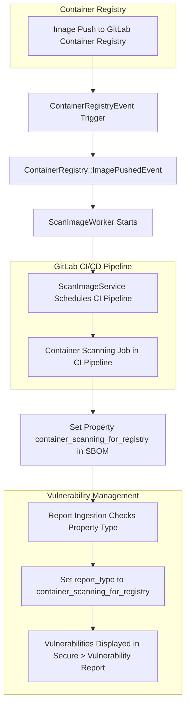



## Summary

The [Container Scanning for Registry](https://docs.gitlab.com/ee/user/application_security/container_scanning/#container-scanning-for-registry) feature enables the automatic execution of a container scanning job whenever a new image is pushed to the [GitLab container registry](https://docs.gitlab.com/ee/user/packages/container_registry/). This feature helps in identifying vulnerabilities in container images early in the development process.

## Motivation

Container Scanning scans Docker images when they are created during the pipeline. Images are then stored in the GitLab Container Registry, and can be reused by other pipelines and deployment processes as stable images that will land in production.

Security status can change at any time even if there are no code changes, for example if an unknown vulnerability is disclosed to the public.

Developers and security teams need to know the current security status of the images stored in the GitLab Container Registry. When the advisory database is updated, they need to know when new vulnerabilities apply to existing images. Similarly, they also need to know when new vulnerabilities are introduced when a new image is pushed into the registry.

## Goal

The primary goal of the Container Scanning for Registry feature is to enhance the security of containerized applications by automating the scanning process. This involves:

1. **Automating the Detection Process**: Ensuring that every new image pushed to the GitLab container registry is automatically scanned for vulnerabilities.
2. **Early Identification of Vulnerabilities**: Detecting and reporting vulnerabilities as soon as they are introduced.
3. **Facilitate adoption of Container Scanning**: Perform Container Scanning without requiring to configure a CI job in the `.gitlab-ci.yml` configuration file. A working runner is still required to execute the pipeline.
4. *Providing Comprehensive View**: Offering a detailed view of vulnerabilities that are accessible through a dedicated tab on the Vulnerability Report page.

## Design and implementation details

### How it's working

1. **Trigger**: When a new image is pushed to the GitLab container registry, a CI pipeline is automatically created with a container scanning job.
2. **Report Generation**: The reports generated by this job are marked with the report type `container_scanning_for_registry`.
3. **Vulnerability Reporting**: The vulnerabilities identified by this job are displayed under `Secure > Vulnerability Report` page in `Container Registry Vulnerabilities` tab.

### Implementation Details

#### Event Triggering

- **Event Class**: When a new image is pushed to the container registry, an event is fired using the class `ContainerRegistryEvent`.
  - **Source Code**: [ContainerRegistryEvent](https://gitlab.com/gitlab-org/gitlab/-/blob/415e8c1c144bd3b3fa42637ca93d3aa5fcc1f34d/lib/api/container_registry_event.rb#L5)

#### Image Pushed Event

- **Condition**: If the image tag is a supported tag, the necessary permissions and licenses are present, and the rate limit of 50 images scanned per project has not been exceeded, it publishes another event called `ContainerRegistry::ImagePushedEvent`.
  - **Source Code**: [ImagePushedEvent](https://gitlab.com/gitlab-org/gitlab/-/blob/415e8c1c144bd3b3fa42637ca93d3aa5fcc1f34d/ee/lib/ee/gitlab/event_store.rb#L63)

#### CI Pipeline Creation

- **Worker**: The `ImagePushedEvent` triggers the `ScanImageWorker`, which schedules a CI pipeline via `ScanImageService`.
  - **Source Code**: [ScanImageService](https://gitlab.com/gitlab-org/gitlab/-/blob/415e8c1c144bd3b3fa42637ca93d3aa5fcc1f34d/ee/app/services/app_sec/container_scanning/scan_image_service.rb#L28)

#### Container Scanning Tool Configuration

- **Environment Variable**: Based on the CI environment variable `REGISTRY_TRIGGERED: true`, the container scanning tool sets the GitLab property name to `container_scanning_for_registry` in the SBOM (Software Bill of Materials).
  - **Source Code**: [SBOM Converter](https://gitlab.com/gitlab-org/security-products/analyzers/container-scanning/-/blob/7257a06e4507c77ae50c4926e79142e2689e1fca/lib/gcs/sbom_converter.rb#L14)

#### Report Ingestion

- **Property Check**: During report ingestion, the system checks the property type and sets the `sbom_occurrence.source_type` to `container_scanning_for_registry`.
  - **Source Code**: [CycloneDX Properties Parser](https://gitlab.com/gitlab-org/gitlab/-/blob/415e8c1c144bd3b3fa42637ca93d3aa5fcc1f34d/lib/gitlab/ci/parsers/sbom/cyclonedx_properties.rb#L21)

#### Vulnerability Creation

- **Report Type**: During the creation of vulnerabilities, the `vulnerability#report_type` is set to `container_scanning_for_registry` based on `sbom_occurrence.source_type`. This report type filter is used by the frontend to distinguish these vulnerabilities from other types.
  - **Source Code**: [ContainerScanning FindingBuilder](https://gitlab.com/gitlab-org/gitlab/-/blob/415e8c1c144bd3b3fa42637ca93d3aa5fcc1f34d/ee/lib/gitlab/vulnerability_scanning/container_scanning/finding_builder.rb#L21)

## Architecture Diagram

This diagram captures the flow from the moment an image is pushed to the registry, through the event handling and CI pipeline, to the reporting and display of vulnerabilities. The various classes and services involved are highlighted at each step, providing a clear overview of the architecture.

### Outline of the diagram

1. **Image Push Event**:
   - When a new image is pushed to the GitLab Container Registry.

2. **ContainerRegistryEvent Trigger**:
   - The `ContainerRegistryEvent` class fires an event.

3. **ContainerRegistry::ImagePushedEvent**:
   - If the image tag is supported and permissions are valid, it triggers `ContainerRegistry::ImagePushedEvent`.

4. **ScanImageWorker**:
   - `ImagePushedEvent` starts `ScanImageWorker`.

5. **ScanImageService**:
   - `ScanImageWorker` schedules a CI pipeline via `ScanImageService`.

6. **Container Scanning Job**:
   - CI pipeline includes a container scanning job.

7. **SBOM Configuration**:
   - Based on `REGISTRY_TRIGGERED: true`, sets the property `container_scanning_for_registry`.

8. **Report Ingestion**:
   - During ingestion, sets `report_type` to `container_scanning_for_registry`.

9. **Vulnerability Report**:
   - Vulnerabilities are displayed in the **Secure > Vulnerability Report** page under **Container Registry Vulnerabilities** tab.
